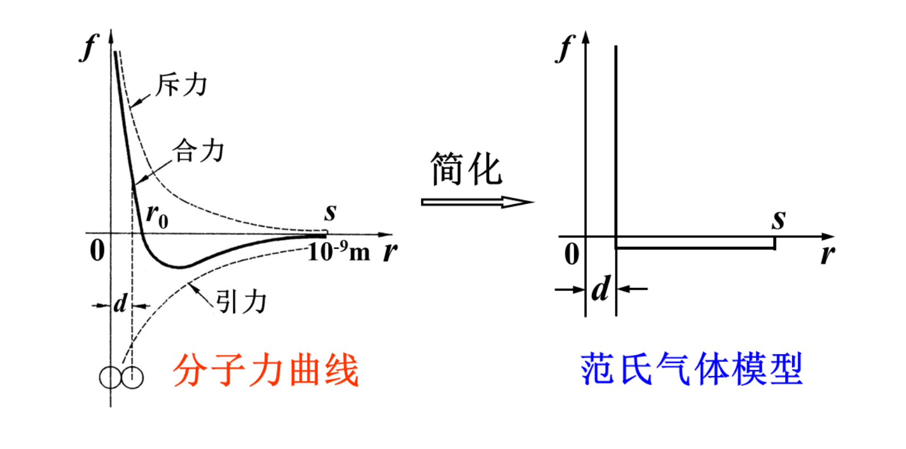
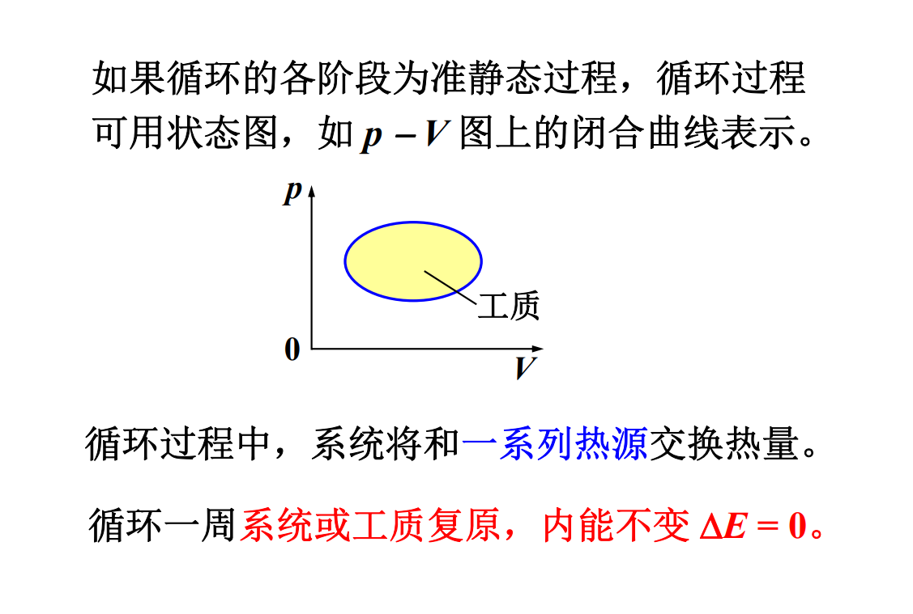
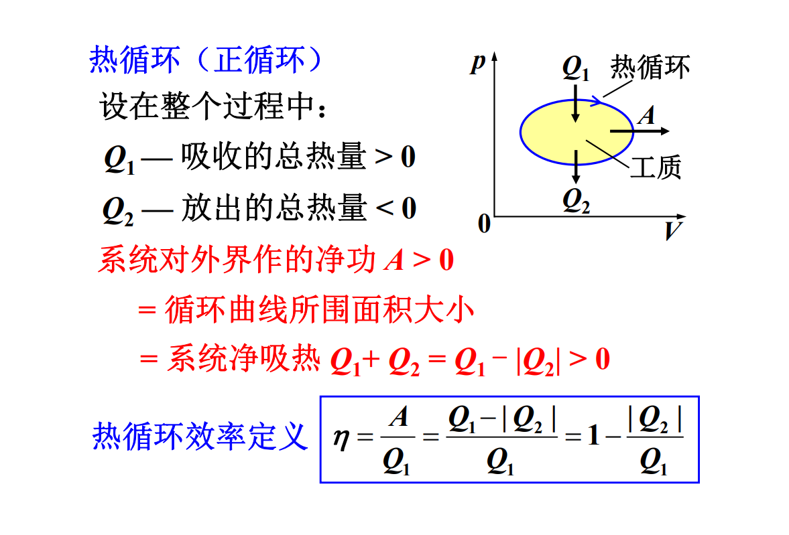

# 参考教材

嫌教材太简单可以看看

《热学》lhf例题很多，很详细，很多数学比教材难

《》

《新概念物理教程-力学》新颖，比较硬核。

《费恩曼物理学讲义》

《新概念物理教程-光学》公认最好教材

《光学》chb, lyp

量子物理没有太好的参考书。

《原子物理学》杨福家编。现在没有原子物理了，只有量子物理。有时用经典方法，有时候用量子物理的方法。前几章和教材一致，实验讲得不错。

量子力学教程。周世勋。内容有点少。

《费恩曼物理学讲义》第3卷。相当有深度（量子物理）。

*Phyisics* Vol.1 & 2。难度介于大学物理学和物理系教材之间。

### 杂项

牛顿运动方程一般个数少，微分阶数高；哈密顿正则方程一般个数多，微分阶数低。

# 热学

## 温度

分子动理论：热学中比较古老的理论。

教材中关于统计物理的内容不够透彻。

建议学习分析力学（重点：哈密顿力学），对后续量子力学有帮助。固体物理也会使用相关技巧。哈密顿量，相空间，拉格朗日方程。不用看证明，能用就行。

### 热学研究内容与对象

内容：与热现象有关的性质和规律。

热现象：宏观上与温度有关，微观上与分子热运动有关。

对象：大量微观粒子构成的体积有限的物体-热力学系统。（量大：统计学规律。）

经常讨论系统和外界（环境）。一种说法：宇宙是不是热力学系统？不是，因为宇宙之外没有外界。所以热二定律可能不适用于整个宇宙。

孤立系统：与外界没有任何相互作用。

绝热系统：有功的交换，没有热量交换

封闭系统：有能量交换，无粒子交换

开放系统：既有能量交换，也有粒子交换

### 热力学的研究方法

#### 热力学

宏观理论方法。依赖于实验。不涉及物质的微观结构和微观运动规律。具有极大的普遍性，可靠性。

#### 统计物理学

微观理论方法。从微观模型假设出发，力学 + 统计理论建立微观量和宏观量的关系。可解释本质，但是受模型局限。

### 几个重要概念

#### 平衡态

热力学系统内部，宏观上不存在能量和粒子的流动，系统宏观性质不随时间变化。（体积、压强、温度）

热力学平衡条件：

力学平衡条件：若系统与外界有力学作用，平衡时内外压强相等。

热平衡条件：若系统与外界可交换热量，平衡时内外温度应相等。

相平衡条件：若系统与外界处于不同相的共存状态，平衡时要达到力学平衡、热平衡以及相平衡。

化学平衡条件：浓度不同的系统混到一起，平衡时要满足上面三个条件，并且浓度均匀。

注意区分平衡态和稳定态：

![../images/pht.png]

#### 宏观量

描述系统宏观性质的量。可直接测量。

广延量：有累加性。如M, V, E...

强度量：无累加性。如p, T...

#### 微观量

描述微观粒子性质的量。需要间接测量。

如分子的m, v, d...

#### 状态参量

描述系统平衡态及其宏观性质的物理量。

p, V, T, v, 内能E, 熵S, 焓H

一组态参量对应一个平衡态。

实验表明：状态参量之间不是相互独立的。

常选p, V, T作为自变量，其他的当作函数（E, S, H）-热力学函数。

对物质量确定的单元（单一组元，不能由多种物质混合）单相（同一种状态，不能有固液同时存在等等）系统，p, V, T只有两个是独立的：T(p, V), E(p, V)。

统计物理：状态参量之间的偏导数关系。

#### 物态方程

两个最基本的热力学函数之一（物态方程和内能）。态参量之间的函数关系: f(T, p, V) = 0

通过测量确定。

理想气体物态方程：

$pV = νRT$

$p = nkT$

$k = \frac{R}{N_A}$

$\nu$ 气体摩尔数

$k$ 玻尔兹曼常量

### 温度

#### 热平衡态

两个系统长时间热接触达到的共同平衡态。

#### 热力学第零定律

实验表明： A与C热平衡，B与C热平衡，A和B也必然保持热平衡。

非热接触的两个系统也可以处在同一个热平衡态。

温度：处于同一热平衡态下的热力学系统所具有的共同的宏观性质。

处在同一热平衡态的系统具有相同的温度。

#### 温标

理想气体温标；用理想气体做测温物质。单位: $K$(Kelvin)， 范围适用 $> 0.5K$

实验表明：一定质量的理想气体在同一个热平衡态下，$pV$不变。

规定$T \propto pV$，水的三相点温度为$T_3 = 273.16K$

$$T = T_3\frac{pV}{p_3V_3} = 273.16\frac{pV}{p_3V_3}$$

热力学温标$T$：理论温标，与物质无关。

单位: $K$，适用于所有温度范围，在理想气体温标范围内与理气温标一致。

### 统计物理学的观点、概念简介

统计物理学包括平衡态统计理论，非平衡态统计理论和涨落理论。它从物质的微观结构和微观运动来阐明物质的宏观性质。其基本观点：

- 宏观物体由大量的微观粒子（原子、分子、电子、光子等）构成。
- 微观粒子的运动服从力学规律。原则上说服从量子力学规律，一定条件下可以用经典力学处理。
- 从微观角度看，物体以一定的概率出现在各个微观状态上，物质的宏观性质就是物质微观性质的统计平均。宏观量是有关微观量的统计平均值。

#### 近独立子系统

构成系统的粒子间相互作用很弱，系统能量近似等于各粒子能量总和，如理想气体。

#### 微观状态（力学运动状态）

##### 经典力学描述

常采用正则形式，即广义坐标和广义动量描述。

- 子相空间（μ空间）：由粒子的广义坐标$q_i$和广义动量$p_i$（$i = 1, \dots, r$, $r$是粒子自由度）构成的2r维空间。

  1组$(q_1, \dots, q_r, p_1, \dots, p_r)$的取值表示粒子的1个微观状态，对应于子相空间的一个点。

  更确切的说，在子相空间 $( q_1,... , q_r , p_1,..., p_r )$位置处的体积元 $d q_1...d q_r dp_1...dp_r$中的点，都是由$( q_1,... , q_r , p_1,..., p_r )$描述的相同的粒子微观状态。

  位形空间（坐标构成的空间），速度空间（速度构成的空间）。

  傅里叶变换和傅里叶级数的区别：一个离散，一个连续。

- 系统的微观状态是由所有粒子的广义坐标和广义动量描述的。

##### 量子力学描述

量子力学中假设运动状态用量子态描述。

- 粒子的微观状态用单粒子（量子）态描述。

  单粒子态由一组量子数描述：如 $|n, l, m_l, m_s >$ 。 1 组取值确定的$ |n, l, m_l, m_s > $表示 1 个单粒子态。 当粒子状态是由某个单粒子态描述时，称为粒子处于某个单粒子态，或粒子占据某个单粒子态

- 系统微观状态用多粒子（量子）态描述。

  对近独立子系统，多粒子态可由单粒子态表示： 系统所有粒子的 1 组单粒子占据态就表示系统的 1 个 多粒子态，即表示系统的 1 个 微观状态。

微观粒子全同性原理

全同粒子：内禀属性如质量、电荷、自旋等相同 

微观粒子全同性原理是量子力学假设。 

全同性原理：对全同粒子组成的系统，交换任意 2个全同粒子，系统微观状态不变。

泡利不相容原理：对全同费米子系统，不能有两个及以上的费米子占据同一单粒子态。

费米子：自旋为半整数；玻色子：自旋为整数。

#### 宏观状态和微观状态的关系

系统的宏观状态由宏观量表征，如 E、N、V。 

系统的微观状态，如果用经典描述，则由所有粒子 的坐标和动量表征。 

玻耳兹曼认为：从微观上看，对于一个系统的状态 的宏观描述是非常不完善的，系统的同一个宏观状 态实际上可能对应于非常非常多的微观状态，而这 些微观状态是粗略的宏观描述所不能加以区别的。

 这意味着宏观状态和微观状态、宏观量和微观量具 有内在联系，这种联系是种统计关系。

#### 统计规律性

统计物理发展早期，人们普遍认为：研究物体宏观 性质，应从求解粒子的力学运动方程出发来解决。 但由于粒子数太多，求解力学方程困难，迫不得已 得引入统计方法。而且这个统计是：宏观量是相应 微观量的长时间平均。 即原则上力学规律可完全决定物体宏观性质  

这种观点无法解释根本问题：热现象的不可逆性。 因为把力学运动方程（牛顿方程或薛定谔方程）用 到微观粒子，是时间反演对称的 — 可逆的。

这表明仅通过力学规律来解释物体的宏观性质是 不可能的，而有赖于新的规律 — 统计规律。

力学规律是决定论性的，可表述为：在一定初始 条件下，某时刻系统必然处于一确定的运动状态。 

统计规律可以表述为：在一定的宏观条件下，某 时刻系统以一定的概率处于某一微观状态。 

即宏观状态与微观状态之间的联系是概率性的， 具有统计规律的特性，而不是决定论性的。

统计规律的稳定性：只要 N 足够大，每次得到的分布几乎相同

统计规律的涨落：每次实验中得到的比例 Ni /N 稍有差别。N 越大，涨落越小。

即对变量是离散取值的情况，直接采用概率， 对变量是连续取值的情况，需要引入概率密度。

热现象本质是统计规律的反映。

##### 平衡态统计理论的基本假设：等概率原理 

处于平衡态下的孤立系统，系统各个可能的微观 状态出现的概率相等。 “可能的微观状态”是指孤立系统的宏观条件所 允许的那些微观状态，即这些微观状态对应于给 定的 E、V、N

##### 平衡态下近独立子系统的统计规律 

处于平衡态下的热力学系统，宏观状态不变，但 相应的微观状态不断变化，是一种动态平衡。 根据等概率原理，平衡态包含的微观状态数目是 最多的 — 最概然态

求统计分布函数：对于每个统计分布函数，可以计算它们对应的微观态数目（微观态数目是统计分布函数的函数）。在E, N不变的条件下，只要找到对应微观态数目最多的统计分布函数，就是平衡态的统计分布函数。

对近独立子系统，采用经典力学及等概率原理只能得到一种经典统计：麦克斯韦-玻尔兹曼统计；采用量子力学及等概率原理得到3种统计：麦克斯韦-玻尔兹曼统计，费米-狄拉克统计，玻色-爱因斯坦统计。

造成 3 种量子统计规律的原因是微观粒子的全同性原理和泡利不相容原理。

麦克斯韦-玻尔兹曼统计适用于定域子系统，费米 - 狄拉克统计、玻色 - 爱因斯坦统计适用于非定域 子系统。

 定域：全同粒子系统中的粒子的波包局限在空间 一定范围内，之间没有重叠，全同性原理 不起作用，可以通过位置分辨粒子。

 经典的和量子的麦克斯韦-玻尔兹曼统计在数学形 式上一致。而在一定条件下，量子的 3 种统计都可 退化为经典的麦克斯韦-玻尔兹曼统计

## 气体动理论

#### 气体动理论的基本观点

气体动理论（分子动理论），发展于 19 世纪下半 期，基于经典理论，是统计物理学的原型，被不断 补充发展完善成为统计物理学，其所得的结论可通 过统计物理得到。至今仍在诸多领域有重要应用。

1. 宏观物体是由大量分子、原子构成的，分子间 存在一定的间隙。
1. 分子永不停息地作无规则运动 — 热运动
1.  分子间存在一定的相互作用。

### 理想气体的压强

##### 关于理想气体的假设

###### 单个分子服从的力学规律

理想气体模型：

大小：分子线度<<分子间平均距离

分子力：除碰撞的瞬间，在分子间、分子与器壁间无作用力

碰撞性质：弹性碰撞

服从规律：牛顿力学

###### 大量分子处于平衡态时的统计假设

（1）无外场时，分子在各处出现的概率相同
$$n = \frac{\mathrm d N}{\mathrm d V} = \frac NV = \text{const}.$$
（2）由于碰撞，分子可以有各种不同速度

速度取向各方向等概率：
$$\bar{v_x} = \bar{v_y} = \bar{v_z} = 0\\\\\bar{v_x^2} = \bar{v_y^2} = \bar{v_z^2} = \frac 13 \bar{v^2}$$

##### 理想气体压强公式

前提：平衡态，忽略重力，分子当成质点
$$p = \frac13nm\bar{v^2} = \frac23n\bar\varepsilon_t, \\\\\bar\varepsilon_t = \frac12 mv^2$$

### 温度的统计意义

$$\bar\varepsilon_t = \frac{3p}{2n} = \frac{3nkT}{2n} = \frac32kT\\\\\sqrt{\bar{v^2}} = \sqrt{\frac{3kT}{m}} = \sqrt{\frac{3RT}{M}}$$

$T = 273K$, 

$\bar{\varepsilon}_t$数量级：$10^{-2}$eV

$\sqrt{\bar{v^2}}$

$H_2$: $1.84\times 10^3m/s$

$O2$: $4.61\times 10^2m/s$

### 能量均分定理

自由度：决定物体空间位置的独立坐标数，用$i$表示

##### 单原子分子

平动自由度:$t = 3$ 

$i = 3$

##### 双原子分子

质心平动：$t = 3$

轴取向：$r = 2$

距离变化：$v = 1$

总自由度: $i = 6$

##### 多原子分子

设分子包含$N$个原子

$i = 3N$

$t = 3$

$r = 3$

$v = 3N-6$

##### 能量均分定理

一个平动自由度对应的平均动能为$\frac12kT$

考虑平动、振动和转动，由于分子的碰撞，分子平均动能均匀分配到每个自由度上。

在温度$T$的平衡态下，分子热运动的每个自由度对应的平均动能都等于$\frac12kT$。

普遍的能量均分定理：

分子能量中每具有一个平方项，就对应一个$\frac12kT$的平均能量。

分子振动的动能和势能都是平方项，所以：

$\bar\varepsilon_{vP} = \bar\varepsilon_{vk} = v\frac12kT$,  $\bar\varepsilon_v = \bar\varepsilon_{vP}  + \bar\varepsilon_{vk} = vkT$
$$\bar\varepsilon = \bar\varepsilon _t + \bar\varepsilon_r + \bar\varepsilon_v = (t + r + 2v)\frac12kT$$
通常情况下($T < 10^3K$)，振动自由度被“冻结”，分子可视为刚性

刚性分子：$v = 0, i = t + r$
$$\bar\varepsilon = \frac{t+ r}2kT$$

##### 理想气体内能

内能：系统内部各种形式能量的总和，不包括系统整体质心运动的能量

分子内部： $\bar\varepsilon = (t + r + 2v)\frac12kT$

分子之间：相互作用势能$\varepsilon_{\mathrm pij}$

内能：$E = N\bar\varepsilon + \sum_i\sum_{j<i}\varepsilon_{\mathrm pij} = E(T, V)$

理想气体： $\varepsilon_{\mathrm pij} = 0,E = E(T)$

### 麦克斯韦速度分布律

分布函数是体现热力学系统的统计规律性的重要函数.

常见的统计分布函数包括：速率分布函数、速度分布函数、能量分布函数等。

通过分布函数可计算微观量的统计平均值，如$\bar\varepsilon_t, \bar{v^2}$等，进而得到系统的宏观量。

##### 速率分布函数

$$f(v) = \frac{\text dN}{N\text dv}\\\\\int_0^\infty f(v)\text dv = \int_0^\infty\frac{\text dN}{N} = 1$$

##### 麦克斯韦速率分布函数（不用记）

$$f(v) = 4\pi (\frac m{2\pi kT})^{3/2}e$$

##### 三种统计速率

###### 最概然速率

$$v_p = \sqrt{\frac{2kT}{m}}$$

m一定时，温度T越高，速率大的分子数比例越大，最概然速率越大， $f(v_p)$越小。

###### 平均速率

$$\bar v = \int_0^\infty vf(v)\text dv$$

任意函数对全体分子按速率分布的平均值为

$f(v)$一定要归一化!
例如求0到vp/2的平均速率，首先要将f(v)归一化成这个区间内的速率分布，而不是直接用全部速率分布

$$\bar{\phi(v)} =\int_0^\infty \phi(v)f(v)\text dv$$

由麦克斯韦速率分布函数

$$\bar v = \sqrt{\frac{8kT}{\pi m}} = \sqrt{\frac{8RT}{\pi M}}$$

###### 方均根速率

$$\bar{v^2} = \int_0^\infty v^2f(v)\text dv = \frac{3kT}{m}\\\sqrt{\bar{v^2}} = \sqrt{\frac{3kT}{m}} = \sqrt{\frac{3RT}M}$$

##### 麦克斯韦速度分布律

$$\frac{\text dN}{N} = \left(\frac{m}{2\pi kT}\right)^{3/2}e^{-m(v_x^2 + v_y^2 + v_z^2)/2kT}\text{d}v_x\text{d}v_y\text{d}v_x$$

速度分量的分布函数

$$g(v) = (\frac m{2\pi kT})^{1/2}e^{-mv^2/2kT}$$

##### 分子碰壁数$Γ$

$$\Gamma = \frac14 n\bar v$$

##### 玻尔兹曼分布

###### 恒温气压公式

$$p = p_0e^{-mgz/kT}\\\\n = n_0e^{-mgz/kT}$$

###### 玻尔兹曼分布

$$\text dN_{\vec r} = n_0 \cdot e^{-\varepsilon_p(\vec r)/kT} \cdot \text d^3 \vec r\\\\\text d^3\vec r = \text dx \ \text dy \  \text dz$$

###### 玻尔兹曼-麦克斯韦分布

$$\text dN = n_0 \cdot (\frac m{2\pi kT})^{3/2} \cdot e^{-[\frac12 mv^2 + \varepsilon_p(\vec r)]/kT} \cdot \text d^3\vec r \cdot \text d^3 \vec v$$

能量简并：不同子相空间分子能量相等。

分子按能量分布：

$$N(\varepsilon) = C \cdot w(\varepsilon) \cdot e^{-\frac{\varepsilon}{kT}}$$

$\varepsilon$为粒子的能量，$w(\varepsilon)$为具有此能量的体积元个数.

### 范德瓦尔斯方程

#### 范氏气体模型

气体分子间的作用力：分子间的作用力很复杂，主要是电磁力，可以分为引力和斥力

范氏气体模型：对理想气体做两方面的修正。考虑分子体积、分子间作用力引起的修正。

* 分子是直径为d的刚球
* 在$d\rightarrow s$的范围内，分子间有恒定引力

#### 范德瓦尔斯方程

范德瓦尔斯方程：

设:

$\nu = 1 mol$

$p$ -- 实测气体压强

$V_m$ -- $1\ mol$气体容积

对理想气体：$pV_m = RT$

对真实气体：

1. 分子体积引起的修正

分子自由活动空间的体积为$V_m - b$

$$p(V_m - b) = RT$$

$$
p = \frac{RT}{V_m - b}
$$

2. 分子间引力引起的修正

气体分子间作用力一般表现为引力。

在容器内部，单个气体分子受到各个方向的平均引力相等，合力可以看作零。

但是在容器边缘，单个气体分子受到的引力是不对称的。气体分子所受的合力指向容器内部，因此撞击容器壁的气体分子动量比理想气体下的情况要小，宏观上形成的压强比理想气体情况要小。

$$
p < \frac{RT}{V_m - b}\\
$$

设

$$
p = \frac{RT}{V_m - b} - p_{in}
$$

$p_{in} \propto nf_{合}, f_{合}\propto n \Rightarrow p_{in} \propto n^2 \propto \frac 1{V_m^2}$

最后得到：
$$
(p + \frac a{V_m^2})(V_m - b) = RT
$$

对 ν mol 气体：

$$
(p + \nu^2 \cdot \frac a{V^2})(V - \nu b) = \nu RT
$$

常温常压下：$b/V_m \sim 10^{-3}, p_{in}/p \sim 10^{-2}$，这时分子体积和分子间的作用力修正可以忽略。

#### 气体的等温线

真实气体的等温线：

范氏气体的等温线：

如何计算临界参数：

临界参数：临界点K对应的$p_K, V_K, T_K$

临界点K是等温线的拐点：

$$
\left(\frac{\partial p}{\partial V}\right)_{T = T_K} = 0\\
\left(\frac{\partial^2 p}{\partial V^2}\right)_{T = T_K} = 0
$$

K同时也是三次方程的三重根，因此可以通过假设$(V_m - V_{mK})^3 = 0$展开后和范德瓦尔斯方程对比系数求解。

#### 范氏气体内能

理想气体： $E(T) = i\nu RT / 2$

范氏气体：$V\uparrow \rightarrow p_{in}做负功\rightarrow 分子间势能E_p\uparrow$

要计算势能，首先要定义势能为0的状态：定义某种位形为0势能。其他状态的势能定义为从这种状态变形到0势能状态的过程中保守力的变化。

$$\mathrm dA = -p_{in}S\mathrm dl = -p_{in}\mathrm dV$$

设$E_p(V = \infty) = 0$。

$$
E_p(V) = \int_V^\infty -p_{in}\mathrm dV = \int_V^\infty-\nu^2 \cdot \frac a{V^2}\mathrm dV = -v^2 \cdot \frac aV
$$

$$
E = E_k + E_p = \frac i2\nu RT - \nu ^2\frac aV
$$

**结论：**
$$E(T, V) = \frac i2 \nu RT - \nu^2 \frac aV$$

#### 一个细节

为什么不考虑气体分子和容器壁分子间的引力？

事实上，这引力确实存在。但是可以通过动量定理证明，碰撞过程这引力的作用总和为0。

### 气体分子的碰撞、平均自由程

平均碰撞频率和平均自由程

平均碰撞频率$\bar z$：单位时间内一个气体分子与其他分子碰撞的平均次数

平均自由程$\bar \lambda$：气体分子在相邻两次碰撞之间飞行的平均路程。

平均碰撞频率和平均频率之间关系

对象:平衡态下的理想气体

假定：

(1)只有一种分子；

(2)分子可视作直径为d的刚球；

(3)被考察的分子以平均相对速率$\bar u$运动，其余的分子静止。

碰撞界面为$\sigma$。分子间平均相对速率为$\bar u = \sqrt 2 \bar v$。

$$
\bar z = \sigma \bar u n = \pi d^2 n \bar u = \sqrt 2 \pi d^2 n\bar v
$$

平均自由程和压强、温度的关系：

$$
\bar\lambda = \frac {\bar v} {\bar z} = \frac 1{\sqrt2 \pi d^2 n} = \frac {kT}{\sqrt2\pi d^2p} \propto \frac{T}{p}
$$

### 气体输运过程

非平衡态下，气体内部各部分性质不均匀，就会产生热量、动量、质量的迁移，称为输运过程或内迁移过程。

气体输运过程包括：热传导、扩散和内摩擦（粘滞）。

输运现象的宏观实验定律和原因。

热传导

温度不均匀。实验定律：傅里叶定律，热传导方程。

考虑1维的情形。

$$
\mathrm dQ = -\kappa \frac{\partial T}{\partial x}\mathrm dS \mathrm dt
$$

$$
j(x, t) = \frac{\mathrm dQ}{\mathrm dS\mathrm dt}  = -\kappa \frac {\partial T(x, t)}{\partial x}
$$

$j(x, t)$：热流密度，$\partial T/\partial x$：温度梯度。

温度梯度“力”导致热流。

> $T$在这里相当于电势，$-\partial T / \partial x$相当于电势的负梯度即电场强度，$j$相当于电流密度，$\kappa$相当于电导率。因此类比$\vec{J} = \sigma \vec{E}$有$j = -\kappa \partial T /\partial x$。类似的，也许可以推导出热阻的概念？热学的“麦克斯韦”方程组又是什么？

统计物理给出的结论：

$$
\kappa = \frac 13 nm\bar v \bar \lambda c_V
$$

>如何理解此公式：热传导的本质是分子能量（热量）的交换，交换的热量等于粒子数乘以单个粒子交换的热量。
>
>$m$为单个分子质量。$c_V$为定体热容。$n\bar v$用于描述$\mathrm dt$内穿过$\mathrm dS$的粒子数，$\bar\lambda$乘以$\partial T/\partial x$得到温度的变化量$\mathrm dT$ ,$m,c_V$与温度的变化量相乘，得到单个粒子交换的热量。

稳恒热流：$\frac{\mathrm dQ}{\mathrm dt} = C$，$j$, $T$与$t$无关。

$\kappa$称为导热系数，由气体特性和$T, p$决定。

扩散

原因：气体内部离子数浓度不均匀。

斐克定律

$$
\mathrm dN = -D\frac {\partial n}{\partial x}\mathrm dS \mathrm dt
$$

>教材的表述为
>$$
\mathrm dM = -D\frac {\partial \rho}{\partial x}\mathrm dS \mathrm dt
>$$
>这里的两个$D$是一样的。

统计物理给出的结论：

$$
D = \frac13\bar v\bar \lambda
$$

扩散流密度：

$$
j(x, t) = \frac {\mathrm dN}{\mathrm dS \mathrm dt} = -D\frac {\partial n}{\partial x}
$$

稳恒扩散流：$\frac {\mathrm dN}{\mathrm dt} = C$，$j$, $n$, 与$t$无关。

粒子数守恒方程
$$
\oiint_S j\cdot \vec {s} = -\frac {\mathrm dN}{\mathrm dt}, \nabla \cdot \vec j + \frac{\partial n}{\partial x} = 0.
$$

结合粒子数守恒方程（微分形式）和斐克定律得到扩散方程

$$
\frac{\partial n}{\partial t} = D\frac{\partial^2 n}{\partial x^2}
$$

考试考定场稳恒流，不考内摩擦。

内摩擦（粘滞）

根据流体力学，对定常流动的粘滞流体，流速不太大时（雷诺数小），出现层流。

粘滞定律（牛顿摩擦定律）

$$
\Delta F = - \eta \frac{\mathrm du}{\mathrm dz}\Delta S
$$

$$
p = -\eta \frac{\mathrm du}{\mathrm dz}
$$

粘度和温度有关，气体粘度随温度增加，液体温度随温度减小。遵从粘滞定律的流体称为牛顿流体。

内摩擦原因：流速不均匀。

统计物理给出的结论：

$$
\eta = \frac 13 nm\bar v\bar \lambda
$$

## 热力学第一定律

### 准静态过程

准静态过程：过程的任一时刻，系统都处于平衡态— 一系列平衡态组成的理想化过程。

若外界条件改变时，能保证和系统相应的强度量之间差无穷小，则过程是准静态的。

弛豫时间τ：平衡破坏到恢复平衡的时间.

当$\Delta t_{过程} > \tau$时，过程就可视为准静态过程。
。
### 功

体积功：$\mathrm{\bar dA} = p\mathrm dV$

系统对外界做功:$A = \int_{V_1}^{V_2}p\mathrm dV$是一个过程量。

通过做功改变系统热力学状态，微观上是分子规则运动的能量通过碰撞转变为无规则运动的能量。

### 内能，热量和热力学第一定律

内能：定义为$E_2 - E_1 = A_{1\rightarrow 2}$（绝热过程）

内能通过绝热功度量。

热量：定义为$Q = (E_2 - E_1)$（无功过程）

微观本质是分子无规则运动的能量通过碰撞从高温物体向低温物体传递。

热力学第一定律：

$Q = \Delta E + A$

$\mathrm {\bar{d}}Q = \mathrm d E + \mathrm{\bar{d}}A$

热力学第一定律是一条实验定律，适用于任何热力学系统的任何过程。

### 热容量：

$$
C = \frac{\mathrm dQ}{\mathrm dT}
$$

定体热容量：$C_v = \left(\frac{\mathrm dQ}{\mathrm dT}\right)_V$

定压热容量：$C_p = \left(\frac{\mathrm dQ}{\mathrm dT}\right)_p$

摩尔热容量：
$$
C_m = \frac1\nu\frac{\mathrm dQ}{\mathrm dT}
$$

对应地有定体摩尔热容量和定压摩尔热容量。

理想气体内能：$\Delta E = \nu C_{V, m}\Delta T$。（推导：内能变化与过程无关，假设先等体后等温，等体过程无功只有热交换，等温过程内能不变。）

迈耶公式：

$$
C_{p, m} - C_{V, m} = R
$$

（推导：用等压过程计算内能的变化，与定体过程的结论比较一下可得。）

理想气体热容量理论公式：

$$
C_{V, m} = \frac i2R, C_{p, m} = \frac{i+2}{2}R
$$

推导：结合理想气体内能公式。

定义比热容比:$\gamma = C_{p, m}/C_{V, m}$

### 绝热过程

系统和外界没有热交换的过程。

理想气体的准静态绝热过程：

> $$
> 0 = p\mathrm dV + \nu C_{V, m}\mathrm dT\\
> p\mathrm dV + V\mathrm dp = \nu R\mathrm dT\\
> R  = C_{p, m} - C_{V ,m}
> $$
>
> 得到：
> $$
> \frac{\mathrm dp}{p} = -\gamma\frac{\mathrm dV}V
> $$

两边积分得到:
$$
pV^{\gamma} = C, TV^{\gamma - 1} = C, p^{\gamma - 1}T^{-\gamma} = C
$$

绝热功

$$
A = \int_{V_1}^{V_2} p\mathrm dV = C \int_{V_1}^{V_2}\frac 1{V^{\gamma}}\mathrm dV = \frac{C}{1 - \gamma}(V_2^{1 - \gamma} - V_1^{1 - \gamma}) =\frac{p_2V_2 - p_1V_1}{1 - \gamma} 
$$

绝热功等于内能的减少量：

$$
A = -\Delta E = \nu C_{V, m}\Delta T
$$

理想气体的多方过程

多方过程：热容量$C$为常数的过程

多方过程方程：$pV^n = \text{const}$

其中，$n = (C - C_p)/(C - C_V) = (C_m - C_{p, m})/(C_m - C_{V, m}) = \text{const}$

如果为绝热过程则$C = 0$，$n = \gamma$，从而$pV^{\gamma} = \text{const}$。

如果为等温过程则$C = \infty$，$n = 1$，因此$pV = \text{const}$。

绝热自由膨胀过程（非准静态过程！！）：

理想气体：$Q = 0, A = 0 \Rightarrow E_1 = E_2$

真实气体：若分子间以引力为主, $T_2 < T_1$，以斥力为主，$T_2 > T_1$。

焓：气体的绝热节流过程是等焓过程，即$H = E + pV$为常数，对于非理想气体而言，内能不仅与温度有关，也与体积有关（焦耳-汤姆孙效应）。

绝热自由膨胀：初末状态在等温线上，但是过程中不是平衡态。

准静态等温膨胀：吸热用来做功。

准静态绝热膨胀：内能的减少量用来做功。

循环过程：

系统，如热机中的工质，经一系列变化的回到初态的整个过程。

状态图：

热循环：

蒸汽机的效率约为十几%，内燃机20-30%。

制冷循环：

制冷系数：

$$
w = \frac{Q_2}{A} = \frac{Q_2}{Q_1 - Q_2}
$$

### 卡诺循环

卡诺循环是一种可逆循环，包括两个等温过程和两个绝热过程。它的效率为

$$
\eta = 1 - \frac{|Q_2|}{Q_1} = 1 - \frac{T_2}{T_1}
$$

卡诺循环的效率仅与热源的温度比有关。

由卡诺定理可以证明，卡诺循环的效率与工质无关。因此，不妨设工质为理想气体，利用理想气体等温和绝热过程方程得到效率公式。

## 热力学第二定律

开尔文表述：不可能将热量从低温热源搬运到高温热源，而不产生其他影响。（制冷系数不可能为无穷大）

克劳修斯表述：不可能将功全部转化为热。（热机效率不可能为1）

开尔文表述和克劳修斯表述是等价的。事实上，任何关于热现象不可逆的描述都是等价的，它们要么同时成立，要么同时不成立。因此，描述热现象的方向性，只需要举一个例子即可。

### 卡诺定理

在温度相同的高温热源和温度相同的低温热源之间工作的一切热机，可逆热机的效率最大。

推论：一切可逆热机，只要它们的高温热源的温度相等，低温热源的温度相等，效率就相等。

对于制冷机：

可逆制冷机的制冷系数最大。

所有2热源可逆制冷机制冷系数都相等，等于卡诺制冷机的制冷系数。

### 热力学温标

根据卡诺定理，可逆热机的效率只与温度有关。因此可以用效率，或者说热量比来定义温标。

在热力学温标下，低温热源的温度不能为0，否则可逆热机的效率为1.

### 任意可逆循环的效率

$$
\eta \le 1 - \frac {T_2}{T_1}
$$

其中，$T_1$，$T_2$分别为循环中工质的最高和最低温度。

### 克劳修斯熵公式

热力学第零定理导出了温度，热力学第一定律导出了内能，热力学第二定律则导出了熵。

可逆循环可以拆成若干小卡诺循环，每个卡诺循环满足

可逆循环有克劳修斯等式
$$
\oint_R \frac{\mathrm {\bar d} Q}{T} = 0
$$

因此得到一个与路径无关的状态函数。

熵与状态有关，和过程无关。即便过程是不可逆过程。

但是，仅当过程为可逆过程时才有$\mathrm dS=  \mathrm{\bar d}Q/T$。

对于可逆过程：

$$
T\mathrm dS = \mathrm{\bar d}Q = \mathrm dE + p\mathrm dV
$$

因而可以用$E, V$表示熵：
$$
\mathrm dS = \frac 1T \mathrm dE + \frac pT \mathrm dV = \frac 1T()
$$

### 克劳修斯不等式

不可逆循环有
$$
\oint_{Ir} \frac{\mathrm {\bar d} Q}{T} < 0
$$

因而有熵增加原理:

$$
\int_{1_{Ir}}^{2} + \int_{2_R}^1 < 0\Rightarrow S_1 - S_2= \int_{1_{Ir}}^2
$$

# 振动和波动

## 波动

### 多普勒效应

一般形式：

机械波不存在多普勒效应。

电磁波的多普勒效应：

横向多普勒效应：$\theta = \pi /2$

纵向多普勒效应：$\theta = 0,\pi$

### 激波

马赫数：$\frac{v_s}{u} = \frac 1{\sin\alpha}$

# 光学

光学分为几何光学，波动光学和量子光学。

## 光的相干叠加

光源：
1. 普通光源：自发辐射。不同原子发光独立、不相干；同原子不同次发光独立、不相干。
2. 激光光源：受激辐射。光放大，全通光子，相干光，波列长，相干性好。

光的相干性：
光学中强调电磁波的电场矢量$\vec E$：光矢量

相干条件：光矢量有平行分量，频率相同，相差恒定。

电磁波叠加的强度公式推导：
$$
I = \sqrt{\varepsilon / \mu}\left<\vec E \cdot \vec E \right>_t \\

I \propto \left<\vec E \cdot \vec E \right>_t \\

叠加的电磁波：\vec E_1 + \vec E_2\\

矢量的点乘运算可得叠加后的强度:\\

I = I_1 + I_2 + 2\sqrt{\varepsilon / \mu}\left<\vec E_1 \cdot \vec E_2 \right>_t 

$$

对光的相干叠加，用光矢量的平行分量描述光场--标量波函数。

$$
I = I_1 + I_2 + 2\sqrt{I_1I_2}\cos \Delta \varphi
$$

其中$\Delta\varphi = -k(r_2 - r_1) + (\varphi_{20} - \varphi_{10})$为相位差。

在上面两式中，若$\vec E_1 \cdot \vec E_2 \ne 0$或者$\Delta\varphi \ne \pm\frac{\pi}{2}...$，则满足相干的条件。

条纹的明显程度用衬比度衡量：$V = (I_{max} - I_{min})/(I_{max} + I_{min})$

不同的位置$\Delta\varphi$不同，因而对应的$I$不同，造成了干涉条纹的出现。$I_1 = I_2$时$V=1$，$I_1 \ne I_2$时，$V \ne 1$。

普通光源获得相干光的途径一般有分波阵面法（双缝干涉）和分振幅法（薄膜干涉）。

### 双缝干涉

明纹：$\delta = \pm k\lambda$

暗纹：$\delta = \pm (2k + 1)\frac \lambda 2$

$(k\in N)$

条纹间距：$\Delta x = \frac{D}{d}\lambda$

$\Delta \varphi \approx \frac{d\sin \theta}{\lambda}2\pi$

时间相干性（光的颜色）：

光的非单色性：

准单色光：由某个中心频率或波长附近的频率或波长连续分布的光构成。采用谱密度函数描述。

造成谱线宽度的原因：自然宽度、多普勒增宽、碰撞增宽

非单色性对干涉条纹的影响：

从图中可以看出，如果某个位置谱线中波长最长的成分的k级明纹和波长最短的成分的(k+1)级明纹重合，则在这个位置以后的条纹看不清楚了。

可以解得最大相干级次：$k_M = \lambda/\Delta\lambda$，进而有最大波程差：$\delta_M = \lambda^2/\Delta\lambda$。

相干长度等于波列长度。

通常用相干时间（光通过相干长度所需的时间）$\tau = \delta_M / c$ 衡量光的单色性。相干时间或相干长度越长，则单色性越好。

空间相干性（光的宽度）：

较宽的光源会导致明纹的非相干叠加，使衬比度下降。

设光的宽度为$b_0$,则看到干涉条纹的条件是$b_0 < \frac{R}{d}\lambda$，这一上界称为光源极限宽度。

固定b和R，则得到$d < \frac{R}{b}\lambda$，上界称为相干间隔。

光源中心对两孔的张角为$\theta = \frac{d}{R} < \frac{\lambda}{b}$，上界称为相干孔径角。

### 光程

用于计算光经过不同介质的相差。
$\Delta\varphi = \frac{2\pi r}{\lambda}$。

透镜不产生附加光程差。

### 薄膜干涉

为什么要薄？相干长度（时间相干性）限制。

薄膜干涉有实际意义的是等倾条纹和等厚条纹。

光程差
$$
\delta = 2ne \cos r + \frac{\lambda}{2}
$$

e为膜厚度。

等厚条纹：

厚度不同，角度相同

单色平行光入射，近似垂直于膜表面，因而$i, r \approx 0$

$$
\delta = 2ne + \frac{\lambda}{2}
$$

劈尖：

由于明纹需满足$\delta = k\lambda$，暗纹需满足$\delta = (2k+1)\lambda/2$，故相邻亮纹所在的厚度差为$\Delta e = \lambda / (2n)$，而条纹间距为$L = \Delta e / \theta = \lambda / (2n\theta)$

牛顿环：

可以得到暗环半径公式：$r_k=\sqrt{kR\lambda}$

总结：条纹跟着厚度走。

等倾条纹：

厚度相同，角度不同。

光程差(记!)
$$
\delta = 2ne \cos r + \frac{\lambda}{2} = 2e\sqrt{n^2 - n^{\prime2}\sin ^2 i} + \frac \lambda2
$$

等倾条纹实验通常采用面光源,因为透镜会把方向相同的光汇聚到一点，因而条纹的非常鲜明，衬比度很高，不会出现光源宽度和条纹衬比度的矛盾。

应用：增透膜和增反膜

### 迈克尔逊干涉仪

平行：等倾条纹

倾斜：等厚条纹

条纹缩进N个，代表厚度变化：

$$
\Delta d = \frac{\lambda}{2n} = \frac {\lambda}{2}
$$

在光路上放一个介质，条纹移动N个：

$$
\delta = 2(n - 1)l = N\lambda
$$

简而言之，一个条纹对应光程变化一个波长，厚度的变化（介质变化折算成厚度变化）乘以2等于光程的变化，因为一来一回经过了两次。

## 衍射

菲涅尔衍射和夫琅禾费衍射。

惠更斯-菲涅尔原理

夫琅禾费衍射研究光源和投影面在无限远处的情形。采用透镜将无限远转化为有限远。

### 单缝衍射（夫琅禾费）

利用半波带法计算明暗纹位置：

中央明纹：$a\sin \theta = 0$

暗纹：$a\sin \theta = \pm k\lambda$

明纹（近似）:$a\sin \theta = \pm (2k + 1)\frac \lambda 2$

上述的$k$不能为0。因为如果k=0，即中央明纹，它没有半波带，因此要单独考虑。

光强公式：$I_p = I_0(\frac{\sin \alpha}{\alpha})^2$

其中$I_0$为中心亮纹强度，$\alpha = \frac{\pi a \sin \theta}{\lambda}$

条纹宽度：

条纹宽度的定义：两个相邻暗纹之间的距离，就是它们之间那个条纹的宽度。

中央明纹角宽度：$\Delta \theta_0\approx 2\frac{\lambda}{a}$，线宽度：$\Delta x_0 \approx 2 f \frac{\lambda}{a}$

其他明纹线宽度：$\Delta x \approx f\frac{\lambda}{a}$

### 光栅衍射

光栅是由衍射单元（狭缝、反射面等）排列成的具有空间周期性结构的光学元件。

光栅常数d-空间周期性结构常数

正入射光栅方程：$d\sin \theta = \pm k\lambda$。（明纹位置）

暗纹方程：$d\sin \theta = \pm k\lambda + \frac{m}{N}\lambda$

主极大缺级公式：$k = k^\prime d / a$

主极大半角宽：$\frac {\lambda}{N d \cos \theta_k}$

斜入射光栅方程：$d(sin\theta - \sin i) = \pm k\lambda$

斜入射可以获得更高级次的条纹，但是观察到的条纹总数不变。

调节入射角i或者波长$\lambda$，衍射角$\theta_k$也会改变。对于0级衍射光，$\sin \theta_0 = \frac{\lambda}{2\pi d}\Delta \varphi_{in}$

光学仪器的分辨本领：

艾里斑半角宽$D\sin \theta_1 \approx 1.22\lambda$

瑞利判据：一个象斑中心在另一个象斑边缘。

根据瑞利判据得到透镜分辨本领（最小分辨角）：$R = \frac{D}{1.22\lambda}$

光栅光谱：

取决于光栅的色散能力和谱线（条纹）的线宽度

角色散本领：$D_{\theta} = \frac{\delta \theta}{\delta \lambda}$

色分辨本领：$R = \frac{\lambda}{\delta \lambda} = Nk$，$\delta \lambda$，$\lambda $取较小者的波长，$k$是主极大级数。

## 偏振

### 定义

线偏振光：光矢量做同向振动，方向不变。

圆偏振光：光矢量的端点是圆。

椭圆偏振光：光矢量的端点是椭圆。

非偏振光：例如自然光。它的振动方向随机，各个方向振幅相等。自然光可以分解为两束垂直振动，振幅相等，相差随机的线偏振光。

部分偏振光：自然光+完全偏振光。

偏振度：$P = \frac{I_p}{I_t} = \frac{I_p}{I_n + I_p}$

### 起偏与检偏

偏振片：利用二向色性。有微晶型和分子型。

线偏振光的起偏：通过偏振片。

马吕斯定律：$A = A_0 \cos \alpha, I = I_0 \cos^2 \alpha$

### 反射与折射中的偏振

S分量：垂直于入射面。P分量：平行于入射面。

反射光S分量多，折射光P分量多。

当$i = i_0$使得反射光只有S分量，折射光大部分是P分量。称为布儒斯特角。$i_0 + r_0 = 90\degree$，因而有布儒斯特定律：$\tg i_0 = \frac{n_2}{n_1}$

玻璃片堆可以增强反射光的强度，增加折射光的偏振程度。

散射引起光的偏振：

微粒散射：丁达尔效应

分子散射：纯净气体、液体的散射。

双折射现象：

1束光入射到各向异性介质内，产生2束折射光。o光为寻常光，符合折射定律；e光为非常光，不符合折射定律一般，也不一定在入射面内。o，e光都是线偏振光，振动方向互相垂直。

晶体光轴：是晶体中的特殊方向，光在晶体中沿该方向传播不发生双折射。方解石是单轴晶体。云母是双轴晶体。

主平面：晶体中光的传播方向与晶体光轴构成的平面。o光振动方向垂直于主平面，e的振动方向在主平面内。只有当光轴在入射面内，o光主平面、e光主平面、入射面才重合。

折射角度不同的本质是不同角度下光的传播速度不同。据此区分正晶体和负晶体：

$v_o$是o光速度，$v_e$是e光垂直光轴方向速度。o光是各向同性的，e光沿平行光轴方向的速度和o光相同，e光沿所有方向的速度构成一个旋转椭球面。

正晶体：$v_o > v_e$

负晶体：$v_o < v_e$

定义主折射率：$n_o = c/v_o, n_e = c/v_e$

利用惠更斯作图法可以讨论单轴晶体的光传播情况：

以负晶体为例。
* 若光轴平行于晶体表面，自然光垂直入射：o和e方向相同，速度不同，仍然是双折射；
* 光轴平行晶体表面，且垂直入射面，自然光斜入射：e光也满足折射定律，折射率为$n_e$；
* 光轴与晶体表面斜交，自然光垂直入射：e光偏离入射方向，惠更斯波面是斜椭圆。

研究晶片时，o光和e光（垂直振动和平行振动）是独立的正交的分量。垂直振动不会变成平行振动，平行振动也不会变成垂直振动。

双折射：两个垂直方向的线偏振光的不同速度造成的。

旋光：两个不同旋转方向的圆偏振光的不同速度造成的。

# 量子物理

## 黑体辐射

热辐射

物体受热发出电磁辐射。热辐射是连续谱，温度升高，短波成分增加。

平衡热辐射：物体温度不变时产生的热辐射。单位时间内物体吸收能量等于辐射能量。

光谱幅出度（单色幅出度）

单位面积内单位频率发射的电磁波能量。

$$
M_\nu = \frac{\mathrm d E_\nu(T)}{\mathrm d\nu}
$$

总幅出度

$$
M(T) = \int_0^\infty M_\nu(T)\mathrm d\nu
$$

单色吸收比

$$
\alpha_\nu(T) = \frac{\mathrm d E_{\nu(吸收)}}{\mathrm d E_{\nu(入射)}}
$$

黑体

能吸收所有频率的电磁波，没有反射。$\alpha_{\nu}=1$。

基尔霍夫辐射定律：

$$
\frac{M_{\nu i}}{\alpha_{\nu i}} = M_{\nu 黑体}
$$

实验定律：

维恩位移定律：$\nu_m = C_\nu T$, $\lambda_m = b/T$

注：$\lambda_m \nu_m \ne c$。

斯特藩-玻尔兹曼定律：$M(T) = \sigma T^4$，$\sigma$为斯特藩-玻尔兹曼常量。

韦恩公式：低频段不符合；

瑞利-金斯公式：高频段不符合。

普朗克能量子假设：$\varepsilon = h\nu$

普朗克公式：

$$
M_\nu(T) = \frac{2\pi h}{c^2}\cdot \frac{\nu^3}{e^{h\nu/kT} - 1}
$$

由它可以导出所有其他热辐射公式。

## 光电效应

自学。

## 光的二象性

光子理论：能量$\varepsilon = h\nu$。光强：$I = N \cdot h\nu$，N是光子数流通量。

解释光电效应：

$$
\frac 12 mv_m^2 = h\nu - A
$$

光的粒子性：

$$
p = \frac h \lambda \\
E = h\nu \\
m = \frac{h\nu}{c^2}
$$

解释干涉和衍射：

光子在某处出现的概率是由该处的光强决定的：$I \propto \frac 1 {r^2}$，光子分布概率的不同导致了光强的不同。也就是说，光子的波动性表现为概率波。

光子在某处出现的概率和该处光强（光振幅的平方）成正比。

## 康普顿散射

散射波出现新的波长：$\Delta \lambda = \lambda_C(1 - \cos\varphi)$

利用光子理论解释：光子和“静止”的“自由”电子碰撞过程动量守恒，能量守恒。

解得$\Delta \lambda = \frac{h}{m_0c}(1 - \cos \varphi)$

如果光子撞到内层电子，则能量不变，因而存在原波长。

自由电子只能散射光子，不能吸收光子。如果吸收了，根据能量守恒和动量守恒，解得v=c，违反了相对论。

光电效应不考虑动量守恒，因为可见光、紫外线的能量低，电子不能视为自由，光子-电子不能视为动量守恒的系统。也因此，可见光观察不到康普顿效应。

## 概率波和概率幅

物质波的本质：

德布罗意认为是引导物质运动的“导波”；（本质不明确）

薛定谔认为波是基本的，电子是“波包”；（波包是不稳定的，而电子是稳定的）

另一个观点：粒子是基本的，物质波是电子相互作用形成的（被电子双缝实验否定）

波恩的解释：物质波是描述粒子在空间概率分布的“概率波”。

量子力学的基本假设之一：微观粒子的状态用波函数描述

概率波波函数(概率幅)：复函数$\Psi (\vec r, t)$

波函数没有直接的物理意义。复函数模的平方$|\Psi (\vec r, t)|^2$表示概率密度。

波函数需要满足标准条件：

有限性:$\iiint_{\Delta V}|\Psi|^2 \mathrm dV$有限

归一性：$\int_\Omega |\Psi(\vec r, t)|^2 \mathrm dV = 1$

单值性：波函数是单值函数。

连续性：波函数和它的一阶导数是连续的。

双缝的波函数：等于通过上缝和下缝的波函数的线性叠加。$\Psi_{12}=\Psi_1+\Psi_2$。(一个基本假设)

微观粒子波动性实质是波函数的叠加性。

结合测量理解。

态叠加原理：$\Psi = \sum_n C_n\Psi_n$。其中$|C_n|^2$是该粒子处于$\Psi_n$状态的概率。

一维自由粒子的波函数：

$$
\Psi(x, t) = A e^{i(px-Et)/\hbar}
$$

概率密度$|\Psi|^2 = |A|^2 = \text {const.}$

波粒二象性：

粒子性：具有能量$E$和动量$\vec p$。非经典粒子！没有轨道概念。

波动性：具有波长$\lambda$和频率$\nu$。非经典波！非真实物理量的波动。

## 不确定关系

$$
\left<\vec r|\Psi\right>
$$

不确定度：$\Delta A = \sqrt{\overline{(A - \bar A)^2}}$

坐标和动量的不确定性关系：

$$
\Delta x \cdot \Delta p \ge \frac \hbar 2
$$

因而微观粒子没有“轨道”。

能量和时间的不确定性关系：

$$
\Delta E \cdot \Delta t \ge \frac{\hbar}{2}
$$

时间不是力学量，它只是一个参数。位置，动量，能量等都是力学量。

## 薛定谔方程

定义

$$
i\hbar \frac{\partial \Psi}{\partial t} = \hat {H} \Psi
$$

哈密顿算符：$\bar {H} = -\frac{\hbar ^2}{2m}\nabla^2 + U(\vec r, t)$

若势函数不显含时间，则哈密顿算符$\hat H$称为能量算符。此时薛定谔方程可以通过分离变量法求解。

### 定态薛定谔方程-能量本征方程

分离变量法求解：

若势函数不显含t，则可设：

$$
\Psi(\vec r, t) = \Phi(\vec r) \cdot T(t)
$$

得到：

$$
i\hbar \frac{\mathrm dT(t)}{\mathrm d t}\frac 1{T(t)} = [\hat H\Phi (\vec r)]\frac{1}{\Phi(\vec r)} = E
$$

$$
T(t) = Ce^{-\frac{i}{\hbar}Et}\\
()
$$

E称为能量本征值（后面会讲什么叫本征值），对应的$\Phi_E$称为本征波函数。

定态：能量取确定值的状态，对应薛定谔方程的特解：$\Psi_E(\vec r, t) = \Phi e^{-\frac{i}{\hbar}Et}$.

对不同的势函数和能量区间，能量的本征值可能取连续的值，也可能取分立的值。设E取分立值，$\{E_n, n = 1, 2, 3, \dots\}$，对应的本征波函数$\Psi_E (\vec r, t) = \Phi_E(\vec r)e^{-\frac{i}{\hbar}Et}$

下面通过求解一维定态薛定谔方程来讨论两类问题：

本征值问题：给定$U(x)$，求$E_n$和$\Phi_n(x)$。

散射问题：$E$已知，射向势垒$U(x)$，计算粒子穿透势垒的概率。 

## 无限深方势阱中的粒子

背景：长度为$a$的导体中自由移动的电子，只能在导体中自由运动，而不能离开导体。

$|x| > a/2$时，$U(x) \rightarrow \infty$；

$|x| \le a/2$时，$U(x) = 0$。

在$|x| > a/2$区间，$\Phi_1 = 0$。

在$|x| \le  a/2$区间，$\frac{\mathrm d^2 \Phi_2}{\mathrm dx^2} + \frac{2mE}{\hbar^2}\Phi_2 = 0$

记$k = \frac{2mE}{\hbar^2}$。解得$\Phi_2 = A\sin(kx + \varphi)$。

求解定态的常规手法：利用波函数的三个条件，即单值、有限、连续，确定$A, k, \varphi$。

利用连续条件，波函数在势阱边界处连续：

$$
A\sin(\frac{ka}{2} + \varphi) = 0, A\sin(-\frac{ka}{2} + \varphi) = 0.\\

\Rightarrow k = \frac{n\pi}{a}, \varphi = \frac{l\pi}{2}
$$

从而
$$
E = \frac{\pi^2\hbar^2}{2ma^2}n^2 \ (n = 1, 2, 3, \dots)
$$

最低能量$E_1$被称为零点能。

大量子数情况下，能量趋向于连续。

$$
l = 0, \varphi = 0, \Phi_2 = A\sin \frac{n\pi}{a}x = \Phi_{on},满足边界连续需要n为偶数\\
l = 1, \varphi =\pi /2 , \Phi_2 = A\cos \frac{n\pi}{a}x = \Phi_{en},满足边界连续需要n为奇数\\
l \ge 2，只差个符号，不影响|\Phi|^2，不再考虑。
$$

求$A$：

归一化：$\int_{-a/2}^{a/2}|\Phi_{on}|^2 \mathrm dx = 1$， 得到$A = \sqrt \frac2a$

$$
\Phi_{on} = \sqrt{\frac 2a}\sin \frac{n\pi}{a}x, n = 2, 4, 6, \dots\\
\Phi_{en} = \sqrt{\frac 2a}\cos\frac{n\pi}{a}x, n = 1, 3, 5, \dots
$$ 

定态：

$$

\Psi_n (x, t) = \Phi_n(x) \cdot e^{-\frac i\hbar Et}

$$

被称为驻波解(时间项指数为纯虚数，展开可以写成三角函数)。概率密度$|\Psi_n(x, t)|^2 = |\Phi_n(x)|^2$

## 势垒穿透

### 粒子进入势垒

背景：金属与半导体接触处，势能隆起形成势垒。粒子以能量为$E(E < U_0)$的状态自由入射。

$$
U(x) = 0, x \le 0;\\
U(x) = U_0, x \gt 0.
$$

量子力学认为有一部分粒子会穿透势垒。不仅有反射，还有投射。

定态薛定谔方程：

$$
\Phi^{\prime\prime}(x) + \frac{2m}{\hbar^2}(E - U(x))\Phi(x) = 0
$$

$x \le 0$: 
$$
k_1 = \sqrt{2mE/\hbar^2} > 0\\
\Psi_1^{\prime\prime} + k_1^2 \Psi_1 = 0
$$

$x \gt 0$:
$$
ik_2 = \sqrt{2m(E - U_0)/\hbar^2} (k_2 > 0)\\
\Psi_2^{\prime\prime} + (ik_2)^2\Psi_2 = 0
$$

通解（利用了$x\rightarrow\infty$时$\Psi_2$的有界性）：

$$
\Psi_1(x) = Ae^{ik_1x} + Be^{-k_1x}(表现为入射和反射波)\\
\Psi_2(x) = Ce^{k_2x}(表现为透射波)
$$

粒子可以出现在势垒区！表现为电子溢出金属表面，形成金属表面的一层电子气。

势垒区的概率密度：$|\Psi_2(x)|\propto e^{-\frac{2x}{\hbar}\sqrt{U_0 - E}}$

波可以穿过有限宽势垒，以平面波的形式继续前进。称为量子隧穿效应。
$\Psi_3(x) = Se^{i\frac {\sqrt{2mE}}{\hbar} x}$

扫描隧道显微镜：原理是量子隧穿效应，可以用来观测物质表面结构。

$$
i \propto Ue^{-C\sqrt{\varPhi}d}
$$

$\varPhi$为样品表面平均势垒高度。

## 一维谐振子

$$
U(x) = \frac 12 kx^2 = \frac 12m\omega^2x^2, \omega = \sqrt{\frac km}
$$

求解定态薛定谔方程得到
$$
E_n = (n + \frac 12)\hbar \omega = (n + \frac 12)h\nu
$$
零点能：$\frac{h\nu}{2}$。间距：$h\nu$。能量本征函数不用记。

定态概率密度：

经典情况下：平衡位置处$\vec v$最大，停留时间最短，出现概率最小，振幅最大的时候$\vec v$为0，出现概率最大。量子数n趋于无穷时，量子概率分布趋于经典概率分布。

如果$E< U$，隧穿效应仍然存在。

## 力学量算符

以位矢$\vec r$为自变量的空间，称为“坐标表象”。在坐标表象中，动量和位矢不存在对应关系$\vec p = \vec p(\vec r)$（不确定关系）。

量子力学将动量、角动量、能量等力学量“算符化”。力学量算符是量子力学的一个基本假设。

### 力学量算符的引入

定义能量算符$\hat {E} \equiv i\hbar \frac{\partial}{\partial t}$，与表象无关。

坐标表象中定义动量算符$\hat{\vec p} = -i\hbar\nabla$，坐标算符$\hat{\vec r} = r$。

由于坐标表象下坐标算符就是坐标，因此势能算符$\hat{U} = U(\vec r)$。动能算符$\hat{E_k} = \frac{(-i\hbar\nabla)\cdot (-i\hbar\nabla)}{2m} = -\frac{\hbar^2}{2m}\nabla^2$

角动量算符$\hat{\vec L} = \hat{\vec r}\times \hat{\vec p} = -i\hbar\vec r \times \nabla$。如果用球极坐标，可得$\hat{L_z} = -i\hbar \frac{\partial}{\partial \varphi}$。角动量算符的模方由极角和方位角的导数组成：$\hat{L}^2 = -\frac {\hbar^2}{\sin \theta}\frac{\partial}{\partial \theta}(\sin \theta\frac{\partial}{\partial \theta})  +\frac{\hat{L_z^2}}{\sin^2\theta}$

### 本征值和本征函数

本征方程：$\hat{A}\Psi_n = A_n\Psi_n$。其中$A_n$为本征值，$\Psi_n$是$A$取$A_n$时的本征态，称为本征函数。

本征值就是相应力学量的可能取值。

$\hat A$的本征函数系${\Psi_n}$构成正交、归一的完备函数系。一维情况的归一化：$\int_{-\infty}^{+\infty}\Psi_n^*(x)\Psi_n(x)\mathrm dx = 1$。正交性：$\int_{-\infty}^{+\infty}\Psi_m(x)\Psi_n(x)\mathrm d x = \delta_{mn}$.

本征函数的完备性：在相同的函数空间内，任一物理上合理的归一化波函数，都可以由力学量A的本征函数系线性展开，即$\Psi = \sum_{n}C_n(t)\Psi_n(x)$。

### 态叠加原理：

线性展开公式：

$$
\Psi(x, t) = \sum_{n }C_n(t)\Psi_n(x) \ (假设是归一化的)
$$

基本假设之一。

### 力学量的测量原理

量子力学假设：在$\Psi(x,t)$态上测量$A$，则$\Psi(x, t)$一定向着$A$的某个本征态$\Psi_n$塌缩，测量结果为$A_n$。

特别地，如果$\Psi = \Psi_n$，则测量结果是确定的，为$A_n$。

测量结果中$A_n$出现的概率为$|C_n(t)|^2$。

$$
\bar A = \sum_n |C_n(t)|^2A_n = \int_{-\infty}^{+\infty}\Psi^*(x, t)\hat A\Psi(x, t)\mathrm dx
$$

## Dirac符号

### 量子态

本征值离散的：$\ket{n}$

本征值是连续的：$\ket{P_x}, \ket{x}$

它们各自张开一个线性空间。

### 内积空间

左矢与右矢一一对应，左矢张开一个共轭线性空间。

$\ket{A}$和$\ket{B}$的内积(复内积)：$\langle B|A\rangle$

左矢空间与右矢空间通过复内积练习，称为内积空间。

### 线性算符

$$
\hat{L}\ket{A} = \ket{B}
$$

满足：
* $\hat L (\ket{A} + \ket {B}) = \hat L\ket{A} + \hat L\ket{B}$
* $(\hat F + \hat G)\ket{A} = \hat F \ket{A} + \hat G\ket{A}$

* $\hat F(\hat G \ket{A}) = (\hat F \cdot \hat G)\ket {A}$

共轭算符：$\bra{A}\bar{\hat L}$与$\hat L \ket{A}$一一对应，将$\bar{\hat L}$或者$\hat L ^+$称为共轭算符。

厄米算符：$\bar {\hat L} = \hat L$。

算符是向右结合的。

### 算符本征方程

$$
\hat L \ket{L_n} = l_n\ket{L_n}\\

\hat L\ket{n} = l_n\ket{n}
$$

$l_n$是本征值，$L_n$是本征态。

由测量原理，本征值必须是实数。所以可以观测的力学量对应的算符都是厄米算符。

### 态叠加原理

离散谱：

$$
\bra{m}n\rangle = \delta_{mn}\\
\ket{\psi} = \sum_n C_n\ket{n}\\
概率幅：\bra{m}\psi \rangle = C_m\\
\ket{A} = \sum_{n}(\bra{n}A\rangle)\ket{n} = \left(\sum_n \ket{n}\bra{n}\right)\ket{A}\\
\Rightarrow \sum_n \ket{n}\bra{n}=1(本征矢的完备性表示)
$$

连续谱：

$$
\bra{x_0^\prime}x_0\rangle = \delta(x_0^\prime - x_0)\\
\ket{\psi} = \int_{-\infty}^{\infty}C(x_0)\ket{x_0}\mathrm dx_0 \\
概率幅：\bra{x_0^\prime}\psi\rangle = C(x_0^\prime)\\
\ket{\psi} = \int_{-\infty}^{\infty}\bra{x_0}\psi\rangle\ket{x_0}\mathrm dx_0 = \left(\int_{-\infty}^{\infty}\ket{x_0}\bra{x_0}\mathrm dx_0\right)\ket{\psi}\\
\Rightarrow \int_{-\infty}^{\infty}\ket{x_0}\bra{x_0}\mathrm dx_0 = 1(连续谱的完备性方程)
$$

注：$C(x_0) = \bra{x_0}\psi\rangle$就是波函数$\psi(x_0)$。$|\bra{x_0}\psi\rangle|^2 = |\psi(x_0)|^2 = \psi^*(x_0)\psi(x_0)$是概率密度。

### 正则量子化假设

对易关系：$[\hat A, \hat B]= \hat A\hat B - \hat B\hat A$，若$[\hat A , \hat B]=0$，则称$A$与$B$对易，否则称不对易。

正则量子化假设：

$$
[\hat{x}, \hat{p_x}] = i\hbar,
[\hat{y}, \hat{p_y}] = i\hbar, 
[\hat{z}, \hat{p_z}] = i\hbar
$$

其余$x, y, z, p_x, p_y, p_z$的组合均对易。

满足$\hat{\vec A}\times \hat{\vec A} = i\hbar \hat{\vec A}$的算符被称为角动量。所有的角动量算符都满足这个关系。例如$\hat L = \hat r\times \hat p$，可以利用正则量子化假设对三个坐标进行计算验证。

$\hat A$和$\hat B$可以同时测准的充分必要条件：

$$
[\hat A, \hat{B}] = 0\Leftrightarrow 有共同本征态
$$

简并：1个本征值对应m个量子态,称为m重简并。

产生简并的原因：对称性=>守恒量。

如果$\hat A$是m重简并的，只测量得到本征值A，无法确定对应的量子态。但是如果同时测量对易的$\hat B$，就可以确定对应的$|A, B_i\rangle$，则对应的A的量子态是$|A_i\rangle$。

力学量完全集：能完备描述、确定量子态的力学量算符必须包含$\hat H$。

$\hat H$是核心力学量。

$$
[\hat A, \hat H]=0\Leftrightarrow \hat A是守恒量
$$
选择力学量的完全集，就是选择守恒量的完全集。

## 原子中的电子

### 氢原子理论

巴耳末公式->里德伯方程->波尔氢原子理论

氢原子理论：

定态条件

电子绕核作圆周运动，有确定能量，不辐射能量-经典轨道+定态

频率条件

电子在定态之间跃迁满足：$\nu = (E_i - E_f)/h$

轨道角动量：$L_n = mv_nr_n = n\hbar$，轨道半径$r_n = n^2r_1$

能级公式：$E_n = -13.6eV/n^2$

类氢离子能级：核外只有一个电子，核电荷数大于1.例如$He^+, Li^{2+}$

评价：

波尔理论解释了氢原子和类氢离子光谱的波长和频率。

但是不能解释氢原子的光谱线强度，也不能解释其他原子的光谱结构。
* 与经典电磁理论矛盾
* 角动量量子化条件是硬加的
* 卢瑟福的质疑：电子知道要往$E_2$跳才能往$E_2$跳，但是又必须先跳过去才能知道要往$E_2$跳
* 薛定谔的非难：当电子离开$E_1$态之后，进入$E_2$态之前，它在哪里，是什么状态？

轨道概念不再适用。定态、能级、跃迁频率条件、角动量量子化仍然被认为是正确的。

### 氢原子的量子力学处理

求解量子问题的要点之一：确定体系的力学量完全集，即力学量可以同时测准，具有共同本征态，相应量子数集可完备地描述体系状态。

通常选择守恒量完全集，和体系对称性有关。

氢原子问题的守恒量完全集：$\hat H, \hat L^2, \hat L_z$

**角动量量子化：**

处于中心力场的氢原子电子，角动量守恒。

求$\hat  L_z$的本征值：

$$
\hat L_z = -i\hbar \frac{\partial }{\partial \varphi}\\

\hat L_z \varPhi = L_z \varPhi\Rightarrow \varPhi = Ae^{\frac{i}{\hbar}L_z\varphi}
$$

根据标准条件（周期性），$\varPhi(\varphi) = \varPhi(\varphi + 2\pi)$，带入解得$L_z = m_l\hbar$，$m_l = 0, \pm1, \pm2,\dots$称为磁量子数。

对应的本征函数：$\varPhi_{m_l}(\varphi) = Ae^{im_l\varPhi} = \frac{1}{\sqrt{2\pi}}e^{im_l\varphi}$

求$\hat L^2$的本征值：

结论：$L^2 = l(l+1)\hbar^2$，$l = 0, 1, 2, \dots$称为角量子数。

（$\hat L^2$和$\hat L_z$具有的共同本征值为球谐函数$Y_{ml}(\theta, \varphi)$）

角动量的空间量子化

$L = \sqrt{l(l+1)}\hbar > L_z = m_l\hbar \Rightarrow m_l = 0, \pm1, \pm2,\dots, \pm l$。作矢量图可知，角动量有$2l+1$种取向。

**能量量子化**

(省略公式)

$l = 0, 1, \dots, n - 1$

$\hat H, \hat L^2, \hat L_z$的共同本征态就是定态。

能量的本征值只与主量子数n有关，因而出现了能量简并，不同的角量子数和磁量子数可以对应相同的能量本征值。同能量的本征值态称为能级简并态，包含的态数目称为能级简并度。

角量子数$l = 0, 1, 2...$对应的状态分别称为$s, p, d...$，从概率波图像可以看出，角量子数低的电子更容易靠近原子中心。

### 电子自旋

轨道角动量产生磁矩：
$$
\hat{\vec \mu} = -\frac{e}{2m_e}\hat{\vec L}
$$

玻尔磁子：

$$
\mu_B = \frac{e\hbar}{2m_e}
$$

利用本征值的定义不难推出z方向的磁矩：
$$
\mu_z = -m_l \cdot \mu_B
$$

斯特恩-盖拉赫实验

理论分析：

磁矩在外磁场中有势能：$E = -\vec \mu \cdot \vec B$

轨道磁矩在z方向受力：

$$
F_z = \frac{\partial E}{\partial z} = \mu_z\frac{\partial B_z}{\partial z} = -m_l\mu_B\frac{\partial B_z}{\partial z}
$$

由于$m_l$的$2l+1$种取值，对应的原子束应该在z方向上分裂成奇数条线。

问题：$Ag, H$等原子束($l = 0$)出现了2条线而不是一条线，矛盾。

电子自旋的假设：

* 电子不是质点，而是自旋的小球，具有固有的自旋角动量$\vec S$和自旋磁矩$\vec \mu_S$
* $S = \sqrt{s(s+1)}\hbar$，其中$s = \frac 12$称为自旋量子数
* $S_z = m_s\hbar$，$m_s = \pm\frac 12$，称为自旋磁量子数
* 自旋磁矩和自旋角动量满足$\hat {\vec \mu_S} = -\frac{e}{m_e}\hat {\vec S}$，进而推出$\mu_{S,z}=\pm \mu_B$

“自转小球”模型仍存在缺陷：电子表面的速度会超过光速。

但是这些假设成功解释了原子光谱的精细结构和反常塞曼效应。

量子力学的解释：

* 自旋是与时空无关的内禀运动，一种新的自由度，一种新的角动量，无经典对应
* 自旋、磁矩和静止质量、电荷一样，是反映微观粒子固有属性的基本量
* 电子的自旋是一种相对论效应，被自动地包含在相对论波动方程(Dirac方程)中。

电子的总角动量：

$$
\hat {\vec J} = \hat {\vec L} + \hat {\vec S}
$$

$\hat {\vec J}$也是量子化的，大小为：
$$
J = \sqrt{j(j + 1)}\hbar
$$

前文已说过如下定义：
>满足$\hat{\vec A}\times \hat{\vec A} = i\hbar \hat{\vec A}$的算符被称为角动量。所有的角动量算符都满足这个关系。例如$\hat L = \hat r\times \hat p$，可以利用正则量子化假设对三个坐标进行计算验证。

可以验证$\hat {\vec J }\times \hat {\vec J } = i\hbar \hat {\vec J }$。因此总角动量还是角动量。

这一角动量的合成被称为自旋——轨道耦合。$j$称为总角动量量子数。

$$
l = 0: 
\\
j = s = \frac 12, m_j = -\frac 12, +\frac 12\\
l \ne 0:\\
j = l + s = l + \frac 12, m_j = -(l + \frac 12), \dots, l + \frac 12;\\
j = l - s = l - \frac 12, m_j = -(l - \frac12), \dots, l - \frac12
$$

碱金属原子光谱：

碱金属的原子能级既和$n$有关，又和$l$有关。

轨道角动量对原子的影响包括轨道贯穿和原子实极化，导致相应能级能量降低。

因此原来相同能级的$3s,3p,...$会分裂成不同能级的轨道。

碱金属原子光谱的精细结构：

电子的轨道运动会使得它感受到原子绕它转动的磁场$\vec B_{Nuc}$的作用。

电子自旋磁矩$\vec \mu_s$和$\vec B_{Nuc}$的相互作用就是自旋轨道耦合，是相对论效应。

于是能级在自旋轨道耦合的影响下进一步分裂，形成了能级精细结构。

### 微观粒子全同性原理

两个微观粒子的全部内禀属性相同称为全同粒子。对调全同粒子不会影响系统的状态。

数学上对应地表现为波函数模方相同，进而有波函数对称或者反对称。

对称的波函数表达式：

$$
\psi(q_1, q_2) = \frac {1}{\sqrt 2}[\phi_A(q_1)\phi_B(q_2) + \phi_A(q_2)\phi_B(q_1)]
$$

反对称的波函数表达式：

$$
\psi(q_1, q_2) = \frac{1}{\sqrt{2}}[\phi_A(q_1)\phi_B(q_2) - \phi_A(q_2)\phi_B(q_1)]
$$

如果$\phi_A=\phi_B$，则反对称波函数为0。

费米子是自旋为半整数的粒子。它是波函数反对称的粒子。由此得到泡利不相容原理：全同费米子系统不能有两个及以上的费米子占据同一单粒子态。

玻色子是自旋为0或者整数的粒子。它是波函数对称的粒子。玻色子不受泡利不相容原理的限制。

费米统计：

$$
N(E) = \frac{1}{e^{(E - \mu)/kT} + 1}
$$

$\mu = \mu(T)$是粒子化学势。

玻色统计：

$$
N(E) = \frac{1}{e^{(E - \mu)/kT} - 1}
$$

对所有温度T,$0\le N(E)\lt \infty$。

玻色-爱因斯坦凝聚。

当$E$很高时，$(E - \mu) >> kT$。退化为麦克斯韦-玻尔兹曼统计。

### 原子核外电子的排布

4个量子数$n,l,m_l,m_s$可以完备描述原子的电子运动状态。

