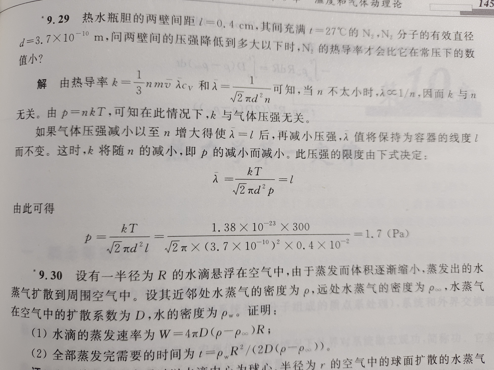

# 热学

***气体压强越小，理想气体状态方程就越准确。***

***双原子分子的压强公式是$2n\bar\varepsilon_k/5$吗***

无论分子有多少个原子，根据统计理论推算微观压强公式都应该是$p = 2n\bar\varepsilon_t/3$。原因是微观压强公式只考虑平动动能，不考虑转动和振动动能（显然转动和振动不会对压强造成影响）。而$\bar\varepsilon_k = \bar\varepsilon_t + \bar\varepsilon_r + \bar\varepsilon_v$。