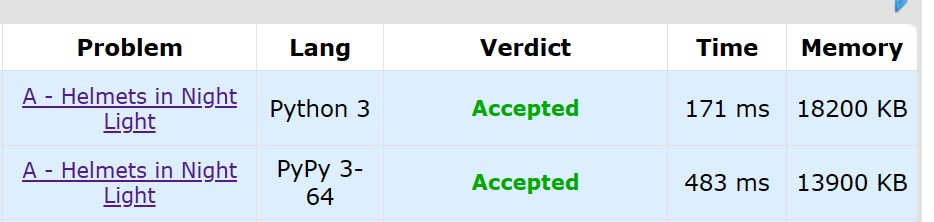

## idea

python语言以其时间性能和空间性能低下著称，在各类 OJ 竞赛中尤为劣势。因此，优化 python 语言的空间和时间成为了一种可以研究的技巧（）

* 使用 python 练习 Codeforce 最新赛题
* 比较 test case 的通过时间，从而得出优化结论

### 解释器的选择

Codeforce 官网称，采用 PyPy 运行 python 代码的速度远快于原生 python 解释器。

《much faster》

建议一个不快就换另一个

### python 时间优化技巧

**list.pop()很占用时间**

赛题为 `Codeforces Round 902 (Div. 1, based on COMPFEST 15 - Final Round)`

优化前的代码：

~~~python
def single(n, p, a, b):
    all_len = n
    person_list = list(range(all_len))
    person_list.sort(key=lambda x:b[x])
    cost = p
    informed_len = 1
    while informed_len < all_len:
        index = person_list.pop(0)
        item_a = a[index]
        item_b = b[index]
        if item_b < p:
            if item_a < all_len - informed_len:
                # continue
                informed_len += item_a
                cost += item_a * item_b
            else:
                # end
                rest_len = all_len - informed_len
                cost += rest_len * item_b
                break
        else:
            rest_len = all_len - informed_len
            cost += rest_len * p
            break

    return cost
~~~

结局：`Test: #8, time: 1000 ms., memory: 12104 KB, exit code: -1, checker exit code: 0, verdict: TIME_LIMIT_EXCEEDED`

优化后的代码：

~~~python
def single(n, p, a, b):
    all_len = n
    person_list = list(range(all_len))
    person_list.sort(key=lambda x:b[x])
    cost = p
    informed_len = 1
    front = 0
    while informed_len < all_len:
        index = person_list[front]
        item_a = a[index]
        item_b = b[index]
        if item_b < p:
            if item_a < all_len - informed_len:
                # continue
                informed_len += item_a
                cost += item_a * item_b
            else:
                # end
                rest_len = all_len - informed_len
                cost += rest_len * item_b
                break
        else:
            # end
            rest_len = all_len - informed_len
            cost += rest_len * p
            break
        front += 1

    return cost
~~~

结局：`Accepted`。在 test #8上：`Test: #8, time: 171 ms., memory: 12140 KB, exit code: 0, checker exit code: 0, verdict: OK`

pop会删除列表的元素，因此需要多余的时间。故采用下标记录列表的顶层元素更节约时间。

