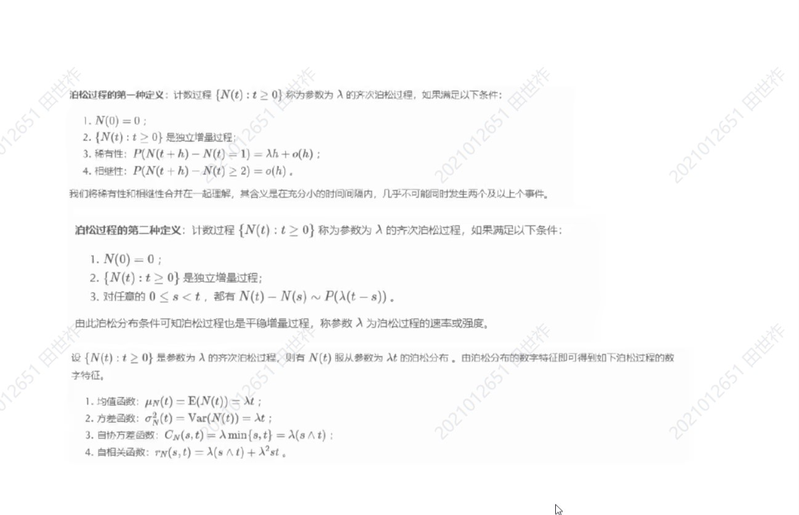

## 随机过程随机过

信号与系统：研究确定信号随着时间、空间的变化

概率论：研究随机信号，但是不随时间、空间变化

随机过程：研究随机的信号随着时间、空间的变化

> 期末70分梭哈
> 
> 考试题目不随机，就跟不上这门课的要求。

### 概率与随机变量回顾

样本空间$\Omega$

性质：
* 非负性：$P(A) \ge 0$
* 规范性：$P(\Omega), P(\emptyset) = 0$
* 可加性：$P(\bigcup\limits_{k = 1}^{\infty}A_k) = \sum\limits_{k=1}^{\infty}P(A_k)$

贝叶斯：

$$
P(B_i|A) = \frac{P(A|B_i)P(B_i)}{\sum\limits_{j = 1}^{k}P(B_j)P(A|B_j)}
$$

随机变量：

分布函数，概率密度函数

期望，方差，协方差，相关系数

伯努利分布，高斯分布，泊松分布，瑞利分布

伯努利分布的概率密度函数：

当$k=1$时，$P(X=1) = p$
当$k=0$时，$P(X=0) = 1-p$

高斯分布的概率密度函数：
$P(x) = \frac{1}{\sqrt{2\pi\sigma^2}}\exp\left(-\frac{(x-\mu)^2}{2\sigma^2}\right)$

二维高斯分布的概率密度函数：

$P(x,y) = \frac{1}{2\pi\sigma_x\sigma_y\sqrt{1-\rho^2}}\exp\left(-\frac{1}{2(1-\rho^2)}\left[\frac{(x-\mu_x)^2}{\sigma_x^2}-2\rho\frac{(x-\mu_x)(y-\mu_y)}{\sigma_x\sigma_y}+\frac{(y-\mu_y)^2}{\sigma_y^2}\right]\right)$

其中，$\mu_x$和$\mu_y$是均值，$\sigma_x$和$\sigma_y$是标准差，$\rho$是相关系数。

泊松分布的概率密度函数：
$P(k;\lambda) = \frac{\lambda^k}{k!}\exp(-\lambda)$

瑞利分布的概率密度函数：
$P(x;\sigma) = \frac{x}{\sigma^2}\exp\left(-\frac{x^2}{2\sigma^2}\right)$

### 随机过程的基本概念

定义：

给定概率空间$(\Omega, \mathcal{F}, P)$，定义参数集$T \subset R$，$t \in T$

$$
X = \lbrace X(t, \omega), t \in T, \omega \in \Omega \rbrace
$$

简记为$X(t)$: $X = \lbrace X(t), t \in T\rbrace$

解释：

* 二元单值函数
* 对每个固定t，$X(t, \omega)$是一个随机变量
* 每个$\omega_0 \in \Omega$, $X(t, \omega_0)$是定义在T上的函数，记为$x(t, \omega_0)$

单样本为随机变量：均值、方差、协方差、有限维联合分布等

随机过程的函数特性：时间的相关性，连续性和离散性，随机过程的导数、微分、积分、卷积、级数展开、微分方程、积分方程等

二重性的联合特征：

分类：

离散时间，离散分布：Bernouli过程

离散时间，连续分布：自回归过程

连续参数离散随机过程：Poission过程

连续参数连续型随机过程：Brown运动

数学特征：

相互独立和不相关是两个概念，无必然因果联系。

根据数字特征分类：

* 独立增量过程
* 平稳过程及二阶矩过程
* 马尔可夫过程
* 更新过程

独立增量过程是一种随机过程，具有以下特性：

1. 零起点：独立增量过程在零时刻（通常表示为$t=0$）的取值为零，即$X(0) = 0$。

2. 独立增量：对于任意时刻$t_1 < t_2 < \cdots < t_n$，随机变量$X(t_2)-X(t_1), X(t_3)-X(t_2), \cdots, X(t_n)-X(t_{n-1})$是相互独立的。

若对一切$0\le s \lt t$，增量$X(t) - X(s)$的分布仅依赖于$t - s$，则称之为平稳增量，具有平稳增量的独立增量过程称为独立平稳增量过程，例如泊松和布朗。

二阶矩过程：$D(X(t))$

宽平稳过程：

宽平稳过程可以用以下简单的数学表达式表示：

1. 均值平稳性：对于宽平稳过程 $X(t)$，其均值满足 $E[X(t)] = \mu$，其中 $\mu$ 是一个常数。

2. 自相关平稳性：宽平稳过程的自相关函数在时间差 $\tau$ 下为常数，可以表示为 $R_X(\tau) = R_X(t,t+\tau) = \text{常数}$，其中 $R_X(\tau)$ 表示宽平稳过程的自相关函数。

严平稳过程（Strict-sense stationary process），也称为严格平稳过程或强平稳过程，是一种具有更强平稳性质的随机过程。它满足以下两个条件：

1. 时移不变性：严平稳过程的统计性质在时间上任意平移保持不变。具体而言，对于任意时间差 $\tau$ 和任意时间点 $t$，随机变量 $X(t)$ 和 $X(t+\tau)$ 的联合分布相同，即联合分布满足 $P(X(t) \in A, X(t+\tau) \in B) = P(X(0) \in A, X(\tau) \in B)$，其中 $A,B$ 是任意集合。

2. 自相关平稳性：严平稳过程的自相关函数只与时间差有关，与参考时刻无关。具体而言，对于任意时间差 $\tau$ 和任意时间点 $t$，自相关函数满足 $R_X(t,t+\tau) = R_X(\tau)$，其中 $R_X(\tau)$ 表示严平稳过程的自相关函数。

马尔可夫过程是一种具有马尔可夫性质的随机过程。它可以用以下公式和概念来定义：

1. 状态空间：马尔可夫过程的状态空间是一个离散集合，表示可能的状态集合。通常用符号 $S$ 表示，$S = \{s_1, s_2, \ldots\}$。

2. 马尔可夫性质：马尔可夫过程具有马尔可夫性质，也称为无后效性。即，在给定当前时刻的状态 $X(t)$ 之下，未来的状态 $X(t+\Delta t)$ 只依赖于当前的状态 $X(t)$，与过去的状态 $X(t-1), X(t-2), \ldots$ 无关。

3. 转移概率：转移概率描述了在给定当前状态 $s_i$ 的情况下，马尔可夫过程在下一个时刻转移到状态 $s_j$ 的概率。转移概率通常用符号 $P_{ij}$ 表示，即 $P_{ij} = P(X(t+\Delta t) = s_j \mid X(t) = s_i)$。

通过状态空间和转移概率，可以构建一个马尔可夫过程的状态转移矩阵（Transition Matrix），它描述了从一个状态到另一个状态的转移概率情况。

更新过程：

更新过程可以使用以下公式来描述：

1. 到达时间：假设到达时间的随机变量序列为 $T_1, T_2, T_3, \ldots$，其中 $T_i$ 表示事件 $i$ 的到达时间。

2. 描述参数：更新过程的到达率（或强度）表示单位时间内平均发生事件的次数。通常用符号 $\lambda$ 表示，即 $\lambda = \lim_{t \to \infty} \frac{N(t)}{t}$，其中 $N(t)$ 表示时间 $t$ 之前（包括 $t$）发生的事件次数。

3. 插值函数：更新过程的插值函数（或插值过程）表示给定时间 $t$ 时，最近的到达时间是多久之前。记为 $S(t)$，即 $S(t) = \sup\{T_i \leq t\}$，表示最近的到达时间小于等于 $t$ 的时间点。

可以定义复随机过程：

复随机过程是一组复数值随机变量的集合 $\{X(t), t \in T\}$，其中 $X(t)$ 是定义在概率空间 $(\Omega, \mathcal{F}, P)$ 上的复数值随机变量，表示在时间点 $t$ 上的取值。

具体而言，对于每个时间点 $t \in T$，$X(t)$ 是一个复数值随机变量，可以表示为 $X(t) = R(t) + iI(t)$，其中 $R(t)$ 和 $I(t)$ 分别表示实部和虚部。

复随机过程可以通过概率空间 $(\Omega, \mathcal{F}, P)$ 上的复数随机变量以及时间参数 $T$ 来描述，并且在不同时间点上表现出复数值随机变量的随机性质。

数学特征：

均值函数（一阶原点矩）：$\mu_X(t) = E[X(t)]$

方差函数：$\text{Var}[X(t)] = E[(X(t) - \mu_X(t))(X(t) - \overline{\mu_X(t)} )]$

自相关函数：$R_X(t_1, t_2) = E[(X(t_1) - \mu_X(t_1))(X(t_2) - \overline{\mu_X(t_2)} )]$

自协方差函数：$\text{Cov}[X(t_1), X(t_2)] = E[(X(t_1) - \mu_X(t_1))(X(t_2) - \overline{\mu_X(t_2)} )]$

均方值函数：$E[|X(t)|^2] = \int_{-\infty}^{\infty} |x|^2 f_X(x,t)dx$

### 基本研究方法

* 相关方法
* Markov 方法

**相关**

若随机过程在任意时刻的均值和方差都存在，则称之为二阶矩过程（second order process），即均方可积空间上的随机变量。

均方可积空间是内积空间。相关运算是均方可积的内积运算：

$$
\langle X, Y \rangle = E(X\overline Y)
$$

宽平稳（wide-sense stationary）:

$$
R_X(t, s) = R_X(t + D, s + D) = R(t - s)
$$

功率谱密度：

$$
S_X(\omega) = \int_{-\infty}^{\infty}R_X(\tau)\exp(-j\omega\tau)\mathrm d\tau
$$

最优线性估计

**Markov**

有限维联合分布可以由各阶的条件分布表示出来：

$$
\begin{align*}
    &F_{X(t_1), \dots, X(t_n)}(x_1, \dots, x_n) \\
    =&F_{X(t_n)|X(t_{n - 1}), \dots, X(t_1)}(x_n|x_{n - 1}, \dots, x_1)F_{X(t_{n - 1}), \dots, X(t_1)}(x_1, \dots, x_{n - 1})\\
    =&F_{X(t_n)|X(t_{n - 1}), \dots, X(t_1)}(x_n|x_{n - 1}, \dots, x_1)\dots F_{X(t_2)|X(t_1)}(x_2|x_1)F_{X(t_1)}(x_1)
\end{align*}
$$

无后效性的 markov 过程：

$$
F_{X(t_n)|X(t_{n - 1}), \dots, X(t_1)}(x_n|x_{n - 1}, \dots, x_1) = F_{X(t_n)|X(t_{n - 1})}(x_n|x_{n - 1})
$$

从而所有高阶依赖关系都可以简化为二阶依赖：

$$
F_{X(t_1), \dots, X(t_n)}(x_1, \dots, x_n)=F_{X(t_n)|X(t_{n - 1})}(x_n|x_{n - 1})\dots F_{X(t_2)|X(t_1)}(x_2|x_1)F_{X(t_1)}(x_1)
$$

## 相关理论与二阶矩过程——时域分析

### 自相关函数

由二阶矩过程的定义可知，均方可积空间的自相关函数、自协方差函数、互相关函数、互协方差函数均存在。

均值函数（一阶原点矩）：$\mu_X(t) = E[X(t)]$

方差函数：$\text{Var}[X(t)] = E[(X(t) - \mu_X(t))^2]$

自相关函数：$R_X(t_1, t_2) = E[(X(t_1))(X^*(t_2))]$

自协方差函数：$C_X(t_1, t_2) = \text{Cov}[X(t_1), X(t_2)] = E[(X(t_1) - \mu_X(t_1))(X(t_2) - \mu_X(t_2))^*]$

均方值函数：$E[X^2(t)] = \int_{-\infty}^{\infty} x^2 f_X(x,t)dx$

互相关函数和互协方差函数：

* 如果$E[X(s)Y(t)]存在$，记为$R_{XY}(s, t)$
* 如果$\text{cov}(X(s), Y(t))存在$，记为$C_{XY}(s, t)$

$$
R_{XY}(t_1, t_2) = E[(X(t_1))(Y^*(t_2))]
$$

$$
C_{XY}(t_1, t_2) = E[(X(t_1) - \mu_X(t_1))(Y(t_2) - \mu_Y(t_2))^*]
$$

$$
C_{XY}(s, t) = R_{XY}(s,t) - \mu_X(s)\mu_Y(t)
$$

不相关：

$$
C_{XY}(s, t) = 0
$$

$$
R_{XY}(s,t) = m_X(s)m_Y(t)
$$

自相关函数具有共轭对称性：

$$
R(t_1, t_2) = R^*(t_2, t_1)
$$

离散化的自相关矩阵同样是共轭对称的：

$$
R = E[XX^H]\\
R_{ij} = R^*_{ji}
$$

自相关矩阵是非负定的：

$$
\lambda R \lambda^H = \lambda XX^H\lambda^H \ge 0
$$

当 $P(\lambda X = 0) = 1$ 时等号成立。

非负定性是自相关函数的一种特征性质。如果一个二元函数满足非负定性质，则一定可以构造出一个随机过程，使得其自相关函数为给定的二元函数。

自相关矩阵非负定，分解的特征值均非负。其物理意义是信号的能量或者功率。

自相关函数对加法和乘法的封闭性：

$$
R(t, s) = \alpha R_1(t, s) + \beta R_2(t, s)
$$

仍然是某一随机过程的自相关函数。

证明：取 $Z(t) = \alpha^{1/2} X(t) + \beta^{1/2} Y(t)$。这里 $X(t), Y(t)$是独立的。

$$
R(t, s) = R_1(t, s)R_2(t, s)
$$

也是自相关函数。取 $Z(t) = X(t)Y(t)$。

### 宽平稳随机过程

**宽平稳**

对于随机过程 $X(t), t \in T$，若 $\forall t, s\in T$

$$
E(X(t)) = E(X(s))\\
R_X(t, s) = R_X(t + D, s + D)
$$

称随机过程 $X(t)$ 具有宽平稳性。

宽平稳过程的均值是常数，自相关函数与相对时间差有关。故宽平稳过程的自相关函数可以写成一元函数：$R_X(\tau), \tau = t - s$。

**严平稳**

对于随机过程 $X(t), t \in T$，若 $\forall n, \forall t_1, t_2, \dots, t_n \in T$，$\forall D \in T$，都有

$$
F_{t_1, t_2, \dots, t_n}(x_1, x_2, \dots, x_n) = F_{t_1 + D, t_2+D, \dots, t_n + D}(x_1, x_2, \dots, x_n)
$$

则称随机过程 $X(t), t\in T$具有严平稳性。

在二阶矩存在的条件下，严平稳蕴含宽平稳，而反过来，宽平稳一般无法得到严平稳。

高斯过程的严平稳与宽平稳等价。

**联合宽平稳**

$$
R_{X, Y}(t, s) = R_{XY}(t + D, s + D), \forall D \in T
$$

**宽平稳过程的性质**

设 $R_X(\tau)$ 为宽平稳过程的自相关函数， $m_X$ 为该过程的均值。

$$
\begin{align}
    R_X(\tau) = \overline{R_X(-\tau)}\\
    R_X(0)\ge |m_X|^2\\
    |R_X(\tau)| \le R_X(0)\\
    R_X(\tau) \text{是一元非负定函数。}
\end{align}
$$

### 正交增量过程

**正交增量过程**

对于二阶矩过程 $X(t), t \in \R$，若 $\forall t_1 \lt t_2 \le t_3 \lt t_4$，$t_1, t_2, t_3, t_4 \in \R$，满足

$$
E(X(t_4) - X(t_3))(\overline{X(t_2) - X(t_1)}) = 0
$$

则称 $X(t), t \in \R$ 为正交增量过程。

**独立增量过程**

对于二阶矩过程 $X(t), t \in \R$，若 $\forall t_1 \lt t_2 \le t_3 \lt t_4$，$t_1, t_2, t_3, t_4 \in \R$，$X(t_4) - X(t_3)$ 和 $X(t_2) - X(t_1)$ 统计独立，则称为独立增量过程。

均值为0的独立增量过程是正交增量过程。

**平稳增量过程**

对于随机过程 $X(t), t \in \R$，若 $X(t) - X(s)$ 的分布仅仅依赖于 $t - s$，则称为平稳增量过程。

定理：

随机过程 $X(t), t \in [0, \infty]$，满足 $X(0) = 0$，则其为正交增量过程的充要条件为

$$
R_X(s, t) = F(\min(s, t))
$$

其中，$F(\cdot)$是单调不减的函数。

### 随机过程的极限、连续、导数、积分

**均方极限**

$$
E(|ka|^2)
$$

唯一性：若 $X_n \xrightarrow{m.s} X, X_n \xrightarrow{m.s}Y$，则 $E(|X - Y|^2) = 0$.

可加性：

数字特征相同：

如何判定 ${X_n}$ 是否收敛？

Cauchy 准则

$$
X_n \xrightarrow{m.s}{X} \Leftrightarrow E(|X_m - X_n|^2) = 0, m, n \rightarrow \infty
$$

洛伊夫准则：

$$
X_n \xrightarrow{m.s} X \lrArr E\lbrace X_n X_m^*\rbrace \rightarrow \text{constant}
$$

**均方连续**

二阶矩过程，$t \rightarrow t_0, X(t) \xrightarrow{m.s.} X(t_0)$，则称 $X(t)$ 在 $t_0$ 处连续

定理

以下命题等价：

1. $R(t, s)$ 在 $(t_0, t_0)$ 上连续，$\forall t_0 \in T$
2. $X(t)$ 在 $T$ 上均方连续
3. $R(t, s)$ 在 $T \times T$ 上连续

推论

对于宽平稳过程 $X(t)$，$R(\tau)$ 为自相关函数，以下命题等价：

1. $R(\tau)$ 在 $\tau = 0$ 处连续；
2. $X(t)$ 在 $T$ 上均方连续；
3. $R(\tau)$ 在 T 上连续。

**均方导数**

若 $\frac{X(t_0 + h) - X(t_0)}{h}\xrightarrow{m.s.}Y(t_0), \forall t_0 \in T, h \rightarrow 0$，则称$\lbrace X(t) \rbrace$ 在均方意义下的导数为 $Y(t)$。

如何判断 $X(t)$ 是否均方可导？

Cauchy 准则

$$
E\left(|\frac{X(t_0 + h) - X(t_0)}{h} - \frac{X(t_0 + g) - X(t_0)}{g}|^2\right) \rightarrow 0, \forall h, g \rightarrow 0
$$

洛伊夫准则

$$
E\left(\left(\frac{X(t_0 + h) - X(t_0)}{h}\right)\left(\frac{X(t_0 + g) - X(t_0)}{g}\right)^*\right) \rightarrow 0, \forall h, g \rightarrow 0
$$

均方导数判定定理

$$
\frac{\partial^2 R(t, s)}{\partial t \partial s} 在 (t_0, t_0) 存在且连续，则 X(t) 在 t_0 处存在均方倒数
$$

均方导数的性质：

$f(t)$ 为线性函数

* $E(X^\prime(t)) = \frac{\mathrm d }{\mathrm dt} E(X(t))$
* $E(X^\prime(t)\overline{X(s)}) =\frac{\partial }{\partial t}R_x(t, s)$
* $E(X(t)\overline{X^\prime(s)}) =\frac{\partial }{\partial s}R_x(t, s)$
* $E(X^\prime(t)\overline{X^\prime(s)}) =\frac{\partial^2 }{\partial t\partial s}R_x(t, s)$

**均方积分**

若黎曼和 $\sum\limits_{k=1}^{n}X(v_k)h(v_k)(t_k - t_{k - 1})$ 在 $n \rightarrow \infty, \max\lbrace t_k - t_{k - 1}\rbrace \rightarrow 0$ 时均方收敛，其中 $h(t)$ 为确定的可积函数，则称$\lbrace X(t)\rbrace$ 为均方可积，记为 $\int_{a}^{b}X(t)h(t)\mathrm dt$。

判定定理

$$
\lbrace X(t)h(t) \rbrace 均方可积 \Leftrightarrow \int_{a}^{b}\int_{a}^{b}R_X(t, s)h(t)h^*(s)\mathrm dt\mathrm ds 存在
$$

均方积分的性质：

* $E\left( \int_{a}^{b}X(t)h(t)\mathrm dt\right) = \int_{a}^{b}E(X(t))h(t)\mathrm dt$
* $E\left( \left(\int_{a}^{b}X(t)h(t)\mathrm dt\right)\left(\int_{a}^{b}X(s)h(s)\mathrm ds\right)^*\right) = \int_{a}^{b}E(X(t))h(t)\mathrm dt$
* 三角不等式：$\sqrt{ E \left(|\int_{a}^{b}X(t)h(t)\mathrm dt|^2\right) } \le \int_{a}^{b}\sqrt{E\left(|X(t) - h(t)|^2\right)}\mathrm dt$
* 均方积分与均方导数：$X(t)$ 在 $[a, b]$ 上均方连续，$Y(t) = \int_{a}^{t}X(s)\mathrm ds$，其中等号代表均方相等，则 $\lbrace Y(t)\rbrace$ 在 $[a, b]$ 可导，并称在均方意义下 $\lbrace Y(t) \rbrace$ 的导数为 $\lbrace X(t) \rbrace$

### 随机过程的遍历性

统计平均：对样本空间取平均

$$
E\lbrace X(t_0) \rbrace = \int_{}^{}x\mathrm dF_X(x;t_0)
$$

时间平均：

$$
\langle X(t) \rangle = \frac{1}{T} \int_{-T/2}^{T/2}X(t)\mathrm dt
$$

统计平均和时间平均的关系？

时间平均更容易获得。如果我们可以通过时间平均来获得统计平均？

**遍历性**

定义-宽平稳过程均值遍历：

$$
\langle X(t) \rangle = \lim\limits_{T\rightarrow\infty} \frac{1}{2T} \int_{-T}^{T}X(t)\mathrm dt \mathop{=}\limits^{a.s.} E \lbrace X(t) \rbrace = \mu
$$

a.s. = with probability 1

左边是随机变量，右边是一个确定的数。这样的相等，意味着左边的随机变量的均值确定，方差为0.

定义：宽平稳过程自相关遍历

$$
\langle X(t + \tau)X^*(t) \rangle = \lim\limits_{T\rightarrow\infty} \frac{1}{2T} \int_{-T}^{T}X(t + \tau)X^*(t)\mathrm dt \mathop{=}\limits^{a.s.} R_X(\tau) = E \lbrace X(t + \tau)X^*(t)\rbrace
$$

a.s. = with probability 1

定理：

宽平稳过程 $X(t)$ 满足均值遍历 $\lrArr$ 

$$
D(\langle X(t) \rangle) = \lim\limits_{T \rightarrow\infty} \frac{1}{2T}\int_{-2T}^{2T}\left(1 - \frac{|\tau|}{2T}\right)(R_X(\tau) - |\mu|^2)\mathrm d\tau = 0
$$

定理：

宽平稳过程具有均值遍历性的充要条件是：

$$
\lim\limits_{T\rightarrow\infty} \frac{1}{2T}\int_{-T}^{T}C_X(\tau)\mathrm d\tau = 0 或者 \lim\limits_{T\rightarrow\infty} \frac{1}{T}\int_{0}^{T}C_X(\tau)\mathrm d\tau = 0
$$

时间比较长的时候相关性消失了，也就是说过了一段时间同一轨道的样本就独立了，等价于多个轨道的样本，时间平均和统计平均就相等了。

2个推论：

* 若实数宽平稳过程的协方差函数满足 $\int_{0}^{+\infty}C_x(\tau)\mathrm d\tau\lt +\infty$，则该过程具有均值遍历性
* 若实数宽平稳过程的协方差函数满足 $C_x(\tau) \rightarrow 0, \tau \rightarrow +\infty$，则该过程具有均值遍历性

### 随机过程的线性展开

**卡胡曼-洛伊夫展开**

在平方可积空间上

定义范数

定义内积，正交

在 $L^2[a, b]$ 中一定有一组标准正交基函数 $\phi_1(t), \phi_2(t), \phi_3(t)\dots$ 满足

$$
\begin{cases}
    \langle \phi_i, \phi_j \rangle = 0, i\ne j\\
    \langle \phi_i, \phi_i \rangle = 1
\end{cases}
$$

* $f$ 可以用有限个基函数线性加和来逼近
* $\langle f, \phi_n \rangle$ 表示 $f$ 在 $\phi_n$ 基上的坐标。

周期性宽平稳随机过程可以用傅里叶级数展开

$$
E\left(\left |X(t) -\sum\limits_{n=-\infty}^{\infty}c_ne^{j\omega_0t}  \right |^2\right) = 0
$$

一般的用 KL 展开

随机向量的双正交展开：

零均值的 $n$ 元随机向量 $\mathbf X \in R^n$ 可以如下展开：

$$
X = \sum\limits_{k=1}^{n} \xi_k \mathbf e_k
$$

基向量选择的是自相关矩阵 $\mathbf R$ 的特征向量。

如果我们用 $\mathbf K$ 个维度来逼近 $\mathbf X$，为了使得误差最小，选取最大的$\mathbf K$个特征值： $\mathbf X =\sum\limits_{k=1}^{K} \alpha_k\mathbf e_k$。这就是主成分分析（PCA）。

## 谱分析

### 周期函数的傅里叶级数

$$
x(t) =\sum\limits_{n=-\infty}^{\infty}a_n e^{j\omega_0 t}, \omega_0 = \frac{2\pi}{T}\\
a_n = \frac{1}{T}\int_{0}^{T}x(t)e^{-jn\omega_0t}\mathrm dt
$$

帕斯瓦尔定理

$$
\frac{1}{T}\int_{0}^{T}|x(t)|^2\mathrm dt =\sum\limits_{n=-\infty}^{\infty}|a_n|^2
$$

自相关函数

$$
R(\tau) = \frac{1}{T}\int_{0}^{T}x(t + \tau)x^*(t)\mathrm dt
$$

功率谱密度

$$
S(\omega) =\sum\limits_{n=-\infty}^{\infty}|a_n|^2\delta(\omega - n \omega_0)
$$

从而有

$$
S(\omega) = \int_{-\infty}^{\infty}R(\tau)e^{-j\omega\tau}\mathrm d\tau
$$

### 非周期函数的傅里叶变换

#### 知识

$$
F(\omega) = \int_{-\infty}^{\infty}x(t)\exp(-j\omega t)\mathrm dt\\
x(t) = \frac{1}{2\pi}\int_{-\infty}^{\infty}F(\omega)\exp(j\omega t)\mathrm d\omega = \int_{-\infty}^{\infty}F(f)\exp(j2\pi ft)\mathrm df
$$

帕斯瓦尔定理

$$
\int_{-\infty}^{\infty}|x(t)|^2\mathrm dt = \int_{-\infty}^{\infty}|F(f)|^2\mathrm df
$$

$$
时域采样 \lrarr 频域周期延拓\\
时域周期延拓 \lrarr 频域采样\\
$$

自相关函数

$$
R(\tau) = \int_{-\infty}^{\infty}x(t + \tau)x^*(t)\mathrm dt
$$

能量谱密度

$$
S(\omega) = |F(\omega)|^2 = \left |\int_{-\infty}^{\infty}x(t)e^{j\omega t}\mathrm dt  \right|^2\\
$$

波赫纳尔——辛钦定理

$$
S(\omega) = \int_{-\infty}^{\infty}R(\tau)e^{-j\omega\tau}\mathrm d\tau\\
R(\tau) = \frac{1}{2\pi}\int_{-\infty}^{\infty}S(\omega)e^{j\omega\tau}\mathrm d\omega, S(\omega)\ge 0
$$

实过程的 $S(\omega)$ 为偶函数。

离散随机过程的功率谱：

只在整数点 k 采样

$$
S(\omega) =\sum\limits_{k=-\infty}^{\infty}R(k)e^{-j\omega k}\\
R(k) = \frac{1}{2\pi}\int_{-\pi}^{\pi}S(\omega)e^{j\omega k}\mathrm d\omega
$$

周期过程（自相关函数有周期性）的功率谱

$$
S(\omega) =\sum\limits_{n=-\infty}^{\infty}b_n\delta(\omega - n \Delta \omega)\\
R(\tau) = \frac{1}{2\pi}\sum\limits_{n=-\infty}^{\infty}b_ne^{jn\Delta\omega\tau}
$$

#### 例子

白噪声 $E \lbrace X(t) \rbrace = 0$，

$$
S(\omega) = N_0, -\infty \lt \omega \le \infty\\
R(\tau) = N_0\delta(\tau)
$$

* 任意两个不同时刻 $X(t_1), X(t_2)$ 都不相关。
* 在各个频率上都有分量，且强度一致。

高斯白噪声：各时刻服从高斯分布的白噪声

色噪声： $R(\tau)$ 不是冲击函数。

* 当某过程 $R(\tau)$ 比较胖的时候，功率谱比较瘦
  * 相隔较长时间 $X(t)$ 与 $X(t + \tau)$ 还相关，说明信号变化慢，对应频域低频多
分量多
* 当某过程 $R(\tau)$ 比较瘦时，功率谱比较胖
* 相隔一点时间， $X(t)$ 与 $X(t + \tau)$ 不太相关，说明信号变化快，对应频域高频分量多。

互谱密度

$$
S_{XY}(\omega) = \int_{-\infty}^{\infty}R_{XY}(\tau)e^{-j\omega \tau}\mathrm d\tau
$$

称为互谱密度，不具有功率的含义。

$$
S_{YX}(\omega) = S_{XY}^*(\omega)\\
R_{XY}(\tau) = 0, \forall \tau \lrArr S_{XY}(\omega) = 0, \forall \omega
$$

$$
Z(t) = X(t) + Y(t)\\
R_Z(\tau) = E \lbrace (X(t + \tau) + Y(t + \tau))\overline{(X(t) + Y(t))} \rbrace = R_X(\tau) + R_{XY}(\tau) + R_{XY}
$$

一个宽平稳过程分别通过两个 LTI 系统：

$$
Y_1(t) = X(t) * h_1(t)\\
Y_2(t) = X(t) * h_2(t)\\
R_{Y_1Y_2}(\tau) = R_X(\tau) * h_1(\tau) * h_2^*(-\tau)\\
S_{Y_1Y_2}(\omega) = S_X(\omega)H_1(\omega)H_2^*(\omega)\\
$$

两个过程输入两个系统，输出过程的互谱（互相关函数的傅里叶变换）。怎么求？

（输入为联合宽平稳）

$$
\hat X(t) = X(t) * f(t)\\
\hat Y(t) = Y(t) * g(t)\\
R_{\hat X\hat Y}(\tau) = R_{XY}(\tau) * f(\tau) * g^*(-\tau)\\
S_{\hat X\hat Y}(\omega) = S_{XY}(\omega)F(\omega)G^*(\omega)
$$

### 宽平稳过程通过线性系统

$$
Y(t) = \int_{-\infty}^{\infty}h(t - \tau)X(\tau)\mathrm d\tau
$$

总结：
* 输出过程的均值：易求，因为宽平稳过程的均值为常数
* 输出过程的自相关函数：有点麻烦

首先看输出与输入的自相关

$$
R_{YX}(\tau) = \int_{-\infty}^{\infty}h(v)R_x(\tau - v)\mathrm dv\\
R_Y(\tau) = \int_{-\infty}^{\infty}h^*(-u)R_{YX}(\tau - u)\mathrm du
$$

$$
R_Y(\tau) = R_X(\tau) * h(\tau) * h^*(-\tau)\\
S_Y(\omega) = |H(\omega)|^2S_X(\omega)
$$

因此，输出的自相关，也可以用功率谱求解。

### 离散时间宽平稳序列

$$
R_{YX}(k) = h(k) * R_X(k)\\
R_Y(k) = h^*(-k) * h(k) * R_X(k)\\
S_Y(z) = H(z) H^*(\frac{1}{z^*})S_X(z)\\
其中 H(z) =\sum\limits_{}^{}h(k)z^{-k}\\
令 z = e^{j\omega}\\
S_Y(\omega) = |H(\omega)|^2S_X(\omega)
$$

理想白噪声通过低通滤波器：

$$
S_Y(f) = \begin{cases}
    k_0, -f_c \le f \le f_c,\\
    0, \text{otherwise.}
\end{cases}\\
R_Y(0) = 2f_ck_0\\
R(\tau) = R_Y(0)\frac{\sin(2\pi f_c\tau)}{2\pi f_c\tau}
$$

从自相关函数可看出，相隔 $\frac{n}{2f_c}$ 的两个时刻不相关。因此，以 $2f_c$ 为采样频率的噪声采样数据彼此不相关。

可以证明宽平稳过程功率谱非负：$S_X(f) \ge 0$：

$$
E \lbrace |Y(t)|^2 \rbrace =  R_Y(0) = \int_{-\infty}^{\infty}S_Y(f)\mathrm df = \int_{-\infty}^{\infty}S_X(f)|H(f)|^2\mathrm df \ge 0
$$

如果 $S_X(f)$ 在某个地方小于0，可以设计对应的滤波器 $H(f)$将这个小于0的区域滤出来，从而 $\int_{-\infty}^{\infty}S_X(f)|H(f)|^2\mathrm df \le 0$，导致矛盾。

线性系统例子：

滑动平均

$$
Y(t) = \frac{1}{T}\int_{t-T}^{t}X(s)\mathrm ds
$$

转化为滤波器：

$$
R_Y(t) = R_X(t) * h(t) * h^*(-t)\\
h(t) = \begin{cases}
    \frac{1}{T}, 0 \le t \le T,\\
    0, \text{otherwise.}
\end{cases}
$$

令 

$$
g(t) = h(t) * h^*(t) = \begin{cases}
    \frac{1}{T}\left ( 1 - \frac{|t|}{T} \right), t \in [-T, T],\\
    0,\text{otherwise.}
\end{cases}
$$

理想的矩形窗

$$
R_Y(t) = \int_{-\infty}^{\infty}g(t - \tau)R_X(\tau)\mathrm d\tau = \int_{-T}^{T}\frac{1}{T}\left ( 1 - \frac{|t - \tau|}{T} \right)R_X(\tau)\mathrm d\tau
$$

从频域看

$$
H(\omega) = \text{sinc} \left ( \frac{\omega T}{2} \right)e^{-j\omega \frac{T}{2}}\\
S_Y(\omega) = S_X(\omega)\left |\text{sinc} \left ( \frac{\omega T}{2} \right)  \right|^2
$$

是一个低通滤波器。

例子2：MTI 滤波

静止目标反射信号相同，运动目标反射回波不同。因此设计滤波器消去静止目标。称为“对消”。

$$
Y(t) = X(t) - X(t - T)
$$

在频域看：

$$
H(\omega) = 1 - e^{j\omega T}
$$

静止目标，多普勒频率为0，因此频域响应为0；运动目标，多普勒频率不为0，频域响应不为0。因此这是一个高通滤波器。

还可以多次对消：

$$
Y_1(t) = X(t) - X(t - T)\\
Y_2(t) = Y_1(t) - Y_1(t - T)\\
Y_3(t) = Y_2(t) - Y_2(t - T)\\
\vdots\\
Y_n(t) = Y_{n - 1}(t) - Y_{n - 1}(t - T)
$$

频率响应：

$$
H(\omega) = (1 - e^{-j\omega T})^n
$$

### 采样定理

随机过程下的采样定理

$|f| \le f_0$, 当 $f_s \le 2f_0$ 时，均方意义下有

$$
X(t) =\sum\limits_{k=-\infty}^{\infty}X(kT) \text{sinc} \left ( \frac{\pi}{T}(t - kT) \right)
$$

证明：

$$
\begin{align*}
    &要证明 N \rightarrow \infty 时,\\
    &\varepsilon_N = E \left \lbrace  \left | X(t) -\sum\limits_{k=-N}^{N}X(kT)\text{sinc} \left ( \frac{\pi}{T}(t - kT) \right) \right|^2 \right \rbrace \rightarrow 0\\
    &利用E \lbrace X(a) X^*(b) \rbrace = R_X(a - b) = \frac{1}{2\pi}\int_{-\infty}^{\infty}e^{j\omega a}e^{-j\omega b}S_X(\omega)\mathrm d\omega，展开上式\\
    &\varepsilon_N = \frac{1}{2\pi}\int_{-\infty}^{\infty}\left | e^{j\omega t} -\sum\limits_{k=-N}^{N}e^{j\omega kT}\text{sinc} \left ( \frac{\pi}{T}(t - kT) \right) \right|^2  S_X(\omega)\mathrm d\omega\\
    &= \frac{1}{2\pi}\int_{-\omega_s/2}^{\omega_s/2}\left | e^{j\omega t} -\sum\limits_{k=-N}^{N}e^{j\omega kT}\text{sinc} \left ( \frac{\pi}{T}(t - kT) \right) \right|^2  S_X(\omega)\mathrm d\omega\\
    &对 e^{j\omega t}做周期延拓，周期为 \omega_s，可以做频域傅里叶级数展开\\
    &e^{j\omega t} = \sum\limits_{k=-\infty}^{\infty}\alpha_k e^{j\omega \frac{2\pi}{\omega_s}} = \sum\limits_{k=-\infty}^{\infty}\alpha_k e^{j\omega kT}\\
    &\alpha_k = \frac{1}{\omega_s}\int_{-\omega_s/2}^{\omega_s/2}e^{j\omega t}e^{-j\omega kT}\mathrm d\omega = \frac{\sin(\frac{\omega}{2}(t - kT))}{\frac{\omega}{2}(t - kT)}\\
    &从而\left | e^{j\omega t} -\sum\limits_{k=-N}^{N}e^{j\omega kT}\text{sinc} \left ( \frac{\pi}{T}(t - kT) \right) \right|^2 = \left | e^{j\omega t} -\sum\limits_{k=-N}^{N}\alpha_k e^{j\omega kT}\right|^2 \rightarrow 0, N \rightarrow \infty
\end{align*}
$$

* 采样定理两边是均方相等。
* 当满足采样定理时，离散点包含全部信息，任意取值点可以恢复。
* 频带边界点
  * 当功率谱在 $\pm \omega_0$ 处有 $\delta$ 函数时，以 $f_s = 2f_0$ 无法恢复信号。
  * 例如：$X(t) = \cos(\omega_0 t + \phi)$，$\phi$ 为随机相位，在$[0, 2\pi]$内均匀分布。
  * $R(\tau) = \frac{1}{2}\cos(\omega_0\tau)$
  * $S(\omega) = \delta(\omega - \omega_0) + \delta(\omega + \omega_0)$
  * 采样点 $X(kT) = (-1)^kX(0)$，与 $X(0)$ 严重相关。

欠采样

$$
\begin{align*}
    E \lbrace |\varepsilon(t)|^2 \rbrace =& \int_{\omega_s/2}^{-\omega_s/2}\sum\limits_{n=-\infty}^{\infty}|1 - e^{jn\omega t}|S(\omega + n\omega_s)\mathrm d\omega\\
    =&\sum\limits_{n=-\infty}^{\infty}4\sin^2(\omega_snt/2) \cdot \int_{\omega_s/2}^{-\omega_s/2}S(\omega + n\omega_s)\mathrm d\omega\\
\end{align*}\\

上面的级数为积分的加权求和。 n = 0 时权重为0，对应[-\omega_s/2, \omega_s/2] 内的功率谱。\\
n\ne 0 时，权不为0，对应[-\omega_s/2, \omega_s/2]外的频谱，如果在这个区间外功率谱不是0，那 |\varepsilon|^2 将大于0。

$$

### 带通采样

$$
X(\omega) = 0, |\omega - \omega_c| > \omega_0, |\omega + \omega_c| > \omega_0
$$

一般研究实信号 $g(t)$，频谱具有共轭对称性，只需要考虑正半轴的频带就可以了：

$$
G(-\omega) = G^*(\omega)\\
A(\omega) = A(-\omega), \varphi(-\omega) = -\varphi(\omega)
$$

希尔伯特变换：

$$
H(\omega) = \begin{cases}
    -j, \omega \gt 0,\\
    0, \omega = 0,\\
    j, \omega \lt 0.
\end{cases}
$$

$$
\lbrace G(\omega)H(\omega) \rbrace^* = G(-\omega)H(-\omega)
$$

希尔伯特把正频率移相 $-90\degree$，负频率移相 $+90\degree$

时域表示：

滤波器的时域响应为

$$
\hat h(t) = \frac{1}{\pi t}
$$

g(t) 做两次希尔伯特变换，相位转了 $180\degree$：

$$
g(t)\xrightarrow{H(\omega)}\hat g(t) \xrightarrow{H(\omega)} -g(t)
$$

正交性：

$$
\int_{-\infty}^{\infty}g(t)\hat g(t)\mathrm dt = 0
$$

看成$\hat g(t)$ 与 $g(-t)$ 的卷积：

$$
\int_{-\infty}^{\infty}g(t)\hat g(t)\mathrm dt = \int_{-\infty}^{\infty}g(- (u - t))\hat g(t)\mathrm dt|_{u = 0} = g(-t) * \hat g(t) |_{t = 0}\\
g(-t) \rightarrow G^*(\omega) = G(-\omega), \hat g(t) \rightarrow G(\omega)H(\omega)\\
g(-t) * \hat g(t)|_{t = 0} = \int_{-\infty}^{\infty}G^*(\omega)G(\omega)H(\omega)e^{j\omega t}\mathrm d\omega|_{t = 0} = 0
$$

希尔伯特变换与原信号相加得到单边的频谱：

$$
g(t) \rightarrow A^* + A\\
j\hat g(t) \rightarrow \\
g(t) + j\hat g(t) \rightarrow 2A\\
$$

下变频：

$$
\tilde{g}(t) = \lbrace g(t) + j\hat g(t) \rbrace e^{-j\omega_c t} = g_I(t) + jg_Q(t)\\
g_I(t) = g(t) \cos \omega_c t + \hat g(t) \sin (\omega_c t)\\
g_Q(t) = - g(t) \sin \omega_c t + \hat g(t) \cos (\omega_c t)\\
$$

实际上是一个旋转矩阵，把单边频信号 $\tilde g(t)$ 顺时针旋转了 $\omega_ct$变成了基带复信号。

与原信号频谱的关系：

$$
g_I(t) \rightarrow G(f - f_c) + G(f + f_c) \\
g_Q(t) \rightarrow G(f - f_c)(+j) + G(f + f_c)(-j)\\
(f \le |f_0|)
$$

调制和解调的流程
* 调制：不需要得到 $\hat g(t)$
* 解调：通过低通滤波代替$\hat g(t)$

随机过程的希尔伯特变换

$X(t)$为实的带通随机过程

$$
R_X(-\tau) = E\left \lbrace  X(t - \tau)X^*(t) \right \rbrace = E\left \lbrace  X(t)X^*(t + \tau) \right \rbrace = E\left \lbrace  X(t + \tau)X(t) \right \rbrace = R_X(\tau)\\
S_X(-\omega) = \int_{-\infty}^{\infty}R_X(\tau)e^{-j(-\omega) \tau}\mathrm d\tau = \int_{-\infty}^{\infty}R_X(-u)e^{-j\omega\tau}\mathrm du = \int_{-\infty}^{\infty}R_X(u)e^{-j\omega\tau}\mathrm du = S_X(\omega)
$$

通过希尔伯特滤波器后：

$$
\hat X(t) = X(t) * h(t)\\
R_{\hat X}(\tau) = R_X(\tau) * h(t) * h^*(-t) = R_X(\tau)\\
S_{\hat X}(\omega) = S_X(\omega)|H(\omega)|^2 = S_X(\omega)
$$

互相关：

$$
\hat R_X(\tau) = R_{\hat XX}(\tau) = E \left \lbrace \int_{-\infty}^{\infty}X(t + \tau - u)\frac{1}{\pi u}\mathrm duX(t)   \right\rbrace = \int_{-\infty}^{\infty}R_X(\tau)\frac{1}{\pi u}\mathrm du
$$

$$
R_{X\hat X}(\tau) = -\hat R_X(\tau)
$$

因此

$$
Y = X + j\hat X\\
R_Y(\tau) = R_X(\tau) + R_{\hat X}(\tau) + jR_{\hat XX}(\tau) - jR_{X\hat X}(\tau) = 2R_X(\tau) + 2j\hat R_X(\tau)\\
S_Y(f) = \begin{cases}
    4S_X(f), &f \gt 0\\
    0, &f\lt 0
\end{cases}
$$

实的带通随机过程配合虚部的希尔伯特变换，同样也是只有正频率

反之，如果功率谱只有正频率有值，则实部和虚部互为希尔伯特变换，实部和虚部的信息是重复的。

随机信号的下变频：

$$
\tilde{X}(t) = \lbrace X(t) + j\hat X(t) \rbrace e^{-j\omega_c t} = X_I(t) + jX_Q(t)\\
X_I(t) = X(t) \cos \omega_c t + \hat X(t) \sin (\omega_c t)\\
X_Q(t) = - X(t) \sin \omega_c t + \hat X(t) \cos (\omega_c t)\\
$$

同样是顺时针旋转了 $2\pi f_c t$ 之后得到了基带信号

研究基带信号的实部、虚部的统计特性

$\tilde{X}(t)$ 还是一个平稳过程

$$
E \lbrace \tilde{X}(t) \rbrace = E \lbrace X_I(t) \rbrace = E \lbrace X_Q(t) \rbrace = 0\\
R_{X_I}(\tau) = R_X(\tau)\cos(2\pi f_c\tau) + \hat R_X(\tau)\sin(2\pi f_c\tau)\\
R_{X_Q}(\tau) = R_X(\tau)\cos(2\pi f_c\tau) + \hat R_X(\tau)\sin(2\pi f_c\tau)\\
R_{X_I}(\tau) = R_{X_Q}(\tau)\\
R_{X_Q}(0) = R_{X_I}(0) = R_{X}(0)(三者方差一样)\\
\hat R_X(0) = 0(奇函数，不具备自相关函数的性质)\\
S_{X_I}(f) = S_{X_Q}(f) = \begin{cases}
    S_X(f - f_c) + S_X(f + f_c), &|f| \le f_0,\\
    0, &\text{otherwise.}
\end{cases}
$$

基带信号虚部和实部的互相关

$$
R_{X_IX_Q}(\tau) = R_X(\tau)\sin(2\pi f_c\tau) - \hat R_X(\tau)\cos (2\pi f_c\tau)，奇函数
$$

$$
R_{X_IX_Q}(0) = 0
$$

因此同一时刻实部和虚部不相关。

互谱密度

$$
S_{X_IX_Q}(f) = \begin{cases}
    jS_X(f + f_c) - jS_X(f - f_c), &|f| \lt f_0,\\
    0, &\text{otherwise.}
\end{cases}
$$

只有当正频谱和负频谱分别跟 $f = \pm f_c$ 对称时，互谱密度恒为0。此时，任意两个时间的虚部和实部信号都是不相关的。

## 高斯过程

### 定义

随机向量$X = (X(t_1), \dots, X(t_n))^T$ 服从 $n$ 元高斯分布，称为高斯过程。

均值 $\mu_k$ = $E \lbrace X_k \rbrace$

协方差阵

$$
\Sigma = E \lbrace (X - \mu)(X - \mu)^T \rbrace = \begin{bmatrix}
    b_{11}& \dots &b_{1n}\\
    \vdots& \ddots & \vdots\\
    b_{n1} & \dots & b_{nn}
\end{bmatrix}\\
b_{ij} = E \lbrace (X_i - \mu_i)(X_j - \mu_j)^T \rbrace\\
b_{ij} = b_{ji}^* = b_{ji}
$$

做特征分解

$$
\Sigma v_i = \lambda_i v_i\\
Q = (v_1, v_2, \dots, v_n)正交阵, Q^{-1} = Q^T\\
\Sigma = Q\text{diag}(\lambda_1, \dots, \lambda_n)Q^T\\
\Sigma^{-1} = Q^T\text{diag}(\lambda_1^{-1}, \dots, \lambda_n^{-1})Q
$$

### 多元高斯分布

$$
f(x) = K \cdot \exp \left \lbrace  -\frac{1}{2}(x - \mu)\Sigma^{-1}(x - \mu)^T \right \rbrace
$$

线性变换以消去下标$ij$项：

$$
\Sigma^{-1} = A^TA\\
y = A(x - \mu)\\
(x - \mu)\Sigma^{-1}(x - \mu)^T = y^Ty
$$

$$
1 = K \int \dots \int \exp \left \lbrace  -\frac{1}{2}(x - \mu)\Sigma^{-1}(x - \mu)^T \right \rbrace \mathrm dx_1 \dots \mathrm dx_n\\
K = \frac{1}{(\sqrt{2\pi})^n\cdot \sqrt{|\Sigma|}}
$$

多元高斯矢量的特征函数

$$
\omega = (\omega_1, \omega_2,\dots, \omega_n)^T\\
\Phi_X(\omega) = E \lbrace e^{j\omega^TX} \rbrace = E \lbrace e^{j(\omega_1 X_1 + \omega_2 X_2 + \dots + \omega_n X_n)} \rbrace = \exp \left \lbrace  j\omega^T\mu - \frac{1}{2}\omega^T\Sigma\omega \right \rbrace
$$

特征函数不要求 $\Sigma$ 可逆。概率密度函数要求 $\Sigma$ 正定，特征值都大于0.

当 $X$ 为高斯矢量时

$$
\Phi_X(\omega) = \int_{}^{}\int_{}^{}\dots\int_{}^{} K \cdot \exp \left \lbrace  -\frac{1}{2}(x - \mu)^T\Sigma^{-1}(x - \mu) \right \rbrace\mathrm dx_1\mathrm dx_2\dots\mathrm dx_n = \int_{}^{}\int_{}^{}\dots\int_{}^{} K \cdot \exp \left \lbrace  -\frac{y^Ty}{2} \right \rbrace \sqrt{|\Sigma|}
$$

高斯白噪声的协方差矩阵只有对角元，对角元为方差。

可以用逼近处理 $|\Sigma| = 0$：

$$
\Sigma_K = \Sigma + \frac{1}{K}I\\
\Phi_X(\omega) = \exp \left \lbrace  j\omega^T\mu - \frac{1}{2}\omega^T \left (\Sigma + \frac{1}{K}I  \right)\omega \right \rbrace\\
f(x) = \frac{1}{\sqrt{2\pi}^n \sqrt{|\Sigma_K|}} \cdot \exp \left \lbrace  -\frac{1}{2}(x - \mu)\Sigma^{-1}(x - \mu)^T \right \rbrace
$$

然后再讨论 $K \rightarrow \infty$ 的情况。

多元高斯矢量的边缘分布

任取子矢量 $\lbrace K_1, K_2, \dots, K_m \rbrace \subseteq {1, 2, \dots, n}$

观察 $\tilde{ X} = (X_{K_1}, X_{K_2}, \dots, X_{K_m})^T$ 的分布

$$
\tilde{\Phi}(\tilde\omega) = E \lbrace e^{j(\omega_{K_1}\tilde X_{K_1} + \omega_{K_2}\tilde X_{K_2} + \dots + \omega_{K_m}\tilde X_{K_m})} \rbrace = \exp \left \lbrace  j\tilde\omega^T\mu - \frac{1}{2}\tilde\omega^T\Sigma\tilde\omega \right \rbrace
$$

用置换矩阵 $P$ 将 $\Sigma$ 的第 $K_1, K_2, \dots, K_m$ 行、列移到 $\Sigma$ 的左上角，对应的 $\omega$ 也置换：

$$
P\omega = \begin{pmatrix}
    \tilde{\omega}\\
    0
\end{pmatrix}\\
P^T\Sigma P^T = \begin{pmatrix}
    \tilde{\Sigma} & B\\
    C & D
\end{pmatrix}
$$

置换到左上角后，容易看出子矢量的特征函数可以通过将原矢量其他的$\omega$置零得到，均值就是选择对应的均值，协方差矩阵就是把对应的行列元素抽出来：

$$
\omega^T\Sigma\omega = (\tilde{\omega}, 0)^T\begin{pmatrix}
    \tilde{\Sigma} & B\\
    C & D
\end{pmatrix}\begin{pmatrix}
    \tilde{\omega}\\
    0
\end{pmatrix} = \tilde{\omega}^T\tilde{\Sigma}\tilde{\omega}
$$

利用特征函数求数字特征：

$$
\frac{\partial^2\Phi}{\partial \omega_k\partial \omega_l}|_{\omega_k = \omega_l = 0} = -(\mu_l\mu_k + b_{kl})\\
E \lbrace X_kX_l \rbrace = \mu_l\mu_k + b_{kl}
$$

$$
E \lbrace X_1^{k_1}\dots X_n^{k_n} \rbrace = j^{\sum\limits_{i=1}^{n}k_i} \frac{\partial^{k_1 + k_2 + \dots k_n}}{\partial^{k_1}\omega_1\partial^{k_2}\omega_2\dots \partial^{k_n}\omega_n}\bigg|_{\omega_1 = \omega_2 = \dots = \omega_n = 0}
$$

高斯的矢量分布的高阶矩完全由一阶矩 $\mu$ 和二阶矩 $\Sigma$ 决定。例如可以用特征函数推出：

$$
\begin{align*}
    &E \left \lbrace  X_1X_2X_3X_4 \right \rbrace \\
    =& j^4 \frac{\partial^4\Phi}{\partial \omega_1\partial \omega_2\partial \omega_3\partial \omega_4}\bigg|_{\omega_1 = \omega_2 = \omega_3 = \omega_4 = 0} \\
    =& E \left \lbrace  X_1X_2  \right \rbrace E \left \lbrace  X_3X_4  \right \rbrace + E \left \lbrace  X_1X_3  \right \rbrace E \left \lbrace  X_2X_4  \right \rbrace + E \left \lbrace  X_1X_4  \right \rbrace E \left \lbrace  X_2X_3  \right \rbrace
\end{align*}
$$

独立性

独立性说的是统计，不相关说的是线性（二阶矩）

一般来说

$$
独立 \Rightarrow 不相关\\
不相关 \not \Rightarrow 独立
$$

但是，对于高斯分布而言：

$$
独立 \lrArr 不相关
$$

这是因为高斯分布完全由一阶和二阶矩决定。

定理：

$n$ 元向量 $X = \binom{X_1}{X_2}$ 服从 $N(\mu, \Sigma)$，则 $X_1, X_2$ 独立 $\lrArr$ $\Sigma_{12} = 0$

$$
\Sigma = \begin{pmatrix}
    \Sigma_{11}&\Sigma_{12}\\
    \Sigma_{21}&\Sigma_{22}
\end{pmatrix}
$$

充分性：

$$
\Sigma_{12} = E \left \lbrace (X_1 - \mu_1)^T(X_2 - \mu_2)  \right \rbrace = E \left \lbrace (X_1 - \mu_1)\right\rbrace E\left \lbrace(X_2 - \mu_2)  \right \rbrace = 0
$$

必要性：

$$
f(x_1, x_2) = \frac{1}{(2\pi)^{n/2}\sqrt{|\Sigma|}}\exp \left \lbrace -\frac{1}{2}\begin{pmatrix}
    x_1 - \mu_1\\
    x_2 - \mu_2
\end{pmatrix}^T\begin{pmatrix}
    \Sigma_{11}&0\\
    0&\Sigma_{22}
\end{pmatrix} \begin{pmatrix}
    x_1 - \mu_1\\
    x_2 - \mu_2
\end{pmatrix} \right  \rbrace = f(x_1)f(x_2)
$$

可见 $X_1, X_2$ 统计独立。

对于高斯过程：

$$
严平稳 \lrArr 宽平稳
$$

即 $X(t_1), X(t_2), \dots, X(t_n)$ 和 $X(t_1 + \tau), X(t_2 + \tau), \dots, X(t_n + \tau)$ 有相同的 $\mu, \Sigma$ 等价于具有相同的分布函数。

线性变换

定理： $X$ 服从高斯分布，矩阵 $C_{m\times n}$， $Y = CX$，则 $Y$ 服从高斯分布 $N \left(C\mu, C \Sigma C^T \right)$。

高斯过程经过微分，积分，滤波等线性操作，输出还是高斯过程。

有一种重要的线性变换：去相关。

$$
\Sigma_X = \begin{pmatrix}
    \Sigma_{11}&\Sigma_{12}\\
    \Sigma_{21}&\Sigma_{22}
\end{pmatrix}\\
Y = \begin{pmatrix}
    Y_1\\Y_2
\end{pmatrix}= \begin{pmatrix}
    I & A\\
    0 & I
\end{pmatrix}\begin{pmatrix}
    X_1\\X_2
\end{pmatrix}\\
E \left \lbrace  (Y_1 - E(Y_1))(Y_2 - E(Y_2))^T \right \rbrace = \Sigma_{12} + A\Sigma_{22 } = 0
$$

需要

$$
-\Sigma_{12}\Sigma_{22}^{-1} = A\\
$$

计算协方差

$$
E \left \lbrace  (Y - E(Y))(Y - E(Y))^T \right \rbrace = \begin{pmatrix}
    \Sigma_{11} - \Sigma_{12}\Sigma_{22}^{-1}\Sigma_{21}&0\\
    0&\Sigma_{22}
\end{pmatrix}
$$

去相关之后方差减小了。可以认为 $X_1 = Y_1 - AX_2$ 中，$- AX_2$是与 $Y$ “独立” 的“噪声项”，这个噪声导致了 $X_1$ 的方差大于去相关之后的 $Y$ 的方差。

去相关与是否是高斯矢量无关。但是对于高斯矢量，去相关之后，两个矢量就独立了，具有重要的意义。

对于一般的二阶矩过程，希望找到一个矩阵 $U$ ，使得 $Y = UX$ 的各个分量不相关：

$$
E \left \lbrace  (Y - \mu_Y)(Y - \mu_Y)^T \right \rbrace = \text{diag}\\
E \left \lbrace  U(X - \mu_X)(X - \mu_X)^TU^T \right \rbrace  = \text{diag} = U\Sigma U^T
$$

所以，本质上就是分析了协方差矩阵 $\Sigma$ 的特征值。也就是二阶矩章节讲到的主成分分析：

$$
\text{diag}(\lambda_1, \dots, \lambda_n)
$$

选取 $\lambda_i$ 大的特征矢量，张成主成分空间。

信号处理中有信号空间（特征值大的）和噪声空间（特征值小的，被噪声掩盖了）。

有时候 $Y$ 的各个分量不相关还不能完全消去元素之间的统计关系。只是线性不相关。不相关的约束实际上很弱。

如果要设计 $U$，使得 $Y = UX$ 的各个分量独立，运算很复杂。

但是，对于高斯矢量而言，不相关就是独立。所以对于高斯过程，主成分分析 $\lrArr$ 独立成分分析。

### 高斯变量的条件分布

仍是高斯：

$$
f_{X_1|X_2}(x_1|x_2) = \frac{1}{\sqrt{\tilde{\Sigma}_{11}}(2\pi)^{\frac{n_1}{2}}}\exp \left \lbrace -\frac{1}{2}(x_1 - \tilde{\mu}_1)^T\tilde{\Sigma}_{11}^{-1}(x_1 - \tilde{\mu}_1)   \right\rbrace\\
E \lbrace X_1 | X_2 \rbrace = \mu_1 + \Sigma_{12}\Sigma_{22}^{-1}(X_2 - \mu_2)\\
E \lbrace (X_1 - E(X_1 | X_2))(X_1 - E(X_1|X_2))^T|X_2 \rbrace = \Sigma_{11} - \Sigma_{12}\Sigma_{22}^{-1}\Sigma_{21}
$$

### 实高斯过程的若干性质

实高斯过程完全由均值函数和协方差函数确定。

严平稳等价于宽平稳。

若实高斯过程均方可导，则 $\lbrace X^\prime(t) \rbrace$ 也是高斯过程。

高斯过程通过一般线性系统仍然是高斯过程。

$$
Y(t) = \int_{a}^{b}X(\tau)h(t, \tau)\mathrm d\tau\\
更强的结论：\left \lbrace  \binom{X(t)}{Y(t)} \right \rbrace 是高斯过程。
$$

### 零均值带通高斯过程

$$
Z(t) = X(t) + j \hat X(t)\\
X_B(t) = X_I(t) + j X_Q(t)\\
V(t) = \sqrt{X_I^2(t) + X_Q^2(t)}\\
\Theta(t) = \arctan \frac{X_Q(t)}{X_I(t)}\\
$$

此时有

$$
X(t) = V(t)\cos(\omega_ct + \Theta(t))\\
\binom{X_I(t)}{X_Q(t)} = \binom{\ \ \ \cos(\omega_ct)\quad \sin(\omega_c t)}{-\sin(\omega_ct)\quad \cos(\omega_ct)}\binom{X(t)}{\hat X(t)}
$$

幅度为瑞利分布，相位为均匀分布，相互统计独立：

$$
f_V(v) = \frac{v}{\sigma^2}e^{-\frac{v^2}{2\sigma^2}}, v \ge 0\\
f_\Theta(\theta) = \frac{1}{2\pi}, \theta \in [0, 2\pi]
$$

### 随机相位正弦波信号叠加零均值带通高斯

$$
Y(t) = A\sin(\omega_ct + \Phi) + X(t)
$$

结果是幅度为莱斯分布，相位均匀分布，二者统计独立：

$$
f_{V(t)}(v) = \frac{v}{\sigma^2}\exp(-\frac{v^2 + A^2}{2\sigma^2})I_0(\frac{Av}{\sigma^2})\\
f_\Theta(\theta) = \frac{1}{2\pi}
$$

### 高斯过程经过非线性函数

限幅器

$$
h(x) = \begin{cases}
    1, x\ge 0,\\
    0, x \lt 0
\end{cases}
$$

服从两点分布

$$
P(Y(t) = 1) = P(Y(t) = 0) = \frac{1}{2}\\
E_Y(t) = 0\\
R_Y(t, s) = P \lbrace X(t)X(s) \ge 0 \rbrace - P \lbrace X(t)X(s) \lt 0 \rbrace
$$

$$
P \lbrace X(t)X(s) \ge 0 \rbrace = \int_{0}^{\infty}\int_{0}^{\infty}\frac{1}{2\pi\sqrt{|\Sigma|^{-1}}}\exp((x_1\ x_2)\Sigma^{-1}\binom{x_1}{x_2})\mathrm dx_2\mathrm dx_1 = \frac{\pi/2 + \sin^{-1}(-\rho)}{2\pi}
$$

全线性检波（求绝对值）

$$
E(Y) = \frac{2\sigma}{2\pi}\int_{0}^{\infty}\frac{y}{\sigma^2}\exp(-\frac{y^2}{2\sigma^2})\mathrm dy = \sqrt{\frac{2}{\pi}}\sigma\\
R_Y(t, s) E \lbrace |X(t)||X(s)| \rbrace = \frac{2\sigma^2}{\pi} \lbrace \sqrt{1 - \rho^2} + \rho\sin^{-1}\rho \rbrace, \rho = \frac{R_X(t - s)}{\sigma^2}\\
\int_{0}^{\infty}\int_{0}^{\infty}x_1x_2\frac{1}{2\pi\sigma^2\sqrt{1 - \rho^2}}\exp(-\frac{x_1^2 - 2\rho x_1x_2 + x_2^2}{2\sigma(1 - \rho^2)})\mathrm dx_1\mathrm dx_2
$$

半波线性检波

$$
h(x) = \begin{cases}
    x, x\ge 0,\\
    0, x\lt 0
\end{cases}
$$

$$
R_Y(t, s) = \frac{\sigma^2}{\pi} \lbrace \sqrt{1 - \rho^2} + \rho\sin^{-1}\rho \rbrace\\
$$

平方率检波

$$
h(x) = x^2
$$

$$
P(Y(t) \le y) = P(-\sqrt{y} \le Y(t) \le \sqrt{y}) = 2\Phi(\frac{\sqrt{y}}{\sigma}) - 1\\
f_Y(y) = \frac{1}{\sqrt{2\pi}\sigma}\frac{1}{\sqrt{y}}\exp \lbrace -\frac{y}{2\sigma^2} \rbrace,\ (y \gt 0)\\
E \lbrace Y(t) \rbrace = \sigma^2\\
R_Y(t,s) = E \lbrace X^2(t_1)X^2(t_2) \rbrace = \sigma^2 + \sigma^2 + \rho\sigma^2 + \rho\sigma^2 = 2(\rho + 1)\sigma^2
$$

基带信号的包络经过平方律检波

$$
X_I^2 + X_Q^2 = V^2 服从复指数分布
$$

### 高斯——马尔可夫性

马尔可夫特性：

$$
f(x_n|x_1, \dots, x_{n - 1}) = f(x_n|x_{n - 1})
$$

如果一个过程既是高斯的，又是马尔可夫的，会有很好的性质。

对于零均值高斯分布：

$$
X(t) 是 \text{Markov} \lrArr R(t_1, t_3) = \frac{R(t_1, t_2)R(t_2, t_3)}{R(t_2, t_2)}
$$

正向很好证明，反向证明的关键是计算均值和方差。

$$
X(t) 是 \text{Markov} \lrArr \forall t_1\le t_2\le...\le t_n, E \lbrace X_n|X_1, X_2, \dots, X_{n - 1} \rbrace = E \lbrace X_n|X_{n - 1} \rbrace
$$

从右到左：条件协方差 $E\lbrace (Y_1 - E \lbrace Y_1|Y_2 \rbrace)^2|Y_2\rbrace = \Sigma_{11} - \Sigma_{12}\Sigma_{22}^{-1}\Sigma_{21}$ 跟 $Y_2$ 无关（这并不是说条件协方差和协方差具有相同的意义，只是数值上正好相等）

$$
E(X_n|X_{n - 1}) = \frac{E(X_nX_{n - 1})}{E(X_{n - 1}^2)}X_{n - 1}\\
$$

残差与已有信息正交：

$$
E \lbrace [X_n - E(X_n | X_{n - 1})] \cdot X_k \rbrace = 0, k = 1, 2, \dots, n - 1\\
$$

类似于最小二乘估计：

$$
X_n - \alpha_n X_{n - 1} 是一个高斯过程，与 X_1, X_2, \dots, X_n 独立
$$

自回归方程：

$$
X_n = \alpha_n X_{n - 1} + \beta_nY_n\\
Y_n \sim N(0, 1)
$$

### Brown 运动

从一维随机游走开始：

$$
P \lbrace X_i = a \rbrace = P \lbrace X_i = -a \rbrace = \frac{1}{2}\\
Y =\sum\limits_{i=1}^{\infty}X_i
$$

令 $t = nT$，固定 $t$，令 $n \rightarrow \infty$，由 CLT 可知成为一个高斯分布：

$$
E(Y) = 0\\
D(Y) = \frac{t}{T}a^2\\
\frac{a^2}{T} = \beta\\
f_Y(y) = \frac{1}{\sqrt{2\pi}\sqrt{\beta t}}\exp (-\frac{y^2}{2\beta t})
$$

随着时间增加，不确定性越来越大。

标准布朗运动：

（1）$B(t)$ 满足独立增量，平稳增量
（2）$B(t)$ 的每个样本轨道都是连续的
（3）$\forall t, B(t)$ 遵循高斯分布，均值0，方差 $t$

$$
f_t(x) = \frac{1}{\sqrt{2\pi t}}\exp (-\frac{x^2}{2t})
$$

布朗运动是高斯白噪声的积分：

$$
Y(t) = \int_{0}^{t}X(u)\mathrm du
$$

可见布朗运动的不规则。

## Markov 过程

### Markov 链

一种状态离散、时间离散的随机过程。

### Markov 特性

马尔可夫特性的一种表示：

在已知现在的条件下，过去与将来独立。

$$
P(C,A | B) = P(C | B, A) \cdot P(A|B) = P(C|B)P(A|B)
$$

其他表示：过去用集合事件表示

$$
P \lbrace X_{n+1}=j|(X_{n-1}, \dots, X_1)\in A, X_n=i \rbrace = P \lbrace X_{n+1}=j|X_n=i \rbrace
$$

进一步，过去是一个集合，未来也是一个集合：

$$
P \lbrace X_{n+1}\in B|(X_{n-1}, \dots, X_1)\in A, X_n=i \rbrace = P \lbrace X_{n+1}\in B|X_n=i \rbrace
$$

但是，变量“现在”必须取值为一个确定的值，不能是一个集合。对现在的状态一定要精确掌握，不能放宽约束。

口号：从小事做起（泊松），从现在做起（马尔可夫）

转移概率

$$
P_{ij}(m, n) = P \lbrace X_n = a_j | X_m = a_i \rbrace
$$

$$
P_{ij}(m, n) \ge 0\\
\sum\limits_{j}^{}P_{ij}(m, n) = 1
$$

一步转移概率：

$$
P_{ij}(m, m + 1) 或 P_{ij}(m)
$$

状态转移矩阵

观察变量族的联合分布

### 齐次马尔科夫链的迭代表示

$$
X_0 \xrightarrow{Z_1} X_1 \xrightarrow{Z_2} X_2 \dots \xrightarrow{Z_n} X_{n}
$$

$$
X_{n+1} = f(X_n,Z_{n+1}) = P \lbrace X_{n+1} = j | X_n = i \rbrace
$$

也称为新息过程

### 一维随机游走

吸收壁

反射壁 - 完全反射壁

成功逃跑

等待服务人数

$$
X_{n + 1} = \begin{cases}
    X_n - 1 + Y_{n + 1}, X_n \ne 0\\
    Y_{n + 1}, X_0
\end{cases}\\
P = \begin{bmatrix}
    a_0 & a_1 & a_2 & \dots\\
    a_0 & a_1 & a_2 & \dots\\
        & a_0 & a_1 & \dots\\
        &     & a_0 & \dotsb
\end{bmatrix}
$$

### 柯尔莫格洛夫方程

多步转移矩阵概率

$$
P_{ij}(m, n) = \sum_k P(X_n = j | X_r = k) \cdot P(X_r = k | X_m = i)
$$

或者表示为

$$
P_{ij}^{(p + q)} = \sum_{k \in \Omega} P_{ik}^{(p)} P_{kj}^{(q)}
$$

由于上面转移阵步数 $p, q$ 的任意性，多步跳变矩阵可以转变为矩阵相乘：

$$
P^{(L)} = P^{(L - 1)}P^{(1)} = ... = P^L
$$

求多步转移矩阵：适用于齐次马尔可夫

齐次马尔可夫链的 $P$ 与时间起点无关

先求 $P^{(n)} = P^n$，再看 $[P^n]_{ij}$ 就是要求的转移概率。

如何求 $P^n$ ？

首先做特征分解 $PU = U\Lambda$

$$
P^n = U \Lambda^nU^{-1}
$$

二元通信信道

$$
P  = \begin{pmatrix}
    1 - \alpha & \alpha\\
    \beta & 1 - \beta
\end{pmatrix}\\
U = \begin{pmatrix}
    1 & -\alpha\\
    1 & \beta
\end{pmatrix}
$$

$$
P^n = \frac{(1 - \alpha - \beta)^n}{\alpha + \beta}\begin{pmatrix}
    \alpha & -\alpha\\
    -\beta & \beta
\end{pmatrix} + \frac{1}{\alpha + \beta} \begin{pmatrix}
    \beta & \alpha\\
    \beta & \alpha
\end{pmatrix}
$$

在 $|1 - \alpha - \beta| < 1$ 的条件下，无穷步跳变后：

$$
P^n = \frac{1}{\alpha + \beta} \begin{pmatrix}
    \beta & \alpha\\
    \beta & \alpha
\end{pmatrix}
$$

各列相等，说明这个马尔可夫链与初始状态无关，历史被淡忘——马尔可夫性。

$1 - \alpha - \beta = -1$ 时，极限不存在

$$
P = \begin{pmatrix}
    0 & 1\\
    1 & 0\\
\end{pmatrix}
$$

### 状态分类

可达性：$\exists m, s.t. P_{ij}^{(m)} > 0$

互通性：$\exist m, n, s.t. P_{ij}^{(m)} > 0, P_{ji}^{(n)} > 0$，是等价关系。

不可约(irreducible)，不可分

马尔可夫链中每两个状态都是互通的，也叫互通链。

闭集：$\forall i \in C, j\not \in C, i \not \rightarrow j$

不可约的另一定义：除了把整个链作为闭集，不存在取其中一些状态构成其他闭集了。

激励状态

稳定状态（闭集）

一般情况，Markov 链的转移矩阵行列重排后可化为：

$$
P = \begin{pmatrix}
    u_1\\
    &u_2\\
    &&\ddots\\
    &&&u_k\\
    v_1&v_2&\dots&v_k&v_{k+1}
\end{pmatrix}
$$

对闭集而言，可以在闭集内使用柯尔莫格洛夫方程：

$$
P_{ij}^{(n + m)} =\sum\limits_{r\in \Omega_1}^{}P_{ir}^{(n)}P_{rj}^{(m)}
$$

首次达到时间：$T_{ij}(\omega) = \min \lbrace n: X_0(\omega) = i, X_n(\omega) = j, n \ge 1 \rbrace$

$$
T_{ij} \in [1, 2, ..., \infty)
$$

首次到达概率

$$
f_{ij}^{(n)} = P \lbrace T_{ij} = n| X_0 = i \rbrace
$$

此时有
$$
f_{ij}^{(1)} = P_{ij}
$$

定义

$$
f_{ij} =\sum\limits_{k=1}^{\infty^-} f_{ij}^{(k)}
$$

为迟早到达的概率。

$$
f_{ij}^{(\infty)} = 1 - f_{ij}
$$

表示永远无法到达的概率。

定理：

$$
P_{ij}^{(n)} =\sum\limits_{r=1}^{n} f_{ij}^{(r)}P_{jj}^{(n - r)}
$$

考虑 $P_{ij}^{(0)} = \delta_{ij}$，上述可以写成卷积形式：

$$
F_{ij}(z) = \sum\limits_{r=0}^{\infty} f_{ij}^{(r)}z^r\\
G_{ij}(z) = \sum\limits_{r=0}^{\infty} f_{ij}^{(r)}z^{r}\\
G_{ij}(z) = \delta_{ij} + F_{ij}(z)G_{jj}(z)
$$

$$
i \rightarrow j \lrArr  f_{ij} \gt 0
$$

### 常返性

#### 常返与非常返

若 $f_{ij} = 1$，称状态 i 为常返态

令 $z = 1$：

$$
G_{ij}(1) = \delta_{ij} + F_{ij}(1)G_{jj}(1)\\
i = j \rArr G_{ii}(1) = \frac{1}{1 - F_{ii}(1)} \rArr \sum_{n = 0}^{\infty}P_{ii}^{(n)} = \frac{1}{1 - f_{ii}}
$$

常返性判别：

$$
常返态 \lrArr f_{ii} = 1 \lrArr \sum\limits_{n=0}^{\infty}P_{ii}^{(n)} = +\infty\\
非常返态 \lrArr f_{ii} \lt 1 \lrArr \sum\limits_{n=0}^{\infty}P_{ii}^{(n)} = \frac{1}{1 - f_{ii}} < +\infty\\
$$

后面会证明，这种返回的次数都是无穷大。

常返的理解：

$$
\forall n, A_n = \begin{cases}
    A_n = 1, X_n = i,\\
    A_n = 0, X_n \ne i.
\end{cases}
$$

$$
E \lbrace \sum\limits_{k=0}^{\infty}A_k | X_0 = i \rbrace = \sum\limits_{k=0}^{\infty}P_{ii}^{(0)}\\
$$

从判别定理可以看出，在期望意义上，常返态被无限次访问。

推论1：既然常返态被无穷次返回，非常返态被有限次访问，则在有限状态的 Markov 链中一定存在常返态。

反证法：如果全是有限返回次数，那所有态的访问次数加起来还是有限的，但是马尔可夫可以访问无限次，矛盾。所以一定有常返态。

推论1.1：如果非常返态的个数有限，则足够长的时间后，状态一定会到达常返态。

推论1.2：若 j 非常返，则$\forall i$

$$
\sum\limits_{n=0}^{\infty}P_{ij}^{(n)} < \infty (i 到达 j的次数为有限值)\\
\lim_{n \rightarrow \infty} P_{ij}^{(n)} = 0
$$

推论2：若 $i$ 常返，$i \lrarr j$，则 $j$ 也是常返的。

推论3：若 $i$ 为常返，$i \rarr j$，则 $j \rarr i$

#### 正常返与零常返

$f_{ii}^n$ 可以视为首次返回时间 $T_{ii}$ 的概率分布。对于非常返态不能这么看，因为 $f_{ii} < 1$。

对于常返态的 $T_{ii}$，可以计算期望

$$
\mu_i = E \lbrace T_{ii} \rbrace = \sum\limits_{n = 1}^{\infty} n f_{ii}^{(n)}
$$

若均值为无穷大，则称为零常返。

零常返与非常返是有区别的。零常返是可以常返，只是大概率步数很多。

定义返回的速率，可推导

$$
\lim _{n \rightarrow \infty} \frac{1}{n} \sum\limits_ {k=0}^{n - 1} P_{jj}^{(k)} = \frac{1}{\mu_j}
$$

正常返意味着速率为常数，零常返意味着速率为 0。

判定定理：

$$
j 状态零常返 \lrArr \sum\limits_{n=0}^{\infty}P_{jj}^{(n)} = \infty, 且 n \rightarrow \infty 时，P_{jj}^{(n)} = 0
$$

条件一就是常返的判定定理。条件二比较特殊：

$$
\lim_{n \rightarrow \infty}P_{jj}^{(n)} = \frac{1}{\mu_j}
$$

如果是零常返，这个极限就是0。在条件二上，零常返和非常返是一样的。

定理：常返态 $i$，$i \rarr j$，则 $i, j$ 同为正常返或者零常返

#### 补充性质

$$
q_{jj}(M) = P \lbrace \sum\limits_{k=0}^{\infty}A_k \ge M | X_0 = j \rbrace\\
\lim_{M \rarr \infty}q_{jj}(M) = \begin{cases}
    1, f_{jj} = 1\\
    0, f_{jj} < 1\\
\end{cases}
$$

下面研究常返态 $j$，不可约链

“从常返态触发，返回次数为无穷大”这件事的概率为 1.

$$
\lim_{M \rarr \infty} q_{rj}(M) = 1, \forall
$$

“任意状态访问常返态的次数为无穷大”的概率为1.

$$
q_{ij}(M) = f_{ij}q_{jj}(M)
$$

两边取极限可得 $f_{ij} = 1$

结论3： 从不可约链任何状态出发，迟早访问状态 $j$

$$
\lim_{n \rarr \infty} P_{ij}^{(n)} = \frac{1}{\mu_j}
$$

结论4：极限概率与初始状态无关。

分类方式

对于每个常返态 i，存在一个 i 可达状态构成的状态集 C 。则这些状态彼此相通，构成一个不可约闭集，都常返

马尔可夫链可以唯一划分为 $C_1, C_2, ..., T$，其中 $C_i$ 互为不相交的不可约闭集。T 为非常返态。每个闭集中，常返类型一致，不同闭集不互通。

定理：马尔科夫链若有一个零常返，有无穷多个零常返。

推论：有限状态马尔可夫链的常返态必然为正常返。

#### 马尔可夫链的平稳分布和极限概率

对于不可约链：

$$
\lim_{n \rarr \infty}P_{ij}^{(n)} = 0，j非常返\\
P_{ij}^{(n)} = \frac{1}{\mu_j} = 0，j零常返\\
P_{ij}^{(n)} = \frac{1}{\mu_j}，j正常返
$$

极限概率用 $\pi_j$表示

对于非常返和零常返，极限概率都是0。零常返的链一定有无穷个状态。

对于正常返，$\pi_j \gt 0, \sum\limits_{j\in S}^{}\pi_j = 1$

从柯式方程得出：

$$
\pi_j = \sum\limits_{i}^{}\pi_iP_{ij}
$$

矩阵形式：
$$
\lim_{n \rarr \infty} P^n = \Pi = \begin{bmatrix}
    \pi_1 & \pi_2 & \cdots & \pi_n & \cdots\\
    \pi_1 & \pi_2 & \cdots & \pi_n & \cdots\\
    \cdots & \cdots & \cdots & \cdots & \cdots\\
\end{bmatrix}
$$

## 泊松过程

### 定义

#### 计数过程

在 $[0, t]$ 内发生某类事件的次数记为 $\lbrace N(t), t\ge 0 \rbrace$，则称 $\lbrace N(t) \rbrace$ 为计数过程。

#### 泊松过程

若满足以下条件：

1. $N(0) = 0$
2. 非负性：$N(t)$ 的取值非负整数；
3. 非降性：$N(t)$ 是随时间单调不减的；
4. 独立增量性：对于 $0 \le t_1 < t_2 < \ldots < t_n$，$N(t_2) - N(t_1), N(t_3) - N(t_2), \ldots, N(t_n) - N(t_{n-1})$ 是相互独立的随机变量；
5. 平稳增量性：对于 $0 \le s < t$，$N(t) - N(s)$ 的分布只与时间间隔 $t-s$ 有关，而与具体的时刻 $s$ 无关。
6. $P(N(t + \Delta t) - N(t) = 1) = \lambda\Delta t + o(\Delta t), P(N(t + \Delta t) - N(t) \ge 2) = o(\Delta t)$
则称 $\lbrace N(t), t\ge 0 \rbrace$ 为泊松过程。

### 性质

泊松的表达式

$$
P_n(t) = P(N(t) = n) = \frac{(\lambda t)^n}{n!}e^{-\lambda t}
$$

泊松分布的特征函数

$$
\phi_{N(t)}(\omega) = \exp \left \lbrace \lambda t (e^{j\omega} - 1) \right \rbrace
$$

泊松过程的数字特征

$$
E(N(t)) = \lambda t\\
R(t_1, t_2) = \lambda t_1 + \lambda^2 (t_1t_2) (t_1 \le t_2)\\
C(t_1, t_2) = \min \lbrace t_1, t_2 \rbrace
$$

### 泊松与二项分布

泊松分布是二项分布的极限。

泊松脉冲串：

$$
X(t) = \frac{\mathrm dN(t)}{\mathrm dt} = \sum\limits_{i}^{}\delta(t - t_i)\\
E(X(t)) = \lambda
$$

### 泊松相关问题

#### 事件间隔时间的分布

$S_n$ 表示第 n 件事到达的时刻

$T_n$ 表示相邻两件事发生的间隔

$$
P\lbrace S_n \gt t \rbrace = P \lbrace N(t) \le n - 1 \rbrace
$$

$$
f_{T_n}(t) = \lambda e^{-\lambda t}\\
E(T_n) = 1 / \lambda
$$

$T_n$ 和 $T_m$ 是独立的。

#### 等待时间的分布

概率密度函数与特征函数互为傅里叶变换

$$
\Phi_{T_i}(\omega) = \frac{\lambda}{\lambda - j\omega}\\
\Phi_{S_n}(\omega) = \left (\frac{\lambda}{\lambda - j\omega}  \right)^n\\
$$

要求 $S_n$ 的概率密度函数，可以看作 $T_n$ 的卷积：

$$
f_{S_n}(t) = \frac{(\lambda t)^{n - 1}}{(n - 1)!}\lambda e^{-\lambda t}\\
$$

称为 $\Gamma$ 分布，参数 $\lambda, n$。

#### 相邻两次事件之间的计数

两次公交车到来（速度 $\mu$）之间，等车人数（速度 $\lambda$）的计数：

$$
P(L = k) = (\frac{\mu}{\mu + \lambda})(\frac{\lambda}{\mu + \lambda})^k
$$

#### n个事件到达时间的的联合分布

$$
f_{S_1...S_n|N(t) = n}(u_1, u_2, ..., u_n) = \frac{n!}{t^n}
$$

如果是有编号的（不是按顺序到达）：

$$
f_{V_1...V_n|N(t) = n}(t_1, t_2, ..., t_n) = \frac{1}{t^n}
$$

以下分布的极限，就是泊松过程：

$$
P \lbrace N(s) = k | N(t) = n \rbrace = \binom{n}{k}(\frac{\lambda s}{n})^k(1 - \frac{\lambda s}{n})^{n - k}
$$

#### 总结泊松过程的几种定义

1. N(0) = 0，独立增量，平稳增量，$\Delta t$ 内发生一个事件的概率 $\lambda \Delta t$，发生两件事以上的概率小
2. 事件时间间隔独立同分布，服从复指数分布，则计数为泊松
3. N 个客体随机地分布在 $[0, t]$ 区间上，每个客体的出现时间均匀分布，且相互时间独立，当 $n \rightarrow \infty, t \rightarrow \infty$，极限分布为泊松分布
4. 二项分布的极限

### 顺序统计量

统计量是样本的某个函数 $g(X_1, ..., X_n)$。例如：最大值、中值、平均值、样本协方差阵

顺序统计量：根据到达时刻排序。例如 $S_1, S_2, ..., S_n$ 就是 $V_1, V_2, ..., V_n$ 的顺序统计量

$$
f_{Y_k}(x) = \binom{n}{k - 1}F(x)\binom{n - k + 1}{1}f(x)(1 - F(x))^{n - k}
$$

有序的顺序统计量的分布：

$$
f_{Y_1...Y_n}(y_1, y_2, ..., y_n) = n!f(y_1)f(y_2)...f(y_n)
$$

### 非齐次泊松过程

四个条件：

$N(0) = 0$

$N(t)$ 独立增量

$P(N(t + \Delta t) - N(t) = 1) = \lambda(t)\Delta t + o(\Delta t)$

$P(N(t + \Delta t) - N(t) \ge 2) = o(\Delta t)$

定理：

$$
P(N(t_0 + t) - N(t_0) = n) = \frac{[m(t_0 + t) - m(t_0)]^n}{n!}e^{-[m(t_0 + t) - m(t_0)]}
$$

其中，

$$
m(t) = \int_{0}^{t}\mathrm \lambda(u) du
$$

其意义可以理解为事件的个数。

令 $m(t + t_0) - m(t_0) = \alpha$

$$
P(N(t_0 + t) - N(t_0) = n) = \frac{\alpha^n}{n!}e^{-\alpha}
$$

则期望和方差

$$
E(N(t_0 + t) - N(t_0)) = \alpha\\
V(N(t_0 + t) - N(t_0)) = \alpha
$$

### 复合泊松

$Y_n$ 随机变量族，$N(t)$ 泊松过程，称$X(t) = \sum_{n = 1}^{N(t)}Y_n$ 为复合泊松。

$$
E \lbrace X(t) \rbrace = \lambda t \cdot E \lbrace Y_i \rbrace\\
D \lbrace X(t) \rbrace = \lambda t \cdot E \lbrace Y_i^2 \rbrace\\
G_X(z) = \exp(\lambda t G_Y(z) - 1)\\
\phi_X(\omega) = \exp(\lambda t \phi_Y(\omega) - 1)
$$

### 随机参数泊松

参数 $\lambda$ 是随机变量，PDF为 $f(\lambda)$

* 是平稳增量
* 不是独立增量

$$
P(Y(t) = n) = \int^{+\infty}_{0}\frac{(\lambda t)^n}{n!}e^{-\lambda t}f(\lambda)\mathrm d\lambda
$$

母函数：

$$
G_{Y(t)}(z) = \int_{0}^{\infty}\exp (\lambda t(z - 1))f(\lambda)\mathrm d\lambda
$$

$$
E(Y(t)) = \int_{0}^{\infty}\lambda t f(\lambda)\mathrm d\lambda\\
V(Y(t)) = \int_{0}^{\infty}\lambda t f(\lambda)\mathrm d\lambda\\
$$

数据统计的后验分布

$$
P(\Lambda \le x | Y(t) = n) = \frac{\int_{0}^{x}\frac{(\lambda t)^n}{n!}e^{-\lambda t}f(\lambda)\mathrm d\lambda}{\int_{0}^{\infty}\frac{(\lambda t)^n}{n!}e^{-\lambda t}f(\lambda)\mathrm d\lambda}\\
f_\Lambda(x|Y(t) = n) = \frac{\frac{(x t)^n}{n!}e^{-x t}f(x)}{\int_{0}^{\infty}\frac{(\lambda t)^n}{n!}e^{-\lambda t}f(\lambda)\mathrm d\lambda}
$$

### 过滤的泊松过程

统计一段时间影响的总和

$$
Y(t) = \sum\limits_{i=1}^{N(t)}h(t, S_i, A_i)
$$

特征函数：

$$
\Phi_{Y(t)}(\omega) = \exp \left ( \lambda t \left ( \int_{0}^{t}\frac{1}{t}\exp(j\omega h(t, v))\mathrm dv - 1\right) \right)
$$

均值：

$$
E(Y(t)) = \frac{1}{j}\frac{\partial \Phi_{Y(t)}}{\partial \omega} = \underbrace{\lambda t}_{平均到达个数} \underbrace{\int_{0}^{t}\frac{1}{t}\exp(j\omega h(t, v))\mathrm dv}_{每个事件在 t 时刻的影响}
$$

## 生灭过程

该过程状态可以用整数序列 $n = 0, 1, 2, 3, ...$ 来表示

状态转移只能发生在临近状态之间

在$[t, t + \Delta t)$ 区间内，n状态转移到 $n + 1$ 状态的概率为 $\lambda \Delta t$， 转移到 $n - 1$ 状态的概率为 $\mu \Delta t$。

### M/M/1

系统平均顾客人数 $L = \frac{\lambda / \mu}{1 - \lambda / \mu}$

排队平均人数

$$
L_Q = \sum\limits_{n=1}^{\infty}(n - 1)p_n = \frac{\lambda^2}{(\mu - \lambda)\mu}\\
L_Q \ne L - 1
$$

前面有一个人，等待时间：负指数分布的无记忆性

$$
f_T(t|T > t_0) = \mu e^{-\mu (t - t_0)}
$$

从而不管你什么时候来，平均等待时间为 $1/\mu$，和一个人被服务的时间是一样的。

## 习题课

