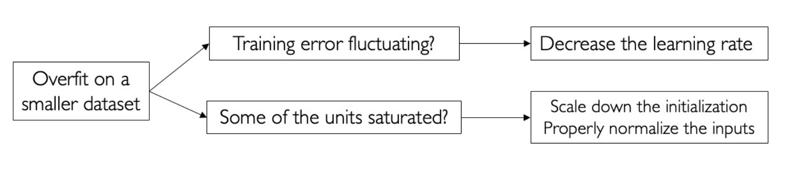

## Learning

### Linear Classification

#### Logistic Regression

Useful for classification problems.

Cross-Entropy Loss

$$
\ell(h(\boldsymbol{x}_{i}),y_{i})=\begin{cases}-\log[\sigma(\boldsymbol{w}^{T}\boldsymbol{x}_{i})]&\quad y_{i}=1\\-\log[1-\sigma(\boldsymbol{w}^{T}\boldsymbol{x}_{i})]&\quad y_{i}=0\end{cases}
$$

With regularization:

$$
\hat{\epsilon}(w)=-\sum_{i=1}^n\{y_i\log\sigma(h_w(x))+(1-y_i)\log[1-\sigma(h_w(x))]+\lambda\sum_{j=1}^dw_j^2
$$

How to deal with multiclass problems?

#### Softmax Regression

Normalizes multiple outputs in a probability vector.

$$
p(y=i|x)=\frac{\exp(w_i^Tx)}{\sum_{r=1}^C\exp(w_r^Tx)}
$$

Cross-Entropy Loss

$$
\ell(h(x_i),y_i)=\begin{cases}-\log\left[\frac{\exp(\boldsymbol{w}_1^T\boldsymbol{x})}{\sum_{r=1}^C\exp(\boldsymbol{w}_r^T\boldsymbol{x})}\right]&y_i=1\\-\log\left[\frac{\exp(\boldsymbol{w}_2^T\boldsymbol{x})}{\sum_{r=1}^C\exp(\boldsymbol{w}_r^T\boldsymbol{x})}\right]&y_i=2\\\vdots\\-\log\left[\frac{\exp(\boldsymbol{w}_c^T\boldsymbol{x})}{\sum_{r=1}^C\exp(\boldsymbol{w}_r^T\boldsymbol{x})}\right]&y_i=C\end{cases}
$$

This loss is convex. But there are many solutions that result in same outputs, so the regularizaton is indispensible to prevent divergence.

### Support Vector Machine (SVM)

#### Soft-SVM (Hinge Loss)

$$
\min_{w,b,\xi}\frac{1}{2}\|w\|_{2}^{2}+\frac{C}{n}\sum_{i=1}^{n}\xi_{i}\\\mathrm{s.t.~}y_i(\boldsymbol{w}\cdot\boldsymbol{x}_i+b)\geq1-\xi_i\\\xi_i\geq0,1\leq i\leq n
$$

Define Hinge Loss

$$
\ell(f(x),y)=\max\{0,1-yf(x)\}
$$

For the linear hypothesis:

$$
\ell(f(x),y)=\max\{0,1-y(w\cdot x+b)\}
$$

Theorem: Soft-SVM is equivalent to a Regularized Rise Minimization:

$$
\min_{w,b}\frac12\|w\|_2^2+\frac Cn\sum_{i=1}^n\max\{0,1-y_i(w\cdot x_i+b)\}
$$

这意味着SVM的“最大化”边界距离项本质上是一个正则化项。

### Kernel Soft-SVM

Basis function $\Phi(x)$ can often replaced by kernal function $k(x_1, x_2)$.

Polynomial Kernel: efficient computation: $O(d)$

Construct new kernel function from exist kernel functions:

$$
k^{\prime}(x_{1},x_{2})=k_{1}\otimes k_{2}(x_{1},x_{2})=k_{1}
(x_{1},x_{2})k_{2}(x_{1},x_{2})
$$

For any function $g: \mathcal X \rightarrow \R$

$$
k^\prime(x_1,x_2)=g(x_1)k_1(x_1,x_2)g(x_2)
$$

Apply Representer theorem:

$$
\min_\alpha\frac12\alpha^TK\alpha+\frac Cn\sum_{i=1}^n\max\left\{0,1-y_i\sum_{j=1}^n\alpha_jk(x_i,x_j)\right\}
$$

- $\alpha_j$ is the weight of each reference point $\color{red}{x_j}$ to the prediction of $\color{red}{x_i}$.
- lt is actually a Primal Form with kernel functions.

### Decision Tree

Criterion:

* More balance
* More pure

Misclassification error (not used very frequently):

$$
\mathrm{Err}(\mathcal{D})=1-\max_{1\leq k\leq K}\left(\frac{|\mathcal{C}_k|}{|\mathcal{D}|}\right)
$$

Use Entropy to measure purity:

$$
H(\mathcal{D})=-\sum_{k=1}^K\frac{|\mathcal{C}_k|}{|\mathcal{D}|}\mathrm{log}\frac{|\mathcal{C}_k|}{|\mathcal{D}|}
$$

Gini Index:

$$
\mathrm{Gini}(\mathcal{D})=1-\sum_{k=1}^K\left(\frac{|\mathcal{C}_k|}{|\mathcal{D}|}\right)^2
$$

#### ID3 Algorithm

### Multiplayer Perceptrons (MLP)

#### MLP for XOR

#### Activation

#### Loss Functions

Entropy

$$
H(q)=-\sum_{j=1}^kq_j\log q_j
$$

Relative-entropy

$$
\mathrm{KL}(q||p)=-\sum_{j=1}^kq_j\log p_j-H(q)
$$

Cross-entropy

$$
H(q,p)=-\sum_{j=1}^kq_j\log p_j
$$

Relationship:

$$
\boxed{H(q,p)=\mathrm{KL}(q||p)+H(q)}
$$

Softmax in the output layer

$$
\widehat{\boldsymbol{y}}=\boldsymbol{a}^{(n_l)}=f_\theta\big(\boldsymbol{x}^{(i)}\big)=\begin{bmatrix}p\big(\boldsymbol{y}^{(i)}=1\big|\boldsymbol{x}^{(i)};\boldsymbol{\theta}\big)\\p\big(\boldsymbol{y}^{(i)}=2\big|\boldsymbol{x}^{(i)};\boldsymbol{\theta}\big)\\\vdots\\p\big(\boldsymbol{y}^{(i)}=k\big|\boldsymbol{x}^{(i)};\boldsymbol{\theta}\big)\end{bmatrix}=\frac{1}{\sum_{j=1}^{k}\exp(z_{j}^{(n_{l})})}\begin{bmatrix}\exp(z_{1}^{(n_{l})})\\\exp(z_{2}^{(n_{l})})\\\vdots\\\exp(z_{k}^{(n_{l})})\end{bmatrix}
$$

Cross-entropy loss:

$$
J(y,\widehat{y})=-\sum_{j=1}^ky_j\log\widehat{y}_j
$$

Cost function:

$$
\min J(\theta)=-\frac1m\sum_{i=1}^m\left[\sum_{j=1}^k\mathbf{1}\{y^{(i)}=j\}\mathrm{log}\frac{\exp(\mathbf{z}_j^{(n_\iota)})}{\sum_{j^{\prime}=1}^k\exp(\mathbf{z}_{j^{\prime}}^{(n_\iota)})}\right]
$$

#### Gradient-Based Training

$$
\arg\min_\theta O(\mathcal{D};\theta)=\sum_{i=1}^mL\left(y_i,f(x_i);\theta\right)+\Omega(\theta)
$$

Forward Propagation: to compute activations & objective $J(\theta)$

Backward Propagation: Update paramters in all layers

##### Learning Rate decay

Exponential decay strategy:

$$
\eta = \eta_0e^{kt}
$$

1/t decay strategy:

$$
\eta = \eta_0/(1+kt)
$$

##### Weight Decay

L2 regularization:

$$
\Omega(\theta)=\frac\lambda2\sum_{l=1}^{n_l-1}\sum_{i=1}^{s_l}\sum_{j=1}^{s_{l+1}}(\theta_{ji}^{(l)})^2\\\frac\partial{\partial\theta^{(l)}}\Omega(\theta)=\lambda\theta^{(l)}
$$

L1:

$$
\Omega(\theta)=\lambda\sum_{l=1}^{n_{l}-1}\sum_{i=1}^{s_{l}}\sum_{j=1}^{s_{l+1}}|\theta_{ji}^{(l)}|\\\frac{\partial}{\partial\theta^{(l)}}\Omega(\theta)_{ji}=\lambda(1_{\theta_{ji}^{(l)}>0}-1_{\theta_{ji}^{(l)}<0})
$$

一般不调。

##### Weight Initialization

Xavier initialization

(Linear activations)

$$
\mathrm{Var}(w)=1/n_{\mathrm{in}}
$$

避免梯度爆炸或者消失；

He initialization

(ReLU activations)

$$
\mathrm{Var}(w)=2/n_{\mathrm{in}}
$$

因为 ReLU 删除了一半的信息。

### Convolutional Neural Network (CNN)

#### Convoluion Kernel

Stride

Padding

#### Pooling

Batch Normalization

在 N 张图像的对应通道做归一化。

可以增强训练的稳定性，使得学习率可以设大一点而仍然保证收敛。

* 数据集成
* 参数集成
* 模型集成

#### ResNet

最后一层 Global Average Pooling：7\*7\*2048 -> 1\* 1 \* 2048

### Recurrent Neural Network (RNN)

#### Idea for Sequence Modeling

Local Dependency

Parameter Sharing

### RNN

Go deeper

#### Standard Architectures

- RNNs can represent unbounded temporal dependencies
- RNNs encode histories of words into a fixed size hidden vector 
- Parameter size does not grow with the length of dependencies
- RNNs are hard to learn long range dependencies present in data

#### LSTM

Multihead, shared bottom.

Gradient flow highway: remember history very well.

NIPS 2015 Highway Network.

#### Training Strategies

Shift in Training & Inference

Use Scheduled Sampling to solve this

Problem: Gradient Explosion during continuously multiplication.

Solution: Gradient Clipping

Variational Dropout

Layer Normalization

BN: Easy to compare between channels

LN: Easy to compare between samples

在图像任务上，我们一般认为 channel 之间的地位应该是相同的，因此常常采用 BN。

### Transformer

use attention to replace state space.

#### Attention

$$
\text{Attention}(Q,K,V)=\text{Softmax}\left(\frac{QK^T}{\sqrt{d_k}}\right)V
$$

Multi-Head Attention

Sparse?

$W^o$ to maintain shape and jointly attend to information from different representation subspaces.

#### FFN

Position-wise FFN (Similar to multi convolution kernels in CNN, shared parameters in every word.)

#### Positional Encoding

## Reasoning

Reasoning (Probabilistic) = Modeling + Inference

Modeling:
* Bayesian Networks
* Markov random fields

Inference:
* Elimination methods (变量消除法)
* Latent variable models (因变量模型)
* Variational methods (变分方法)
* Sampling methods (采样方法) - 难学！

### Bayesian Network

$$
p(x_1,...,x_K)=p(x_K|x_1,...,x_{K-1})\cdots p(x_2|x_1)p(x_1)
$$

#### Variable Elimination

用于计算概率的边缘分布

一般而言是 NP-hard 问题。

对于 Markov chain，复杂度为 $O(nk^2)$；对于一般的图，$O(k^{n-1})$；如果确定每个节点的父节点数不超过 m，则复杂度为 $O(nk^{m-1})$

#### Message Passing

Reuse the computation from $P(Y|E=e)$ when calcuating another probability $P(Y_1|E_1=e_1)$

“$\propto$” 意味着只需要知道概率的相对值就够了，因为可以通过归一化算出最终的概率值。

MAP 需要求概率分布的最大值。

sum 与 max 同为聚合操作，因此同样满足分配律，只需要对应替换就可以得到第二种 Message Passing：

### Bayes Approach

### MLE method

如果概率模型的参数知道，称为概率；不知道，称为统计推断。

估计高斯分布的参数：

方差是有偏估计，所以一般× $1/(n-1)$。

### Bayes Decision Rule

对于回归问题，可以采用高斯噪声假设：

这样就得到了最小二乘估计。

MLE 是先验概率相等的 MAP。

放在机器学习中，MAP 可以定义为：模型 = 数据 + 先验。

先验信息在机器学习中体现为正则化：

2 范数正则化就是在认为模型参数服从高斯分布的先验假设情况下，利用 MAP 准则来估计参数。

这也就是为什么正则化倾向于避免过拟合：高斯分布先验希望模型参数足够简单。

### Bayesian Model Averaging

意义：模型集成。

### Discriminative Models

上面的理论足够解释判别式模型的原理了。

### Generative Models

#### Naive Bayes Classifier

model $Y$ as a bernoulli distribution with parameters $p(y=1)$ and $p(y=-1)$

conditional independence: each dimension is independent given label y

$$
p(X=x|Y=y)=\prod_{j=1}^dp(x_{\cdot j}|y)
$$

Laplacian smoothing for 0 samples:

$$
p(x_{\cdot j}=r_j|Y=+1)=\frac{\sum_{i=1}^n1\{x_{\cdot j}=r_j\wedge y_i=+1\}+1}{\sum_{i=1}^n1\{y_i=+1\}+k_j}
$$

For dataset with all continuous features: descretize it, or use another model based on a different assumption.

#### Guassian Discriminant Analysis

是一个生成模型！虽然它被用来分类，但是它的建模设计上采用的是生成式。

For dataset with all continuous features:

Using parametrice distribution to represent $P(X=x|Y=y)$

A common assumption in classification:

- We always assume that data points in a class is a cluster.

Still model $p(Y=y)$ as Bernoulli distribution.

$$
\text{So we can model }p(X=x|Y=y)\text{ by Gaussian distribution:}\\p(X=x|Y=+1)\propto\exp\left(-\frac{1}{2}(x-\mu_{+})^{T}\Sigma^{-1}(x-\mu_{+})\right)\\p(X=x|Y=-1)\propto\exp\left(-\frac{1}{2}(x-\mu_{-})^{T}\Sigma^{-1}(x-\mu_{-})\right)
$$

Note the shared parameters $\Sigma$ for positive and nagative classes.

Use MLE to find the best solution:

$$
\ell(\phi,\mu_+,\mu_-,\Sigma)=\log\prod_{i=1}^np(x_i,y_i;\phi,\mu_+,\mu_-,\Sigma)\\=\log\prod_{i=1}^np(x_i|y_i;\mu_+,\mu_-,\Sigma)+\boxed{\log\prod_{i=1}^np(y_i|\phi)}
$$

Then:

$$
\phi=\frac{\sum_{i=1}^{n}1\{y_{i}=+1\}}{n},\mu_{+}=\frac{\sum_{i=1}^{n}1\{y_{i}=+1\}x_{i}}{\sum_{i=1}^{n}1\{y_{i}=+1\}},\mu_{-}=\frac{\sum_{i=1}^{n}1\{y_{i}=-1\}x_{i}}{\sum_{i=1}^{n}1\{y_{i}=-1\}}\\\boldsymbol{\Sigma}=\frac{1}{n}\boldsymbol{\Sigma}_{i=1}^{n}(\boldsymbol{x}_{i}-\boldsymbol{\mu}_{\boldsymbol{y}_{i}})(\boldsymbol{x}_{i}-\boldsymbol{\mu}_{\boldsymbol{y}_{i}})^{T}
$$

#### Discriminative vs. Generative

### Mixture Models and EM

#### Gaussian Mixture Model

A Generative model. More assumption than Logistic Regression.

Sample dataset from GMM:

$$
p(x)=\sum_{z=1}^k\pi_z\mathcal{N}(x|\mu_z,\Sigma_z)
$$

Compute log-likelihood:

$$
\ell(\boldsymbol{\pi},\boldsymbol{\mu},\boldsymbol{\Sigma})=\log\prod_{i=1}^n\sum_{z=1}^k\pi_z\mathcal{N}(\boldsymbol{x}_i|\boldsymbol{\mu}_z,\boldsymbol{\Sigma}_z)=\sum_{i=1}^n\log\left[\sum_{z=1}^k\pi_z\mathcal{N}(\boldsymbol{x}_i|\boldsymbol{\mu}_z,\boldsymbol{\Sigma}_z)\right]
$$

$$
\ell(\pi,\mu,\Sigma)=\sum_{i=1}^n\log\left[\sum_{z=1}^k\frac{\pi_z}{\sqrt{|2\pi\Sigma_z|}}\exp(-\frac12(x_i-\mu_z)^T\Sigma^{-1}(x_i-\mu_z))\right]
$$

Intracable! Use EM method to estimate parameters.

$z$ is latent variable.

#### Expectation Maximization

Learing Problem:

find MLE

$$
\widehat{\theta}=\underset{\theta}{\operatorname*{argmax\ }}p(\mathcal{D}|\theta)
$$

Inference Promblem:

Given $x$, find conditional variable of $z$:

$$
p(z|x,\theta)
$$

EM method is for both problems!

it is hard to maximize the marginal likelihood directly:

$$
\max_\theta\log p(x|\theta)
$$

but the complete data log-likelihood is easy typically:

$$
\max_\theta\log p(x, z|\theta)
$$

if we had a distribution $q(z)$ for z:

$$
\max_\theta\sum_zq(z)\log p(x,z|\theta)
$$

We have Evidence Lower Bound (ELBO):

$$
\log p(x|\theta)=\log\left[\sum_zp(x,z|\theta)\right] \ge \underbrace{\sum_zq(z)\log(\frac{p(x,z|\theta)}{q(z)})}_{\mathcal{L}(q,\theta)}
$$

Now we optimize the ELBO iteratively:

The math background for ELBO:

We get back an equality for the marginal likelihood:

$$
\log p(x|\theta)=\mathcal{L}(q,\theta)+\mathrm{KL}[q(z)||p(z|x,\theta)]
$$

Evidence = ELBO + KL-Divergence

In E-step, if we want to maximize the ELBO without changing $\theta$, we have to let KL be zero. Thus $q^*(z)=p(z|x,\theta)$

For M-step, we find the $\theta$ to maximize the ELBO.

In MAP case:

For GMM, E-step:

M-step:

Recommended Initialize:

$$
\pi = 1/k\\
\mu = 0\\
\Sigma = \sigma^2 I
$$

Variational Methods:

注意：E 步计算的是隐变量的后验（如果能计算出来），因为它是使得似然函数及ELBO最大的 $q(z)$。算不出来就用变分方法近似。

$q(z)$ 既不是先验分布，也不是后验分布，它只是我们对隐变量分布的一种估计。

### Probabilistic Topic Models

#### Dirichlet-Multinomial Model

Beta Distribution:

$$
f(\phi|\alpha,\beta)=\frac1{B(\alpha,\beta)}\phi^{\alpha-1}(1-\phi)^{\beta-1}
$$

Dirichlet Multinomial Model: Multi-dimensional version of Beta Distribution

$$
\boxed{p(\vec{\theta}|\boldsymbol{\alpha})}=\frac1{B(\boldsymbol{\alpha})}\prod_{k=1}^K\theta_k^{\alpha_k-1}\quad\text{Where }B(\alpha)=\frac{\Pi_{k=1}^K\Gamma(\alpha_k)}{\Gamma(\sum_{k=1}^K\alpha_k)}
$$

Conjugate prior:

$$
\sum_{i=1}^K\theta_i=1
$$

Admixture:

Latent Dirichlet Allocation (LDA):

Probabilistic Graphical Models:

Maximum Likelihood Estimation

$$
\log p(\beta,\theta,z,w|\alpha,\eta)\\
=\sum_{k=1}^K\log p(\vec{\beta}_k|\eta)+\sum_{d=1}^D\log p(\vec{\theta}_d|\alpha)+\sum_{d=1}^D\sum_{n=1}^{N_d}\log p(z_{d,n}|\vec{\theta}_d)\\
 +\sum_{d=1}^D\sum_{n=1}^{N_d}\log p(w_{d,n}|z_{d,n},\vec{\boldsymbol{\beta}}_{1:K})\\
 \begin{aligned}
&=\sum_{k=1}^{K}\left(\sum_{v=1}^{V}(\eta_{v}-1)\log\beta_{kv}-\log B(\eta)\right)+\sum_{d=1}^{D}\sum_{k=1}^{K}(\alpha_{k}-1)\log\theta_{dk}-\log B(\alpha) \\
&+\sum_{d=1}^D\sum_{n=1}^{N_d}\log\theta_{d,z_{d,n}}+\sum_{d=1}^D\sum_{n=1}^{N_d}\log\beta_{z_{d,n}w_{d,n}}
\end{aligned}
$$

To learn the param $\alpha, \eta$, use EM method:

In E-step, calculate 

$$
q^*(z)=p(z|x,\theta^{\mathrm{old}})
$$

$$
p(\theta,z,\beta\mid w,\alpha,\eta)=\frac{p(\theta,z,\beta,w\mid\alpha,\eta)}{p(w\mid\alpha,\eta)}
$$

However, the denominator is intractable:

$$
p(\mathbf{w}|\alpha,\eta)=\int\int\sum_\mathbf{z}p(\boldsymbol{\theta},\mathbf{z},\boldsymbol{\beta},\mathbf{w}|\boldsymbol{\alpha},\boldsymbol{\eta})d\boldsymbol{\theta}d\boldsymbol{\beta}
$$

This problem is for general Bayesian models. We can use Variational Methods or Markov Chain Monte Carlo to solve it.

#### Variational Methods

Use Mean field assumption in LDA:

### Variational Autoencoders (VAE)

Reparameterization Trick: 

