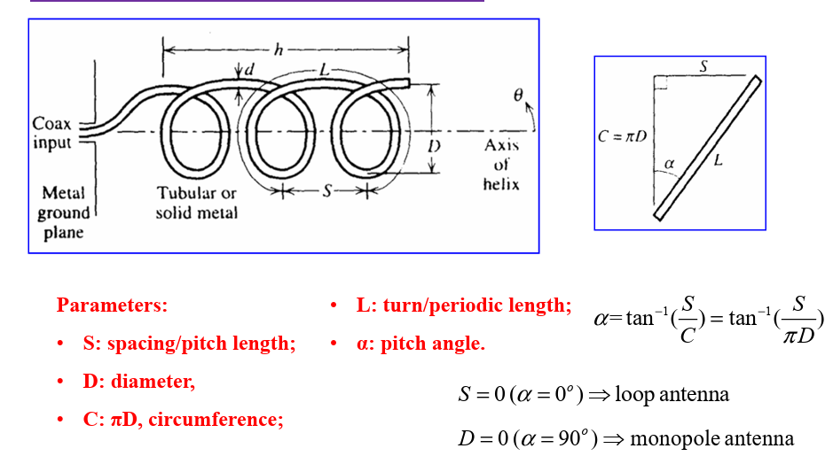
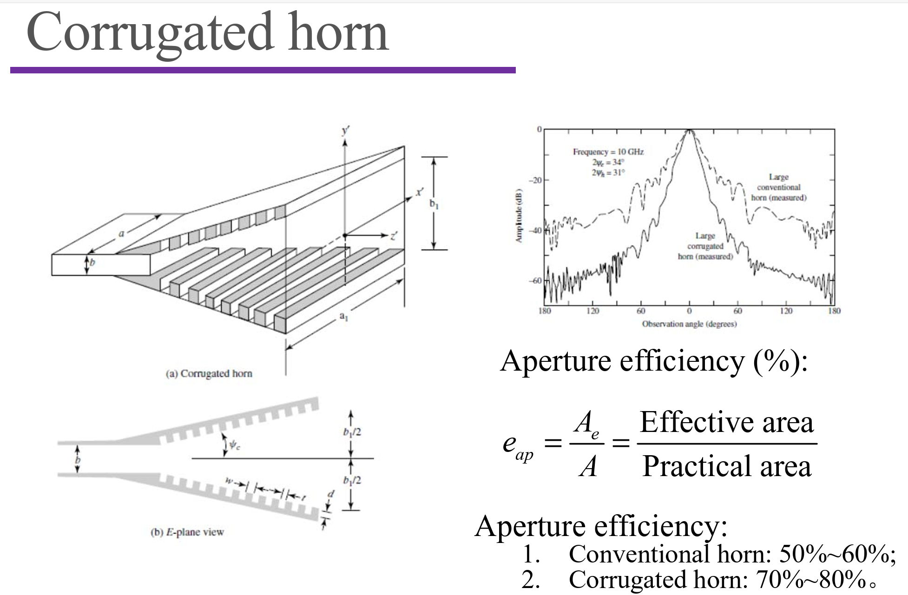

## Introduction of Antenna

Definition of Antenna

* Transmitter and receiver of EM wave
* Signal from current to wave
* from lumped to distributed

Antenna classifications

* Resonant and non-resonant/leaky/travelling wave
* Antenna number: element, multiple antennas, array
* Shape: wire, loop, slot, patch/microstrip, cavity
* Materials: metallic, dielectric
* Property: wideband, narrow band
* Yagi-Uda, Vivaldi, Cassegrain
* Function: moblie/handset, base station, AiP

## Maxwell equations

$$
\nabla \cdot \vec D = \rho \rightarrow \nabla \cdot \tilde{\vec D} = \rho \\
\nabla \cdot {\vec B} = 0 \rarr \nabla \cdot \tilde{\vec B} = 0\\
\nabla \times {\vec E} = -\frac{\partial \vec B}{\partial t} \rarr \nabla \times \tilde{\vec E} = -j\omega \tilde{\vec B}\\
\nabla \times {\vec H} = \vec J + \frac{\partial \vec D}{\partial t} \rarr \nabla \times \tilde{\vec H} = \vec J + j\omega \tilde{\vec D}\\
\vec D = \varepsilon \vec E\\
\vec B = \mu \vec H
$$

$$
\nabla^2 \vec F = \nabla(\nabla \cdot \vec F) - \nabla \times (\nabla \times \vec F)\\
\nabla \times (\nabla f) = 0\\
\nabla \cdot (\nabla \times \vec F) = 0
$$

## Auxiliary Potential Functions

Let

$$
\vec B = \nabla \times \vec A\\
\vec E + j\omega \vec A = -\nabla \phi
$$

$$
\nabla \cdot \vec D = \varepsilon \nabla \cdot(-\nabla \phi  - j\omega \vec A) = \rho\\
\Rightarrow \nabla^2\phi + \omega^2\mu\varepsilon\phi = - \frac{\rho}{\varepsilon} - j\omega(\nabla \cdot \vec A + j\omega \mu \varepsilon \phi)
$$

$$
\nabla \times \vec H = \frac{1}{\mu}(\nabla(\nabla \cdot \vec A) - \nabla^2\vec A) = \vec J + j\omega \vec D = \vec J + j\omega\varepsilon(-\nabla\phi - j\omega \vec A)\\
\Rightarrow \nabla^2\vec A + \omega^2\mu\varepsilon\vec A = -\mu \vec J - \nabla(\nabla \cdot \vec A + j\omega\mu\varepsilon\phi)
$$

Use Lorentz Gauge

$$
\nabla \cdot \vec A + j\omega\mu\varepsilon\phi = 0
$$

Then

$$
\nabla^2\vec A + \omega^2\mu\varepsilon\vec A = -\mu \vec J\\
\nabla^2\phi + \omega^2\mu\varepsilon\phi = - \frac{\rho}{\varepsilon}
$$

Solve ODE:

$$
\begin{equation}  
\nabla^2\phi + k^2\phi = 0(r\ne 0)
\end{equation}\\
\begin{equation}
\nabla^2\phi + k^2\phi = -\frac{\rho}{\varepsilon}(r=0)
\end{equation}
$$

For (1)

$$
u(r) = \frac{\phi(r)}{r}\\
\frac{\rm{d}^2}{\rm{d}r^2}u + k^2u = 0\\
u = C_1e^{-jkr} + C_2e^{jkr}\\
\phi = C_1\frac{e^{-jkr}}{r}
$$

For (2), in arbitrary volume

$$
\iiint_V(\nabla^2\phi + k^2\phi)\mathrm dv = \iiint_V(-\frac{\rho}{\varepsilon}\mathrm dv) = -\frac{q}{\varepsilon}\\
r \rightarrow 0\\
\iiint_V(k^2\phi)\mathrm dv = 0\\
\iiint_V\nabla^2\phi \mathrm dv = \oiint_S \nabla\phi \cdot \mathrm d\vec s = C_1 \oiint_S (\frac{-jkre^{-jkr} - e^{-jkr}}{r^2})\mathrm d\vec s = C_1 (\frac{-jkre^{-jkr} - e^{-jkr}}{r^2})4\pi r^2 = -C_1 4\pi
$$

Finally,

$$
\phi(r) = \frac{q}{4\pi\varepsilon}\frac{e^{-jkr}}{r}
$$

## Radiation Parameters

### Field Zone

Near field: resonant, field;

Far field: propagation, wave;

Fresnel region: transition;

### Antenna Parameters

* Radiation patterns
* Radiation Intensity
* Power Density
* Directivity (方向性) and Gain (重要！)
* Polarization
* Effective Aperture(等效口面) and Aperture efficienty(口面效率)

E 面：与电场方向平行的面

H 面：与磁场方向平行的面

#### Pattern Parameters

Often use log scale.

#### Power Density

Instantaneous Poynting vector $\vec S(x, y, z, t)$

Radiation Power Density = Time average Poynting vector $\vec S_{av}(x, y, z)=\frac1T\int_0^T\vec S(x, y, z, t)\mathrm dt = \frac12\text{Re}[\tilde{\vec E} \times \tilde{\vec H^*}]$

Total Radiation Power $P_{rad} = \oiint_S[\tilde{\vec E} \times \tilde{\vec H^*}] \cdot \mathrm d\vec s$

#### Radiation Intensity

$$
U(\theta, \varphi) = r^2 S(r, \theta, \varphi)
$$

Isotropic 各向同性

$$
P_{rad} = \int_{0}^{2\pi}\int_{0}^{\pi}U\sin\theta\mathrm d\theta\mathrm d\varphi
$$

#### Directivity

$$
D = \frac{U_{\max}}{U_{av}} = \frac{P_{\max}}{P_{rad}/4\pi}
$$

#### Gain

$$
G = \frac{U_{\max}}{P_{in}/4\pi}
$$

#### Polarization

Polarization Mismatch:

CP

#### Effective Aperture and Aperture efficiency

### Circuit Parameters

#### Input impedance

Input impedance definition:

* the impedance presented by an antenna at its terminals
* the ratio of the voltage to current at its terminals
* the ratio of the electric to magnetic fields at its terminals

##### Conjugate Matching

$$
Z_A = Z_g^*
$$

##### Mismatching

##### Radiation Resistance

$$
P_{rad} = \frac12|I_g|^2R_r = \oiint_S\vec S_{av} \cdot \rm d\vec s
$$

#### Scattering Parameters

$$
\frac{\Gamma^2}{Z_1} + \frac{T^2}{Z_2} = 1
$$

二端口网络通常用于描述二天线问题。$S_{11}$表示天线1的反射，$S_{21}$表示天线1到天线2的耦合，均不利于信号的传播。我们希望让$1 - S_{11}^2 - S_{21}^2$尽可能大。

## Link Calculation

### Friis's Equation

### EIRP

赫兹偶极子的辐射电阻： $80\pi^2(\frac{\Delta z}{\lambda})^2$，方向性 $\frac{2}{3}$。

### Radar Equation

RCS(Radar cross section)

RCS (σ) of a radar target is an effective area that intercepts the transmitted radar power and then
scatters that power isotropically back to the radar receiver.

$$
\sigma=\lim_{R\to\infty}\frac{W_{o}4\pi R^2}{W_i}
$$

* $W_i$, $W_o$ and $R$ are known;
* $\sigma$ converges.

## Antenna Theorems

$$
\boxed{P_r=\mathrm{P}_t\mathrm{G}_t\mathrm{G}_r(\frac{\lambda}{4\pi R})^2}
$$

$$
P_{r}=P_{t}\mathrm{e}_{r}\mathrm{e}_{t}D_{r}\mathrm{D}_{t}(1-\left|\Gamma_{r}\right|^{2})(1-\left|\Gamma_{t}\right|^{2})(\frac{\lambda}{4\pi R})^{2}
$$

In radar:

$$
P_{r}=P_{t}\mathrm{G}_{t}\mathrm{G}_{r}\sigma\frac{1}{4\pi}(\frac{\lambda}{4\pi R_{1}R_{2}})^{2}
$$

Equivalent circuit model

$R_r$ ：接收天线反射会释放能量。

### Duality Theorem

电 -> 磁，不变号；
磁 -> 电，变号。

### Image Theorem

PEC：完美电导体

PMC：完美磁导体

定理条件：
* PEC or PMC
* Infinite boundary

PEC

$$
\begin{aligned}&\hat{n}\times\vec{E}=0\\&\hat{n}\cdot\vec{B}=0\end{aligned}
$$

PMC

$$
\begin{aligned}&\hat{n}\times\vec{H}=0\\&\hat{n}\cdot\vec{D}=0\end{aligned}
$$

Note:
- Satisfied with boundary condition;
- Mirror source instead of PEC or PMC infinite boundary;
- Array: source and mirror source;
- Current loop: upper inside, lower outside.

### Reciprocity Theorem

In radiation pattern,

Transmitting pattern of antenna “a”

$$
Z_{_{ba}}(\theta,\varphi)=\frac{V_{_b}(\theta,\varphi)}{I_{_a}}
$$

Receiving pattern of ante

$$
Z_{ab}(\theta,\varphi)=\frac{V_{a}(\theta,\varphi)}{I_{b}}
$$

Then,

$$
Z_{ab}(\theta,\phi)=Z_{ba}(\theta,\phi)
$$

Lorentz Reciprocity Theorem

$$
-\nabla\cdot(\vec{E}_{1}\times\vec{H}_{2}-\vec{E}_{2}\times\vec{H}_{1})=\vec{E}_{1}\cdot\vec{J}_{2}+\vec{H}_{2}\cdot\vec{M}_{1}-\vec{E}_{2}\cdot\vec{J}_{1}-\vec H_1 \cdot \vec M_2\\
-\oiint_{S}(\vec{E}_{1}\times\vec{H}_{2}-\vec{E}_{2}\times\vec{H}_{1})\cdot ds^{'}=\iiint_{V}\left(\vec{E}_{1}\cdot\vec{J}_{2}+\vec{H}_{2}\cdot\vec{M}_{1}-\vec{E}_{2}\cdot\vec{J}_{1}-\vec H_1 \cdot \vec M_2\right)dv^{'}
$$

Far field:

$$
\vec{H}_i=\hat{r}\times\vec{E}_i/\eta;\quad d\vec{s}=\hat{n}ds=\hat{r}ds
$$

$$
(\vec{E}_1\times\vec{H}_2-\vec{E}_2\times\vec{H}_1)\cdot\hat{r}=(\hat{r}\times\vec{E}_1)\cdot\vec{H}_2-(\hat{r}\times\vec{E}_2)\cdot\vec{H}_1=0
$$

$$
\iiint_{V}\Big(\vec{E}_{1}\cdot\vec{J}_{2}+\vec{H}_{2}\cdot\vec{M}_{1}-\vec{E}_{2}\cdot\vec{J}_{1}-\vec{H}_{1}\cdot\vec{M}_{2}\Big)d\nu^{'}=0\\\iiint_{V}\Big(\vec{E}_{1}\cdot\vec{J}_{2}-\vec{H}_{1}\cdot\vec{M}_{2}\Big)d\nu^{'}=\iiint_{V}\Big(\vec{E}_{2}\cdot\vec{J}_{1}-\vec{H}_{2}\cdot\vec{M}_{1}\Big)d\nu^{'}
$$

Reaction: Reciprocity theorem: $\langle 1 2\rangle=\langle 2,1\rangle$

$$
\left\langle1,2\right\rangle=\int_{V}(\vec{E}_{1}\cdot\vec{J}_{2}-\vec{H}_{1}\cdot\vec{M}_{2})d\nu\quad\left\langle2,1\right\rangle=\int_{V}(\vec{E}_{2}\cdot\vec{J}_{1}-\vec{H}_{2}\cdot\vec{M}_{1})d\nu 
$$

If only current-source

$$
\iiint_V\vec{E}_1\cdot\vec{J}_2d\nu=\iiint_V\vec{E}_2\cdot\vec{J}_1d\nu\\
\vec{E}_1\cdot\vec{J}_2=\vec{E_2} \cdot \vec{J_1}
$$

Non-reciprocity

Electron plasma (non-reciprocal media)

$$
\varepsilon = \begin{bmatrix}\varepsilon_{xx}&+ig&0\\-ig&\varepsilon_{yy}&0\\0&0&\varepsilon_{zz}\end{bmatrix}
$$

### Huygen's Principle

## Dipole Antenna

### Hertz Dipole

* Infinite short length;
* Uniform distribution;
* Infinite small radius;

$$
E_\theta=\frac{I\Delta z}{4\pi}j\omega\mu\frac{e^{-jkr}}r\sin\theta \\
H_\varphi=\frac{I\Delta z}{4\pi}jk\frac{e^{-jkr}}r{\sin\theta}\\
\frac{E_\theta}{H_\varphi}=\sqrt{\frac{\mu_0}{\varepsilon_0}}=\eta 
$$

### Finite Length Dipole

$$
I=\begin{cases}I_0\sin[k(\dfrac{l}{2}-z')]&0\leq z'\leq\dfrac{l}{2}\\
I_0\sin[k(\dfrac{l}{2}+z')]&-\dfrac{l}{2}\leq z'\leq0\end{cases}
$$

$$
\vec{A}(x,y,z)=A_z\hat{z}=\hat{z}\int_{-l/2}^{l/2}\mu I(z’)\frac{e^{-j\kappa\Lambda}}{4\pi R}dz’\\R=\sqrt{\left(x-x’\right)^2+\left(y-y’\right)^2+\left(z-z’\right)^2}
$$

$$
\begin{aligned}&\text{For phase:}&&R\cong r-z'\cos\theta\\&\text{For amplitude:}&&R\cong r\end{aligned}
$$

R is the distance between observer and source, 
r is the distance between observer and origin.

#### Small Dipole

$$
\begin{aligned}&I(z’)\cong I_{in}(1-2|z’|/l)\\&\vec{A}(x,y,z)=A_z\hat{z}=\hat{z}\int_{-l/2}^{l/2}\mu I(z’)\frac{e^{-jkr}}{4\pi r}dz’\end{aligned}
$$

Then

$$
\vec{A}(x,y,z)=\hat{z}\mu\frac{e^{-jkr}}{4\pi r}\cdot\frac12I_{in}l\\
\vec{A}(\theta,r)=\frac12I_{in}l\mu\frac{e^{-jkr}}{4\pi r}(-\sin\theta\hat{\theta}+\cos\theta\hat{r})
$$

$$
\vec{E}=j\omega\mu I_{in}l\frac{e^{-jkr}}{8\pi r}\sin\theta\hat{\theta}\\\vec{H}=j\beta I_{in}l\frac{e^{-jkr}}{8\pi r}\sin\theta\hat{\varphi}
$$

Note: half of the ideal infinitesima(Hertz) dipole

$$
\mathrm{Directivity}:\quad D=\frac{4\pi}{\Omega_A}\Rightarrow D_{\underset{dipole}{\operatorname*{small}}}=1.5
$$

$$
R_{rad}=20\left(\frac{\pi\Delta z}\lambda\right)^2=\frac14R_{rad}^\textit{Hertz dipole}
$$

$$
P_{rad}=\frac14\frac{4\pi}3{\left(\frac{I\Delta z}{4\pi}\right)}^2k^2\eta{=}\frac12I^2R_{rad}
$$

#### General Case

$$
E_{\theta}=j\eta\frac{I_0e^{-jkr}}{2\pi r}\Bigg[\frac{\cos(\frac{kl}2\cos\theta)-\cos(\frac{kl}2)}{\sin\theta}\Bigg]\\H_{\varphi}=j\frac{I_0e^{-jkr}}{2\pi r}\Bigg[\frac{\cos(\frac{kl}2\cos\theta)-\cos(\frac{kl}2)}{\sin\theta}\Bigg]
$$

Beam width: change with length.

$$
\begin{aligned}
&\textbf{The time average Poynting vector:}\\
&\vec{S}_{a\nu}=\hat{r}S_{a\nu}=\frac{1}{2}\mathrm{Re}\bigg[\tilde{\vec{E}}\times\tilde{\vec{H}}^{*}\bigg]=\eta\frac{\big|I_{0}\big|^{2}}{8\pi^{2}r^{2}}\bigg[\frac{\cos(\frac{kl}{2}\cos\theta)-\cos(\frac{kl}{2})}{\sin\theta}\bigg]^{2}\hat{r}  \\
&P_{rad}=\oint_{s}\vec{S}_{a\nu}\cdot d\vec{s}=\int_{0}^{2\pi}\int_{0}^{\pi}\vec{S}_{a\nu}\cdot\vec{r}r^{2}\sin\theta d\theta d\varphi=\eta\frac{\left|I_{0}\right|^{2}}{4\pi}\int_{0}^{\pi}\frac{\left[\cos(\frac{kl}{2}\cos\theta)-\cos(\frac{kl}{2})\right]^{2}}{\sin\theta}d\theta  \\
&\begin{aligned}&\text{The radiation intensity:}\\&&U=r^2S_{av}=\eta\frac{\left|I_0\right|^2}{8\pi^2}\left[\frac{\cos(\frac{kl}2\cos\theta)-\cos(\frac{kl}2)}{\sin\theta}\right]^2\\&&=\frac{\pi}{2}=\frac{\left|I_{0}\right|^{2}}{2}=\frac{k_{0}}{2}=\frac{k_{0}}{2}\end{aligned}& \begin{matrix}{l}\\\end{matrix})  \\
&\Omega_A=\frac{P_{rad}}{U_{\max}}\quad D=4\pi/\Omega_A\quad A_e=\frac{\lambda^2}{4\pi}D\quad P_{rad}=\frac12I^2R_{rad}
\end{aligned}
$$

#### Input Impedance

Input resistance $R_r$:
* calculated by E and H at port; 
* take the real part (lossless).

Radiation resistance $R_{rad}$:
* calculated by E and H at far-field;

$$
P_{rad}=\frac12{\left|I\right|}^2R_{rad}\quad P_{rad}=\frac12{\left|I_{in}\right|}^2R_r
$$

I is the maximum/peak current.

General Relation:

$$
R_r=R_{rad}/\sin^2\left(\frac{kl}2\right)
$$

### Half-wavelength dipole

$$
I(z)=I_0\sin(\frac\pi2-k\left|z\right|)
$$

$$
E_\theta(r,\theta,\varphi)=j\eta I_0\frac{e^{-jkr}}{2\pi r}\frac{\cos(\frac\pi2\cos\theta)}{\sin\theta}\\H_\varphi(r,\theta,\varphi)=jI_0\frac{e^{-jkr}}{2\pi r}\frac{\cos(\frac\pi2\cos\theta)}{\sin\theta}
$$

$$
\vec{S}_{a\nu}=\hat{r}S_{a\nu}=\frac{1}{2}\operatorname{Re}\bigg[\tilde{\vec{E}}\times\tilde{\vec{H}}^{*}\bigg]=\eta\frac{\big|I_{0}\big|^{2}}{8\pi^{2}r^{2}}\bigg[\frac{\cos(\frac{\pi}{2}\cos\theta)}{\sin\theta}\bigg]^{2}\hat{r}\\
P_{rad}=\oint_sS_{a\nu}\cdot d\vec{s}=\int_0^{2\pi}\int_0^\pi\vec{S}_{a\nu}\cdot\hat{r}r^2\sin\theta d\theta d\varphi=\eta\frac{\left|I_0\right|^2}{4\pi}\int_0^\pi\frac{\cos^2(\frac\pi2\cos\theta)}{\sin\theta}d\theta 
$$

$$
D=4\pi/\Omega_{A}=1.643=2.15\mathrm{dBi}\\
A_e=\frac{\lambda^2}{4\pi}D_0\cong0.13\lambda^2
$$

Edge capacitive effect: 
* Terminal (open-end) 
current is not ideal zero;
* Effective length is longer

$$
R_r=R_{rad}=\frac{2P_{rad}}{\left|I_0\right|^2}\cong73\left(\Omega\right)\\
Z_A=73+j43\left(\Omega\right)
$$

### Applications

#### Wideband Antennas

#### Folded Dipole

$$
Z_{{folded}}=4Z_A
$$

Increase Input Impedance

#### Log-periodic & Yagi-Uda antenna

#### Dipole Antennas in base station

#### Monopole

## Loop Antennas

### Small Loop

Infinite small loop radius;

Infinite small wire radius;

Uniform distribution.

Resistance $R_r$ too small!

### Finite-length loop antennas

### Modes of Loop antennas

### Helix/helical antennas

Axial Mode

Normal Mode:

## Aperture Antenna

### Huygens' Principle

### Rectangular aperture antennas

### Horn Antennas

The E-pattern is in shadow.

## Antenna Array

1-D Linear Array

2-D Planar Array

3-D Conformal Array

Array Element
* Dipoles
* Loops
* Slots
* Microstrip antennas

### Two-Element array

$$
\begin{gathered}
\vec{E}_1= \hat{\theta}\frac{I\Delta z}{4\pi}j\omega\mu\frac{e^{-jkr_1}}{r_1}\cos\theta_1 \\
\vec{E}_{2}= \hat{\theta}\frac{I\Delta z}{4\pi}j\omega\mu\frac{e^{-jkr_2}}{r_2}\cos\theta_2 
\end{gathered}
$$

Remarks:
* Two element;
* Towards Y axis;
* Along Z axis;
* Space: d;
* Uniform phase 
and amplitude;
* Observe in 2D 
(YZ-plane).

Far field Approximation

$$
\begin{aligned}&\vec{E}_{total}=\vec{E}_1+\vec{E}_2\\&=\hat{\theta}\frac{I\Delta z}{4\pi}j\omega\mu\cos\theta\frac1r\Bigg(e^{-jk(r-\frac d2\cos\theta)}+e^{-jk(r+\frac d2\cos\theta)}\Bigg)\end{aligned}
$$

$$
\begin{aligned}
\vec{E}_{total}& =\vec{E}_1+\vec{E}_2=\hat{\theta}\frac{I\Delta z}{4\pi}j\omega\mu\cos\theta\frac{1}{r}\Bigg(e^{-jk(r-\frac{d}{2}\cos\theta)}+e^{-jk(r+\frac{d}{2}\cos\theta)}\Bigg)  \\
&=\hat{\theta}\frac{I\Delta z}{4\pi}j\omega\mu\cos\theta\frac{e^{-jkr}}{r}\Bigg(e^{jk\frac{d}{2}\cos\theta}+e^{-jk\frac{d}{2}\cos\theta}\Bigg) \\
&=\hat{\theta}\underbrace{\frac{I\Delta z}{4\pi}j\omega\mu\cos\theta\frac{e^{-jkr}}r}_{\text{Element pattern}}\underbrace{2\cos\biggl[\frac12kd\cos\theta\biggr]}_{\text{Array Factor (AF)}}
\end{aligned}
$$

Remarks:
* Uniform phase and amplitude;
* AF is related to space (d);
* AF is with no relation with antenna type.

$$
AF{=}2\cos\left[\frac12kd\cos\theta\right]\quad kd{=}\frac{2\pi}\lambda d{=}2\pi\frac d\lambda 
$$

### N-Element array

$$
\begin{aligned}&AF=1+e^{jkd\cos\theta}+e^{j2kd\cos\theta}+\cdots+e^{j(N-1)kd\cos\theta}\\&=\sum_{n=1}^Ne^{j(n-1)kd\cos\theta}=\sum_{n=1}^Ne^{j(n-1)\Psi}\end{aligned}
$$

$$
AF=1+e^{j\Psi}+e^{j2\Psi}+\cdots+e^{j(N-1)\Psi}=\frac{e^{jN\Psi}-1}{e^{j\Psi}-1}\\=\frac{e^{j\frac N2\Psi}\left(e^{j\frac N2\Psi}-e^{-j\frac N2\Psi}\right)}{e^{j\frac12\Psi}\left(e^{j\frac12\Psi}-e^{-j\frac12\Psi}\right)}=\frac{e^{j\frac N2\Psi}\sin\left(\frac N2\Psi\right)}{e^{j\frac12\Psi}\sin\left(\frac12\Psi\right)}
$$

Refenece Point at the end:

$$
AF=\frac{e^{j\frac N2\Psi}\sin\left(\frac N2\Psi\right)}{e^{j\frac12\Psi}\sin\left(\frac12\Psi\right)},\Psi=kd\cos\theta,
$$

Refenece Point at the center:

$$
AF=\frac{\sin\left(\frac N2\Psi\right)}{\sin\left(\frac12\Psi\right)},\Psi=kd\cos\theta,
$$

In Progreessive Phase Shift:

$$
\Psi=kd\cos\theta+\alpha 
$$

$$
AF=1+e^{j(kd\cos\theta+\alpha)}+e^{j2(kd\cos\theta+\alpha)}+\cdots+e^{j(N-1)(kd\cos\theta+\alpha)}\\=\sum_{n=1}^Ne^{j(n-1)(kd\cos\theta+\alpha)}=\sum_{n=1}^Ne^{j(n-1)\Psi}=\frac{e^{j\frac N2\Psi}\sin\left(\frac N2\Psi\right)}{e^{j\frac12\Psi}\sin\left(\frac12\Psi\right)}
$$

Normalized Array Factor:

$$
\left|f(\Psi)\right|=\left|\frac{\sin\left(\frac N2\Psi\right)}{N\sin\left(\frac12\Psi\right)}\right|
$$

Grating Lobe:

$$
\begin{aligned}
\theta\in\begin{bmatrix}0,\pi\end{bmatrix}\text{ or }\theta\in\begin{bmatrix}\theta_1,\theta_2\end{bmatrix}\text{, visible region} \\
\text{In the visible region,} \\
ifwehaveY= 0\mathrm{~and~}\Psi=2\pi. 
\end{aligned}
$$

Avoid grating lobe:
1. Smaller d;
2. Smaller phase shift.

$$
1.\mathrm{~For~}\alpha=\pi\Rightarrow2kd<2\pi\Rightarrow d\mathrm{~/~}\lambda<\frac12\\2.\mathrm{~For~}\alpha=0\mathrm{~}\Rightarrow\mathrm{~k}d<2\pi\Rightarrow d\mathrm{~/~}\lambda<1
$$

#### Broadside Array

Maximum @ $\theta = 90\degree$

$$
AF\boldsymbol{=}N@\boldsymbol{\theta}\boldsymbol{=}\boldsymbol{\pi}/2\quad\boldsymbol{\Psi}\boldsymbol{=}kd\cos\boldsymbol{\theta}\boldsymbol{+}\boldsymbol{\alpha}|_{\theta=\pi/2}\boldsymbol{=}0
$$

#### End-fire Array

$$
\begin{aligned}
&AF= N@\theta{=}0  &\Psi=kd+\alpha=2n\pi(n=0,\pm1,\pm2\ldots)  \\
&\text{or} \\
&AF= N@\theta{=}\pi   &\Psi=-kd+\alpha=2n\pi(n=0,\pm1,\pm2...)  \\
&\Psi=kd\cos\theta+\alpha=2\pi\cos\theta 
\end{aligned}
$$

Bidirectional:

Unidirectional:

#### Phased Array

#### Non-uniform Array

Side Lobe

Uniform array:
* Universal pattern: N↑, SLL↓ 
* With a limit of -13.3 dB
* No control of SL

How to reduce SLL?

Non-uniform excitation

#### Planar Array

Can be viewed as product of two linear array factors:

$$
AF=\sum_{i=1}^{M\times N}I_ie^{jk\hat{r}\cdot\vec{r}_i}\\
AF_n(\theta,\phi)=\left\{\frac{\sin(\frac M2\psi_x)}{M\sin\frac{\psi_x}2}\right\}\left\{\frac{\sin(\frac N2\psi_y)}{N\sin\frac{\psi_y}2}\right\};\\\psi_x=kd_x\sin\theta\cos\varphi+\alpha_x\\\psi_y=kd_y\sin\theta\sin\varphi+\alpha_y
$$

### Applications

#### Yagi-Uda Antenna

Basic configuration:
* One driven element;
* Two parasitic elements or more

Remarks:
* Parasitic elements are excited by near-field coupling from the driven element;
* Proper design of parasitic elements for end fire radiation;
* In far field, the radiated waves from all the elements are in-phase.

#### Helix Antenna

## Travelling-Wave Antennas

### Travelling wave & standing wave

#### Long wire antennas

Note:
Long wire antennas: “l” = Several wavelength
* One end for excitation;
* The other end for load (open, short, or matching);
* Transmission line with radiation.

### Log-periodic Antennas

Yagi-Uda: High Gain

Log-periodic: Wide Bandwidth

Why:
1. Feed from smaller dipole element;
2. Feed out-of-phase with adjacent elements;
3. Add a resistor at the end.

$$
\tau=\frac{R_{n+1}}{R_{n}}=\frac{L_{n+1}}{L_{n}}=\frac{d_{n+1}}{d_{n}}\\\alpha=2\tan^{-1}\left(\frac{1-\tau}{4\sigma}\right)\\\sigma=\frac{d_{n}}{2L_{n}}\\L_{1}\approx\frac{\lambda_{L}}{2}\quad\mathrm{and}\quad L_{N}\approx\frac{\lambda_{U}}{2}
$$

