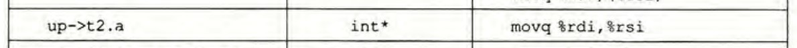

### 第三章 

CSAPP第三版使用的GCC版本：4.8.1

[Compiler Explorer](https://godbolt.org/)

#### 为什么p173要执行subq $8, %rsp?
为了对齐栈指针。x86要求栈指针为16的倍数，而每次调用函数后栈指针模16都会余个8，两次push使栈指针减少16，还是余8.


#### 答案纠错
3.43第4问答案有误。应为```movq %rdi,(%rsi)```。


