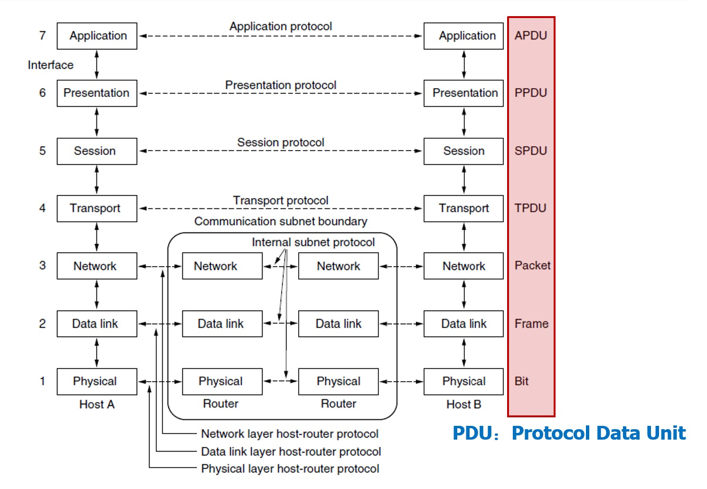
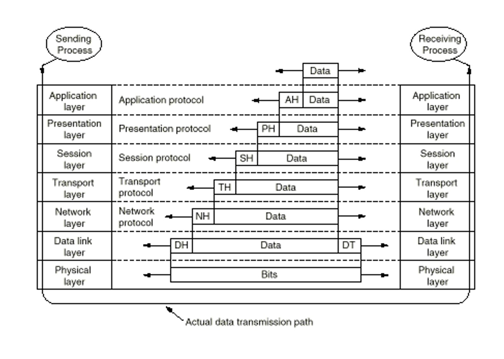
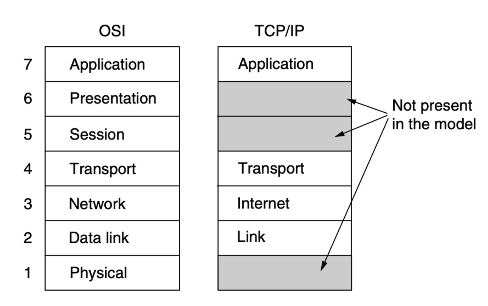
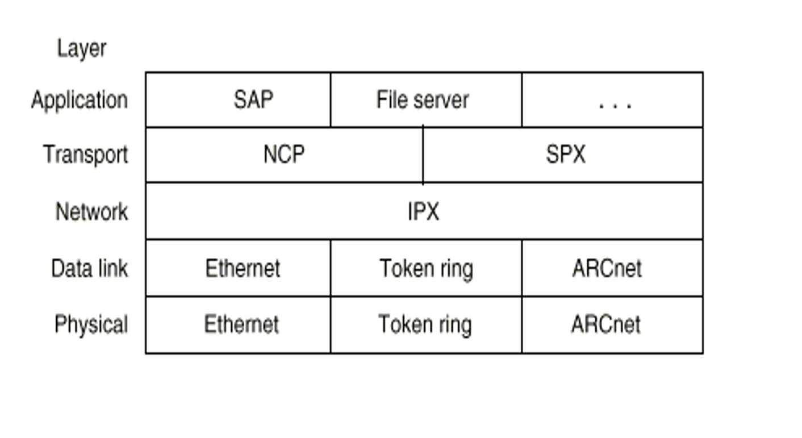
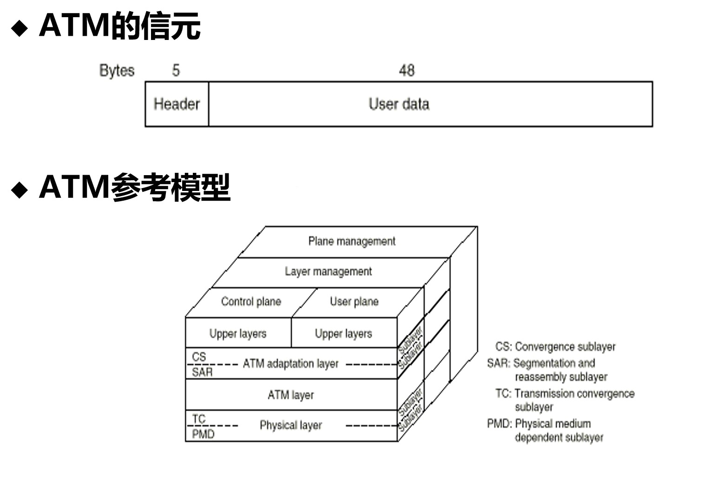
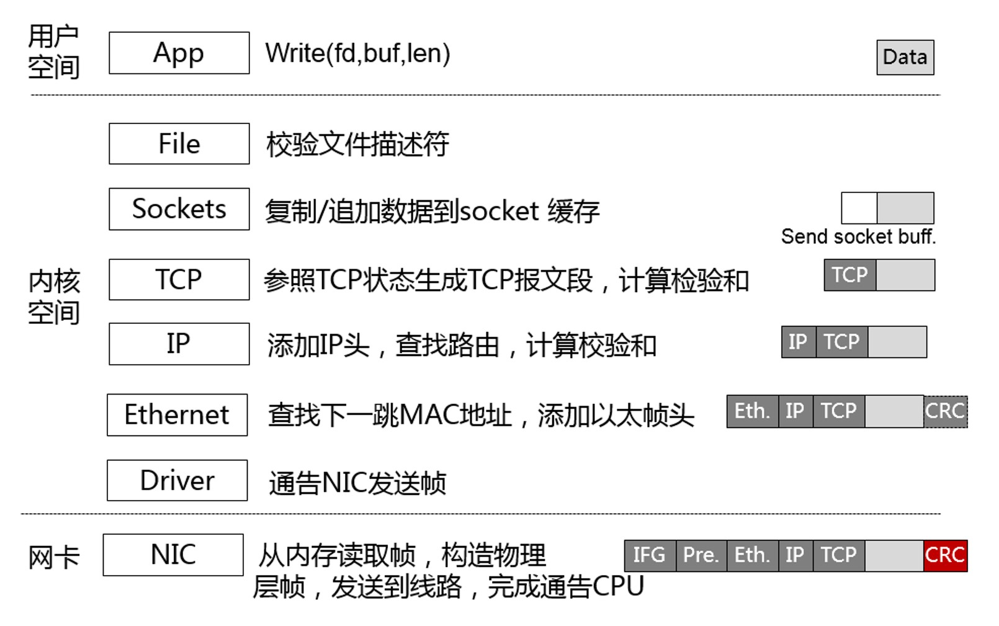
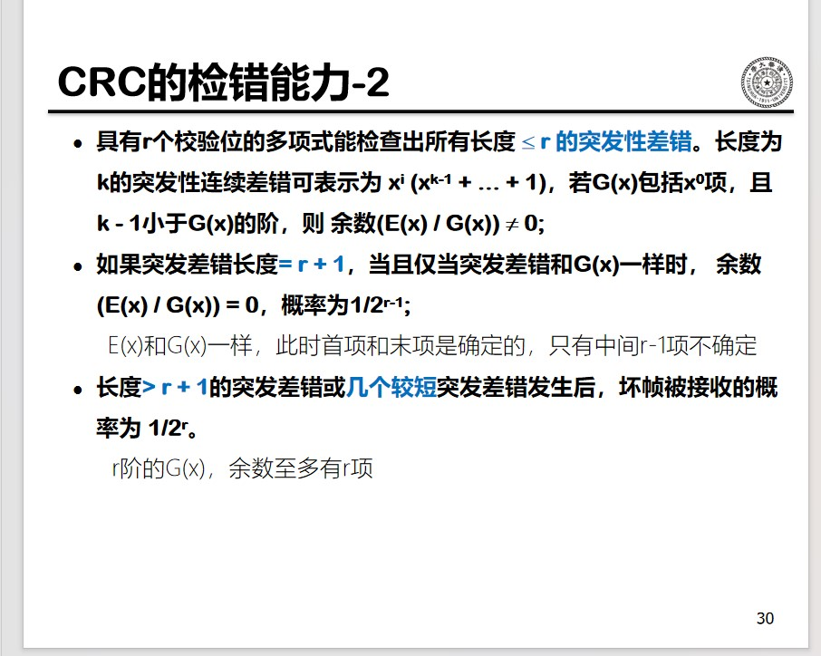
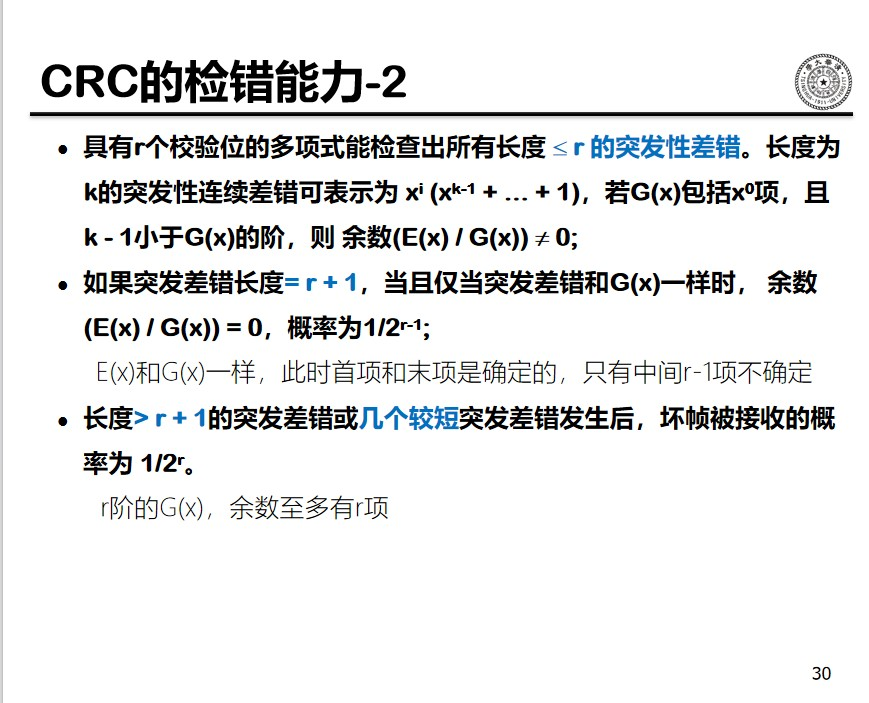

## 参考书籍

A.S Tanebaum (著)，严伟，潘爱民(译) 计算机网络(第五版), 2004，清华大学出版社 

A.S Tanebaum，Nick Feamster, David Wetherall (著)，潘爱民(译)， 计算机网络(第六版), 2022, 清华大学出版社（彩色版，非常精美）

## 杂项

token ring 

计算机网络最核心的技术：分组(packet)。

grid computing

## 计算机网络的历史与进展

网络计算的基本模式
* C/S or B/W
* P2P

服务
* 延迟、带宽、丢失率、可靠性
* 单播/多播， 实时/非实时

链路：光纤、电缆和卫星
* 电子、光子等作为传输介质
* 节点：机械/电/光

协议
* TCP/IP, ATM, MPLS, SONET, Ethernet, PPP, X.25, FrameRelay, AppleTalk, IPX, SNA

功能
* 路由，差错控制、拥塞控制、服务质量(QoS)

应用：FTP、HTTP 

空间距离
* 局域网 (LAN): 以太网、令牌环、FDDI
* 城域网 (MAN): DQDB, SMDS ,以太网
* 广域网 (WAN): X.25, ATM, frame relay, DWDM

信息类型
* 数据网络 vs. 通信网络

应用类型
* 专用网络：飞机订票网，银行网，信用卡网
* 通用网络：Internet

使用权
* 私有：企业网
* 公用：电话网、Internet
协议的所有权
* 私有: SNA (Systems Network Architecture)
* 开放: IP
技术
* 地面 vs. 卫星
* 有线 vs. 无线
协议
* IP, AppleTalk, SNA

计算机网络的形成
* 多终端系统
* 把计算机互联起来
1970年代的计算机网络
* X.25 分组交换网：各国的电信部门建设运行
* 各种专用的网络体系结构：SNA，DECnet
* Internet 的前身ARPANET进行实验运行
1980年代的计算机网络
* 标准化计算机网络体系结构：OSI
* 局域网络 LAN 技术空前发展
* 建成NSFNET，Internet 初具规模

迈特卡尔夫定律(联网定律)

网络价值随用户数平方成正比。未联网设备增加 $N$ 倍，效率增加 $N$ 倍。联网设备增加 $N$ 倍，效率增加 $N^2$ 倍

Internet 标准化组织

* Internet Engineering Task Force（IETF）：IETF负责Internet协议的研发和改进。IETF被分为很多个工作组（working groups），他们提交的文档称为RFC（Request For Comments）。
* IRTF（Internet Research Task Force）：IRTF由一些专注于某个领域长期发展的研究小组组成。
* Internet Architecture Board（IAB）：IAB负责定义Internet的整体框架，为IETF提供大方向上的指导。
* The Internet Engineering Steering Group（IESG）：IESG在技术方面管理IETF的活动，负责Internet标准的制定过程。

所有的标准以RFC的形式发布出来，可以从www.ietf.org免费获得，但不是所有的RFC都是Internet标准。标准形成的一般步骤是：
* Internet Drafts
* RFCs
* Proposed Standard
* Draft Standard（需要两个可以工作的实现）
* Internet Standard（由IAB发布）

David Clark, MIT, 1992: 
*      "We reject: kings, presidents, and voting. 
*       We believe in: rough consensus and running code.”

**Paul Baran 分组交换网络**

与 Donald Watts Davies 在这个思想的发明上有争议。

Baran 的设计细节：

报文发送
* 每个交换节点根据自己的路由表判断如何转发报文
* 每个报文的转发都是独立于其他报文的
* 交换节点不保存端节点的状态
  * 可扩展性好
  * 不是最有效的网络
  * 发送不是完美的
    * 端节点必须能容忍发送错误并从中恢复 
分布式系统
* 所有交换节点是平等的
* 避免了单一节点失效问题
* 部件可以失效，但系统不可以
* 系统的健壮性来自于
  * 足够的物理（硬件）冗余
  * 适应性路由

模拟实验表明：“extremely survivable networks can be built using a moderately low redundancy of connectivity level”—Paul Baran, 1964

比较两种可靠系统的实现思路：

电话系统 
* 笨终端，聪明的网络 
* 确保每个网络部件都是可靠的 
  * 系统可靠性＝部件可靠性 
  * 通过局部冗余实现部件的高可靠性 
  * 期望每个部件都能正常工作，部件失败的可能性很低 
* 需要人工配置的，高度控制的网络 

Baran的系统 
* 建立在简单的、不可靠部件上的可靠系统 
* 自适应的系统 
* 聪明的终端，可以修正传输错误 

Baran 设计思想的一种实现：Internet

* 连接异构的子网
* 提供两种基本功能
  * 全球唯一的地址
  * 报文通过动态路由从源节点发送到目的节点

simple, flexible, scalable, and robust

分组交换的特点：

**简单性**

* 每个报文携带各自的地址信息
* 一个路由表可以为所有的流量服务
* 可以适应爆炸性的增长
  * 越简单越不容易出错 
  * 越简单越容易增长 
  * 对基本网络功能的要求少，可以在其上建立多种类型的网络 

**灵活性**

Everything over IP

IP over Everything

**可扩展性**

可扩展的系统必须能对付
* 端系统的增加
* 流量的增加
* 网络规模的增长
  * 大的路由表
  * 路由频繁的变化

边缘论：End-to-End Argument

路由器只负责传输，复杂的功能（纠错，重传）都由终端自行解决

**健壮性**
* 动态路由具有自适应的特性
  * 动态路由和报文转发相辅相成
  * 周期性路由更新
  * 默认: 现有的部件会失效，会有新的部件加入，认为变化是正常的
* 牺牲一定的带宽的利用率，提高健壮性(报文头开销，更新开销) 

## 数据通信基本原理

香农定理：
带宽为 $H$ 赫兹，信噪比为 $S/N$ 的任意信道的最大数据传输率为 $H\log_2(1 + S/N) (bps)$
* 此式是利用信息论得出的，具有普遍意义
* 与信号电平级数、采样速度无关
* 此式仅是上限，实践中难以达到

曼彻斯特码（Manchester），也称相位编码
* 原理：每一位中间都有一个跳变，从低跳到高表示“0”，从高跳到低表示“1”。
* 优点：克服了NRZ码的不足。每位中间的跳变即可作为数据，又可作为时钟，能够自同步。	

差分曼彻斯特码（Differential Manchester）
* 原理：每一位中间都有一个跳变，每位开始时有跳变表示“0”，无跳变表示“1”。位中间跳变表示时钟，位前跳变表示数据。
* 优点：时钟、数据分离，便于提取。

## 网络体系结构

### 计算机网络的构成

**资源子网**
* 服务器（Server）
* 客户机（Client）

C/S -> B/W -> P2P

**通信子网**
* 通信线路（通道）
* 网络互连设备（路由器、交换机、集线器等）

#### 基本结构

**点到点通道**
* 一条线路连接两台网络互联设备
* 一般两台计算机的连接要经过多台互联设备
* 星形、环形、树形、全连结、交叉环、不规则图
* 关键技术：路由选择（Routing）

**广播网络**
* 总线，环
* 组播网络（Multicast Networks）：把成员分组
* 单播网络（Unicast Networks）
  * 点到点连接
* 关键技术：通道分配
  * 静态分配：分时间片
    * 控制简单，通道利用率低
  * 动态分配各站点动态使用通道
    * 控制复杂，通道利用度高
    * 通道分配方法：
      * 集中式：只有一个仲裁机构
      * 分布式：各站点均有仲裁机构

* PAN
* LAN
* MAN
* WAN
* internet，指一种技术(Internet，指实体的网络)
* Interplanetary Internet

### 计算机网络体系结构

对计算机网络及其部件所完成的功能的比较精确的定义，即从功能的角度描述计算机网络的结构，是层次模型和协议的集合。

注意：计算机网络体系结构仅仅定义了网络及其部件通过协议应完成的功能，不定义协议的实现细节和各层协议之间的接口关系。

协议分层的优点：易于协议的设计、分析、实现和调试

计算机网络的功能：
* 基本功能：为地理位置不同的计算机用户提供访问通路
* 具体化为：
  * 连接源节点和目的节点的物理传输线路，可以经过中间节点
  * 每条线路两端的结点利用波形进行二进制通信
  * 无差错的信息传送
  * 多个用户共享一条物理线路
  * 按照地址信息，进行路由选择
  * 信息缓存与流量控制
  * 会话控制
  * 满足各种用户、各种应用的访问要求

#### 网络协议

层次结构的计算计网络功能中最重要的功能是通信功能，这种通信功能主要涉及同层中通信双方的相互作用，位于不同计算机上进行对话的第N层通信各方可分别看成是一种进程，称为**对等进程（同等进程）**

**协议**

计算机网络同等层次中，通信双方进行信息交换时必须遵守的规则。

**协议栈**

一个特定系统所使用的一组协议统称为协议栈。

**接口**

相邻层之间有一个接口（Interface），它定义了下层向上层提供的原语操作与服务

#### 层、协议和接口

**协议特性**

* 不知道上下层的内部结构
* 独立完成某种功能
* 为上层提供服务
* 使用下层提供的服务

#### 服务分类

* 面向连接的服务
  * 当使用服务传输数据时，首先建立连接，然后使用该链接传送数据，使用完后，关闭连接。
  * 特点：顺序性好，类似于电话
* 面向无连接的服务
  * 直接使用服务传送数据，每个分组独立进行路由选择。
  * 特点：顺序性差，类似于邮政
* 连接与可靠的关系
  * 连接并不意味着可靠，可靠要通过确认、重传等机制来保证
  * 面向无连接的可以是可靠的，例如挂号信

TCP(可靠的连接)，UDP(不可靠的)

|服务|例子|
|--|--|
面向连接的例子|
|可靠的报文流|页面序列|
可靠的字节流|文件下载
不可靠的连接|IP语音
无连接的例子|
不可靠的数据报|垃圾邮件
有确认的数据报|文本消息
请求-响应|数据库查询

#### 服务原语(primitives)

服务在形式上是由一组接口原语（或操作）来描述的

四种类型：

* 请求（request）：实体请求服务做一些工作
* 指示（Indication）：实体被通知事件的发生
* 响应（Response）：实体对某个事件的响应
* 确认（Confirm）：对较早请求产生响应的确认

#### 分层

引入中间层，为底层不同的网络技术提供统一的抽象，服务上层业务

### 计算机网络参考模型

#### 计算机网络的标准化

**电信标准**

ITU(International Telecommunication Union)
* ITU-R：无线通信
* ITU-T：电信标准
* ITU-D：开发

**国际标准化组织：ISO**

一个国际标准的形成：
* CD（Committee Draft）
* DIS(Draft International Standard)
* IS(International Standard)

**其他标准化组织**

* ANSI
* NIST
* IEEE
* OIF

**互联网标准化组织**

互联网标准是自发，而非政府干预的，标准文本称为 RFC(Request For Comments)

#### OSI 参考模型

#### TCP/IP 参考模型

* 物理层
  * 在物理线路上传输原始的二进制位
* 数据链路层
  * 在有差错的物理线路上提供无差错的数据传输
  * 第一层和第二层合称为：Host-to-Network
* Internet 层（网络层）
  * 控制通信子网提供源点到目的点的IP分组传送
* 运输层
  * 提供端到端的数据传送服务，包括 TCP 和 UDP
* 应用层
  * 提供各种管理和应用服务功能

#### 其他参考模型

Novell NetWare 参考模型

ATM 参考模型（B-ISDN）

**排队与统计复用**

若分组的到达速率超过链路的传输速率：

* 分组在端口中排队，等待链路发送
* 当排队等待的分组超过分配给端口队列的缓存大小，缓存溢出，导致新到达的分组被丢弃
* 端口队列将随即到达的分组进行一定程度的整形，实现了关联端口链路的统计复用

**分组延时的组成**

$$
D = d_{proc} + d_{queue} + d_{trans} + d_{drop}
$$

$d_{trans}$：传输延时：
* L: 分组长度
* R：链路速率
* $d_{trans} = L / R$

$d_{prop}$ 传播延时：
* $d$：链路长度
* $s$：传播速度
* $d_{prop}$：$d/s$

**吞吐量**

单位时间内发送者可以给接收者传送的比特数
* 瞬时吞吐量：给定时刻的速率
* 平均吞吐量：一段时间内的平均速率

瓶颈链路：端到端路径(Path)上约束端到端平均吞吐量的链路(Link)

**几个概念**

* 报文：传输层协议的传输单位。报文由传输协议的头和应用层协议数据组成。就互联网而言，报文就是 TCP 报文段，报文段一定要封装在 IP 数据报(Datagram)中。
* 报文段： TCP 协议端到端传输的单位。
* IP 数据报分组：IP 协议的端到端传输单位，由 IP 头和传输层协议数据组成。
* 分组：穿越网络层和链路层之间接口的数据单位。可以是完整的 IP 数据报或者 IP 数据报的分片(fragment)
* 帧：链路层协议传输单元

## 物理层

物理层提供机械的、电气的、功能的和规程的特性，目的是启动、维护和关闭数据链路实体之间进行比特传输的物理连接。这种连接可能通过中继系统，中继系统内的传输也是在物理层。

物理层的网络互联设备：中继器

物理层的基本功能：在两个网络设备之间提供透明的比特流传输。

物理层操作：物理连接的启动与关闭，正常数据的传输，以及维护管理。

* 连接方式  （点到点，点到多点）
* 通信方式  （单工，半双工，全双工）
* 位传输方式（串行，并行）

物理层的四个重要特性：
* 机械特性
* 电气特性
* 功能特性
* 规程特性

**机械特性**

主要定义物理连接的边界点，即接插装置；规定物理连接时所采用的规格、引脚的数量和排列情况

**电气特性**

规定传输二进制位时，线路上信号的电压高低、阻抗匹配、传输速率和距离限制。

**功能特性**

主要定义各条物理线路的功能。

线路的功能分为四大类：
- 数据
- 控制
- 定时
- 接地

**规程特性**

主要定义各条物理线路的工作规程和时序关系。

**传输介质**

有导向介质
* 铜线、光纤

磁介质

双绞线

同轴电缆

光纤

无导向介质
* 无线电波、激光、红外等

**扩频技术**

* 窄带通信
  * 窄带的接受效果更加
  * 利于提高单位 Hz 的能量
* 扩频通信
  * 调频扩频
  * 直接序列扩频
  * 超宽带(UWB)

无线电传输

低频率、大波长的无线电容易穿过障碍物。全方向发射。

微波传输

- f >100Mhz，波长在厘米级
- 微波沿直线传播
- 无法穿越障碍物,容易被雨水吸收
- 多径衰落(Multipath fading)
- 造价低

红外线和毫米波

- 波长在毫米级
- 很难穿越障碍物
- 短程通信（无需授权）
- 遥控器等
- 室内无线LAN

光波传输

- 自由空间光通信
- 无法穿透雨或浓雾
- 受环境影响较大

**典型传输网络**

* 电话网络
  * SONET/SDH
  * 采用TDM技术，是同步系统，由主时钟控制，时钟精度10e-9。
  *  路径（path），链路（line），段（section）

基本结构
* 一帧包含 810 字节，每 125 us 产生一帧
* 基本 SONET 信道称为 STS-1

蜂窝无线电（Cellular Radio）
* 单方向的寻呼系统
* 打电话给寻呼公司，输入寻呼机号码；
* 寻呼公司的计算机收到请求，通过线路传到高处（山顶）的天线；
* 天线直接广播信号（本地寻呼），或传递给卫星（异地寻呼），卫星再广播。
* 需要很小的带宽

模拟蜂窝电话
* 使用小的蜂窝
* 在附近（不相邻）的蜂窝中重用传输频率
* 发射功率小，设备小而便宜

数字蜂窝网络
* 第一代：模拟蜂窝电话
* 第二代：数字蜂窝电话
* 第三代：3G

有线接入网络

通信卫星

电力线通信

## 数据链路层

### 定义和功能

数据链路层协议定义了一条链路的两个结点间交换数据的单元格式，以结点发送和接收数据单元的动作。

概念：

结点(node)：网络中的主机(host)和路由器(router)称为结点

链路(link)：   通信路径上连接相邻结点的信道称为链路

点到点(point to point)：一条链路的两个相邻结点间的通信称为点到点通信, 也称为通信路径(path)的一跳(hop)

端到端(end to end)

从源结点(source node)到目的结点(destination node)的通信称为端到端通信，通信路径可能由多个链路组成。

与端到端(end to end，E2E)相对应的概念是逐调(hop by hop，HBH) 

虚拟数据通路

实际数据通路

功能：

数据链路层协议应提供的最基本功能
- 向网络层提供服务
- 定界与同步
- 差错控制
- 顺序控制
- 流量控制

提供三种服务
* 不可靠无连接服务
* 可靠无连接服务
* 可靠面向连接服务

#### 成帧

Framing: 将比特流分成离散的帧，并计算每个帧的校验和。

字符计数法
* 在帧头中用一个域来表示整个帧的字符个数
* 缺点：若计数出错，对本帧和后面的帧有影响

带字符填充的首尾字符定界法
* 起始字符 DLE STX，结束字符DLE ETX
  * DLE:Data Link Escape
  * STX:Start of Text
  * ETX:End of Text
* 字符填充
* 局限于 8 位字符和 ASCII 字符传送

带位填充的首尾标记定界法
* 帧的起始和结束都用一个特殊的位串“01111110”，称为标记(flag)
* “0”比特插入删除技术

物理层编码违例法

只适用于物理层编码有冗余的网络
* 802 LAN：曼彻斯特编码中
  * 高-低 / 低-高 分别表示1/0，
  * 高-高 / 低-低  不表示数据，可以用来做定界符。

#### 差错控制

一般方法：接收方给发送方一个反馈（响应）

出错情况
* 帧出错，包括发送帧和相应帧
* 帧丢失，包括发送帧和相应帧

一般方案
* 通过计时器和序号保证每帧最终交给目的网络层仅一次

#### 流量控制

防止发送过快，淹没接收端
* 例如，接收端缓存溢出

### 错误检测和纠正

 差错出现特点
* 随机、偶发、孤立
* 连续突发(burst）
 处理差错的两种基本策略
* 使用纠错码
* 发送方在每个数据块中加入足够的冗余信息，使得接收方能够判断接收到的数据是否有错，并能纠正错误。
  * 例：前向纠错FEC (Forward Error Correcting):
* 使用检错码
* 发送方在每个数据块中加入足够的冗余信息，使得接收方能够判断接收到的数据是否有错，但不能判断哪里有错。

**奇偶校验**
最简单的例子是奇偶校验，在数据后填加一个奇偶位

奇偶校验可以用来检查奇数个错误

#### 纠错码
码字(codeword）
* 一个帧包括m个数据位，r个校验位，n = m + r，
* 则此n比特单元称为n位码字
海明距离（Hamming distance）
* 两个码字之间不同的比特位数目。
* 例如：0000000000 与0000011111的海明距离为5

结论
* 如果两个码字的海明距离为d，则需要d个单比特错就可以把一个码字转换成另一个码字；
* 为了检查出d个错，需要使用海明距离为 d + 1 的编码；
* 为了纠正d个错，需要使用海明距离为 2d + 1 的编码。

m个信息位，r个校验位，纠正单比特错 (n=r+m)

对 $2^m$ 个任何有效信息中的任何一个，有 $n$ 个与其距离为 1 的无效码字，因此有

$$
(n + 1)2^m \le 2^n
$$

利用 $n = m + r$，得到 $m + r + 1 \le 2^r$，给定 m，利用上式得到校正单比特误码的校验位数目下界

* 码位从左边开始编号，从“1”开始；
* 位号为2的幂的位是校验位，其余是信息位；
* 每个校验位使得包括自己在内的一些位的奇偶值为偶数（或奇数）
* 为看清数据位k对哪些校验位有影响，将k写成2的幂的和。

汉明码的工作过程：
* 每个码字到来前，接收方计数器清零；
* 接收方检查每个校验位k (k = 1, 2, 4 …)的奇偶值是否正确；
* 若第 k 位奇偶值不对，计数器加 k；
* 所有校验位检查完后，若计数器值为0，则码字有效；若计数器值为m，则第m位出错。例：若校验位1、2、8出错，则第11位变反。

#### 检错码

使用纠错码传数据，效率低。适用于不可重传的场合。

大多情况采用的检测码加重传。

二进制多项式

二进制码串表示成二进制多项式

循环冗余码（CRC）

* 发送方与接收方事前商定。
* 生成多项式的高位和低位必须为1
* 生成多项式必须比传输信息对应的多项式短

CRC 的基本思想
校验和(checksum)加载帧尾，使带校验和的帧的多项式能被 $G(x)$ 除尽，接收方接受时，用 $G(x)$ 去除它，若有余数，则传输出错。

校验和计算算法

设 $G(x)$ 为 $r$ 阶，在帧的末尾加 $r$ 个0，使得帧为 $m + r$ 位，相应多项式为 $x^rM(x)$。

按照模 2 除法用对应$G(x)$ 的位串去除对应于 $x^rM(x)$减去余数，结果就是要传送的带检验和的多项式 $T(x)$。

CRC 的检错能力：

发送方发送 $T(x)$，接收方接受的$T(x) + E(x)$，$E(x) \ne 0$。

$(T(x) + E(x)) / G(x) = 0 + (E(x) / G(x))$

如果$(E(x) / G(x))$的余数为0，则差错不能发现；否则可以发现。

### 数据链路层协议
#### 无约束单工协议

* 工作在理想情况
* 单工传输
* 发送方无休止工作（要发送的信息无限多）
* 接收方无休止工作（缓冲区无限大）
* 通信线路（信道）不损坏或丢失信息帧

工作过程

* 发送程序: 取数据，构成帧，发送帧；
* 接收程序: 等待，接收帧，送数据给高层

#### 单工停等协议

协议描述
* 增加约束条件：接收方不能无休止接收。
解决方案
* 接收方每收到一个帧后，给发送方回送一个响应。
工作过程
* 发送程序：取数据，成帧，发送帧，等待响应帧
* 接收程序：等待，接收帧，送数据给高层，回送响应帧。

#### 有噪声信道的单工协议

协议描述
* 增加约束条件：信道（线路）有差错，信息帧可能损坏或丢失。

解决方案
* 出错重传
  * 带来的问题
    * 响应帧重复?发送帧头中放入序号
* 重传触发:
    * 超时重传 
    * 什么时候重传?定时器
ARQ/PAR
  * PAR (Positive Acknowledgement with Retransmission）
  * ARQ (Automatic Repeat reQuest）

### 流量控制

#### 滑动窗口协议

捎带确认（piggybacking）

**一位滑窗协议**
* 窗口大小：N = 1，发送序号和接收序号的取值范围：0，1；
* 可进行数据双向传输，信息帧中可含有确认信息（piggybacking）；
* 信息帧中包括两个序号域：发送序号和接收序号
  （已经正确收到的帧的序号）
存在问题
* 能保证无差错传输，但是基于停等方式；
* 若双方同时开始发送，则会有一半重复帧；
* 效率低，传输时间长。

#### 退后n帧协议
#### 选择重传协议
