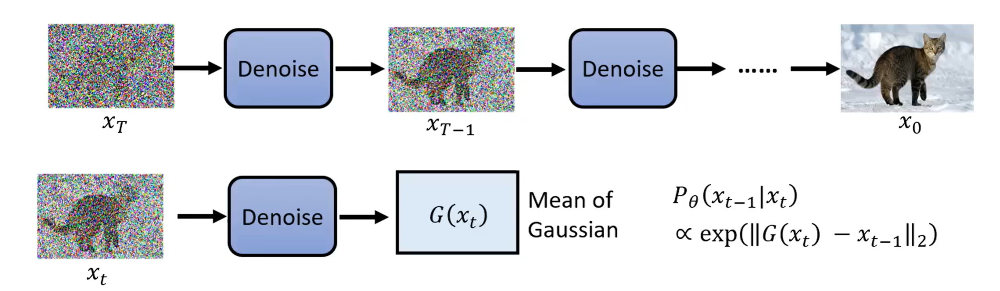
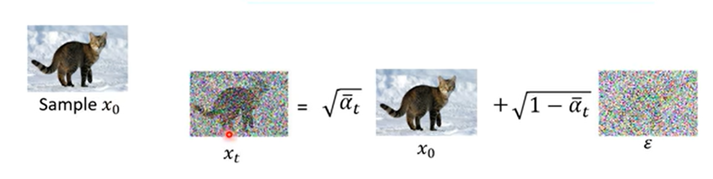

最近看了 lhy 的 Diffusion Model 教程，对于之前一直不理解的 Diffusion Model 的训练和推理过程终于获得了新的认识，还和 VAE，Flow-based 等方法构建起了统一的联系。这篇笔记作为对于 DDPM 论文公式推导的一个尝试。

## 图像生成任务的优化目标

一张图胜过千言万语，同样的一句话，可以生成无限的图像。因此，我们不能构建起从句子到图像的唯一映射。好在我们还有概率的工具：我们假设，所有的图像都是从某个概率分布中采样出来的，我们可以假设生图模型的提示词与图像的某个概率分布对应，生图模型的任务就是输入提示词，输出目标图像的概率分布，然后我们可以从图像的概率分布中采样出目标图像。

然而，图像的概率分布异常复杂，仅凭人力无法给出其表达式，很难对其进行建模。于是，我们尝试从最简洁的高斯分布中采样，将高斯分布中的每一个向量对应于一张图片。现在，我们把复杂的概率分布变成了高斯分布，需要学习的只是（在给定提示词时）从向量到图片的映射。这就是 VAE(其实是 AE，VAE 更准确的说是生成一个概率分布) 的原理，刚刚提到的高斯分布的向量称为编码，把向量映射为图片的模型称为解码器（decoder）。而扩散模型某种意义上是多个 VAE decoder 的级联。

（注意，接下来的推导同时适用于 VAE 和 Diffusion model）

首先从高斯分布中采样一个向量 $z$，它通过生成模型，变成了一张图片 $x=G_{\theta}(z)$。我们可以采样很多的 $z$，不停地生成 $x$，那么生成模型的功能就是把一个 $z$ 所在空间的高斯分布重新塑形成了 $x$ 空间的图像分布。我们把重塑得到的这个图像分布记为 $P_{\theta}$，任意一张图像 $x$ 在这个分布的生成概率为 $P_{\theta}(x)$。以上的 $\theta$ 为可以训练的参数。可以看出，分布 $P_{\theta}$ 不是直接由模型产生的，$G_{\theta}$才是模型，而是间接地从高斯分布和模型 $G_{\theta}$ 推出来的。

那么，为了能够生成逼真的图像，我们希望生成模型的分布 $P_{\theta}$ 和训练数据的分布 $P_{data}$ 越相近越好，从训练数据集中选择若干真实图像 $x^1, x^2, \dots, x^m \sim P_{data}$，那么优化目标就是尽可能增加它们的生成概率（最大化似然，Maximum Likelihood）：

$$
\theta^* = \argmax_{\theta} \prod_{i=1}^mP_{\theta}(x^i)
$$

（注：要学习图像的分布，所需的数据量是巨大的，大约是 1B 量级的图片才足以训练现有的 diffusion model。）

为什么上面这个优化目标能够使得 $P_{\theta}$ 接近 $P_{data}$ 呢？通过一番公式推导，我们可以把优化目标变成下列形式：

$$
\begin{align*}
\theta^* &= \argmax_{\theta} \prod_{i=1}^mP_{\theta}(x^i)\\
&= \argmax_{\theta} \sum_{i=1}^m\log P_{\theta}(x^i)\\
&\approx \argmax_{\theta} E_{x\sim P_{data}}[\log P_{\theta}(x)]\\
&= \argmax_{\theta} \int_x P_{data}(x)\log  P_{\theta}(x)\mathrm dx\\
&= \argmax_{\theta} \int_x P_{data}(x)\log  P_{\theta}(x)\mathrm dx - \argmax_{\theta} \int_x P_{data}(x)\log  P_{data}(x)\mathrm dx\\
&= \argmax_{\theta}  \int_x P_{data}(x)\frac{\log  P_{\theta}(x)\mathrm dx}{\log  P_{data}(x)\mathrm dx}\\
&= \argmin_{\theta} KL[P_{data}||P_{\theta}]
\end{align*}
$$

可以看出，最大化似然其实和最小化 KL 散度等价。其中约等号那一步是利用蒙特卡洛采样。而 KL 散度的意义正是“度量分布 p 和分布 q 之间的距离”，这个值越小，则两个概率分布越接近。

## VAE 的优化过程

接下来，我们优化一下 VAE。

### 假设为高斯分布

具体而言，对于 VAE 来说：

$$
P_{\theta}(x) = \int_z P_{\theta}(x|z)P(z)\mathrm dz
$$

而 $P_{\theta}(x|z)$ 就是“给定高斯向量 $z$ ，产生图像 $x$ 的概率”，这不就是我们的解码器 $G_\theta$ 吗！遗憾的是，$G_{\theta}$ 是一个确定性的映射，不是一个概率，如果非要认为它是一个概率的话，它会变成只有在某几个特定点概率为 1，其他点的概率为 0：

$$
P_\theta(x|z) = \begin{cases}
1, G_\theta(z) = x\\
0, G_\theta(z) \neq x
\end{cases}
$$

这好像不太好，我们假定图像是一个连续空间，如果 $P_{\theta}(x|z)$ 只在几个特定的离散点非 0 的话，那目标函数就变成一个难以优化的东西了！离散的东西怎么求导呢？为了克服这个困难，我们决定将解码器 $G_{\theta}$ 从一个确定性映射换成一个概率分布，要不就假设他是高斯分布吧：

$$
x|z \sim \mathcal N (G_\theta(z), \sigma^2 I)\\
P_\theta (x|z) \propto \exp(-||G_\theta(z) - x||_2^2/2\sigma^2)
$$

可以看到解码器 $G_{\theta}$ 输出的不再是“向量对应的图像”，而是“向量对应图像的高斯分布均值”。“假设图像是高斯分布”是个很糟糕的假设，它看起来跟事实完全不符，不过，至少这个高斯的概率表达式可以拿去求导。随着梯度下降的次数增多，$G_\theta (z)$ 应该会和 $x$ 越来越接近。

### 求最大似然的下界

我们回到最大似然形式的优化目标进行变形：

$$
\log P_{\theta}(x) = \int_z q(z|x) \log P_\theta(x) \mathrm dz
$$

（我们引入了一个 $q(z|x)$，这个东西可以是任何概率分布，上式始终成立）

$$
\begin{align*}
&=\int_z q(z|x) \log \frac{P_{\theta}(z, x)}{P_{\theta}(z|x)}\mathrm dz\\
&=\int_z q(z|x) \log \frac{P_{\theta}(z, x)q(z|x)}{q(z|x)P_{\theta}(z|x)}\mathrm dz\\
&=\int_z q(z|x) \log \frac{P_{\theta}(z, x)}{q(z|x)}\mathrm dz + \underline{\int_z q(z|x) \log \frac{q(z|x)}{P_{\theta}(z|x)}\mathrm dz}_{这是 KL 散度，始终大于0}\\
&\ge \int_z q(z|x) \log \frac{P_{\theta}(z, x)}{q(z|x)}\mathrm dz\\
&= \underline{E_{z\sim q(z|x)}[\log \frac{P_{\theta}(z, x)}{q(z|x)}]}_{VAE 的目标就是让这个取到最大值}
\end{align*}
$$

最后一行这个，就是目标的下界，是 VAE 最终的优化目标，如果我们能够把原始目标的下界变得最大，那么原始目标大概率也会尽可能地增大。这个下界其实就是 ELBO，保证了模型的最坏情况不会比下界更差。$q(z|x)$ 其实是一个编码器（把图像映射为向量），它输出的也是一个概率分布，不管这个编码器输出的概率分布长什么样，上面的公式都是成立的。VAE 有特殊的技巧来同时优化编码器和解码器（重参数化等等），不过这里就不多介绍了。我们还是来看看 Diffusion 吧。

## DDPM 的优化过程

Diffsion 的通俗理解应该很直观吧，如下图所示：

Diffusion 的本义是扩散，把一颗规则的方糖放到水里，它会逐渐溶解，糖分子扩散到溶液的每一处，最开始的方糖分子，分布是规则的，到了最后变成了完全无规律的分布，和完全随机分布没有区别。我们可以想想如何“溶解”图像，把图像和高斯信号不断地混合，每一步添加一点高斯噪声，图像就从最开始的规则分布 $x_0$ 变成了完全随机的高斯噪声 $x_T$。

那么，反过来呢？随机从高斯分布中取出一个噪声 $x_T$，我们能否逆推出最开始的规则分布 $x_0$？这就是扩散模型所做的事情。扩散模型把 $x_T$ 一步一步去噪变成 $x_{T-1}, \dots, x_{1}, x_0$，它每次接受 t 时刻带有噪声的图像 $x_t$，输出加噪之前的上一时刻图像 $x_{t-1}$。可以看出它和 VAE 其实有几分相似性，输入一个高斯向量，最终输出一张图像。实际上，我们可以把去噪过程的每一步都看作一次 VAE 解码，即 $z = x_t$，$x = x_{t-1}$，那么扩散模型实际上就是 T 个解码器被训练在了一个模型里面：

$$
P_{\theta}(x_0) = \int_{x_1:x_T} P(x_T)P_{\theta}(x_{T-1}|x_T)\dots P_{\theta}(x_0|x_1)\mathrm dx_1:x_T
$$

（注：还真有级联多个 VAE 的架构——HVAE. DDPM 可以看作它的一个特例，用加噪过程替代了编码器。）

### 推导最大似然的下界

依然是最大似然公式，扩散模型实际上就是 n 个 VAE 的级联：

$$
\begin{align*}
\log P_{\theta}(x_0) &= \int_{x_1:x_T}q(x_1:x_T|x_0)\log P_\theta(x_0)\mathrm dx_1:x_T\\
&= \int_{x_1:x_T}q(x_1:x_T|x_0)\log P_\theta(x_0)\mathrm dx_1:x_T\\
&= \int_{x_1:x_T}q(x_1:x_T|x_0)\log \frac{P_\theta(x_0:x_T)}{P_\theta(x_1:x_T|x_0)}\mathrm dx_1:x_T\\
&= \int_{x_1:x_T}q(x_1:x_T|x_0)\log \frac{P_\theta
(x_0:x_T)q(x_1:x_T|x_0)}{q(x_1:x_T|x_0)P_\theta(x_1:x_T|x_0)}\mathrm dx_1:x_T\\
&= \int_{x_1:x_T}q(x_1:x_T|x_0)\log \frac{P_\theta(x_0:x_T)}{q(x_1:x_T|x_0)}\mathrm dx_1:x_T \\
&+ \underline{\int_{x_1:x_T}q(x_1:x_T|x_0)\log \frac{q(x_1:x_T|x_0)}{P_\theta(x_1:x_T|x_0)}\mathrm dx_1:x_T}_{KL 散度 \ge 0}\\
&\ge \int_{x_1:x_T}q(x_1:x_T|x_0)\log \frac{P_\theta(x_0:x_T)}{q(x_1:x_T|x_0)}\mathrm dx_1:x_T\\
&= \underline{E_{x_1:x_T \sim q(x_1:x_T|x_0)}[\log \frac{P_\theta(x_0:x_T)}{q(x_1:x_T|x_0)}]}_{ELBO}
\end{align*}
$$

以上推导和 VAE 完全一样。这里的 $x_0$ 就是最终的图像，和 VAE 的 $x$ 一样。在 VAE 里这个 q 项是个编码器，要训练的。但是在 Diffusion 里面，这里的 $q(x_1:x_T|x_0)$ 含义是加噪过程，即输入图像，输出加噪后的图像，它无需训练，是已经定义好的：

$$
q(x_1:x_T|x_0) = q(x_T|x_{T-1})\dots q(x_1|x_0)
$$

### 从 ELBO 推导 DDPM 训练时的优化目标

现在问题来了，为什么训练过程的 loss 公式跟我们朴素的理解完全不一样呢？我们还是从上一部分计算出的 ELBO 入手来分析这个问题。

公式推导来自 [Understanding Diffusion Models: A Unified Perspective](https://arxiv.org/abs/2208.11970)。本文从多种角度采用不同的理论分析 Variational Diffusion Model，可见 Diffusion Model 是一种在数学上多么优美的架构。在优化 ELBO 这一部分，作者做了两种不同的等价变形来推导优化公式，其中一种思路比较简单直接，但是不利于用作真实的算法优化过程；另一种则是我们接下来要介绍的。

首先要注意到一个变形技巧：

$$
q(x_t|x_{t-1}) = q(x_t|x_{t-1}, x_0)
$$

这是很显然的，因为加噪过程的第 t 步只依赖于第 t-1 步，你把原始图像加进来作为条件不会对概率造成任何影响。然而这个神秘操作却对我们接下来的计算至关重要：

$$
\begin{align*}
&E_{x_1:x_T \sim q(x_1:x_T|x_0)}[\log \frac{P_\theta(x_0:x_T)}{q(x_1:x_T|x_0)}]\\
&=E_{x_1:x_T \sim q(x_1:x_T|x_0)}[\log\frac{P(x_T)P_{\theta}(x_0|x_1)\prod_{t=2}^T P_{\theta}(x_{t-1}|x_t)}{q(x_1|x_0)\prod_{t=2}^Tq(x_t|x_{t-1})}]\\
&=E_{x_1:x_T \sim q(x_1:x_T|x_0)}[\log\frac{P(x_T)P_{\theta}(x_0|x_1)\prod_{t=2}^T P_{\theta}(x_{t-1}|x_t)}{q(x_1|x_0)\prod_{t=2}^T\underline{q(x_t|x_{t-1}, x_0)}_{注意这里用到了神秘技巧！}}]\\
&=E_{x_1:x_T \sim q(x_1:x_T|x_0)}[\log\frac{P(x_T)P_{\theta}(x_0|x_1)\prod_{t=2}^T P_{\theta}(x_{t-1}|x_t)}{q(x_1|x_0)\prod_{t=2}^T\underline{\frac{q(x_{t-1}|x_t, x_0)q(x_t|x_0)}{q(x_{t-1}|x_0)}}_{只是普通的贝叶斯}}]\\
&=E_{x_1:x_T \sim q(x_1:x_T|x_0)}[\log\frac{P(x_T)P_{\theta}(x_0|x_1)\prod_{t=2}^T P_{\theta}(x_{t-1}|x_t)}{q(x_1|x_0)\cdot\prod_{t=2}^Tq(x_{t-1}|x_t, x_0)\cdot \underline{\prod_{t=2}^T\frac{q(x_t|x_0)}{q(x_{t-1}|x_0)}}_{这里可以错位相消}}]\\
&=E_{x_1:x_T \sim q(x_1:x_T|x_0)}[\log\frac{P(x_T)P_{\theta}(x_0|x_1)\prod_{t=2}^T P_{\theta}(x_{t-1}|x_t)}{q(x_1|x_0)\cdot\frac{q(x_T|x_0)}{q(x_1|x_0)}\cdot \prod_{t=2}^Tq(x_{t-1}|x_t, x_0)}]\\
&=E_{x_1:x_T \sim q(x_1:x_T|x_0)}[\log\frac{P(x_T)P_{\theta}(x_0|x_1)\prod_{t=2}^T P_{\theta}(x_{t-1}|x_t)}{q(x_T|x_0)\prod_{t=2}^Tq(x_{t-1}|x_t, x_0)}]\\
&=E_{x_1:x_T \sim q(x_1:x_T|x_0)}[\log P_{\theta}(x_0|x_1) + \log\frac{P(x_T)}{q(x_T|x_0)} + \log\frac{\prod_{t=2}^T P_{\theta}(x_{t-1}|x_t)}{\prod_{t=2}^Tq(x_{t-1}|x_t, x_0)}]\\
&=E_{x_1\sim q(x_1|x_0)}[\log P_\theta(x_0|x_1)] + E_{x_T\sim q(x_T|x_0)}[\log\frac{P(x_T)}{q(x_T|x_0)}] + \underline{\sum_{t=2}^TE_{x_{t-1},x_t \sim q(x_{t-1},x_t|x_0)}[\log\frac{P_{\theta}(x_{t-1}|x_t)}{q(x_{t-1}|x_t, x_0)}]}_{这一项的化简写在后面了}\\
&=E_{x_1\sim q(x_1|x_0)}[\log P_\theta(x_0|x_1)] - KL[{q(x_T|x_0)}||P(x_T)] -\sum_{t=2}^T E_{x_t\sim q(x_t|x_0)}[KL[q(x_{t-1}|x_t, x_0)||P_{\theta}(x_{t-1}|x_t)]]\\
\end{align*}
$$

其中，第三项的化简：

$$
\begin{align*}
&\sum_{t=2}^TE_{x_{t-1},x_t \sim q(x_{t-1},x_t|x_0)}[\log\frac{P_{\theta}(x_{t-1}|x_t)}{q(x_{t-1}|x_t, x_0)}]\\
&=\sum_{t=2}^T\int_{x_{t-1}, x_t}q(x_{t-1},x_t|x_0)\log\frac{P_{\theta}(x_{t-1}|x_t)}{q(x_{t-1}|x_t, x_0)}\mathrm dx_{t-1}\mathrm dx_t\\
&=\sum_{t=2}^T\int_{x_{t-1}, x_t}q(x_{t-1}|x_t,x_0)q(x_t|x_0)\log\frac{P_{\theta}(x_{t-1}|x_t)}{q(x_{t-1}|x_t, x_0)}\mathrm dx_{t-1}\mathrm dx_t\\
&=\sum_{t=2}^T\int_{x_t}q(x_t|x_0)\int_{x_{t-1}}q(x_{t-1}|x_t,x_0)\log\frac{P_{\theta}(x_{t-1}|x_t)}{q(x_{t-1}|x_t, x_0)}\mathrm dx_{t-1}\mathrm dx_t\\
&=-\sum_{t=2}^T\int_{x_t}q(x_t|x_0)KL[q(x_{t-1}|x_t, x_0)||P_{\theta}(x_{t-1}|x_t)]\mathrm dx_t\\
&=-\sum_{t=2}^T E_{x_t\sim q(x_t|x_0)}[KL[q(x_{t-1}|x_t, x_0)||P_{\theta}(x_{t-1}|x_t)]]
\end{align*}
$$

现在，我们得到了三项优化目标，它们的含义如下：

1. $E_{x_1\sim q(x_1|x_0)}[\log P_\theta(x_0|x_1)]$ 为 reconstruction term，它表示的是最后一步重建，即从 $x_1$ 恢复原图 $x_0$ 的过程，可类比于 VAE 中的从高斯向量 z 恢复原图 x；
2. $KL[{q(x_T|x_0)}||P(x_T)]$ 为 prior matching term，这是所有 VAE 类型的模型共有的。在这里，$P(x_T)$ 是一个高斯分布（想想，这就是扩散模型推理时输入的那个随机高斯向量），而 $q(x_T|x_0)$ 为加噪过程，图像加 T 步噪声后也近似为高斯，所以这一项实际上为 0。这里没有需要训练的参数，可以忽略；
3. $E_{x_t\sim q(x_t|x_0)}[KL[q(x_{t-1}|x_t, x_0)||P_{\theta}(x_{t-1}|x_t)]]$ 就是 denoising matching term，这里是什么 match 什么呢，是扩散模型 $P_{\theta}(x_{t-1}|x_t)$ 去 Match 一个训练集里的去噪过程 $q(x_{t-1}|x_t, x_0)$。$q$ 原本是来自加噪过程的概率分布，但是我们已经通过贝叶斯把它转换成了去噪过程的概率，它现在作为一个 ground truth 信号去监督模型学习，含义是“已知了真实图像 $x_0$ 的情况下，去噪过程应该是什么样”。我们训练的模型在不知道真实图像的前提下学习这个由 $q$ 指导的去噪过程，它就能逐渐掌握如何生成一个真实图像了。

### 真正的 DDPM 训练

DDPM 的优化目标我们已经在上一部分推出完毕，但是和真正的公式好像还是有一些 gap？其实很简单，我们的公式里面把加噪过程的噪声分布写成了 $q$，但是实际上我们早就知道，这个 $q$ 其实代表的是一个高斯分布，那我们就可以把高斯分布的实际表达式代进去算了。在计算之前，我们再来详细分析一下“加噪过程”的细节。

#### 加噪过程的细节

所谓的“加噪”运算，其实是把输入信号和标准高斯噪声按照某种比例混合：

$$
x_t = \sqrt{\alpha_t}x_{t-1} + \sqrt{1-\alpha_t}\varepsilon, \varepsilon \sim \mathcal N(0, I)
$$

我们可以人为规定一组常数 $\lbrace\alpha_1, \alpha_2, \dots\alpha_T\rbrace$，表示不同时刻输入信号 $x_{t-1}$ 的强度。$\alpha$ 越大，则输出的信号和输入信号越相似，越小，则输出信号越接近噪声。

为什么系数要有根号？容易观察到，等号右侧的两个系数的平方之和等于 1。这是为了保证混合前后信号的方差保持不变。不难推导，两个方差为 1 的高斯信号按照上述 $\alpha$ 的比例混合以后还是一个方差为 1 的高斯信号。

然而，训练时我们不是一步步地从 $x_0$ 加噪一直到 $x_T$，这样实在太慢了！好在高斯信号是线性的东西，两个高斯加在一起还是高斯，我们就可以直接推导出 $x_t$ 和 $x_0$ 的关系：

$$
\begin{align*}
x_t &= \sqrt{\alpha_t}x_{t-1} + \sqrt{1-\alpha_t}\varepsilon_{t-1}\\
&= \sqrt{\alpha_t}(\sqrt{\alpha_{t-1}}x_{t-2} + \sqrt{1-\alpha_{t-1}}\varepsilon_{t-1}) + \sqrt{1-\alpha_t}\varepsilon_{t-1}\\
&= \sqrt{\alpha_t\alpha_{t-1}}x_{t-2} +  \sqrt{\alpha_t(1-\alpha_{t-1})}\varepsilon_{t-2} + \sqrt{1-\alpha_t}\varepsilon_{t-1}\\
&(设 \varepsilon^*_{t-2} = \sqrt{\alpha_t(1-\alpha_{t-1})}\varepsilon_{t-2} + \sqrt{1-\alpha_t}\varepsilon_{t-1} \sim \mathcal N(0, I))\\
&= {\sqrt{\alpha_t\alpha_{t-1}}x_{t-2} + \sqrt{\alpha_t(1-\alpha_{t-1}) + (1-\alpha_t)}\varepsilon^*_{t-2}}\\
&= \sqrt{\alpha_t\alpha_{t-1}}x_{t-2} + \sqrt{1-\alpha_t\alpha_{t-1}}\varepsilon_{t-2}^*\\
&=\dots\\
&=\sqrt{\alpha_t\alpha_{t-1}\dots\alpha_1}x_0 + \sqrt{1 - \alpha_t\alpha_{t-1}\dots\alpha_1}\varepsilon^*_{0}\\
&(\varepsilon^*_0 \sim \mathcal N(0, I))
\end{align*}
$$

我们记 $\bar{\alpha_t} = \alpha_t\alpha_{t-1}\dots\alpha_1$，则上式可以写为

$$
x_t = \sqrt{\bar\alpha_t} x_{0} + \sqrt{1 - \bar\alpha_t}\varepsilon, \varepsilon \sim \mathcal N(0, I)
$$

#### 计算 DDPM 的优化目标

我们先来计算 denoising matching term $E_{x_t\sim q(x_t|x_0)}[KL[q(x_{t-1}|x_t, x_0)||P_{\theta}(x_{t-1}|x_t)]]$。首先，根据上面推导出的 $x_t$ 与 $x_0$ 的关系，$q(x_t|x_0)$ 是均值为 $\sqrt{\bar\alpha_t}x_{0}$ ，方差为 $({1 - \bar\alpha_t})I$ 的高斯分布。

然而，去噪监督信号 $q(x_{t-1}|x_t, x_0)$ 看起来不太好算。我们可以通过贝叶斯公式把它转换为加噪过程：

$$
\begin{align*}
q(x_{t-1}|x_t, x_0)&=\frac{q(x_{t-1}|x_0)q(x_{t}|x_{t-1}, x_0)}{q(x_{t}|x_0)}\\
&=\frac{q(x_{t-1}|x_0)q(x_{t}|x_{t-1})}{q(x_{t}|x_0)}\\
\end{align*}
$$

这里的分子和分母的项全部都是高斯分布，我们终于可以计算了，总而言之，计算结果还是一个高斯分布，均值为

$$
\mu_q(x_t) = \frac{\sqrt\alpha_t (1 - \bar\alpha_{t-1})x_t + \sqrt{\bar\alpha_{t-1}}(1-\alpha_t)x_0}{1-\bar\alpha_t}
$$

方差为

$$
\Sigma_q = \frac{(1-\alpha_t)(1-\bar\alpha_{t-1})}{1-\bar\alpha_t}I
$$

扩散模型 $P_{\theta}(x_{t-1}|x_t)$ 的目标是预测噪声，那么把它建模为高斯分布就很显然了。我们假设它的均值为 $\mu_\theta(x_t)$ 是一个可学习的量（注意到这和我们在 VAE 里面假设 $G_\theta(x)$ 的输出为高斯分布一致），方差和监督信号 $q(x_{t-1}|x_t, x_0)$ 的方差一样（已知）。

根据 KL 散度公式

$$
D_{\mathrm{KL}}(\mathcal{N}(\boldsymbol{x};\boldsymbol{\mu}_x,\boldsymbol{\Sigma}_x)\parallel\mathcal{N}(\boldsymbol{y};\boldsymbol{\mu}_y,\boldsymbol{\Sigma}_y))=\\
\frac{1}{2}\left[\log\frac{|\boldsymbol{\Sigma}_y|}{|\boldsymbol{\Sigma}_x|}-d+\mathrm{tr}(\boldsymbol{\Sigma}_y^{-1}\boldsymbol{\Sigma}_x)+(\boldsymbol{\mu}_y-\boldsymbol{\mu}_x)^T\boldsymbol{\Sigma}_y^{-1}(\boldsymbol{\mu}_y-\boldsymbol{\mu}_x)\right]
$$

我们可以计算出

$$
\begin{align*}
&KL[q(x_{t-1}|x_t, x_0)||P_{\theta}(x_{t-1}|x_t)] \\
&= \frac12\left[\log\frac{|\boldsymbol{\Sigma}_q|}{|\boldsymbol{\Sigma}_q|}-d+\mathrm{tr}(\boldsymbol{\Sigma}_q^{-1}\boldsymbol{\Sigma}_q)+(\boldsymbol{\mu}_\theta-\boldsymbol{\mu}_q)^T\boldsymbol{\Sigma}_q^{-1}(\boldsymbol{\mu}_q-\boldsymbol{\mu}_q)\right]\\
&=\frac12\left[0-d+d+\frac1{\sigma_q^2}||\boldsymbol{\mu}_\theta-\boldsymbol{\mu}_q||^2_2\right]\\
&=\frac1{2\sigma_q^2}||\boldsymbol{\mu}_\theta-\boldsymbol{\mu}_q||^2_2\\
\end{align*}
$$

这也很符合直觉，毕竟高斯无非就是由均值和方差决定的，方差本来就是一样的，唯一剩下的不就是拟合均值了吗？高斯分布下拟合均值，那不就是用 MLE loss 吗？

现在我们终于找到了 DDPM 的损失函数：

$$
\begin{align*}
&\argmin_\theta E_{t\sim U(2,T)} E_{x_t\sim q(x_t|x_0)}[KL[q(x_{t-1}|x_t, x_0)||P_{\theta}(x_{t-1}|x_t)]]\\
&=\argmin_\theta E_{t\sim U(2,T)} E_{x_t\sim q(x_t|x_0)}[||\mu_\theta(x_t)-\mu_q(x_t)||^2_2]\\
&=\argmin_\theta E_{t\sim U(2,T)} E_{x_t\sim }[||\mu_\theta(x_t)-\frac{\sqrt\alpha_t (1 - \bar\alpha_{t-1})x_t + \sqrt{\bar\alpha_{t-1}}(1-\alpha_t)x_0}{1-\bar\alpha_t}||^2_2]\\
&=\argmin_\theta E_{t\sim U(2,T)} E_{x_t\sim \mathcal N(\sqrt{\bar\alpha_t}x_{0}, ({1 - \bar\alpha_t})I)}[||\mu_\theta(x_t)-c_1x_t - c_2x_0||^2_2]\\
\end{align*}
$$

其中 $c_1, c_2$ 是关于 $\lbrace\alpha_t\rbrace$ 的表达式，与 $\theta$ 无关。由于模型 $\mu_\theta$ 输入里面就包含 $x_t$，那么 $c_1x_t$ 项就不用让模型预测了，我们可以直接令

$$
\mu_\theta(x_t) = c_1x_t + c_2x_\theta(x_t)
$$

则优化目标为

$$
\begin{align*}
&=\argmin_\theta E_{t\sim U(2,T)} E_{x_t\sim \mathcal N(\sqrt{\bar\alpha_t}x_{0}, ({1 - \bar\alpha_t})I)}[||c_1x_t + c_2x_\theta(x_t)-c_1x_t - c_2x_0||^2_2]\\
&=\argmin_\theta E_{t\sim U(2,T)} E_{x_t\sim \mathcal N(\sqrt{\bar\alpha_t}x_{0}, ({1 - \bar\alpha_t})I)}[||x_\theta(x_t) - x_0||^2_2]
\end{align*}
$$

这下坏了，这不就是让我们的模型直接预测出原图 $x_0$ 吗！不要着急，我们继续分析 $x_0$。由 $x_t$ 和 $x_0$ 的关系可知

$$
x_t = \sqrt{\bar\alpha_t} x_{0} + \sqrt{1 - \bar\alpha_t}\varepsilon, \varepsilon \sim \mathcal N(0, I)\\
\Leftrightarrow x_0 = \frac{1}{\sqrt{\bar\alpha_t}} x_t - \frac{\sqrt{1 - \bar\alpha_t}}{\sqrt{\bar\alpha_t}}\varepsilon, \varepsilon \sim \mathcal N(0, I)
$$

这下 $\frac{1}{\sqrt{\bar\alpha_t}} x_t$ 对于 $x_\theta(x_t)$ 来说又是已知项，于是我们进一步令

$$
x_\theta(x_t) = \frac{1}{\sqrt{\bar\alpha_t}} x_t - \frac{\sqrt{1 - \bar\alpha_t}}{\sqrt{\bar\alpha_t}}\varepsilon_\theta(x_t)
$$

优化目标进一步化简：

$$
\begin{align*}
&=\argmin_\theta E_{t\sim U(2,T)} E_{x_t\sim \mathcal N(\sqrt{\bar\alpha_t}x_{0}, ({1 - \bar\alpha_t})I)}[||x_\theta(x_t) - x_0||^2_2]\\
&=\argmin_\theta E_{t\sim U(2,T)} E_{x_t\sim \mathcal N(\sqrt{\bar\alpha_t}x_{0}, ({1 - \bar\alpha_t})I)}[||\frac{1}{\sqrt{\bar\alpha_t}} x_t - \frac{\sqrt{1 - \bar\alpha_t}}{\sqrt{\bar\alpha_t}}\varepsilon_\theta(x_t) - \frac{1}{\sqrt{\bar\alpha_t}} x_t + \frac{\sqrt{1 - \bar\alpha_t}}{\sqrt{\bar\alpha_t}}\varepsilon||^2_2]\\
&=\argmin_\theta E_{t\sim U(2,T)} E_{x_t\sim \mathcal N(\sqrt{\bar\alpha_t}x_{0}, ({1 - \bar\alpha_t})I)}[||\varepsilon_\theta(x_t) -\varepsilon||^2_2]\\
&=\argmin_\theta E_{t\sim U(2,T)} E_{\varepsilon\sim \mathcal N(0, I)}[||\varepsilon_\theta(\sqrt{\bar\alpha_t} x_{0} + \sqrt{1 - \bar\alpha_t}\varepsilon) -\varepsilon||^2_2]\\
\end{align*}
$$

神奇的事情发生了！我们的模型现在唯一需要预测的就是这个噪声项 $\varepsilon$ 长什么样。也就是说，现在的扩散模型 $\varepsilon_\theta$，输入是 $t$ 时刻含噪图像 $x_t$，要预测的是其含有的噪声 $\varepsilon$！至此，我们已经推出了 DDPM 的训练目标。

刚才我们推导的某一步里指出，我们的损失函数等价于预测原图 $x_0$。的确如此！事实上预测原图和预测噪声在原理上是等价的，它们只不过相差一些系数。但是也有论文指出，预测原图和预测噪声相比，predicting the noise puts more weight on lower noise levels，在 t 较小的情况上花费更多算力进行训练。

另外，实际的 DDPM 会将时间 $t$ 也作为一个条件输入给模型 $\varepsilon_\theta$。我们实际上训练的是：

$$
\argmin_\theta E_{t\sim U(2,T)} E_{\varepsilon\sim \mathcal N(0, I)}[||\varepsilon_\theta(t, \sqrt{\bar\alpha_t} x_{0} + \sqrt{1 - \bar\alpha_t}\varepsilon) -\varepsilon||^2_2]\\
$$

别忘了，这只是 ELBO 三项中的一项，denoise matching term。我们知道，prior matching 项与参数无关不用训练；还剩下一项 reconstruction，也就是 $E_{x_1\sim q(x_1|x_0)}[\log P_\theta(x_0|x_1)]$ 这一项需要计算。这一项其实也是类似的，我们假设模型预测高斯分布，均值为 $\mu_\theta(x_1)$，方差为 $(1-\alpha_1)I$ 与 $x_1$ 一致：

$$
\begin{align*}
&E_{x_1\sim q(x_1|x_0)}[\log P_\theta(x_0|x_1)]\\
&=E_{\varepsilon\sim N}[\log P_\theta(x_0|\sqrt\alpha_1x_0+\sqrt{1 - \alpha_1}\varepsilon)]\\
&=E_{\varepsilon\sim N}[\log P_\theta(x_0|\sqrt\alpha_1x_0+\sqrt{1 - \alpha_1}\varepsilon)]\\
&=E_{\varepsilon\sim N}[\log (\frac{1}{\sqrt{2\pi(1 - \alpha_1)}})\exp [-\frac{||\mu_\theta(x_1) - (\sqrt\alpha_1x_0+\sqrt{1 - \alpha_1}\varepsilon)||_2^2}{2({1 - \alpha_1})}]]\\
&=E_{\varepsilon\sim N}[-\frac{||\mu_\theta(x_1) - (\sqrt\alpha_1x_0+\sqrt{1 - \alpha_1}\varepsilon)||_2^2}{2({1 - \alpha_1})}] + C\\
\end{align*}
$$

因此，优化它为最大值等价于优化

$$
\begin{align*}
&\argmin_\theta E_{\varepsilon\sim N}[||\mu_\theta(x_1) - \sqrt\alpha_1x_0-\sqrt{1 - \alpha_1}\varepsilon||_2^2]\\
\end{align*}
$$

我们又故技重施，预测它的噪声：

$$
\mu_\theta(x_1) = \sqrt\alpha_1x_0+\sqrt{1 - \alpha_1}\varepsilon_\theta(x_1)\\
$$

$$
\begin{align*}
&\argmin_\theta E_{\varepsilon\sim N}[||\mu_\theta(x_1) - \sqrt\alpha_1x_0-\sqrt{1 - \alpha_1}\varepsilon||_2^2]\\
&=\argmin_\theta E_{\varepsilon\sim N}[||\sqrt\alpha_1x_0+\sqrt{1 - \alpha_1}\varepsilon_\theta(x_1) - \sqrt\alpha_1x_0-\sqrt{1 - \alpha_1}\varepsilon||_2^2]\\
&=\argmin_\theta E_{\varepsilon\sim N}[||\varepsilon_\theta(x_1) - \varepsilon||_2^2]\\
&=\argmin_\theta E_{\varepsilon\sim N}[||\varepsilon_\theta(\sqrt\alpha_1x_0+\sqrt{1 - \alpha_1}\varepsilon) - \varepsilon||_2^2]\\
\end{align*}
$$

可以看出，这和第三项的优化目标是一样的！只不过此时 $t = 1$，而之前 $t$ 的范围是 $[2, T]$。

因此，我们把上面两种情况综合起来就得到了最终的训练目标：

$$
\argmin_\theta E_{t\sim U(1,T)} E_{\varepsilon\sim \mathcal N(0, I)}[||\varepsilon_\theta(t, \sqrt{\bar\alpha_t} x_{0} + \sqrt{1 - \bar\alpha_t}\varepsilon) -\varepsilon||^2_2]\\
$$

你问我为什么 t = 1 的概率与其他的情况相同？我也不太清楚。按照 ELBO 的要求这两种情况的系数或许是不一样的，但是我们这里当它是一样的了。这个可能会导致一些 bias 的引入？不知道有没有论文讨论这个。

至此，我们终于搞定了 DDPM 的训练过程！

### DDPM 的推理过程

推理过程就是给定时间 $t$ 和该时刻的图像 $x_{t}$，输出上一时刻的图像 $x_{t-1}$（本质上是去掉上一时刻的噪声）。推完上述的训练过程，我想推理公式已经呼之欲出了：

$$
x_0 \approx x_\theta(x_t) = \frac{1}{\sqrt{\bar\alpha_t}} x_t - \frac{\sqrt{1 - \bar\alpha_t}}{\sqrt{\bar\alpha_t}}\varepsilon_\theta(x_t, t)\\
x_{t-1} \sim q(x_{t-1}|x_t, x_0) = \mathcal N (\mu_q(x_t), \Sigma_q)\\
（条件：t\ge2）
$$

由此可以推出

$$
\begin{align*}
x_{t-1} &= \frac{\sqrt\alpha_t (1 - \bar\alpha_{t-1})x_t + \sqrt{\bar\alpha_{t-1}}(1-\alpha_t)x_0}{1-\bar\alpha_t} + \sqrt{\frac{(1-\alpha_t)(1-\bar\alpha_{t-1})}{1-\bar\alpha_t}}\varepsilon\\
&\approx \frac{\sqrt\alpha_t (1 - \bar\alpha_{t-1})x_t + \sqrt{\bar\alpha_{t-1}}(1-\alpha_t)(\frac{1}{\sqrt{\bar\alpha_t}} x_t - \frac{\sqrt{1 - \bar\alpha_t}}{\sqrt{\bar\alpha_t}}\varepsilon_\theta(x_t, t))}{1-\bar\alpha_t} + \sigma_t \varepsilon\\
&=\frac{1}{\sqrt{\alpha_t}}(x_t - \frac{(1-\alpha_t)}{\sqrt{1 - \bar\alpha_t}}\varepsilon_\theta(x_t, t)) + \sigma_t \varepsilon
（条件：t\ge2）
\end{align*}
$$

这就是推理过程的公式。其中 $\varepsilon$ 为正态分布。

不过要注意，这个噪声项 $\varepsilon$ 的来源，可不是来自扩散模型 $\varepsilon_\theta(x_t, t)$ 的随机性，而是来自 $q(x_t|x_{t-1},x_0)$。$\varepsilon_\theta(x_t, t)$ 代表了从 $x_t$ 到 $x_0$ 相差多少噪声，这个噪声在给定 $x_t$ 和 $x_0$ 的情况下是固定的，它是一个确定值。虽然此时 $x_t$ 和 $x_0$ 都是确定的，但是从 $x_t$ 到 $x_{t-1}$ 的这个过程引入了新的高斯噪声，你即使知道 $x_t$ 和 $x_0$，仍然无法确定 $x_{t-1}$ 长什么样！这个随机项 $\varepsilon$ 代表的就是（已知 $x_0$ 的情况下）从 $x_t$ 到 $x_{t-1}$ 的不确定性。

上面的公式只适用于 $t\ge2$ 的情况。很显然，$t=1$ 的时候你也没有 $q(x_{t-1}|x_{t}, x_0)$ 可用啊。请循其本，$t=1$ 的情况实际上来自于 ELBO 的 reconstruct term，需要用那里的公式解释。所以 $t = 1$ 的情况下，模型就直接输出最终图像就行了，不需要添加噪声项（因为噪声来自于 $q(x_{t-1}|x_{t}, x_0)$！）：

$$
x_0 \approx x_\theta(x_1) = \frac{1}{\sqrt{\alpha_1}} x_1 - \frac{\sqrt{1 - \alpha_1}}{\sqrt{\alpha_1}}\varepsilon_\theta(x_1, 1)\\
$$

不过我寻思一般 $T=1000$，最后一步恐怕噪声含量已经很低了。

## 其他问题

推理的时候，为什么不直接取概率最大的情况作为 $x_{t-1}$ 的值，也就直接让 $\varepsilon = 0$？要是这么设定，我们之前的推导就白做了，要知道，我们之前全部都是假设每一步去噪都符合高斯分布，你直接让噪声等于零，其实等价于让每一步高斯的方差 $\sigma_t^2$ 等于 0，直觉上好像退化成 auto encoder 了。在这种情况下，上面的所有公式肯定要发生变化。这个有空可以分析一下，如果我们让所有的 $\sigma_t$ 都等于 0，会发生什么。

第二个问题，为什么 VAE 输出的时候不需要添加这个噪声项？很显然，VAE 不存在 denoise matching term，它只有 reconstruct term，这一项是和 $t = 1$ 的扩散模型一样，不需要加噪声的。

最后一个问题。既然图像 $x_0$ 是从噪声 $x_T$ 变过来的，明明每一步都是减去一个噪声，为什么减着减着就变成了一个有规律的图像？到底从哪一步开始，噪声不再是噪声，而是突然变得有规律了？听起来像一个谷堆悖论。这个问题我还没有想清楚，不过我觉得扩散模型就是在构建 $x_T$ 到 $x_0$ 的一个映射，只是这个映射要迭代很多步而已，所以或许从一开始噪声 $x_T$ 就已经注定了会对应 $x_0$，并不是在中间某一步突变的。Flow Matching 方法能够直接用一条直线构建这种映射，也许会把这个问题展示得更加清楚。（当然，去噪过程是有一定随机性的，也许它一开始想走到图像 A，走着走着突然就往图像 B 去跑了，所以这个问题大概还有更好的解释吧。）

（那么，什么是 Score Matching 呢？）
