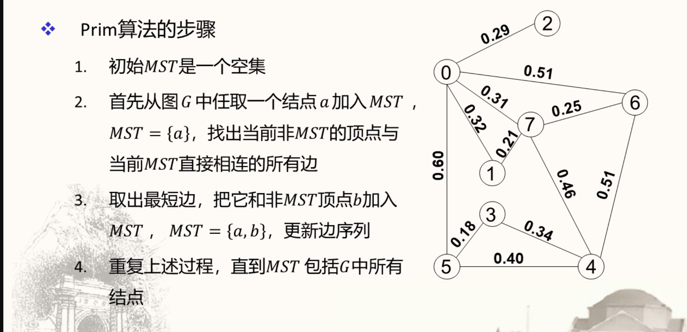
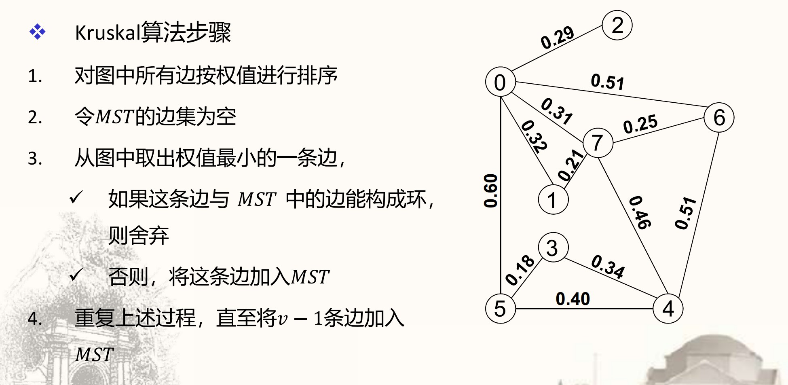
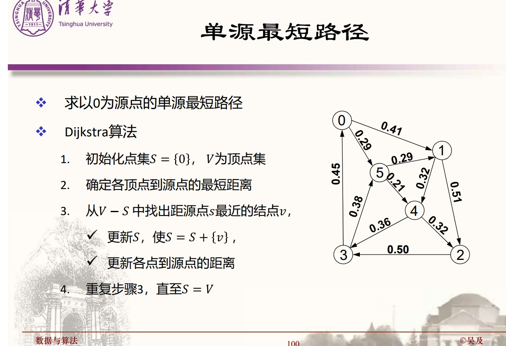

# 相关资源

[Princeton _Algorithm 4th Edition_](https://algs4.cs.princeton.edu/home/)

# 课程说明

## 课程内容

数据处理，数学模型，算法分析

非数值问题：

数据结构：线性表，栈，队列，串，树，图

非数值算法：查找，排序

数值问题：

误差分析

线性方程组

非线性方程

拟合与插值

最优化初步

算法设计：蛮力，分治、减治、贪心、动态规划、搜索算法

# 绪论

## 数据与算法

## 数学模型

对于现实世界的某一特定对象，为特定目的而得到的一个抽象的简化的数学结构。

### 算法

算法是问题的程序化解决方案。

算法强调精确定义的求解过程，并不是问题的答案。

设计实现算法，并没有得到答案，但是给出了一般的解决方案。

一个算法能够解决很多看似好无关系的问题，只要这些问题可以抽象为某种相同的算法。

### 数据

数据是客观世界的描述。

数据是信息的载体，是算法处理的对象。

算法是处理数据的系统。

人的因素也被纳入了数学模型的和算法。

IBM Watson

## 算法分析和算法设计

### 算法及其特性

算法的五个重要特性：

有穷性：一个算法必须可以在有穷步之后结束，且每一步可以在有穷时间内完成

确定性：算法的描述无歧义，算法的执行结果是确定的且精确地符合要求或期望

可行性：算法中描述的操作都可以通过已经实现的基本操作运算的有限次执行来实现

输入：一个算法有零个或多个输入，这些输入取自某个特定的对象集

输出：一个算法有一个或多个输出，输出量是算法计算的结果

### 算法的评价

#### 正确性

不含语法错误

几组一般的输入数据

精心选择的、典型、苛刻且带有刁难性的输入数据（衡量标准）

一切合法的输入数据

#### 健壮性

输入的数据非法

#### 可读性

描述清楚，便于理解

#### 高效率

占用的空间和时间资源

### 算法效率的衡量方法

和算法执行时间相关的因素有很多。

一个特定算法运行工作量的大小，是问题规模的函数。

#### 渐进时间复杂度

算法的渐进时间复杂度(Time Complexity): $T(n) = O[f(n)]$

Big-O 记号的形式化定义

- 若 f(n)是正整数 n 的一个函数，则$x_n = O[f(n)]$表示存在正的常数$M$和$n_0$， 使得当$n > n_0$时，都满足$|x_n| \le M|f(n)|$
- 标记的是算法效率的上限

##### 算法效率估算方法

- 算法执行的时间 = Σ 操作的执行次数 × 操作的执行时间
- 算法操作包括**控制操作**和**原操作**<br>一般来说，相比于循环体，控制操作本身的复杂度可被忽略。而在原操作中，我们又可以寻找其中执行次数最多的一种或几种操作，这些操作被称为基本操作。
- 选取算法中的**基本操作**
- 算法的执行时间与**基本操作执行次数之和**成正比

##### 描述指标

- 最好情况(best-case)：对于任何一个输入的运行时间下限
- 最坏情况(worst-case)：对于任何一个输入的运行时间下限
- 平均(average-complexity): 根据各种操作出现概率的分布进行加权平均
- 分摊(amortized complexity): 连续实施足够多次操作，总成本摊至单次操作

最重要的是平均情况下的性能

##### 引入大 O 表示的渐进时间复杂度和空间复杂度实际上是建立了算法效率分析的数学模型

##### 迅速找到会被多次反复执行的基本操作

##### 感兴趣的复杂度形式非常有限

##### 按照对数坐标画图

#### 空间复杂度

##### 算法空间

- 指令空间(instruction space): 用来存储程序指令所需的空间
- 数据空间(data space): 存储运行过程中常量和变量所需的空间
- 环境空间: 系统为程序运行，特别是函数调用提供的空间

##### 算法的渐进空间复杂度: $S(n) = O[f(n)]$

##### 输入数据所占空间只取决于问题本身，和算法无关，则只需要分析输入和程序之外的额外空间

### 数据结构

#### 数据元素和数据项

数据元素(Data Element): 数据的最小单位

数据项：(Data Item): 数据结构中讨论的最小单位

#### 数据结构是带结构的数据元素的集合

逻辑结构：集合，线性结构，树结构，图结构

存储结构：顺序存储，链式存储

#### 二元关系

##### 定义

定义：设有几何$M, N$, 其笛卡尔积$M \times N$的任意一个子集$R \in M \times N$

二元关系表示了集合$M$和集合$N$中元素之间的某种相关性。

若$(a, b) \in R$, 则称$a$为$R$的前件，$b$称为$R$的后件。

若$M = N$, 则称$R \sub M \times M$为 M 上的二元关系。

##### 二元关系的性质

设$R$为集合$M$上的一个二元关系：

(1) 自反性：对于每个$a \in M$, 有 $(a, a) \in R$;

反自反性： 对于所有$a \in M$, 有$(a, a) \notin R$;

(2) 对称性：当$(a, b) \in R$时，则$a = b$;

反对称性：当$(a, b) \in R$且$(b, a) \in R$时，必有$a = b$;

(3) 传递性： 当$(a, b) \in R$且$(b, c) \in R$ 时， 必有$(a, c) \in R$。

##### 常见的二元关系

等价关系：满足自反性、对称性、传递性

偏序关系：满足自反性、反对称性、传递性

全序关系：若$M$中的任意两个元素$a$和$b$是可比的，也就是说或者有$aRb$成立，或者有$bRa$成立，则称$R$是集合$M$上的全序关系(Totala Order Relation)

#### 数据类型(Data Type)

##### C 语言中的类型定义

五种基本数据类型：字符型，整型，浮点型，双精度浮点型和无值类型

程序中任何变量，常量都必须先定义类型。

整数类型 int 及定义在其上的操作：+, -, \*, /, %, ++, --

双精度浮点型 double 及定义在其上的操作：+, -, \*, /, ++, --

###### 数据类型用来刻画(程序)操作对象的特性

数据类型是一个元素的集合和定义在此集合上的一组操作的总称。

数据类型实现了信息的隐藏，把一切用户无需了解的细节封装在类型中。

高级语言中的数据类型分为原子类型和结构类型。

#### 抽象数据类型(Abstract Data Type, ADT)

是指一个数学模型以及定义在此数学模型上的一组操作。

数据抽象：描述的是实体的本质特征、功能以及外部用户接口

数据封装：将实体的外部特性和内在实现细节发呢里，对外部用户隐藏内部实现细节，使得应用和实现分离

ADT 的优点：

- 程序结构清晰，易于扩展易于维护而不失其效率
- 提高程序的数据安全性
- 大大增加了软件的复用程度

#### 抽象数据类型的描述

```
ADT 抽象数据类型名{
    数据对象: <数据对象的定义>
    数据关系: <数据关系的定义>
    基本操作: <基本操作的定义>
    基本操作名(参数表)
        初始条件: <初始条件描述>
        操作结果: <操作结果描述>
}ADT 抽象数据类型名
```

基本操作参数:

- 赋值参数提供输入值
- 引用参数以&打头，用于返回操作结果

# 数据结构

## 线性表

线性表的元素可以是各种各样的，但是同一线性表的元素必然具有相同特性-同质

线性表中的相邻元素之间存在有序关系-位序

线性表是一种“有序结果”，即在数据元素的非空有限集合中

- 存在唯一的一个被称为“第一个”的数据元素，无前驱；
- 存在唯一的一个被称为的“最后一个”的数据元素，无后继；
- 除第一个之外，每一个数据元素均只有一个直接前驱；
- 除最后一个之外，每个数据元素均只有一个直接后继

线性表中元素个数定义为线性表的长度

$$(a_0, a_1, \dots, a_{i-1}, a_i, a_{i+1}, \dots, a_{n-1})$$

若线性表为空，则其长度为 0，称为空表

在非空表中，每个数据元素都有一个确定的位置

- $a_0$是第 0 个数据元素，$a_{n-1}$是第$n-1$个数据元素
- $a_i$是第 i 个数据元素
- 称 i 为数据元素$a_i$在线性表中的位序

## 线性表 ADT

```Java
ADT List{
    数据对象:
    数据关系:
    基本操作：
    InitList(&L);
        操作结果：构造一个空的线性表L。
    DestroyList(&L);
        初始条件：线性表已存在。
        操作结果：销毁线性表L。
    IsEmpty(L);
        初始条件：线性表已存在。
        操作结果：若L为空表，则返回TRUE，否则返回FALSE。
    ListLength(L);
        初始条件：线性表L已存在。
        操作结果：用e返回L中第i个数据元素的值
    GetElem(L, i, &e);
        初始条件：线性表L已存在。
        操作结果；用e返回L中第i个数据元素的值。
    LocateElem(L, e, compare());
        初始条件：线性表L已存在，compare()是数据元素判定函数。
        操作结果：返回L中第1个与e满足关系compare()的数据元素的位序。若这样的元素不存在，则返回-1。
    PriorElem(L, cur_e, &pre_e);
        初始条件：线性表L已存在。
        操作结果：若cur_e是L的数据元素，且不是最后一个，则用next_e返回它的后继，否则操作失败，next_e无定义。
    ClearList(&L);
        初始条件：线性表L已存在；
        操作结果：将L重置为空表。
    ListInsert(&L, i, e);
        初始条件：线性表L已存在, 0 <=i <= ListLength(L)。
        操作结果：在L中第i个位置插入新的数据元素e，L的长度加1。
    ListDelete(&L, i, &e)
        初始条件：线性表L已存在，0 <= i <= ListLength(L) - 1。
        操作结果：删除L的第i个数据元素，用e返回其值，L的长度减1。
    ListTraverse(L, visit());
        初始条件：线性表L已存在。
        操作结果：依次对L的每个数据元素调用函数 visit()。

```

线性表的合并：$O(m+n)$

线性表的保序归并：$O(m+n)$

线性表的顺序存储：顺序表

- 用一组地址连续的存储单元依次存储线性表的数据元素

顺序表的主要操作：

插入操作：在顺序表的第 i 个位置插入一个新元素，使顺序表的长度增加到$n+1$

复杂度分析：

- 在顺序表的第$i$个位置插入一个新元素，需要移动$n - i$个元素；
- 假设从顺序表的第$i$个位置插入元素的先验概率为$p_i$
- 插入操作移动元素次数的期望为$E_{insert} = \sum_{i = 0}^n(n - i) \times p_i$

删除操作：把顺序表的第$i$个位置的元素从表中删除，使长度为$n$的顺序表的长度变为$n - 1$

复杂度分析：

- 把顺序表的第$i$个位置上的元素删除，需要移动$n - i -1$个元素
- 假设从顺序表的第$i$个位置删除元素的先验概率为$q_i$
- 删除操作移动元素次数的期望为: $E_{delete} = \sum_{i = 0}^{n - 1}(n - i - 1) \times q_i$

不失一般性，我们假设插入或删除元素出现在任何位置的概率都是相等的，因此有$p_i = p = 1/(n+1), q_i = q = 1/n$。

推导得到：
$$E_{insert} = \frac1{n+1}\sum_{i = 0}^n(n-i) = \frac n2\newline E_{delete} = \frac1n\sum_{i = 0}^{n - 1}(n - i - 1) = \frac{n - 1}2$$

## 单向链表

最简单的链表结构：链表节点(node)由两个域组成。

数据域：存储数据元素，

指针域：指向直接后继节点

单向链表的 C++实现：

```C++
class LinkList {
private:
    NODE *head;
public:
    LinkList() {head = NULL;}
    ~LinkList();
    bool clearSqList();
    bool IsEmpty(){return head ==  NULL;}
    bool GetElem(int i, int *e);
    int LocateElem(int e);
    bool PriorElem(int cur_e, int *next_e);
    bool NextElem(int cur_e, int* pre_e);
    bool Insert(int i, int e);
    bool Delete(int i, int *e);
    bool Traverse(bool (*visit)(int e));//遍历所有节点
}

```

单向链表的不足：

* 单链表的表长是一个隐含的值，遍历链表才能得到
* 在单链表中插入或者删除元素时，需要在链表中依序寻找操作位置
* 在链表中，元素的“位序”概念淡化，结点的“位置”概念强化
* 如何得到某个元素的前驱？

改进链表的设置：

* 增加“表长”、“表尾指针”和“当前位置指针”三个数据域

* 将基本操作中的“位序i”改为“指针p”

## 双向链表

由数据，前驱和后继构成。

方便寻找前驱，但是增加了维护成本。

## 顺序表和链表的比较：

顺序表

用一组地址连续的存储单元依次存储线性表中的数据元素

优点：可以随机存取

缺点：插入，删除操作需要移动表中的数据元素，事先确定规模，空间效率不高。

链表：

用一组“任意”的存储单元（附加指针）存储表中的数据元素

优点：插入，删除操作无需移动表中的数据元素，空间利用率高

缺点：不能随机存取

## 栈

栈是LIFO(Last In First Out，先进后出)的线性表。

允许插入和删除的一段称为栈顶(top), 另一端称为栈底(bottom)

### 栈的ADT

~~~C++
{
    Push(&s, e);
    Pop(&s, &e);
    ClearStack(&s);
} ADT Stack;
~~~

### 栈的表示和实现

栈的顺序表示

top指向最后一个元素可以，指向空也可以，但是实现时要自洽。

栈的链式表示

有头插入和尾插入两个方式

总体来看，头插入比尾插入的优势要更大。首先，插入时虽然头插入要修改的指针更多，但是时间复杂度小，头插入$O(1)$，尾插入$O(n)$。其次，如果以尾部为栈顶，删除时会很麻烦。

**静态分配**

```C++
#define STACK_MAX_SIZE 100
```
**动态分配**

程序隐含设定

```C++
#define STACK_INT_SIZE 100
#define STACKINCREMENT 10
```

用户给定

### 复杂度分析

顺序栈的效率分析

时间复杂度

* 进栈、出栈:$O(1)$
* 栈的溢出处理
* 如果栈元素时简单数据类型，则构造和销毁函数也是$O(1)$的

空间复杂度

* 顺序栈的长度构造时确定
* 空间利用效率低

链式栈的效率分析

时间复杂度

* 链式栈的入栈出栈是$O(1)$时间的
* 建立和销毁是$O(n)$时间的

空间复杂度

* 一般不会产生溢出
* 空间利用率高

### 栈的一些应用

显式应用：括号匹配，表达式求值，迷宫求解

隐式应用：函数调用，递归

系统栈

## 递归

栈与递归具有相似性。

Fibonacci的递归次数：$C(n) = O(t^n)$

(证明思路：归纳法证明$C(n) = 2F(n) - 1$, 根据F(n)通项可以判断。)

使用递推法的时间复杂度：$O(n)$.

经常需要进行递归的消除。消除方法：递推，循环等，没有统一的解决方案。可以借用显式栈实现非递归过程。

递归的评价：

* 简洁，便于理解，便于叙述和设计
* 运行效率低，无法控制递归堆栈的规模

## 队列

队列是FIFO(First In First Out, 先进先出)的线性表。

### 队列的表示和实现

队列的顺序表示法

入队: rear = rear + 1

出队: front = front + 1

需要判定队满和队空。

顺序队列的问题：被出队的空间不会再次被使用了。

循环队列：

队尾指针指向maxSize - 1时， 入列则指向0；

队头指针指向maxSize - 1，出列也指向0。

可以使用模运算实现。

缺点：无法区分队空和队满的状态。

区分方法：

设置一个空位；设置标志；设置队列长度变量

队列的链式表示法

入队不会出现队满的问题，出队可能回有队空的问题，队空的条件为front = NULL.

## 串

串是有线长度的字符序列。

串的长度是字符个数。

字符在串中的位置。

两个串相等的条件。

子串和主串，子串在主串中的位置。

### 匹配算法

Brute-Force算法：一个一个比。复杂度最高O(m * n)。

KMP算法：尽可能跳过更多不必要的匹配。复杂度最多O(m + n)。

Horspool算法：启发式算法。复杂度低则O(m/n)，高则O(m * n + s)，s为字符表规模

Boyer-Moore算法：最坏O(n)。KMP和Horspool的综合（或者说Horspool是BM算法的简化版本。）

## 树与二叉树

### 树

空树，子树。

结点（node）是树的基本单位。

结点的度(degree)：结点的子树个数。

树的度：结点度的最大值。

k叉树：树的度为k

child, parent, cousin, ancestor, descendant

depth/height

树的性质：

1. 树中结点数等于所有结点度数和加一
2. k叉树第i层至多$k^{i - 1}个结点$
3. 深度为h的k叉树至多有$(k^h - 1)/(k - 1)$个结点
4. 具有n个结点的k叉树的最小深度为$[\log_k(n(k - 1) + 1)]$

### 二叉树

二叉树是结点的一个有限集合，该集合或者为空，或者是由一个根节点加上两棵分别称为左子树和右子树的、互不相交的二叉树组成。

二叉树的性质：

1. 叶子结点数 = 度为二的结点数 + 1
2. 第i层至多$2^{i - 1}$个结点
3. 深度为h，则最多有$(2^h - 1)$个结点
4. 具有n个结点的完全二叉树的深度为$\lceil\log_2(n + 1)\rceil$
5. 对于完全二叉树（最后一层从右向左缺若干结点），从左向右，从上到下编号，则$\lfloor(i - 1)/2\rfloor$为编号i的parent结点，$2i + 1$为其左子树，$2i + 2$为其右子树。

二叉树的顺序表示

完全二叉树按照编号存储。不完全二叉树按照它对应的完全二叉树存储，但是缺少的部分留空。

不完全二叉树结点越少，空间效率越低。

二叉树的链式表示

空间效率很高。

二叉树的遍历：

记根节点为V，遍历左子树为L，遍历右子树记为R

先序遍历：V - L - R

中序遍历：L - V - R

后序遍历：L - R - V

遍历可以通过递归实现，但是递归可能会对效率产生影响。可以利用栈的特性实现遍历。

层序遍历：从上到下优先遍历同一层的结点。

遍历实现了树的线索化过程。

### 霍夫曼树

霍夫曼树：寻找加权路径长度(WPL)的最小树。

用途：实现性能最好的变长二进制编码。

霍夫曼编码不是唯一的，但是所有霍夫曼树的WPL都相等。

不足：

没有错误保护功能

### 二叉树的建立

只知道二叉树的先序序列，不能确定这棵二叉树。

但是如果同时知道先序序列和中序序列，则可以确定这棵二叉树。

## 图

### 概念

图的定义

顶点，边，弧

邻接顶点

有向图，无向图

有向完全图，无向完全图

子图

握手定理，度

权，网络
边上的数叫做权。有权的图叫网络。

连通

连通图

连通分量
无向图的极大连通子图为连通分量。（所谓极大，就是再加入一个点都会导致它不连通）

强连通图
有向图中存在vi到vj且存在vj到vi的图。

强连通分量
有向图的极大强连通子图为强连通分量。

Euler路径和Euler回路

图的存储和表示

邻接矩阵表示
如果v和w之间有边，则元素为1，否则为0.

邻接表表示
采用链表数组表示图。同一个顶点发出的边在同一个链表中。

### 图的遍历

深度优先遍历和广度优先遍历

图的遍历：从已给连通图的某一顶点出发，沿着一些边访问所有顶点，且每个顶点只访问一次，则叫做图的遍历。

邻接矩阵的遍历：$O(v^2)$

邻接表的遍历：$O(v + e)$

### 生成树

连通图的生成树，包含图中全部n个顶点，但只有n-1条边。

深度优先和广度优先遍历分别会得到一个搜索树。

最小生成树：权值之和最小的生成树。

求最小生成树的算法：贪心算法思想。Kruskal算法和Prim算法。

Prim算法



Prim算法的时间复杂度为$O(n^2)$。对稠密图而言是线性的。对于稠密图而言，Prim的邻接矩阵实现是首选方法。

Kruskal算法


Kruskal的时间复杂度为$O(E\log E)$。

Kruskal算法对于稀疏图是好的选择。

### 最短路径树

从根到其他顶点的最短路径

源点-汇点最短路径：给定一个起始顶点s和一个结束顶点 ，在图中找出从s到t的一条路径。起始顶点称为“源点”，结束顶点称为“汇点”

单源最短路径：给定一个起始顶点s，找出从s到图中其它各顶点的最短路径

全源最短路径：找出连接图中各对顶点的最短路径

#### 单源最短路径

Dijkstra算法



Dijkstra算法通过构造加权有向图图的最短路径树SPT，来实现单源最短路径算法。

时间复杂度为$O(v^2)$，和Prim算法很相似。

#### 全源最短路径

可以对每个顶点用Dijkstra算法。

Floyd算法

时间复杂度：$O(v^3)$。可以计算出一个网络中所有的最短路径。

Floyd算法允许图中带有负权值的边，但不允许有包含带负权值的边组成回路。

# 算法

## 非数值算法

### 查找

查找算法的复杂性：关键字/数据规模

查找算法的分类：
* 内部/外部
* 静态/动态

#### 查找表

查找表（Search Table）是由同一类型数据元素构成的集合。

按关键字查找
1. 查询某元素是否存在
2. 检索某数据元素的各种属性
3. 在查找表中插入一个数据元素
4. 从查找表中删除一个数据元素

查找表的种类
1. 静态查找表-仅可执行1,2
2. 可执行1,2,3,4

平均查找长度：在查找过程中，为确定目标在查找表中的位置，需要进行关键字比较次数的期望值

$$
ASL = \sum_{0}^{n - 1}P_i C_i
$$

$P_i$为第i条记录的查找概率，$C_i$为第i条记录的查找长度。

有时我们会假设查找概率相等或不等，有时要考虑查找失败的比较次数。

ASL越小，查找性能越好。

顺序查找：又称线性查找，是从线性
表的一端开始，依次把每个元素的
关键字同给定值进行比较

假设每个元素的查找概率相等，则平均查找长度为：$ASL = \sum_0^{n - 1}\frac{i + 1}{n} = \frac{n + 1}{2}$。

更多考虑：查找概率不等；查找失败需要N次比较；越界判断

折半查找：如果顺序表有序，我们可以采用高效率的折半查找

折半查找可以用一个二叉树结构来表述。比较次数不会超过$\lfloor\log_2 N + 1\rfloor$。

索引查找：将线性表划分为若干子表，再建立指向这若干子表的一个索引表。相同性质的数据归类到一个子表中。

索引表：顺序表或链表

子表：顺序表或链表

因而可以有四种不同的索引存储方式。

索引表的特点：表不大， 表中元素不常变动。因而适合用顺序表来表示索引表。

分块查找：也称索引顺序查找，是顺序查找的改进。子表之间有序；块内元素无序。索引表包括关键字项，指针项，子表长度。

索引文件：单关键字，多关键字。

稠密索引：索引表的索引项和主文件的各记录一一对应，称为稠密索引。

稀疏索引（非稠密索引）：索引项对应主文件的一部分记录。

索引文件的好处：减少访问外存的次数，提高查找速度。

倒排文件：不同之处是辅索引表包含物理地址序列。（为什么要倒排？）

#### 二叉搜索树（BST）

或者是一棵空树，或者是具有下列性质
的二叉树：每个结点有一个关键字(key)，
并且:
1. 任意结点关键字大于等于该结点左
子树中所有结点含有的关键字
2. 同时该结点的关键字小于等于右子
树中所有结点含有的关键字

BST是一种重要的动态搜索结构。它的中序遍历是确定的。 

BST的插入操作和查找操作同样简单。


删除操作比较复杂。叶子结点的删除比较简单；如果结点只有一棵子树，也比较简单；如果左右子树都不空，可以用中序后继替换。

BST的性能：越“平衡”越好。

二叉搜索树的路径长度和高度直接关系到BST中搜索的开销，对于一棵
含有N个关键字的BST
* 最好情况下，所有搜索都可以保证对数运行时间
* 最坏情况下，进行一次搜索需要 次比较
* 平均情况下搜索需要 次比较操作

BST的旋转操作：结点和一个子孙交换角色。分为左旋转和右旋转。右旋转涉及到结点和右孩子。（右旋转和左旋转是以结点自己作为参考系而言。）

BST通过不断的旋转来保证自己的平衡性。

AVL树：
一棵AVL树或者是空树，或者是具有下列性质的二叉搜索树:
1. 左子树和右子树都是AVL树
1. 且左子树和右子树的高度之差的绝对
值不超过1

AVL的高度为$O(\log_2 n)$，平均查找长度也为$O(\log_2 n)$。

AVL具有良好的搜索性能，能够避免一般BST性能恶化的问题。但是AVL的维护比较复杂，在进行插入和删除操作后，都必须通过大量的旋转操作保证AVL的平衡性。

寻找其他方法，以提高BST的平衡程度，保证BST的性能。

* 实用的平衡二叉搜索树-红黑树

* 多路平衡的动态查找结构-B-树

#### 散列

散列的关键是散列函数和冲突处理。

散列函数应是简单的，能在较短的时间内计算出结果

散列函数的定义域必须包括需要存储的全部关键码，如果散列表允许有m
个地址，其值域必须在0到m-1之间

理想的散列函数应近似为随机的，对每一个输入，相应的输出在值域上是
等概的。

冲突处理：

* 链地址法：把散列到同一个地址的关键字存进链表中。（表长小于元素数目）
* 开放定址法：放在表中空的位置。查找时采用“探测”的方法。如果探测下一个位置，称为线性探测。（表长大于元素数目，稀疏表，一般不允许表达到半满状态）
* 双重散列法：用第二个散列函数表达散列的增量。时间复杂度略大，但是性能比线性探测好很多。

散列的其他应用：字符串的匹配；搜索引擎对URL的散列；信息安全中的内容鉴别技术（MD5, sha）。

散列提供常数时间的查找性能，实现简单；但是好的散列函数不易找到，删除操作和空间性能不好，最坏情况下性能不好，忽略了数据间的逻辑关系。

### 排序

排序算法的稳定性：如果两个对象的排序码相等，排序前后的顺序不变，则是稳定的；否则是不稳定的。

内排序：数据对象存放在内存。

外排序：数据对象在内、外存之间移动。

冒泡排序：复杂度为$O(n^2)$。添加排序标记，最好情况下只需要$n - 1$次比较和0次交换。

插入排序：有直接插入，折半插入，希尔排序

直接插入：$O(n^2)$

折半插入：查找插入位置的时候可以采用折半查找，因为表中可以插入的部分已经排好序了。复杂度没有变化，依然是$O(n^2)$

希尔排序：如果序列中，间距为h的元素都有序，称这个序列为h-排序的。希尔排序就是不断缩小h，直到h=1。

选择特定的步长序列$h_n$，取出序列中增量为$h_n$的子列进行插入排序。然后取$h_{n-1}$，直至取$h_1=1$。

它在h比较大的时候排序，由于间距短，速度快；而h小的时候，由于有序性强，速度快。总体速度依赖于步长序列的选择，时间复杂度比直接插入好一些。

选择排序：比较次数$O(n^2)$，移动次数$O(n)$，移动次数少一些。

冒泡排序和插入排序都是稳定的，而选择排序是不稳定的。

**快速排序**：一种交换类排序。具有很好的性能。

将待排序序列分为两个部分，满足：
1. a[i]位于它在序列中的正确位置
2. 前面的元素比a[i]小
3. 后面的元素比a[i]大
然后对两个部分继续划分，每次划分都将一个元素划分到它的正确位置。

如何划分：

选择划分元素v。从序列左边扫描，找到一个比v大的元素，从右边扫描，找到一个比v小的元素，交换两个元素。反复交换，直到左右扫描指针相遇，则划分完成。

快速排序的递归树是一颗二叉搜索树，因为每次递归都是对比自己大和比自己小的两个部分递归。

时间复杂度：理想情况下$O(N\log_2N)$，如果递归树是平衡的。平均情况下为$O(N\log N)$，而最坏情况下退化为$O(N^2)$。

快速排序是不稳定的排序算法。

改进：

划分元素是最大或者最小的元素时是最坏情况。为了避免最坏情况，采用中间元素法：取序列的左端元素，右端元素和中间元素，选择关键字处于中间的元素作为划分元素。

快速排序中，子序列非常小时仍然要递归调用，可以采用插入排序代替，提高效率。

归并排序：合并有序表。两个表的归并，叫二路归并。利用二路归并可以实现归并排序。

自底向上归并：将文件分割成长度为m的子序列，每次m翻倍。

自顶向下归并：将文件分割为两个部分，分别进行递归的归并排序后再合起来进行归并排序。

归并排序是稳定的，时间最好情况是$O(N\log N)$，最坏是$O(N^2)$.

堆：堆是满足堆性质的完全二叉树。

最大堆：任意节点的值小于父节点的值。

最小堆；任意节点的值小于父节点的值。

因为是完全二叉树，适合用顺序存储方式。

堆：顺序存储在一维数组中。

堆的操作，例如插入，删除或者修改结点会破坏堆的性质，因此修复堆是重要的操作。

对于最大堆，如果某结点的关键值小于其子节点的关键值，可以采用自顶向下堆化(Heapify-down)的算法进行修复。

对于最大堆，若结点的关键值大于父节点的关键值，采用自底向上堆化(Heapify-up的算法进行修复)

向堆中插入结点：在新节点插入堆尾，调用自底向上算法调整堆。这种构造堆方法称为自顶向下的堆构造。

自顶向下的堆构造：$O(N\log N)$

自底向上的堆构造：时间复杂度$O(N)$

自底向上构造复杂度小的原因：离根远的复杂度小，离根近的复杂度大。而自顶向下是离根远的复杂度大，离根近的复杂度小。离根远的数量多，而离根近的数量少，因此自底向上的整体的复杂度更小。

优先级队列可以用堆实现，性能非常好。

堆排序：节约空间，比较次数和移动次数都是$O(N\log N)$。堆排序是不稳定的排序方法。

从小到大排序的方法：自底向上构造最大堆。将堆首与堆尾交换，堆序列长度-1，调整堆，再次交换，重复上述过程，直到堆空。

>堆排序大概可以理解成优先队列的出队过程。

采用决策树的方法可以求得比较次数的下界为$O(N\log N)$

### 数值算法

一个数值问题是适定的(well posed)，需要满足：
* 解存在
* 解唯一
* 连续地依赖于问题数据

不满足条件的问题被称为不适定的(ill-posed)。

适定的问题，如果解对输入数据非常敏感，则称之为病态的(ill-conditioned)。

针对适定和良态(well-conditioned)问题，数值分析可以得到具有一定精度的近似解。

数值分析重视误差。误差=计算误差+传播误差，算法影响的是计算误差。误差有模型误差、测量误差、截断误差、舍入误差。

前向误差反映了输出的误差，后向误差反映了输入的误差。相对前向误差与相对后向误差的比值叫做条件数(condition number)。$cond \le 1$说明问题是良态的；否则是病态的。

实际问题中我们通常求解条件数的估计值或者上限。进而求得前向误差。

相对条件数:$\left|\frac{xf^\prime (x)}{f(x)}\right|$。绝对条件数：$\left|f(x)\right|$

算法的稳定性：如果一个算法对于计算过程中的微小扰动不敏感，则算法是稳定的。

问题的病态性针对输入数据的微小扰动，而算法的稳定性针对的是计算过程中的误差。

最近舍入法：与x最相近的浮点数，如果相等，取最后一个存储位为偶数。

若是偶数，则区间是闭区间；若是奇数，则对应的区间为开区间。