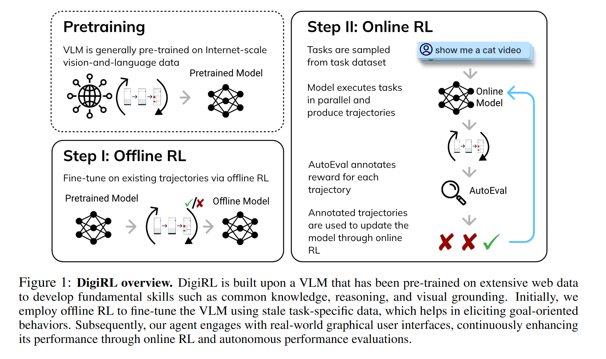
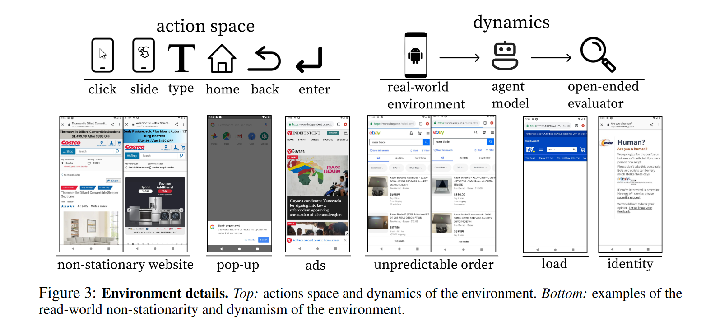
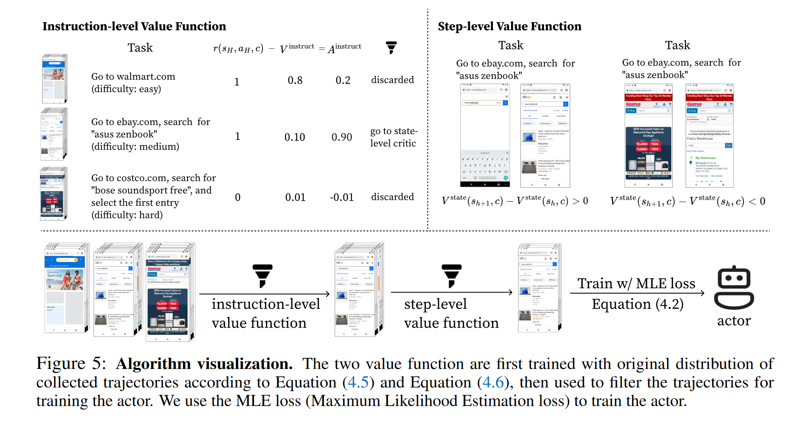
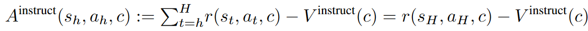
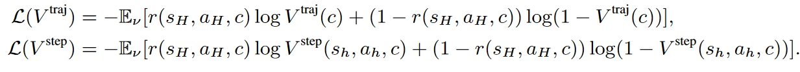
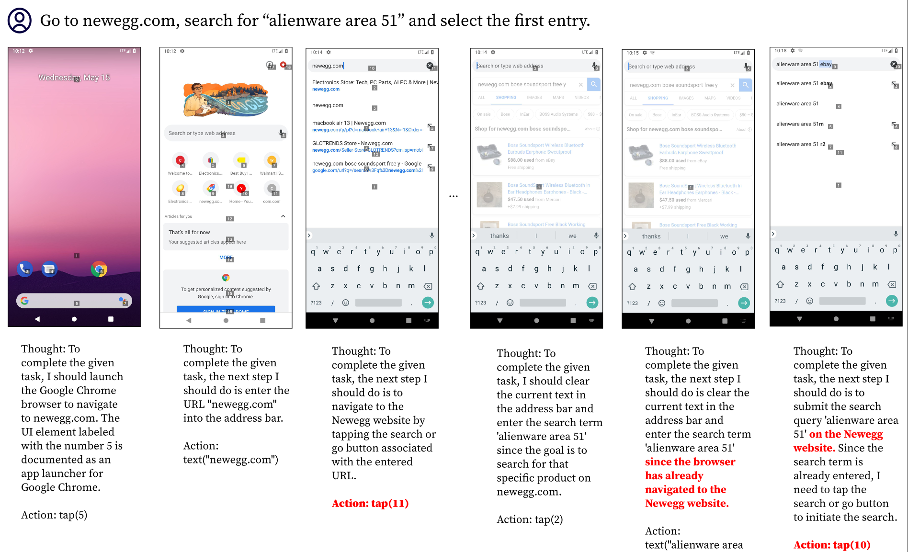
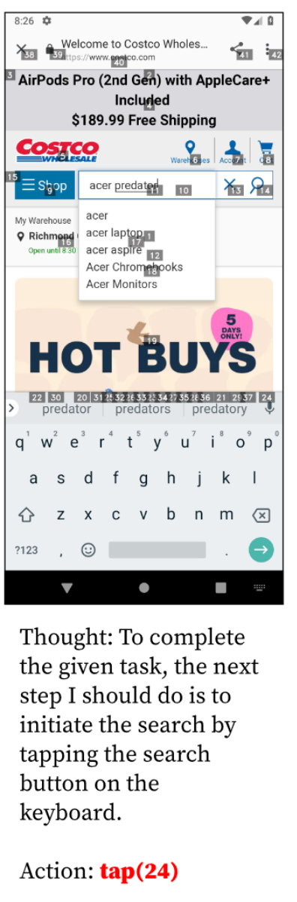
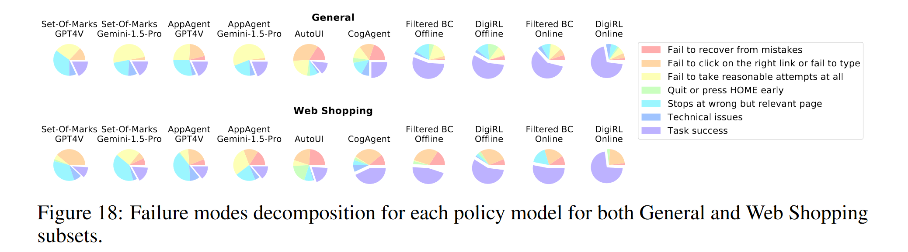

## DigiRL: Training In-The-Wild Device-Control Agents with Autonomous Reinforcement Learning

LLM (VLM) +RL 的完美之作！在 Pretraining 的基础上进行 Offline RL，然后在执行任务时通过 Online RL 更新参数，特色是能够从多轮交互中学习、更新参数，而不是通过专家知识微调一个单步交互模型。实验也做得非常详细。不过 RL 的部分我还看不太懂，需要继续学习。

Action Space 定义为点击、滑动、输入、home 键、返回等操作，参数包含屏幕上的归一化 (x, y) 坐标。另外引入的一个设定是界面的随机性，界面可能有随时更新、加载中、小广告、身份识别等干扰出现。

## RL 算法部分

首先本文将手机操作问题建模为一个 MDP 过程。

然后采用了 AWR 算法，计算策略梯度。似乎用到了蒙特卡洛？

Instruction-Level Value Function 有什么作用？这里似乎是说 task set 的难度方差太大，需要用难度适中的数据去训练 actor model，所以提出了则个 Value Function 来过滤一部分数据。

首先，定义 Advantage 为一个状态的 Q 值（按照当前策略，未来所有步的期望值）减去 Value function：

$$
A^\pi(s_h,a_h,c)=Q^\pi(s_h,a_h,c)-V^\pi(s_h,c).
$$

AWR 算法的 Actor 优化目标是一个加权的 MLE：

$$
\arg\max_\pi\mathbb{E}_\nu\left[\log\pi(a|s,c)\cdot\exp\left(A(s,a,c)/\beta\right)\right]
$$

在论文中没有用这个公式，而是用 hard filtering 替代：

$$
\mathcal{L}(\pi)=-\mathbb{E}_{\mathrm{filter}(\nu)}[\log\pi(a|s,c)].
$$

Step Advantage 的估计采用的是 GAE (Generalized Advantage Estimation) 的简化版：

$$
A^{\mathrm{step}}(s_h,a_h,c):=\lambda^{H-h}r(s_H,a_H,c)+(1-\lambda^{H-h}r(s_H,a_H,c))(V^{\mathrm{step}}(s_{h+1},c)+r(s_h,a_h,c)-V^{\mathrm{step}}(s_h,c))
$$

之所以可以这么做，是因为任务的奖励只有在最后一步有，成功了是1，失败了是0，第一项是高方差的 MC，第二项是高偏差的估计器。随着 h 增加，第一项的权重越来越大，第二项权重则越来越小。这两项综合起来有利于均衡方差与偏差。

此外，我们还要定义 Instruct Advantage，用来评估一条 traj 的学习价值：

个人理解，traj 的学习价值取决于 traj 奖励值和指令平均奖励的差。

traj 的奖励值就是当前这条路径拿到的奖励总和。

“指令平均奖励”就是当前指令下获得奖励的期望值，取决于任务的难易程度，因为它是对该任务所有 traj 的平均，任务越难，奖励更难拿到，指令平均奖励越低。

那么，traj 的奖励值越高，traj 的学习价值就越高，直觉上即成功的任务（奖励为1）有学习价值，但是失败的任务（奖励为0）不值得学习；

指令平均奖励越高，traj 的学习价值越低，这是因为指令平均奖励高，意味着这个任务很简单，不值得学习。

关于估计器的训练，采用的是交叉熵损失而不是传统的 MSE 损失，这是因为交叉熵损失通常在 transformer 架构上更好用：

而且巧妙的点在于这个任务的奖励只有 1 或 0，因此估计器其实可以看作一个二分类，交叉熵就只有两项。

最终的 pipeline：

* 训练 Step-level 和 Instruct-level 的估计器 V；
* 用估计器 V 计算学习价值 A，通过学习价值过滤掉一部分无效 traj 和 step；
  * 具体而言，Instruct-level 选取 top-p 条 traj；
  * Step-level 选取阈值大于 1/H 的 step.
* 在过滤后的 traj 上采用 MLE 准则训练模型。

## 模型架构

在 AutoUI-Base 的基础上进行训练，固定 image encoder 不动。

### Instruction and Step Level Value Functions

输入：采用 image encoder 与 RoBERTa 分别对界面截图和指令进行 embedding，拼接起来。

用 2 层的 MLP 来预测 Value function。

### Actor

在离线学习阶段，通过运行原始的 AutoUI-Base 来采集 traj。在 offline 阶段，跳过了 instruction-level filtering，用所有的 instruction 来训练，用以充分地利用数据。

Decoder 具体要输出什么？是文本吗？那数值是怎么处理的？大模型能很好地理解数值吗？（9.11 > 9.8？？）

答：按照 Auto-GUI 的说法，确实是文本，点击屏幕需要用到一个 0~1 之间的 4 位小数。感觉这样肯定有很多问题，例如语言模型怎么理解空间关系和数值关系？它是不是只是背下了 UI 的数字信息？UI 的理解和识别工作应该已经有很多了。

如果要验证这点，可以设计一个空间方位相关的 Instruction，例如让它点击按钮 A 上方的那个按钮，语言模型不可能回答出来。或者，将按钮平移一段距离，看模型对于按钮位置的预测是否出现了一致的平移？

我比较相信的一种可能是，Image Encoder 在编码时确实把 UI 的位置坐标信息和语义信息编码进了 Embedding 中，并且在 Decoding 阶段确实被识别了出来，这样想倒也是自洽的。如何验证？

## 评测部分

评测采用的是 Gemini-1.5-pro，据论文报告结果和人类的评估接近。评测标准是通过一个端到端的观察，判断是否完成了任务。

## 消融实验和分析

### 错误分析

整体上，所有测试的 Agent 存在三种错误：

* 很难从错误中纠正
* 在中途卡住，例如搜索之后不知道点搜索按钮
* 到达了错误的目标，例如走错了网购网站

错误1、3貌似都是任务规划层面的问题，而不是操作执行的问题，模型之所以出错是因为它没有产生正确的意图，而不是它不理解 UI 界面本身。错误 2 是一个 UI 理解的问题。也就是说，作者可能认为模型在 planning 方面的问题是最主要的。当然作者并没有严格区分这二者，因为训练时就是以多轮操作执行为目标进行训练的。当然，这二者可能确实是无法分开的，因为不理解 UI 界面的逻辑，就无法进行正确的任务规划。

作者认为，预训练模型之所以为什么会出现这样的错误，是因为它们无法应对动态性强的环境，进入了之前从未见过的界面时候就不知道怎么从其中出来了。相反，DigiRL 通过收集 Rollouts 数据，学会了从错误中学习，从而纠正自己的错误。

我觉得这个说法有点牵强，首先这个只能解释错误类型 1、3，不能解释类型2。并不是所有模型都在预训练时接受了特定的 APP 界面相关的数据，例如 GPT-4V，AITW 的手机界面对于他来说，都是“没见过”的界面，而且点搜索按钮这件事没有太多的动态性，这跟动态性没什么关系，这个例子根本上说明的是它不理解 UI 界面语言：

它没有理解界面的内容，认为搜索框右边那个×号是搜索的意思。实际上，这个任务确实有些 tricky，因为浏览器是不提供搜索键的，回车键在这个场景中充当了搜索键的作用。GPT-4V 首先应该理解到右下角那个箭头指的是回车，第二步是认识到回车键在浏览器场景下的搜索意义。

我倾向于 GPT-4V 没有理解第一步，也就是图标本身表示回车，可能它会认为这就是一个箭头。第二步对这样的模型而言应该是非常简单就能转过来的。而且更致命的是，这个 UI 里回车根本没标上数字，那 GPT-4V 即使知道要点回车，它也没有选择的机会。比如下面这个例子：

很好笑的是，它知道“键盘上有一个搜索按钮”，但是这个按钮没标数字，它只好点击了和那个回车键距离最近的 24 号，然后它就成功点进了广告。排除广告干扰这件事本身可能相当重要，需要专门的对齐工作。

这里的例子全是 GPT-4V 的，感觉没什么看头，毕竟是附录，可能写得没那么认真。

网购这件事可能相对比较困难一点，可以看到主要的困难都是在点击按钮和走错界面上（除了 Gemini 完全无法正常 work，hh），模型产生了正确的意图，但是点错了地方，即使是论文自己的模型也没能幸免，毕竟 Image Encoder 是固定不动的。也就是说模型对于 UI 操作的理解并不充分。

总体而言，错误类型可以分成 3 类：

* 任务规划错误：Recover from mistakes, Fail at all
* UI 理解错误：包括两个子类：
  * 不可交互，仅可阅读的 UI 元素意义理解错误：Quit Early, wrong page
  * 可交互 UI 元素的理解错误：Click on link or type

DigiRL 的工作，主要解决了任务规划方面的错误，因为模型可以接受奖励信号，判断整条 trace 是否做错了。仔细想想这对于 GPT-4V 是不公平的，因为没人告诉 4V 是否做错了，4V 也不可能接受 1000 条 traj 的 Online Training，信息量自然少了很多。

但是对比而言，模型主要的错误可能还是在 UI 理解上。模型对于 UI 元素理解的能力还是很差，像 4V 这种模型甚至也会有理解错误。VLM 的能力还任重道远。

因此其实后续工作可以探讨的还有很多：

* UI 理解与交互，个人认为是目前手机 Agent 最关键的点；
* 任务规划，这个就接着 DigiRL 的思路，RL 的方法虽然成功实现了 Online Training，但是先验知识利用不足，需要 1k 量级的数据去学会一个没见过的任务，能不能做到像 ChatGPT 那样 ICL 就能直接拿下一个新任务？（这个可能很难，需要大量的标注数据）
* 异常页面处理，包括怎么鉴别误导页面，怎么从广告、弹窗、警告等非常规界面中退出，这个也许很新颖，至少我想不到有什么工作在做这个，但是这个事情可能对于 wild env 的 Agent 非常重要。
