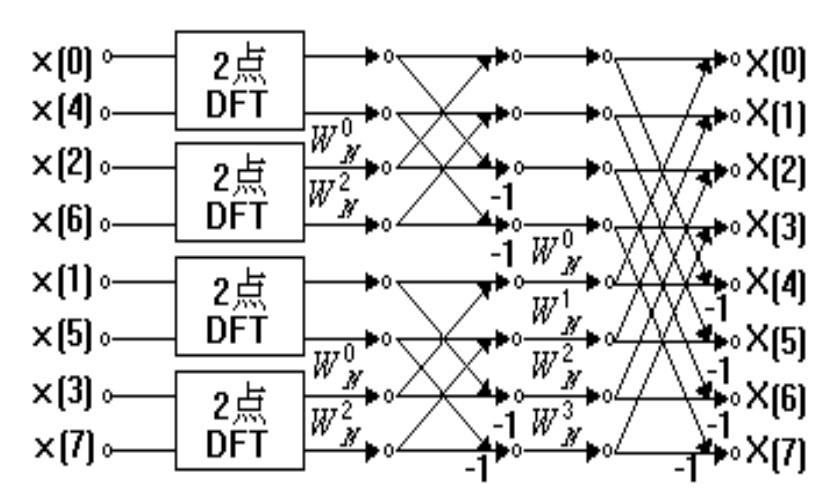
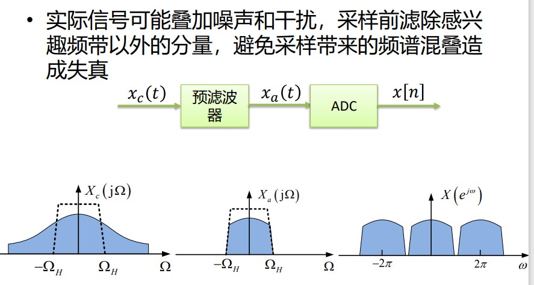
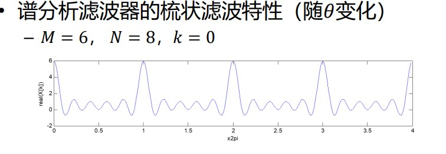

## 绪论

### 信号

信号是某种随时间或/和空间变化的物理量，其包含有从信源到信宿的某种信息。

信号可以根据时间和幅度的取值方式分类
- 连续时间信号
- - 在时间和幅度上均可以连续取值的信号
- 离散时间信号
- - 仅在离散时间点上取值，但可在幅度上连续取值的
信号
- 数字信号
- - 仅在离散时间点上取值，且在幅度上只能离散取值
的信号

### 系统

- 由若干相互作用和相互依赖的事物组合而成的具有特
定功能的整体
- 具有它自身的结构、行为和性质，通过输入和输出与
其所处的环境进行交互，通常实现一定的功能
- 可通过分析给定输入下输出的性质，来研究其行为和
性质

信号处理系统
- 对信号进行某种操作的单元或模块
- 从数学上看，可视为作用于函数上的算子

通常根据信号处理单元而非输入输出信号性质分类
- 连续（模拟）信号处理系统
- - 由电阻、电容、电感和放大器等组成的模拟电路完成信号处
理功能
- - 直接处理连续信号
- 离散信号处理系统
- - 由CCD、电容和放大器等组成的离散电路完成信号处理功能
- - 处理由连续信号采样而来的离散时间信号
- 数字信号处理系统
- - 信号处理功能由数字逻辑电路或通用计算机来完成
- - 处理数字信号（例如来源于对连续信号的采样和量化）

模拟 -> 采样量化 -> 数字信号处理系统 -> 模拟重建 -> 模拟输出信号

### 数字信号处理的局限
- ADC和DAC器件的处理能力
- - 是否能够准确提取出原连续信号中的信息首先决定于
ADC：采样率、量化位数、时钟抖动、线性度等
- 精度受量化和舍入误差影响
- - 有限字长效应：数字系统中数字表示和计算精度受字
长限制
- 适合于数字处理的信号带宽受处理能力的限制
- - 例如，信号带宽10MHz、采样率20MHz、FIR滤波器阶
数为500，则所需计算量为每秒10G次的乘累加
- - 如果带宽为1GHz呢?

### 数字信号处理的发展
- 20世纪初至50年代有许多前期的研究工作，从采样
定理的建立到声码器的数字仿真实验等，奠定了理论
基础
- 1965年FFT的提出，是DSP发展的里程碑 （但其源头
可追溯到高斯时代）
- 离散变换的进展：65年FFT，70年代余弦变换，80年
代中后期小波变换
- 滤波器设计技术：IIR、FIR数字滤波器，多采样处理
和滤波器组理论，专用滤波器设计，小波滤波
- 统计和自适应信号处理，阵列处理等，从统计学引入
信号处理发展的另一条主线——现代信号处理
- 器件和系统的发展对数字信号处理有积极推动

### 从模拟到数字

模拟信号的数字化：ADC

采样：本课程主要考虑均匀采样。

$$
x[n] = x_a(nT) -\infty \lt n \lt \infty\\ 
f_s = 1/T\\
\Omega_s = 2\pi f_s
$$

采样的实现：采样保持电路

采样周期：与被采样信号的频带参数一起决定了采样过程是否会发生混叠。

采样过程的模糊性：采样过程可看作一种由连续信号空间到离散信号空间的多对一映射；对于给定的采样周期，仍存在无穷多个连续信号与同一离散信号对应。需要施加某种约束条件。

 采样过程的基本问题：
- 采样过程是否会引起被采样信号的信息丢失？
- 被采样的连续信号是否能从采样样本中完全恢复？
- 采样过程的频域分析可获得上述问题的答案
- - 推导得到采样后离散信号和采样前连续信号频谱间的数学关系
- - 确定可以消除采样过程模糊性的条件
- - 为实际数字信号处理系统设计中采样频率的选择、抗混叠前置滤波器的设计提供指导

采样的数学表示：

$$
s(t) = \sum_{n = -\infty}^{\infty}\delta(t - nT)\\
x_s(t) = x_a(t) \cdot s(t)\\
x[n] = x_a(nT)
$$

对连续信号进行采样，其频谱是原始信号的周期延拓，延拓周期为采样频率

$$
\begin{align*}
\text{时域} & \quad \quad \text{频域} \\
x_a(t) & \quad \quad X_a(j\Omega)\\
s(t) & \quad \quad S(j\Omega) = \frac{2\pi}{T} \sum_{k=-\infty}^{+\infty} \delta(\Omega - k\Omega_s)\\
x_a(t) \cdot s(t) & \quad \quad X_S(j\Omega) = \frac{1}{T} \sum_{k=-\infty}^{+\infty} X_a\bigg(j(\Omega - k\Omega_s)\bigg)
\end{align*}
$$

带限信号和带通信号：
* 带限信号：$X_a(j\Omega) = 0, |\Omega| \ge \Omega_H$
* 带通信号：$X_a(j\Omega) = 0, |\Omega| \ge \Omega_H\text{ or }|\Omega| \le \Omega_L$

带限信号的采样：

<!-- int, sum, frac partial -->

$$
X_S(j\Omega) = \frac{1}{T} \sum_{k=-\infty}^{+\infty} X_a[j(\Omega - k\Omega_S)], \Omega_s \ge 2\Omega_H
$$

对应的离散时间序列：

$$
X(e^{j\Omega T}) = X_S(j\Omega) = \frac{1}{T} \sum_{k=-\infty}^{+\infty} X_a[j(\Omega - k\Omega_S)]\\
\Rightarrow X(e^{j\omega}) = X_S(j\Omega) = \frac{1}{T} \sum_{k=-\infty}^{+\infty} X_a[j(\omega - 2\pi k)/T]\\
$$

带通采样让时间以$T \rightarrow 1$的形式进行归一化，频率以$\Omega_s \rightarrow 2\pi$的形式进行归一化。

Nyquist 采样定理：

$$
X_a(j\Omega) = 0, \forall |\Omega| \ge \Omega_H\\
\Omega_s = 2\pi / T \gt 2\Omega_H
$$

或者归一化频率

$$
\omega_H = \Omega_H T < \pi
$$

Remark：
- $𝑥_𝑎(𝑡)$ 是基带、带限信号
- Nyquist是充分条件，即对被采样信号无其他假设
- 在仅知道连续信号最高频率时，Nyquist采样定理给出
了由采样信号唯一确定（或恢复）原信号的条件
- - 已知连续信号最高频率，可用于确定最低采样频率
- - 已知采样频率，可确定无混叠连续信号的最高频率

带通信号的采样：

$$
\frac{2f_H}{m+1} \le f_s \le \frac{2f_L}{m}, m\in \N ,m \le f_L/B
$$

带限连续信号的重建：
- 由离散序列𝑥[𝑛]和采样周期𝑇，恢复原连续信号$𝑥_𝑟(𝑡)$
- 由序列到冲激串转换和重建滤波两个步骤构成
- 重建后的信号表示为

$$
x_r(t) = \sum_{x = -\infty}^{\infty}x[n]h_r(t - nT)
$$

如选择截止频率$\Omega_c = \pi/T$的理想低通滤波器：

$$
x_r(t) = \sum_{x = -\infty}^{\infty}x[n]\frac{\sin[\pi(t - nT)/T]}{\pi(t - nT)/T}
$$
理想低通滤波器通过对冲激串信号的内插重建了原来的连续信号

**Summary**

原信号：

$$
x_c(t) \leftrightarrow X_c(j\Omega)
$$

采样后的信号：

$$
\sum\limits_{n=-\infty}^{\infty}x[n]\delta(t - nT_s) = \sum\limits_{n=-\infty}^{\infty}x_c(t)\delta(t - nT_s) \leftrightarrow \frac{1}{T_s}X(e^{j\Omega T_s}) = \frac{1}{T_s}\sum\limits_{n=-\infty}^{\infty}X_c(j(\Omega - n\Omega_s))
$$

数字域：

$$
x[n] \leftrightarrow X(e^{j\omega}) = \frac{1}{T_s} X_c(j\omega /T_s)
$$

恢复信号：
$$
h_r(t) \leftrightarrow H_r(j\Omega) = \begin{cases}
    T_s, &|\Omega| \le \pi / T_s, \\
    0,   &|\Omega| \gt \pi / T_s
\end{cases}\\
\begin{align*}
    x_r(t)  &= \sum\limits_{n=-\infty}^{\infty}x[n]\delta(t - nT_s) * h_r(t)\\
            &= \sum\limits_{n=-\infty}^{\infty} x_c(nT_s)h_r(t - nT_s)\\
            &= x_c(t)
\end{align*}\ \leftrightarrow\ \begin{align*}
    X_r(j\Omega) &= T_s X(e^{j\Omega T_s})H_r(j\Omega)\\
    &= X_c(j\Omega)
\end{align*}
$$

数字时域和模拟时域之间的关系：
$$
n = \frac{t}{T_s} = tf_s
$$

数字频域和模拟频域之间的关系：
$$
\omega = \Omega T_s = \frac{2\pi f}{f_s}
$$

## 信号的表示

### 离散信号的时域表示
* 时域表示方法
    * 数学表达式：可表示基本信号，但大多数实际信号无解析表达式
    * 图形表示：直观、易理解，但不适用于刻画复杂信号
    * 数据表示：离散信号最一般的表示方法

### 离散信号的变换域表示
* 定义：假设离散时间信号为𝑥[𝑛] ，定义映射𝑇{·}，那么信号的变换域表示可以写作𝑋 = 𝑇{𝑥[𝑛]}
    * 𝑇{·}是从函数空间到函数空间的映射
    * 𝑋并不要求一定定义在整数域上
* 常用情形：级数表示
    * 将信号分解成有限项或无穷多项基本信号加权和的形式，由和式中每个基本信号的加权值组成的序列形成了原信号的变换域表示
    * 傅里叶级数展开 $x[n] = \sum_k a_k e^{j2\pi kn /T}$

### 离散信号的正交函数表示

- 使用信号空间的完备正交基来表示离散信号，
$$
\lbrace\ldots ,\varphi_0[n] ,\varphi_1[n] ,\varphi_2[n] , \ldots\rbrace
$$
- 正交性：
$$
\sum_{n} \varphi_k^*[n] \varphi_l[n] = \delta_{kl}
$$
其中，$k \neq l$。
* 完备性
    * 任何一个信号都可由这组基函数通过线性叠加而构成
* 加权系数的计算
    * 对基函数的投影：

$$
c_k = \frac{\langle x[n], \phi_k[n]\rangle}{||\phi_k[n]||^2}
$$

DFT 的定义如下：
$$
X[k] = \sum_{n=0}^{N-1} x[n]e^{-j2\pi kn/N}
$$
其中，$x[n]$为输入信号的离散样本，$N$为采样点数，$X[k]$为输出的频域样本。

DCT 的定义如下：
$$
X[k] = \sum_{n=0}^{N-1} x[n]\cos\left(\frac{\pi}{N}(n + 0.5)k\right)
$$
其中，$x[n]$为输入信号的离散样本，$N$为采样点数，$X[k]$为输出的频域样本。

### 离散信号的特征域（量）表示
* 特征量表示指由信号的时域或频域表示来计算用
于表征信号的特征量
    * 例如能量、功率、均值、相关函数、功率谱
    * 特征量表示通常是单向性的，由特征量表示一般不能完整地恢复原信号的所有取值
    * 实践中，经常用特征量来表示随机信号

### 离散信号的单位抽样信号表示：
单位抽样信号的移位作为基信号：
$$
\varphi_k[n] = \delta[n - k], \quad k \in (-\infty, \ldots, -1, 0, 1, \ldots, \infty)
$$

• 正交性验证：
$$
\langle\varphi_k[n],\varphi_l[n]\rangle = \sum_{n=-\infty}^{\infty} \delta[n - k] \delta[n - l] = \delta[k - l]
$$

• 系数计算：
$$
c_k = \frac{\langle x[n],\varphi_k[n]\rangle}{\varphi_k[n]^2} = x[k]
$$

• 离散信号的单位抽样表示为：
$$
x[n] = \sum_{k=-\infty}^{\infty} c_k\varphi_k[n] = \sum_{k=-\infty}^{\infty} x[k] \delta[n - k]
$$

离散信号的复指数信号表示如下：

• 复指数信号作为基信号：
$$
\varphi_\omega[n] = e^{j\omega n}, \quad 0 \leq \omega < 2\pi
$$

• 正交性验证：
$$
\langle\varphi_{\omega_1}[n],\varphi_{\omega_2}[n]\rangle = \sum_{n=-\infty}^{\infty} e^{j\omega_1 n} e^{-j\omega_2 n} = \begin{cases} 
0, & \omega_1 \neq \omega_2 \\
\infty, & \omega_1 = \omega_2 
\end{cases}
$$

• 系数计算：
$$
X(e^{j\omega}) = \langle x[n], e^{j\omega n} \rangle = x[n] e^{-j\omega n}
$$

• 离散信号的复指数信号表示为：
$$
x[n] = \frac{1}{2\pi} \int_{-\pi}^{\pi} X(e^{j\omega}) e^{j\omega n} d\omega
$$

### 有限长离散信号的正交函数表示

• 对于长度为$N$的有限长离散序列，选择以下$N$个序列作为基信号：
$$
\varphi_k[n] = e^{j\frac{2\pi}{N}kn}R_N[n], \quad k = 0,1,2,\ldots,N-1
$$

• 正交性验证：
$$
\langle \varphi_k[n],\varphi_l[n] \rangle = \sum_{n=0}^{N-1} e^{j\frac{2\pi}{N}(k-l)n} = \begin{cases} 
N, & k = l \\
0, & k \neq l 
\end{cases}
$$

• 系数计算：
$$
X[k] = \sum_{n=0}^{N-1} x[n] e^{-j\frac{2\pi}{N}kn}, \quad k = 0,1,2,\ldots,N-1
$$

• 有限长离散序列可以表示为：
$$
x[n] = \frac{1}{N} \sum_{k=0}^{N-1} X[k] e^{j\frac{2\pi}{N}kn}, \quad n = 0,1,2,\ldots,N-1
$$

* 离散信号的因果性:
    * 𝑥[𝑛] = 0，for 𝑛 < 0

因果连续信号抽样后一定是因果离散信号。

* 离散信号的对称性：

• 共轭对称性：
  - 正对称：$x[n] = x^*[-n]$
  - 反对称：$x[n] = -x^*[-n]$

• 任意信号都可以表示为奇分量和偶分量的和：
  $x[n] = x_o[n] + x_e[n]$
  其中，$x_o[n] = \frac{1}{2}(x[n] - x^*[-n])$为奇分量，$x_e[n] = \frac{1}{2}(x[n] + x^*[-n])$为偶分量。

• 若信号具有实因果性，可以通过奇分量或偶分量来恢复原信号：

$$
x[n] = \begin{cases}
0, & n < 0 \\
x_e[n], & n = 0 \\
2x_e[n], & n > 0
\end{cases}
$$

* 离散信号的周期性：
    * $𝑥[n] = 𝑥[𝑛 + N]$

周期连续信号均匀采样后**不**一定是周期离散信号。

$$
\omega_0 = \Omega_0T = 2\pi\frac{T}{T_0}
$$

离散余弦信号的数字角频率 $\omega_0$ 由采样周期和连续信号周期的比值决定。该比值决定了采样后的信号是否具有周期性。

### 离散系统的表示

离散系统的表示可以使用以下公式来描述：

$$y[n] = \sum_{k=-\infty}^{\infty} h[k]x[n-k]$$

其中，$y[n]$表示系统的输出，$x[n]$表示系统的输入，$h[k]$表示系统的单位冲激响应。这个公式是卷积的离散形式，也称为离散卷积。

对于因果性，一个离散系统被称为因果性系统，如果它对任何$n < 0$的输入信号$x[n]$都产生$y[n] = 0$的输出。这意味着输出只依赖于当前和过去的输入。

对于稳定性，一个离散系统被称为稳定系统，如果对于有界的输入信号$x[n]$，输出$y[n]$仍然是有界的。

LTI（线性时不变）系统是指具有线性性质和时不变性质的系统。线性性质意味着系统满足叠加原理，即对于输入信号$x_1[n]$和$x_2[n]$，系统的输出满足$y_1[n] + y_2[n]$。时不变性质意味着系统的单位冲激响应$h[k]$与输入信号$x[n]$的延迟无关。

单位冲激响应是指当输入信号为单位冲激函数$\delta[n]$时，系统的输出。单位冲激响应通常用$h[n]$表示。

LTI系统可完全由单位冲激响应来表征。

因果性判据：单位冲激响应是一个因果信号。
稳定性判据：$S = \sum_{k = -\infty}^\infty |h[k]| \lt +\infty$

**特征函数与特征值**

$$
T\lbrace s[n]\rbrace = \lambda s[n]
$$

**LTI系统的特征函数与特征值**

$$
T\lbrace e^{j\omega n}\rbrace =\sum\limits_{k=-\infty}^{\infty}h[k]e^{j\omega (n - k)} = \underbrace{e^{j\omega n}}_{特征函数}\cdot\underbrace{\sum\limits_{k=-\infty}^{\infty}h[k]e^{-j\omega k}}_{特征值}
$$

$y[n]$ 可看作 $x[n]$ 经过特征信号分解、加权、求和的结果：

$$
y[n] = \frac{1}{2\pi} \int_{-\pi}^\pi H(e^{j\omega})X(e^{j\omega})e^{j\omega n}\mathrm d\omega
$$

* 频率响应函数：单位冲激响应的DTFT

$$
H(e^{j\omega}) =\sum\limits_{n=-\infty}^{\infty}h[n]e^{-j\omega n}
$$

* 系统函数

$$
H(z) =\sum\limits_{n=-\infty}^{\infty}h[n]z^{-n}
$$

* 系统差分方程

$$
\sum\limits_{k=0}^{N} a_ky[n - k] =\sum\limits_{k=0}^{M} b_kx[n - k]
$$

* 系统状态空间

$$
\lambda[n + 1] = A\lambda[n] + Bx[n]\\
y[n] = C\lambda[n] + Dx[n]
$$

## DTFT 与 DFT

### DTFT

$$
\begin{cases}
    X(e^{j\omega}) =\sum\limits_{n=-\infty}^{\infty}x[n]e^{-j\omega n}\\
    x[n] = \frac{1}{2\pi} \int_{-\pi}^{\pi}X(e^{j\omega})e^{j\omega n}\mathrm d\omega
\end{cases}
$$

与连续频谱的关系：

$$
X(e^{j\omega}) = \frac{1}{T}\sum\limits_{k=-\infty}^{\infty}X_a\left[j\left(\frac{\omega}{T} - k\frac{2\pi}{T}\right)\right]\\
\omega = \Omega T
$$

基本性质：

* 周期性

$$
X(e^{j\omega}) = X(e^{j\omega + 2k\pi}), k\in \Z
$$

* 线性

$$
ax[n] + by[n] \lrarr aX(e^{j\omega}) + bY(e^{j\omega})
$$

* 频域求导

$$
nx[n] \lrarr j\frac{\mathrm dX(e^{j\omega})}{\mathrm d\omega}
$$

* Parseval 定理：

$$
\sum\limits_{n=-\infty}^{\infty}||x[n]||^2 = \frac{1}{2\pi}\int_{-\pi}^{\pi}||X(e^{j\omega})||^2\mathrm d\omega
$$

* 序列的调制

$$
x[n]e^{j\omega_0 n} \lrarr X(e^{j(\omega - \omega_0)})
$$

实现数字变频：

$$
x_B[n] = x[n]e^{-j\frac{\pi}{2}n}
$$

* 序列的平移

$$
x[n - n_0] \lrarr e^{-j\omega n_0}X(e^{j\omega})
$$

* 共轭对称性

$$
x_e[n] \lrarr \text{Re}\lbrace X(e^{j\omega}) \rbrace
$$

$$
x_o[n] \lrarr \text{Im}\lbrace X(e^{j\omega}) \rbrace
$$

下面是修正后的表格：

| 序列 $x[n]$   | DTFT $X(e^{j\omega})$ |
|:------------:|:------------------:|
| $x[n]$       | $X(e^{j\omega})$   |
| $x^*[n]$     | $X^*(e^{-j\omega})$ |
| $x^*[-n]$    | $X^*(e^{j\omega})$  |
| $x_R[n]$     | $X_e(e^{j\omega})$  |
| $jx_I[n]$    | $X_o(e^{j\omega})$  |
| $x_e[n]$     | $X_R(e^{j\omega})$  |
| $x_o[n]$     | $jX_I(e^{j\omega})$ |
| 以下为实信号| | 
| $x[n] = x^*[n]$        | ，$X(e^{j\omega}) = X^*(e^{-j\omega})$ |
| $x_e[n] = \frac{1}{2}(x[n] + x[-n])$    | $X_R(e^{j\omega})$ 实、偶函数|
|$x_o[n] = \frac{1}{2}(x[n] - x[-n])$| $jX_I(e^{j\omega})$  虚、奇函数    |

* 卷积与相关性质
    * 时域卷积： $x[n] * y[n] \lrarr X(e^{j\omega})\cdot Y(e^{j\omega})$
    * 频域卷积：$x[n] \cdot y[n] \lrarr \frac{1}{2\pi}X(e^{j\omega}) * Y(e^{j\omega})$
    * 时域相关：
        * 互相关：$r_{xy}[k] =\sum\limits_{k=-\infty}^{\infty}x[n]y^*[n - k]$
        * 自相关：$r_{xx}[k] =\sum\limits_{k=-\infty}^{\infty}x[n]x^*[n - k]$
        * $R_{xy}(e^{j\omega}) = X(e^{j\omega}) \cdot Y^*(e^{j\omega})$
        * $R_{xx}(e^{j\omega}) = X(e^{j\omega}) \cdot X^*(e^{j\omega})$

**DTFT的存在条件：**

取决于 $\sum\limits_{n=-\infty}^{\infty}x[n]e^{-j\omega n}$ 的收敛性

有限和序列 $X_N(e^{j\omega}) =\sum\limits_{n=-N}^{N}x[n]e^{-j\omega n}$

* 若 $x[n]$ 绝对可和，则 DTFT 存在，且一致收敛
* 若序列满足平方可和，则 DTFT 满足均方收敛性
    * 截断误差的能量趋于0，但是某些点的误差的绝对值不一定趋于0（例如理想低通滤波器，有吉布斯现象，在截止频率附近存在一个独立于 $N$ 的震荡，即使 $N$ 趋于无穷，在某些频率点上还是存在9%左右的误差）

**特殊信号的 DTFT**

* 符号序列

$$
\text{sgn}[n] = \begin{cases}
    1, &n\gt 0,\\
    0, &n = 0\\
    -1, &n \lt 0
\end{cases} \lrarr \text{SGN}(e^{j\omega}) = \frac{1}{j} \cot \left(\frac{\omega}{2}\right)
$$

* 阶跃序列

$$
u[n] = \frac{1}{2}(\text{sgn}[n] + 1) + \frac{1}{2} \delta[n] \lrarr U(e^{j\omega}) = \frac{1}{1 - e^{-j\omega} + \pi} + \pi\sum\limits_{k=-\infty}^{\infty}\delta(\omega - 2\pi k)
$$

* 离散周期单位冲激串

$$
x[n] =\sum\limits_{k=-\infty}^{\infty}\delta[n - kN]\lrarr X(e^{j\omega}) =\sum\limits_{k=-\infty}^{\infty}e^{-j\omega k N} = \frac{2\pi}{N}\sum\limits_{k=-\infty}^{\infty}\delta(\omega - \frac{2k\pi}{N})
$$

离散时限信号与周期单位冲激串的卷积，在频域上表现为对 DTFT 的采样，这正是从 DTFT 到 DFT 的过渡。

### DFT

DTFT给出了离散信号频域的全部信息，但在实际应用中存在如下困难：
* 实际信号往往没有解析表达式，无法计算其DTFT
* 实际物理装置只能采集有限长度的数据
* DTFT给出的频谱是连续的，无法用数字设备记录和存储全部的值

#### DFT 的定义

$$
\begin{cases}
    X[k] =\sum\limits_{n=0}^{N - 1}x[n]W_N^{nk}, &k = 0, 1, 2, \dots, N - 1\\
    x[n] =\frac{1}{N}\sum\limits_{n=0}^{N - 1}x[n]W_N^{-nk}, &k = 0, 1, 2, \dots, N - 1\\
\end{cases}
$$

其中，
$$
W_N = e^{-j\frac{2\pi}{N}}
$$

#### 理解 DFT

DFT 是 DTFT 的频域采样

$$
X(e^{j\omega}) =\sum\limits_{n=-\infty}^{\infty}x[n]e^{j\omega n}\\
X[k] = X(e^{j\omega})\big |_{\omega_k = \frac{2\pi}{N}k} =\sum\limits_{n=-\infty}^{\infty}x[n]e^{-j\frac{2\pi}{N}kn}
$$

* 频域乘积等价于时域卷积，因此对离散序列在频域上以2𝜋/𝑁为周期进行采样，等效于离散信号在时域上进行周期延拓，延拓周期为𝑁

* 为保证离散序列频域采样对应的时域序列不发生混叠，要求原离散序列为有限长且长度不超过𝑁。

#### DFT 的频域重构

* 首先需要 $N \ge L$

$$
\begin{align*}
    X(e^{j\omega}) &=\sum\limits_{n=0}^{N - 1}x[n]e^{-j\omega n} =\sum\limits_{n=0}^{N - 1}\bigg[\frac{1}{N}\sum\limits_{n=0}^{N - 1}X[k]e^{j\frac{2k\pi}{N}n}\bigg]e^{-j\omega n}\\
    &=\sum\limits_{k=0}^{N - 1}X[k]\bigg[\frac{1}{N}\sum\limits_{n=0}^{N - 1}e^{-j(\omega - \frac{2k\pi}{N}n)}\bigg]\\
    &=\sum\limits_{k=0}^{N - 1} X[k]P\bigg(\omega - \frac{2k\pi}{N}\bigg)
\end{align*}
$$

其中，内插函数

$$
P(\omega) = \frac{1}{N}\sum\limits_{n=0}^{N - 1} e^{-j\omega n} = \frac{1}{N}\frac{\sin (\omega N / 2)}{\sin (\omega / 2)}e^{-j \frac{N - 1}{2}\omega}
$$

#### 理解 DFT II

离散正交变换的定义：

* 定义变换矩阵 $A$， 若 $A$ 满足 $A^HA = cI$，其中$c$为常数，则称 $X = Ax$ 为离散正交变换。若 $c = 1$，则称变换是归一化的。
* 归一化的离散正交变换满足 Parseval 定理：$||X||^2 = X^HX = x^HA^HAx = x^Hx = ||x||^2$

DFT 是对离散时间信号的加权求和，其向量形式

* $X[k] = w_k^Hx$, $w_k = [e^{j\frac{2\pi0k}{N}}, e^{j\frac{2\pi1k}{N}}, \dots, e^{j\frac{2\pi(N - 1)k}{N}}]^T$
* $X = [X[0], X[1], \dots, X[N - 1]]^T$，则有$X = [w_0, w_1, \dots, w_{N - 1}]^Hx = W_Nx$

$$
X = W_Nx\\
x = \frac{1}{N} W_N^HX
$$

#### DFT 的周期延拓

• DFT本意是用有限个离散频域样本来表示有限长离散序列

– 时域采样对应着频域周期延拓，频域采样对应着时域周期延拓

• 由于周期延拓，DFT总是面对着周期序列

– 在DFT计算和应用中，总是选择时域和频域的主值区间

– DFT这种隐含的周期性决定了其与DTFT具有不同的性质

**周期延拓的数学表示**

$$
\big((n)\big)_N
$$

周期延拓可以表示为：

$$
\tilde X[k] = X\bigg[\big((k)\big)_N\bigg]
\tilde x[n] = X\bigg[\big((n)\big)_N\bigg]
$$

也可表示为卷积和：

$$
\tilde{X}[k] = X[k] *\sum\limits_{m=-\infty}^{\infty}\delta[k - mN] =\sum\limits_{m=-\infty}^{\infty}X[k - mN]\\\tilde{x}[n] = x[n] *\sum\limits_{m=-\infty}^{\infty}\delta[n - mN] =\sum\limits_{m=-\infty}^{\infty}x[n - mN]
$$

#### DFT 性质

* 线性性
    * 前提：变换长度 $N$ 相同
    * 如果不相同，补零到长度 $N \ge \max(N_1, N_2)$
* 反转性质：若时域循环反转，则频域循环反转
    * $\text{DFT} \Bigg\lbrace x\big[\big((-n)\big)_N\bigg] R_N[n]\Bigg\rbrace = X\bigg[\big((-k)\big)_N\bigg] R_N[k]$
    * 0 时刻不变，其余前后反转
* 共轭性质：若时域共轭，则频域共轭且循环反转
    * $\text{DFT}\lbrace x^*[n]\rbrace = X^*[N - k]$
* 对偶性质：序列的DFT的DFT
    * $\text{DFT}\lbrace X[n]\rbrace = NX^*[N - k]$
* 周期序列的共轭对称性：
    * 共轭对称：$x_{ep}[n] = x^*_{ep}\bigg[\big((-n)\big)_N\bigg]$
    * 共轭反对称：$x_{ep}[n] = -x^*_{ep}\bigg[\big((-n)\big)_N\bigg]$
    * 任意有限长序列的周期延拓总可以分解为周期共轭对称和反对称的分量和的形式
        * $x[n] = x_{ep}[n] + x_{op}[n]$
        * $x_{ep}[n] = \frac12 (x[n] + x^*\bigg[\big((-n)\big)_N\bigg])$
        * $x_{op}[n] = \frac12 (x[n] - x^*\bigg[\big((-n)\big)_N\bigg])$
    * 实序列的DFT是周期共轭对称序列
    * 虚序列的DFT是周期共轭反对称序列
    * 周期共轭对称序列的DFT是实的
    * 周期共轭反对称序列的DFT是虚的
* 循环卷积性质：
    * 有限长循环移位的 DFT 可以由原序列 DFT 乘上一个线性的相位因子得到：$\text{DFT}\Bigg \lbrace\bigg[x\big((n - m)\big)_N\bigg]\Bigg \rbrace = X[k]e^{-j\frac{2\pi k}{N}m}$
    * 在 DTFT 中：$x[n] * y[n] = \text{IDTFT}\lbrace X(e^{j\omega}) \cdot Y(e^{j\omega})\rbrace$
    * DFT 中：$x[n] \circledast y[n] =\sum\limits_{m=0}^{N - 1}x[m]y\bigg[\big((n - m)\big)_N\bigg] =\sum\limits_{m=0}^{N - 1}x\bigg[\big((n - m)\big)_N\bigg]y[m]$
* Parseval 定理：
    * $\sum\limits_{n=0}^{N - 1}|x[n]|^2 = \frac{1}{N}\sum\limits_{k=0}^{N - 1}|X[k]|^2$

## FFT

FFT 算法是一大类 DFT 快速算法的总称。
* 基 2 FFT 算法：$N = 2^m$
* 基 4 FFT 算法：$N = 4^m$
* 分裂基算法：基本蝶形是倒 L 型，$N = 2^m$
* 组合数 FFT 算法：变换点数为组合数，即$N = N_1N_2$

根据处理基本蝶形的结构特点，可以分为：
* DIT (Decimation-In-Time)
* DIF (Decimation-In-Frequency)

### 基 2 DIT-FFT 算法

按照奇偶时间拆分成两个短序列。

长序列的 DFT 可以由两个短序列的 DFT 组合得到。

$$
X[k] = \sum\limits_{m=0}^{N/2 - 1}x[2m]W_N^{2mk} + \sum\limits_{m=0}^{N/2 - 1} x[2m + 1]W_N^{(2m + 1)k}\\
f_1[n] = x[2n], f_2[n] = x[2n + 1]\\
X[k] = F_1[k] + W_N^kF_2[k]\\
X[k + N/2] = F_1[k] - W_N^kF_2[k]
$$

反复抽取，变成2点 DFT：

$$
\begin{bmatrix}
    X[0]\\
    X[1]
\end{bmatrix} = \begin{bmatrix}
    x[0] + x[1]\\
    x[0] - x[1]
\end{bmatrix}
$$

计算复杂度：
* 乘法次数为$\frac{N}{2}\log_2N$，$m_a = Nm = N\log_2 N$

输入和输出序列的顺序关系：二进制下的倒序关系。
* 每次均分时，输入序列按照奇偶性划分，输出序列按照是否过半划分
* 输入序列的奇偶性等价于最低位为1还是0，输出序列是否过半等价于最高位为1还是0
* 因此输入映射到输出序列是低位映射到高位的关系。

## 数字频谱分析

### DFT 谱分析的基本概念

频谱：信号经过傅里叶变换转换到频域后，其频域表示的幅度和相位随频率变化的关系分别称为信号的幅度谱和相位谱

基于 DFT 的数字频谱分析

利用离散信号 DFT 结果 $X[k]$ 与原连续信号频谱 $X_a(j\Omega)$ 之间存在对应关系来获得连续信号的频谱。

$$
X[k] = X(e^{j\omega})|_{\omega = \frac{2\pi}{N}k}
$$

$$
X(e^{j\omega}) = \frac{1}{T_s}X_a(j\Omega)|_{\Omega = \frac{\omega}{T_s}}
$$

$$
 X_a(j\Omega_k)= T_s X[k]
$$

利用 DFT 结果获得连续信号的频谱：

$$
X_a(j\Omega_k) = X_a \left ( j\frac{2\pi k}{NT_s} \right) = \begin{cases}
    T_sX[k], 0 \le k \le \lceil \frac{N}{2} \rceil, \\
    T_sX[k + N], - \lceil \frac{N - 1}{2} \rceil\le k \lt 0
\end{cases}
$$

基于DFT的频谱分析方法存在的问题

- 理论上连续正弦信号的频谱应为冲激函数，但DFT结果为有限值
- DFT结果在连续正弦信号频谱幅度为0的位置却不为零

### DFT 谱分析的一般过程

#### 抗混叠滤波

#### 采样

提高采样率
- 优点：能够无混叠分析的信号带宽增大
- 缺点：数据率提高，系统复杂度增加，成本上升

#### 加窗

由于DFT只能处理有限长序列，需要对输入信号
通过加窗进行截断
- 窗长可根据频率分辨率、实时性和设备存储能力的要
求来权衡
- 窗函数的形式也可根据主瓣宽度和旁瓣电平进行选择

$$
w_R[n] = \begin{cases}
    1, 0 \le n \lt M\\
    0, \text{others}
\end{cases}
$$

$$
x_w[n] = x[n]w_R[n]
$$

#### DFT计算、插值及频谱输出

DFT计算
- 可能需要补零，以获得更密集的频域采样，以及使变换点数𝑁满足FFT算法的要求（基2-FFT、基4-FFT）

插值
- 由DFT结果获得DTFT的估计值
- 插值方法：
  - 精确插值： $X(e^{j\omega}) =\sum\limits_{k=0}^{N - 1} X[k] P \left ( \omega - \frac{2\pi k}{N} \right)$, $P(\omega) = \frac{\sin(\omega N/2)}{\sin(\omega/2)}e^{-j\frac{N-1}{2}\omega}$
  - 近似插值：线性插值，二次插值

连续信号频谱输出
– 通过坐标变换得到连续信号频谱 $X_a(j\Omega) = T_sX(e^{j\Omega T_s})$

### DFT 谱分析问题

#### 谱分析滤波器

$$
s(t) = \frac{1}{2\pi} \int_{-\infty}^{\infty}S(j\Omega)e^{j\Omega t}\mathrm d\Omega\\
s(nT_s) = \frac{1}{2\pi} \int_{-\infty}^{\infty}S(j\Omega)e^{j\Omega nT_s}\mathrm d\Omega\\
x[n] = \begin{cases}
    s(nT_s), n = 0, 1, \dots, M - 1,\\
    0, M, M + 1, \dots, N - 1
\end{cases}\\
X[k] =\sum\limits_{n=0}^{N - 1}x[n]e^{-j\frac{2\pi nk}{N}} = \frac{1}{2\pi}\int_{-\infty}^{\infty}\sum\limits_{n=0}^{M - 1}e^{j(\Omega T_s - 2\pi k/N)n}\mathrm d\Omega
$$

令 $\theta = T_s(\Omega - \Omega_k)$，

$$
\varphi_k(M, \theta) = \sum\limits_{n=0}^{M - 1}e^{j(\Omega T_s - 2\pi k/N)n} = \frac{\sin(M\theta / 2)}{\sin(\theta/2)} e^{j\frac{M - 1}{2}\theta}
$$

梳状滤波特性

周期内存在多个过零点，把滤波器响应分割成多个区间
* 主瓣：谱分析滤波器频率响应最大的那个区间
* 主峰：主瓣中最大频率响应点 $Ω = \frac{2\pi k}{NT_s}$处，高度为𝑀
* 主瓣宽度：主瓣两边过零点之间的距离4𝜋⁄𝑀𝑇𝑠
* 旁瓣：除响应最大的那个区间外的其它区间

DFT频谱分析方法能否反映连续信号的频谱？
- DFT的结果主要给出了连续信号落在相应谱分析滤波器主瓣内的那部分信号的频域信息
- 由于相邻谱分析滤波器主瓣间有交叠，同一个信号可能会在相邻两个谱分析滤波器都有响应
- 谱分析滤波器的旁瓣会在其他谱分析滤波器的主瓣位置出现，其对应的DFT结果不可避免的包含了其他滤波器主瓣位置处的信号成分

DFT 可用于连续信号的频谱分析，但由于其谱分析滤波器频率分割不理想的本质，必须对其输出结果进行小心的解释

DFT谱估计得到的是对加窗后序列DTFT的采样

$$
x_w[n] = x[n]w_R[n]\\
X_w(e^{j\omega}) = \frac{1}{2\pi}\int_{-\pi}^{\pi}X(e^{j\omega})W_R(e^{j(\omega - \theta)})\mathrm d\theta
$$

对于矩形窗：

$$
W_R(e^{j\omega}) = \text{DTFT}(w_R[n]) = \frac{\sin(M\omega / 2)}{\sin(\omega/2)} e^{-j\frac{M - 1}{2}\omega}
$$

频率分辨力的定义：两个等幅单频信号能够被区分开的最小频率间隔

矩形窗的主瓣宽度为 $4\pi/MT_s$

实际工程中，采用 3dB带宽并加上适当余量作为频率分辨力

* 矩形窗的数字角频率分辨力为 $\Delta \omega = 2\pi / M$
* 连续信号的分辨力为 $\Delta f = f_s/M$

分辨力仅决定于信号时长 $MT_s$。

混叠效应

混叠效应本质上由采样过程引起
- 混叠效应带来的问题
- 如果采样过程带来了混叠，DFT结果无法将已混叠的频
率分量分开
- 采样之前作抗混叠滤波，把带外频率成分滤除
- 增大采样频率（减小采样周期）
– 无法仅从DFT结果中判读原连续信号的模拟频率
- 需要原连续信号频率分布或抗混叠滤波通带的先验
知识

栅栏效应
* DFT 无法精确表示不在离散采样点的频率值
* 频率估计的最大误差为 $\pi / N$
* 可以通过加窗补零（增大 $N$）的方法改善
* 通过局部插值的方法获得更精确的频率估计：精确插值，线性插值，二次插值

## DFT 的应用

### 线性卷积的计算

假设有限长因果序列 $h[n]$ 和 $x[n]$，长度分别为 $P$ 和 $L$，均扩展到 $N$ 个点进行卷积

* 当 $N \ge P + L - 1$ 时，两种卷积的结果相等
* 当 $N \lt P + L - 1$ 时，循环卷积出现混叠

基于 DFT 的 FIR 滤波器实现

FIR 滤波器需要计算有限长序列和无限长序列的线性卷积
* $h[n]$ 有限
* $x[n]$ 无限

方法1：重叠相加法

$$
x[n] =\sum\limits_{r=0}^{\infty}x_r[n - rL]\\
y[n] = h[n] * \sum\limits_{r=0}^{\infty}x_r[n - rL] = \sum\limits_{r=0}^{\infty}h[n] * x_r[n - rL]\\
$$

整个序列的线性卷积等于各段线性卷积后的移位加和

IDFT 后，需要一个专门的加法器进行重叠部分的相加运算

方法二：重叠保留法

取 $L$ 点 $x[n]$ 与扩展的 $P$ 点 $h[n]$ 做循环卷积，取结果的后 $L - P + 1$ 个点作为结果。

两种方法、直接计算线性相关的计算量对比？

### 线性调频 z 变换

CZT 的定义

$$
X_{cz}(z)|_{z = z_k} =\sum\limits_{n=0}^{N - 1}x[n]z_k^{-n}\\
z_k = AW^{-k} = (A_0e^{j\theta_0})(W_0e^{-j\varphi_0})^{-k}
$$

一种广义的 DFT，在复平面螺旋线上的采样。

CZT 的计算
* 利用定义直接计算
* 利用卷积计算，而卷积可以利用 FFT 计算

$$
X_{cz}(z_k) = W^{\frac{k^2}{2}}\sum\limits_{n=0}^{N - 1}f[n]h[k - n]\\
f[n] = x[n]A^{-n}W^{\frac{n^2}{2}}\\
h[n] = W^{-\frac{n^2}{2}}
$$

### 短时傅里叶变换

问题：基于傅里叶的频谱分析可以指导信号观测窗内的频率成分，但是无法得知这些频率成分何时出现，何时消失，持续多久

定义

$$
\text{STFT}(t^\prime, \Omega) = \int_{-\infty}^{\infty}x(\tau)g^*(\tau - t^\prime)e^{-j\Omega\tau}\mathrm d\tau
$$

* 窗的长度
  * 窗长需要足够短，确保落入窗的信号近似平稳
  * 窗越长，频率分辨率越高，窗越短，时间分辨率越高
    * 窗无限长，退化成 FT
    * 无限短，退化成 $s(t^\prime)e^{-j\Omega t^\prime}$
* 窗的类型
  * 矩形窗，汉明窗，布莱克曼窗
  * 主瓣宽度与旁瓣电平之间的权衡

不确定性原理

$$
\Delta t \cdot \Delta \Omega \ge \frac{1}{2}
$$

## LTI 系统

### LTI 系统的时域分析——冲激响应

根据冲激响应长度不同：
* FIR:用 $h[n]$ 表示系统
* IIR：用系统函数或者差分方程表示

### LTI 系统的时域分析——冲激响应

复指数序列是 LTI 系统的特征函数

$$
T \lbrace e^{j\omega n} \rbrace = H(e^{j\omega})e^{j\omega n}
$$

频率响应函数的表示方式
* $H(e^{j\omega}) = H_R(e^{j\omega}) + jH_I(e^{j\omega})$
* $H(e^{j\omega}) = |H(e^{j\omega})|e^{j\angle H(e^{j\omega})}$
* 幅频特性：
  * $|H(e^{j\omega})|$
  * $20\log |H(e^{j\omega})|$，单位 dB
* 相频特性
  * $arg(H(e^{j\omega}))$：连续相位
  * $Arg(H(e^{j\omega}))$：主值相位
  * 无卷绕相位：$\angle H(e^{j\omega}) = \tan^{-1}\frac{H_I(e^{j\omega})}{H_R(e^{j\omega})}$
  * 定义主值区间 $arg(H(e^{j\omega})) = ARG[H(e^{j\omega})] + 2\pi r(\omega)$，$r(\omega)$是补偿函数，仅取整数

相位延迟

群延迟

$$
-\frac{\mathrm d}{\mathrm d\omega}arg[H_{id}(e^{j\omega})]
$$