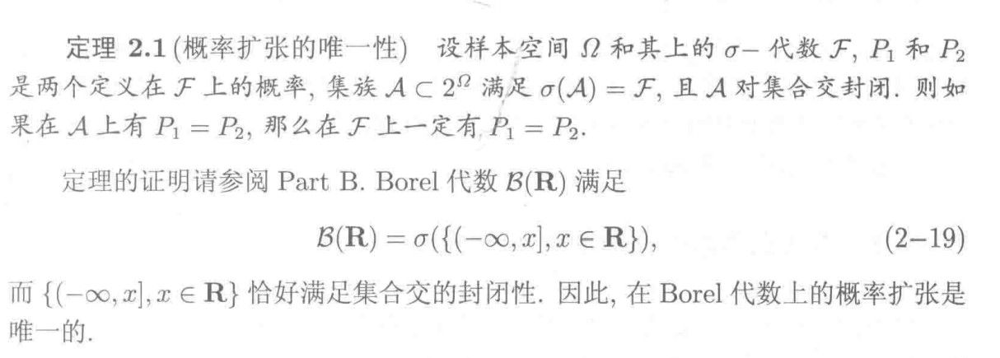
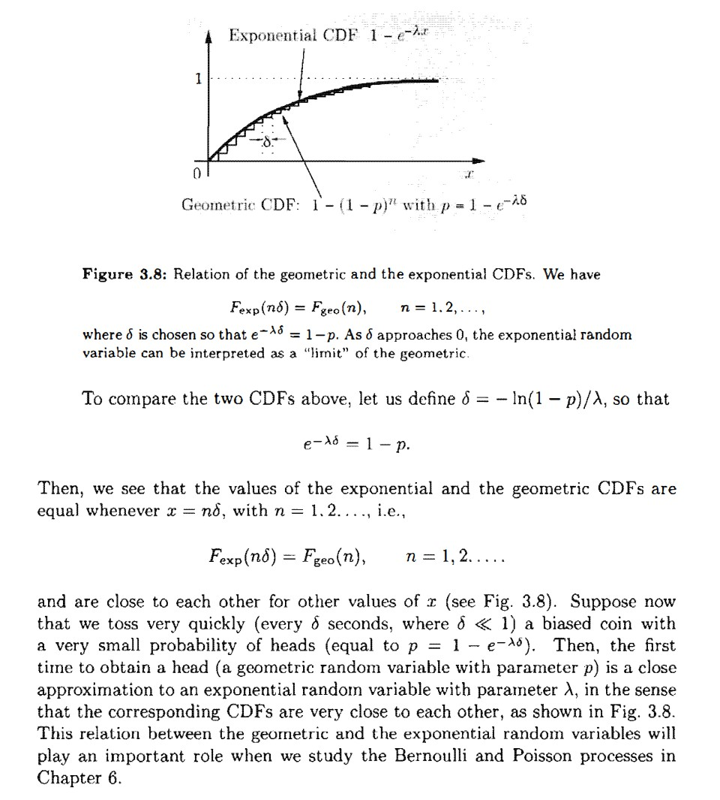

## Introduction

## Probability Space

Probability space is a triple $(\Omega, \mathcal{F}, \mathbf{P})$, comprised of the following three
elements:

1 Sample space $\Omega$: the set of all possible outcomes of an experiment

2 $\sigma$-algebra (or $\sigma$-field) $\mathcal F$: a collection of subsets of $\Omega$

3 Probability measure $\mathbf P$: a function that assigns a nonnegative
probability to every set in the $\sigma$-algebra $\mathcal F$

### Sample space
Mutually exclusive: no identical element.

Collectively exhaustive: all results should be included.

### $\sigma$-algegra

not unique

3 requirements:

$$
\varnothing \in \mathcal F\\
\forall A \in \mathcal F, A^c \in \mathcal F\\
\forall A_k \in \mathcal F, k=1, 2, ..., 
\cup_{k=1}^{\infty}A_k\in \mathcal F
$$

### Borel field

used to measure intervals

when $\Omega$ is continuous($\R$ for example), Borel field is useful.

"minimum" $\sigma$-algebra means deleting any element in the $\mathcal B (\mathbf R)$ will miss the requirements.

### Uncountable

decimal numbers between 0 and 1 are uncountable.

### Probability measures

$$
P:\mathcal F \rightarrow [0, 1]
$$

**Nonnegativity** $P(A)\ge0, \forall A \in \mathcal{  F}$

**Normalization**  $P(\empty)=0, P(\Omega)=1$

**Countable additivity** $A_1, A_2, ... \text { is disjoint in }\mathcal F, P(A_1\cup A_2\cup ...)=P(A_1)+P(A_2)+...$

* They are the axioms of probability. 
* Probability is a mapping from $\sigma$-algebra to a real number betwenn 0 and 1, which intuitively specifies the "likelihood" of any event. 
* There exist non-measurable sets, on which we cannot define a probability measure.

### Discrete models

$$
P(\{s_1, ..., s_n\})=P(s_1)+...+P(s_n)\\
P(A) = \frac{\text{\# of elements of }A}{\text{total \# of elements of sample points}}
$$

### Continuous Models

Probability = Area

### Some properties of Probability measure

$$
A\sub B\Rightarrow P(A)\le P(B)\\
P(A\cup B)=P(A)+P(B)-P(A\cap B)\\
P(A\cup B) \le P(A) + P(B)\\
P(A\cup B \cup C)=P(A) + P(A^C\cap B) + P(A^C\cap B^C\cap C)
$$

### Conditional Probability

$$
P(A|B)=\frac{P(A\cap B)}{P(B)}
$$

* If $P(B)=0$, $P(A|B)$ is undefined.
* For a fixed event $B$, $P(A|B)$ can be verified as a legitimate probability measure on the new universe. $P(A, B)\ge 0$, $P(\Omega|B)=1$, $P(A_1\cup A_2\cup...|B)=P(A_1|B)+P(A_2|B)+...$
* 
$P(A|B)=\frac{\text{ \# of elements of }A\cap B}{\text{total \# of elements of }B}$

### Total probability theorem

Let $A_1, ..., A_n$ be disjoint events that form a partition of the sample space and assume that $P(A_i)>0$ for all $i$. Then for any event B, we have

$$
P(B) = \sum_{i=1}^n P(A_i\cap B) = \sum_{i=1}^nP(A_i)P(B|A_i)
$$

**Remark** 
* The definition of partition is that $\cup_{i=1}^n A_i = \Omega, A_i\cap A_j = \emptyset, \forall i\ne j$
* The probability of B is a weighted average of its conditional probability under each scenario
* Each scenario is weighted according to its prior probability
* Useful when $P(B|A_i)$ is known or easy to derive

### Inference and Bayes' rule

Let $A_1, ..., A_2$ be disjoint events that from a partition of the sample space and assume that $P(A_i) \gt 0$  for all $i$. Then for any event $B$ such that $P(B)\gt 0$, we have 

$$
P(A_i|B) = \frac{P(A_i)P(B|A_i)}{P(B)} = \frac{P(A_i)P(B|A_i)}{\sum_{j=1}^nP(A_j)P(B|A_j)}
$$

**Remarks**
* Relates conditional probabilities of the form $P(A_i|B)$ with conditional probabilities of the form $P(B|A_i)$
* often used in inference: effect $B$ $\lrarr$ cause $A_i$

The meaning of $P(A_i|B)$ in the view of Bayes: the belief of $A_i$ is revised if we observed effect $B$. If the cause and the effect are closely binded($P(B|A_i) > P(B|A_i^c)$), then the belief $A_i$ is enhanced by the observation of effect $B$($P(A_i|B) > P(A)$). This can be derived from the Bayes' rule through simple calculation. If $P(A_i|B)=P(A_i)$, then $B$ provides no information on $A_i$.

### Independence

#### Independence of two disjoint events

Events A and B are called **independent** if 
$$
P(A\cap B) = P(A)\cdot P(B)
$$
or equivalently, when $P(B) > 0$, 

$$
P(A|B) = P(A)
$$

**Remarks**
* Occurrence of B provides no information about A's occurrence
* Equivalence due to $P(A\cap B) = P(B)\cdot P(A|B)$
* Symmetric with respect to $A$ and $B$.
* - applies even if $P(B) = 0$
* - implies $P(B|A) = P(B)$ and $P(A|B^c) = P(A)$
* Does not imply that A and B are disjoint, indeed opposite!
* - Two disjoint events are never independent!($P(A\cap B) = 0$, but $P(A)\cdot P(B)\ne 0$)

#### Conditional independence

$$
P(A\cap B | C) = P(A| C) \cdot P(B|C)
$$

**Definition**

Event $A_1, A_2, ..., A_n$ are called independent if: 

$$
P(A_i\cap A_j\cap ...\cap A_q) = P(A_1)P(A_j)...P(A_q)
$$

for any distinct indices $i, j, \dots q$ chosen from $\{1, \dots n\}$.

Pairwise is independence does not imply independence.

## Discrete Random Variables

Random Variable is neither random, nor variable.

### Definition

We care about the probability that $X \le x$ instead $X = x$ in the consideration of generality. 

**Random variables**

Given a probability space $(\Omega, F, P)$, a random variable is a function $X: \Omega \rightarrow \R$ with the probability that $\{\omega \in \Omega: X(\omega) \le x\} \in \mathcal F$ for each $x\in \R$. Such a function $X$ is said to be $\mathcal F$-measurable.

**Probability Mass Function(PMF)**

$$
p_X(x)=P(X=x)=P(\{\omega \in \Omega \text{ s.t. } X(\omega)=x\})
$$

Bonulli PMF: 

$$ 
p_X(k) = \begin{cases}
    p, &\text{if } k = 1\\
    1-p, &\text{if }k=0
\end{cases}
$$

Binomial PMF: $p_X(k)=\binom{n}{k}p^k(1-p)^{n-k}$

Geometric PMF: $p_X(k)=(1-p)^{k-1}p$

Poisson PMF: $p_X(k)=e^{-\lambda}\frac{\lambda^k}{k!}$. Note: $\sum_{k=0}^\infty e^{-\lambda}\frac{\lambda^k}{k!}=e^{-\lambda}e^\lambda=1$

If $y=g(x)$, $p_Y(y)=\sum_{\lbrace x|g(x)=y \rbrace} p(x)$.

### Expectation and Variance

**Expectation**

$$
E[X] = \sum_x xp_X(x)
$$

Note: we assume that the sum converges.

Properties:

$$
E[Y]=\sum_x g(x)p_X(x)\\
E[\alpha X + \beta] = \alpha E[X] + \beta
$$

**Variance**

$$
\text{var}(X) = E \left[(X-E[X])^2\right]=\sum_x (x-E[X])^2 p_X(x)
$$

Standard deviation: $\sigma_X=\sqrt{\text{var}(X)}$

Properties: 

$$
\text{var}(X) = E[X^2] -(E[X])^2\\
\text{var}(X)\ge 0\\
\text{var}(\alpha X + \beta) = \alpha^2\text{var} (X)
$$

**Bernoulli RV**

$$
p_X(k) = \begin{cases}
    p, &\text{if } k = 1\\
    1-p, &\text{if }k=0
\end{cases}\\
E[X] = p\\
E[X^2] = p\\
\text{var}(X) = p(1-p)
$$

**Discrete Uniform RV**

$$
p_X(k) = \begin{cases}
    \frac {1}{b-a+1}, &\text{if } k = a, a+1, ..., b\\
    0, &\text{otherwise}
\end{cases}\\
E[X] = \frac{a+b}{2}\\
\text{var}(X) = \frac{(b-a)(b-a+2)}{12}
$$

**Poisson RV**

$$
p_X(k)=e^{-\lambda}\frac{\lambda^k}{k!}\\
E[X] = \lambda\\
\text{var}(X)=\lambda
$$

### Conditional

$$
p_{X|A(x)} = P(X=x|A) = \frac{P(\{X=x\}\cap A)}{P(A)}
$$

$$
\sum_x p_{X|A}(x) = 1
$$

$$
E[X|Y=y] = \sum_x xp_{X|Y}(x|y)\\
E[g(X)|Y=y] = \sum_x g(x)p_{X|Y}(x|y)
$$

**Total expectation theorem**

$A_1, \dots, A_n$ is a partition of sample space

$$
P(B) = P(A_1)P(B|A_1) + \dotsb + P(A_n)P(B|A_n)\\
p_X(x) = P(A_1)p_{X|A_1}(x) + \dotsb + P(A_n)p_{X|A_n}(x)\\
E[X] = P(A_1)E[X|A_1] + \dotsb + P(A_n)E[X|A_n]
$$

We derive the expectation and variance use the theories above.

**Geometric PMF example**

$$
p_X(k) = (1-p)^{k-1}p, k = 1, 2, \dots\\
E[X] = \sum_{k=1}^\infty kp_X(k) = \sum_{k=1}^\infty k(1-p)^{k-1}p\\
E[X^2] = \sum_{k=1}^\infty k^2p_X(k) = \sum_{k=1}^\infty k^2(1-p)^{k-1}p\\
\text {var}(X) = E[X^2] - (E[X])^2
$$

However, the Geometric has a memoryless property.

$$
p_{X|X>1}(k) = \frac{P(\{X>1\}\cap \{X=k\})}{P(X>1)} = \frac{(1-p)^{k-1}p}{1-p} = (1-p)^{k-2}p
$$

Thus, 
$$
E[X] = P(X=1)E[X|X=1] + P(X>1)E[X|X>1]=p+(1-p)(E[1 + X])\\
\Rightarrow E[X] = 1/p\\
E[X^2] = P(X=1)E[X^2|X=1] + P(X>1)E[X^2|X>1] = p + (1-p)E[(1+X)^2]=p + (1-p)(1+2E[X]+E[X^2])\\
\Rightarrow E[X^2] = \frac{2-p}{p^2}\\
\Rightarrow\text{var} (X) = \frac{1-p}{p^2}
$$

### Multiple discrete random variables

**Joint PMFs**

$$
p_{X, Y}(x, y) = P(X = x, Y= y) = P(\{X(\omega) = x\}\cap \{Y(\omega) = y\})
$$

$$
\sum_x\sum_y p_{X, Y}(x, y) = 1
$$

**Marginal PMF**

$$
p_X(x) = \sum_y P(X=x, Y=y) = \sum_y p_{X, Y}(x, y)
$$

**Conditional PMF**

$$
p_{X|Y}(x|y) = P(X = x | Y = y) = \frac{p_{X, Y}(x, y)}{p_Y(y)}
$$

$$
\sum_x p_{X|Y}(x|y) = 1
$$

**Funcitons of multiple RVs**

$$
Z = g(X, Y)\\
p_Z(z) = \sum_{\lbrace (x, y)|g(x, y)=z \rbrace  } p_{X, Y}(x, y)
$$

**Expectations**

$$
E[g(X, Y)] = \sum_x\sum_y g(x, y)p(X, Y)(x, y)\\
E[g(X, Y, Z)] = \sum_x\sum_y\sum_z g(x, y, z)p(X, Y, Z)(x, y, z)
$$

$$
E[g(X,  Y)] \not\equiv g(E[X], E[Y])
$$

**linearity**

$$
E[\alpha X + \beta] = \alpha E[X] + \beta\\
E[X + Y + Z] = E[X] + E[Y] + E[Z]
$$

Let's calculate the Mean of Binominal RV.

$$
X_i=
\begin{cases}
    1, &\text{if success in trial } i,\\
    0, & \text{otherwise.}
\end{cases}\\
X = X_1 + X_2 + \dotsb X_n\\
E[X] = \sum_{i = 1}^n E[X_i] = np\\
\text{var}(X) = np(1-p)
$$

### Independence

**Independence**

$$
p_{X, Y}(x, y) = p_X(x) \cdot p_Y(y)
$$

if $X$ and $Y$ are independent:

$$
E[XY] = E[X]E[Y]\\
E[g(X)h(Y)] = E[g(X)]E[h(Y)]\\
\text{var}(X + Y) = \text{var}(X) + \text{var}(Y)
$$

**Conditional independence**

$$
p_{X, Y|A}(X, Y) = p_{X|A}(x) \cdot p_{Y|A}(y)
$$

## Continuous Random Variables

### Probability Density Function

* $f_X(x)\ge 0\text{ for all }x$
* $\int_{-\infty}^\infty f_X(x)\mathrm dx = 1$
* If $\delta$ is very small, then $P([x, x+\delta])\approx f_X(x) \cdot \delta$
* For any subset $B$ of the real line, $P(X\in B) = \int_B f_X(x)\mathrm d x$.

**Expectation**

$$
E[X] = \int_{-\infty}^\infty xf_X(x)\mathrm dx\\
E[g(x)] = \int_{-\infty}^\infty g(x)f_X(x)\mathrm dx
$$

Assuming that the integration is well-defined. The Cauchy distribution ($\frac{1}{1+x^2}$)doesn't have expectation since $\frac{x}{1+x^2}$ is not absolutely integrably.

**Variance**

$$
\text{var}(X) = E[(X - E[X])^2] = \int_{-\infty}^\infty(x - E[x])^2 f_X(x)\mathrm dx\\
0\le \text{var}(x) = E[X^2] - (E[X])^2
$$

**Uniform RV**

$$
f_X(x) = \begin{cases}
    \frac{1}{b-a}, &\text{if }a\le x\le b,\\
    0, &\text{otherwise.}
\end{cases}
$$

$$
E[X] = \frac{a+b}{2}\\
E[X^2] = \frac{a^2+b^2 + ab}{3}\\
\text{var}(X) = \frac{(b-a)^2}{12}
$$

Properties:

$$
E[aX+b] = aE[X] + b\\
\text{var}(aX+b) = a^2\text{var}(X)
$$

### Common Example for PDF

**Exponential Random Variable**

$$
f_X(x) = \begin{cases}
    \lambda e^{-\lambda x}, &\text{if }x \ge 0,\\
    0, &\text{otherwise.}
\end{cases}
$$

$$
P(X\ge a) = e^{-\lambda a}\\
E[X] = \frac{1}{\lambda}\\
\text{var}(X) = \frac{1}{\lambda^2}
$$

### Cumulative Distribution Functions

$$
F_X(x) = P(X\le x) = \begin{cases}
    \sum_{k\le x}p_X(k), &\text{if } X \text{ is discrete,}\\
    \int_{-\infty}^x f_X(t)\mathrm dt, &\text{if } X \text{ is continuous.}
\end{cases}
$$

**Properties**

$$
\text{if } x \le y, \text{then } F_X(x)\le F_X(y).\\
F_X(x)\text{ tends to 0 as } x \rightarrow -\infty, \text{and to 1 as} x \rightarrow \infty\\
\text{If } X \text{ is discrete, then } F_X(x) \text{ is a piecewise constant function of }x.\\
\text{If } X \text{ is continuous, then } F_X(x) \text{is a continuous funciton of }x.\\
\text{If } X \text{ is discrete and takes integer values, the PMF and the CDF can be obtained from each other by summing or differcing: }\\
F_X(k) = \sum_{i = -\infty}^k p_X(i),\\
p_X(k) = P(X\le k) - P(X \le k -1) = F_X(k) - F_X(k - 1),\\
\text{ for all integers }k.\\
\text{If } X \text{ is continuous, the PDF and the CDF can be obtained from each other by integration or differentiation: }\\
F_X(x) = \int_{-\infty}^x f_X(t)\mathrm dt, f_X(x) = \frac{\mathrm dF_X}{\mathrm dx}(x)
$$

### Examples for CDF

**Geometric CDF**

$$
F_{\text{geo}}(n) = \sum_{k = 1}^n p(1-p)^{k-1} = 1-(1-p)^n, \text{for } n = 1, 2, \dots
$$

**Exponential CDF**

$$
F_{\text{exp}}(x) = P(X\le x) = 0, \text{ for } x\le0,\\
F_{\text{exp}}(x) = \int_{0}^x \lambda e^{-\lambda t}\mathrm dt = 1 - e^{-\lambda x}, \text{for }x\ge 0.
$$

Exponential Distribution is Memoriless, like Geometric: 

$$
P(X \ge c + x| X \ge c) = e^{-\lambda x} = P(X \ge x)\\
$$

The relationship: 

### Normal Random Variables

$$
f_X(x) = \frac{1}{\sqrt{2\pi}\sigma}e^{-(x-\mu)^2/2\sigma^2}\\
E[X] =\mu\\
\text{var}(X) = \sigma^2
$$

Gaussian is good, since adding two Gaussian functions resulting in a new Gaussian functions. And with a huge mount of samples, the distribution is close to Gaussian(Central limit theorem).

**The Standard Normal Random Variable**

Normal(Gaussian)

$$
Y = \frac{X - \mu}{\sigma}\\
f_Y(y) = \frac{1}{\sqrt{2\pi}}e^{-y^2/2}\\
E[Y] = 0\\
\text{var}(Y) = 1\\
$$

The CDF of Normal Random Variable $\Phi(y)$ can not be derived directly, we can use the standard normal table to get the value.

$$
\Phi(-y) = 1 - \Phi(y)
$$

### Multiple Continuous Random Variables

**Joint PDFs**

The two continuous RVs X and Y, with the same experiment, are jointly continuous if they can be described by a joint PDF $f_{X, Y}$, where $f_{X, Y}$ is a nonnegative function that satisfies 

$$
P((X, Y) \in B) = \iint_{(x, y)\in B} f(X, Y)\mathrm d x\mathrm dy
$$

for every subset B of the two-dimensional plane. In particular, when B is the form $B = \{(x, y)|a\le x \le b, c\le y \le d\}$, we have

$$
P(a\le X \le b, c \le Y \le d) = \int_c^d\int_a^bf_{X, Y}(x, y)\mathrm dx\mathrm dy
$$

**Normalization** 

$$
\int_{-\infty}^\infty\int_{-\infty}^\infty f_{X, Y}(x, y)\mathrm dx\mathrm dy = 1
$$

**Interpretation(Small rectangle)**

$$
P(a\le X \le a + \delta, c \le Y \le c + \delta) \approx f_{X, Y}(a, c)\cdot\delta^2
$$

**Marginal PDF**

$$
P(X\in A) = P(X \in A, Y \in (-\infty, \infty)) = \int_A \int_{-\infty}^\infty f_{X, Y}(x, y)\mathrm dy\mathrm dx
$$

$$
f_X(x) = \int_{-\infty}^\infty f_{X, Y}(x, y)\mathrm dy\\
f_Y(y) = \int_{-\infty}^\infty f_{X, Y}(x, y)\mathrm dx
$$

**Joint CDF**

If X and Y are two RVs asscociated with the same experiment, then the joint CDF of X and Y is the function

$$
F_{X, Y}(x, y) = P(X\le x, Y\le y) = P(X\le x|Y\le y)P(Y\le y) = \int_{-\infty}^y\int_{-\infty}^x f_{X, Y}(u, v)\mathrm du\mathrm dv
$$

Conversely

$$
f_{X, Y}(x, y) = \frac{\partial^2F_{X, Y}}{\partial x\partial y}(x, y)
$$

**Expectations**

$$
E[g(X, Y)] = \int_{-\infty}^\infty\int_{-\infty}^\infty g(x, y)f_{X, Y}(x, y)\mathrm dx\mathrm dy
$$

If g is linear, of the form of $g(x, y) = ax + by + c$, then

$$
E[g(X, Y)] = aE[X] + bE[Y] + c
$$

X and Y are called independent if 

$$
f_{X, Y}(x, y) = f_X(x)f_Y(y)
$$

### Conditional and Independence

**Conditional PDFs**

Let X and Y be continuous RVs with joint PDF $f_{X, Y}$. For any $f_Y(y) \gt 0$, the conditional PDF of X given Y = y is defined by

$$
f_{X|Y}(x|y) = \frac{f_{X, Y}(x, y)}{f_Y(y)}
$$

Discrete case: 

$$
p_{X|Y}(x|y) = \frac{p_{X, Y}(x, y)}{p_Y(y)}
$$

By analogy, for fixed y would like: 

$$
P(x \le X \le x + \delta|Y = y) \approx f_{X|Y}(x|y)\cdot\delta
$$

But {Y = y} is a zero-probability event.

Let $B = \{y\le Y \le y + \epsilon\}$, for small $\epsilon > 0$. Then

$$
P(x \le X \le x + \delta|Y \in B) \approx \frac{P(x \le X \le x + \delta)}{P(y \le Y \le y + \epsilon)} \approx \frac{f_{X, Y}(x, y)\cdot\epsilon\delta}{f_Y(y)\cdot\epsilon} \approx f_{X|Y}(x|y)\cdot\delta
$$

Limiting case when $\epsilon \rightarrow 0$, to define conditional PDF where the denominator is a zero-probability event.

**Conditional Expectation**

The conditional expectation of X given that A has happened is defined by 

$$
E[X|A] = \int_{-\infty}^\infty xf_{X|A}(x)\mathrm dx
$$

For a function g, we have

$$
E[g(X)|A] = \int_{-\infty}^\infty g(x)f_{X|A}(x)\mathrm dx
$$

**Total expectation theorem**

Le $A_1, A_2, \dots A_n$ be disjoint events that form a partition of the sample space $\Omega$. And $P(A_i)\gt 0$ for all $i$. Then

$$
E[g(X)] = \sum_{i=1}^n P(A_i)E[g(X)|A_i]
$$

Conditional Expectation

The conditional expectation of X given that $Y = y$ has happened is defined by 

$$
E[X|Y=y] = \int_{-\infty}^\infty xf_{X|Y}(x|y)\mathrm dx
$$

For a function g, we have

$$
E[g(X)|Y=y] = \int_{-\infty}^\infty g(x)f_{X|Y}(x|y)\mathrm dx
$$

Total expectation theorem

$$
E[X] = E_{Y}\left[E_{X|Y}[X|Y]\right] = \int_{-\infty}^\infty E[X|Y = y]f_Y(y)\mathrm dy
$$

**Independence**

Two continuous RVs $X$ and $Y$ are independent if and only if

$$
f_{X, Y}(x, y) = f_X(x)f_Y(y)
$$

Independence is the same as the condition

$$
f_{X|Y}(x|y) = f_X(x)
$$

If $X$ and $Y$ are independent, then

$$
E[XY] = E[X]E[Y]\\
E[g(x)h(y)] = E[g(x)]E[h(y)], \forall g, h\\
\text{var}(X + Y) = \text{var}(X) + \text{var}(Y)\\
$$

### The continuous Bayes's rule

$$
f_{X|Y}(x, y) = \frac{f_X(x)f_{Y|X}(y|x)}{f_Y(y)}
$$

Based on the normalization property $\int_{-\infty}^\infty f_{X|Y}(x|y)\mathrm dx = 1$,

$$
f_{Y|X}(y|x) = \frac{f_X(x)f_{Y|X}(y|x)}{\int_{-\infty}^\infty f_X(t)f_{Y|X}(y|t)\mathrm dt}
$$

## Derived distributions and Entropy

### Derived Distribution

If we want to calculate the expectation $E[g(X)]$, there's no need to calculate the PDF $f_X$ of $X$.

But sometimes we want the PDF $f_Y$ of $Y = g(X)$, where $Y$ is a new RV.

**Principal Method**

Two-step procedure for the calculation of the PDF of a function $Y=g(X)$ of a continuous RV $X$

1. Calcualte the CDF $F_Y$ of $Y$: $F_Y(y) = P(Y \le y)$
2. Differentiate $F_Y$ to obtain the PDF $f_Y$ of $Y$: $f_Y(y) = \frac{\mathrm d F_Y}{\mathrm d y}(y)$

**The PDF of $Y=aX + b$**

Suppose $a>0$ and $b$ are constants.

$$
f_Y(y) = \frac{\mathrm d F_Y}{\mathrm d y}(y) = \frac{\mathrm d}{\mathrm d y} F_X(\frac{y-b}{a}) = \frac{1}{a}f_X(\frac{y-b}{a})
$$

If $X$ is Normal, then $Y = aX + b$ is also Normal.

Suppose X is normal with mean $\mu$ and variance $\sigma^2$. Then

$$
f_Y(y) = \frac{1}{a\sqrt{2\pi\sigma^2}}\exp\left(-\frac{(y-b-a\mu)^2}{2a^2\sigma^2}\right)
$$

$$
Y = aX + b \sim N(a\mu + b, a^2\sigma^2)
$$

**The PDF of a strictly monotonic function**

Suppose $g$ is a strictly monotonic function and that for some function $h$ and all $x$ in the range of $X$ we have 

$$
y = g(x) \text{ if and only if } x = h(y)
$$

Assume that $h$ is differentiable.

Then the PDF of $Y = g(X)$ is given by

$$
f_Y(y) = \frac{\mathrm d F_Y}{\mathrm d y}(y) = \frac{\mathrm d}{\mathrm d y} F_X(h(y)) = f_X(h(y))\left|\frac{\mathrm d h}{\mathrm d y}(y)\right|
$$

### Entropy
**Defintion**

Discrete case

Let $X$ be a discrete RV defined on probability space $(\Omega, \mathcal F, P)$. The **entropy** of $X$ is defined by

$$
H(X) = -E[\ln p_X(X)] = -\sum_{k} p_X(x_k)\ln p_X(x_k)
$$

Continuous case

Let $X$ be a continuous RV defined on probability space $(\Omega, \mathcal F, P)$. The **differential entropy** of $X$ is defined by

$$
H(X) = -E[\ln f_X(X)] = -\int_{-\infty}^\infty f_X(x)\ln f_X(x)\mathrm dx
$$

**Remarks**

* a special expectation of a random variable
* a measure of uncertainty in a random experiment
* - the larger the entropy, the more uncertain the experiment
* - For a deterministic event, the entropy is zero
* The base of logarithm can be different. Changing the base od the logarithm is equivalent to multiplying the entropy by a constant.
* - With base 2, we say that the entropy is in units of **bits**
* - With base e, we say that the entropy is in units of **nats**
* The basis of information theory

### Maximum entropy distributions

• Maximum entropy distributions

− Distributions with maximum entropy under some constraints

− Gaussian, exponential, and uniform distributions are all maximum entropy distributions under certain conditions

• Why studying maximum entropy distributions?

− The most random distribution, reflecting the maximum uncertainty about the quantity of interest

**Definition**

**Discrete Case**

X can be a finite number of values $x_1, x_2, \dots, x_n$, satisfying $p_X(x_k) = p_k.$

We have the following optimization problem:

$$
\max_{X} H(X) = \max_{p_1, p_2, \dots, p_n} \left(-\sum_{k=1}^n p_k\ln p_k\right)\\
\text{s.t.} \sum_{k=1}^n p_k = 1, p_k \ge 0 \text{ for } k = 1, 2, \dots, n
$$

**Solution**

Applying the Lagrange multiplier method, we have

$$
L(p_1, p_2, \dots, p_n;\lambda) = -\sum_{k=1}^n p_k\ln p_k + \lambda\left(\sum_{k=1}^n p_k - 1\right)\\
\frac{\partial L}{\partial p_k} = -\ln p_k - 1 + \lambda = 0\\
\Rightarrow p_k = e^{\lambda - 1}\\
$$

Note that the above is true for all $k$. So we have

$$
p_k = e^{\lambda - 1}  = \frac1{n}\text{ for } k = 1, 2, \dots, n.
$$

**Continuous Case 1**

$X \in [-\infty, \infty]$.

Constrain on mean and variance,
we have the following optimization problem:

$$
\max_{X}h(X), \\
\text{s.t. }E[X] = \mu, \quad Var(X) = \sigma^2
$$

In detail, 

$$
\max_{X} H(X) = \max_{\mu, \sigma^2} \left(-\int_{-\infty}^\infty f_X(x)\ln f_X(x)\mathrm dx\right)\\
\text{s.t. }\int_{-\infty}^\infty f(x)\mathrm dx = 1, \quad \int_{-\infty}^\infty xf(x)\mathrm dx = \mu, \quad \int_{-\infty}^\infty x^2f(x)\mathrm dx = \sigma^2 + \mu^2
$$

Solving the above problem, we have Gaussian distribution with mean $\mu$ and variance $\sigma^2$.

$$
f(x) = \frac{1}{\sqrt{2\pi\sigma^2}}\exp\left(-\frac{(x-\mu)^2}{2\sigma^2}\right)
$$

**Solution**

For all measurable functions $g$, we have

$$
G(t) = h(f + tg) = -\int_{\infty}^\infty (f(x) + tg(x))\ln (f(x) + tg(x))\mathrm dx
$$

Therefore,

$$
h(f_{opt})\ge h(f_{opt} + tg)\\
\Rightarrow G(0)\ge G(t), \forall t \in \R
$$

$G(t)$ reaches its maximum at $t = 0$.

Then apply the Lagrange multiplier method, we have

$$
\overline{G}(t) = G(t) + c_0h_0(t) + c_1h_1(t) + c_2h_2(t)\\
$$

Get the derivative of $\overline{G}(t)$ with regard to $t$, and let the derivative equal to zero.

**Continuous Case 2**

$X \in [0, \infty)$.

Constrain on mean only, we have the following optimization problem:

$$
\max_{X}h(X), \\
\text{s.t. }E[X] = \mu
$$

In detail,

$$
\max_{X} H(X) = \max_{\mu} \left(-\int_{0}^\infty f_X(x)\ln f_X(x)\mathrm dx\right)\\
\text{s.t. }\int_{0}^\infty f(x)\mathrm dx = 1, \quad \int_{0}^\infty xf(x)\mathrm dx = \mu
$$

Solving the above problem, we have exponential distribution with parameter $\lambda$.

$$
f(x) = \lambda e^{-\lambda x}, x \in [0, \infty)
$$

**Continuous Case 3**

$X \in [a, b]$.

No constrain, we have the unconstrained optimization problem:

$$
\max_{X}h(X)
$$

In detail,

$$
\max_{X} H(X) = \max_{a, b} \left(-\int_{a}^b f_X(x)\ln f_X(x)\mathrm dx\right)\\
\text{s.t. }\int_{a}^b f(x)\mathrm dx = 1
$$

Solving the above problem, we have uniform distribution within $[a, b]$.

$$
f(x) = \frac{1}{b-a}, x \in [a, b]
$$

## Convolution, covariance, correlation, and conditional expectation

### Convolution

**Discrete case**

$$
\begin{align*}
p_W(w) &= P(X+Y=w)\\
&= \sum_{x}P(X=x, Y=w-x)\\
&= \sum_{x}P(X=x)P(Y=w-x)\\
&= \sum_{x}p_X(x)p_Y(w-x)\\
\end{align*}
$$

PMF $p_W$ is the convolution of PMFs $p_X$ and $p_Y$.

**The distribution of $X+Y$**

Mechanics:
- Put the PMF's on top of each other
- Flip the PMF of $Y$
- Shift the flipped PMF by $w$ (to the right if $w>0$)
- Cross-multiply and add

**Continuous Case**

$$
\begin{align*}
&W = X+Y, X, Y \text{ are independent}\\
&P(W\le w|X=x) = P(Y\le w-x)\\
&f_{W|X}(w|x) = f_Y(w-x)\\
&f_{W, X}(w, x) = f_X(x)f_Y(w-x)\\
&f_W(w) = \int_{-\infty}^\infty f_X(x)f_Y(w-x)\mathrm dx\\
\end{align*}
$$

**Sum of 2 independent normal RVs**

$$
\begin{align*}
    & X\sim N(\mu_1, \sigma_1^2), Y\sim N(\mu_2, \sigma_2^2)\\
    &f_{X,Y}(x, y) = \frac{1}{2\pi \sigma_x\sigma_y}\text{exp}\left\lbrace-\frac{(x-\mu_x)^2}{2\sigma_x^2} - \frac{(y-\mu_y)^2}{2\sigma_y^2}\right\rbrace
\end{align*}
$$

which is constant on the ellipse(circle if $\sigma_x = \sigma_y$).

$$
\begin{align*}
    X\sim N(0, \sigma_x), &Y\sim N(0, \sigma_y)\\
    W &= X+Y\\
    f_W(w) &= \int_{-\infty}^\infty f_{X,Y}(x, w-x)\mathrm dx\\
    &= \int_{-\infty}^\infty \frac{1}{2\pi \sigma_x\sigma_y}\text{exp}\left\lbrace-\frac{x^2}{2\sigma_x^2} - \frac{(w-x)^2}{2\sigma_y^2}\right\rbrace\mathrm dx\\
    =ce^{-\gamma \omega^2}
\end{align*}
$$

$W$ is Normal.

Mean = 0, Variance = $\sigma_x^2 + \sigma_y^2$

Same argument for nonzero mean case.

**The difference of two independent RVs**

$X$ and $Y$  are independent exponential RVs with parameter $\lambda$.

Fix some $z\ge 0$ and note that $f_Y(x-z)$ is non zero when $x\ge z$.

$$
\begin{align*}
    Z &= X - Y\\
    f_Z(z) &= \int_{-\infty}^\infty f_X(x)f_{-Y}(z - x)\mathrm dx\\
    &= \int_{-\infty}^\infty f_X(x)f_{Y}(x - z)\mathrm dx\\
    &= \int_{z}^\infty \lambda e^{-\lambda x}\lambda e^{-\lambda(x-z)}\mathrm dx\\
    &= \frac{\lambda}{2}e^{-\lambda z}
\end{align*}
$$

The answer for the case $z\le 0$

$$
f_{X-Y}(z) = f_{Y-X}(z) = f_Z(-z)
$$

The first quality holds by symmetry.

### Covariance and Correlation

**Definition**

The covariance of two RVs $X$ and $Y$, denoted by $\text{cov}(X, Y)$, is defined by

$$
\text{cov}(X, Y) = E\left[(X - E[X])(Y - E[Y])\right]
$$

or, 

$$
\text{cov}(X, Y) = E[XY] - E[X]E[Y]
$$

$X$ and $Y$ are **uncorrelated** if $\text{cov}(X, Y) = 0$.

**Zero mean case** $\text{cov}(X, Y) = E[XY]$

**Properties**

$$
\text{cov}(X, Y) = \text{var}(X, Y)\\
\text{cov}(X, aY+b) = a\cdot\text{cov}(X, Y)\\
\text{cov}(X, Y+Z) = \text{cov}(X, Y) + \text{cov}(X, Z)\\
\text{independent} \Rightarrow \text{cov}(X, Y) = 0(\text{converse is not true})
$$

**Variance of the sum of RVs**

$$
\text{var}\left(\sum_{i = 1}^nX_i\right) = \sum_{i = 1}^n\text{var}(X_i) + \sum_{\lbrace(i, j)|i\ne j\rbrace}\text{cov}(X_i, X_j)
$$

In particular, 

$$
\text{var}(X_1 + X_2) = \text{var}(X_1) + \text{var}(X_2) + 2\text{cov}(X_1, X_2)
$$

**Correlation coefficient**

The correlation coefficient $\rho(X, Y)$ of two RVs $X$ and $Y$ that have nonzero variance is defined as

$$
\begin{align*}
\rho &= E\left[\frac{(X - E[X])}{\sigma_X} \cdot \frac{(Y - E[Y])}{\sigma_Y}\right]\\
&= \frac{\text{cov}(X, Y)}{\sigma_X\sigma_Y}
\end{align*}
$$

* $-1 \le \rho \le 1$
* $|\rho| = 1 \Leftrightarrow (X-E[X]) = c(Y-E[Y])$
* Independent $\Rightarrow \rho = 0(\text{converse is not true})$

**Conditional expected value**

$$
E[X|Y = y] = \sum_x p_{X|Y}(x|y)
$$

### Conditional expectation

**Definition**

$$
E[X|Y = y] = \begin{cases}
    \sum_x xp_{X|Y}(x|y), & X \text{discrete},\\
    \int_{-\infty}^\infty xf_{X|Y}(x|y)\mathrm dx, & X \text{continuous}.
\end{cases}
$$

$E[X|Y=y]$ is a function of $y$.

$$
E[X|Y = y] = \frac{y}{2}(\text{number})\\
E[X|Y] = \frac{Y}{2}(\text{RV})
$$

**Law of iterated expectations**

$$
E[X] = E[E[X|Y]] = \begin{cases}
    \sum_y E[X | Y = y]p_Y(y), & Y \text{discrete},\\
    \int_{-\infty}^\infty E[X|Y = y]f_Y(y)\mathrm dy, & Y \text{continuous}.
\end{cases}
$$

### Conditional expectation as an estimator

Denote the conditional expectation

$$
\hat{X} = E[X|Y]
$$

as an estimator of $X$ given $Y$, and the estimation error

$$
\tilde{X} = X - \hat{X}
$$

is a RV.

**Properties of the estimator**: 

**Unbiased**

For **any** possible $Y=y$:

$$
E[\tilde{X}|Y] = E[X - \hat{X} | Y] = E[X | Y] - E[\hat{X}|Y] = \hat{X} - \hat{X} = 0
$$

By the law of iterated expectations

$$
E[\tilde{X}] = E[E[\tilde{X}|Y]] = 0
$$

**Uncorrelated**

$$
E[\hat{X}\tilde{X}] = E[E[\hat{X}\tilde{X}|Y]] = E[\hat{X}E[\tilde{X}|Y]] = 0
$$

$$
\text{cov}(\hat{X}, \tilde{X}) = E[\hat{X}\tilde{X}] - E[\hat{X}]E[\tilde{X}] = 0
$$

Since $X = \hat{X} + \tilde{X}$, the variance of X can be decomposed as

$$
\text{var}(X) = \text{var}(\hat{X}) + \text{var}(\tilde{X})
$$

$$
\text{var}(\tilde{X}) = \text{var}(E[X|Y])
$$

Conditional variance

$$
\text{var}(X|Y) = E[(X - E[X|Y])^2|Y] = E[\tilde{X}^2|Y]
$$

here comes the law of total variance:

$$
\text{var}(X) = \text{var}(E[X|Y]) + E[\text{var}(X|Y)] 
$$

The total variability is avarage variability within sections + variability between sections.

**Law of iterated expectations**

$$
E[X] = E[E[X|Y]] = \sum_y E[X|Y = y]p_Y(y)
$$

**Conditional variance**

$$
\text{var}(X|Y) = E[(X - E[X|Y])^2|Y] = E[\tilde{X}^2|Y]
$$

**Law of total variance**

$$
\text{var}(X) = \text{var}(E[X|Y]) + E[\text{var}(X|Y)] 
$$

## Transforms and sum of a random number of random variables

The transform associated with a RV $X$ is a function $M_X(s)$ of a scalar parameter $s$, defined by

$$
M_X(s) = E[e^{sX}] = \begin{cases}
    \sum_x e^{sx}p_X(x), & X \text{discrete},\\
    \int_{-\infty}^\infty e^{sx}f_X(x)\mathrm dx, & X \text{continuous}.
\end{cases}
$$

**Remarks**
- a function of $s$, rather than a number
- not necessarily defined for all (complex) s
- always well defined for $\Re(s)=0$
- compared with Laplace transform

**Sanity Checks**

$$
M_X(0) = 1\\
|M_X(s)| \le 1 \text{ for } \Re(s) = 0
$$

**Linear operation**
$$
M_{aX + b}(s) = e^{bs}M_X(as)\\
M_{X + Y}(s) = M_X(s)M_Y(s) (\text{if X, Y independent})
$$

**Expected Values**

$$
E[X^n] = \frac{\partial^n M_X(s)}{\partial s^n}\bigg|_{s=0}
$$

$$
P(X = c) = \lim_{N\rightarrow \infty}\frac 1N\sum_{k = 1}^N M_X(jk)e^{-jkc}
$$

since

$$
\lim_{N\rightarrow \infty}\frac 1N\sum_{k = 1}^N M_X(jk)e^{-jkc} = \sum_{x = 1}^\infty p_X(x)\lim_{N\rightarrow \infty}\frac 1N\sum_{k = 1}^N e^{-jc(k - x)} = \sum_{x = 1}^\infty p_X(x)\lim_{N\rightarrow \infty}\frac{1}{N} \frac{e^{j(x-c)} - e^{Nj(x - c)}}{1-e^{j(x-c)}} = p_X(c)
$$

**Example**

$X$ is a Poisson RV with parameter $\lambda$

$$
p_X(x) = \frac{\lambda^x}{x!}e^{-\lambda}
$$

$$
M(s) = \sum_{x = 0}^\infty e^{sx}\frac{\lambda^x}{x!}e^{-\lambda} = e^{-\lambda}\sum_{x = 0}^\infty \frac{(e^s\lambda)^x}{x!} = e^{-\lambda}e^{e^s\lambda} = e^{\lambda(e^s - 1)}
$$

$X$ is an exponential RV with parameter $\lambda$

$$
f_X(x) = \lambda e^{-\lambda x}
$$

$$
M(s) = \int_0^\infty e^{sx}\lambda e^{-\lambda x}\mathrm dx = \frac{\lambda}{\lambda - s}
$$

$Y$ is a standard normal RV, 

$$
M_Y(s) = \int_{-\infty}^\infty \frac{1}{\sqrt{2\pi}}e^{-(y^2/2)}e^{sy}\mathrm dy = e^{s^2/2}
$$

Consider $X = \sigma Y + \mu$

$$
M_X(s) = e^{s^2\sigma^2/2 + \mu s}
$$