## 综述

Personal LLM Agents: Insights and Survey about the Capability, Efficiency and Security

## 数据集

VideoGUI: A Benchmark for GUI Automation from Instructional Videos，把 GUI 能力划分为三层：High Level 表示高层次的操作意图。Middle Level 为用自然语言描述的单步操作，Atomic-action 为使用固定格式描述的准确操作。整个 pipeline 都是人标的，包括视频挑选，标注，验证，task 数量较少，86 个 full task，463 个 subtask。

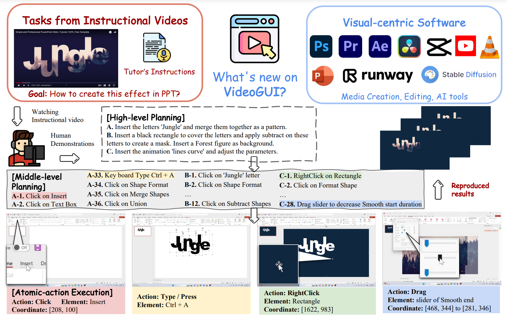

GUI-WORLD: A Dataset for GUI-oriented Multimodal LLM-based Agents，从 Youtube 上爬取视频数据+人类录频操作数据，提取关键帧，以及 QA 文本。关键帧的标注由人类完成，包括：执行的操作， 关键帧转移的目标，使用的软件或者网站，鼠标操作，键盘输入等。迷惑的是为什么人类操作还要录屏，既然最后是提取关键帧，那可以直接在人操作的时候提取关键帧？

谷歌： Onthe Effects of Data Scale on Computer Control Agents，在安卓场景下人标gui sft数据，有测试集

谷歌：Android in the Wild: A Large-Scale Dataset for Android Device Control

输入为 image 和 text instruction。包含 30 K 的数据，Google Apps 的占比最大。

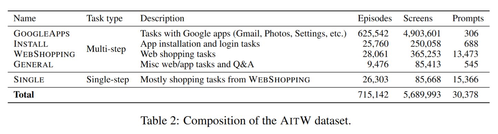

World of Bits (WoB): Use only keyboard & mouse，输入为彩色图像，DOM 文档，请求。支持通过众包构造新的数据。

OpenAI Universe: Game, Web tasks，输入数据只有图像，操作键盘和鼠标。

AndroidEnv: A Reinforcement Learning Platform for Android: 在 android emulator 上运行的虚拟环境。

（MoTIF）A Dataset for Interactive Vision-Language Navigation with Unknown Command Feasibility：人类标注，有 feasible 字段。

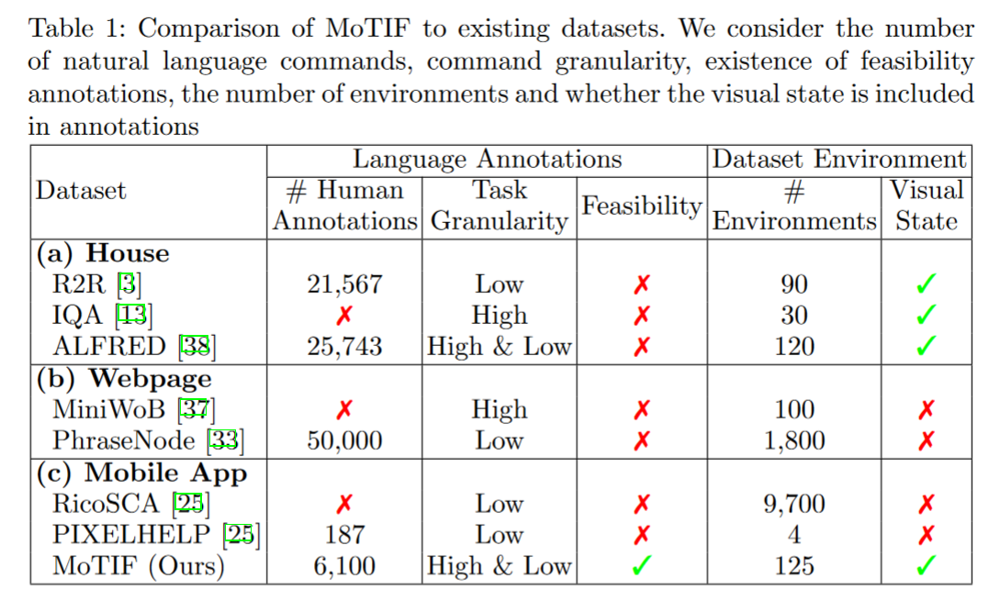

PIXELHELP: Mapping Natural Language Instructions to Mobile UI Action Sequences

## 模型

### RL-based method

中间步骤奖励非常重要。稀疏奖励下从0训练容易停滞不前，需要先行为克隆提升一定的性能，再执行 RL 算法。

泛化性差，不像 LLM 具有大量先验知识。

App-Buddy:  PPO based method, Interact with DOM.

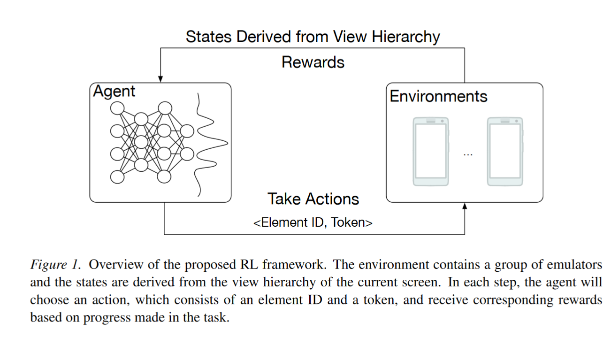

REINFORCEMENT LEARNING ON WEB INTERFACES USING WORKFLOW-GUIDED EXPLORATION： 稀疏奖励下从0训练容易停滞不前，需要先行为克隆提升一定的性能，再执行 RL 算法。但是 BC 方法容易过拟合，因此通过从示例中导出 workflow policy，再从 workflow policy 中采样新的 policy 的方法来获取新的 trace。

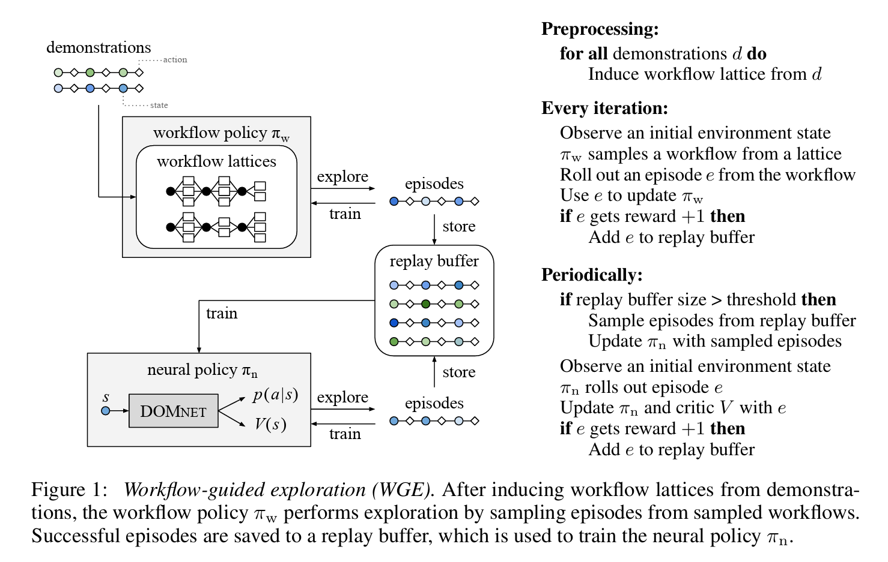

### LLM Agents

#### Prompt Engineering

AutoDroid: LLM-powered Task Automation in Android (MobiCom 24)

Exploration + Execution 范式，基于 VH/DOM 的 UI 表示。

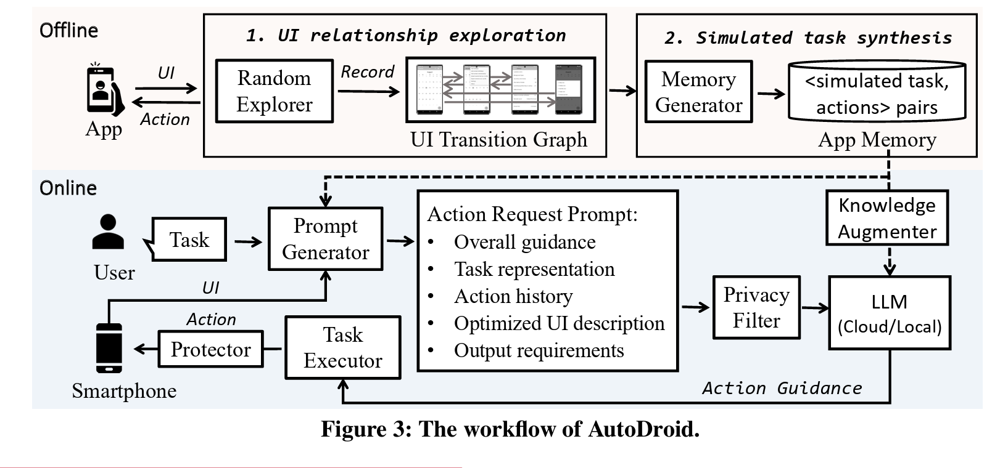

GPT4 成功率相当可观，finetune小模型的效果接近 GPT 3.5：

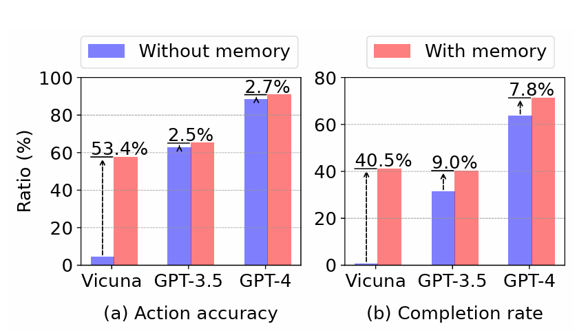

离线部分：随机探索 + 生成 App Memory，对 UTG(UI Transition Graph) 进行分析，LLM 生成每个页面和每个 UI 元素的描述，并构建 embedding vector base。

在线部分：根据 embedding vector base 筛选 UI 元素，只留下那些重要的 UI 元素，并且利用 APP Memory 中的元素生成 Guide 辅助模型进行决策。

Responsible Task Automation: Empowering Large Language Models as Responsible Task Automators

DroidBot-GPT: GPT-powered UI Automation for Android

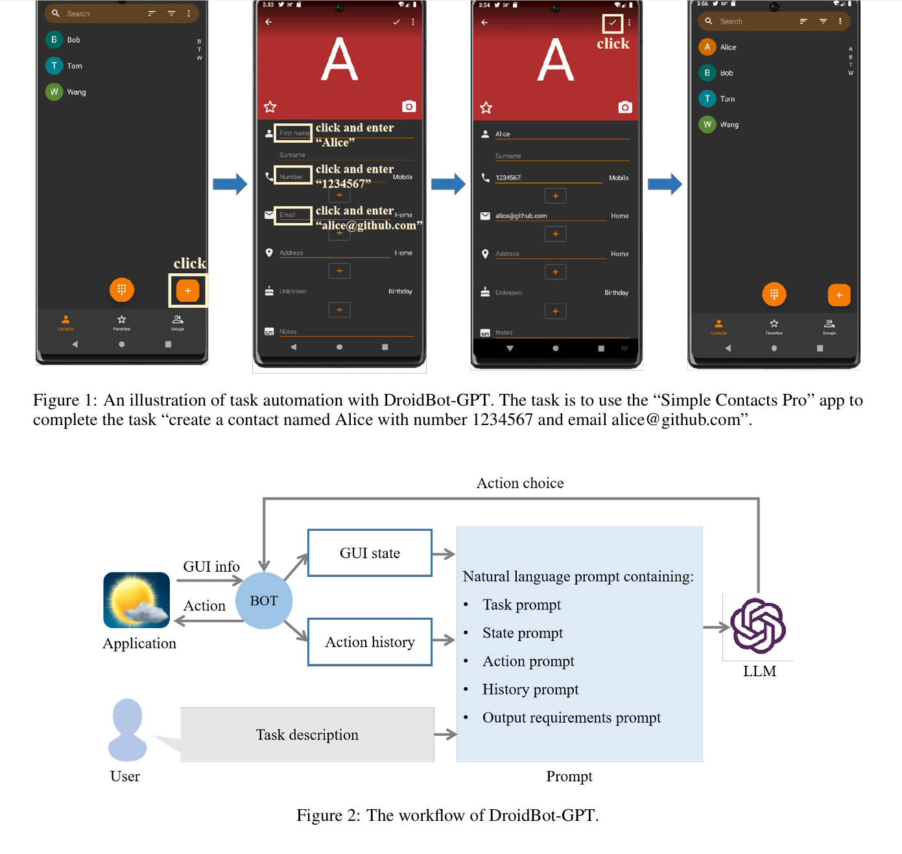

AppAgent: Multimodal Agents as Smartphone Users：利用 GPT4-V 进行探索+部署，支持 learn from demonstration。

#### Multimodal

微软 Responsible Task Automation: Empowering Large Language Models as Responsible Task Automators，大小模型协同，一个模型负责 planning，一个模型负责 executing，同时，在这个过程中实现隐私保护。这个过程会通过一个语言模型根据屏幕截图 + low level commands 来判断命令是否可执行、是否执行成功。当然，仅仅用 Decoder 做二元判断似乎有点浪费，感觉是个分类器就能做，用 bert 说不定更好。另外，Vision Encoder 在识别图片中文字这一块擅长吗？模型架构来自于 pix2seq，它原本是做目标检测的。

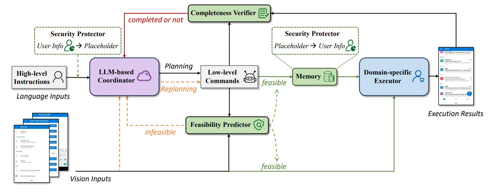

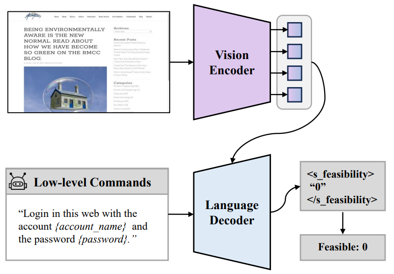

Auto GUI: You Only Look at Screens: Multimodal Chain-of-Action Agents

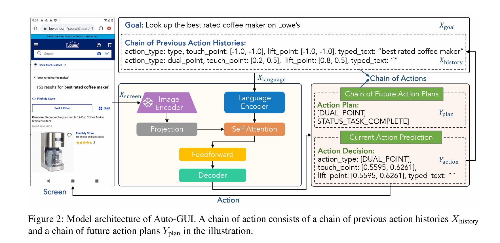

META-GUI: Towards Multi-modal Conversational Agents on Mobile GUI

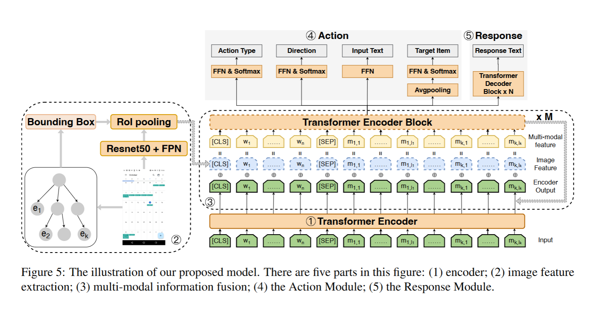

### UI Understanding and Representation

ActionBert: Leveraging User Actions for Semantic Understanding of User Interfaces：UI 理解，leveraged the temporal con
nections between UIs in a UI sequence to design their pretraining tasks

UIBert: Learning Generic Multimodal Representations for UI Understanding：self-alignment among different multimodal features in a single UI， use trainable lightweight encoders

### LLM + RL

[Enabling Intelligent Interactions between an Agent and an LLM: A Reinforcement Learning Approach](https://arxiv.org/pdf/2306.03604)

### Code-based Methods

## Topics

长序列的任务执行

多模态 GUI Agent

隐私保护

用户偏好/个性化的 Agent

Proactive Agent

Show me how to do/高效的策略更新方法

RL training in sparse reward

LLM as Reward Model

Action & Workflow embedding

寻找 UI 的表征/ UI Understanding

## Paper Reading

### 20240725

ShareGPT4Video: Improving Video Understanding and Generation with Better Captions：视频数据理解，或许有助于 GUI Agent 的训练。提出了一个 Differential Sliding-window Captioning 的方案，让 GPT4o 根据上一帧和当前帧之间的差别来输出 Caption，最后加上一个 Summary 来描述整个视频的 pipeline。这里的关键是如何选关键帧，原文采用一个 CLIP Model，通过比较最后一帧和这一帧的相似性，选出差别较大的帧。

### 20240629

Read Agent：利用分页解决大模型长文本表现差的问题（Lost in middle）。

### 大小模型协同

[SwiftSage: A Generative Agent with Fast and Slow Thinking for Complex Interactive Tasks](https://arxiv.org/pdf/2305.17390)。用 BC 的小模型进行 fast thinking, 然后让大模型进行 slow thinking / grounding.

### Code Policy

[AdaPlanner: Adaptive Planning from Feedback with Language Models](https://arxiv.org/pdf/2305.16653)

Code as Policies: Language Model Programs for Embodied Control: 2209.07753, Use Code (Formal Language) in Embodied Agent.

### FFN 的作用

[Transformer Feed-Forward Layers Build Predictions by Promoting Concepts in the Vocabulary Space](https://arxiv.org/pdf/2203.14680)

[Dissecting Recall of Factual Associations in Auto-Regressive Language Models](https://arxiv.org/pdf/2304.14767)

### 杂项

MatFormer：嵌套训练 FFN 参数，适配不同的设备。

SADMoE：对 weight 聚类，将双层 MLP 转为 MoE

Deja Vu：预测 attention 的激活值，动态分配空间
