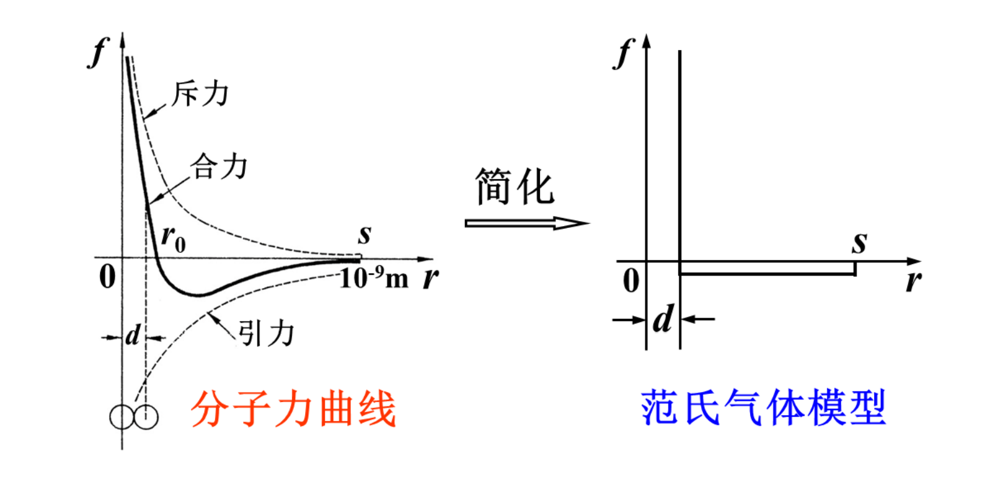
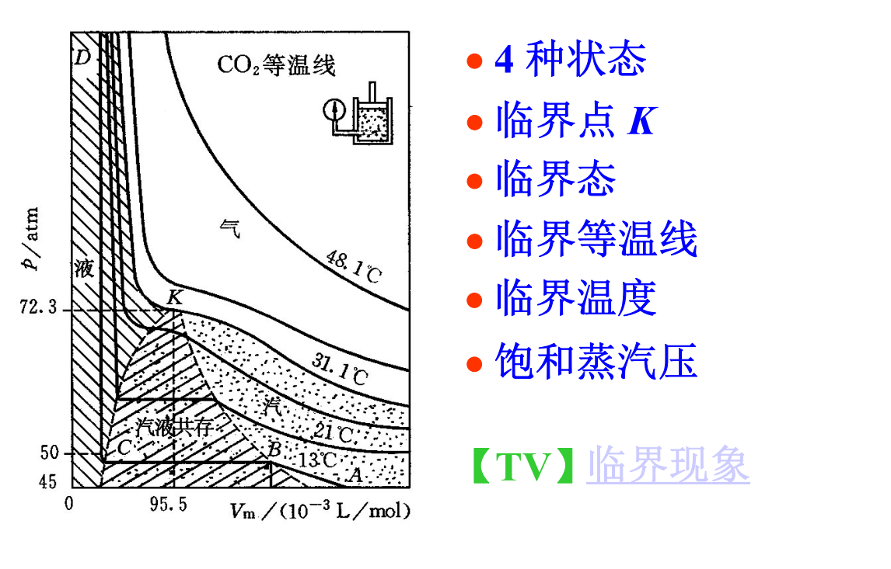
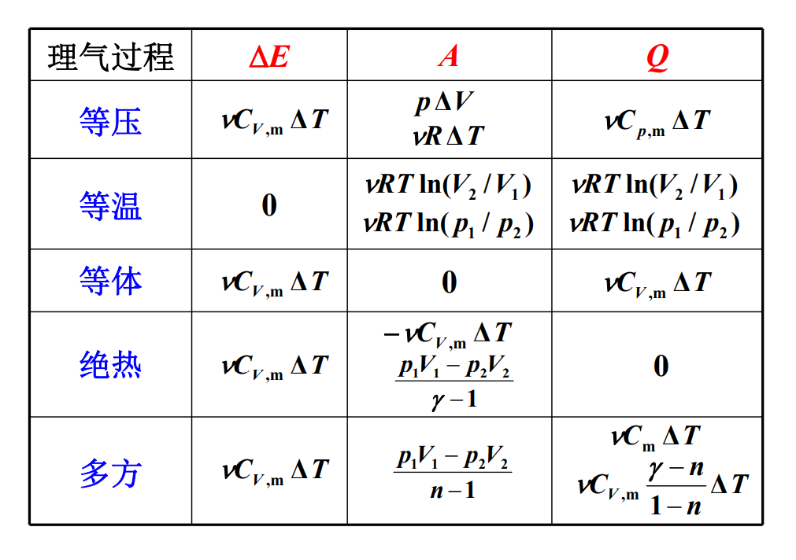
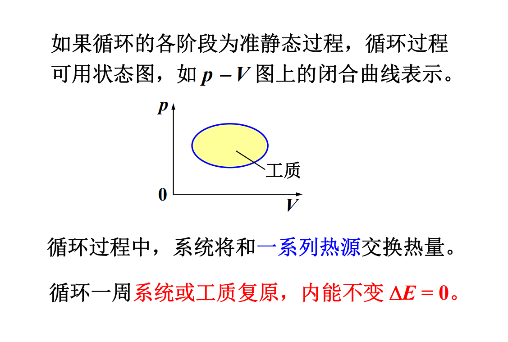
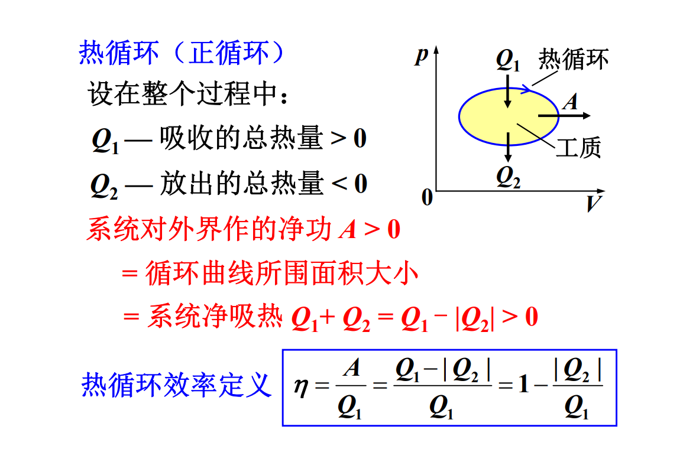
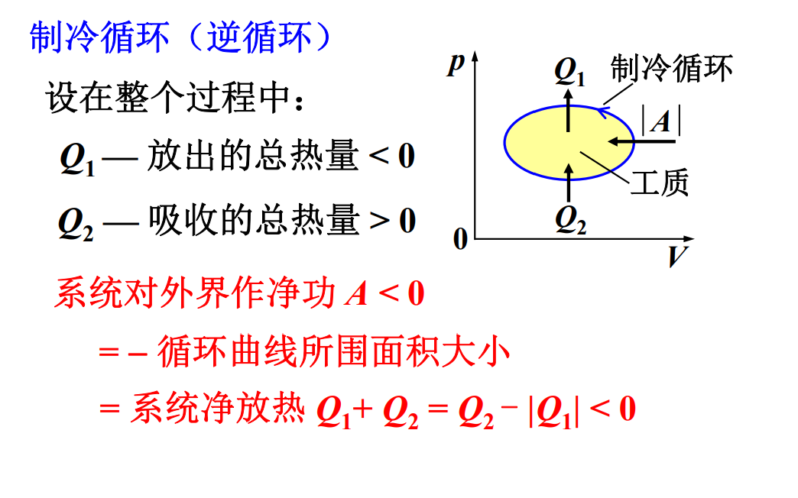

# 参考教材

嫌教材太简单可以看看

《热学》lhf例题很多，很详细，很多数学比教材难

《》

《新概念物理教程-力学》新颖，比较硬核。

《费恩曼物理学讲义》

《新概念物理教程-光学》公认最好教材

《光学》chb, lyp

量子物理没有太好的参考书。

《原子物理学》杨福家编。现在没有原子物理了，只有量子物理。有时用经典方法，有时候用量子物理的方法。前几章和教材一致，实验讲得不错。

量子力学教程。周世勋。内容有点少。

《费恩曼物理学讲义》第3卷。相当有深度（量子物理）。

*Phyisics* Vol.1 & 2。难度介于大学物理学和物理系教材之间。

### 杂项

牛顿运动方程一般个数少，微分阶数高；哈密顿正则方程一般个数多，微分阶数低。

# 热学

## 温度

分子动理论：热学中比较古老的理论。

教材中关于统计物理的内容不够透彻。

建议学习分析力学（重点：哈密顿力学），对后续量子力学有帮助。固体物理也会使用相关技巧。哈密顿量，相空间，拉格朗日方程。不用看证明，能用就行。

### 热学研究内容与对象

内容：与热现象有关的性质和规律。

热现象：宏观上与温度有关，微观上与分子热运动有关。

对象：大量微观粒子构成的体积有限的物体-热力学系统。（量大：统计学规律。）

经常讨论系统和外界（环境）。一种说法：宇宙是不是热力学系统？不是，因为宇宙之外没有外界。所以热二定律可能不适用于整个宇宙。

孤立系统：与外界没有任何相互作用。

绝热系统：有功的交换，没有热量交换

封闭系统：有能量交换，无粒子交换

开放系统：既有能量交换，也有粒子交换

### 热力学的研究方法

#### 热力学

宏观理论方法。依赖于实验。不涉及物质的微观结构和微观运动规律。具有极大的普遍性，可靠性。

#### 统计物理学

微观理论方法。从微观模型假设出发，力学 + 统计理论建立微观量和宏观量的关系。可解释本质，但是受模型局限。

### 几个重要概念

#### 平衡态

热力学系统内部，宏观上不存在能量和粒子的流动，系统宏观性质不随时间变化。（体积、压强、温度）

热力学平衡条件：

力学平衡条件：若系统与外界有力学作用，平衡时内外压强相等。

热平衡条件：若系统与外界可交换热量，平衡时内外温度应相等。

相平衡条件：若系统与外界处于不同相的共存状态，平衡时要达到力学平衡、热平衡以及相平衡。

化学平衡条件：浓度不同的系统混到一起，平衡时要满足上面三个条件，并且浓度均匀。

注意区分平衡态和稳定态：

![../images/pht.png]

#### 宏观量

描述系统宏观性质的量。可直接测量。

广延量：有累加性。如M, V, E...

强度量：无累加性。如p, T...

#### 微观量

描述微观粒子性质的量。需要间接测量。

如分子的m, v, d...

#### 状态参量

描述系统平衡态及其宏观性质的物理量。

p, V, T, v, 内能E, 熵S, 焓H

一组态参量对应一个平衡态。

实验表明：状态参量之间不是相互独立的。

常选p, V, T作为自变量，其他的当作函数（E, S, H）-热力学函数。

对物质量确定的单元（单一组元，不能由多种物质混合）单相（同一种状态，不能有固液同时存在等等）系统，p, V, T只有两个是独立的：T(p, V), E(p, V)。

统计物理：状态参量之间的偏导数关系。

#### 物态方程

两个最基本的热力学函数之一（物态方程和内能）。态参量之间的函数关系: f(T, p, V) = 0

通过测量确定。

理想气体物态方程：

$pV = νRT$

$p = nkT$

$k = \frac{R}{N_A}$

$\nu$ 气体摩尔数

$k$ 玻尔兹曼常量

### 温度

#### 热平衡态

两个系统长时间热接触达到的共同平衡态。

#### 热力学第零定律

实验表明： A与C热平衡，B与C热平衡，A和B也必然保持热平衡。

非热接触的两个系统也可以处在同一个热平衡态。

温度：处于同一热平衡态下的热力学系统所具有的共同的宏观性质。

处在同一热平衡态的系统具有相同的温度。

#### 温标

理想气体温标；用理想气体做测温物质。单位: $K$(Kelvin)， 范围适用 $> 0.5K$

实验表明：一定质量的理想气体在同一个热平衡态下，$pV$不变。

规定$T \propto pV$，水的三相点温度为$T_3 = 273.16K$

$$T = T_3\frac{pV}{p_3V_3} = 273.16\frac{pV}{p_3V_3}$$

热力学温标$T$：理论温标，与物质无关。

单位: $K$，适用于所有温度范围，在理想气体温标范围内与理气温标一致。

### 统计物理学的观点、概念简介

统计物理学包括平衡态统计理论，非平衡态统计理论和涨落理论。它从物质的微观结构和微观运动来阐明物质的宏观性质。其基本观点：

- 宏观物体由大量的微观粒子（原子、分子、电子、光子等）构成。
- 微观粒子的运动服从力学规律。原则上说服从量子力学规律，一定条件下可以用经典力学处理。
- 从微观角度看，物体以一定的概率出现在各个微观状态上，物质的宏观性质就是物质微观性质的统计平均。宏观量是有关微观量的统计平均值。

#### 近独立子系统

构成系统的粒子间相互作用很弱，系统能量近似等于各粒子能量总和，如理想气体。

#### 微观状态（力学运动状态）

##### 经典力学描述

常采用正则形式，即广义坐标和广义动量描述。

- 子相空间（μ空间）：由粒子的广义坐标$q_i$和广义动量$p_i$（$i = 1, \dots, r$, $r$是粒子自由度）构成的2r维空间。

  1组$(q_1, \dots, q_r, p_1, \dots, p_r)$的取值表示粒子的1个微观状态，对应于子相空间的一个点。

  更确切的说，在子相空间 $( q_1,... , q_r , p_1,..., p_r )$位置处的体积元 $d q_1...d q_r dp_1...dp_r$中的点，都是由$( q_1,... , q_r , p_1,..., p_r )$描述的相同的粒子微观状态。

  位形空间（坐标构成的空间），速度空间（速度构成的空间）。

  傅里叶变换和傅里叶级数的区别：一个离散，一个连续。

- 系统的微观状态是由所有粒子的广义坐标和广义动量描述的。

##### 量子力学描述

量子力学中假设运动状态用量子态描述。

- 粒子的微观状态用单粒子（量子）态描述。

  单粒子态由一组量子数描述：如 $|n, l, m_l, m_s >$ 。 1 组取值确定的$ |n, l, m_l, m_s > $表示 1 个单粒子态。 当粒子状态是由某个单粒子态描述时，称为粒子处于某个单粒子态，或粒子占据某个单粒子态

- 系统微观状态用多粒子（量子）态描述。

  对近独立子系统，多粒子态可由单粒子态表示： 系统所有粒子的 1 组单粒子占据态就表示系统的 1 个 多粒子态，即表示系统的 1 个 微观状态。

微观粒子全同性原理

全同粒子：内禀属性如质量、电荷、自旋等相同 

微观粒子全同性原理是量子力学假设。 

全同性原理：对全同粒子组成的系统，交换任意 2个全同粒子，系统微观状态不变。

泡利不相容原理：对全同费米子系统，不能有两个及以上的费米子占据同一单粒子态。

费米子：自旋为半整数；玻色子：自旋为整数。

#### 宏观状态和微观状态的关系

系统的宏观状态由宏观量表征，如 E、N、V。 

系统的微观状态，如果用经典描述，则由所有粒子 的坐标和动量表征。 

玻耳兹曼认为：从微观上看，对于一个系统的状态 的宏观描述是非常不完善的，系统的同一个宏观状 态实际上可能对应于非常非常多的微观状态，而这 些微观状态是粗略的宏观描述所不能加以区别的。

 这意味着宏观状态和微观状态、宏观量和微观量具 有内在联系，这种联系是种统计关系。

#### 统计规律性

统计物理发展早期，人们普遍认为：研究物体宏观 性质，应从求解粒子的力学运动方程出发来解决。 但由于粒子数太多，求解力学方程困难，迫不得已 得引入统计方法。而且这个统计是：宏观量是相应 微观量的长时间平均。 即原则上力学规律可完全决定物体宏观性质  

这种观点无法解释根本问题：热现象的不可逆性。 因为把力学运动方程（牛顿方程或薛定谔方程）用 到微观粒子，是时间反演对称的 — 可逆的。

这表明仅通过力学规律来解释物体的宏观性质是 不可能的，而有赖于新的规律 — 统计规律。

力学规律是决定论性的，可表述为：在一定初始 条件下，某时刻系统必然处于一确定的运动状态。 

统计规律可以表述为：在一定的宏观条件下，某 时刻系统以一定的概率处于某一微观状态。 

即宏观状态与微观状态之间的联系是概率性的， 具有统计规律的特性，而不是决定论性的。

统计规律的稳定性：只要 N 足够大，每次得到的分布几乎相同

统计规律的涨落：每次实验中得到的比例 Ni /N 稍有差别。N 越大，涨落越小。

即对变量是离散取值的情况，直接采用概率， 对变量是连续取值的情况，需要引入概率密度。

热现象本质是统计规律的反映。

##### 平衡态统计理论的基本假设：等概率原理 

处于平衡态下的孤立系统，系统各个可能的微观 状态出现的概率相等。 “可能的微观状态”是指孤立系统的宏观条件所 允许的那些微观状态，即这些微观状态对应于给 定的 E、V、N

##### 平衡态下近独立子系统的统计规律 

处于平衡态下的热力学系统，宏观状态不变，但 相应的微观状态不断变化，是一种动态平衡。 根据等概率原理，平衡态包含的微观状态数目是 最多的 — 最概然态

求统计分布函数：对于每个统计分布函数，可以计算它们对应的微观态数目（微观态数目是统计分布函数的函数）。在E, N不变的条件下，只要找到对应微观态数目最多的统计分布函数，就是平衡态的统计分布函数。

对近独立子系统，采用经典力学及等概率原理只能得到一种经典统计：麦克斯韦-玻尔兹曼统计；采用量子力学及等概率原理得到3种统计：麦克斯韦-玻尔兹曼统计，费米-狄拉克统计，玻色-爱因斯坦统计。

造成 3 种量子统计规律的原因是微观粒子的全同性原理和泡利不相容原理。

麦克斯韦-玻尔兹曼统计适用于定域子系统，费米 - 狄拉克统计、玻色 - 爱因斯坦统计适用于非定域 子系统。

 定域：全同粒子系统中的粒子的波包局限在空间 一定范围内，之间没有重叠，全同性原理 不起作用，可以通过位置分辨粒子。

 经典的和量子的麦克斯韦-玻尔兹曼统计在数学形 式上一致。而在一定条件下，量子的 3 种统计都可 退化为经典的麦克斯韦-玻尔兹曼统计

## 气体动理论

#### 气体动理论的基本观点

气体动理论（分子动理论），发展于 19 世纪下半 期，基于经典理论，是统计物理学的原型，被不断 补充发展完善成为统计物理学，其所得的结论可通 过统计物理得到。至今仍在诸多领域有重要应用。

1. 宏观物体是由大量分子、原子构成的，分子间 存在一定的间隙。
1. 分子永不停息地作无规则运动 — 热运动
1.  分子间存在一定的相互作用。

### 理想气体的压强

##### 关于理想气体的假设

###### 单个分子服从的力学规律

理想气体模型：

大小：分子线度<<分子间平均距离

分子力：除碰撞的瞬间，在分子间、分子与器壁间无作用力

碰撞性质：弹性碰撞

服从规律：牛顿力学

###### 大量分子处于平衡态时的统计假设

（1）无外场时，分子在各处出现的概率相同
$$n = \frac{\mathrm d N}{\mathrm d V} = \frac NV = \text{const}.$$
（2）由于碰撞，分子可以有各种不同速度

速度取向各方向等概率：
$$\bar{v_x} = \bar{v_y} = \bar{v_z} = 0\\\\\bar{v_x^2} = \bar{v_y^2} = \bar{v_z^2} = \frac 13 \bar{v^2}$$

##### 理想气体压强公式

前提：平衡态，忽略重力，分子当成质点
$$p = \frac13nm\bar{v^2} = \frac23n\bar\varepsilon_t, \\\\\bar\varepsilon_t = \frac12 mv^2$$

### 温度的统计意义

$$\bar\varepsilon_t = \frac{3p}{2n} = \frac{3nkT}{2n} = \frac32kT\\\\\sqrt{\bar{v^2}} = \sqrt{\frac{3kT}{m}} = \sqrt{\frac{3RT}{M}}$$

$T = 273K$, 

$\bar{\varepsilon}_t$数量级：$10^{-2}$eV

$\sqrt{\bar{v^2}}$

$H_2$: $1.84\times 10^3m/s$

$O2$: $4.61\times 10^2m/s$

### 能量均分定理

自由度：决定物体空间位置的独立坐标数，用$i$表示

##### 单原子分子

平动自由度:$t = 3$ 

$i = 3$

##### 双原子分子

质心平动：$t = 3$

轴取向：$r = 2$

距离变化：$v = 1$

总自由度: $i = 6$

##### 多原子分子

设分子包含$N$个原子

$i = 3N$

$t = 3$

$r = 3$

$v = 3N-6$

##### 能量均分定理

一个平动自由度对应的平均动能为$\frac12kT$

考虑平动、振动和转动，由于分子的碰撞，分子平均动能均匀分配到每个自由度上。

在温度$T$的平衡态下，分子热运动的每个自由度对应的平均动能都等于$\frac12kT$。

普遍的能量均分定理：

分子能量中每具有一个平方项，就对应一个$\frac12kT$的平均能量。

分子振动的动能和势能都是平方项，所以：

$\bar\varepsilon_{vP} = \bar\varepsilon_{vk} = v\frac12kT$,  $\bar\varepsilon_v = \bar\varepsilon_{vP}  + \bar\varepsilon_{vk} = vkT$
$$\bar\varepsilon = \bar\varepsilon _t + \bar\varepsilon_r + \bar\varepsilon_v = (t + r + 2v)\frac12kT$$
通常情况下($T < 10^3K$)，振动自由度被“冻结”，分子可视为刚性

刚性分子：$v = 0, i = t + r$
$$\bar\varepsilon = \frac{t+ r}2kT$$

##### 理想气体内能

内能：系统内部各种形式能量的总和，不包括系统整体质心运动的能量

分子内部： $\bar\varepsilon = (t + r + 2v)\frac12kT$

分子之间：相互作用势能$\varepsilon_{\mathrm pij}$

内能：$E = N\bar\varepsilon + \sum_i\sum_{j<i}\varepsilon_{\mathrm pij} = E(T, V)$

理想气体： $\varepsilon_{\mathrm pij} = 0,E = E(T)$

### 麦克斯韦速度分布律

分布函数是体现热力学系统的统计规律性的重要函数.

常见的统计分布函数包括：速率分布函数、速度分布函数、能量分布函数等。

通过分布函数可计算微观量的统计平均值，如$\bar\varepsilon_t, \bar{v^2}$等，进而得到系统的宏观量。

##### 速率分布函数

$$f(v) = \frac{\text dN}{N\text dv}\\\\\int_0^\infty f(v)\text dv = \int_0^\infty\frac{\text dN}{N} = 1$$

##### 麦克斯韦速率分布函数（不用记）

$$f(v) = 4\pi (\frac m{2\pi kT})^{3/2}e$$

##### 三种统计速率

###### 最概然速率

$$v_p = \sqrt{\frac{2kT}{m}}$$

m一定时，温度T越高，速率大的分子数比例越大，最概然速率越大， $f(v_p)$越小。

###### 平均速率

$$\bar v = \int_0^\infty vf(v)\text dv$$

任意函数对全体分子按速率分布的平均值为

$f(v)$一定要归一化!
例如求0到vp/2的平均速率，首先要将f(v)归一化成这个区间内的速率分布，而不是直接用全部速率分布

$$\bar{\phi(v)} =\int_0^\infty \phi(v)f(v)\text dv$$

由麦克斯韦速率分布函数

$$\bar v = \sqrt{\frac{8kT}{\pi m}} = \sqrt{\frac{8RT}{\pi M}}$$

###### 方均根速率

$$\bar{v^2} = \int_0^\infty v^2f(v)\text dv = \frac{3kT}{m}\\\sqrt{\bar{v^2}} = \sqrt{\frac{3kT}{m}} = \sqrt{\frac{3RT}M}$$

##### 麦克斯韦速度分布律

$$\frac{\text dN}{N} = \left(\frac{m}{2\pi kT}\right)^{3/2}e^{-m(v_x^2 + v_y^2 + v_z^2)/2kT}\text{d}v_x\text{d}v_y\text{d}v_x$$

速度分量的分布函数

$$g(v) = (\frac m{2\pi kT})^{1/2}e^{-mv^2/2kT}$$

##### 分子碰壁数$Γ$

$$\Gamma = \frac14 n\bar v$$

##### 玻尔兹曼分布

###### 恒温气压公式

$$p = p_0e^{-mgz/kT}\\\\n = n_0e^{-mgz/kT}$$

###### 玻尔兹曼分布

$$\text dN_{\vec r} = n_0 \cdot e^{-\varepsilon_p(\vec r)/kT} \cdot \text d^3 \vec r\\\\\text d^3\vec r = \text dx \ \text dy \  \text dz$$

###### 玻尔兹曼-麦克斯韦分布

$$\text dN = n_0 \cdot (\frac m{2\pi kT})^{3/2} \cdot e^{-[\frac12 mv^2 + \varepsilon_p(\vec r)]/kT} \cdot \text d^3\vec r \cdot \text d^3 \vec v$$

能量简并：不同子相空间分子能量相等。

分子按能量分布：

$$N(\varepsilon) = C \cdot w(\varepsilon) \cdot e^{-\frac{\varepsilon}{kT}}$$

$\varepsilon$为粒子的能量，$w(\varepsilon)$为具有此能量的体积元个数.

### 范德瓦尔斯方程

#### 范氏气体模型

气体分子间的作用力：分子间的作用力很复杂，主要是电磁力，可以分为引力和斥力

范氏气体模型：对理想气体做两方面的修正。考虑分子体积、分子间作用力引起的修正。

* 分子是直径为d的刚球
* 在$d\rightarrow s$的范围内，分子间有恒定引力

#### 范德瓦尔斯方程

范德瓦尔斯方程：

设:

$\nu = 1 mol$

$p$ -- 实测气体压强

$V_m$ -- $1\ mol$气体容积

对理想气体：$pV_m = RT$

对真实气体：

1. 分子体积引起的修正

分子自由活动空间的体积为$V_m - b$

$$p(V_m - b) = RT$$

$$
p = \frac{RT}{V_m - b}
$$

2. 分子间引力引起的修正

气体分子间作用力一般表现为引力。

在容器内部，单个气体分子受到各个方向的平均引力相等，合力可以看作零。

但是在容器边缘，单个气体分子受到的引力是不对称的。气体分子所受的合力指向容器内部，因此撞击容器壁的气体分子动量比理想气体下的情况要小，宏观上形成的压强比理想气体情况要小。

$$
p < \frac{RT}{V_m - b}\\
$$

设

$$
p = \frac{RT}{V_m - b} - p_{in}
$$

$p_{in} \propto nf_{合}, f_{合}\propto n \Rightarrow p_{in} \propto n^2 \propto \frac 1{V_m^2}$

最后得到：
$$
(p + \frac a{V_m^2})(V_m - b) = RT
$$

对 ν mol 气体：

$$
(p + \nu^2 \cdot \frac a{V^2})(V - \nu b) = \nu RT
$$

常温常压下：$b/V_m \sim 10^{-3}, p_{in}/p \sim 10^{-2}$，这时分子体积和分子间的作用力修正可以忽略。

#### 气体的等温线

真实气体的等温线：

范氏气体的等温线：

如何计算临界参数：

临界参数：临界点K对应的$p_K, V_K, T_K$

临界点K是等温线的拐点：

$$
\left(\frac{\partial p}{\partial V}\right)_{T = T_K} = 0\\
\left(\frac{\partial^2 p}{\partial V^2}\right)_{T = T_K} = 0
$$

K同时也是三次方程的三重根，因此可以通过假设$(V_m - V_{mK})^3 = 0$展开后和范德瓦尔斯方程对比系数求解。

#### 范氏气体内能

理想气体： $E(T) = i\nu RT / 2$

范氏气体：$V\uparrow \rightarrow p_{in}做负功\rightarrow 分子间势能E_p\uparrow$

要计算势能，首先要定义势能为0的状态：定义某种位形为0势能。其他状态的势能定义为从这种状态变形到0势能状态的过程中保守力的变化。

$$\mathrm dA = -p_{in}S\mathrm dl = -p_{in}\mathrm dV$$

设$E_p(V = \infty) = 0$。

$$
E_p(V) = \int_V^\infty -p_{in}\mathrm dV = \int_V^\infty-\nu^2 \cdot \frac a{V^2}\mathrm dV = -v^2 \cdot \frac aV
$$

$$
E = E_k + E_p = \frac i2\nu RT - \nu ^2\frac aV
$$

**结论：**
$$E(T, V) = \frac i2 \nu RT - \nu^2 \frac aV$$

#### 一个细节

为什么不考虑气体分子和容器壁分子间的引力？

事实上，这引力确实存在。但是可以通过动量定理证明，碰撞过程这引力的作用总和为0。

### 气体分子的碰撞、平均自由程

平均碰撞频率和平均自由程

平均碰撞频率$\bar z$：单位时间内一个气体分子与其他分子碰撞的平均次数

平均自由程$\bar \lambda$：气体分子在相邻两次碰撞之间飞行的平均路程。

平均碰撞频率和平均频率之间关系

对象:平衡态下的理想气体

假定：

(1)只有一种分子；

(2)分子可视作直径为d的刚球；

(3)被考察的分子以平均相对速率$\bar u$运动，其余的分子静止。

碰撞界面为$\sigma$。分子间平均相对速率为$\bar u = \sqrt 2 \bar v$。

$$
\bar z = \sigma \bar u n = \pi d^2 n \bar u = \sqrt 2 \pi d^2 n\bar v
$$

平均自由程和压强、温度的关系：

$$
\bar\lambda = \frac {\bar v} {\bar z} = \frac 1{\sqrt2 \pi d^2 n} = \frac {kT}{\sqrt2\pi d^2p} \propto \frac{T}{p}
$$

### 气体输运过程

非平衡态下，气体内部各部分性质不均匀，就会产生热量、动量、质量的迁移，称为输运过程或内迁移过程。

气体输运过程包括：热传导、扩散和内摩擦（粘滞）。

输运现象的宏观实验定律和原因。

热传导

温度不均匀。实验定律：傅里叶定律，热传导方程。

考虑1维的情形。

$$
\mathrm dQ = -\kappa \frac{\partial T}{\partial x}\mathrm dS \mathrm dt
$$

$$
j(x, t) = \frac{\mathrm dQ}{\mathrm dS\mathrm dt}  = -\kappa \frac {\partial T(x, t)}{\partial x}
$$

$j(x, t)$：热流密度，$\partial T/\partial x$：温度梯度。

温度梯度“力”导致热流。

> $T$在这里相当于电势，$-\partial T / \partial x$相当于电势的负梯度即电场强度，$j$相当于电流密度，$\kappa$相当于电导率。因此类比$\vec{J} = \sigma \vec{E}$有$j = -\kappa \partial T /\partial x$。类似的，也许可以推导出热阻的概念？热学的“麦克斯韦”方程组又是什么？

统计物理给出的结论：

$$
\kappa = \frac 13 nm\bar v \bar \lambda c_V
$$

>如何理解此公式：热传导的本质是分子能量（热量）的交换，交换的热量等于粒子数乘以单个粒子交换的热量。
>
>$m$为单个分子质量。$c_V$为定体热容。$n\bar v$用于描述$\mathrm dt$内穿过$\mathrm dS$的粒子数，$\bar\lambda$乘以$\partial T/\partial x$得到温度的变化量$\mathrm dT$ ,$m,c_V$与温度的变化量相乘，得到单个粒子交换的热量。

稳恒热流：$\frac{\mathrm dQ}{\mathrm dt} = C$，$j$, $T$与$t$无关。

$\kappa$称为导热系数，由气体特性和$T, p$决定。

扩散

原因：气体内部离子数浓度不均匀。

斐克定律

$$
\mathrm dN = -D\frac {\partial n}{\partial x}\mathrm dS \mathrm dt
$$

>教材的表述为
>$$
\mathrm dM = -D\frac {\partial \rho}{\partial x}\mathrm dS \mathrm dt
>$$
>这里的两个$D$是一样的。

统计物理给出的结论：

$$
D = \frac13\bar v\bar \lambda
$$

扩散流密度：

$$
j(x, t) = \frac {\mathrm dN}{\mathrm dS \mathrm dt} = -D\frac {\partial n}{\partial x}
$$

稳恒扩散流：$\frac {\mathrm dN}{\mathrm dt} = C$，$j$, $n$, 与$t$无关。

粒子数守恒方程
$$
\oiint_S j\cdot \vec {s} = -\frac {\mathrm dN}{\mathrm dt}, \nabla \cdot \vec j + \frac{\partial n}{\partial x} = 0.
$$

结合粒子数守恒方程（微分形式）和斐克定律得到扩散方程

$$
\frac{\partial n}{\partial t} = D\frac{\partial^2 n}{\partial x^2}
$$

考试考定场稳恒流，不考内摩擦。

内摩擦（粘滞）

根据流体力学，对定常流动的粘滞流体，流速不太大时（雷诺数小），出现层流。

粘滞定律（牛顿摩擦定律）

$$
\Delta F = - \eta \frac{\mathrm du}{\mathrm dz}\Delta S
$$

$$
p = -\eta \frac{\mathrm du}{\mathrm dz}
$$

粘度和温度有关，气体粘度随温度增加，液体温度随温度减小。遵从粘滞定律的流体称为牛顿流体。

内摩擦原因：流速不均匀。

统计物理给出的结论：

$$
\eta = \frac 13 nm\bar v\bar \lambda
$$

## 热力学第一定律

### 准静态过程

准静态过程：过程的任一时刻，系统都处于平衡态— 一系列平衡态组成的理想化过程。

若外界条件改变时，能保证和系统相应的强度量之间差无穷小，则过程是准静态的。

弛豫时间τ：平衡破坏到恢复平衡的时间.

当$\Delta t_{过程} > \tau$时，过程就可视为准静态过程。
。
### 功

体积功：$\mathrm{\bar dA} = p\mathrm dV$

系统对外界做功:$A = \int_{V_1}^{V_2}p\mathrm dV$是一个过程量。

通过做功改变系统热力学状态，微观上是分子规则运动的能量通过碰撞转变为无规则运动的能量。

### 内能，热量和热力学第一定律

内能：定义为$E_2 - E_1 = A_{1\rightarrow 2}$（绝热过程）

内能通过绝热功度量。

热量：定义为$Q = (E_2 - E_1)$（无功过程）

微观本质是分子无规则运动的能量通过碰撞从高温物体向低温物体传递。

热力学第一定律：

$Q = \Delta E + A$

$\mathrm {\bar{d}}Q = \mathrm d E + \mathrm{\bar{d}}A$

热力学第一定律是一条实验定律，适用于任何热力学系统的任何过程。

### 热容量：

$$
C = \frac{\mathrm dQ}{\mathrm dT}
$$

定体热容量：$C_v = \left(\frac{\mathrm dQ}{\mathrm dT}\right)_V$

定压热容量：$C_p = \left(\frac{\mathrm dQ}{\mathrm dT}\right)_p$

摩尔热容量：
$$
C_m = \frac1\nu\frac{\mathrm dQ}{\mathrm dT}
$$

对应地有定体摩尔热容量和定压摩尔热容量。

理想气体内能：$\Delta E = \nu C_{V, m}\Delta T$。（推导：内能变化与过程无关，假设先等体后等温，等体过程无功只有热交换，等温过程内能不变。）

迈耶公式：

$$
C_{p, m} - C_{V, m} = R
$$

（推导：用等压过程计算内能的变化，与定体过程的结论比较一下可得。）

理想气体热容量理论公式：

$$
C_{V, m} = \frac i2R, C_{p, m} = \frac{i+2}{2}R
$$

推导：结合理想气体内能公式。

定义比热容比:$\gamma = C_{p, m}/C_{V, m}$

### 绝热过程

系统和外界没有热交换的过程。

理想气体的准静态绝热过程：

> $$
> 0 = p\mathrm dV + \nu C_{V, m}\mathrm dT\\
> p\mathrm dV + V\mathrm dp = \nu R\mathrm dT\\
> R  = C_{p, m} - C_{V ,m}
> $$
>
> 得到：
> $$
> \frac{\mathrm dp}{p} = -\gamma\frac{\mathrm dV}V
> $$

两边积分得到:
$$
pV^{\gamma} = C, TV^{\gamma - 1} = C, p^{\gamma - 1}T^{-\gamma} = C
$$

绝热功

$$
A = \int_{V_1}^{V_2} p\mathrm dV = C \int_{V_1}^{V_2}\frac 1{V^{\gamma}}\mathrm dV = \frac{C}{1 - \gamma}(V_2^{1 - \gamma} - V_1^{1 - \gamma}) =\frac{p_2V_2 - p_1V_1}{1 - \gamma} 
$$

绝热功等于内能的减少量：

$$
A = -\Delta E = \nu C_{V, m}\Delta T
$$

理想气体的多方过程

多方过程：热容量$C$为常数的过程

多方过程方程：$pV^n = \text{const}$

其中，$n = (C - C_p)/(C - C_V) = (C_m - C_{p, m})/(C_m - C_{V, m}) = \text{const}$

如果为绝热过程则$C = 0$，$n = \gamma$，从而$pV^{\gamma} = \text{const}$。

如果为等温过程则$C = \infty$，$n = 1$，因此$pV = \text{const}$。

绝热自由膨胀过程（非准静态过程！！）：

理想气体：$Q = 0, A = 0 \Rightarrow E_1 = E_2$

真实气体：若分子间以引力为主, $T_2 < T_1$，以斥力为主，$T_2 > T_1$。

焓：气体的绝热节流过程是等焓过程，即$H = E + pV$为常数，对于非理想气体而言，内能不仅与温度有关，也与体积有关（焦耳-汤姆孙效应）。

绝热自由膨胀：初末状态在等温线上，但是过程中不是平衡态。

准静态等温膨胀：吸热用来做功。

准静态绝热膨胀：内能的减少量用来做功。

循环过程：

系统，如热机中的工质，经一系列变化的回到初态的整个过程。

状态图：

热循环：

蒸汽机的效率约为十几%，内燃机20-30%。

制冷循环：

制冷系数：

$$
w = \frac{Q_2}{A} = \frac{Q_2}{Q_1 - Q_2}
$$

### 卡诺循环

卡诺循环是一种可逆循环，包括两个等温过程和两个绝热过程。它的效率为

$$
\eta = 1 - \frac{|Q_2|}{Q_1} = 1 - \frac{T_2}{T_1}
$$

卡诺循环的效率仅与热源的温度比有关。

由卡诺定理可以证明，卡诺循环的效率与工质无关。因此，不妨设工质为理想气体，利用理想气体等温和绝热过程方程得到效率公式。

## 热力学第二定律

开尔文表述：不可能将热量从低温热源搬运到高温热源，而不产生其他影响。（制冷系数不可能为无穷大）

克劳修斯表述：不可能将功全部转化为热。（热机效率不可能为1）

开尔文表述和克劳修斯表述是等价的。事实上，任何关于热现象不可逆的描述都是等价的，它们要么同时成立，要么同时不成立。因此，描述热现象的方向性，只需要举一个例子即可。

### 卡诺定理

在温度相同的高温热源和温度相同的低温热源之间工作的一切热机，可逆热机的效率最大。

推论：一切可逆热机，只要它们的高温热源的温度相等，低温热源的温度相等，效率就相等。

对于制冷机：

可逆制冷机的制冷系数最大。

所有2热源可逆制冷机制冷系数都相等，等于卡诺制冷机的制冷系数。

### 热力学温标

根据卡诺定理，可逆热机的效率只与温度有关。因此可以用效率，或者说热量比来定义温标。

在热力学温标下，低温热源的温度不能为0，否则可逆热机的效率为1.

### 任意可逆循环的效率

$$
\eta \le 1 - \frac {T_2}{T_1}
$$

其中，$T_1$，$T_2$分别为循环中工质的最高和最低温度。