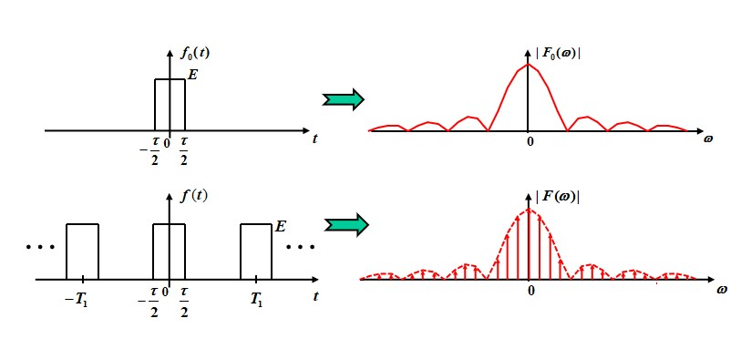

March 15
## Basic
### Classification
Deterministic & random

Periodic/non-periodic

Continuous/Discrete(time)

Analog/Digital(Amplitude & time)

### Operations

Shifting

Reflection

Scaling

Diffrential

Integral

Addition

Multiplication

Convolution

$$
f_1(t) * f_2(t) = \int_{-\infty}^{\infty}f_1(\tau)f_2(t-\tau)\mathrm d\tau
$$

### Singularity Signals

#### Unit ramp function
$$
R(t) = 0, t\lt 0; t, t>0
$$

#### Unit step function
$$
u(t) = 0, t<0;1/2, t=0;1, t>0
$$

#### Rectangular pulse
$$
u(t) - u(t-t_0)
$$

#### Sign function
$$
sgn(t) = 1, t>0;-1, t<0
$$
define $sgn(0)=0$, then $sgn(t)=2u(t)-1$

#### Unit impulse function
Dirac definition
$$
\int_{-\infty}^{\infty}\delta(t)\mathrm dt=1\\
\delta(t)=0(t\ne 0)
$$
$$
\delta(t)=\lim_{\tau \rightarrow0}\left[U(t+\frac\tau2)-U(t-\frac \tau 2)\right]
$$

$$
\int_{-\infty}^{\infty}\delta(t)f(t)=f(0)\\
\int_{-\infty}^{\infty}\delta(t - t_0)f(t)=f(t_0)\\
\delta(t)=\delta(-t)\\
\frac{d}{dt}u(t)=\delta(t)
$$

#### Impulse doublet function

$\delta^\prime(t)$
Double impulses at t=0 which are mirror-imaged with their amplitude of infinite. 

$$
\int^{\infty}_{-\infty}\delta^\prime(t)\mathrm dt=0\\
\int^{\infty}_{-\infty}f(t)\delta^\prime(t)\mathrm dt=-f^{\prime}(0)\\
\text{shifted:}\int^{\infty}_{-\infty}f(t)\delta^\prime(t-t_0)\mathrm dt=-f^{\prime}(t_0)\\
$$

### Signal Decomposition

$$
f(t) = f_D+f_A(t)\\
f(t)=f_e(t)+f_o(t)\\
f(t)=f_r(t)+jf_i(t)\\
f_r(t)=\frac{1}{2}\left[f(t)+f^*(t)\right]\\
f_i(t)=\frac{1}{2}\left[f(t)-f^*(t)\right]
$$

#### Pulse Component

$$
f(t)=\int_{-\infty}^{\infty}f(t_1)\delta(t-t_1)\mathrm dt_1
$$

We also have orthogonal function decomposition(Chap.3, Chap.6).

### System modeling and Classification

System model can be represented by math equation(including input-output description and state variables or state equation) graphic symbol and block diagrams.

We use the input-output description mostly. If controling something internal is needed, state euqtion is useful.

Block diagram: 

### System classification

#### Linear or Non-linear

$$
e_1(t)\rightarrow r_1(t),
e_2(t)\rightarrow r_2(t)\Rightarrow\\
a_1e_1(t)+a_2e_2(t)\rightarrow a_1r_1(t)+a_2r_2(t)
$$

#### Time-variant or Time-invariant

#### Memory or Memoryless

with memory: dynamic system, differential equation

without memory: instant system, algebraic equation

#### Continuous or Discrete

Continuous  Differential equation

Discrete  Difference equation

#### Lumped- or Distributed-Parameter

Lumped: constant coefficient differential equation

Distributed: partial equation

#### Causal or Non-Causal

when $t<0, e(t)=0 \Rightarrow t<0, r(t)=0$ Generic definition?

the future state cannot have effect on now state. The state of causal system can only be determined by now and past states.

#### Reversible or irreversible

different input to different output, otherwise irreversible.

### LTI System

#### Linearity

Linearity leads to superposition and homogeneity.

#### Time-Invariant

a time shift in the input results in a same time shift in the output.

$$
e(t)\rightarrow r(t)\Rightarrow e(t-t_0)\rightarrow r(t-t_0)\\
\lim_{\Delta t\rightarrow 0}\frac{e(t)-e(t-\Delta t)}{\Delta t}\rightarrow \lim_{\Delta t\rightarrow 0}\frac{r(t)-r(t-\Delta t)}{\Delta t}\\
\frac{\mathrm de(t)}{dt}\rightarrow \frac{\mathrm dr(t)}{dt}
$$

If every coefficient is time independent, the system is time invariant.

## Time-Domain(TD) Analysis

$$
C_0\frac{d^nr(t)}{dt^n}+C_1\frac{d^{n-1}r(t)}{dt^{n-1}} + ... + C_nr(t)\\
=E_0\frac{d^me(t)}{dt^m}+E_1\frac{d^{m-1}e(t)}{dt^{m-1}}+...+E_me(t)
$$

**Three Steps**

* Homogeneous
* Particular
* Calculation on coefficients

### Determining Coefficients

If functions are continuous, we can get their boundary conditions by determining the derivatives.

Then the coefficients can be solved by multipling the inverse of Vandermonde matrix with the boundary condition matrix.

#### Zero-input and -state Responses

**Zero-input response** The response caused by the initial state (i.e., energy originally stored in the system), and it is denoted by $r_{zi}(t)$

**Zero-state response** $r(0_-)\equiv 0$, the response caused only by the external excitation and it is denoted by $r_{zs}(t)$

The combination of zero-input response and the zero-state response is not necessarily linear, since the existence of constant. If one of them vanishes, the other is linear.

### Impulse and Step Responses

**Impulse Response** the zero-state response $h(t)$ to $\delta (t)$, which can be equalized to the initial condition.

Note: normally $n>m$.

**Unit Step Response** The zero-state response $g(t)$ to $u(t)$

There might be a forced term in $g(t)$.

$$
g(t) = \int_0^th(\tau)d\tau
$$

### Convolution

Zero-state required

$$
e(t) = \int_{-\infty}^{\infty}e(\tau)\delta(t-\tau)\mathrm d\tau\\
\Rightarrow r(t)=\int_{-\infty}^{\infty}e(\tau)h(t-\tau)\mathrm d\tau\\
\Rightarrow r(t)=e(t)*h(t)
$$

the definition of convoluiton:

$$
f_1(t)*f_2(t)=\int_{-\infty}^{\infty}f_1(\tau)f_2(t-\tau)\mathrm d\tau
$$

**Integral interval** $e(t)=0, \forall t<0$, $h(t)=0,\forall t<0$, so $r(t)=\int_0^t{e(\tau)h(t-\tau)\mathrm d\tau}$

The condition for applying convolution:

* For linear system ONLY
* For time variant systems, $h(t, \tau)$ means response at time $t$ generated by the impulse at time $\tau$, then $r(t)=\int_0^th(t,\tau)e(\tau)\mathrm d \tau$; for time-invariant system is a special case, $h(t,\tau)=h(t-\tau)$.

**The Properties of Convolution** The commutative property, the distributive property, the associative property

Differential:

$$
(f_1(t)*f_2(t))^\prime=f_1^\prime(t)*f_2(t)
$$

Integral

$$
\int f_1(t)*f_2(t)=f_1(t) * \int f_2(t)
$$

$$
(f_1(t) * f_2(t))^{(i)}=f_1^{(j)}(t) * f_2^{(i-j)}(t)
$$

**Convolution with $\delta (t)$ or $u(t)$**

(1) $f(t) * \delta(t) = f(t)$

(2) $f(t) * \delta(t - t_0) = f(t-t_0)$

(3) $f(t) * u(t) = \int_{\infty}^{t}f(\tau)\mathrm d\tau$

(4) $f(t) * \delta^\prime(t) = f^\prime(t)$

## Fourier Transform

### Fourier Series

requirements:

* has finite number of discontinuities
* has finite number of maxima and minima
* $\int_{t_0}^{t_0+T_1} |f(t)|\mathrm dt < \infty$

$$
\begin{align*}
f(t)&=a_0+\sum_{n=1}^\infty \left[a_n\cos(n\omega_1)t + b_n\sin(n\omega_1t)\right]\\
&=c_0 + \sum_{n=1}^\infty c_n\cos \left(n\omega_1t+\varphi_n \right)\\
&=\sum_{n=-\infty}^{\infty}F_ne^{jn\omega_1 t}
\end{align*}
$$

$$
\begin{align*}
    a_0&=\frac{1}{T_1}\int_{t_0}^{t_0+T_1}f(t)\mathrm dt=c_0\\
    a_n&=\frac{2}{T_1}\int_{t_0}^{t_0+T_1}f(t)\cos(n\omega_1t)\mathrm dt\\
    b_n&=\frac{2}{T_1}\int_{t_0}^{t_0+T_1}f(t)\sin(n\omega_1t)\mathrm dt\\
    c_n&=\sqrt{a_n^2+b_n^2}\\
    \varphi_n&=-\tg^{-1}\frac{b_n}{a_n}\\
    F_n&=\frac 1{T_1}\int_{t_0}^{t_0+T_1}f(t)e^{-jn\omega_1t}\mathrm dt\\
    &=\frac 12e^{j\varphi_n}\\
    &=\frac 12(a_n-jb_n)
\end{align*}
$$

**note** When $b_n=0$, $\varphi_n = a_n > 0\ ?\ 0:\pi$

In the last part, the negative frequency is introduced for the convenience of the signal analysis. Therefore the amplitude is reduced to half.

**FS for special functions**

1. Even function $c_n=a_n, \varphi_n = 0, F_n=F_{-n}=\frac 12 a_n$
2. Odd function $a_0=0, a_n=0, \varphi_n=-\frac{\pi}{2}, F_n=F_{-n}=-\frac{1}{2}jb_n$
3. Half-wave Odd (odd harmonic) function, $f(t)=-f\left(t\pm \frac{T_1}2{}\right)$, contains only odd harmonics(both sine and cosine)
4. Finite term series

### FS for typical periodic signals

**Periodic square wave**

$$
f(t)=\frac{E\tau}{T_1}+\sum_{n=1}^{\infty}\frac{2E\tau}{T_1}\text{Sa}(\frac{n\omega_1\tau}{2})
$$

1. Spectrum is discrete with frequency spacing $\omega_1 = \frac{2\pi}{T_1}$. When $T_1 \rightarrow \infty$, the spectrum will be continuous.
2. Amplitude: $\text{Sa}\left(\frac{n\pi\tau}{T_1}\right)$ or $\text{Sa} \left(\frac{n\omega_1\tau}{2}\right)$, cross zero when $\omega_1 = \frac{2m\pi}{\tau}$
3. Non-zero FS coefficients of a aperiodic signal are infinite with most energy concentrated at low frequency components (within $\left(-\frac{2\pi}{\tau},\frac{2\pi}{\tau}\right)$). Thus we define the bandwith $B_{\omega} = \frac{2\pi}{\tau}$

**Periodic symmetric square wave**

Since the spectrum crosses zero when $\omega_1 = \frac{2m\pi}{\tau}$, the even harmonic vanishes. Also the sine component vanishes.

$$
c_n = \frac{2E\tau}{T_1}\left|\text{Sa}\left(\frac{n\omega_1\tau}{2}\right)\right|\\
f(t) = \frac{2E}{\pi}\left[\cos(\omega_1t) - \frac{1}3\cos(3\omega_1t) + \frac{1}{5}\cos(5\omega_1t)-...\right]
$$

**Periodic Serrated Pulse**

$$
f(t) = \sum_{n = 1}^\infty \frac{E}{n\pi}(-1)^{n+1}\sin (n\omega_1t)
$$

**Periodic Triangular Pulse**

$$
f(t)=\frac E2 + \frac{4E}{\pi^2}\sum_{n=1}^\infty\frac{1}{n^2}\sin^2\left(\frac{n\pi}{2}\right)\cos(n\omega_1t)\\=\frac E2 + \frac{4E}{\pi^2}\sum_{n=1}^\infty\frac{1}{(2n-1)^2}\cos((2n-1)\omega_1t)
$$

**consine of non-negative values**

$$
f(t) = \frac E\pi - \frac{2E}{\pi}\sum_{n=1}^\infty\frac{1}{n^2-1}\cos(\frac {n\pi}2)\cos(n\omega_1t)
$$

**cosine of absoulute values**

$$
f(t) = \frac{2E}{\pi} + \frac{4E}{\pi}\sum_{n=1}^\infty (-1)^{n+1}\frac{1}{4n^2-1}\cos(2n\omega_0t)
$$

其中$\omega_0$ = $2\omega_1$

### Fourier Transform

The case where $T_1\rightarrow \infty$. Signal becomes aperiodic.

Also, $\omega_1\rightarrow 0$ results in the continuous frequency axis. For square wave the magnitude $\frac{E\tau}{T_1}\rightarrow 0$.

$$
f(t) =\sum_{n=-\infty}^{\infty}F(n\omega_1)e^{jn\omega_1 t}\\
F(n\omega_1) = \frac 1T_1\int_{-\frac {T_1}2}^{\frac {T_1}2}f(t)e^{-jn\omega_1t}\mathrm dt
$$

We use spectrum density to replace spectrum, making the magnitude dropping to zero remain its meaning.

$$
\frac{F(n\omega_1)}{\omega_1} = \frac{1}{2\pi}\int_{-\frac {T_1}2}^{\frac {T_1}2}f(t)e^{-jn\omega_1t}\mathrm dt\\
F(\omega) = \lim_{\omega_1\rightarrow 0}\frac{2\pi F(n\omega_1)}{\omega_1}=\lim_{T_1\rightarrow \infty}\int_{-\frac {T_1}2}^{\frac {T_1}2}f(t)e^{-jn\omega_1t}\mathrm d t=\int_{-\infty}^\infty f(t)e^{-j\omega t}\mathrm d t\\
f(t) = \sum_{n=-\infty}^{\infty}F(n\omega_1)\cdot \frac{1}{\omega_1}e^{jn\omega_1 t} \Delta(n\omega_1) = \frac{1}{2\pi}\int_{-\infty}^\infty F(\omega)e^{j\omega t}\mathrm d\omega
$$

$$
F(\omega) = |F(\omega)|e^{j\varphi(\omega)}
$$

The fourier transfrom is continuous waveform, where every frequency has no energy but energy density, used to analyse aperiodic function.

Sufficient condition, but not necessary.

$$
\int_{-\infty}^\infty |f(t)|\mathrm dt<\infty
$$

### FT for typical aperiodic signals

**Rectangular pulses**

$$
F(\omega) = \int_{-\tau/2}^{\tau/2} Ee^{-j\omega t}\mathrm dt = E\tau \text{Sa}\left(\frac{\omega \tau}{2}\right)
$$

**Raised Cosine Signal**

$$
f(t) = \frac{E}{2}(1+\cos\frac{\pi t}{\tau})(u(t+\tau) - u(t - \tau))\\
F(\omega) = \int_{-\tau}^{\tau}(1+\cos\frac{\pi t}{\tau})\mathrm dt = \frac{E\tau}{1 - \left(\frac{\omega \tau}{\pi}\right)^2}\text{Sa}({\omega \tau})
$$

More compacted than square signal($|F(\omega)|\propto \frac 1{\omega^3}$). An explanation is that the raised cosine has no discontinuities.

Generally:

1. $f(t)$ has discontinuities, $|F(\omega)|\propto \frac 1{\omega}$
2. $\frac{d}{dt}f(t)$ has discontinuities, $|F(\omega)|\propto \frac 1{\omega^2}$
3. $\frac{d^2}{dt^2}f(t)$ has discontinuities, $|F(\omega)|\propto \frac 1{\omega^3}$

The **width** $\tau$ of the raised cosine signal is defined at $\frac E2$ rather than at the bottom, making it easy to compare with 
     the rectangular pulse of same width. The first zeros of the 
   frequency spectrum are identical.

raised consine is energy-concentrative and has been widely used in digital communications.

**Single-sided exponential singal** 

$$
f(t) = e^{-at}u(t)\\
F(\omega) = \frac{1}{a+j\omega}
$$

**Two-sided, anti-symmetric exponential signal**

$$
f(t) = -e^{at}u(-t) + e^{-at}u(t)\\
F(\omega) = \frac{-2j\omega}{a^2+\omega^2}
$$

**Sign function**

$$
\text{sgn}(t) = u(t) - u(-t)\\
F(\omega) = \lim_{a\rightarrow 0}\frac{-2j\omega}{a^2+\omega^2}= \frac{2}{j\omega}
$$

**Gaussian singal**

$$
f(t) = Ee^{-\left(\frac{t}{\tau}\right)^2}\\
F(\omega) = \sqrt \pi E\tau e^{-\left(\frac{\omega\tau}{2}\right)^2}
$$

### FT on impulse and step functions

$$
\mathcal F[\delta(t)] = 1\\
\mathcal F[1] = 2\pi \delta(\omega)
$$

The spectrum of impulse function covers the entire frequency range. The interferences caused by a variety of electric sparks always cover the full frequency range.

$$
\mathcal F[\delta^\prime (t)]= j\omega\\
\mathcal F[\delta^{(n)}(t)] = (j\omega)^n
$$

$$
\mathcal F[u(t)] = \pi \delta(\omega) + \frac{1}{j\omega}
$$

Due to the DC component in u(t), an impulse exists.

### Properties of FT

**Symmetry** $\mathcal F[F(t)]= 2\pi f(-\omega)$ , if $f(t)$ is a even function, $\mathcal F[F(t)]= 2\pi f(-\omega)$

**Linearity** $\mathcal{F}[\Sigma_{i=1}^{n}a_if_i(t)] = \Sigma_{i=1}^{n}a_iF_i(\omega)$

**Odd-Even, Imaginary-Real** $f(t) = f_e(t)+f_o(t)$, then

$$
\begin{align*}
  F(\omega) &= \int_{-\infty}^\infty f(t)\cos \omega t \mathrm dt -j\int_{-\infty}^\infty f(t)\sin \omega t \mathrm dt\\
  &=R(\omega)+jX(\omega)\\
  &=\int_{-\infty}^\infty f_e(t)\cos \omega t \mathrm dt -j\int_{-\infty}^\infty f_o(t)\sin \omega t \mathrm dt\\
\end{align*}.
$$

$R(\omega)$ is an even function of $\omega$, $X(\omega)$ is an odd function of $\omega$.

$|F(\omega) = \sqrt{R^2(\omega)+F^2(\omega)}|$ is even function.

$\varphi(\omega) = \tg^{-1}\frac{R(\omega)}{X(\omega)}$

if $f(t)$ is real and even, then $f(t)=f_e(t), F(\omega)=R(\omega)$, the phase shift is $0$ or $\pi$.

if $f(t)$ is real and odd, $f(t) = f_o(t)$, then $F(\omega)=jX(\omega)$, $F(\omega)$ has only imaginary part and is odd, the phase shift is $\pm \frac{\pi}{2}$

**Scaling** $\mathcal{F}[f(at)]=\frac 1{|a|}F\left(\frac{\omega}a\right)$ Expansion in TD results in Compression in FD.

**Time Shifting** $\mathcal{F}[f(t\pm t_0)] = F(\omega)e^{\pm j\omega t_0}$

**Frequency Shifting** $\mathcal F[f(t)e^{\pm j\omega_0t}] = F(\omega\mp\omega_0)$

**Differentiation property**$\mathcal F\left[\frac{\mathrm d}{\mathrm dt}f(t)\right] = j\omega F(\omega)$

$\mathcal F\left[\frac{\mathrm d^n}{\mathrm dt^n}f(t)\right] = (j\omega)^n F(\omega)$

$\mathcal F\left[\frac{\mathrm d^n}{\mathrm dt^n}F(\omega)\right] = (-jt)^nf(t)$

**Integration Property** $\mathcal{F}\left[\int_{-\infty}^t f(\tau)\mathrm{d} \tau\right] = \frac{F(\omega)}{j\omega} + \pi F(0)\delta(\omega)$

### Convolution theorem

$$
\mathcal F[f_1(t)* f_2(t)] = F_1(\omega)F_2(\omega)\\
\mathcal F[f_1(t)\cdot f_2(t)] = \frac 1{2\pi} F_1(\omega) * F_2(\omega)
$$

### FT for Periodic Signals

$$
\mathcal F[\cos (\omega_0 t)] = \pi [\delta(\omega + \omega_0) + \delta(\omega - \omega_0)]\\
\mathcal{F} [\sin (\omega_0 t)] = j\pi [\delta(\omega+\omega_0) + \delta(\omega - \omega_0)]
$$

FT for periodic of $T_1$ & $\omega_1=2\pi/T_1$

$$
\mathcal F[f(t)] = 2\pi\sum_{n=-\infty}^{+\infty} F_n\delta(\omega - n\omega_1)\\
F_n = \frac 1{T_1}\int_{-T_1/2}^{T_1/2}f(t)e^{-jn\omega_1 t}\mathrm dt = \frac{1}{T_1}F_0(\omega)\vert_{\omega =n\omega_1}
$$

Where $F_0(\omega)$ is the FT considering waveform of $f(t)$ only in $|t|\le T_1/2$.

example: 

$$
f(t) = \sum_{n=0}^{\infty}\delta(t-nT_1), F_n=\frac{1}{T_1}\\
F(\omega) = \frac{2\pi}{T_1}\sum_{n=0}^{\infty}\delta(\omega - n\omega_1)=\omega_1\sum_{n=0}^{\infty}\delta(\omega - n\omega_1)
$$

$$
F_0(ω) \text{ determines the profile of } F(ω)\\
T_1\text{ determines the density of the impulses
}\\
T_1↑, ω_1↓\text{, intensity of harmonics}↓\\
T_1↓,ω_1↑\text{, intensity of harmonics}↑\\
$$

In the same way: 

### FT for periodically sampled signals

$$
F(\omega) = \mathcal F[f(t)]\\
P(\omega) = \mathcal F[p(t)]\\
f_s(t) = f(t)p(t)\\
F_s(\omega) =\frac{1}{2\pi} F(\omega) * P(\omega)
$$

Then, 

$$
P(\omega) = 2\pi \sum_{n = -\infty}^{+\infty} P_n\delta(\omega - \omega_s)\\
F(\omega) * P(\omega) = 2\pi \sum_{n = -\infty}^{+\infty} P_nF(\omega - n\omega_s)\\
F_s(\omega) = \sum_{n = -\infty}^{+\infty} P_nF(\omega - n\omega_s)
$$

For the frequency-domain sampling: 

$$
F_1(\omega) = F(\omega)P(\omega)\\
P(\omega) = \sum_{n=-\infty}^{+\infty} \delta(\omega - n\omega_1)\\
f_1(t) = f(t) *  \frac{1}{\omega_1}\sum_{n=-\infty}^{+\infty} \delta(\omega - n\omega_1)
$$

**The Sampling Theorem**

$$
\omega_s \ge 2\omega_m
$$

A band-limited signal whose spectrum is strictly within $[0, f_m]$ could be uniquely determined by the samples on itself, if and only if the sampling interval $T_s \le 1/(2f_m)$.

$T_s = \frac{1}{2f_m}$ is called the **Nyquist interval**.

$2f_m$ is called the **Nyquist frequency**.

A FD verison:

