## 外场中电子运动状态的变化

### 布洛赫电子

#### 布洛赫定理

$$
\psi(x+R_n)=e^{ik\cdot R_n}\psi(x)
$$

布洛赫波函数：

$$
\boxed{\vec{\psi(r)}=e^{i\vec{k}\cdot\vec{r}}\vec{u(r)}}
$$

薛定谔方程在周期势场 $V(r)$的本征解。与 $V(r)$有相同的周期。

简约布里渊区和周期布里渊区图景

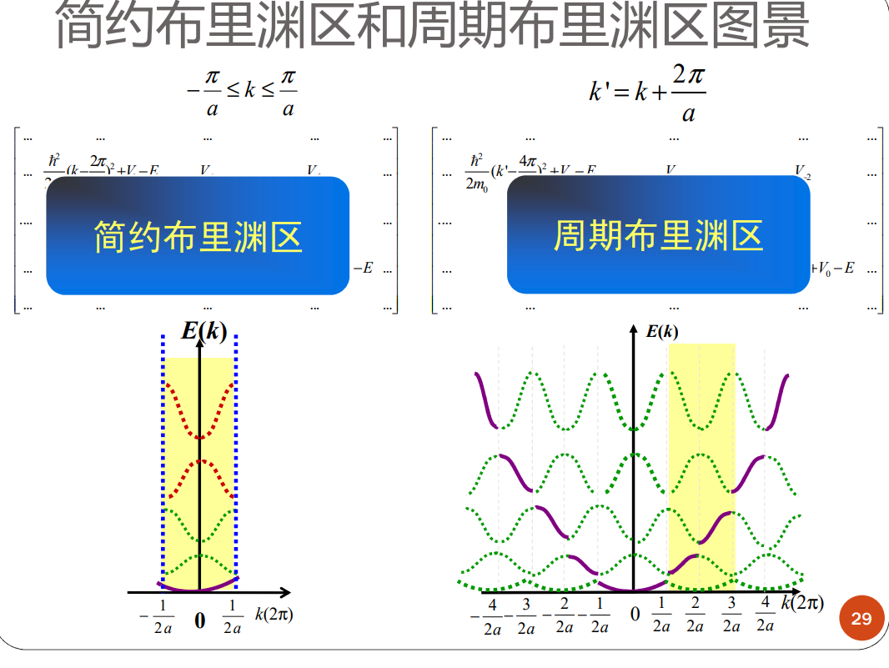

#### 一维近自由电子近似

利用微扰求解薛定谔方程

零级哈密顿量是自由电子的哈密顿量(索末菲模型),周期性势场的作用看成是微扰
适用于解释参与共有化运动的外层价电子的运动状态

$$
H=-\frac{\hbar^2}{2m_0}\frac{d^2}{dx^2}+V(x)=H_0+H^{\prime}\\
V(x)=\overline{V}+\sum_{n\neq0}V_nexp\biggl[i\frac{2\pi}anx\biggr]
$$

$$
\begin{aligned}&H_0=-\frac{\hbar^2}{2m_0}\frac{d^2}{dx^2}+\overline{V}\\&H'=\sum_{n\neq0}V_n\exp\left(i\frac{2\pi nx}a\right)\end{aligned}
$$

基态（零级解）

$$
E_k^0=\frac{\hbar^2k^2}{2m_0}+\overline{V}\\
\psi_k^{(0)}=\frac1{\sqrt{L}}e^{ikx}
$$

$$
k=\frac{2\pi l_x}{Na}
$$

利用波恩卡曼条件看作准连续。

周期性势场的一级微扰

$$
\Delta V=\sum_{n\neq0}V_nexp\biggl[i\frac{2\pi}{a}nx\biggr]
$$

一级修正：

$$
E_k^{(1)}=\int\left(\psi_k^0\right)^*[\Delta V]\psi_k^0dx=\left\langle k|\Delta V|k\right\rangle=0
$$

二级修正：

$$
E_k^{(2)}=\sum_{k^{\prime}}\frac{\left|\left\langle k^{\prime}|\Delta V|k\right\rangle\right|^2}{E_k^0-E_{k^{\prime}}^0}
$$

非简并情况下：

$$
E_k^{(2)}=\sum_{n\neq0}\frac{\left|V_n\right|^2}{\frac{\hbar^2}{2m_0}\left[k^2-\left(k+\frac{2\pi}an\right)^2\right]}
$$

k’对应的波可以看作k状态波在周期性势场各频率分量对应的散射波->自由电子波函数经过周期势场的散射后改变了原有的能量。

波函数的一级修正

$$
\psi_k=\frac1{\sqrt{L}}e^{ikx}\left\{1+\sum_{n=0}\frac{V_n}{\frac{\hbar^2}{2m_0}\left[k^2-\left(k+\frac{2\pi n}a\right)^2\right]}\cdot exp\left[i\frac{2\pi}anx\right]\right\}
$$

$$
\vec{\psi(r)}=e^{i\vec{k}\cdot\vec{r}}\vec{u(r)}
$$

被周期函数调幅的平面波。

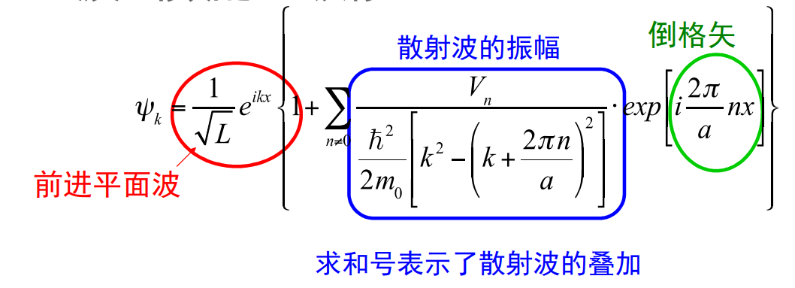

如果 k 的取值在布里渊区边界 $k=-\frac{n\pi}a$，散射波矢$k’=k+\frac{2\pi n}a=\frac{\pi n}a$，即布拉格定律 $2dsin\theta=n\lambda$。此时电子的波函数是 $k$ 和 $k'$ 两个平面波叠加的驻波。

简并状态的处理方法

在布里渊区边界，存在简并状态，能量相等。

### 准经典运动

引入准经典粒子——波包

自由电子和晶体电子速度的定义：

$$
v(k_0) = \frac1\hbar \bigg[\frac{d E(k)}{dk}\bigg]_{k_0}\\
E(k) = \hbar\omega
$$

速度方向垂直于等能面，如果等能面为球面， 速度的方向与 $k$ 相同。

晶体电子的加速度

$$
\hbar\frac{dk}{dt} = F
$$

由此定义电子的准动量（晶体动量）为 $\hbar k$。可定义有效质量：

$$
\frac{d\upsilon_a}{dt}=\frac1{\hbar^2}\sum_\beta F_\beta\cdot\frac{\partial^2}{\partial k_\beta\partial k_\alpha}E(k)\\
\frac{d\vec{\upsilon}}{dt}=\frac1{m_0}\vec{F}
$$

有效质量的“倒数”（矩阵的逆）：

$$
\frac1{m_{\alpha\beta}^*}=\frac1{\hbar^2}\frac{\partial^2E}{\partial k_\alpha\partial k_\beta}
$$

$$
\begin{pmatrix}\dot{\nu}_x\\\dot{\nu}_y\\\dot{\nu}_z\end{pmatrix}=\dfrac{1}{\hbar^2}\begin{pmatrix}\dfrac{\partial^2E}{\partial k_x^2}&\dfrac{\partial^2E}{\partial k_x\partial k_y}&\dfrac{\partial^2E}{\partial k_x\partial k_z}\\\dfrac{\partial^2E}{\partial k_y\partial k_x}&\dfrac{\partial^2E}{\partial k_y^2}&\dfrac{\partial^2E}{\partial k_y\partial k_z}\\\dfrac{\partial^2E}{\partial k_z\partial k_x}&\dfrac{\partial^2E}{\partial k_z\partial k_y}&\dfrac{\partial^2E}{\partial k_z^2}\end{pmatrix}\begin{pmatrix}F_x\\F_y\\F_z\end{pmatrix}
$$

选取 $(k_x, k_y, k_z)$ 的主轴方向时

$$
\begin{pmatrix}\dot{\nu}_x\\\dot{\nu}_y\\\dot{\nu}_z\end{pmatrix}=\dfrac{1}{\hbar^2}\begin{pmatrix}\dfrac{\partial^2E}{\partial k_x^2}&0&0\\0&\dfrac{\partial^2E}{\partial k_y^2}&0\\\\0&0&\dfrac{\partial^2E}{\partial k_z^2}\end{pmatrix}\begin{pmatrix}F_x\\F_y\\F_z\end{pmatrix}
$$

注意：各方向上的有效质量一般不同

(1) 质量是标量，而有效质量是张量
晶体中的电子，加速度和外力的方向可以不一致
 (2)质量常值，有效质量是变值，有正有负
能带顶附近<0 能带底附近>0
有效质量$m^{*}$与电子质量$m$之间可以有很大的差别， 因为有效质量中实际包含了周期势场的作用

晶体所表现出来的有效质量，原因在于电子波在晶体中传播时与晶格交换动量。

正有效质量状态出现在能带底附近，体现电子从外场获得的动量，加速度为正。

 负有效质量状态出现在能带顶附近，由电子从外场获得动量不足以弥补与晶格的碰撞，加速度为负。

#### 恒定电场下运动

在周期布里渊图景；

在 $k$ 空间里匀速运动

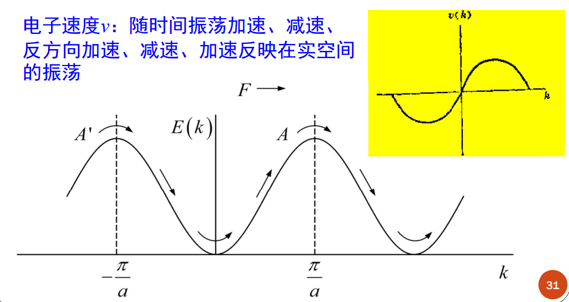

在实际空间中，电子的运动相当复杂：

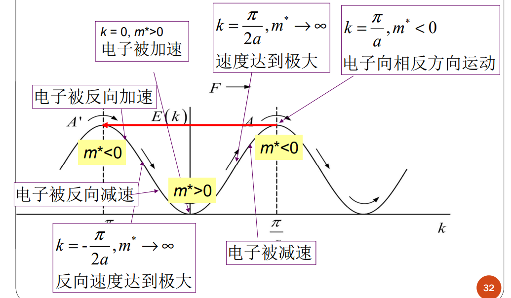

质量无穷大：驻波解。

拐点不一定是 $\pi/2a$，结合实际情况。

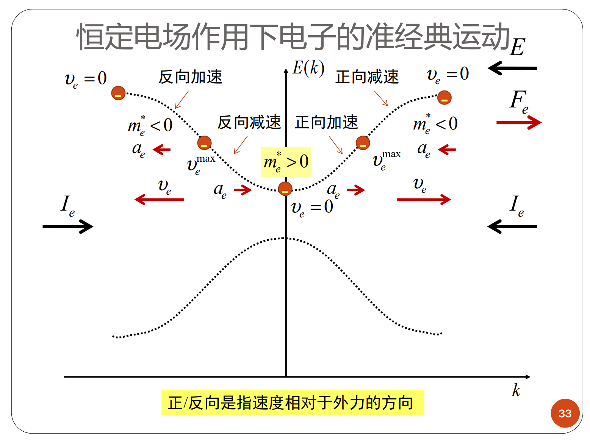

理想情况（无散射），电子的运动产生震荡的电流。

实际情况下，很难观察到来回震荡。

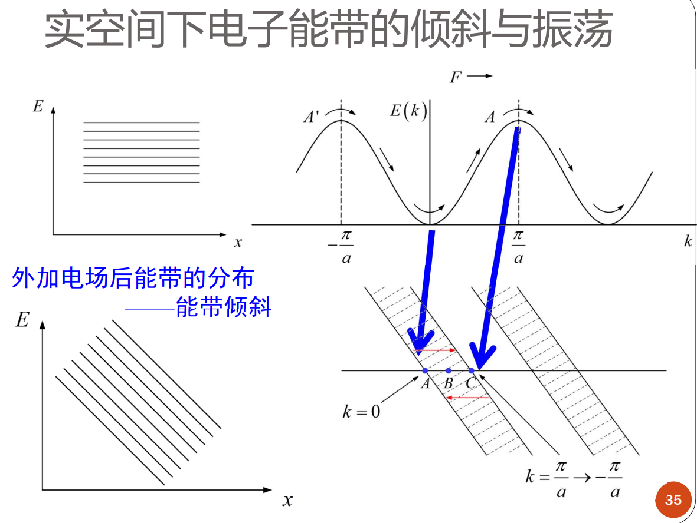

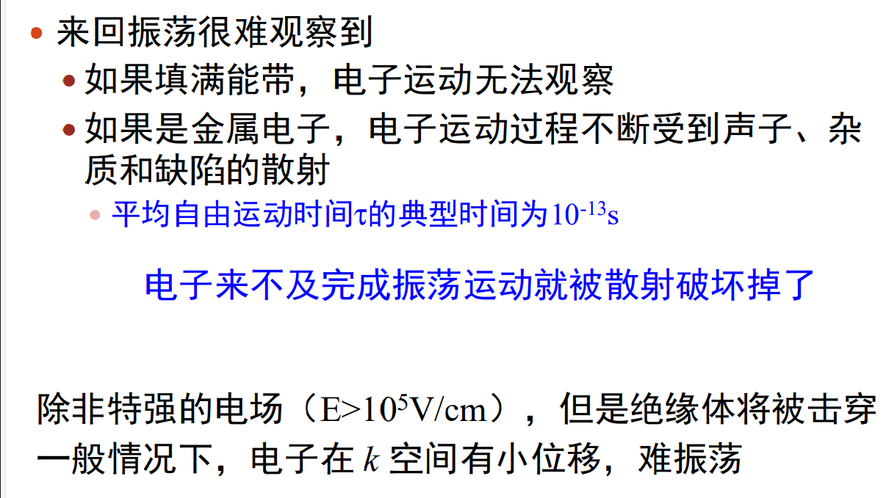

实际情况：带隙部分反射

存在势垒穿透

隧穿几率：

$$
f\propto E\exp\left[-\frac{\pi^2}\hbar\left(2m_0E_g\right)^{1/2}\left(\frac{E_g}{qE}\right)\right]
$$

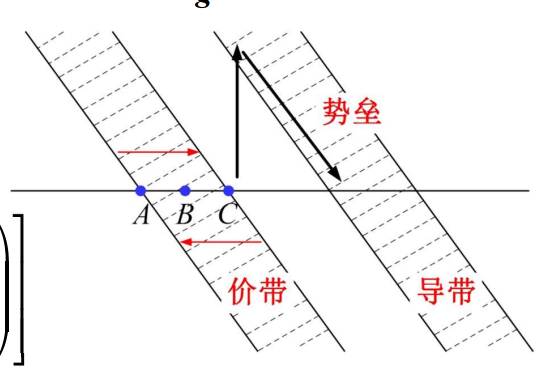

准经典运动只适合描述弱电场下电子在同一能带中的运动。

### 导体、绝缘体和半导体的能带解释

#### 满带不导电

不加电场：$E(k)=E(-k)$，占据正反方向波矢的概率相等， 相反速度的电子数量也相等，相互抵消；

加电场：k空间里匀速移动，边界上移出的粒子和移入的粒子是一样的，仍然均匀填充。

#### 部分填充能带产生电流

无外场：净电流为0

有外场：k空间分布向一方移动，有净电流

#### 导体的能带模型

部分填充的能带称为导带

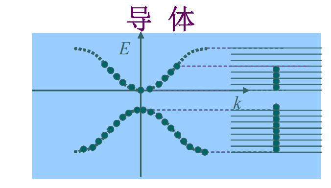

#### 非导体的能带模型

电子恰好填满最低的一系列能带，再高的能带全空

满带不导电，空带也不导电

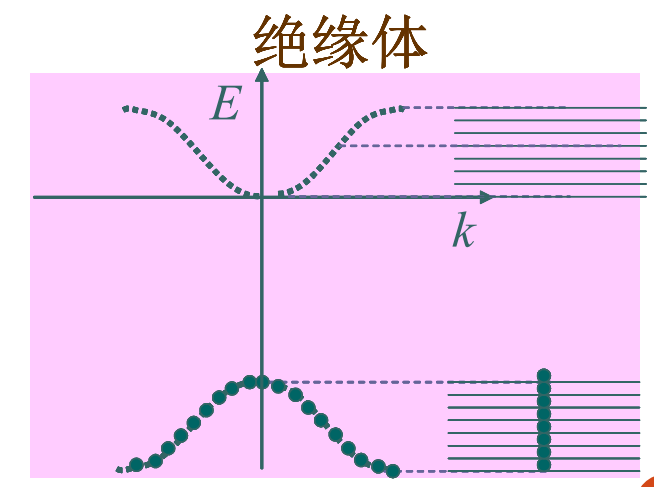

最高的满带的电子容易被激发到上面的空带，从而使两个带皆变成未满带，产生一定的导电性

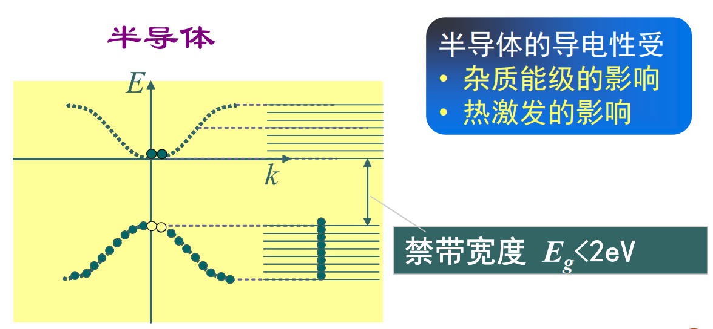

总结：

#### 半导体能带模型

常温下，T=0K时的满带电子容易被激发到上面的空带，
从而使两个带皆变成未满带，产生一定的导电性

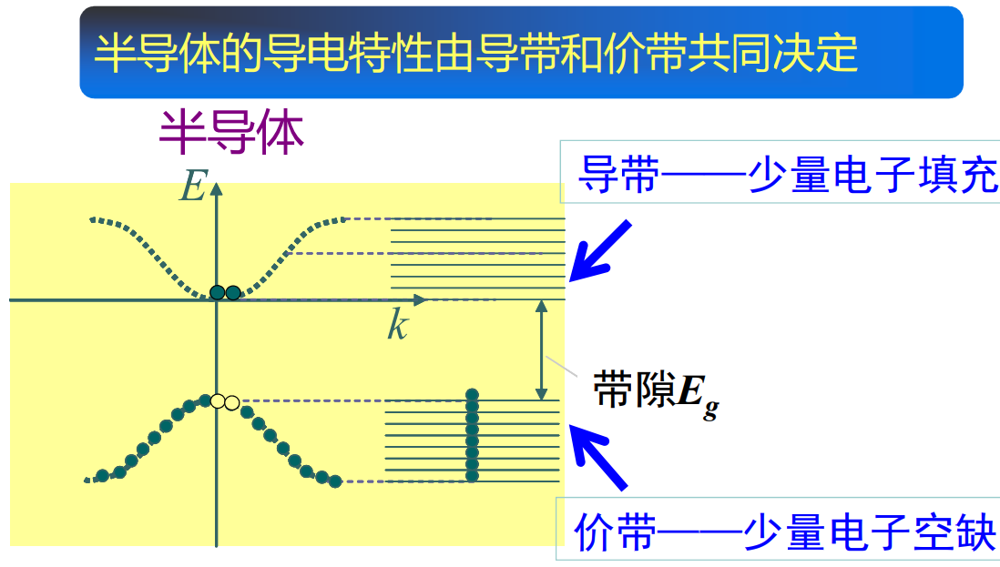

近满带和空穴

* 速度是电子的速度
* 但电荷为正

空穴的波矢：

空穴的有效质量，在能带顶部为k_\mathrm{h}=-k_\mathrm{e}

正：

$$
\frac1{m_h^*}=-\left(\frac1{\hbar^2}\cdot\frac{d^2E}{dk^2}\right)
$$

## 金属和半导体中的输运过程

### 金属中的电子输运过程

各向同性晶体中的电导率：

$$
\sigma_0=\frac{ne^2\tau\left(E_F\right)}{m^*}
$$

1. 电子的质量 →有效质量 (能带理论的必然结果)
2. 弛豫时间只由费米面附近的电子状态决定(量子统计的结果)

### 半导体电子输运过程

E-k 关系：

考虑三维能带的顶部和底部的 E-k 关系，并引入有效质量得到抛物线近似：

$$
E\left(k\right)=E\left(k_0\right)+\frac{\hbar^2\left(k_x-k_{0x}\right)^2}{2m_x^*}+\frac{\hbar^2\left(k_y-k_{0y}\right)^2}{2m_y^*}+\frac{\hbar^2\left(k_z-k_{0z}\right)^2}{2m_z^*}
$$

间接带隙：价带的顶部和导带的底部并不是同一个简约波矢k

直接带隙：价带的顶部和导带的底部是同一个简约波矢k

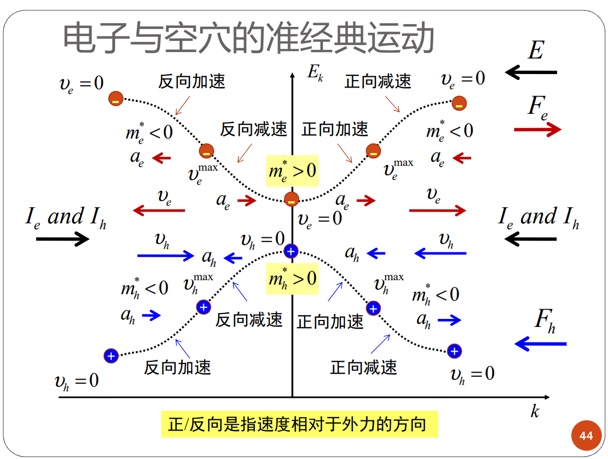

近似成自由电子：

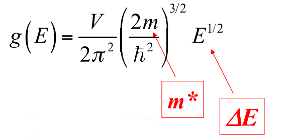

将自由电子的质量替换为：电子或空穴的有效质量

将自由电子的能量替换为：与导带底或价带顶的能量差

$E_-$: 电子的；$E_+$：空穴的。

$$
N_-(E)=\frac{4\pi(2m_-^*)^{3/2}}{h^3}\sqrt{(E-E_-)}\\N_+(E)=\frac{4\pi(2m_+^*)^{3/2}}{h^3}\sqrt{(E_+-E)}
$$

费米能量应在 $E_-$ 和 $E_+$ 之间。

$$
f(E)=\frac1{e^{(E-E_F)/k_BT}+1}\approx e^{-(E-E_F)/k_BT}<<1
$$

据此计算电子的浓度：

$$
\begin{aligned}
&n=\int_{E_-}^\infty f(E)N_-(E)dE \\
&=\frac{4\pi(2m_-^*)^{3/2}}{h^3}\int_{E_-}^\infty e^{-(E-E_F)/k_BT}\sqrt{(E-E_-)}dE \\
&=\frac{4\pi(2m_-^*)^{3/2}}{h^3}e^{-(E_--E_F)/k_BT}\int_{E_-}^\infty e^{-(E-E_-)/k_BT}\sqrt{(E-E_-)}dE \\
&=\frac{4\pi(2m_-^*k_BT)^{3/2}}{h^3}e^{-(E_--E_F)/k_BT}\int_0^\infty\xi^{1/2}e^{-\xi}d\xi  \\
&=\frac{2(2\pi m_-^*k_BT)^{3/2}}{h^3}e^{-(E_--E_F)/k_BT}=N_-e^{-(E_--E_F)/k_BT}
\end{aligned}
$$

$N_-$ 为有效能级密度。

空穴的浓度：

$$
\begin{aligned}
&p=\int_{-\infty}^{E_+}(1-f(E))N_+(E)dE \\
&=\frac{4\pi(2m_+^*)^{3/2}}{h^3}\int_{-\infty}^{E_+}e^{-(E_F-E)/k_BT}\sqrt{(E_+-E)}dE \\
&=N_+e^{-(E_F-E_+)/k_BT}
\end{aligned}
$$

$$
N_+=\frac{2(2\pi m_+^*k_BT)^{3/2}}{h^3}
$$

在计算价带空穴数时可以等效地用价带顶能级E+代替整个价带，价带的空穴数就如同在价带顶E+处集中了N+个能态所含有的空穴数

反直觉的事实：电子浓度与空穴浓度的乘积仅与禁带宽度和温度有关，与费米能级无关。温度一样，电子浓度越高，空穴浓度就越低。

$$
np=N_-N_+exp\biggl(-\frac{E_--E_+}{k_BT}\biggr)=N_-N_+exp\biggl(-\frac{E_g}{k_BT}\biggr)
$$

#### 本征激发

无杂质及缺陷的半导体称为本征半导体

$$
n_i=n=p=\left(N_-N_+\right)^{1/2}e^{-E_g/2k_BT}
$$

电子数目与空穴数目相同。

$$
\begin{aligned}
&E_{Fi}=E_--k_BT\ln(N_-/n_i) \\
&=E_++k_BT\ln(N_+/n_i) \\
&=\frac12(E_-+E_+)+\frac12k_BT\ln(N_+/N_-) \\
&=\frac12(E_-+E_+)+\frac34k_BT\ln(m_+^*/m_-^*)
\end{aligned}
$$

多数半导体的密度分布和金属相反：导带能级密度更大， 价带的更小，也就是说 $N_+>N_-$，即随着温度的升高费米能级在上升。而金属，随着温度的升高，费米能级是下降的。

在一般情况下，由于$k_BT$较小，且$m_h*$和$m_e*$相差不大， 所以，本征半导体的费米能$E_{Fi}$近似地在带隙的中间。

#### 一般半导体

$E_F$ 升高，则电子浓度增大，空穴浓度减小。

通过掺杂来改变载流子的类型和浓度。

#### 杂质与杂质激发

掺杂形成了杂质能级，只在掺杂原子局部地区存在。

处在杂质能级的电子实际上处于束缚态，只在掺杂原子附近存在，对导电性没有贡献。所以，电子从杂质原子跑出来，并不会形成“空穴”，这些“空穴”处于束缚态，并不会导电。

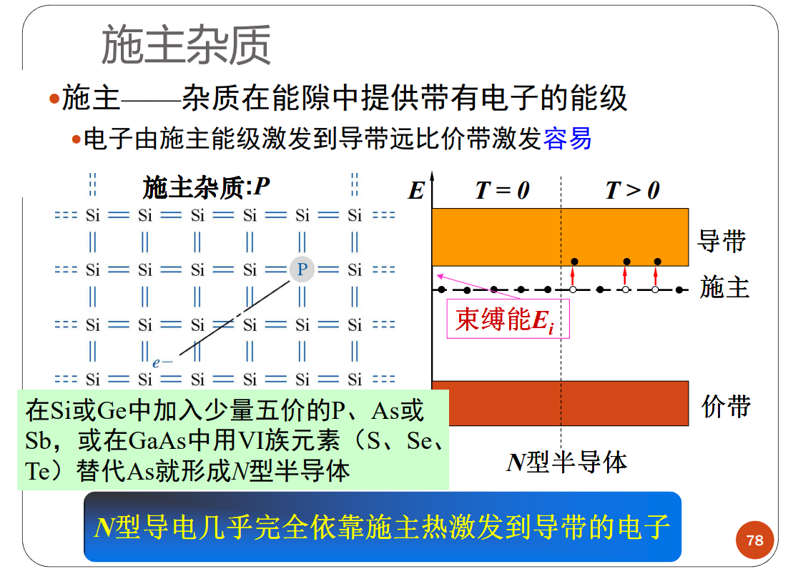

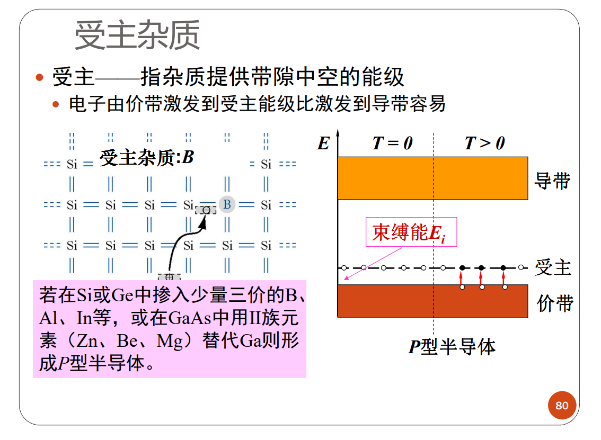

浅能级杂质

- 上述由替位杂质所形成的施主和受主
- 能级靠近导带或价带，又称为浅能级杂质
- 杂质能级对电子或空穴的束缚能很小
- 电子很容易从施主能级跃迁或跃迁到受主能级
- 载流子将以杂质跃迁产生为主

深能级杂质

 大多数是多重能级
o 如Au在硅中，有施主能级也有受主能级
o 金为1价，施主能级靠近价带(!)，受主能级靠近禁带中部(!)
 深能级杂质附加势作用距离短，1～2个原子
 深能级杂质和缺陷影响
o 有效的复合中心，降低载流子寿命
o 做补偿杂质，提高材料电阻率

施主杂质激发

假设N型半导体只含一种施主,浓度$N_D$,能级$E_D$

那么导带中电子数目显然与空的施主能级的数目相等

$$
n=N_D[1-f(E_D)]=N_D\left[\frac{e^{(E_D-E_F)/k_BT}}{e^{(E_D-E_F)/k_BT}+1}\right]=N_D\frac1{1+e^{-(E_D-E_F)/k_BT}}
$$

$E_F$ 在掺杂半导体里求不出来，因此尝试消去它，得到：

温度很低时（$E_i >> k_BT$），少量施主电离激发电子

$$
n\approx\frac{\left[4\left(\frac{N_D}{N_-}\right)e^{E_i/k_BT}\right]^{1/2}}{\left(\frac2{N_-}\right)e^{E_i/k_BT}}=\left(N_-N_D\right)^{1/2}e^{-E_i/2k_BT}
$$

温度很高时（$E_i >> k_BT$），全部施主电离激发电子

$$
\begin{aligned}n=&\frac{-1+\left[1+2{\left(\frac{N_D}{N_-}\right)}e^{E_i/k_BT}+...\right]}{\frac2{N_-}e^{E_i/k_BT}}\approx N_D\\\end{aligned}
$$

一般室温下热激发到导带的电子数也符合上式，按指数关系随温度升高而增加 （慎用！）

空穴的浓度是

$$
p = (n_i)^2/n
$$

费米能级

$$
\begin{aligned}
E_{F}& =E_--k_BT\ln(N_-/n)  \\
&=E_{Fi}+k_BT\ln(n/n_i)
\end{aligned}
$$

施主杂质的浓度越高，费米能级越靠近导带

受主类似：

温度很低时（$E_i >> k_BT$）

$$
p\thickapprox\left(N_AN_+\right)^{1/2}e^{-E_i/2k_BT}
$$

温度很高时（$E_i << k_BT$）

$$
p\approx N_A
$$

$$
\begin{aligned}&E_F=E_++k_BT\ln(N_+/p)\\&=E_{Fi}-k_BT\ln(p/n_i)\end{aligned}
$$

受主杂质的浓度越高，费米能级越靠近价带

考虑施主和受主能级简并和电子自旋取向时引入施主和受主能级基态简并因子gD和gA。

$$
n=\frac{-1+\left[1+4\left(\frac{g_DN_D}{N_-}\right)e^{E_i/k_\mathrm{B}T}\right]^{1/2}}{2\left(\frac{g_D}{N_-}\right)e^{E_i/k_\mathrm{B}T}}\\p=\frac{-1+\left[1+4\left(\frac{g_AN_A}{N_+}\right)e^{E_i/k_\mathrm{B}T}\right]^{1/2}}{2\left(\frac{g_A}{N_+}\right)e^{E_i/k_\mathrm{B}T}}
$$

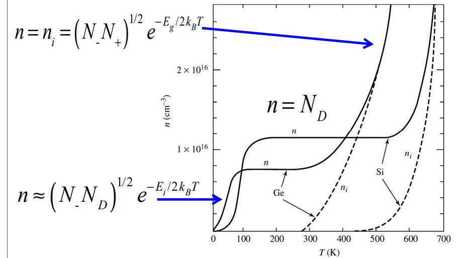

中间的平台区域意味着施主已经给出了所有电子。

在足够高的温度下，由满带到导带的电子激发（本征激发）将成为主要的。

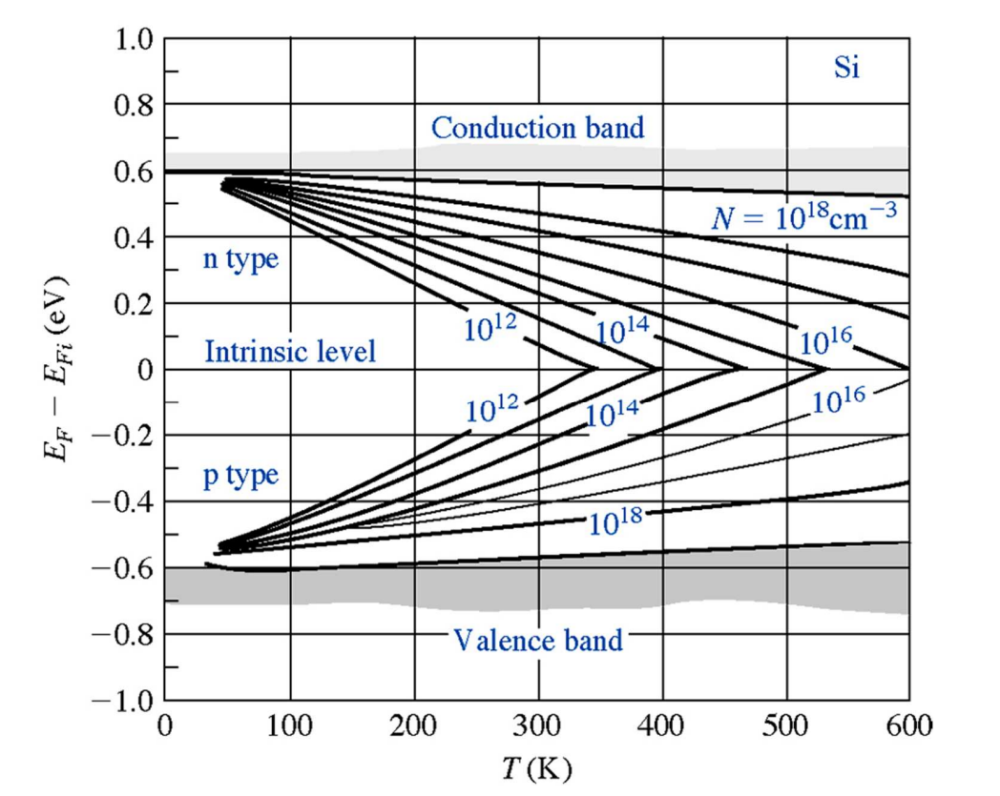

在足够高的温度下，费米能级同样也接近本征费米能级。

以上讨论的是非简并半导体。

对于简并半导体，不能再使用玻尔兹曼分布，只能使用费米-狄拉克分布。

#### 补偿半导体的载流子浓度

完全电离条件下

$$
n_0+N_a=p_0+N_d\\
p_0 = n_i^2/n_0
$$

$$
n_0=\frac{(N_d-N_a)}2+\sqrt{\left(\frac{(N_d-N_a)}2\right)^2+n_i^2}\\
p_0=\frac{(N_a-N_d)}2+\sqrt{\left(\frac{(N_d-N_a)}2\right)^2+n_i^2}
$$

n-type 和 p-type 的效果可以相互抵消。

由于补偿半导体中掺有两种杂质，所以会产生杂质的补偿作用，从而其中能够参加导电的多数载流子，就只有由那些未被补偿的杂质来提供；因此补偿半导体中有效的载流子浓度很小，故电阻率很高。虽然补偿半导体的电阻率很高，但它**不同于未掺杂的本征半导体。**

总的杂质浓度

$$
N_{doping}{=}N_A{+}N_D
$$

### 载流子的迁移（漂移）运动

迁移率 $\mu$：单位电场下载流子的平均漂移速度

$$
\sigma=nq\mu 
$$

$$
j=nq\left(\mu E\right)\\
\sigma=\frac{nq^2\tau}{m^*}=nq\frac{q\tau}{m^*}=nq\mu\\
\mu=\frac{q\tau}{m^*}
$$

$$
\sigma=nq\mu_-+pq\mu_+

$$

多子导电：

$$
\sigma\approx\begin{cases}nq\mu_-&(n\text{型 })\\pq\mu_+&(p\text{型 })&\end{cases}
$$

迁移率决定于有效质量以及平均弛豫时间

$$
\mu_-=\frac{q\tau_{cn}}{m_-^*}\quad\mu_+=\frac{q\tau_{cp}}{m_+^*}
$$

在低温下，杂质的散射是主要的。温度升高时载流子热运动的速度增大，电离杂质的散射作用相应减弱，从而使迁移率增大。

在较高温度下，晶格的散射是主要的，温度升高，声子的散射增大，因而迁移率随温度的升高而下降。

半导体的电导率σ除了与迁移率有关外，还与载流子的浓度有关。而载流子的浓度随温度的升高以指数形式增加（饱和区除外）。因此除饱和区外，电导率主要以指数形式随温度的升高而迅速增大，表现出很强的热敏性。但是，不是温度越高就越好的，温度升高后，掺杂的特性就没了，导电能力主要由本征激发决定，相当于半导体退化成了一块普通的电阻，也没有什么 PN 结了。

这与金属的电导率有明显不同。因为金属的载流子（电子或空穴）浓度与温度无关，温度升高时，传导电子的迁移率因与声子的碰撞更加频繁而减小，所以金属的导电率温度系数为负，温度升高，电导率下降。
