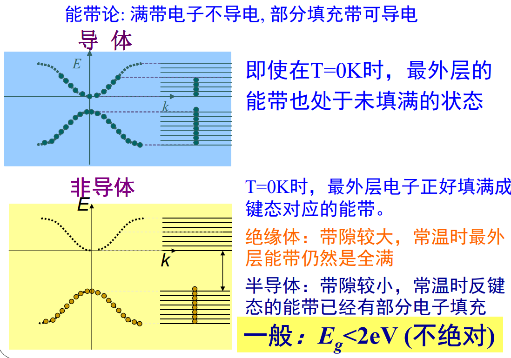

## 外场中电子运动状态的变化

### 布洛赫电子

#### 布洛赫定理

$$
\psi(x+R_n)=e^{ik\cdot R_n}\psi(x)
$$

布洛赫波函数：

$$
\boxed{\vec{\psi(r)}=e^{i\vec{k}\cdot\vec{r}}\vec{u(r)}}
$$

薛定谔方程在周期势场 $V(r)$的本征解。与 $V(r)$有相同的周期。

简约布里渊区和周期布里渊区图景

#### 一维近自由电子近似

利用微扰求解薛定谔方程

零级哈密顿量是自由电子的哈密顿量(索末菲模型),周期性势场的作用看成是微扰
适用于解释参与共有化运动的外层价电子的运动状态

$$
H=-\frac{\hbar^2}{2m_0}\frac{d^2}{dx^2}+V(x)=H_0+H^{\prime}\\
V(x)=\overline{V}+\sum_{n\neq0}V_nexp\biggl[i\frac{2\pi}anx\biggr]
$$

$$
\begin{aligned}&H_0=-\frac{\hbar^2}{2m_0}\frac{d^2}{dx^2}+\overline{V}\\&H'=\sum_{n\neq0}V_n\exp\left(i\frac{2\pi nx}a\right)\end{aligned}
$$

基态（零级解）

$$
E_k^0=\frac{\hbar^2k^2}{2m_0}+\overline{V}\\
\psi_k^{(0)}=\frac1{\sqrt{L}}e^{ikx}
$$

$$
k=\frac{2\pi l_x}{Na}
$$

利用波恩卡曼条件看作准连续。

周期性势场的一级微扰

$$
\Delta V=\sum_{n\neq0}V_nexp\biggl[i\frac{2\pi}{a}nx\biggr]
$$

一级修正：

$$
E_k^{(1)}=\int\left(\psi_k^0\right)^*[\Delta V]\psi_k^0dx=\left\langle k|\Delta V|k\right\rangle=0
$$

二级修正：

$$
E_k^{(2)}=\sum_{k^{\prime}}\frac{\left|\left\langle k^{\prime}|\Delta V|k\right\rangle\right|^2}{E_k^0-E_{k^{\prime}}^0}
$$

非简并情况下：

$$
E_k^{(2)}=\sum_{n\neq0}\frac{\left|V_n\right|^2}{\frac{\hbar^2}{2m_0}\left[k^2-\left(k+\frac{2\pi}an\right)^2\right]}
$$

k’对应的波可以看作k状态波在周期性势场各频率分量对应的散射波->自由电子波函数经过周期势场的散射后改变了原有的能量。

波函数的一级修正

$$
\psi_k=\frac1{\sqrt{L}}e^{ikx}\left\{1+\sum_{n=0}\frac{V_n}{\frac{\hbar^2}{2m_0}\left[k^2-\left(k+\frac{2\pi n}a\right)^2\right]}\cdot exp\left[i\frac{2\pi}anx\right]\right\}
$$

$$
\vec{\psi(r)}=e^{i\vec{k}\cdot\vec{r}}\vec{u(r)}
$$

被周期函数调幅的平面波。

如果 k 的取值在布里渊区边界 $k=-\frac{n\pi}a$，散射波矢$k’=k+\frac{2\pi n}a=\frac{\pi n}a$，即布拉格定律 $2dsin\theta=n\lambda$。此时电子的波函数是 $k$ 和 $k'$ 两个平面波叠加的驻波。

简并状态的处理方法

在布里渊区边界，存在简并状态，能量相等。

### 准经典运动

引入准经典粒子——波包

自由电子和晶体电子速度的定义：

$$
v(k_0) = \frac1\hbar \bigg[\frac{d E(k)}{dk}\bigg]_{k_0}\\
E(k) = \hbar\omega
$$

速度方向垂直于等能面，如果等能面为球面， 速度的方向与 $k$ 相同。

晶体电子的加速度

$$
\hbar\frac{dk}{dt} = F
$$

由此定义电子的准动量（晶体动量）为 $\hbar k$。可定义有效质量：

$$
\frac{d\upsilon_a}{dt}=\frac1{\hbar^2}\sum_\beta F_\beta\cdot\frac{\partial^2}{\partial k_\beta\partial k_\alpha}E(k)\\
\frac{d\vec{\upsilon}}{dt}=\frac1{m_0}\vec{F}
$$

有效质量的“倒数”（矩阵的逆）：

$$
\frac1{m_{\alpha\beta}^*}=\frac1{\hbar^2}\frac{\partial^2E}{\partial k_\alpha\partial k_\beta}
$$

$$
\begin{pmatrix}\dot{\nu}_x\\\dot{\nu}_y\\\dot{\nu}_z\end{pmatrix}=\dfrac{1}{\hbar^2}\begin{pmatrix}\dfrac{\partial^2E}{\partial k_x^2}&\dfrac{\partial^2E}{\partial k_x\partial k_y}&\dfrac{\partial^2E}{\partial k_x\partial k_z}\\\dfrac{\partial^2E}{\partial k_y\partial k_x}&\dfrac{\partial^2E}{\partial k_y^2}&\dfrac{\partial^2E}{\partial k_y\partial k_z}\\\dfrac{\partial^2E}{\partial k_z\partial k_x}&\dfrac{\partial^2E}{\partial k_z\partial k_y}&\dfrac{\partial^2E}{\partial k_z^2}\end{pmatrix}\begin{pmatrix}F_x\\F_y\\F_z\end{pmatrix}
$$

选取 $(k_x, k_y, k_z)$ 的主轴方向时

$$
\begin{pmatrix}\dot{\nu}_x\\\dot{\nu}_y\\\dot{\nu}_z\end{pmatrix}=\dfrac{1}{\hbar^2}\begin{pmatrix}\dfrac{\partial^2E}{\partial k_x^2}&0&0\\0&\dfrac{\partial^2E}{\partial k_y^2}&0\\\\0&0&\dfrac{\partial^2E}{\partial k_z^2}\end{pmatrix}\begin{pmatrix}F_x\\F_y\\F_z\end{pmatrix}
$$

注意：各方向上的有效质量一般不同

(1) 质量是标量，而有效质量是张量
晶体中的电子，加速度和外力的方向可以不一致
 (2)质量常值，有效质量是变值，有正有负
能带顶附近<0 能带底附近>0
有效质量$m^{*}$与电子质量$m$之间可以有很大的差别， 因为有效质量中实际包含了周期势场的作用

晶体所表现出来的有效质量，原因在于电子波在晶体中传播时与晶格交换动量。

正有效质量状态出现在能带底附近，体现电子从外场获得的动量，加速度为正。

 负有效质量状态出现在能带顶附近，由电子从外场获得动量不足以弥补与晶格的碰撞，加速度为负。

#### 恒定电场下运动

在周期布里渊图景；

在 $k$ 空间里匀速运动

在实际空间中，电子的运动相当复杂：

质量无穷大：驻波解。

拐点不一定是 $\pi/2a$，结合实际情况。

理想情况（无散射），电子的运动产生震荡的电流。

实际情况下，很难观察到来回震荡。

实际情况：带隙部分反射

存在势垒穿透

隧穿几率：

$$
f\propto E\exp\left[-\frac{\pi^2}\hbar\left(2m_0E_g\right)^{1/2}\left(\frac{E_g}{qE}\right)\right]
$$

准经典运动只适合描述弱电场下电子在同一能带中的运动。

### 导体、绝缘体和半导体的能带解释

#### 满带不导电

不加电场：$E(k)=E(-k)$，占据正反方向波矢的概率相等， 相反速度的电子数量也相等，相互抵消；

加电场：k空间里匀速移动，边界上移出的粒子和移入的粒子是一样的，仍然均匀填充。

#### 部分填充能带产生电流

无外场：净电流为0

有外场：k空间分布向一方移动，有净电流

#### 导体的能带模型

部分填充的能带称为导带

#### 非导体的能带模型

电子恰好填满最低的一系列能带，再高的能带全空

满带不导电，空带也不导电

最高的满带的电子容易被激发到上面的空带，从而使两个带皆变成未满带，产生一定的导电性

总结：

#### 半导体能带模型

常温下，T=0K时的满带电子容易被激发到上面的空带，
从而使两个带皆变成未满带，产生一定的导电性

近满带和空穴

* 速度是电子的速度
* 但电荷为正

空穴的波矢：

$$
k_\mathrm{h}=-k_\mathrm{e}
$$

空穴的有效质量，在能带顶部为正：

$$
\frac1{m_h^*}=-\left(\frac1{\hbar^2}\cdot\frac{d^2E}{dk^2}\right)
$$
