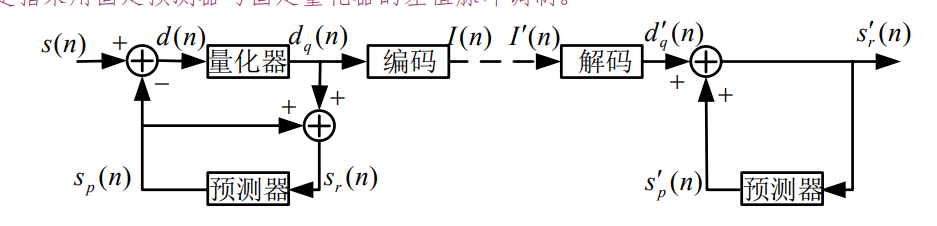
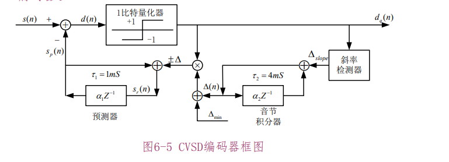
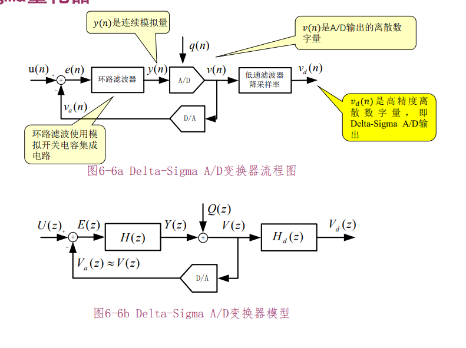
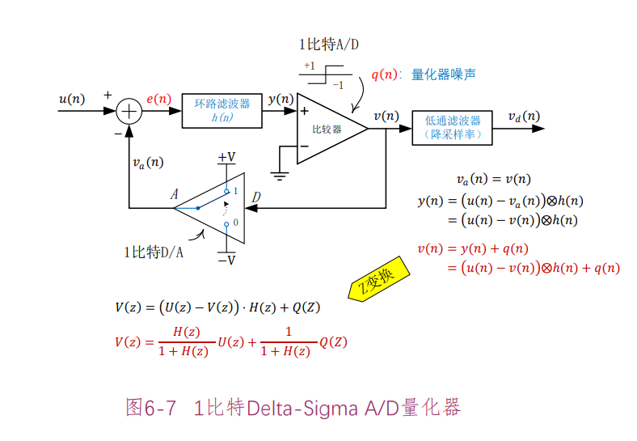
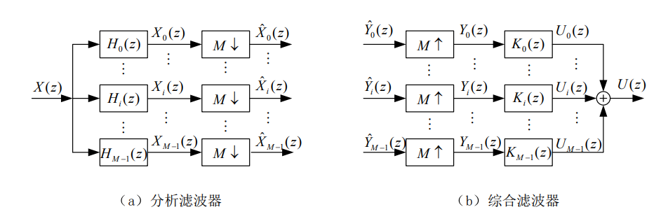
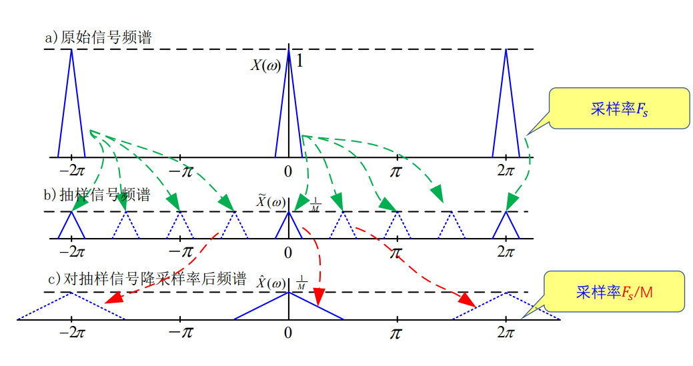
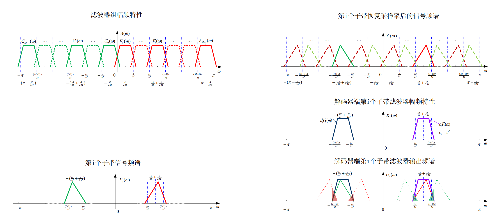
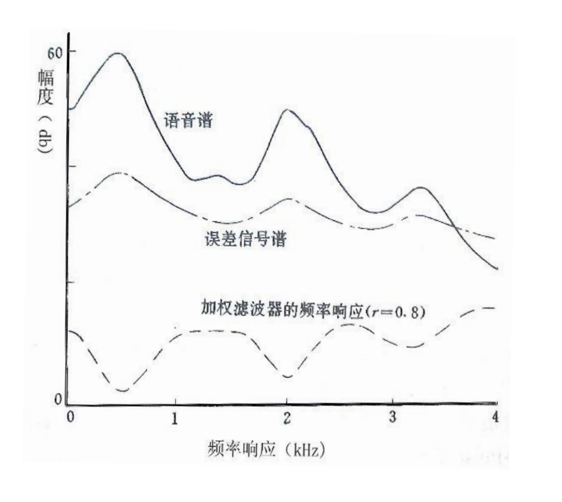
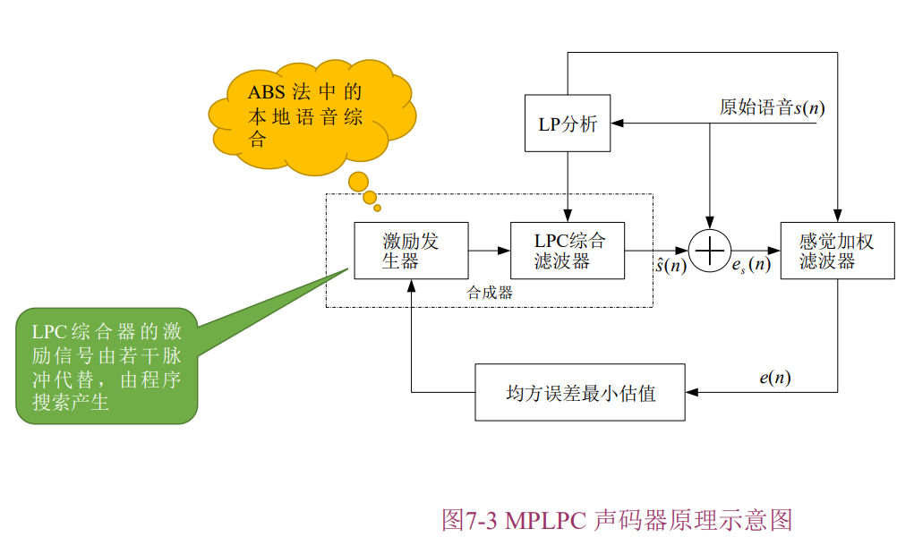

## 语音信号的线性预测编码技术

线性预测编码技术（维纳滤波）。可以参考隔壁统计信号处理的笔记hh。

维纳滤波的正交原理：

$$
E \langle x(n-k), e(n) \rangle = 0
$$

正交原理可以用来估计任何时候的任何值，不管是现在（滤波），过去（平滑）还是未来（预测），也不管估计的对象是 $x,y$，上述公式的含义是：估计误差始终与已知信号垂直，与估计的是哪个时间的信号无关。

利用前面的 $P$ 个信号预测下一个信号：

$$
\hat{s}(n)=-\sum_{i=1}^{P^{\prime}}\hat{\alpha}_i\cdot s(n-i)
$$

误差定义为

$$
\begin{aligned}
\varepsilon(n)& =s(n)-\overset{\wedge}{\operatorname*{s}}(n)=s(n)+\sum_{i=1}\widehat{\alpha}_i\cdot s(n-i)  \\
&=\sum_{i=0}^{P^{\prime}}\widehat{\alpha}_i\cdot s(n-i)
\end{aligned}
$$

从 z 域看，这是一个全极点模型产生了目标信号：

$$
S(z) = -S(z)\sum\limits_{i=1}^{P}\alpha_iz^{-i} + E(z)
$$

接下来的所有步骤，目的都是推导 $\alpha$ 的取值。

### 自相关法

本文中假设信号具有遍历性，即时间平均等于统计平均，时间上的自相关等于统计意义上的自相关。

利用 LMMSE 准则可以推出

$$
\begin{bmatrix}R(0)&R(1)&R(2)&\cdots&R(P-1)\\R(1)&R(0)&R(1)&\cdots&R(P-2)\\R(2)&R(1)&R(0)&\cdots&R(P-3)\\\vdots&\vdots&&&\vdots\\R(P-1)&R(P-2)&\cdots&\cdots&R(0)\end{bmatrix}\cdot\begin{bmatrix}\hat\alpha_1\\\hat\alpha_2\\\vdots\\\vdots\\\hat\alpha_P\end{bmatrix}=-\begin{bmatrix}R(1)\\R(2)\\\vdots\\\vdots\\R(P)\end{bmatrix}
$$

一个例子：Durbin 递推算法

### 协方差法

不能保证声码器稳定

### Durbin 递推算法

#### 滤波器的内积

定义$s_w(n)$关于$F(z)$和$G(z)$的内积如下：

$$
\langle F(z),G(z)\rangle=\sum_{-\infty}^{+\infty}u(n)\cdot v(n)
$$

特别地若这里的$F(z),\quad G(z)$都用我们的逆滤波器$A(z)=\sum_{i=0}^P\alpha_iZ^{-i}$替换，那么语音信号$s_w(n)$经过$A(z)$后的输出$e(n)$就是预测误差。

$\alpha_i\cdot s_W(n-i)$ 因此$A(z)$范数$\|A(z)\|$的平方就是预测误差。即

$$
\|A(z)\|^2=\langle A(z),A(z)\rangle=\sum_{-\infty}^{+\infty}e(n)\cdot e(n)=\sum_{-\infty}^{+\infty}e^2(n)
$$

内积有正定性，线性，三角不等式

特殊性质：

$$
\langle z^{-i}, z^{-j} \rangle = R(|i - j|)\\
\langle F(z), G(z) \rangle = \sum\limits_{i=0}^{M}\sum\limits_{j=0}^{M}f_ig_jR(|i - j|)\\
\langle F(z),G(z)\rangle=\left\langle z^kF(z),z^kG(z)\right\rangle\\
\langle F(z),G(z)\rangle=\langle F(1/z),G(1/z)\rangle
$$

#### 逆滤波器

定义FIR滤波器$\hat{A}(z)$:

$$
\hat{A}(z)=\sum_{i=0}^P\hat{\alpha}_iz^{-i}\quad,\quad\alpha_0=1
$$

若$\hat{\alpha}_{i}$是满足LPC正则方程的解，则称$\hat{A}(z)$称为逆滤波器。$\hat{E}(z)=\hat{A}(z)\cdot S(z)$是预测误差$\varepsilon(n)$的z 变换。显然有：

 (1) 若s(n)是由全极点模型$1/A(z)$产生的，这时$A(z)=\sum_{i=0}^P\alpha_iz^{-i}$, 即：

$s(n)=-\sum_{i=1}^P\alpha_is(n-i)+Ge(n)$

$$
S(z) \cdot A(z) = G \cdot E(z)
$$

#### 前向和后向预测

前向线性预测器(P阶)

$$
\hat{s}(n)=-\sum_{i=1}^P\alpha_i^{(P)}\cdot s(n-i)
$$

前向预测误差(P阶)

$$
\varepsilon_\alpha^{(P)}(n)=s(n)-\hat{s}(n)=\sum_{i=0}^P\alpha_i^{(P)}\cdot s(n-i)\:,\alpha_0^{(P)}=1
$$

前向逆滤波器(P阶)

$$
A^{(P)}(z)=\sum_{i=0}^P\alpha_i^{(P)}z^{-i}
$$

显然有

$$
E^{(P)}_\alpha(z) = S(z) \cdot A^{(P)}(z)
$$

后向线性预测器(P阶)

$$
\hat{s}(n-P-1)=-\sum_{i=1}^P\beta_i^{(P)}\cdot s(n-i)
$$

n时刻对$s(n-P-1)$的后向预测误差(P阶)

$$
\begin{aligned}&\varepsilon_{\beta}^{(P)}(n)=s(n-P-1)-\hat{s}(n-P-1)\\&=\sum_{i=1}^{P+1}\beta_i^{(P)}\cdot s(n-i)\quad,\quad\beta_{P+1}^{(P)}=1\end{aligned}
$$

后向逆滤波器 (P阶)

$$
B^{(P)}(z)=\sum_{i=1}^{P+1}\beta_i^{(P)}z^{-i}
$$

显然有

$$
E_\beta^{(P)}(z) = S(z) \cdot B^{(P)}(z)
$$

#### 正交性原理

判定最佳预测器的充要条件是

$$
\langle A^{(m)}(z), z^{-l} \rangle = 0\\
\langle B^{(m)}(z), z^{-l} \rangle = 0\\
l = 1, 2, \dots, m
$$

一个不严谨的理解：

$$
u(n) = s(n) * Z^{-1}[A(z)] = \varepsilon(n)\\
v(n) = s(n) * Z^{-1}[z^{-l}] = s(n - l)\\
\begin{align*}
    &\langle A^{(m)}(z), z^{-l} \rangle\\
    =&\sum\limits_{n=-\infty}^{\infty}u(n)v(n)\\
    =&\sum\limits_{n=-\infty}^{\infty}\varepsilon(n)s(n - l)\\
\end{align*}
$$

由于时间平均等于统计平均，

$$
\frac1{2N} \sum\limits_{n=-N}^{N - 1}\varepsilon(n)s(n-l) = E \langle \varepsilon(n), s(n-l) \rangle
$$

根据开头提到的维纳滤波正交原理可知上式等于0。

#### 递推公式

根据定义，当$m=0$时，显然有

$$
A^{(0)}(z)=1\\B^{(0)}(z)=z^{-1}
$$

$m>0$时有如下递推公式（施密特正交化）

$$
A^{(m)}(z)=A^{(m-1)}(z)+K^{(m)}B^{(m-1)}(z)
$$

$$
B^{(m)}(z)=z^{-1}\Big[B^{(m-1)}(z)+K^{(m)}A^{(m-1)}(z)\Big]
$$

$$
K^{(m)} = -\frac{\langle A^{(m-1)}(z), B^{(m-1)}(z)\rangle}{||B^{(m-1)}(z)||^2}
$$

根据正交性原理，需要证明由递推公式得到的$A^{(m)}(z)$和$B^{(m)}(z)$满足正交性条件公式。

 在公式(76) 中，根据多项式对应项系数相等的原则，可以得到

$$
\begin{aligned}&\alpha_{i}^{(m)}=\alpha_{i}^{(m-1)}+K^{(m)}\cdot\beta_{i}^{(m-1)}\quad,\quad i=1,\cdots,m-1\\&\alpha_{i}^{(m)}=K^{(m)}\quad,\quad i=m\end{aligned}
$$

由公式(73)可知

$$
\beta_j^{(m)}=\alpha_{m+1-j}^{(m)},\:j=1,\cdots,m+1
$$

> 从这里可以推出
>
> $$
> B^{(m)}(z) = z^{-(m+1)}A^{(m)}(1/z)
> $$

因此可以得到预测器系数的递推公式

$$
\begin{cases}\alpha_\mathrm{m}^{(\mathrm{m})}=\mathrm{K}^{(\mathrm{m})}\\\alpha_\mathrm{i}^{(\mathrm{m})}=\alpha_\mathrm{i}^{(\mathrm{m}-1)}+\mathrm{K}^{(\mathrm{m})}\cdot\alpha_\mathrm{m-i}^{(\mathrm{m}-1)}\quad,\:\mathrm{i}=1,\cdots,\mathrm{m}-1\end{cases}
$$

这是线性预测系数的Durbin递推算法公式。$m$阶部分相关系数$K^{(m)}$可以用以下方法计算：

$$
K^{(m)} = -\frac{\sum\limits_{j=1}^{m}\alpha_{m-j}^{(m-1)}R(j)}{||B^{(m-1)}(z)||^2}
$$

$||B^{(m)}(z)||^2$ 可以用这个递推式计算：

$$
\begin{Vmatrix}B^{(m)}(z)\end{Vmatrix}^2=(1-[K^{(m)}]^2)\begin{Vmatrix}B^{(m-1)}(z)\end{Vmatrix}^2
$$

初值

$$
||B^{(0)}(z)|| = R(0)\\
\alpha^{(0)}_0 = 1
$$

### Durbin 算法系统的稳定性

充分性：

$$
\frac{1}{A^{(m)}(z)} 稳定 \Rarr |k^{(m)}| < 1
$$

必要性：

$$
|k^{(m)}| < 1 \Rarr \frac{1}{A^{(m)}(z)} 稳定
$$

Highlight:

Durbin 逆序递推公式

$$
A^{(m-1)}(z)=\frac{A^{(m)}(z)-k^{(m)}zB^{(m)}(z)}{1-(k^{(m)})^2}
$$

证明过程中引入的一个辅助函数

$$
F^{(m)}(z)=\frac{A^{(m)}(z)}{zB^{(m)}(z)}=\frac{z^mA^{(m)}(z)}{A^{(m)}(1/z)}
$$

满足 $F^{(m)}(z) < 1 \lrArr |z| < 1$

#### 稳定性的应用

充分性：说明使用 Durbin 算法可以保证 $1/A(z)$ 稳定

必要性：

判定高阶多项式 $A(z)$ 构成的系统 $1/A(z)$ 是否稳定。

只要计算出 $k_m$，判断 $|k_m|$ 是否小于1即可。

### LPC 模型参数讨论

#### 阶数

误差能量是单调减的，一般 $P = 8 \sim 14$

#### 激励增益 G

采用缓变窗（哈明窗），$N >> P$

$$
\varepsilon_\alpha^{(p)}(n)\approx Ge_w(n)=Ge(n)w(n)
$$

$$
G^2\approx\frac{\sum_{n=-\infty}^\infty\left(\varepsilon_\alpha^{(p)}(n)\right)^2}{\sum_{n=-\infty}^\infty e^2(n)w^2(n)}
$$

#### 短时分析对于LPC参数估计的影响

1. 𝑒(𝑛)为白噪声时，$E[\hat \alpha_i] = \alpha_i$，无偏估计
2. 𝑒(𝑛)为浊音时，采用基音同步算法可以达到无偏估计。否则如果是任意截取一段语音作分析估计是有偏的。

#### LPC分析的频域解释

用LPC分析可以用来跟踪声道模型谱（或称语音的平滑谱）。若用LPC算法解出的全极点模型来逼近实际声道，则它的单位冲激响应ℎ(𝑛)为：

$$
\begin{cases}
    h(n) = 0, n \lt 0\\
    h(n) = - \sum\limits_{i=1}^{p}\alpha_i^{(p)}h(n - 1) + \delta(n), n \ge 0
\end{cases}
$$

若 $R_h(l) = R_h(-l) = \sum\limits_{n=0}^{\infty}h(n - l)h(n), l \ge 0$

$$
\sum\limits_{i=1}^{p}\alpha_i^{(P)}R_h(|k - i|) = -R_h(k), l \ge 0\\
R_h(l)/R_h(0) = R(l) / R(0)
$$

当激励为均方值为1，均值为0的白噪声序列时，输出的自关函数𝑅𝑤(𝑙)也有此关系。
P阶LPC预测模型也称为P阶自关匹配模型。

#### 各种LPC参数计算其它们之间的关系

1. $R(l) \Rightarrow \alpha$
2. $K \Rightarrow \alpha$

$$
\begin{cases}\alpha_m^m=K^{(m)}\\\alpha_i^{(m)}=\alpha_i^{(m-1)}+K^{(m)}\alpha_{m-i}^{(m-1)}\end{cases}
$$

3. LPC 系数 => 倒谱（因为是最小相位序列）
4. PARCOR 系数($K^{(m)}$)
   1. 由 Durbin 解得
   2. 由格形算法解得
   3. 由 Schur 算法解得
5. 由 $A(z)$ 根确定振峰
   1. 每一对根与一个共振峰对应
6. 声道面积比系数和对数面积比系数

$$
\frac{A_m}{A_{m-1}}=\frac{1-K^{(m)}}{1+K^{(m)}}\:,\:m=1,2,\cdots P\\
g_m = \ln\Bigg[\frac{A_m}{A_{m-1}}\Bigg]
$$

7. 线谱对（LSP）或者线谱频率参数(LSF)

$$
P(z) = A^{(p)}(z) + z^{-(p+1)}A^{(p)}(z^{-1})\\
Q(z) = A^{(p)}(z) - z^{-(p+1)}A^{(p)}(z^{-1})
$$

性质：

1. $P(z)$ 和 $Q(z)$ 的根均在单位圆上
2. $P(z)$ 和 $Q(z)$ 的根在单位元上交错
3. $\alpha$ 参数和 $LSP$ 参数互推

某个特定的𝐿𝑆𝑃 [𝑓1, 𝑓2, ⋯ 𝑓𝑝]中只移动其中任意一个频率𝑓𝑖的位置，那么对应的平滑谱只
有𝑓𝑖附近与原平滑谱有异，而在其它频域则变化很小

## 语音信号编码

### 语音信号的标量量化

#### 标量量化器

#### 均匀量化器

#### 非均匀量化器

#### 非线性压扩量化器

### 自适应量化（Adaptive Delta Modulation，ADM）

#### 前向自适应量化（AQF）

#### 后向自适应量化（AQB）

### 差分编码 DPCM

DPCM是指采用固定预测器与固定量化器的差值脉冲调制。

### CVSD 编码器

### Delta-Sigma 量化器

考虑 $D/A$ 变换器的增益为 1 的情况，此时 $V_a(z)\approx V(z)$，

$$
\begin{gathered}
V(z)=[U(z)-V(z)]\cdot H(z)+Q(z) \\
[1+H(z)]\cdot V(z)=U(z)\cdot H(z)+Q(z) \\
V(z)=\frac{H(z)}{1+H(z)}U(z)\cdot+\frac{1}{1+H(z)}Q(z) 
\end{gathered}
$$

定义信号传输函数

$$
STF(z)=\frac{V(z)}{U(z)}\Bigg|_{Q(z)=0}=\frac{H(z)}{1+H(z)}
$$

定义超取样量化噪声传输函数

$$
NTF(z)=\frac{V(z)}{Q(z)}\Bigg|_{U(z)=0}=\frac{1}{1+H(z)}
$$

让 $H(z)$ 为低通，则 $STF(z)$ 是低通，$NTF(z)$ 是高通

$$
V(z)=STF(z)\cdot U(z)+NTF(z)\cdot Q(z)
$$

噪声整形（Noise-Shaping）技术：$NTF(z)$ 去掉了噪声能量的低频部分。接下来，只要经过低通滤波器 $H_d(z)$，就可以滤除高频部分的噪声能量，剩下的只有所需要的信号 $U(z)$，$H_d(z)$ 的输出 $V_d(z)$ 的量化噪声可以小于直接用 A/D 量化器量化的噪声。

采用速度（超采样）换精度（高量化比特数），量化器的精度可以非常低，甚至可以用 1 bit 量化器。1 bit 量化器，就不存在 A/D 非线性问题。

超采样的好处：扩展了频带宽度，我们认为噪声的功率一定，当频带变宽，噪声功率谱的高度就降低了。

### 子带编码

含有多个频点信号分量的复合宽带信号

首先用一组滤波器将信号分解成若干子带信号

$$
\langle f_1(t),f_2(t)\rangle=\frac1{2\pi}\cdot\langle F_1(\omega),F_2(\omega)\rangle
$$

若 $\langle F_1(\omega),F_2(\omega)\rangle\approx0$，则采用子带滤波后，两个信号的相关性 $\langle f_1(t),f_2(t)\rangle$ 降低，对于这些不相关的子带信号独立编码可能提高编码效率。

#### 比特数分配

$$
\sum_{k=1}^MR_k=R\\
\sigma_{r_k}^2=\varepsilon_{*k}^2\cdot2^{-2R_k}\cdot\sigma_{x_k}^2\\

\min_{R_k} \sigma_{r,SBC}^2=\sum_{k=1}^M\varepsilon_{*k}^2\cdot2^{-2R_k}\cdot\sigma_{xk}^2\\
$$

解得

$$
R_{k,opt}=R/M+\frac12\log_2\frac{\sigma_{x_k}^2}{\left[\prod_{i=1}^M\sigma_{x_i}^2\right]^{1/M}}\\
\sigma_{r_k}^2=\varepsilon_{*k}^2\cdot2^{-2R/M}\cdot\left[\prod_{i=1}^M\sigma_{x_i}^2\right]^{1/M}\\
min\{\sigma_{r,SBC}^2\}=M\cdot\varepsilon_*^2\cdot2^{-\frac{2R}{M}}\cdot\left[\prod_{i=1}^M\sigma_{x_i}^2\right]^{\frac{1}{M}}
$$

每个子带的采样率变为总带宽的 1/M，总的信息比特速率为 $R \cdot f/M$，为了与 PCM 进行比较，假设 SBC 和 PCM 的编码速率相等：

$$
R_{PCM} \cdot f = R_{SBC} \cdot f / M\\
\Rarr R_{PCM} = R_{SBC}/M
$$

此时可推出 SBC 较于 PCM 的信噪比增益为

$$
max\{G_{SBC}\}=\frac{\sigma_{r,PCM}^{2}}{\sigma_{r,SBC}^{2}}=\frac{2^{-2R_{PCM}}\sigma_{x}^{2}}{M\cdot2^{-\frac{2R_{SBC}}{M}}\cdot[\prod_{k=1}^{M}\sigma_{xk}^{2}]^{\frac{1}{M}}}\\=\frac{2^{-\frac{2R_{SBC}}{M}}\sigma_{x}^{2}}{M\cdot2^{-\frac{2R_{SBC}}{M}}\cdot[\prod_{k=1}^{M}\sigma_{xk}^{2}]^{\frac{1}{M}}}=\frac{\sigma_{x}^{2}}{M\cdot[\prod_{k=1}^{M}\sigma_{xk}^{2}]^{\frac{1}{M}}}\\=\frac{\frac{1}{M}\sigma_{x}^{2}}{[\prod_{k=1}^{M}\sigma_{xk}^{2}]^{1/M}}=\frac{\frac{1}{M}\sum_{k=1}^{M}\sigma_{xk}^{2}}{[\prod_{k=1}^{M}\sigma_{xk}^{2}]^{1/M}}
$$

因此 SBC 的信噪比增益等于子带信号的算术平均和几何平均之比。

* 子带信号能量越大，则分配比特数越多；
* 最佳分配条件下，各个子带的量化噪声相同；
* 若各个子带能量相同，则子带编码的增益为1

#### 多相正交滤波器组

用一组不同频率的余弦信号对低通滤波器进行调制，变成了带通滤波器组：

$$
H_i(z)=\sum_{n=-\infty}^{+\infty}h(n)\cdot cos\left(\pi(2i+1)\cdot\frac{n}{2M}\right)\cdot z^{-n}=\frac12F_i(z)+\frac12G_i(z)
$$

$$
F_{i}\big(e^{j\omega}\big)=H(e^{j(\omega-\frac{\pi(2i+1)}{2M})}),\quad i=0,1,\cdots M-1\\G_{i}\big(e^{j\omega}\big)=H(e^{j(\omega+\frac{\pi(2i+1)}{2M})}),\quad i=0,1,\cdots M-1
$$

分析滤波器：子带滤波，降采样；

降采样率过程等价于：采样(b, 将非M倍数的采样点置为0) + 分频(c，抽取 M 倍数上的采样点形成新的信号)

$$
\hat{X}_i(z)=\frac1M\sum_{l=0}^{M-1}X_i(z^{\frac1M}W_M^{-l})
$$

每个子带的输出会产生四种混叠干扰：

$$
\begin{aligned}
U_i(e^{j\omega})& =K_i(e^{j\omega})\cdot Y_i(e^{j\omega})  \\
&\approx\frac1MK_i(e^{j\omega})\{a_iF_i(e^{j\omega})X(e^{j\omega})+b_iG_i(e^{j\omega})X(e^{j\omega})+ \\
&a_iF_i(e^{j(\omega+\frac{2\pi}M\cdot i)})X(e^{j(\omega+\frac{2\pi}M\cdot i)})+b_iG_i(e^{j(\omega-\frac{2\pi}M\cdot i)})X(e^{j(\omega-\frac{2\pi}M\cdot i)})+ \\
&a_iF_i(e^{j(\omega+\frac{2\pi}M\cdot(i+1))})X(e^{j(\omega+\frac{2\pi}M\cdot(i+1))})+b_iG_i(e^{j(\omega-\frac{2\pi}M\cdot(i+1))})X(e^{j(\omega-\frac{2\pi}M\cdot(i+1))})\} \\
&i=1\sim M-2
\end{aligned}
$$

为了解决升采样后的频谱混叠，在综合滤波器部分精确对消混叠信号：

$$
a_id_i=-a_{i-1}d_{i-1},\quad i>0
$$

### 变换域编码

正交变换后编码：

$$
Y = AX
$$

正交变换满足能量守恒

$$
||Y||^2 = ||X||^2
$$

重建信号的误差等于变换域上量化器的误差

$$
E = Y - [Y]\\
||X - [x]||^2 = ||E||^2
$$

#### 比特分配

假设 N 个输入样本组成一个矢量 X，变换域 Y 的每个分量用 $R_k$  个比特量化

$$
R=\frac1N\sum_{k=0}^{N-1}R_k\\
\sigma_q^2=\sum_{k=0}^{N-1}\sigma_{q,k}^2=\varepsilon_*^2\cdot\sum_{k=0}^{N-1}2^{-2R_k}\sigma_k^2\\
\min \sigma_{q}^{2}=\frac{1}{N}\sum_{k=0}^{N-1}\sigma_{q,k}^{2}
$$

$$
R_{k,opt}=R+\frac12\log_2\frac{\sigma_{x_k}^2}{\left[\prod_{i=1}^M\sigma_{x_i}^2\right]^{1/N}}\\
\sigma_{q}^2 = min\{\sigma_{q,k}^2\}=\varepsilon_*^2\cdot2^{-2R}\cdot\left[\prod_{i=1}^M\sigma_{x_i}^2\right]^{\frac{1}{N}}
$$

相比 PCM 的增益为

$$
\begin{gathered}
G_{TC} =\frac{min\{\sigma_{r,PCM}^{2}\}}{min\{\sigma_{r,TC}^{2}\}}=\frac{\varepsilon_{*}\cdot2^{-2R}\cdot\sigma_{\chi}^{2}}{\varepsilon_{*}\cdot2^{-2R}\cdot\prod_{k=0}^{N-1}[\sigma_{k}^{2}]^{\frac{1}{N}}} \\
=\frac{\sigma_x^2}{\prod_{k=0}^{N-1}[\sigma_k^2]^{1/N}}=\frac{\frac1N\sum_{k=0}^{N-1}\sigma_k^2}{\prod_{k=0}^{N-1}[\sigma_k^2]^{1/N}} 
\end{gathered}
$$

#### 最佳正交变换 - KL 变换

## 语音信号的参数编码

### 感觉加权滤波器

误差函数加权：

$$
J=\int_0^{f_s}\lvert s(f)-\hat{s}(f)\rvert^2\cdot\lvert w(f)\rvert^2df
$$

其中，加权滤波器满足

$$
\int_0^{f_S}|w(f)|df= Const.
$$

当误差函数最小的时候，应当保证

$$
|s(f)-\hat{s}(f)|^2\cdot|w(f)|=\frac{\gamma}{2}=\text{常数}
$$

可以选择如下的滤波器：

$$
w(z)=\frac{A(z)}{A\left(\frac{z}{\gamma}\right)}=\frac{1-\sum_{i=1}^P\alpha_iz^{-i}}{1-\sum_{i=1}^P\alpha_i\gamma^iz^{-i}},\quad0\leq\gamma\leq1
$$

$\gamma$ 为加权因子，在 0-1 之间。

$\gamma=0$ 时变成逆滤波器，其频谱包络的峰值点就是语音谱的谷值点。

>  分析：语音信号是全极点模型产生的，即 $S(z) = GE(z)/A(z)$，与逆滤波器点频谱成反比。

### 多脉冲激励线性预测声码器

语音综合器的激励源有若干个不同位置和幅度的脉冲信号组成。

$$
\hat{s}(n)=\hat{s}_0(n)+\sum_{k=1}^Mg_kh(n-n_k)
$$

其中 $\hat s_0(n)$ 是 LPC 综合器的零输入响应。

$$
\begin{aligned}&e_{s}(n)=s(n)-\hat{s}(n)=s(n)-\hat{s}_{0}(n)-\sum_{k=1}^{M}g_{k}h(n-n_{k})\\&=\bar{e}(n)-\sum_{k=1}^Mg_kh(n-n_k)\end{aligned}
$$

用 $\bar{e}(n)=s(n)-\hat{s}_0(n)$ 表示输入语音减去零输入响应（受历史激励影响的部分）。

输入感觉加权滤波器，得到输出

$$
\begin{aligned}e(n)&=e_{s}(n)*w(n)=\left[\bar{e}(n)-\sum_{k=1}^{M}g_{k}h(n-n_{k})\right]*w(n)\\&=\bar{e}_{w}(n)-\sum_{k=1}^{M}g_{k}h_{w}(n-n_{k})\end{aligned}
$$

从而，得到感觉加权滤波器的误差函数

$$
E=\sum_{n=1}^Ne^2(n)=\sum_{n=1}^N\left[\bar{e}_w(n)-\sum_{k=1}^Mg_kh_w(n-n_k)\right]^2
$$

选择合适的 $n_k$, $g_k$ 使得上面的误差函数最小

$$
\frac{\partial E}{\partial n_j}=0,\quad j=1,\cdots M\\\frac{\partial E}{\partial g_j}=0,\quad j=1,\cdots M
$$

上面那个方程很复杂，会导出非线性的方程；

从下面的那个方程可以推出

$$
\sum_{k=1}^Mg_kR_{hh}(n_k,n_j)=R_{eh}(n_j),\quad j=1,\cdots M
$$

其中

$$
R_{eh}(n_j)=\sum_{n=1}^N\bar{e}_w(n)\cdot h_w(n-n_j)\\R_{hh}(n_k,n_j)=\sum_{n=1}^Nh_w(n-n_k)h_w(n-n_j)
$$

此时可改写最小均方误差

$$
E_{min}=\sum_{n=1}^N[\bar{e}_w(n)]^2-\sum_{k=1}^Mg_kR_{eh}(n_k)
$$

最优解的计算涉及到非线性方程的求解，不太现实。考虑采用次优搜索，一个一个求解。

当只有一个脉冲时

$$
g_1R_{hh}(n_1,n_1)=R_{eh}(n_1)\\
E_{min}=\sum_{n=1}^N[\bar{e}_w(n)]^2-g_1R_{eh}(n_1)
$$

消元得到

$$
E_{min}=\sum_{n=1}^N[\bar{e}_w(n)]^2-R_{eh}^2(n_1)/R_{hh}(n_1,n_1)
$$

接下来搜索 $n_1$ 使得上式最优化。解出 $n_1$ 后即可解出 $g_1$。

接下来一个个求解，每次都要把前面求解过的脉冲折算到零输入响应中，然后求解当前的结果：
