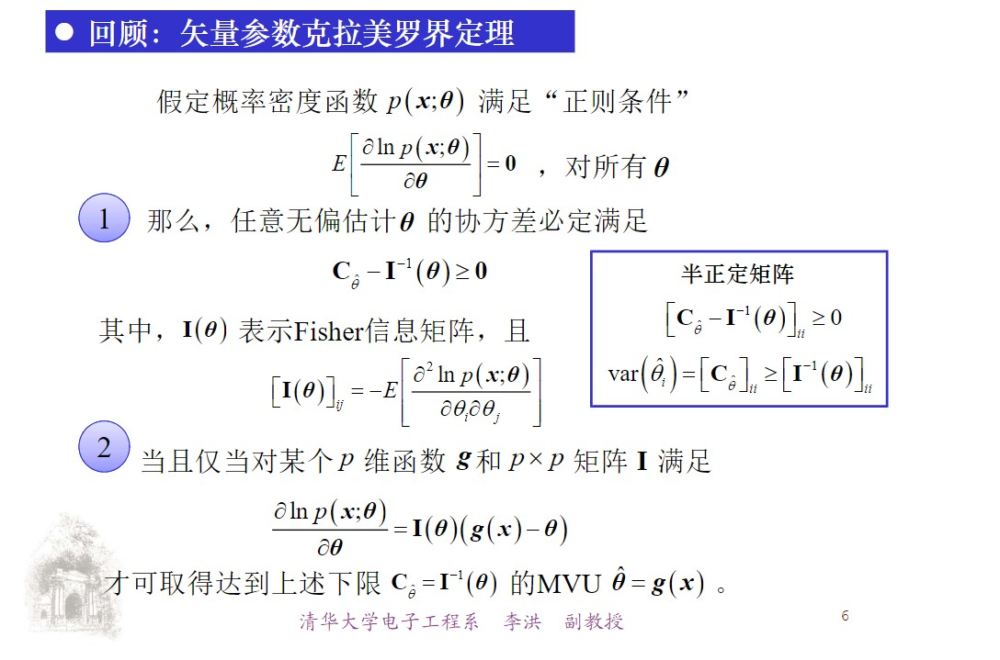
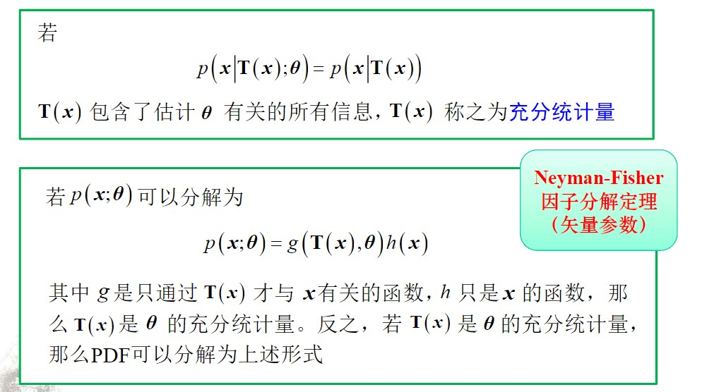
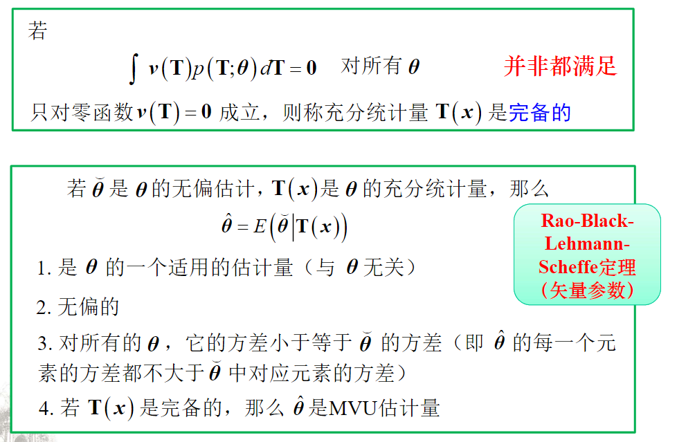

## 参数估计

分类：

* 经典估计
* 贝叶斯估计

准则：

* MSE，均方误差

$$
\hat \theta = f(\bm{x})
$$

### MSE

$$
\text{mse}(\hat \theta) = E \lbrace(\theta - \hat \theta)^2\rbrace = \text{var}(\hat \theta) + b^2(\hat \theta)\\
b^2(\hat \theta) = E(\hat \theta) - \theta
$$

现实中无法直接计算 MSE，因为涉及到真值 $\theta$，但是 $\theta$ 是我们要求的参数。

### MVU

最小方差无偏估计

MVU, Minimum Variance Unbiased

无偏：

$$
E(\hat \theta) = \theta, a \lt \theta \lt b
$$

无偏的含义：$\hat \theta$ 的求法需要对取值范围内任意的 $\theta$ 进行估计。

无偏估计是否一定存在？不一定。

最小方差：

$$
\min \text{var}\lbrace\hat\theta\rbrace
$$

MVU的内涵：估计值的发散程度最小（最小方差），平均意义上靠近真值（MVU）。是对 MSE 的迂回实现。

### 克拉美罗界定理(CRLB)

假设 $p(\bm{x};\theta)$ 满足正则条件：

$$
E \left [ \frac{\partial\ln p(\bm{x};\theta)}{\partial\theta} \right] = 0
$$

则

$$
\text{var}(\hat\theta) \ge \frac{1}{E \left [\left( \frac{\partial\ln p(\bm{x};\theta)}{\partial\theta}\right)^2 \right]} = - \frac{1}{E \left [ \frac{\partial^2\ln p(\bm{x};\theta)}{\partial\theta^2} \right]}
$$

等号成立的充要条件：找到函数 $I, g$

$$
\frac{\partial \ln p(\bm{x};\theta)}{\partial \theta}= I(\theta)(g(\bm{x}) - \theta)\\
\hat \theta = g(\bm{x})
$$

此时有 $\text{var}(\hat\theta) =1 / I(\theta)$。

### 求解MVU

$$
\frac{\partial \ln p(\bm{x};A)}{\partial A} = \frac{1}{\sigma^2}\sum\limits_{n=0}^{N - 1}(x[n] - A) = \frac{N}{\sigma^2}\left (\frac{1}{N}\sum\limits_{n=0}^{N - 1}(x[n] - A)  \right)
$$

$$
g(\bm{x}) = \frac{1}{N}\sum\limits_{n=0}^{N - 1}x[n]\\
I(\theta) = \frac{N}{\sigma^2}
$$

有效估计量：能达到克拉美罗下界的估计量，是MVU的子集。

### 参数变换的克拉美罗界

若

$$
\alpha = g(\theta)
$$

则

$$
CRLB(\hat \alpha) = \left(\frac{\partial g(\theta)}{\partial \theta}\right)^2CRLB(\hat \theta)
$$

对于高斯分布有

$$
E(x^2) = \mu^2 + \sigma^2\\
E(x^4) = \mu^4 + 6\mu^2\sigma^2 + 3\sigma^4
$$

当数据量很大时

有效估计量靠近真值：$N \rightarrow \infty, \hat\theta \rightarrow \theta$

非线性变换渐进有效,可以看成线性函数：$g(\hat \theta) \approx g(\theta) + \frac{\partial g(\theta)}{\partial\theta}(\hat \theta - \theta)$

### 矢量参数的克拉美罗界

$$
E \left [ \frac{\partial \ln p(\bm{x};\bm{\theta})}{\partial \bm{\theta}} \right] = 0
$$

$$
\alpha = g(\theta)
$$

注意：$\bm T(\bm x)$ 的维度要和 $\bm \theta$ 的维度相同

## 线性模型方法

$$
x = H\theta + w, w \sim N(0, \sigma^2I)
$$

$$
p(x;\theta) = \frac{1}{(2\pi\sigma)^{N/2}}\exp \lbrace -\frac{1}{2\sigma^2}(x - H\theta)^T(x - H\theta) \rbrace
$$

$$
\frac{\partial \ln p(x;\theta)}{\partial \theta} = \frac{H^TH}{\sigma^2}\lbrace (H^TH)^{-1}H^Tx - \theta \rbrace
$$

从而

$$
\hat \theta = (H^TH)^{-1}H^Tx\\
C_{\hat\theta} = \sigma^2(H^TH)^{-1}
$$

这个 MVU 估计量满足

$$
\hat \theta \sim N(\theta, \sigma^2(H^TH)^{-1})
$$

* 要求观测数据与待估计参数间呈线性关系
* 要求噪声是高斯白噪声
* 要求观测矩阵是满秩的
* 所得估计量是有效估计量

一般信号模型

$$
x = H\theta + s + w, s已知，w \sim N(0, C)
$$

结论

$$
\hat \theta = (H^TC^{-1}H)^{-1}H^TC^{-1}(x - s)\\
C_{\hat\theta} = (H^TC^{-1}H)^{-1}
$$

## 充分统计量方法

$$
p(x|T(x);\theta) = p(x|T(x))
$$

则称 $T(x)$ 为充分统计量

充分统计量的性质:

* 一旦充分统计量确定，似然函数就与待估计参数无关
* 充分统计量依赖于待估计参数。待估计参数变化，其相应的充分计量一般也会变化
* 所谓“充分”，是相对于原始观测数据而言的原始观测量总是充分统计量，但通常不是最小集
* 充分统计量并不唯一

若

$$
\int_{-\infty}^{\infty}v(T)p(T;\theta)\mathrm dT = 0
$$

对所有的 $\theta$ 并非都满足，只对零函数 $v(T) = 0$ 成立，则称充分统计量是完备的。

* 一般地，当待估计参数发生变化时，充分统计量也会发生变化
* 一旦充分统计量确定以后，似然函数就与待估计参数无关

### Neyman-Fisher因子分解定理

如果概率密度函数（或概率质量函数，对于离散随机变量）$p(x; \theta)$ 可以被分解为

$$
p(x; \theta) = g(T(x); \theta) \cdot h(x)
$$

其中：

- $g(T(x); \theta)$ 是一个只通过统计量 $T(x)$ 并依赖于参数 $\theta$ 的函数。
- $h(x)$ 是只与观测数据 $x$ 相关的函数，与参数 $\theta$ 无关。

那么，统计量 $T(x)$ 是参数 $\theta$ 的充分统计量。反之，如果 $T(x)$ 是参数 $\theta$ 的充分统计量，那么概率密度函数 $p(x; \theta)$ 必然可以分解为上述形式。

### Rao-Black-Lehmann-Scheffe(RBLS)定理

若 $\breve\theta$ 是$\theta$的无偏估计，$T(x)$是$\theta$的充分统计量，那么$\hat \theta=E(\breve{\theta}|T(x))$

1. 是$\theta$ 的一个适用的估计量(与$\theta$无关)
2. 无偏的
3. 对所有的 $\theta$，它的方差小于等于$\breve\theta$ 的方差
4. 若$T(x)$是完备的，那么$\theta$是MVU估计量

#### 矢量参数的 RBLS

## BLUE

### 定义

直接求出数据->参数的映射 $\bm A_{p \times N}$：

$$
\bm x = \bm H \theta\\
\hat {\theta}_{p \times 1} = \bm A\bm x
$$

无偏性：

$$
\theta = E(\hat\theta) = \bm AE(\bm x) = \bm AH\theta\\
\Rightarrow AH = I_{p \times p}
$$

最佳（最小方差）

$$
\min \lbrace a_i^TCa_i \rbrace, A = [a_1, a_2, \dots, a_n]^T
$$

其中

$$
C = E \lbrace (x - E(x))(x - E(x))^T \rbrace
$$

### 高斯-马尔可夫定理

如果数据具有一般线性模型的形式

$$
\bm x = \bm H \theta + w
$$

其中 $\bm H$ 为已知 $N \times p$ 矩阵，$\theta$ 为待估计参数，$w$ 是均值为零、协方差为 $\bm C$ 的噪声矢量（**不一定为高斯**），则 BLUE 估计量为

$$
\hat \theta = (H^TC^{-1}H)^{-1}H^TC^{-1}x\\
C_{\hat\theta} = (H^TC^{-1}H)^{-1}
$$

* 若为高斯噪声，则BLUE为MVU，且为有效估计量

## MLE

### 定义

$$
\hat \theta = \arg\max\limits_\theta p(\bm{x};\theta)
$$

如果 PDF 可导

$$
\frac{\partial p(\bm x; \theta)}{\partial \theta}\bigg|_{\hat\theta} = 0\\
\Rightarrow\frac{\partial \ln p(\bm x; \theta)}{\partial \theta}\bigg|_{\hat\theta} = 0
$$

若有效估计量存在，$\frac{\partial \ln p(\bm x; \theta)}{\partial \theta}\bigg|_{\hat\theta} = I(\theta)(g(x) - \theta)$，则可以使用最大似然估计方法求得结果。

### MLE 的性质

如果数据 $\bm x$ 的 PDF $p(\bm x;\theta)$ 满足“正则”条件，那么
对于足够多的数据记录，未知参数 $\theta$ 的 MLE 渐近服从

$$
\hat\theta \stackrel{a}{\sim} N(\theta, I^{-1}\theta)
$$

其中 $\theta$ 是在未知参数真值处计算的 Fisher 信息。

MLE是渐近无偏的

MLE渐近达到CRLB

MLE是渐近有效的

MLE是渐近最佳的

* MLE的方差（协方差）可大于、等于、小于CRLB！（不同于MVU估计）
* 但数据量足够多时，将与CRLB接近
* 因此，可利用CRLB评估MLE的性能

“足够多”数据：大量能带来新信息的数据

**MLE的不变性**

若参数 $\alpha = g(\theta)$，则

$$
\hat\alpha = g(\hat\theta)
$$

若 $g$ 非一对一函数，那么 $\hat\alpha$ 是使修正后的似然函数 $p_T(\bm x;\alpha)$ 最大者

$$
\hat\alpha = \arg\max_\alpha p_T(\bm x; \alpha)\\
p_T(\bm x; \alpha) = \max_{\theta: \alpha=g(\theta)}p(\bm x; \theta)
$$

该性质对函数 $g$ 无线性变换要求，对任意函数均成立。

对比MVU

* 无偏性、有效性仅对线性变换成立
* 对非线性变换不能保持（但渐近无偏、渐近有效）

对一般线性模型，MLE是MVU，达到了CRLB，是有效的、最佳的！

