## 参数估计

分类：

* 经典估计
* 贝叶斯估计

准则：

* MSE，均方误差

$$
\hat \theta = f(\bm{x})
$$

### MSE

$$
\text{mse}(\hat \theta) = E \lbrace(\theta - \hat \theta)^2\rbrace = \text{var}(\hat \theta) + b^2(\hat \theta)\\
b^2(\hat \theta) = E(\hat \theta) - \theta
$$

现实中无法直接计算 MSE，因为涉及到真值 $\theta$，但是 $\theta$ 是我们要求的参数。

### MVU

最小方差无偏估计

MVU, Minimum Variance Unbiased

无偏：

$$
E(\hat \theta) = \theta, a \lt \theta \lt b
$$

无偏的含义：$\hat \theta$ 的求法需要对取值范围内任意的 $\theta$ 进行估计。

无偏估计是否一定存在？不一定。

最小方差：

$$
\min \text{var}\lbrace\hat\theta\rbrace
$$

MVU的内涵：估计值的发散程度最小（最小方差），平均意义上靠近真值（MVU）。是对 MSE 的迂回实现。

### 克拉美罗界定理(CRLB)

假设 $p(\bm{x};\theta)$ 满足正则条件：

$$
E \left [ \frac{\partial\ln p(\bm{x};\theta)}{\partial\theta} \right] = 0
$$

则

$$
\text{var}(\hat\theta) \ge \frac{1}{E \left [\left( \frac{\partial\ln p(\bm{x};\theta)}{\partial\theta}\right)^2 \right]} = - \frac{1}{E \left [ \frac{\partial^2\ln p(\bm{x};\theta)}{\partial\theta^2} \right]}
$$

等号成立的充要条件：找到函数 $I, g$

$$
\frac{\partial \ln p(\bm{x};\theta)}{\partial \theta}= I(\theta)(g(\bm{x}) - \theta)\\
\hat \theta = g(\bm{x})
$$

此时有 $\text{var}(\hat\theta) =1 / I(\theta)$。

### 求解MVU

$$
\frac{\partial \ln p(\bm{x};A)}{\partial A} = \frac{1}{\sigma^2}\sum\limits_{n=0}^{N - 1}(x[n] - A) = \frac{N}{\sigma^2}\left (\frac{1}{N}\sum\limits_{n=0}^{N - 1}(x[n] - A)  \right)
$$

$$
g(\bm{x}) = \frac{1}{N}\sum\limits_{n=0}^{N - 1}x[n]\\
I(\theta) = \frac{N}{\sigma^2}
$$

有效估计量：能达到克拉美罗下界的估计量，是MVU的子集。

### 参数变换的克拉美罗界

若

$$
\alpha = g(\theta)
$$

则

$$
CRLB(\hat \alpha) = \left(\frac{\partial g(\theta)}{\partial \theta}\right)^2CRLB(\hat \theta)
$$

对于高斯分布有

$$
E(x^2) = \mu^2 + \sigma^2\\
E(x^4) = \mu^4 + 6\mu^2\sigma^2 + 3\sigma^4
$$

当数据量很大时

有效估计量靠近真值：$N \rightarrow \infty, \hat\theta \rightarrow \theta$

非线性变换渐进有效,可以看成线性函数：$g(\hat \theta) \approx g(\theta) + \frac{\partial g(\theta)}{\partial\theta}(\hat \theta - \theta)$

### 矢量参数的克拉美罗界

$$
E \left [ \frac{\partial \ln p(\bm{x};\bm{\theta})}{\partial \bm{\theta}} \right] = 0
$$

$$
\alpha = g(\theta)
$$

注意：$\bm T(\bm x)$ 的维度要和 $\bm \theta$ 的维度相同

## 线性模型方法

$$
x = H\theta + w, w \sim N(0, \sigma^2I)
$$

$$
p(x;\theta) = \frac{1}{(2\pi\sigma)^{N/2}}\exp \lbrace -\frac{1}{2\sigma^2}(x - H\theta)^T(x - H\theta) \rbrace
$$

$$
\frac{\partial \ln p(x;\theta)}{\partial \theta} = \frac{H^TH}{\sigma^2}\lbrace (H^TH)^{-1}H^Tx - \theta \rbrace
$$

从而

$$
\hat \theta = (H^TH)^{-1}H^Tx\\
C_{\hat\theta} = \sigma^2(H^TH)^{-1}
$$

这个 MVU 估计量满足

$$
\hat \theta \sim N(\theta, \sigma^2(H^TH)^{-1})
$$

* 要求观测数据与待估计参数间呈线性关系
* 要求噪声是高斯白噪声
* 要求观测矩阵是满秩的
* 所得估计量是有效估计量

一般信号模型

$$
x = H\theta + s + w, s已知，w \sim N(0, C)
$$

结论

$$
\hat \theta = (H^TC^{-1}H)^{-1}H^TC^{-1}(x - s)\\
C_{\hat\theta} = (H^TC^{-1}H)^{-1}
$$

## 充分统计量方法

$$
p(x|T(x);\theta) = p(x|T(x))
$$

则称 $T(x)$ 为充分统计量

充分统计量的性质:

* 一旦充分统计量确定，似然函数就与待估计参数无关
* 充分统计量依赖于待估计参数。待估计参数变化，其相应的充分计量一般也会变化
* 所谓“充分”，是相对于原始观测数据而言的原始观测量总是充分统计量，但通常不是最小集
* 充分统计量并不唯一

若

$$
\int_{-\infty}^{\infty}v(T)p(T;\theta)\mathrm dT = 0
$$

对所有的 $\theta$ 并非都满足，只对零函数 $v(T) = 0$ 成立，则称充分统计量是完备的。

* 一般地，当待估计参数发生变化时，充分统计量也会发生变化
* 一旦充分统计量确定以后，似然函数就与待估计参数无关

### Neyman-Fisher因子分解定理

如果概率密度函数（或概率质量函数，对于离散随机变量）$p(x; \theta)$ 可以被分解为

$$
p(x; \theta) = g(T(x); \theta) \cdot h(x)
$$

其中：

- $g(T(x); \theta)$ 是一个只通过统计量 $T(x)$ 并依赖于参数 $\theta$ 的函数。
- $h(x)$ 是只与观测数据 $x$ 相关的函数，与参数 $\theta$ 无关。

那么，统计量 $T(x)$ 是参数 $\theta$ 的充分统计量。反之，如果 $T(x)$ 是参数 $\theta$ 的充分统计量，那么概率密度函数 $p(x; \theta)$ 必然可以分解为上述形式。

### Rao-Black-Lehmann-Scheffe(RBLS)定理

若 $\breve\theta$ 是$\theta$的无偏估计，$T(x)$是$\theta$的充分统计量，那么$\hat \theta=E(\breve{\theta}|T(x))$

1. 是$\theta$ 的一个适用的估计量(与$\theta$无关)
2. 无偏的
3. 对所有的 $\theta$，它的方差小于等于$\breve\theta$ 的方差
4. 若$T(x)$是完备的，那么$\theta$是MVU估计量

#### 矢量参数的 RBLS

## BLUE

### 定义

直接求出数据->参数的映射 $\bm A_{p \times N}$：

$$
\bm x = \bm H \theta\\
\hat {\theta}_{p \times 1} = \bm A\bm x
$$

无偏性：

$$
\theta = E(\hat\theta) = \bm AE(\bm x) = \bm AH\theta\\
\Rightarrow AH = I_{p \times p}
$$

最佳（最小方差）

$$
\min \lbrace a_i^TCa_i \rbrace, A = [a_1, a_2, \dots, a_n]^T
$$

其中

$$
C = E \lbrace (x - E(x))(x - E(x))^T \rbrace
$$

### 高斯-马尔可夫定理

如果数据具有一般线性模型的形式

$$
\bm x = \bm H \theta + w
$$

其中 $\bm H$ 为已知 $N \times p$ 矩阵，$\theta$ 为待估计参数，$w$ 是均值为零、协方差为 $\bm C$ 的噪声矢量（**不一定为高斯**），则 BLUE 估计量为

$$
\hat \theta = (H^TC^{-1}H)^{-1}H^TC^{-1}x\\
C_{\hat\theta} = (H^TC^{-1}H)^{-1}
$$

* 若为高斯噪声，则BLUE为MVU，且为有效估计量

## MLE

### 定义

$$
\hat \theta = \arg\max\limits_\theta p(\bm{x};\theta)
$$

如果 PDF 可导

$$
\frac{\partial p(\bm x; \theta)}{\partial \theta}\bigg|_{\hat\theta} = 0\\
\Rightarrow\frac{\partial \ln p(\bm x; \theta)}{\partial \theta}\bigg|_{\hat\theta} = 0
$$

若有效估计量存在，$\frac{\partial \ln p(\bm x; \theta)}{\partial \theta}\bigg|_{\hat\theta} = I(\theta)(g(x) - \theta)$，则可以使用最大似然估计方法求得结果。

### MLE 的性质

如果数据 $\bm x$ 的 PDF $p(\bm x;\theta)$ 满足“正则”条件，那么
对于足够多的数据记录，未知参数 $\theta$ 的 MLE 渐近服从

$$
\hat\theta \stackrel{a}{\sim} N(\theta, I^{-1}\theta)
$$

其中 $\theta$ 是在未知参数真值处计算的 Fisher 信息。

MLE是渐近无偏的

MLE渐近达到CRLB

MLE是渐近有效的

MLE是渐近最佳的

* MLE的方差（协方差）可大于、等于、小于CRLB！（不同于MVU估计）
* 但数据量足够多时，将与CRLB接近
* 因此，可利用CRLB评估MLE的性能

“足够多”数据：大量能带来新信息的数据

**MLE的不变性**

若参数 $\alpha = g(\theta)$，则

$$
\hat\alpha = g(\hat\theta)
$$

若 $g$ 非一对一函数，那么 $\hat\alpha$ 是使修正后的似然函数 $p_T(\bm x;\alpha)$ 最大者

$$
\hat\alpha = \arg\max_\alpha p_T(\bm x; \alpha)\\
p_T(\bm x; \alpha) = \max_{\theta: \alpha=g(\theta)}p(\bm x; \theta)
$$

该性质对函数 $g$ 无线性变换要求，对任意函数均成立。

对比MVU

* 无偏性、有效性仅对线性变换成立
* 对非线性变换不能保持（但渐近无偏、渐近有效）

对一般线性模型，MLE是MVU，达到了CRLB，是有效的、最佳的！

## 最小二乘估计(LS)

### 线性最小二乘估计

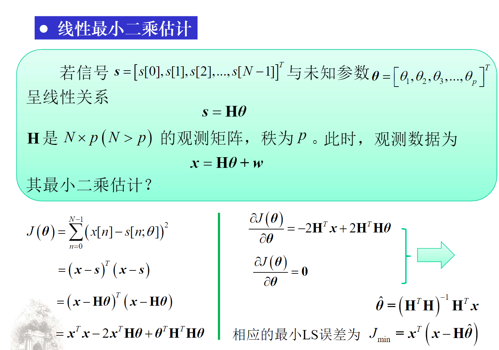

### 加权最小二乘估计

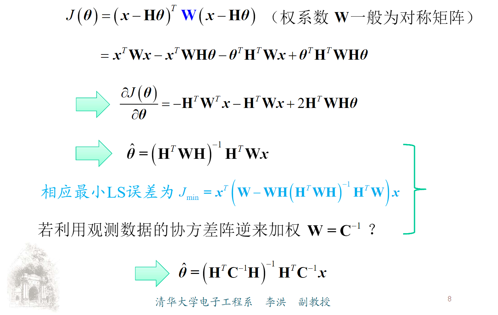

### 约束最小二乘估计

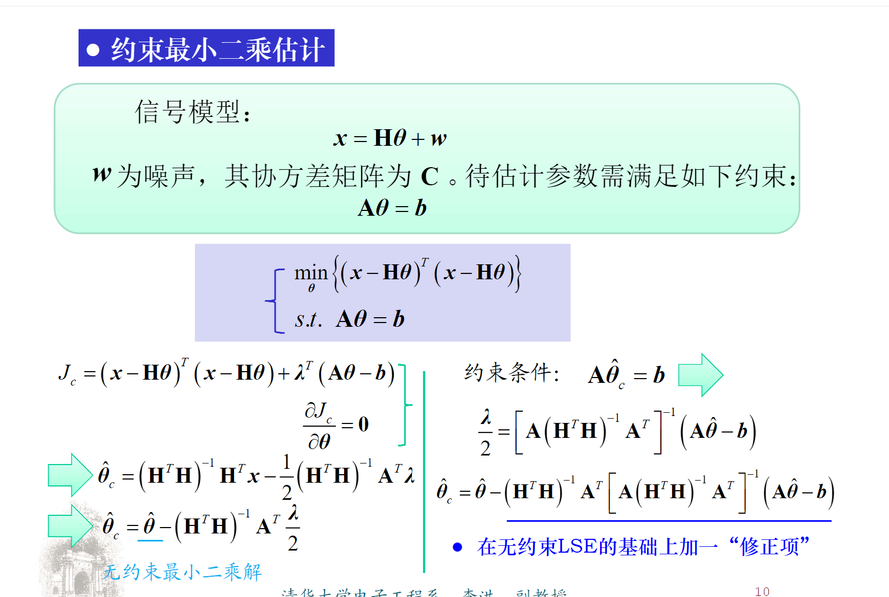

### 比较

## 经典估计方法比较

### 噪声电平估计问题

$$
x[n] = A + w[n]
$$

其中 $w[n] \sim N(0, \sigma^2)$，待估计参数 $\theta = [A, \sigma^2]^T$

#### MVU估计

$$
p(x;\theta) = \frac{1}{(2\pi\sigma^2)^{N/2}}\exp \lbrace -\frac{1}{2\sigma^2} \sum\limits_{n=0}^{N - 1}(x[n] - A)^2\rbrace
$$

$$
\frac{\partial \ln p (x;\theta)}{\partial A} = \frac{1}{\sigma^2}\sum\limits_{n=0}^{N - 1}(x[n] - A)
$$

$$
\frac{\partial \ln p(x;\theta)}{\partial \sigma^2} = \frac{N}{2\sigma^2} + \frac{1}{2\sigma^4}\sum\limits_{n=0}^{N - 1}(x[n] - A)
$$

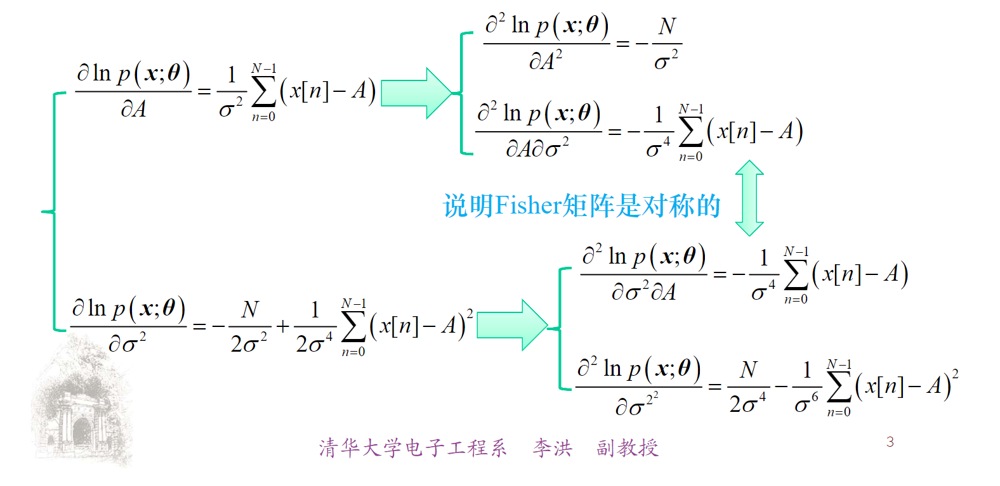

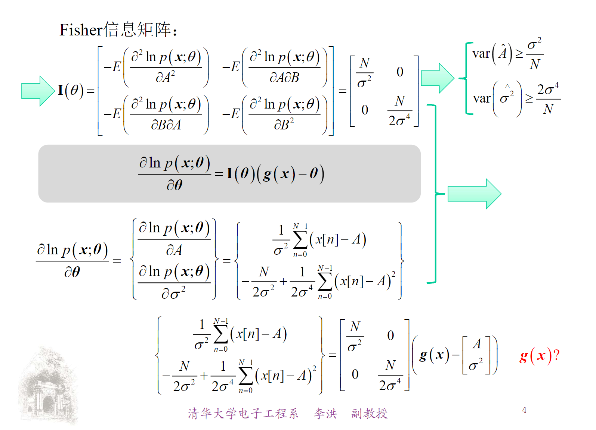

#### 线性模型

$$
\hat\theta = (\bm H^T\bm H)^{-1}\bm  H^T x
$$

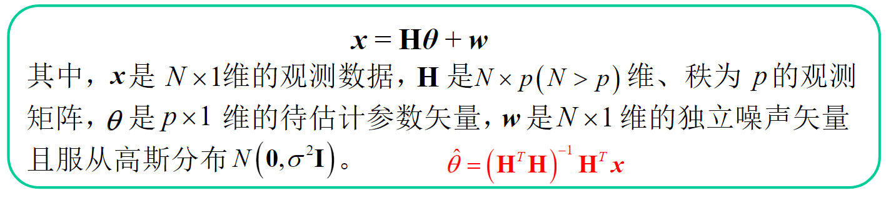

#### BLUE

$$
\hat\theta = (\bm H^T\bm C^{-1}\bm H)^{-1}\bm  H^T\bm C^{-1} x
$$

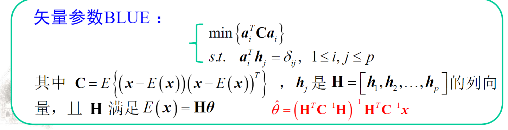

#### 充分统计量

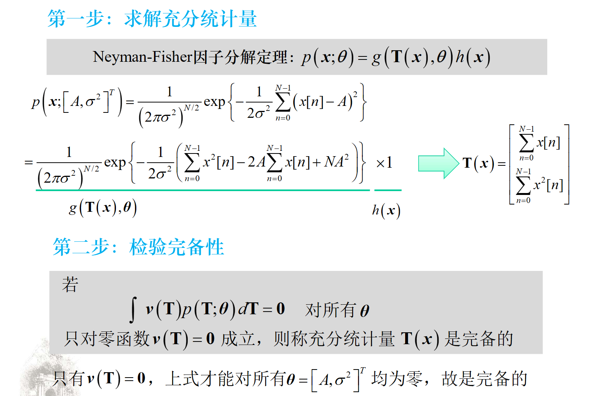

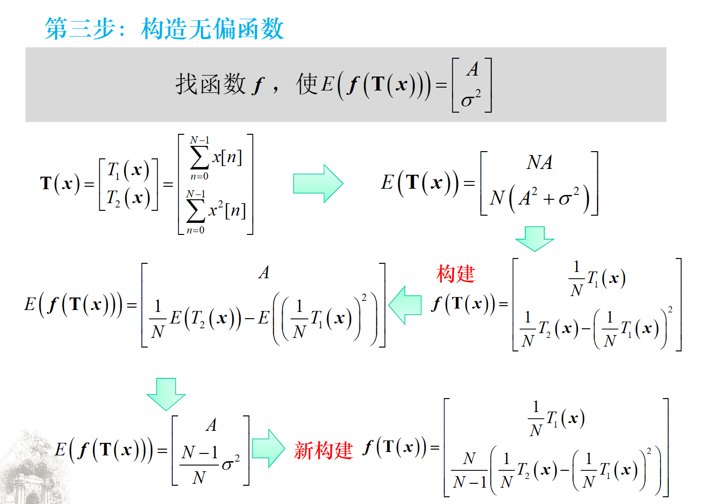

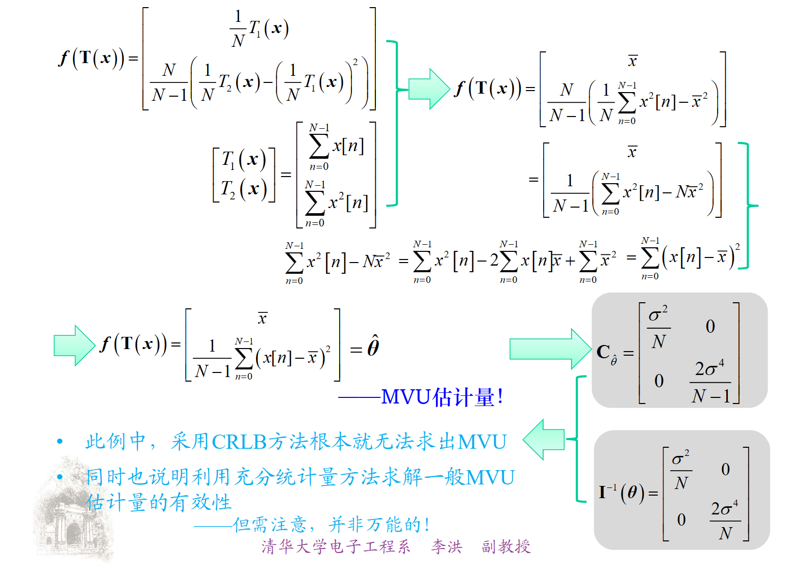

#### MLE

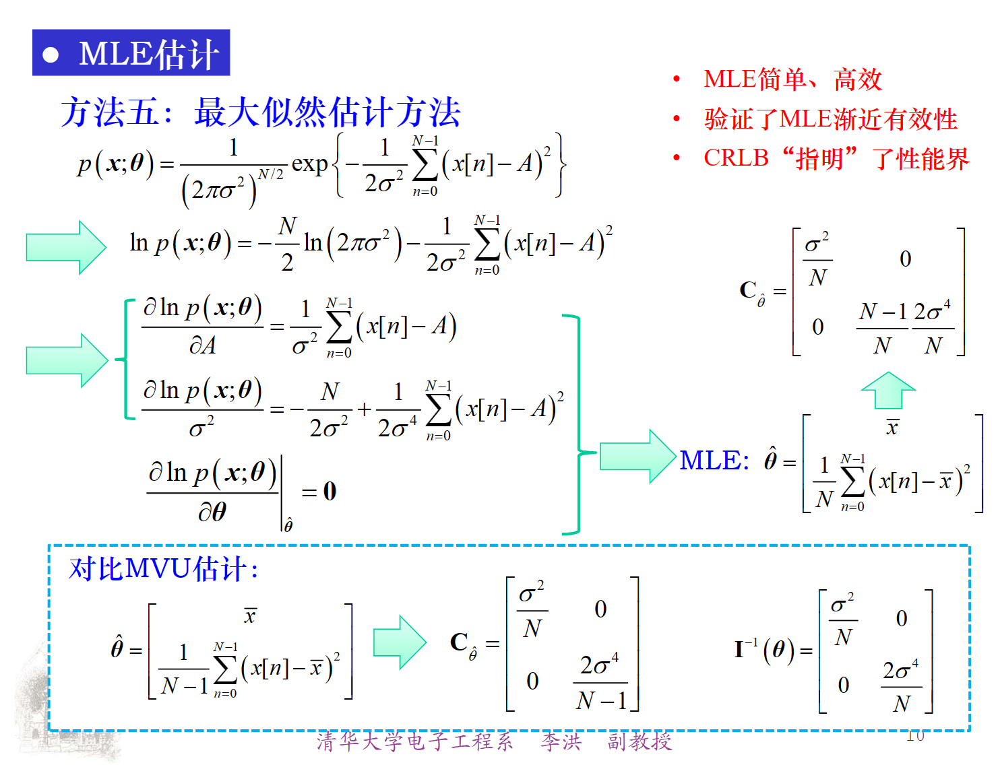

#### LSE

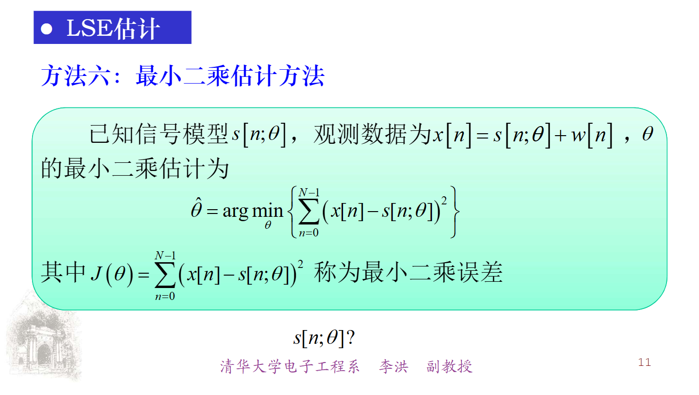

## 贝叶斯估计

贝叶斯MSE：
Bmse$\left(\hat{\theta}\right)=E\left(\left(\theta-\hat{\theta}\right)^2\right)$
 

$=\int\int\left(\theta-\hat{\theta}\right)^{2}p\big(\mathbf{x},\theta\big)d\mathbf{x}d\theta$ $=\iint\left(\theta-\hat{\theta}\right)^2p\big(\boldsymbol{x}|\theta\big)p\big(\theta\big)d\boldsymbol{x}d\theta$
 $=\iint\left(\theta-\hat{\theta}\right)^2p(x|\theta)dxp(\theta)d\theta$

$\hat{\theta}=E\big(\theta|x\big)$

多余参数：未知，但不感兴趣的参数
 解决思路：通过积分消除多余参数的影响
 (1) 后验概率中存多余参数时：

$$
p(\boldsymbol{\theta},\boldsymbol{\alpha}\mid\boldsymbol{x}) \Rightarrow p (\boldsymbol{\theta}\mid\boldsymbol{x})=\int p(\boldsymbol{\theta},\boldsymbol{\alpha}\mid\boldsymbol{x})\:d\boldsymbol{\alpha}
$$

(2) 条件概率中存在多余参数时：

$$
p(\boldsymbol{\theta}\mid\boldsymbol{x})=\frac{p(\boldsymbol{x}\mid\boldsymbol{\theta})p(\boldsymbol{\theta})}{\int p(\boldsymbol{x}\mid\boldsymbol{\theta})p(\boldsymbol{\theta})d\boldsymbol{\theta}}
$$

$$
\text{若现只有 }p(x|\theta,\alpha)\text{,而无 }p(x|\theta)
$$
 此时可通过积分方式解决

$$
p(x\mid\theta)=\int p(x\mid\theta,\alpha)p(\alpha\mid\theta)d\alpha 
$$

进一步地，若待估计参数与多余参数相互独立，

$$
p(x\mid\theta)=\int p(x\mid\theta,\alpha)p(\alpha)d\alpha 
$$

矢量参数下贝叶斯估计
若 θ 是 $p{\times}1$ 的矢量参数，那么为了估计其中某个参数 $\theta_i$, 可以将剩余参数当作多余参数，因此对$\theta_i$ 的MMSE为

$$
\hat{\theta}_i=E\left(\theta_i\mid x\right)=\int\theta_ip(\theta_i\mid x)d\theta_i
$$
 其中

$$
p(\theta_i\mid x)=\int\cdots\int p(\theta\mid x)d\theta_1\cdots d\theta_{i-1}d\theta_{i+1}\cdots d\theta_p
$$

$$
\hat{\theta}_i=\int\theta_i\left(\int\cdots\int p(\boldsymbol{\theta}\mid\boldsymbol{x})\underline{d\theta_1\cdots d\theta_{i-1}d\theta_{i+1}\cdots d\theta_p}\right)d\theta_i=\int\theta_ip(\boldsymbol{\theta}\mid\boldsymbol{x})d\boldsymbol{\theta}
$$

$$
\Longrightarrow\hat{\theta}=\begin{bmatrix}\theta_1p(\theta|x)d\theta\\\int\theta_2p(\theta|x)d\theta\\\vdots\\\int\theta_pp(\theta|x)d\theta\end{bmatrix}=\int\theta_P(\theta|x)d\theta=E(\theta|x)
$$

Woodbury 恒等式：

$$
\left(\mathbf{B}+\boldsymbol{u}\boldsymbol{u}^T\right)^{-1}=\mathbf{B}^{-1}-\frac{\mathbf{B}^{-1}\boldsymbol{u}\boldsymbol{u}^T\mathbf{B}^{-1}}{1+\boldsymbol{u}^T\mathbf{B}^{-1}\boldsymbol{u}}
$$

### 贝叶斯风险

$$
\Re=\iint C(\varepsilon)p(x,\theta)dxd\theta 
$$

#### 二次型误差

$$
C(\varepsilon) = \begin{pmatrix}\theta-\hat{\theta}\end{pmatrix}^2
$$

这就是 MMSE

#### 绝对误差

$$
C(\varepsilon)=\begin{vmatrix}\theta-\hat{\theta}\end{vmatrix}
$$

> Leibnitz 准则
> $\frac{\partial}{\partial u}\int\limits_{\phi_1(u)}^{\phi_2(u)}h\big(u,v\big)dv=\int\limits_{\phi_1(u)}^{\phi_2(u)}\frac{\partial h\big(u,v\big)}{\partial u}dv+\frac{\partial\phi_2\big(u\big)}{\partial u}h\big(u,\phi_2\big(u\big)\big)-\frac{\partial\phi_1\big(u\big)}{\partial u}h\big(u,\phi_1\big(u\big))$

此时

$$
\int_{-\infty}^{\hat{\theta}}p\big(\theta|x\big)d\theta=\int_{\hat{\theta}}^{+\infty}p\big(\theta|x\big)d\theta 
$$

#### 成功失败型误差

$$
C(\varepsilon)=\begin{cases}0,\left|\theta-\hat{\theta}\right|<\delta\\1,\left|\theta-\hat{\theta}\right|\geq\delta\end{cases}
$$

此时 

$$
\hat{\theta}=\arg\max_{\theta}p(\theta|x)
$$

即 $\hat{\theta}$ 是后验PDF的最大值 (众数) 

MAP maximum a posteriori

根据贝叶斯公式

$$
\hat{\theta}=\arg\max_{\theta}\left\{p(x|\theta)p(\theta)\right\}\\
\hat{\theta}=\arg\max_{\theta}\left\{\ln p\big(x|\theta\big)+\ln p\big(\theta\big)\right\}
$$

#### 三值比较
一般而言，“三值”并不相等，因此三种估计量往往不同

特例：高斯时“三值”相等，三种估计方法等价

大数据量时先验信息不起作用，最大后验概率估计（MAP）将转变为（贝叶斯）最大似然估计（MLE）

### 线性贝叶斯估计

线性贝叶斯估计(LMMSE), 也称线性最小意味着：

$$
\hat{\theta}=\sum_{n=0}^{N-1}a_nx[n]+a_N
$$

即限定估计量与观察数据间呈线性关系，然最小化 
$$
\mathrm{Bmse}\Big(\hat{\theta}\Big)=E\Big[\Big(\theta-\hat{\theta}\Big)^{2}\Big]
$$

即，LMMSE:

$$
\min\left\{E\left[\left(\theta-\hat{\theta}\right)^2\right]\right\}\\s.t.\quad\hat{\theta}=\sum_{n=0}^{N-1}a_nx[n]+a_N
$$

解得估计量：

$$
\hat{\theta}=E\left(\theta\right)+\mathbf{C}_{\theta x}\mathbf{C}_{xx}^{-1}\left(x-E\left(x\right)\right)\\\mathrm{Bmse}\left(\hat{\theta}\right)=\mathbf{C}_{\theta\theta}-\mathbf{C}_{\theta x}\mathbf{C}_{xx}^{-1}\mathbf{C}_{x\theta}
$$

对比 MMSE：

附加了线性约束
- 可得显示解——好求
- 仅需一阶矩和二阶矩

无附加约束
- 可能难以求得显示解
- 需PDF
- 全局最优
- 仅在“线性”中最优

#### 矢量参数情况

待估计参数$\boldsymbol{\theta}=\begin{bmatrix}\theta_1,\theta_2,...,\theta_p\end{bmatrix}^T$,其每个参数的 LMMSE 定义为

$$
\begin{aligned}&\min E\bigg[\bigg(\theta_{i}-\hat{\theta}_{i}\bigg)^{2}\bigg]\\&s.t.\hat{\theta}_{i}=\sum_{n=0}^{N-1}a_{in}x[n]+a_{iN}\end{aligned}
$$

$$
\hat{\boldsymbol{\theta}}=\begin{bmatrix}E(\theta_1)\\E(\theta_2)\\\vdots\\E(\theta_p)\end{bmatrix}+\begin{bmatrix}\mathbf{C}_{\theta_1x}\mathbf{C}_{xx}^{-1}\left(\boldsymbol{x}-E(\boldsymbol{x})\right)\\\mathbf{C}_{\theta_2x}\mathbf{C}_{xx}^{-1}\left(\boldsymbol{x}-E(\boldsymbol{x})\right)\\\vdots\\\mathbf{C}_{\theta_px}\mathbf{C}_{xx}^{-1}\left(\boldsymbol{x}-E(\boldsymbol{x})\right)\end{bmatrix}\\
=E\left(\boldsymbol{\theta}\right)+\mathbf{C}_{\theta x}\mathbf{C}_{xx}^{-1}\left(\boldsymbol{x} - E(\boldsymbol{x})\right)
$$

### 序贯LMMSE

白噪声电平估计

$$
x[n]=A+w[n],n=0,1,...,N
$$

$$
A\sim N\big(0,\sigma_{A}^{2}\big)\\
w[n]\sim N\left(0,\sigma^{2}\right)
$$

解得

$$
\begin{aligned}
&E(\theta)=0 \\
&\mathbf{C}_{\theta x}=E\left(\left(\theta-E\left(\theta\right)\right)\left(x-E\left(x\right)\right)^{T}\right) \\
&=E\left(\left(A-0\right)\left(x-0\right)^{T}\right) \\
&=E\Big(A\big(A\mathbf{1}+\mathbf{w}\big)^{T}\Big) \\
&=\sigma_{A}^{2}\mathbf{1}^{T}
\end{aligned}\\
\begin{aligned}
\mathbf{C}_{xx}& =E\left(\left(x-E\left(x\right)\right)\left(x-E\left(x\right)\right)^T\right)  \\
&=E\left(\left(A\mathbf{1}+\boldsymbol{w}\right)\left(A\mathbf{1}+\boldsymbol{w}\right)^T\right) \\
&=E\left\{A\mathbf{1}\mathbf{1}^TA+A\mathbf{1}\boldsymbol{w}^T+\boldsymbol{w}\mathbf{1}^TA+\boldsymbol{w}\boldsymbol{w}^T\right\} \\
&=\sigma_A^2\mathbf{1}\mathbf{1}^T+\sigma^2\mathbf{I}
\end{aligned}\\
\begin{aligned}\mathbf{C}_{\theta\theta}&=\sigma_A^2\\\mathbf{C}_{x\theta}&=\mathbf{C}_{\theta x}^T\\&=\sigma_A^2\mathbf{1}\end{aligned}
$$

$$
\begin{aligned}\hat{A}&=\frac{\sigma_{A}^{2}}{\sigma_{A}^{2}+\frac{\sigma^{2}}{N}}\\\mathrm{Bmse}&\left(\hat{A}\right)=\frac{1}{N}\end{aligned}
$$

记

$$
\hat{A}[N-1]=\frac{\sigma_A^2}{\sigma_A^2+\frac{\sigma^2}{N}}\frac{1}{N}\sum_{n=0}^{N-1}x[n]
$$

则

$$
\hat{A}[N]=\hat{A}[N-1]+\underbrace{\frac{\sigma_A^2}{\left(N+1\right)\sigma_A^2+\sigma^2}}_{K[N]，增益因子}\Big(x[N]-\hat{A}[N-1]\Big)
$$

$$
\frac{\frac1{\sigma^2}}{\frac1{\mathrm{Bmse}\left(\hat{A}\left[N-1\right]\right)}+\frac1{\sigma^2}}=\frac{\mathrm{Bmse}\left(\hat{A}\left[N-1\right]\right)}{\mathrm{Bmse}\left(\hat{A}\left[N-1\right]\right)+\sigma^2}\\=\frac{\frac{\sigma_A^2\sigma^2}{N\sigma_A^2+\sigma^2}}{\frac{\sigma_A^2\sigma^2}{N\sigma_A^2+\sigma^2}+\sigma^2}=\frac{\sigma_A^2}{\left(N\sigma_A^2+\sigma^2\right)+\sigma_A^2}=K\begin{bmatrix}N\end{bmatrix}
$$

一般方法

序贯计算方法估计量更新：

$$
\hat{A}[N]=\hat{A}[N-1]+K[N]\Big(x[N]-\hat{A}[N-1]\Big)
$$

增益因子：

$$
K\left[N\right]=\frac{\mathrm{Bmse}\left(\hat{A}\left[N-1\right]\right)}{\mathrm{Bmse}\left(\hat{A}\left[N-1\right]\right)+\sigma^2}
$$

最小贝叶斯MSE更新：

$$
\mathrm{Bmse}\Big(\hat{A}[N]\Big)\boldsymbol{=}\Big(1\boldsymbol{-}K[N]\Big)\mathrm{Bmse}\Big(\hat{A}[N\boldsymbol{-}1]\Big)
$$

初始化：

$$
\hat{A}[-1]=E(A)\\
\text{Bmse}\left ( \hat{A} [ - 1] \right ) = \text{var}\left ( A\right ) 
$$

## 维纳滤波

### 滤波

假定观测数据是零均值、宽平稳的，信号也是零均值、宽平稳的，信号与噪声不相关

$$
x[n] = s[n] + w[n], n = 0, 1, \dots, N - 1
$$

$$
\theta=s[n]\text{ 用 }x[0],x[1],x[2],...,x[n]\text{来估计}$$

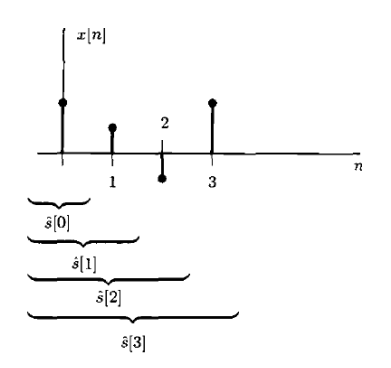

利用 LMMSE 可得

$$
\hat{s}[n]=r_{ss}^{'T}\left(\mathbf{R}_{ss}+\mathbf{R}_{ww}\right)^{-1}\boldsymbol{x}
$$

从而得到维纳-霍夫滤波方程

$$
\begin{bmatrix}r_{xx}\begin{bmatrix}0\end{bmatrix}&r_{xx}\begin{bmatrix}1\end{bmatrix}&\cdots&r_{xx}\begin{bmatrix}n\end{bmatrix}\\r_{xx}\begin{bmatrix}1\end{bmatrix}&r_{xx}\begin{bmatrix}0\end{bmatrix}&\cdots&r_{xx}\begin{bmatrix}n-1\end{bmatrix}\\\vdots&\vdots&\ddots&\vdots\\r_{xx}\begin{bmatrix}n\end{bmatrix}&r_{xx}\begin{bmatrix}n-1\end{bmatrix}&\cdots&r_{xx}\begin{bmatrix}0\end{bmatrix}\end{bmatrix}\begin{bmatrix}h^{(n)}\begin{bmatrix}0\end{bmatrix}\\h^{(n)}\begin{bmatrix}1\end{bmatrix}\\\vdots\\h^{(n)}\begin{bmatrix}n\end{bmatrix}\end{bmatrix}=\begin{bmatrix}r_{ss}\begin{bmatrix}0\end{bmatrix}\\r_{ss}\begin{bmatrix}1\end{bmatrix}\\\vdots\\r_{ss}\begin{bmatrix}n\end{bmatrix}\end{bmatrix}
$$

### 平滑

$$
\theta=s[n]\text{用 }...,x[-1],x[0],x[1],x[2],...,\text{来估计}
$$

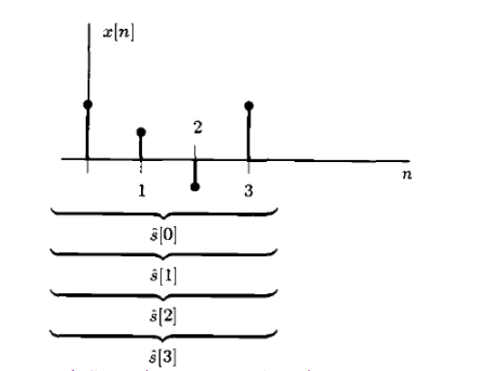

LMMSE:

$$
\hat{s}[n]=\sum_{k=-\infty}^\infty a_kx[k]
$$

令 $h[k] = a_{N-k}$

> 正交原理：误差与每一个观测数据正交
> $$
> E\left(\left(\theta-\hat{\theta}\right)x[m]\right)=0
> $$
> 正交原理不依赖于任务是平滑、滤波还是预测，是普遍适用的，证明如下：
> 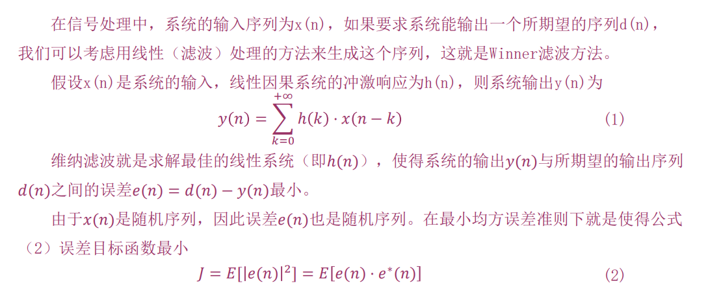
> 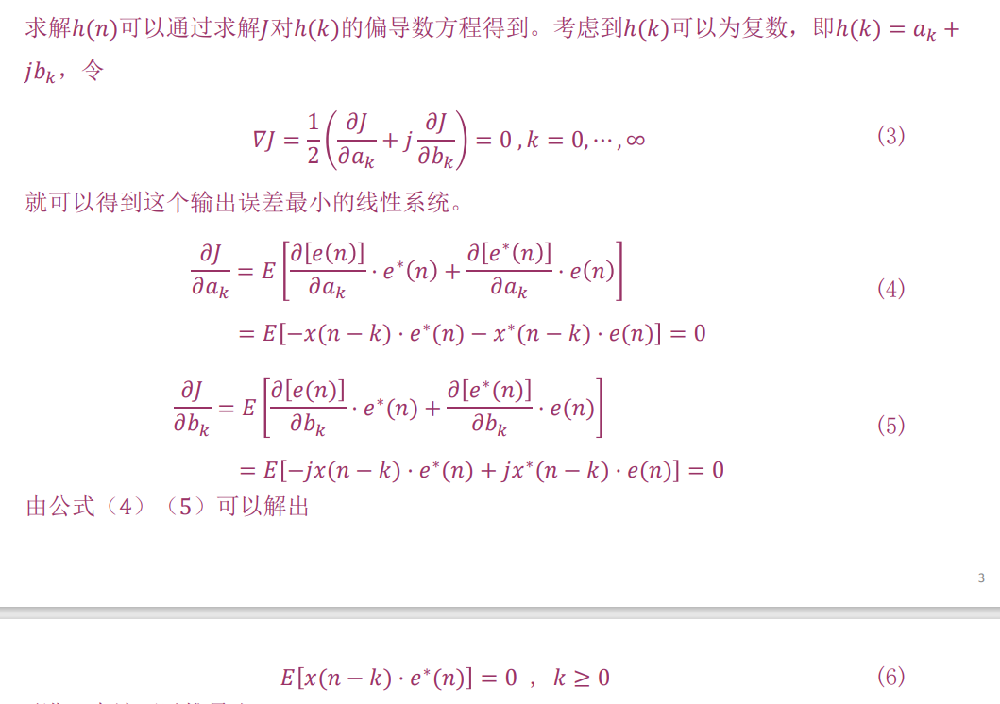
在 LMMSE

$$
\hat{s}[n]=\sum_{k=-\infty}^\infty a_kx[k]
$$

中令 $h[k]=a_{n-k}$

则有

$$
\hat s[n] = \sum\limits_{k=-\infty}^{\infty}h[k]x[n-k]
$$

可得

$$
r_{ss}\begin{bmatrix}n\end{bmatrix}=h\begin{bmatrix}n\end{bmatrix}*r_{xx}\begin{bmatrix}n\end{bmatrix}
$$

无限维纳平滑器的频率响应

$$
H\left(f\right)=\frac{P_{ss}\left(f\right)}{P_{xx}\left(f\right)}\quad=\frac{P_{ss}\left(f\right)}{P_{ss}\left(f\right)+P_{ww}\left(f\right)}\quad=\frac{\eta\left(f\right)}{\eta\left(f\right)+1}\quad\text{,其中 }\eta\left(f\right)=\frac{P_{ss}\left(f\right)}{P_{ww}\left(f\right)}
$$

### 预测

可以用来进行预测

$$
\theta=x[N-1+l]\text{ 用 }x[0],x[1],x[2],...,x[N-1]\text{ 来估计}
$$

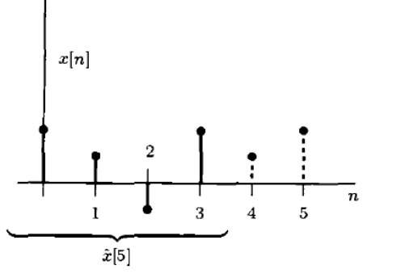

依然用 LMMSE 可以得到线性预测维纳-霍夫滤波方程

$$
\begin{bmatrix}r_{xx}\begin{bmatrix}0\end{bmatrix}&r_{xx}\begin{bmatrix}1\end{bmatrix}&\cdots&r_{xx}\begin{bmatrix}N-1\end{bmatrix}\\r_{xx}\begin{bmatrix}1\end{bmatrix}&r_{xx}\begin{bmatrix}0\end{bmatrix}&\cdots&r_{xx}\begin{bmatrix}N-2\end{bmatrix}\\\vdots&\vdots&\ddots&\vdots\\r_{xx}\begin{bmatrix}N-1\end{bmatrix}&r_{xx}\begin{bmatrix}N-2\end{bmatrix}&\cdots&r_{xx}\begin{bmatrix}0\end{bmatrix}\end{bmatrix}\begin{bmatrix}h\begin{bmatrix}1\end{bmatrix}\\h\begin{bmatrix}2\end{bmatrix}\\\vdots\\h\begin{bmatrix}N\end{bmatrix}\end{bmatrix}=\begin{bmatrix}r_{xx}\begin{bmatrix}l\end{bmatrix}\\r_{xx}\begin{bmatrix}l+1\end{bmatrix}\\\vdots\\r_{xx}\begin{bmatrix}N-1+l\end{bmatrix}\end{bmatrix}
$$

### 应用

信道均衡问题

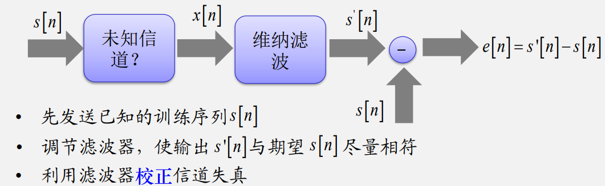

## 卡尔曼滤波

如何估计电压？

### 模型 1：当成确定参数

$$
x[n] = A + w[n], w[n] \sim N(0, \sigma^{2})
$$

$$
\hat A = \sum\limits_{n=0}^{N - 1}x[n] = \bar x
$$

### 模型2：当成某个随机变量

$$
x[n] = A + w[n], w[n] \sim N(0, \sigma^{2}), A \sim N(\mu_A, \sigma_A^{2})
$$

贝叶斯一般线性模型：

$$
\boldsymbol{x}=\mathbf{H}\boldsymbol{\theta}+\boldsymbol{w}\quad\text{其中 }\boldsymbol{\theta}{\sim}N\begin{pmatrix}\boldsymbol{\mu}_\theta,\mathbf{C}_\theta\end{pmatrix}\text{,}\boldsymbol{w}{\sim}N\begin{pmatrix}\boldsymbol{0},\mathbf{C}_w\end{pmatrix}\\
E\left(\boldsymbol{\theta}\mid\boldsymbol{x}\right)=E\left(\boldsymbol{\theta}\right)+\mathbf{C}_{\theta x}\mathbf{C}_{xx}^{-1}\left(\boldsymbol{x}-E\left(\boldsymbol{x}\right)\right)=\boldsymbol{\mu}_\theta+\mathbf{C}_{\theta|x}\mathbf{H}^T\mathbf{C}_w^{-1}\left(\boldsymbol{x}-\mathbf{H}\boldsymbol{\mu}_\theta\right)\\
\text{其中,}\mathbf{C}_{\theta|x}=\left(\mathbf{C}_\theta^{-1}+\mathbf{H}^T\mathbf{C}_w^{-1}\mathbf{H}\right)^{-1}
$$

$$
\hat{A}=\mu_A+\frac{\frac1{\sigma^2/N}}{\frac1{\sigma_A^2}+\frac1{\sigma^2/N}}(\overline{x}-\mu_A)
$$

### 模型3：当成未知且随时间变化的量

$$
x[n]=A[n]+w[n],n=0,1,...,N-1
$$

$$
\mathrm{MVU}\text{估计量:}\hat{\boldsymbol{\theta}}=\left(\mathbf{H}^T\mathbf{H}\right)^{-1}\mathbf{H}^T\boldsymbol{x}\\
\begin{aligned}&\boldsymbol{\theta}=&\begin{bmatrix}A[0],A[1],...,A[N-1]\end{bmatrix}^T\\&\mathbf{H}=\mathbf{I}\end{aligned}\\
\hat{A}[n]=x[n]
$$

### 动态信号模型

一阶高斯-马尔可夫信号模型：

$$
s[n]=as[n-1]+u[n],n\geq0
$$

其中，$u[n]$是均值为零方差为 $\sigma_u^2$ 的高斯白噪声，称为驱动噪声或激励噪声。信号初值s$[-1]\sim N(\mu_s,\sigma_s^2)$与激励噪声$u[n]$相互独立。

均值：

$$
s[n]=a^{n+1}s[-1]+\sum_{k=0}^na^ku[n-k]\\
E\left(s[n]\right)=a^{n+1}E\left(s[-1]\right)+\sum_{k=0}^na^kE\left(u[n-k]\right)=a^{n+1}\mu_s\\
c_s[m,n] = a^{m+n+2}\sigma_s^2+\sum_{k=0}^m\sum_{l=0}^na^{k+l}E\left(u[m-k]u[n-l]\right)\\
E\left(u[m-k]u[n-l]\right)=\begin{cases}\sigma_u^2,&l=n-m+k\\0,&\mathrm{others}\end{cases}
$$

协方差：

$$
m \ge n, c_s\left[m,n\right]=a^{m+n+2}\sigma_s^2+\sum_{k=m-n}^ma^{2k+n-m}\sigma_u^2=a^{m+n+2}\sigma_s^2+\sigma_u^2a^{m-n}\sum_{k=0}^na^{2k}\\
m \lt n, c_s\begin{bmatrix}m,n\end{bmatrix}=a^{m+n+2}\sigma_s^2+\sum_{k=0}^ma^{2k+n-m}\sigma_u^2=a^{m+n+2}\sigma_s^2+\sigma_u^2a^{n-m}\sum_{k=0}^ma^{2k}=c_s\begin{bmatrix}n,m\end{bmatrix}
$$

方差和二阶矩：

$$
\begin{aligned}
\operatorname{var}(s[n])& =E\left(\left(s[n]-E\left(s[n]\right)\right)\left(s[n]-E\left(s[n]\right)\right)\right)  \\
&=c_s[n,n] \\
&=a^{2n+2}\sigma_s^2+\sigma_u^2\sum_{k=0}^na^{2k}
\end{aligned}\\
\text{当 }m\geq n\text{ 时}\\r_{ss}\left[m,n\right]=a^{m+n+2}\left(\mu_{s}^{2}+\sigma_{s}^{2}\right)+\sigma_{u}^{2}a^{m-n}\sum_{k=0}^{n}a^{2k}\\\text{当 }m<n\text{ 时}\\r_{ss}\left[m,n\right]=a^{m+n+2}\left(\mu_{s}^{2}+\sigma_{s}^{2}\right)+\sigma_{u}^{2}a^{n-m}\sum^{m}a^{2k}=r_{ss}\left[n,m\right]
$$

#### 平稳性

$$
\begin{aligned}&E\left(s\left[n\right]\right)=a^{n+1}\mu_s\\&r_{ss}\left[m,n\right]=a^{m+n+2}\left(\mu_s^2+\sigma_s^2\right)+\sigma_u^2a^{m-n}\sum_{k=0}^na^{2k}\end{aligned}
$$

不是宽平稳的。

通常要求 $|a| \lt 1$，当取 $n \rarr \infty$ 时

$$
\begin{aligned}&E\left(s\left[n\right]\right)=0\\&r_{ss}\left[m,n\right]=a^{m+n+2}\left(\mu_s^2+\sigma_s^2\right)+\sigma_u^2a^{m-n}\frac{1-a^{2n+2}}{1-a^2}=\frac{\sigma_u^2a^{m-n}}{1-a^2}=r_{ss}\left[k\right]\end{aligned}
$$

此时是宽平稳（WSS）的。

#### 递推特性

$$
E\left(s[n]\right)=aE\left(s[n-1]\right)+E\left(u[n]\right)=aE\left(s[n-1]\right)
$$

$$
\operatorname{var}\left(s[n]\right)=E\left(\left(s[n]-E(s[n])\right)\left(s[n]-E(s[n])\right)\right) = a^2\operatorname{var}\left(s[n-1]\right)+\sigma_u^2
$$

$$
m \ge n, c_s\left[m,n\right]=a^{m-n}\operatorname{var}\left(s[n]\right) = a^{m-n}\left(a^{2n+2}\sigma_s^2+\sigma_u^2\sum_{k=0}^na^{2k}\right)\\
m \le n, c_s\left[m,n\right]=c_s\left[n,m\right]=a^{n-m}\operatorname{var}\left(s\left[m\right]\right)
$$

### 卡尔曼滤波

状态方程：$s[n]=as\left[n-1\right]+u\left[n\right]$

观测方程：$x[n]=s\left[n\right]+w[n]$

驱动噪声 $u[n]$ 相互独立且 $u[n] \sim N(0, \sigma^2)$，观测噪声 $w[n]$ 相互独立且 $w[n] \sim N(0, \sigma^2)$，起始条件 $s[-1] \sim N(0, \sigma_s^2)$。假定 $s[-1], u[n], w[n]$ 之间相互独立。

* 提高估计性能：利用待估计参数的内在联系提高性能
* 减小运算量：通过“老”估计量更新得到“新”估计量

性质：

对联合高斯独立数据矢量可加性：

若$\theta,x_1,x_2$是联合高斯的，数据矢量$x_1,x_2$ 相互独立，则MMSE估计量为：

$$
\hat{\theta}=E\left(\boldsymbol{\theta}\right)+\mathbf{C}_{\theta x_1}\mathbf{C}_{x_1x_1}^{-1}\left(\boldsymbol{x}_1-E\left(\boldsymbol{x}_1\right)\right)+\mathbf{C}_{\theta x_2}\mathbf{C}_{x_2x_2}^{-1}\left(\boldsymbol{x}_2-E\left(\boldsymbol{x}_2\right)\right)
$$

对待估计参数的可加性：

若 $\boldsymbol{\theta}=\boldsymbol{\theta}_1+\boldsymbol{\theta}_2$, 则相应的MMSE估计量是可加的，即

$$
\hat{\theta}=E\left(\boldsymbol{\theta}\mid\boldsymbol{x}\right)=E\left(\boldsymbol{\theta}_1+\boldsymbol{\theta}_2\mid\boldsymbol{x}\right)=E\left(\boldsymbol{\theta}_1\mid\boldsymbol{x}\right)+E\left(\boldsymbol{\theta}_2\mid\boldsymbol{x}\right)
$$

线性变换的不变性：

若$\alpha=\mathbf{A\theta}+\boldsymbol{b},\quad\theta$ 的MMSE估计量是 $\theta$, 则 $\alpha$ 的MMSE估计量为：

$$
\hat{\alpha}=\mathbf{A}\hat{\theta}+b
$$

定义：

$$
\hat{s}[n-1]=E\left(s[n-1]|x[0],x[1],...,x[n-1]\right)\triangleq\hat{s}[n-1\mid n-1]\\
M\begin{bmatrix}n-1\end{bmatrix}=E\left(\left(s\begin{bmatrix}n-1\end{bmatrix}-\hat{s}\begin{bmatrix}n-1\end{bmatrix}\right)^2\right)\\
\hat s[n] \triangleq\hat{s}[n\mid n]
$$

其中，前面的 n 表示被估计的信号下表，后面的 n 表示估计量用到的数据中最新的那个数据的下标。

如果能够提取出第 n 个数据点带来的新的信息，并加入之前已有的估计量，就可更新估计量：

$$
\begin{aligned}
\hat{s}\Big[n|n\Big]& =E\left(s[n]|x[0],x[1],...,x[n-1],x[n]\right)  \\
&=E\left(s[n]|x[0],x[1],...,x[n-1],\tilde{x}[n]\right) \\
&=\underbrace{E\left(s[n]|x[0],x[1],...,x[n-1]\right)}_{先前数据估计}+\underbrace{E\left(s[n]|\tilde{x}[n]\right)}_{新息估计}
\end{aligned}
$$

新息与已有的数据正交。

$$
\tilde{x}[n]=x[n]-\hat{x}[n|n-1]
$$

“先前数据估计”怎么求解？

$$
\begin{aligned}
\hat{s}[n\mid n-1]& =E\left(as[n-1]+u[n]|x[0],x[1],...,x[n-1]\right)  \\
&=E\left(as[n-1]|x[0],x[1],...,x[n-1]\right)+E\left(u[n]|x[0],x[1],...,x[n-1]\right) \\
&=aE\left(s\begin{bmatrix}n-1\end{bmatrix}|x\begin{bmatrix}0\end{bmatrix},x\begin{bmatrix}1\end{bmatrix},...,x\begin{bmatrix}n-1\end{bmatrix}\right)\\
&=a\hat{s}\begin{bmatrix}n-1|n-1\end{bmatrix} \\
\end{aligned}
$$

#### 预测

求解新息

$$
E\left(s[n]|\tilde{x}[n]\right)=E\left(s[n]\right)+\mathbf{C}_{s\tilde{x}}\mathbf{C}_{\tilde{x}\tilde{x}}^{-1}\left(\tilde{x}[n]-E\left(\tilde{x}[n]\right)\right)
$$

$$
s[n]=a^{n+1}s[-1]+\sum_{k=0}^na^ku[n-k]\rArr E(s[n]) = 0\\
$$

$$
\begin{gathered}
E\left(\tilde{x}[n]\right)=E\left(x[n]-\hat{x}[n\mid n-1]\right) \\
E\left(x[n]\right)=E\left(s[n]+w[n]\right)=0 \\
E\left(\hat{x}[n\mid n-1]\right)=E\left(\sum_{k=0}^{n-1}a[k]x[k]\right) 
\end{gathered}\\
\rArr E\left(\hat{x}[n\mid n-1]\right)=0\\
\rArr E(\tilde x[n]) = 0
$$

因此，

$$
E\left(s[n]|\tilde{x}[n]\right)=\mathbf{C}_{s\tilde{x}}\mathbf{C}_{\tilde{x}\tilde{x}}^{-1}\tilde{x}[n]=\underbrace{\mathbf{C}_{s\tilde{x}}\mathbf{C}_{\tilde{x}\tilde{x}}^{-1}}_{卡尔曼增益}\left(x[n]-\hat{x}[n\mid n-1]\right)
$$

#### 最小预测 MSE

$\mathbf{C}_{s\tilde{x}}\text{的求解}$

$$
\begin{aligned}
C_{s\tilde{x}}& =E\left(s[n]\tilde{x}[n]\right)  \\
&=E\Big(s[n]\Big(x[n]-\hat{x}\Big[n|n-1\Big]\Big)\Big)
\end{aligned}
$$

其中

$$
\begin{aligned}\hat{x}\left[n|n-1\right]&=E\left(x[n]|x[0],x[1],...x[n-1]\right)=E\left(s[n]+w[n]|x[0],x[1],...x[n-1]\right)\\&=E\left(s[n]|x[0],x[1],...x[n-1]\right)=\hat{s}\left[n|n-1\right]\end{aligned}
$$

因此

$$
\begin{aligned}
C_{s\tilde{x}}& =E\left(s[n]\left(s[n]+w[n]-\hat{s}[n|n-1]\right)\right)  \\
&=E\left(s[n]w[n]+s[n]\left(s[n]-\hat{s}[n|n-1]\right)\right) \\
&=E\Big(s[n]\Big(s[n]-\hat{s}\Big[n|n-1\Big]\Big)\Big)\\
&=E\left(s[n]\left(s[n]-\hat{s}[n|n-1]\right)\right)-E\left(\hat{s}[n|n-1]\left(s[n]-\hat{s}[n|n-1]\right)\right)\\
&=E\left(\left(s[n]-\hat{s}[n|n-1]\right)\left(s[n]-\hat{s}[n|n-1]\right)\right)\\
&\triangleq M\begin{bmatrix}n\mid n-1\end{bmatrix}
\end{aligned}
$$

求解 $M\begin{bmatrix}n\mid n-1\end{bmatrix}$

$$
\begin{aligned}
&M\begin{bmatrix}n\mid n-1\end{bmatrix}\\
&=E\left(\left(as\begin{bmatrix}n-1\end{bmatrix}+u\begin{bmatrix}n\end{bmatrix}-\hat{s}\begin{bmatrix}n|n-1\end{bmatrix}\right)^2\right)\\
&=E\left(\left(a\left(s[n-1]-\hat{s}[n-1\mid n-1]\right)+u[n]\right)^2\right) \\
&=E\left(a^2\left(s\left[n-1\right]-\hat{s}\left[n-1\mid n-1\right]\right)^2+u^2\left[n\right]+2a\left(s\left[n-1\right]-\hat{s}\left[n-1\mid n-1\right]\right)u\left[n\right]\right) \\
&=a^2M\left[n-1\mid n-1\right]+\sigma_u^2
\end{aligned}
$$

#### 卡尔曼增益

$\mathbf{C}_{\tilde{x}\tilde{x}}\text{的求解}$

$$
\\
\begin{aligned}
\mathbf{C}_{\tilde{x}\tilde{x}}&=E\left(\left(\tilde{x}[n]-E(\tilde{x}[n])\right)^2\right) = E\left(\tilde{x}^2[n]\right) = E\left(\left(x[n]-\hat{s}[n\mid n-1]\right)^2\right)\\
&=E\left(\left(s[n]+w[n]-\hat{s}[n\mid n-1]\right)^2\right) \\
&=E\left(\left(s[n]-\hat{s}[n\mid n-1]\right)^2+w^2\left[n\right]+2\left(s[n]-\hat{s}[n\mid n-1]\right)w[n]\right) \\
&=M\begin{bmatrix}n\mid n-1\end{bmatrix}+\sigma_n^2
\end{aligned}
$$

结合

$$
\begin{aligned}\mathbf{C}_{\tilde{x}\tilde{x}}&=M\begin{bmatrix}n\mid n-1\end{bmatrix}+\sigma_n^2\\\mathbf{C}_{s\tilde{x}}&=M\begin{bmatrix}n\mid n-1\end{bmatrix}\end{aligned}
$$

我们得到了卡尔曼增益

$$
E\left(s[n]|\tilde{x}[n]\right)=\underbrace{\frac{M\left[n\mid n-1\right]}{M\left[n\mid n-1\right]+\sigma_n^2}}_{卡尔曼增益 K[n]}\tilde{x}[n]
$$

#### 修正

$$
\hat{s}\left[n\mid n\right]=\underbrace{\hat{s}\left[n\mid n-1\right]}_{预测}+\underbrace{K\left[n\right]\left(x\left[n\right]-\hat{s}\left[n\mid n-1\right]\right)}_{新息修正}
$$

#### 最小 MSE

MSE 修正：

$$
M[n|n] = (1 - K[n])M[n|n - 1]
$$

### 非零均值信号模型

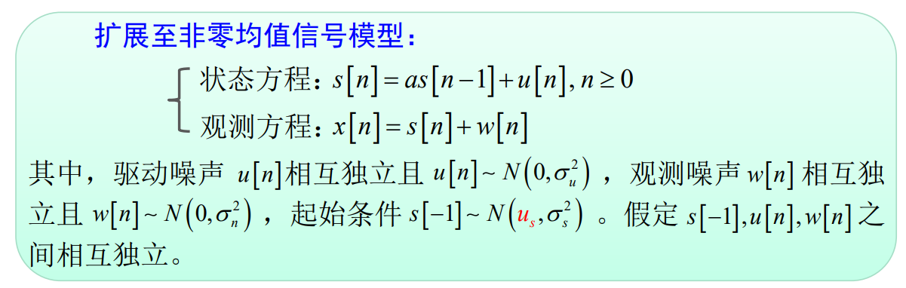

初始化：$\hat{s} [ - 1|- 1] = E\begin{pmatrix} s[ - 1] \end{pmatrix} = \mu _s$ $M[ - 1|- 1] = E\left ( \begin{pmatrix} s[ - 1] - \hat{s} [ - 1|- 1] \end{pmatrix} ^2\right ) = \sigma _s^2$

估计量预测：$\hat{s}[n|n-1]=a\hat{s}[n-1|n-1]$

MSE预测：$M\left[n\mid n-1\right]=a^2M\left[n-1\mid n-1\right]+\sigma_u^2$

卡尔曼增益：$K[n]=\frac{M\left[n|n-1\right]}{M\left[n|n-1\right]+\sigma_n^2}$

估计量修正：$\hat{s}[n|n]=\hat{s}[n|n-1]+K[n]\left(x[n]-\hat{s}[n|n-1]\right)$

MSE修正: $M\left [ n\mid n\right ] = \left ( 1- K\left [ n\right ] \right ) M\left [ n\mid n- 1\right ]$

### 矢量状态-标量观测信号模型

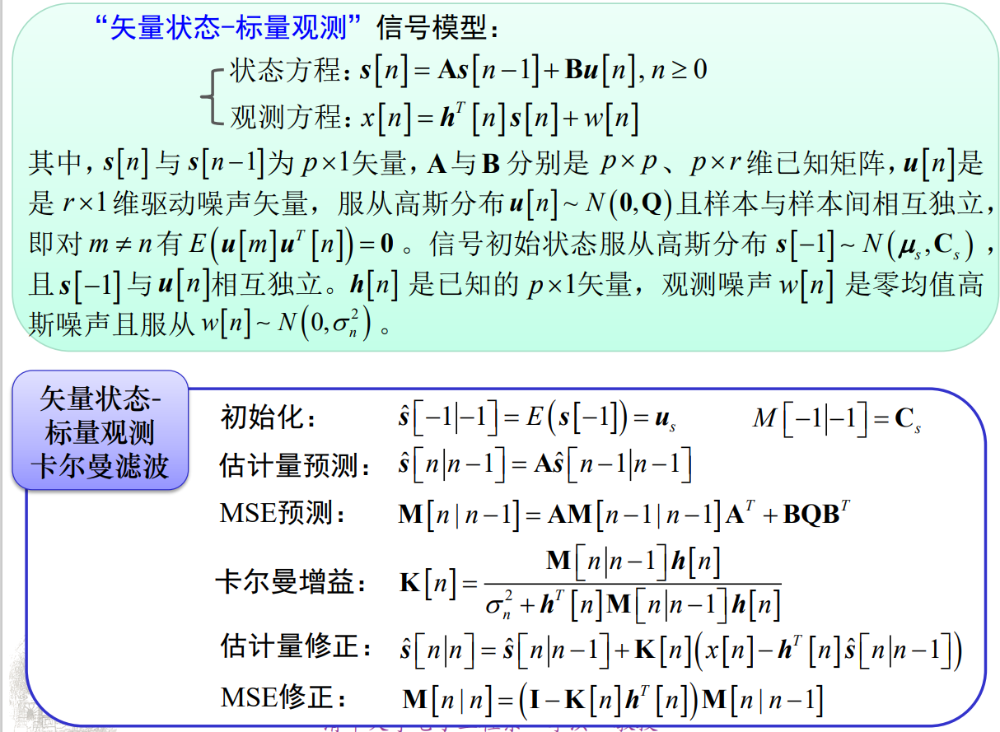

### 矢量状态-矢量观测信号模型

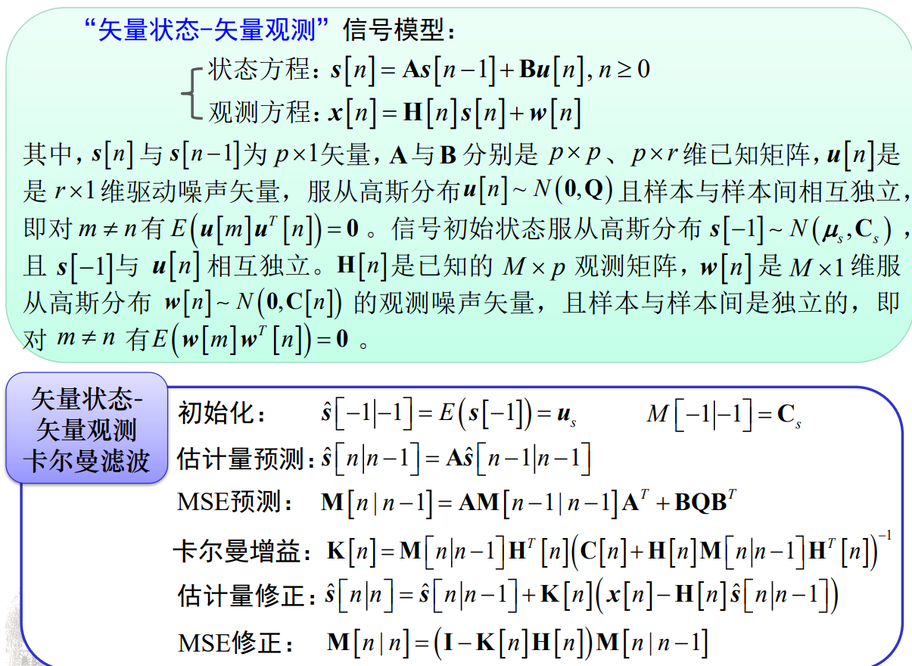

### 非线性信号模型

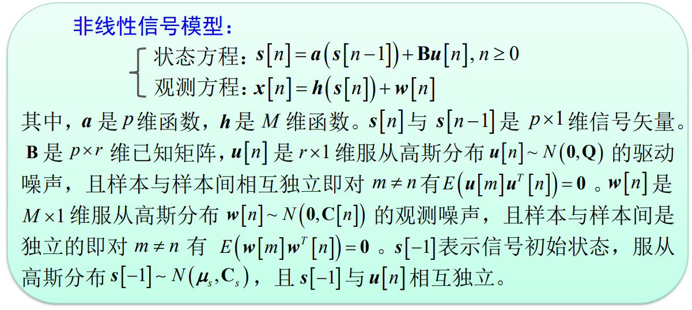

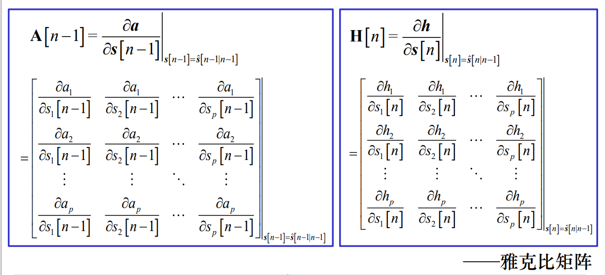

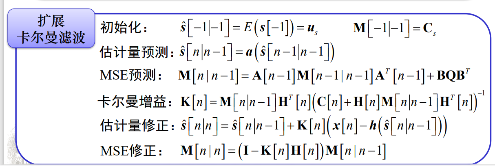

### 总结

* 不同时刻的待估计参数并不完全一样，但是存在某些内在联系
* 卡尔曼滤波利用这种联系进行 LMMSE 估计，并减少了运算量
* 如果信号与噪声是高斯的，则卡尔曼滤波在 MMSE 准则下最佳，否则，在 LMMSE 准则下是最佳的。

## 信号检测基本准则与方法

之前一直在研究连续型的问题（回归/估计），这里研究离散型的问题（分类/检测）。

### Neyman-Pearson 准则

适用于没有先验信息、代价不好量化的场景。

两种假设：

$$
\begin{aligned}&H_0:x[n]=w[n],n=0,1,...,N-1\\&H_1:x[n]=s[n]+w[n],n=0,1,...,N-1\end{aligned}
$$

$$
\begin{aligned}
&P\left(H_1;H_0\right):\text{ 虚警概率}\left(P_{FA},\text{有时简记为}P_F\right)\\
&P\left(H_0;H_1\right):\text{ 漏检概率 }\left(P_M\right)\\
&P\left(H_1;H_1\right):\text{ 检测概率 }\left(P_D\right)\end{aligned}
$$

要求：在虚警概率一定情况下，使检测概率最大化

检测概率和虚警概率之间追求折中，不可能两者都改善。

对给定的虚警概率 $P_{FA}=\alpha$ ,使检测概率 $P_D$ 最大的判决为

$$
L(x)=\frac{p(x;H_1)}{p(x;H_0)}>\gamma
$$

其中门限由 $P_{FA}=\int_{\lbrace\mathbf{x}:L(\mathbf{x})>\gamma\rbrace}p(\boldsymbol{x};H_0)d\boldsymbol{x}=\alpha$ 决定

对于信号检测问题：

$$
H_0:\boldsymbol{x}\sim N\left(\boldsymbol{0},\sigma^2\mathbf{I}\right)\\H_1:\boldsymbol{x}\sim N\left(A\mathbf{1},\sigma^2\mathbf{I}\right)
$$

NP 检测器：

$$
\frac{p\left(\boldsymbol{x};H_1\right)}{p\left(\boldsymbol{x};H_0\right)}=\frac{\frac1{\left(2\pi\sigma^2\right)^{N/2}}\exp\left\{-\frac1{2\sigma^2}\sum_{n=0}^{N-1}\left(x[n]-A\right)^2\right\}}{\frac1{\left(2\pi\sigma^2\right)^{N/2}}\exp\left\{-\frac1{2\sigma^2}\sum_{n=0}^{N-1}x^2[n]\right\}}>\gamma\\\quad\exp\left\{-\frac1{2\sigma^2}\sum_{n=0}^{N-1}\left(x[n]-A\right)^2+\frac1{2\sigma^2}\sum_{n=0}^{N-1}x^2[n]\right\}>\gamma 
$$

$$
-\frac1{2\sigma^2}\Bigg(-2A\sum_{n=0}^{N-1}x[n]+NA^2\Bigg)>\ln\gamma\\\frac1N\sum_{n=0}^{N-1}x[n]>\frac{\sigma^2}{NA}\ln\gamma+\frac A2
$$

称为检测统计量。若均值大于门限，则判为有信号，否则为无信号。

使用方法：

$$
\begin{aligned}
&\text{检测统计量:}T(x)=\frac1N\sum_{n=0}^{N-1}x[n]\sim\begin{cases}N\Big(0,\sigma^2\Big/_N\Big),&H_0\\[2ex]N\Big(A,\sigma^2\Big/_N\Big),&H_1\end{cases} \\
&\text{虚警概率:}P_{FA}=Pr\left(T\left(\boldsymbol{x}\right)>\gamma^{'};H_0\right)=Q\left(\frac{\gamma^{'}}{\sqrt{\sigma^2/N}}\right) \\
&\text{门限设置:}\gamma^{\prime}=\sqrt{\frac{\sigma^2}N}Q^{-1}\left(P_{FA}\right) \\
& \begin{aligned}&\text{相应的检测概率:}\\&P_{D}=Pr\Big(T\big(\boldsymbol{x}\big)>\gamma^{'};H_{1}\Big)=Q\Bigg(\frac{\gamma^{'}-A}{\sqrt{\sigma^{2}/N}}\Bigg)=Q\Bigg(\frac{\sqrt{\frac{\sigma^{2}}{N}}Q^{-1}\big(P_{FA}\big)-A}{\sqrt{\sigma^{2}/N}}\Bigg)\end{aligned}  \\
&=Q\Bigg(Q^{-1}\big(P_{F_A}\big)-\sqrt{\frac{NA^2}{\sigma^2}}\Bigg)
\end{aligned}
$$

### 检测性能分析

接收机工作特性曲线（ROC, receiver operating characteristics）

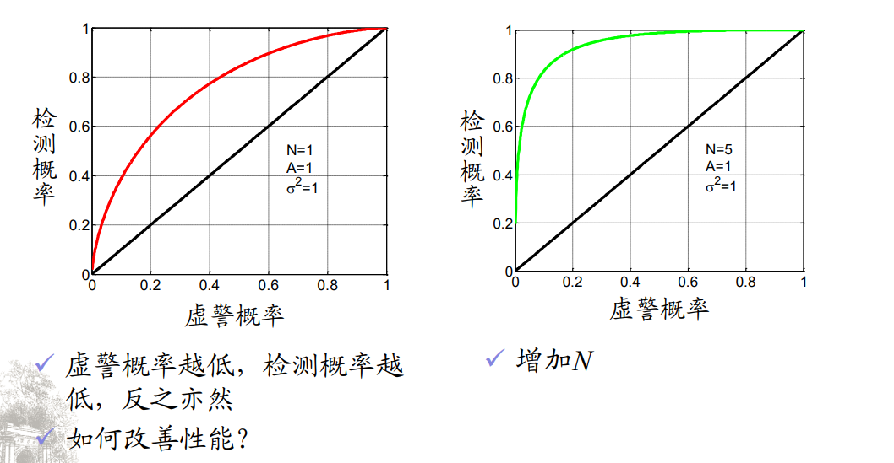

直观理解：

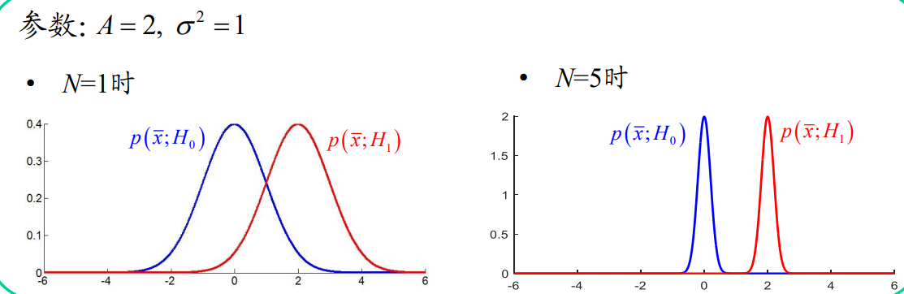

多次观测的好处

- 从数学角度：不同假设下的pdf分隔更开，更易区分不同假设
- 从信号处理角度：增加信号预检测积分时间，获得更多的能量用于检测
- 从信息论角度：多的观测数据带来了新的信息

### 最小错误概率准则

$$
\begin{aligned}
P_{e}& =\Pr\left\{\text{判}H_0,H_1\text{为真}\right\}+\Pr\left\{\text{判}H_1,H_0\text{为真}\right\}  \\
&=P\big(H_0,H_1\big)+P\big(H_1,H_0\big) \\
&=P\big(H_1\big)P\big(H_0|H_1\big)+P\big(H_0\big)P\big(H_1|H_0\big) \\
&=P\big(H_1\big)\int_{R_0}p\big(\boldsymbol{x}|H_1\big)d\boldsymbol{x}+P\big(H_0\big)\int_{R_1}p\big(\boldsymbol{x}|H_0\big)d\boldsymbol{x} \\
&=P\big(H_1\big)\Bigg(1-\int_{R_1}p\big(\boldsymbol{x}\mid H_1\big)d\boldsymbol{x}\Bigg)+P\big(H_0\big)\int_{R_1}p\big(\boldsymbol{x}\mid H_0\big)d\boldsymbol{x} \\
&=P\left(H_1\right)+\int_{R_1}\left\{P\left(H_0\right)p\left(\boldsymbol{x}\mid H_0\right)-P\left(H_1\right)p\left(\boldsymbol{x}\mid H_1\right)\right\}d\boldsymbol{x}
\end{aligned}
$$

为了使错误最小，需要在积分式小于零的区域积分，即

$$
\frac{p\left(\boldsymbol{x}\mid H_1\right)}{p\left(\boldsymbol{x}\mid H_0\right)}>\frac{P\left(H_0\right)}{P\left(H_1\right)}\text{ 时,判 }H_1
$$

最小错误概率准则可推导出最大后验概率检测器：

$$
\frac{p\left(\boldsymbol{x}\mid H_1\right)}{p\left(\boldsymbol{x}\mid H_0\right)}>\frac{P\left(H_0\right)}{P\left(H_1\right)}\text{ 时,判 }H_1
$$

等价于

$$
\frac{p\left(\boldsymbol{x}\mid H_1\right)P\left(H_1\right)}{p\left(\boldsymbol{x}\right)}>\frac{p\left(\boldsymbol{x}\mid H_0\right)P\left(H_0\right)}{p\left(\boldsymbol{x}\right)}\\p\left(H_1\mid\boldsymbol{x}\right)>p\left(H_0\mid\boldsymbol{x}\right)
$$

若先验概率相同，则为最大似然检测器：

$$
p\left(x\mid H_1\right)>p\left(x\mid H_0\right)
$$

### 二元贝叶斯风险准则

引入判错代价

$$
R=C_{01}P\left(H_1\right)P\left(H_0\mid H_1\right)+C_{10}P\left(H_0\right)P\left(H_1\mid H_0\right)
$$

进一步泛化：

$$
R=C_{00}P\big(H_0\big)P\big(H_0|H_0\big)+C_{10}P\big(H_0\big)P\big(H_1|H_0\big)\\+C_{01}P\big(H_1\big)P\big(H_0|H_1\big)+C_{11}P\big(H_1\big)P\big(H_1|H_1\big)
$$

$$
\begin{aligned}\text{R}&=C_{00}P\left(H_0\right)+C_{01}P\left(H_1\right)\\&+\int_{R_1}\left\{\left(C_{10}-C_{00}\right)P\left(H_0\right)p\left(\boldsymbol{x}\mid H_0\right)-\left(C_{01}-C_{11}\right)P\left(H_1\right)p\left(\boldsymbol{x}\mid H_1\right)\right\}d\boldsymbol{x}\end{aligned}
$$

因此，有了最小贝叶斯风险判决准则：

$$
\frac{p\left(\boldsymbol{x}\mid H_1\right)}{p\left(\boldsymbol{x}\mid H_0\right)}>\frac{\left(C_{10}-C_{00}\right)P\left(H_0\right)}{\left(C_{01}-C_{11}\right)P\left(H_1\right)}\text{ 时,判 }H_1
$$

风险一致条件下（$C_{00}=C_{11}=0,C_{10}=C_{01}=1$），回到最小错误概率准则。

### 多元贝叶斯风险准则

贝叶斯风险：

$$
\begin{aligned}
\text{R}& =\sum_{i=0}^{M-1}\sum_{j=0}^{M-1}C_{ij}P\Big(H_i,H_j\Big)  \\
&=\sum_{i=0}^{M-1}\sum_{j=0}^{M-1}C_{ij}\int_{R_i}P\Big(x,H_j\Big)dx \\
&=\sum_{i=0}^{M-1}\int_{R_i}\sum_{j=0}^{M-1}C_{ij}P\Big(x,H_j\Big)dx \\
&=\sum_{i=0}^{M-1}\int_{R_i}\sum_{j=0}^{M-1}C_{ij}P\Big(H_j\mid x\Big)p(x)dx
\end{aligned}
$$

应选择使平均风险$C_i\left(\boldsymbol{x}\right)=\sum_{j=0}^{M-1}C_{ij}P\left(H_j\mid\boldsymbol{x}\right)$最小的假设

在风险一致条件下

$$
C_{ij}=\begin{cases}0,&i=j\\1,&i\neq j\end{cases}
$$

$$
\begin{aligned}C_{i}\left(\boldsymbol{x}\right)&=\sum_{j=0\atop j\neq i}^{M-1}P\Big(H_j\mid\boldsymbol{x}\Big)\\&=\sum_{j=0}^{M-1}P\Big(H_j\mid\boldsymbol{x}\Big)-\underline{P\Big(H_i\mid\boldsymbol{x}\Big)}_{最大化这个}\end{aligned}
$$

因此等价于最大后验准则：

$$
\max_iP(H_i\mid\boldsymbol{x})
$$

若此时先验概率相同，则为最大似然准则。