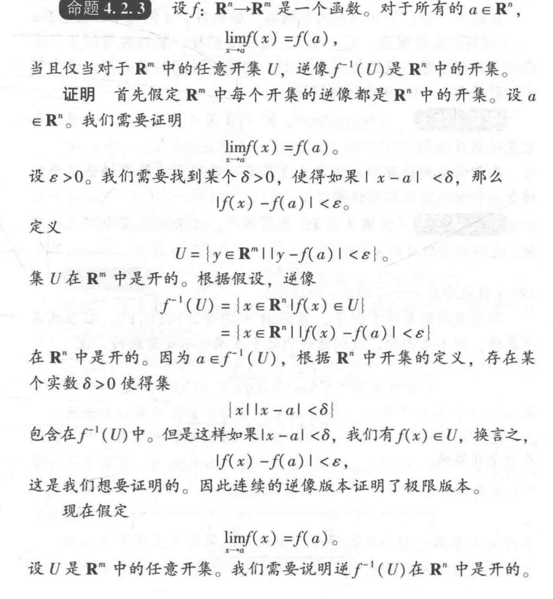
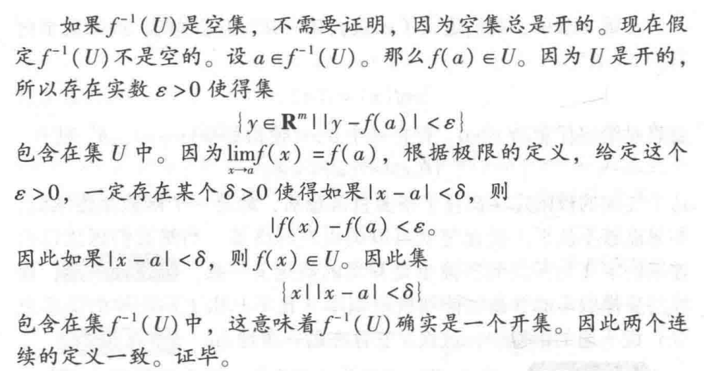

## 0716

p63

疑问：为什么第一部分证明时，不需要判断 $f^{-1}(U)$ 是一个空集？因为 $U$ 的逆像在第一部分的定义至少包含了一个点 $a$。

而在第二部分证明中，$U$ 被设定为一个任意的开集，因此不能保证逆像非空。

## 20250815

### 两个半正定矩阵的证明

已知，$a_1, \dots, a_n$ 全为非负的实数，可以证明矩阵

$$
C_{ij}=\lbrace{\min(a_i, a_j)}\rbrace_{ij}, D_{ij}=(\frac1{a_i + a_j})_{ij}
$$

均为半正定矩阵。

两个证明的思路是类似的。对于第一个，

$$
\min(a_i, a_j)=\int_0^\infty\mathbb I[x \le a_i] \mathbb I[x \le a_j]\mathrm dx
$$

其中 $\mathbb I[x \le a]$ 是指示函数，当 $x \le a$ 的时候取值为 1，$x \gt a$ 时取值为 0.

因此，对任意 $\xi_i, \xi_j$ 均有

$$
\sum_{1\le i, j \le n}\xi_i\xi_j\min(a_i, a_j) = \sum_{1\le i, j \le n}\xi_i\xi_j \int_0^\infty\mathbb I[x \le a_i] \mathbb I[x \le a_j]\mathrm dx \\
= \int_0^\infty\sum_{1\le i, j \le n}\xi_i\xi_j\mathbb I[x \le a_i] \mathbb I[x \le a_j]\mathrm dx \\
= \int_0^\infty \left(\sum_{1\le i \le n}\xi_i\mathbb I[x \le a_i]\right)^2\mathrm dx \ge 0
$$

根据定义可知 $C_{ij}$ 为非负矩阵。

同理，对于 $D_{ij}$

$$
\frac1{a_i + a_j}=\int_0^\infty e^{-(a_i + a_j)x}\mathrm dx= \int_0^\infty e^{-a_ix}e^{-a_jx}\mathrm dx\\
\sum_{1\le i, j \le n}\xi_i\xi_j \frac1{a_i + a_j}=\sum_{1\le i, j \le n}\xi_i\xi_j \int_0^\infty e^{-a_ix}e^{-a_jx}\mathrm dx\\
=\int_0^\infty\sum_{1\le i, j \le n}\xi_i\xi_j e^{-a_ix}e^{-a_jx}\mathrm dx\\
=\int_0^\infty\left(\sum_{1\le i \le n}\xi_i e^{-a_ix}\right)^2\mathrm dx \ge 0
$$

实际上，取

$$
\frac1{a_i + a_j} = \int_1^\infty x^{-a_i-0.5}x^{-a_j-0.5}\mathrm dx
$$

也是可以的，只需设 $x = e^t$ 就会发现是等价的。

那么我们可以据此构造出很多的正定矩阵，把积分上限从无穷换成别的东西，也能得到一大堆公式。

