## 绪论

软硬件协同，制作深度学习硬件

理论课，讲座，Lab

专用电路

目标：做一个类似于Google TPU中的某计算模块

benchmark: ML

每4周一个Lab，无期中期末

作业：

AlexNet Paper

Quantization of CNN

## DNN

### Training & Inference

Training: forward and backward

Inference: backward

### Model

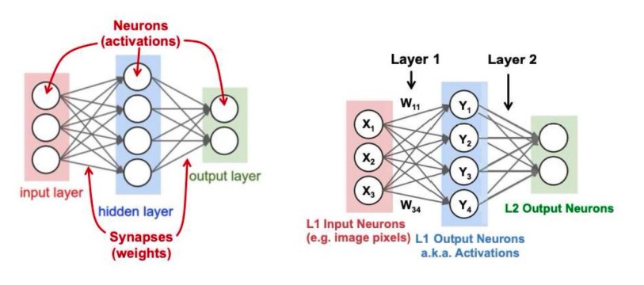

五类算子：

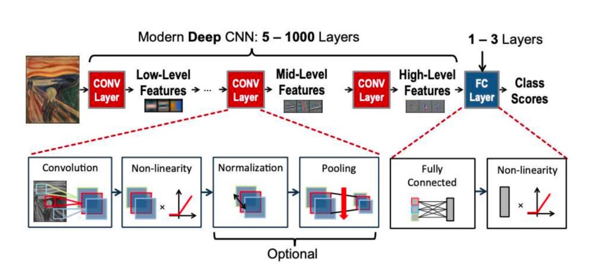

特征提取器：卷积层，池化层；

分类器：全连接层

**线性卷积层**

边界扩充(Padding)：在图像周围扩展一圈0，避免多次卷积导致数据尺寸越来越小

卷积步长(Stride)：卷积核每次跳的步数。可以用来让数据尺寸快速变化

非线性函数-激活函数

非线性-正则化函数

非线性-池化函数

**池化层**

池化层减小图片的尺寸，从而减小参数的数量和计算量。

最大池化：在池化窗口内取最大值作为输出。
* 复杂度低，硬件实现容易
* 最为常用

平均池化：取池化窗口内的平均值作为输出。

$L^2$ 池化法：对所有的数计算平方后累加求和再开平方。
* 计算复杂度高
* 几何平均池化的复杂度更高

**线性全连接层**

将特征图映射为分类结果

**Softmax 层**

有的模型在输出层使用softmax对输出进行归一化：

$$
f(z_j) = \dfrac{e^{z_j}}{\sum_{i = 0}^n e^{z_j}}
$$

* 输入和输出规模相同
* 归一化计算，让较大的值凸显，让较小的值被抑制，从而决定分类概率

**卷积神经网络的总体结构**

### Dataset

数据集的建立：数据采集，数据标签，数据清洗，数据增强，数据分割

### Cost function

### Optimization

* 梯度下降法
* SGD
* 动量法：计算过去的平均梯度
* AdaGrad法：累加梯度方差
* RMSProp：按时间降低学习率
* Adam 算法：指数加权移动平均值计算梯度动量和二次矩
* SGD简单，但是训练过程边长，自适应算法会更高效

### Evaluation

**回归问题指标**

PSNR

$$
PSNR = 10 \cdot \log_{10}(\frac{MAX_I^2}{MSE})
$$

**分类问题指标**

* Top1 accuracy
* Top5 accuracy

**IoU**

Intersection of Union?

$$
\text{IoU} = \frac{|A\cap B|}{|A \cup B|}
$$

**检测任务评价指标 mAP**

mean average precision

真阳性TP: 预测为真，实际为真

假阳性FP：预测为真，实际为假

假阴性FN：预测为假，实际为真

**查全率（召回率，Recall）和查准率（准确率，Precision）**

$$
\text{Precision} = \frac{TP}{TP + FP}\\
\text{Recall} = \frac{TP}{TP + FN}
$$

置信度衡量的是模型认为有效的自信程度。我们先将结果按照置信度从高到低排序。

mAP是不同查全率下，最高查准率的平均值。

### 网络结构的发展和讨论

**分类任务**

AlexNet
* 使用多个卷积层，有效提取图像特征
* ReLU 提高训练速度
* Dropout、数据增强扩大训练集，防止过拟合

VGG
* 使用 3 * 3 的卷积核取代 AlexNet 的大卷积核
    * 提升收敛速度
    * 参数量更少
    * 可以构建更深的网络，有更多的非线性变换，还有更强的表征能力
* 参数预初始化策略

ResNet

?

**目标检测**

Two-stage v.s. One-stage

**Two-stage**

先画框，再分类

MS CoCo Dataset
* 用的最多的还是目标检测任务

R-CNN
* 输入图像
* 提取候选框
* 每一个候选框提取单独的特征
* 进行分类

Fast R-CNN
* 输入图像
* 一次特征提取
* 提取候选框
* 进行分类

Faster R-CNN
* 输入图像
* 一次特征提取
* 提取候选框
* 进行分类

**One-stage**

YOLO

五代发展，最广泛的目标检测算法

对于每一个像素，都会输出一个对应的特征向量，包含：
* 二分类：是物体中心的置信度
* 回归：偏离物体中心的长度 $\Delta x$ 和 $\Delta y$
* 分类：对应的物体分类以及置信度
* 回归：该像素所代表的物体的长宽，YOLO有一些基础框(anchor)，输出值是相对基础框的形变 $\Delta h$ 和 $\Delta w$

**NMS (Non-Maximum Suppression)**
Bounding boxes for one instance may overlap.
Method: For each type, use NMS to eliminate redundant bounding boxes (greedy approach).
Workflow:
1. Sort candidate bounding boxes by classification confidence.
2. Adding the boxes b with most confidence to output list, and delete it from the candidate boxes.
3. Calculate IoU between b and other boxes bi. If > threshold, delete bi.
4. Repeat until no candidate bounding boxes.

**序列模型（Serial Model）**

to process Speech, text, video, audio, etc.

Feature: 
1. The data input is in the time sequence.
2. There is a correlation between the data before and after.

So the model should have the ability to "store" information.

Speech dataset: TIMIT
1. It consists of recordings of 630 speakers of 8 dialects of American English each reading 10 phonetically-rich sentences.
2. It also comes with the word and phone-level transcriptions of the speech.

Video dataset: DAVIS

The Densely Annotation Video Segmentation dataset (DAVIS) is a high quality and high resolution densely annotated video segmentation dataset under two resolutions, 480p and 1080p.

There are 50 video sequences with 3455 densely annotated frames in pixel level. 30 videos with 2079 frames are for training and 20 videos with 1376 frames are for validation.

NLP dataset: GLUE

General Language Understanding Evaluation (GLUE) benchmark: Standard split of data totrain, validation, test, where labels for the test set is only held in the server.

* Sentence pair tasks
    * MNLI, Multi-Genre Natural Language Inference
    * QQP, Ouora Ouestion Pairs
    * QNLI, Ouestion Natural Language Inference
    * STS-B The Semantic Textual Similarity Benchmark
    * MRPC Microsoft Research Paraphrase Corpus
    * RTE Recognizing Textual Entailment
    * WNLI Winograd NLI is a small natural language inference 
* datasetSingle sentence classification
    * SST-2 The Stanford Sentiment Treebank
    * CoLA The Corpus of Linguistic Acceptability

**Models**

**RNN: Recurrent Neural Network**

* one to one 
* one to many
* many to one
* many to many
* many to many

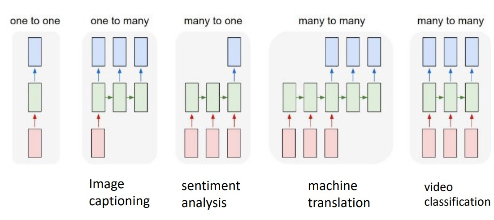

损失函数的计算：

单个时刻：

$$
L^{(t)} = -\mathbf y^{(t)} \ln \mathbf {\hat {y}}^{(t)}
$$

整个序列：

$$
L = \sum\limits_{t=1}^{\tau}L^{(t)} = - \sum\limits_{t=1}^{\tau} \mathbf y^{(t)} \ln \mathbf {\hat {y}}^{(t)}
$$

然后可求梯度：

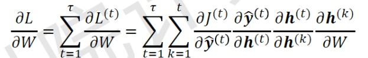

循环神经网络存在梯度爆炸或梯度消失，因此无法处理长期的依赖关系。

**LSTM: Solving the Gradient**

**Transformer**

Self attention:

$$
\text{Attention}(Q, K, V) = \text{softmax}(\frac{QK}{\sqrt d_k})V
$$

## Quantization

### Fixed-point and floating-point representation

#### Fixed Point arithmetic

$$
\underbrace{0}_{\text{Sign bit}}\ \ \underbrace{10\dots01}_{n\text{ bit integer part}}\ \ .\underbrace{10\dots01}_{m\text{ bit fractional part}}
$$

**Fixed point with slope and bias**

apply a linear transform on fixed point:

$$
y = s*x + z
$$

#### Floating-poing arithmatic

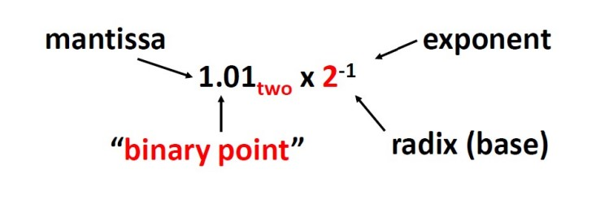

**IEEE 754 Floating Point Standard**

* Called Biased Notation, where bias is number subtracted to get real number. 
* IEEE 754 uses bias of 127 for single precision, 1023 for double precision.

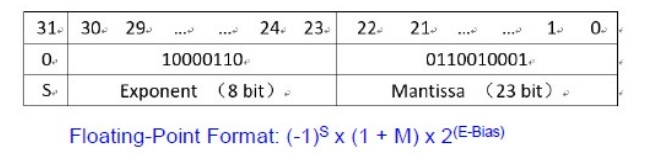

$$
(-1)^S \times (1 + m) \times 2^{(E - \text{Bias})}
$$

**fp15(helf precision)**

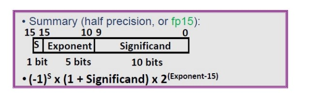

### Hardware implications

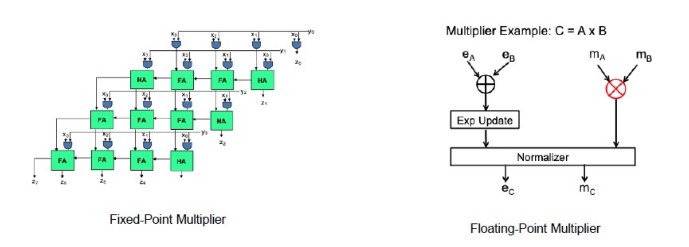

加法下定点数比浮点数功耗小得多，但是乘法下定点数和浮点数的性能差不多。

Low bit Fixed-point representations on digital system

### Quantization for deep learning

* Post-training quantization
* Quantization-aware training

**Post-training quantization**

$$
r = S(Q - Z)\\
OA[i, k] =\sum\limits_{j=1}^{N}(W[i, j] * IA[j, k])\\
q_{OA}^{(i, k)} = Z_{OA} + \frac{S_W * S_{IA}}{S_{OA}}\sum\limits_{j=1}^{N} (q_W^{(i, j)} * q_{IA}^{(j, k)})
$$

Choose the optimal threshold

No saturation is bad 

### Classic research for quantization methods

**Basic structure**

Weight Quantization & Activation Quantization

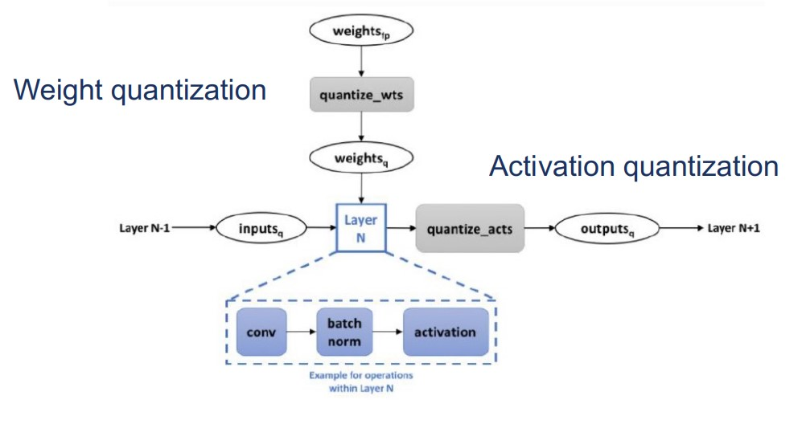

**Dorefa Net**

* quantization for gradient
* normalize data to ensure the data distribution not change after quantization
* uniform noise to offset the quantization noise for gradient
* replace accumulate with bitcount operation
* result is that gradient precision is most sensitive in TAQ(G > A > W)

**INQ**

* quantization first half and freeze the other, then unfreeze other to train normally
* exchange the first half and second half, and repeat above

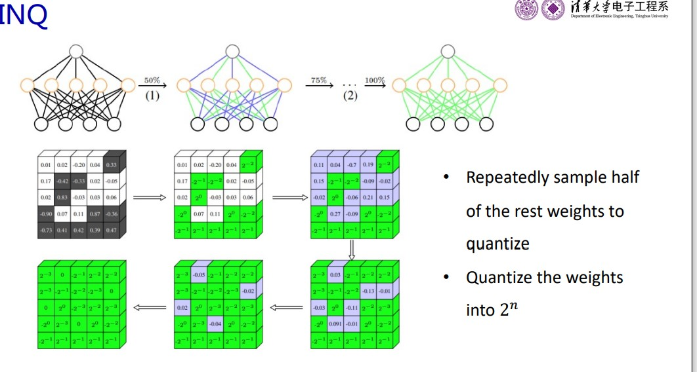

**Pact**

* clipping the activation before quantization is better

$$
PACT(x) = 0.5(|x| - |x - \alpha| + \alpha) = \begin{cases}
    0, x<0,\\
    x, 0\le x \lt \alpha,\\
    \alpha, x \ge \alpha 
\end{cases}
$$

Different layers need different α

alpha should be learnable

**Outlier quantization**

* Use different quantized bits to quantize different weights. Some weight can have higher precision while others not.

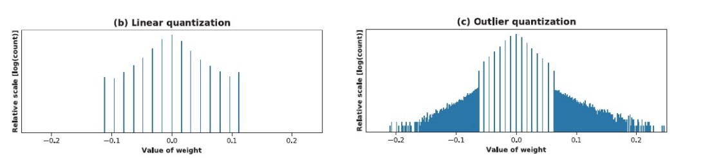

**Quantization interval learning**

* Most of the weights are very small. Minor weights can have too large value.

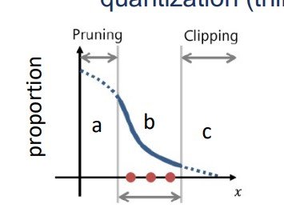

a should be pruned, c should be clipped, only b worths quantizing.

**Binary neural networks (BNN)**

* Networks with weights composed of {-1, 1}

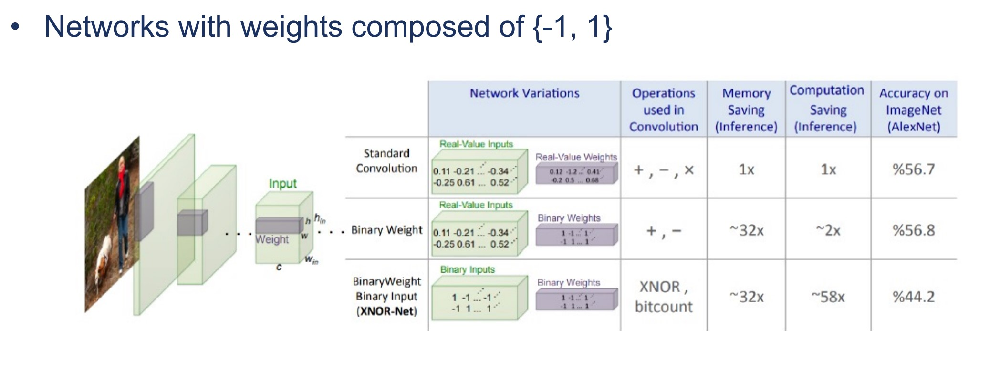

* 计算时长跟精度有平方反比的关系，优化是平方的
* 存储跟精度只有线性的关系，优化是线性的，由于BNN bit数少，总的参数量更多，实际上存储没怎么优化
* BNN 大幅优化了计算，但是存储没变，此时存储成为了瓶颈

**State-of-the-art hardware support for low 
precision DNNs**

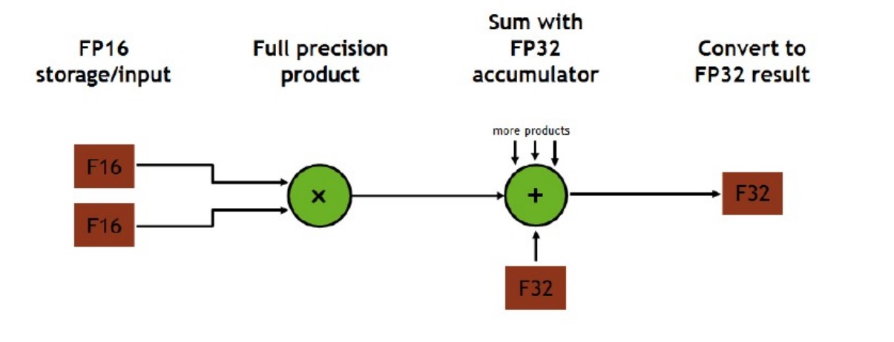

