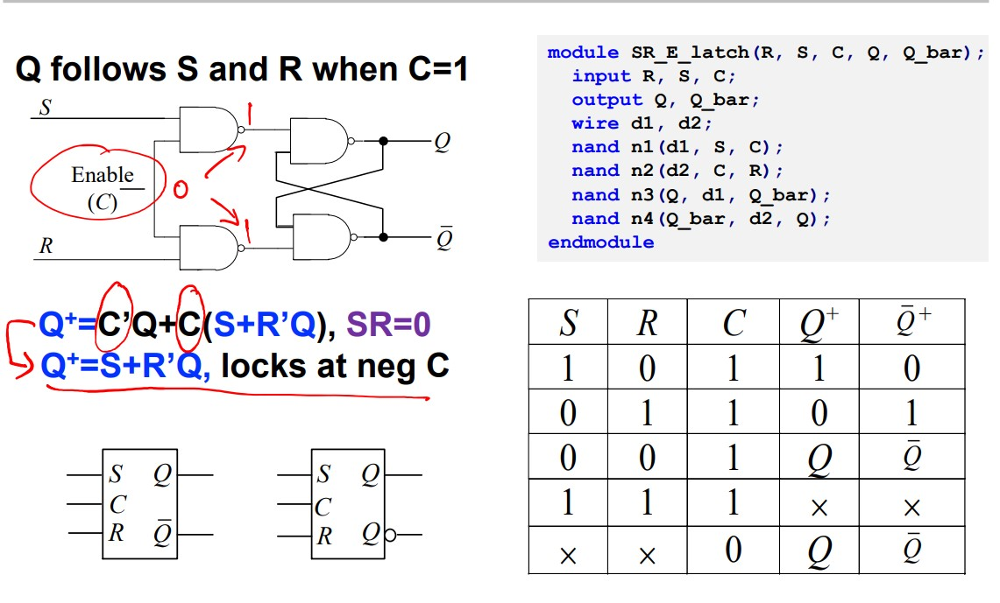

## Introduction

## Boolean Algebra

### The Number System

#### BCD

BCD (Binary-Coded Decimal)

Classic method: 8421BCD.

add calculation:

the problem of carry:

$$
(14)_D+(28)_D=(0001\ 0100)_{BCD} + (0100\ 0100)_{BCD}\\
=(0101\ 1100)_{BCD}=(0110\ 0010)_{BCD}
$$

#### Gray Code

used in logic simplification and signal transmission.

every time a single bit is changed.

#### Floating poing Number

#### Negative numbers

**Complement Numeric System**

1's Complement: $N_{1's} + (-N)_{1's} = (111...)_{1's}$, or just inverting every bit of N. Low space efficiency and difficult to compute.

2's Complement: $N_{2's} + (-N)_{2's} = (000...)_{2's}$, or just inverting every bit of N and plus 1. A shift on 1's Complement.

MSB=Most significant bit, LSB=Least significant bit.

$$
-N=N_{us}-2^n=\sum_{i=0}^{n-1}k_i2^i-2^n=-k_{n-1}2^{n-1}+k_{n-2}2^{n-2}+\dots k_02^0
$$

So just set the weight of MSB to $-2^{n-1}$.

we ignore the bit beyond the range to make sure the answer is correct.
$$
(101)_{2's}+(001)_{2's}=(110)_{2's}\\
(011)_{2's}-(001)_{2's}=(011)_{2's}+(111)_{2's}=(010)_{2's}
$$
To detect an overflow, we can notice if 2 positive numbers add up to a negative numbers or 2 negative numbers add up to a positive numbers.

We can fix overflow by adding 0 as MSB if the answer should be positive and adding 1 as MSB if the answer should be negative.
### Boolean expression

#### Definition

$$
+(\text{OR/logic add}),\cdot (\text{AND/logic multiply}), \prime(\bar{})(\text{NOT/logit NOT})
$$

#### Boolean function

**Duality**

AND<->OR, 0<->1, variables unchanged.

$$
F_1=F_2\Leftrightarrow F_1^D=F_2^D
$$

**De Morgan's Law**

AND<->OR, 0<->1, **X<->X'**

**Useful Theorem**

X(Y+Z)=XY+XZ

XY+Z=(X+Z)(Y+Z)

X+XY=X

X(X+Y)=X

### Boolean function simplification

#### 2-level logic

**Standard form**
SOP and POS

Sum of Products or Products of Sum

**Min-term**
A min-term is a product of all variables taken either in the direct or complemented form, each variable shown once.

$A'B'C'=m_0$ and $ABC=M_7$

**Max-term** A max-term is a sum of all variables taken either in the direct or complemented form, each variable shown once.

$A+B+C=M_0$ and $A'+B'+C'=M_7$

$$
m_6= \overline{M_6}
$$

**Karnaugh Maps**

Use row and columns to represent combinations of the inputs(by min-terms), the cell to represent the value. The inputs is ordered by the sequence of Grey Code.

#### Simplification of 2-level logic

**Karnaugh Maps method**

If two adjacent min-terms deliver logic 1, merge them.

**Implicant**

$$
G\Rightarrow F, \text{then }G\text{ is the implicant of }F\\
no\ Q\ s.t.P\Rightarrow Q\Rightarrow F, \text{then }P \text{ is the prime implicant of }F\\
\text{If one min-term can only be covered by one prime implicant, this prime implicant is an EPI.}
$$

EPI will finally exist there.

**Q-M method**

algorithm to simplify multiple-input large-scale function.

## Combinational Logic

### Gate

NAND, NOT, NOR is better than AND, OR in saving area.

**Transmission Gate** Use both NMOS and PMOS to form a CMOS switch. NMOS is good at transmitting low volt while PMOS is better at working on high volt.

**Tri-state Gate** EN is high, TG on, F=A; EN is low, TG off, F is isolated from input A. The states are called logic 0, logic 1 and high-resistance Z.

The bottom part of the circuit is used to avoid the high-Z state.

### Combinational logic circuits

Outputs are the function of logic input circuits.

Determined only by current not past inputs + delay

To deal with complex logic with many inputs, we should:

* From 2-level to multi-level(BDD?)
* Divide-and-conquer
* Re-using

#### Metrics

**Static metrics** Logic voltage values, DC noise margins, Area, Fan-out

**Dynamic metrics** Speed/delay, Power dissipation, Noise(reference)

**Speed** rise time and fall time. Propagation time.

**Fan out** The maximum number of CMOS inputs that one logic output can drive.

**Power and energy** Leakage power: subthreshold leakage power, gate leakage, D/S subtrate leakage. We can increase $|V_{TH}|$ or decrease $V_{DD}$.

$$
P_{total} = P_{dynamic} + P_{dynamic_short} + P_{leakage}
$$

Dynamic power $P_{dynamic_short}$ shows in pull-up and pull-down on.

Energy-delay product is a metric.

#### Hazard

**static-1 hazard** '1' output has a transient '0' glitch

**static-0 hazard** '1' output has a transient '0' glitch

**dynamic hazard** several transitions during a single output change(not required)

If the initial input and final input cannot be covered by one PI, it may have a glitch as state transition.

### Basic comb. logic circuits

Encoder: inputs are more, outputs are less($n \le 2^m$)

Decoder: inputs are less, outputs are more($m = 2^n$)

Multiplexer: From several inputs, choose one as output according to the address inputs. It can be used to make a shift register. We can use n-bit-addr MUX for m-bit function.

Adder: Half adder & full adder.

Half Adder: $S = A \oplus B$

Full adder: $C_{out} = A\cdot C_{in} + B\cdot C_{in} + A\cdot B, S = A\oplus B\oplus C_{in}$

Implements of Full Adder:

**Serial Adder** $C_{i+1} = A_iC_i+B_iC_i + A_iB_i$. The latency is disastrous.

**Carry Lookahead Adder(CLA)**

First define $P_i = A_i\oplus B_i, G_i = A_iB_i$, P means Carry-bit propagation, G means Carry-bit Generation. Thus, $C_{i+1} = G_i + P_iC_i, S_i = A_i\oplus B_i\oplus C_i = P_i\oplus C_i$. Thus the $C_i$ can be replaced: 

$$
C_1 = G_0+P_0C_0\\
C_2 = G_1 + P_1(G_0+P_0C_0) =  G_1 + P_1G_0+P_1P_0C_0\\
C_3 = G_2 + P_2(G_1 + P_1G_0+P_1P_0C_0) = G_2 + P_2G_1 + P_2P_1G_0+P_2P_1P_0C_0\\
C_4=G_3+P_3(G_2 + P_2G_1 + P_2P_1G_0+P_2P_1P_0C_0)=G_3+P_3G_2 + P_3P_2G_1 + P_3P_2P_1G_0+P_3P_2P_1P_0C_0
$$

A 4-bit CLA can be designed using these formulas. For more, it is too complex. However, we can cascade the 4-bit CLA to reach the balance of latency and complexity.

Moreover, here comes the parallel intra- and inter-group CLA which regards the 4-bit adder as a block and defines its $P_i$ and $G_i$, connecting the 4-bit adders in a similar manner as the structure of 4-bit adder inside.

## Sequential logic

### Clock

- Ring Oscillator
- LC oscilator
- Crystal Oscillator

### State and FSM

**States** contain all needed infomation. could be redundant.

**Finite State Machine(FSM)** The number of input, output and states are finite.

Mealy FSM: 

Moore FSM: 

We describe the FSM by State Transition Table or State Diagram.

Remember: Moore is less.

### Latch

Watch the input at the **duration** clock enables.

#### Examples

**SR latch**

$SR=0$ is required.

$$
Q^+=S+R^\prime Q
$$

A gated version:

$$
Q^+=C^\prime Q + C(S+R^\prime Q)
$$

**D latch**

$$
Q^+=D
$$

Transimission Gate version

#### Timing parameters

### Flip-Flop

Watch the input only at the **moment** when clock signal rises or falls.

#### Examples

D Flip-flop(DFF)

2 D latches in series with opposite clock.

**Use the delay to help us**

The delay of  NOT gate at the bottom enables the slave to lock first and the master to unlock second when clock falls.

Also, the delay of NOT gate at the bottom makes $t_h=0$.

**Two time constraints**

Set-up time constraints: restrict the clock cycle.

$t_{logic}(max)$ is also called propagation delay $t_{dab}$.

Hold time constraints: restrict the $t_d$

$t_{logic}(min)$ is also called contamination delay($t_{cab}$).

#### 4 types of FF

Characteristic equations

$$
Q^+=D\\
Q^+=T\overline Q + \overline{T}Q\\
Q^+=S+\overline{R}Q\\
Q^+=J\overline{Q}+\overline{K}Q
$$

### Problems

Can $t_h$ be negative?

[setup-and-hold-time](https://www.physicaldesign4u.com/2020/04/sta-iii-global-setup-and-hold-time-can.html)

How to convert FF?

https://blog.csdn.net/qq_43975016/article/details/121193168

### Analyzing Sequential Logic

**Function Analysis**

**State Transistion Table**

Opt.2 is different and needed to be thought carefully. The x and s in $g(x, s)$ may not be caused by same x.

**Time Constraint**

### Designing Sequential Logic

**Step 1 Determine the input, output and state**

Here, Moore is more in FSM states.

**Step 2 State simplification**

2 methods: row matching & implication chart

row matching: $P\equiv Q$ iff. outputs and next states are same.

We can use **implication table** to optimize the row matching method.

**Step 3 State allocation/representation**

Many methods:

**Next state and input/output based criteria**

Highest Priority:

Same input and same next state should be encoded adjacently.

Medium Priority:

Next states of the same state should have adjacent
encoding.

Lowest Priority:

States with the same output should have adjacent 
encoding.

**Step 5 Get Excitation and Output Equations**

**Step 6 Draw Logic Circuit Diagram**

### Typical Sequential Logic Circuits

Register & Counter

**Register**

Shift register. Serial/Parallel Input, Serial/Parallel Output.

**Counter**

**UP/Down Counter**

**Specific-base Counter**

000→010→011→101→110→000

**Self-Starting problem of counter**

Abnormal state(001, 100, 111)

**Ring counter & twisted ring counter**

**Async & snyc Counter**

