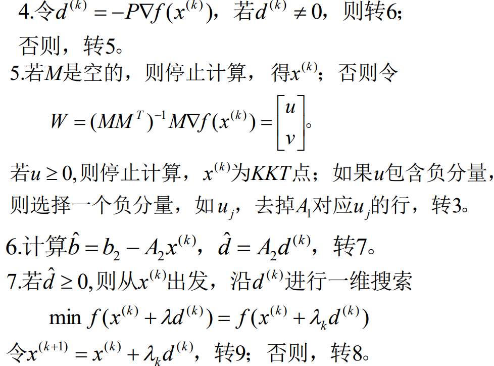

约定向量 x 大于常数等价于 x 的每个分量大于某个常数

## 基础知识

### 多面集的表示定理

定理：设 $S=\lbrace x|Ax\boldsymbol{=}b,x\boldsymbol{\geqslant}0\rbrace$ 为非空多面集，则有

(1) 极点集非空，且存在有限个极点$x^{(1)},\cdots,x^{(k)}.$

(2) 极方向集合为空集的充要条件是S有界；若S无界，则存在有限个极方向$d^{(1)},d^{(2)},\cdots,d^{(l)}.$

$x\in S$的充要条件是

$$
x=\sum_{j=1}^k\lambda_jx^{(j)}+\sum_{j=1}^l\mu_jd^{(j)}
$$

其中$\lambda_j\geq0,j=1,2,\cdots,k,\sum_{j=1}^k\lambda_j=1$

$$
\mu_j\geq0,j=1,2,\cdots,l.
$$

## 线性规划

LP 的标准形式

1. 极小化型
2. 约束方程为等式
3. 所有的决策变量为非负值
4. 约束方程的右端项系数为非负值

$$
\min z = cx, \\
s.t.\ Ax = b,\\
x \ge 0
$$

非标准型 LP 模型可以转化为标准型 LP 模型

1. 取个负号
2. 约束方程为不等式：加一个松弛变量变为等式。
3. 变量无非负约束：令 $x_j = x_j^\prime - x_j^{\prime\prime}$
4. 决策变量有上下界：平移到0处。

### LP 问题的基本性质

#### 可行解

线性规划的可行域是凸集。

#### 最优极点

考虑标准形式：

$$
\begin{cases}\min&cx\\s.t.&Ax=b\\&x\geq0&\end{cases}
$$

把多面集表示定理代入其中：

$$
\begin{cases}\min&\sum_{j=1}^k\lambda_jcx^{(j)}+\sum_{j=1}^l\mu_jcd^{(j)}=f\left(x\right)\\s.t.&\sum_{j=1}^k\lambda_j=1\\&\lambda_j\geq0,j=1,\cdots,k\\&\mu_j\geq0,j=1,\cdots,l.&\end{cases}
$$

若存在 $j$ 使得 $cd^{(j)} \lt 0$，此时可以取 $\mu_j\to-\infty$，则 $f(x)\to-\infty$。

若所有的 d 都满足 $cd^{(j)} \ge 0$，取 $\mu_j = 0, j = 1, 2, \dots, l$，得到

$$
\begin{cases}\min&\sum_{j=1}^k\lambda_jcx^{(j)}=f\left(x\right)\\s.t.&\sum_{j=1}^k\lambda_j=1\\&\lambda_j\geq0,j=1,\cdots,k\end{cases}
$$

此时只需要找到 $p = \arg\min_{j}cx^{(j)}$，取 $\lambda_p = 1$, $\lambda_j = 0 (j\ne p)$ 即可得到最大值。

定理2. 设线性规划(L)的可行域非空，则

（1）(L)存在最优解的充要条件是对任意的$j$, $cd^{(j)}≥0$, 其中$d^{(j)}$为可行域的极方向。

（2）若(L)存在最优解，则目标函数的最优值可在某个极点达到。

#### 基和基本解

设标准形式中 $\text{rank}(A_{m\times n}) = m = (P_1\ P_2\ \dots\ P_n)$，$Ax = P_1x_1+\dots+P_nx_n$，则可以从 $A$ 的列中取出 $m$ 个 $P_j$组合成一个可逆矩阵 $B$ 称为基，与取出来的 $P_j$ 对应的 $x_j$ 称为基向量。

设 $A = [B\ N]$，$Ax = Bx_B + Nx_N = b$，解得
$$
x_B = B^{-1}b - B^{-1}Nx_N
$$

取 $x_N = 0$，此时 $x = \begin{bmatrix}B^{-1}b\\0\end{bmatrix}$ 为 (LP) 的基本解。

若 $B^{-1}b \ge 0$，则 $x$ 称为基本可行解，$B$ 为可行基矩阵，$x_{B_1}, x_{B_2}, \dots, x_{B_m}$ 为一组可行基。

若 $B^{-1}b \gt 0$，则称基本可行解是非退化的，否则是退化的。

**基本可行解与极点之间的关系**

引理1：对于可行解 $\bar x$， $\bar x$ 是基本可行解的充要条件是 $\bar x$ 的非零分量对应到 $A$ 中的列向量线性无关。

定理2：设 $S$ 是 $(L)$ 的可行域，$\bar x \in S$，则 $\bar x$ 是 $S$ 极点的充要条件为 $\bar x$ 是 $(L)$ 的基本可行解。

> 思考：本质上是因为“极点”的唯一性，正好对应了基矩阵可逆，求解出来的基本可行解也是唯一的。
> 从几何意义思考标准形式：1. $Ax=b$ 本质上代表了一个 k 维的子空间，k 是矩阵的秩，如果 k = 1 就是直线，k = 2 就是平面；2. $x\ge0$ 是一组边界，它会截取子空间的一部分，以 k = 2，n = 3 为例，这意味着我们用一个平面去与三维空间的第一卦限相交的部分作为可行域，不考虑退化的情况，通常它是一个 n 条边界的图形，正好对应 n 个变量分别等于 0 的情况。3. $cx$ 不用解释了，这就是一个 n - 1 维的空间。

定理3：设 $S = \{x| Ax=b, x\ge 0\}$ 的方向 $d$ 有 $k$ 个非零分量，则 $d$ 是 $S$ 的极方向 等价于 $d$ 的非零分量对应到 A 的列向量的秩为 k - 1。

**基本可行解的存在问题**

定理1. 如果(LP)有可行解,则一定存在基本可行解.

定理2. 如果(LP)有最优解，则存在一个基本可行解是最优解。

### 单纯形法

设 $A = (B\ N)$，$x=(x_B\ x_N)^T$，则 $Bx_B + Nx_N = b$，取 $x_N = 0$ 得到 $x_B = B^{-1}b$，$f(x) = c_BB^{-1}b$。则 $x = (B^{-1}b\quad 0)^T$ 为基本可行解。

> 这里有个问题，$B^{-1}b \ge 0$ 一定成立吗？如果不成立那么这就不是可行解。

但是基本可行解未必是最优解，我们考虑 $x_N\ne0$ 的情况。一般地由 $Bx_B + Nx_N = b$ 得到 $x_B = B^{-1}b - B^{-1}Nx_N$，$f(x) = c_Bx_B + c_Nx_N = c_BB^{-1}b - (c_BB^{-1}N - c_N)x_N$。

如果 $c_BB^{-1}N - c_N \le 0$，则 $f(x) \ge c_BB^{-1}b$，当且仅当 $x_N = 0$ 的时候取等。此时 $x = (B^{-1}b\quad 0)^T$ 就是最优解。$c_BB^{-1}N - c_N = (z_i - c_j)_{m+1\le i \le n}$ 为判别数。

假如判别数里面有正数，假设其中最大的正数为 $z_r-c_r$，这就说明我们可以通过增大 $x_r$ 的方式来减小 $f(x)$ 的值。而 $x\ge 0$ 又约束了我的 $x_r$ 不能无限增加，因为 $x_B =  B^{-1}b - B^{-1}Nx_N = B^{-1}b - \sum_{j=m+1}^{n}B^{-1}P_jx_j \ge 0$，因此 $B^{-1}P_rx_r \le B^{-1}(b-\sum_{j\ne r, m+1\le j \le n}B^{-1}P_jx_j) \le B^{-1}b$。设 $y_k = B^{-1}P_k$，$\bar b = B^{-1}b$，则此时有 $y_kx_r \le \bar b, \forall 1\le k \le m$。因此 $\max x_r = \min \lbrace \frac{\bar b_k}{y_k}|y_k \gt 0 \rbrace$。

假如所有的 $y_k \le 0$，则 $x_r$ 无上界，从而 $f(x)$ 也没有最大值。

假如存在 $y_k \gt 0$，则我们假设 $x_r = \frac{\bar b_k}{y_k}$ 时取得最大值。此时 $x_k = \bar b_k - y_kx_r = 0$，也就是说原来的基变量 $x_k$ 变成了 0，原来的非基变量 $x_r$ 变成了大于 0 的数。我们就需要把新的 $x_r$ 加入基变量中，$x_k$ 踢出基变量，从而 $f(x)$ 的值变得更小了。

如果某非基变量的检验数为零，则线性规划问题存在多个最优解。

**两阶段法**

有时候第一个基本可行解不太好求，特别是表格里没有单位矩阵的时候。我们可以用两阶段法简化计算。

第一阶段：引入人工变量 $x_a$，这时候就有单位矩阵了，用单纯形法解出下列问题的最优解：

$$
\begin{cases}&\min e^Tx_a, e=(1\ 1\ \dots\ 1)^T\\&Ax+x_a=b\\&x,(x_a)_{m\times1}\geq0&\end{cases}
$$

最优解 $(\bar x\ \bar x_a)^T$。

如果 $\bar x_a \ne 0$，则原方程没有可行解。因为假如原方程有可行解 $x_0$，则$Ax_0 = b$，从而 $x_a = 0$ 成立，为最优解，矛盾。

如果 $\bar x_a = 0$，有两种情况：

（1）如果 $\bar x_a$ 都是非基变量，则 $\bar x$ 就是原来的基本可行解；

（2）如果 $\bar x_a$ 中存在基变量，那么就需要换基，把 $\bar x_a$ 换走。

此时，$\bar x_a$ 都等于 0，

**大 M 法**

和两阶段法思想类似，但是把两个函数合成一个了。

$$
\begin{cases}\min&cx+Me^Tx_a,e=\left(11\cdots1\right)_{m\times1}^T,M>0\\s.t.&Ax+x_a=b\\&x,x_a\geq0&\end{cases}
$$

用单纯形法求解上述问题最优解 $(\bar x^T\ \bar x_a^T)$：

（1）如果 $\bar x_a = 0$，则 $\bar x$ 为原问题的最优解；

（2）如果 $\bar x_a \ne 0$，则原问题无最优解。

函数无界的充要条件：$Ad=0$ 且 $cd < 0$。

（3）不存在最优解（函数无界） 且 $\bar x_a = 0$，说明原问题没有最优解。

（4）不存在最优解（函数无界） 且 $\bar x_a \ne 0$，说明原问题没有可行解。

这个方法怪就怪在 $M $ 是*任意大*的正数，并不是一个固定值。

单纯形法容易卡在循环之中，达不到最优解。

主要原因是基变量中有取值为 0 的项，即 $\bar b_k = 0$，按照单纯形法肯定会把 $x_k$ 出基，然后换进来另一个 $x_r$，但是你换进来的 $x_r$ 还是等于 0（这样取值显然为基本可行解），导致极点实际上始终不变，目标函数也一直不变。

解决退化的方法有:“摄动法”、“字典序法”、Bland规则等

### 对偶

#### 对偶问题的定义

第一类对称形式

(L)

$$
\min cx\\
Ax \ge b\\
x \ge 0
$$

第二类对称形式

(D)

$$
\max wb\\
wA \le c\\
w\ge 0
$$

对偶的对偶是原问题。

对于 (D)，可以写成

$$
\min (-b^T)w^T\\
(-A^T)w^T \ge -c^T\\
w^T\ge 0
$$

这个问题的对偶问题是

$$
\max x^T(-c^T)\\
x^T(-A^T)^T \le -b^T\\
x^T\ge 0
$$

也就是

$$
\min cx\\
Ax \ge b\\
x \ge 0
$$

对称形式的对偶问题规划：

（1）min 变成 max

（2）价值系数和右端向量互换

（3）系数矩阵转置

（4）大于等于变成小于等于

原问题的约束方程的个数等于对偶问题中变量的个数，反过来原问题的变量个数就是对偶问题约束方程的个数。

非对称形式的对偶：

$$
\min cx\\
Ax = b\\
x \ge 0
$$

它的对偶形式为

$$
\max wb\\
wA \le c\\
w 无限制
$$

总结：

| 原问题 | 对偶问题 |
| -- | -- |
| $\min$   | $\max$ |
|价值系数|右端向量|
|右端向量|价值系数|
|系数矩阵|系数矩阵转置|
| 变量 $\le 0$ | 约束 $\ge$ |
| 变量 $\ge 0$ | 约束 $\le$ |
|变量无限制|约束 $=$|
|约束 $\ge $| 变量 $\ge 0$|
|约束 $\le $| 变量 $\le 0$|
|约束 $=$|变量无限制|

#### 对偶问题的基本性质

弱对偶定理：$x^{(0)}, w^{(0)}$ 分别是 (L), (D) 的可行解，则 $cx^{(0)} \ge w^{(0)}b$。

对于对称形式的情况：

$$
cx^{(0)} \ge w^{(0)}Ax^{(0)} \ge w^{(0)}b
$$

推论1：若 LP/DLP 有无界解，则其对偶问题无可行解；若 LP/DLP 无可行解，则其对偶问题或者无可行解，或者目标函数值趋于无穷。

推论2：极大化问题的任何一个可行解所对应的目标函数值都是其对偶问题的目标函数值的下界。

推论3：极小化问题的任何一个可行解所对应的目标函数值都是其对偶问题的目标函数值的上界。

定理2：最优性准则：若 $x^{(0)}, w^{(0)}$ 分别是 (L), (D) 的可行解，并且 $cx^{(0)} = w^{(0)}b$，则 $x^{(0)}, w^{(0)}$ 是各自问题的最优解。

定理3：强对偶定理：如果 (L), (D) 均有可行解，则 (L), (D) 均有最优解，且 (L), (D) 的最优目标函数值相等。

此时对偶问题的最优解 $w^{(0)}$ 恰好等于单纯形乘子 $c_BB^{-1}$.

定理4：互补松弛定理（对称形式）

(L):

$$
\begin{array}{ll} \min & cx \\ \text{s.t.} & Ax \ge b \\ & x \ge 0 \end{array}
$$

(D):

$$
\begin{aligned}\max&&wb\\\mathbf{s.t.}&&wA\leq c\\&&w\geq0\end{aligned}
$$

已知 $x^{(0)}, w^{(0)}$ 为 (L)，(D) 问题的可行解，则 $x^{(0)}, w^{(0)}$ 为 (L), (D) 最优解的充要条件为 $\forall 1 \le i \le m, 1 \le j \le n$，

(1) $x_j^{(0)} \gt 0 \Rightarrow w^{(0)}P_j = c_j$

(2) $w^{(0)}P_j \lt c_j \Rightarrow x_j^{(0)} = 0$

(3) $w^{(0)}_j \gt 0 \Rightarrow A_ix^{(0)} = b_i$

(4) $A_ix^{(0)} \gt b_i \Rightarrow w^{(0)}_i = 0$

实际上 (1)(2) 等价于 $(c - w^{0}A)x^{(0)} = 0$，(3)(4) 等价于 $w^{(0)}(Ax^{(0)} - b) = 0$。

互补松弛定理（非对称形式）

(L):

$$
\begin{cases}\min cx\\s.t.&Ax=b\\&x\geq0&\end{cases}
$$

(D):

$$
\begin{cases}\max&wb\\s.t.&wA\leq c&&\end{cases}
$$

已知 $x^{(0)}, w^{(0)}$ 为 (L)，(D) 问题的可行解，则 $x^{(0)}, w^{(0)}$ 为 (L), (D) 最优解的充要条件为 $\forall 1 \le i \le m, 1 \le j \le n$，

(1) $x_j^{(0)} \gt 0 \Rightarrow w^{(0)}P_j = c_j$

(2) $w^{(0)}P_j \lt c_j \Rightarrow x_j^{(0)} = 0$

利用上述定理我们可以先求解对偶问题的最优解，再根据互补定理推出原问题的最优解。

定理：KKT 条件（在线性规划中的特例）

(L):

$$
\begin{array}{ll} \min & cx \\ \text{s.t.} & Ax \ge b \\ & x \ge 0 \end{array}
$$

对于线性规划 (L) 来说，$x^*$ 是它的最优解的充要条件为 存在 $w_{m\times 1}, r_{n \times 1}$ 使得

$$
\begin{align}
Ax^*\geq b,\quad x^*\geq0\\
c^T-A^Tw-r=0,\quad w\geq0,\quad r\geq0\\
w^T(Ax^*-b)=0,\quad r^Tx^*=0
\end{align}
$$

这和互补松弛定理是等价的。因此，互补松弛定理是 KKT 条件的一个特例。

对偶问题最优解在经济学上称为影子价格。

原问题：给定资源供应约束，寻找最小的供应成本。

$$
f^* = cx^* = w^*b
$$

此时

$$
\frac{\partial f^*}{\partial b_i} = w^*_i
$$

意味着当资源要求 $b_i$ 增加一个单位时，最低成本会增加 $w^*_i$。因此 $w^*_i$ 描述了“资源的稀缺性/珍贵性”，$w^*_i$ 越大，则意味着对应的资源越珍贵，想要增大该资源的供应量，付出的代价就越高。

#### 对偶单纯形法

(L):

$$
\begin{aligned}\min&\quad cx\\\mathbf{s.t.}&\quad Ax=b\\&\quad x\geq0\end{aligned}
$$

(D):

$$
\begin{aligned}\max&&wb\\\mathbf{s.t.}&&wA\leq c\end{aligned}
$$

对偶可行的基本解：如果 (L) 的一个基本解（不一定是可行解）$x^{(0)}$ 对应的单纯形乘子 $w = c_BB^{-1}$ 是对偶问题 (D) 的可行解，则称 $x^{(0)}$ 为对偶可行的基本解。

如果对偶可行的基本解在 (L) 中也可行，则可知原问题的判别数 $\le 0$，从而 $x^{(0)}$ 就是原问题的最优解。

原先用两阶段和大 M 法的问题现在可以用对偶单纯性法求解了。

若初始对偶可行的基本解不易直接得到，则解一个扩充问题，通过这个问题的求解，给出原问题的解答:

$$
x_B + \sum_{j\in R} y_j\bar x_j = \bar b\\
\sum_{j\in R}x_j + x_{n+1} = M\\
x_j \ge 0, j=1,2,\dots, n+1
$$

此时表格扩充了一行。如果判别数那一行有大于 0 的数，选取其中最大的那个判别数进基，$x_{n+1}$ 进基，这时候由于出基的 $z_k-c_k$ 是最大的判别数，通过高斯消元一减，判别数这一行全部都小于 0 了。于是我们就得到了扩充问题的对偶可行基本解。

此时有以下的可能：

1. 若扩充问题没有最优解，则原问题没有最优解。
2. 若扩充问题的最优解为 $(x^{(0)}_1, x^{(0)}_2,\dots, x^{(0)}_n, x^{(0)}_{n+1})^T$，$(x^{(0)}_1, x^{(0)}_2,\dots, x^{(0)}_n)$ 若不含 $M$，则是原问题的可行解；若含 $M$，取任何 $M$ 使得 $x^{(0)}\ge0$ 都是原问题的可行解。如果此时得到的最优值与 $M$ 无关，则上面找到的还是原问题的最优解。

## 灵敏度分析

### 价值系数 $c$ 变化

#### 非基变量变化

此时只有对应的检验数发生变化：$z_k - c_k + (c_k - c_k^\prime)$，在原来的单纯性表中将对应的替换即可。

#### 基变量变化

$c_r^\prime = c_r + \Delta c_r$，此时：

$$
z_j^\prime - c_j^\prime = z_j - c_j  + \Delta c_ry_{rj} (j\ne r)\\
z_r^\prime - c_r^\prime = 0
$$

只需要把第 $r$ 行乘上 $\Delta c_r$，再加到判别数那一行就行了。（第 $r$ 个判别数不变，还是 0）

### 右端向量 $b$ 变化

若 $B^{-1}b^\prime \ge 0$，则最优基不变，但是基变量取值，目标函数取值变化。

若 $B^{-1}b^\prime \not\ge 0$，此时原来问题的解是对偶可行解，需要把右端替换成 $B^{-1}b^\prime$，$c_BB^{-1}b$ 继续用对偶单纯形法求解。

其实就是给最后一列加上 $B^{-1}\Delta b$，$c_BB^{-1} \Delta b$。

### 改变约束矩阵 $A$

若非基列变了，影响对应的列 $y_j = B^{-1}P_j$，$z_j - c_j$，如果新的判别数仍然小于等于 0，则最优解，最优值不变；

基列变了，全部重新计算。

### 增加新的约束

$$
\begin{cases}\min&cx\\s.t.&Ax=b\\&P^{m+1}x\leq b_{m+1}\\&x\geq0&\end{cases}
$$

1. 若原最优解满足新增加的约束，则它也是新问题的最优解。
2. 若原最优解不满足新增加约束

$$
\begin{cases}\min&cx\\s.t.&x_B+B^{-1}Nx_N=B^{-1}b\\
&P_B^{m+1}x_B+P_N^{m+1}x_N+x_{n+1}=b_{m+1}\\
&x,x_{n+1}\geq0&\end{cases}
$$

对新加的行进行高斯消元，表格如下：

$$
\begin{array}{ccc|c}
x_B&x_N&x_{n+1}\\
\hline
I&B^{-1}N&0&B^{-1}b\\
0&P_N^{m+1}-P_B^{m+1}B^{-1}N&1&b_{m+1}-P_B^{m+1}B^{-1}b\\
\hline
0&c_BB^{-1}N-c_N&0&c_BB^{-1}b\end{array}
$$

判别数仍然保持小于等于0，因此可用对偶单纯形法求解。

## 整数规划

规划中的变量（部分或全部）限制为整数时，称为整数规划。若在线性规划模型中，变量限制为整数，则称为整数线性规划。

变量全限制为整数的，称纯（完全）整数规划。

变量部分限制为整数的，称混合整数规划。

要求决策变量仅取0或1,称为0-1规划问题

一般形式：

$\max cx$

$s.t.$ $\begin{cases} Ax= b\\ x_i\geq 0, x_i\text{部 分 或 全 部 为 整 数 }& \end{cases}$

$\min cx$

$s.t.$ $\begin{cases} Ax= b\\ x_i\geq 0, x_i\text{部 分 或 全 部 为 整 数 }& \end{cases}$

IP 问题可行域不为凸集。

整数规划特点

伴随规划有最优解，当自变量限制为整数后，其整数规划解出
现下述情况：①原线性规划最优解全是整数，则整数规划最优解与线性规划最优解一致。②整数规划无可行解。③有可行解（当然就存在最优解），但最优值变差。

求解方法分类：
1. 割平面法——主要求解纯整数线性规划
2. 分枝定界法——可求纯或混合整数线性规划
3. 隐枚举法——求解“0-1”整数规划：
    - 过滤隐枚举法；
    - 分枝隐枚举法
4. 匈牙利法——解决指派问题（“01”规划特殊情
形）。
5. 蒙特卡洛法——求解各种类型规划

### 分枝定界法

设原问题 $(A_0)$

$$
\begin{cases}\max z=10x_1+20x_2\\s.t.\quad0.25x_1+0.4x_2\leq3\\x_1\leq8\\x_2\leq4\\x_1,x_2\geq0,\text{整数}&\end{cases}
$$

伴随问题为 $(B_0)$

$$
\begin{aligned}\\&\begin{cases}\max&f=10x_1+20x_2\\s.t.&0.25x_1+0.4x_2\leq3\\&x_1\leq8\\&x_2\leq4\\&x_1,x_2\geq0&\end{cases}\end{aligned}
$$

利用单纯形法求解 $B_0$ 得到 $x_0^* = (5.6, 4)^T$，$f_0^* = 136$，这个解不满足 $(A_0)$ 的条件。

那么原问题的初始上界为 $\bar z \le f_0^* = 136$。

显然 $(0, 0)^T$ 满足 $(A_0)$，可取初始下界 $\underline z = 0$

接下来，增加约束条件对原问题进行分支：

$(A_1)$

$$
\begin{cases}\max z=10x_1+20x_2\\s.t.&0.25x_1+0.4x_2\leq3\\x_1&\leq8\\&x_2\leq4\\&x_1&\leq5\\&x_1,x_2\geq0,\text{整数}&\end{cases}
$$

$(A_2)$

$$
\begin{cases}\max z=10x_1+20x_2\\s.t.\quad0.25x_1+0.4x_2\leq3\\x_1&\leq8\\x_2\leq4\\x_1\geq6\\x_1,x_2\geq0,\text{整数}&\end{cases}
$$

对应的伴随规划 $(B_1), (B_2)$。

分别求解一对分支的伴随规划：
1. 无可行解：说明该枝情况已查明，不需要再继续分枝，称该分枝为“树叶”．
2. 得到整数最优解：说明该枝情况也已查明，不需要再继续分枝，称该分枝为“树叶”．
3. 得到非整数解：
    1. 若此时目标值小于当前的下界 $\underline z$，就说明这是一个“枯枝”，不用继续探索；
    2. 若此时目标值大于当前的下界 $\underline z$，则需要继续分支，查明有没有更好的目标值。

$(B_1), (B_2)$ 的最优解和值：$x^*_1 = (5, 4)^T, f_1^* = 130$，$x^*_2 = (6, 3.75)^T, f_2^* = 135$。

接下来，需要修改下界和上界：

1. 每求出一个整数解使目标值大于当前的下界，就证明最优值的下界可以继续提升，则更新 $\underline z$ 为当前最大的目标值；
2. 每求完一对分支，就可以更新上界 $\bar z$，为当前所有分支中取值最大的那个。

当所有的分支都被查明，并且此时 $\bar z = \underline z$，则得到原问题的整数最优解。

一般整数规划的求解是 NP-complete 问题，只有少数特殊任务有好的算法。

### 割平面法

适用范围： 纯整数规划问题、混合整数规划问题

$$
\begin{aligned}\min z&=cx\\s.t.&\sum_{j=1}^na_{ij}x_j=b_i(i=1,2,\cdots,m)\\
&x_j 为整数 \\
&x_j \ge 0  (i = 1, 2, \dots, m, j = 1, 2, \dots, n)
\end{aligned}
$$

$$
\min z=cx\\
Ax = b\\
x \ge 0\\
x_i为整数
$$

假设只考虑线性规划，算出单纯形表：

$$
\begin{array}{cc|ccccccc}
&&x_1&x_2&\ldots&x_m&x_{m+1}&\ldots&x_n\\
\hline
&x_1&1&0&\ldots&0&y_{1m+1}&\ldots&y_{1n}&b_1^{\prime}\\
&x_2&0&1&\ldots&0&y_{2m+1}&\ldots&y_{2n}&b_2^{\prime}\\&\ldots\\
&x_r&0&0&\ldots&0&y_{rm+1}&\ldots&y_{rn}&b_r^{\prime}\\
&\ldots\\
&x_m&0&0&\ldots&1&y_{mm+1}&\ldots&y_{mn}&b_m^{\prime}\\
&&0&&&C_BB^{-1}N-C_N&&&&C_BB^{-1}b\end{array}
$$

若 $b_i^\prime$ 都是整数，则 $(b_1^\prime, \dots, b_m^\prime)$ 就是原问题的最优解。

假设 $b_r$ 不是整数，考虑第 $r$ 个方程：

$$
x_r + \sum_{j = m+1}^n x_jy_{rj} = b_r^\prime
$$

设 

$$
b_r^\prime = \lfloor b_r^\prime\rfloor + f_r\\
y_{rj} = \lfloor y_{rj}\rfloor + f_{rj}
$$

原问题改写为

$$
\sum_{j = m+1}^n x_jf_{rj} =  f_r + (\lfloor b_r^\prime\rfloor - x_r - \sum_{j = m+1}^n x_j\lfloor y_{rj} \rfloor) 
$$

如果 $(\lfloor b_r^\prime\rfloor - x_r - \sum_{j = m+1}^n x_j\lfloor y_{rj} \rfloor) \ge -1$，则 $\sum_{j = m+1}^n x_jf_{rj} \le f_r  - 1 \lt 0$ 矛盾！

因此 $(\lfloor b_r^\prime\rfloor - x_r - \sum_{j = m+1}^n x_j\lfloor y_{rj} \rfloor)  \ge 0$，即 

$$
-\sum_{j = m+1}^n x_jf_{rj} \le -f_r
$$

添加辅助变量：

$$
y_r -\sum_{j = m+1}^n x_jf_{rj} = -f_r\\
y_r \ge 0 为整数
$$

称为 Gomory 约束（割平面方程），从而使得原可行域中的非整数区域被删除。

通过不断添加割平面方程，极点会逐个变成整数，从而找到整数最优解。

## 内点法

计算复杂性

算法性能：
- （1）在最坏情况下算法所表现出来的性能-----------最坏性能
- （2）在各种情况可能出现时，算法所表现出来的期望性能。---------平均性能

问题(problem):需要回答的一种提问，通常包含一些参数和取值未定的自由变量，可以从两个方面加以描述：
- （1）对所有参数的一般描述；
- （2）对回答（也称为解）所需要满足的特性的描述。

实例(instance)：当对一个问题中的参数赋予特定的数值时，如何寻找相应的回答（解），这种提问称为该问题的一个实例。

算法：是一组含义明确的简单指令。一个问题是算法可解的(solvable)：存在一个求解该问题的算法，只要让算法运行足够长的时间，并且保证满足算法在运行过程中所需要的存储空间，它就能求解该问题的任何一个实例。

停机问题：不可能构造出一个程序来确定任意给出的程序是否会陷入无限循环。

算法复杂性：描述算法的存储要求和运行时间要求，分为算法的空间复杂性和算法的时间复杂性。

时间复杂性：利用算法需要的初等运算次数来表示算法的时间复杂性。

输入规模(input size)：表示一个实例所需要的字符串长度。

一般用 $\lceil1 + \log_2r\rceil$ 可以表示整数 $r$ 。

$$
\begin{aligned}&L=\left\lceil1+\log_2m\right\rceil+\left\lceil1+\log_2n\right\rceil+\sum_{j=1}^n\left\{\left\lceil1+\log_2\mid c_j\mid\right\rceil\right\}\\&+\sum_{i=1}^m\sum_{j=1}^n\left\{\left\lceil1+\log_2\mid a_{ij}\mid\right\rceil\right\}+\sum_{i=1}^m\left\{\left\lceil1+\log_2\mid b_j\mid\right\rceil\right\}\\
&\le mn + m + n + 2 + \log_2\underline{|P|}_{A, b, c中所有非零数乘积}
\end{aligned}
$$

旅行商问题，二进制输入长度的总量不超过 $L = n(n-1) + \log_2|P|$，$P$ 为所有非零 $d_{ij}$ 的乘积。假设每个 $d_{ij}$ 都有上限 $K$，则

$$
L \le n(n-1)(1 + \log_2K)
$$

复杂度：基本计算总次数C(I)同实例I的计算机二进制输入长度d(I)的关系为

$$
C(I) \le ag(d(I))
$$

则称 $C(I) = O(g(d(I)))$。

假如某个算法使得 $g(x)$ 为多项式，则该算法对于实例 $I$ 是多项式时间算法。

如果 $g(x)$ 为指数函数，则称为指数时间算法。

多项式时间算法的优点：
- 随着问题输入规模的增加，算法的计算量（即算法复杂性）呈多项式增长；
- 一个多项式时间算法利用另一个多项式时间算法作为其“子程序”，构造一个新的复合型算法，则新算法仍是多项式时间算法。

线性规划问题的单纯性方法是指数时间算法：

$$
\begin{aligned}&\max&&\sum_{i=1}^n2^{n-i}x_i\\&s.t.&&x_i+2\sum_{j=1}^{i-1}2^{i-j}x_j\leq a^{i-1},i=2,\cdots,n\\&&&x_i\geq0,\quad i=1,2,\cdots,n\end{aligned}
$$

定理：$a \gt 2$ 时，用单纯形算法求解上述问题时需要 $2^n - 1$ 次迭代。

最坏情况：指数；平均情况：多项式

椭球法是第一个可以在多項式时间內解决一般线性规划问题的解法。

定理：存在求解 LP 问题的多项式时间算法的充要条件是存在求解线性不等式组的多项式时间算法。

## 凸集分离定理

定理 1：若 $S$ 是 $E^n$ 的闭凸集, $y\not\in S$，存在唯一的 $\bar x \in S$ 使得

$$
||y - \bar x || = \inf_{x \in S}||y - x|| \gt 0
$$

并且，$\forall x \in S$，总有

$$
(y - \bar x)(\bar x - x) \ge 0
$$

定理 2：若 $S$ 是 $E^n$ 的非空闭凸集，$y\not\in S$，存在非零向量 $p$ 和数 $\varepsilon \gt 0$，使得对任意 $x \in S$，有 $p^Ty \ge \varepsilon + p^Tx$。

定理 3：设 $S$ 是 $E^n$ 的非空凸集，$y \in \partial S$，则存在非零向量 $p$，使得 $\forall x \in clS$（即 $S$ 的闭包），有 $p^Ty \ge p^Tx$。

推论 4：（点和凸集的分离定理）设 $S$ 是 $E^n$ 的非空凸集，$y \not \in S$，则存在非零向量 $p$ 使得对任意 $x \in clS$，有 $p^T(x - y) \le 0$。

定理 5：（凸集分离定理）设 $S_1$，$S_2$ 是 $E^n$ 的两个非空凸集，$S_1 \cap S_2 = \varnothing$，则存在非零向量 $p$ 使得

$$
\inf \lbrace p^Tx | x \in S_1\rbrace \ge \sup \lbrace p^Tx | x \in S_2\rbrace
$$

定理 6：设 $S_1$ 是 $E^n$ 的非空有界闭凸集，$S_2$ 是 $E^n$ 的非空闭凸集，$S_1 \cap S_2 = \varnothing$，则存在非零向量 $p$，数 $\varepsilon \gt 0$ 使得

$$
\inf \lbrace p^Tx | x \in S_1\rbrace \ge \varepsilon + \sup \lbrace p^Tx | x \in S_2\rbrace
$$

Farkas 定理：$Ax \le 0, c^Tx \gt 0$ 有解的充要条件是 $A^Ty = c, y\ge0$ 无解。

> 利用凸集分离定理证明这些东西，感觉某种意义上是推对偶问题的有力工具，但是暂时没有搞明白它有什么规律，两个系统之间的关系是什么。而且证明过程虽然模板化，但是又有一些细节不一样（比如 Gordan 定理会取极限、取范数之类的操作），似乎难以给出一个统一的规律。

可以写成一组对偶的优化问题：

(L)：

$$
\min 0^Ty\\
A^Ty = c\\
y \ge 0
$$

(D):

$$
\max c^Tx\\
Ax \le 0
$$

假设两个问题同时有解，根据弱对偶定理，$c^Tx \le 0^Tx = 0$，因此 $Ax \le 0, c^Tx \gt 0$ 无解。

显然 (D) 总是有解，假如 (L) 无解，只能说明 (D) 有无界解，即 $c^Tx \to \infty$，因此存在 $x$ 使得 $c^Tx \gt 0$.

Gordan 定理：$Ax \lt 0$ 有解的充要条件是不存在非零向量 $y \ge 0$，$A^Ty = 0$。

凸函数：$f(x) \le af(x^{(1)}) + (1-a)f(x^{(2)}), a \in [0, 1]$

凸函数的和仍然是凸函数。

凸函数乘上一个非负数，仍然是凸函数。因此，凸函数的非负线性组合仍然是凸函数。

$f(x)$ 为凸集 $S$ 上的凸函数，则集合 $S_c = \lbrace x|x\in S, f(x) \le c\rbrace$ 为凸集。

$S$ 是 $E^n$ 中的非空凸集，$f$ 是定义在 $S$ 上的凸函数，则 $f$ 在 $S$ 上的局部极小点是整体极小点，并且极小点的集合是凸集。

$g(x) = \max (f_1(x), f_2(x))$ 也是凸函数。

凸函数的判别

$$
\nabla f(x) = (\frac{\partial f(x)}{\partial x_1}\quad \dots \frac{\partial f(x)}{\partial x_n})^T
$$

$$
\nabla^2 x = \begin{bmatrix}
\frac{\partial^2 f(x)}{\partial x_1^2} &\dots& \frac{\partial^2 f(x)}{\partial x_1\partial x_n}\\
\vdots & \ddots & \vdots\\
\frac{\partial^2 f(x)}{\partial x_n\partial x_1} & \dots & \frac{\partial^2 f(x)}{\partial x_n^2}
\end{bmatrix}
$$

方向导数：$Df(x^0; p) = \nabla f(x^0)^T p$。

一阶充要条件：

$S$ 是 $E^n$ 中的非空凸集，$f$ 是定义在 $S$ 上的可微函数，则 $f(x)$ 为凸函数的充要条件为 $\forall x^{(1)}, x^{(2)} \in S$，有

$$
f(x^{(2)}) \ge f(x^{(1)}) + \nabla f(x^{(1)})^T(x^{(2)} - x^{(1)})\\
$$

$f(x)$ 为严格凸函数的充要条件为 $\forall x^{(1)}, x^{(2)} \in S$，有

$$
f(x^{(2)}) \gt f(x^{(1)}) + \nabla f(x^{(1)})^T(x^{(2)} - x^{(1)})\\
$$

二阶充要条件：

$S$ 是 $E^n$ 中的非空凸集，$f$ 是定义在 $S$ 上的二阶可微函数，则 $f(x)$ 为凸函数的充要条件为 $\forall x \in S$，$\nabla^2 f(x)$ 是半正定的。

如果 $\nabla^2 f(x)$ 是正定的，可以推出 $f(x)$ 为严格凸函数。

定理：$f(x)$ 是定义在凸集 $S$ 上的可微凸函数，如果存在 $x^*\in S$ 使得 $\forall x \in S$ 都有 $\nabla f(x^*)^T(x - x^*) \ge 0$，则 $x^*$ 是凸集 $S$ 上的全局极小点。

凸规划：

$$
\begin{aligned}&\min\quad f(x)\\&s.t.\quad g_i(x)\geq0,i=1,\cdots,m\\&h_j(x)=0,j=1,\cdots,l\end{aligned}
$$

其中 $f(x)$ 是凸函数，$g_i(x)$ 是凹函数，$h_j(x)$ 是线性函数，则称该问题为凸规划。

## 最优性条件

### 无约束问题

$$
\min f(x)\\
s.t. x\in E^n
$$

必要条件：

（一阶必要条件）定理 1：若 $\bar x$ 是局部极小点，则 $\nabla f(\bar x) = 0$.

$\nabla f(x^*) = 0$ 时称 $x^*$ 为驻点，如果 $x^*$ 既不是局部极大点也不是局部极小点，则 $x^*$ 称为鞍点。

（二阶必要条件）定理 2：若 $\bar x$ 是局部极小点，则 $\nabla f(\bar x) = 0$，且 $\nabla^2 f(\bar x)$ 是半正定的。

（二阶充分条件）定理 3：若 $\nabla f(\bar x) = 0$，且 $\nabla^2 f(\bar x)$ 是正定的，则 $\bar x$ 是严格局部极小点。

对于二次正定函数 $f(x) = \frac12x^TAx + b^Tx + c$（$A$ 对称正定），有唯一极小点 $x^* = -A^{-1}b$。

定理 4：设 $f(x)$ 是 $E^n$ 上的可微凸函数，$\bar x \in E^n$，则 $\bar x$ 为整体极小点的充要条件是 $\nabla f(\bar x) = 0$。

### 约束优化最优性条件

定义：$F_0 = \lbrace d| \nabla f(\bar x)^T d \lt 0\rbrace$ 称为点 $\bar x$ 处的下降方向集。

定义：$S\subset E^n$，$\bar x \in clS$，非零向量 $d$，若存在 $\delta \gt 0$ 使得对任意 $\lambda \in (0, \delta)$，都有 $\bar x + \lambda d \in S$，称为 $d$ 为集合 $S$ 在 $x$ 的可行方向。$D$ 为上述可行方向的集合，称为可行方向锥。

定理 1：（几何最优性条件）：考虑问题

$$
\min f(x)\\
s.t. x \in S
$$

设 $S$ 为 $E^n$ 的非空集合，$\bar x \in S$，$f(x)$ 在 $x$ 处可微，若 $\bar x$ 是局部最优解，则 $F_0\cap D = \varnothing$。

**不等式约束问题的一阶最优性条件**

$$
\begin{cases}
\min& f(x)\\
s.t.& g_i(x) \ge 0, i = 1,\dots,m
\end{cases}
\tag{1}
$$

可行域 $S = \lbrace x| g_i(x) \ge 0, i = 1\dots, m\rbrace$。

若 $\bar x \in S$，使得 $g_i(\bar x) = 0$，则该不等式约束称为关于可行点 $\bar x$ 的起作用约束，或等式约束；否则，若 $\bar x$ 使得某个 $g_i(\bar x) \gt 0$，称这个不等式约束为关于 $\bar x$ 的不起作用约束，或松约束。

记 $I = \lbrace i | g_i(\bar x) = 0, \bar x \in S\rbrace$，$G_0 = \lbrace d| \nabla g_i(\bar x) ^Td \gt 0, i \in I\rbrace$ 称为局部约束方向锥（内方向锥）。

定理 2：若 $\bar x$ 是问题 $(1)$ 的局部最优解，则 $F_0\cap G_0 =\varnothing$。实际上 $G_0 \subseteq D$。

性质：若 $d$ 为约束问题在 $x$ 点的可行方向，则 $\nabla g_i(x)^Td \ge 0, \forall i \in I(x)$。

定理 3：(Fritz John 条件) $x \in S$，$f, g_i(i\in I)$ 在 $\bar x$ 处可微，$g_i(i\not \in I)$ 在 $\bar x$ 处连续，若 $\bar x$ 是问题 $(1)$ 的局部最优解，则存在不全为 0 的数 $w_0, w_i(i \in I)$ 使得

$$
w_0\nabla f(\bar x) - \sum_{i\in I}w_i\nabla g(\bar x) = 0\\
w_0, w_i \ge 0
$$

这样的 $\bar x$ 称为 Fritz John 点。

定理 3'：(Fritz John 条件)若 $\bar x$ 是问题 $(1)$ 的局部最优解，则存在不全为 0 的数 $w_0, w_1, \dots w_m$ 使得

$$
w_0\nabla f(\bar x) - \sum_{i = 1}^mw_i\nabla g(\bar x) = 0\\
w_ig_i(\bar x) = 0\\
w_0, w_i \ge 0
$$

这个和上面的是等价的，因为有互补松弛条件 $w_ig_i(\bar x) = 0$。如果 $i \in I$，则必有 $g_i(\bar x) = 0$；若 $i \not\in I$，则 $g_i(\bar x) \gt 0$，因此必有 $w_i = 0$。

定理 2' （KKT 条件）考虑问题

$$
\begin{cases}
\min& f(x)\\
s.t.& g_i(x) \ge 0, i = 1,\dots,m
\end{cases}
$$

$x \in S$，$f, g_i(i\in I)$ 在 $\bar x$ 处可微，$g_i(i\not \in I)$ 在 $\bar x$ 处连续，$\lbrace\nabla g_i(\bar x) | i \in I\rbrace$ 线性无关，若 $\bar x$ 是局部最优解，则存在非负数 $w_i, i\in I$ 使得

$$
\nabla f(\bar x) - \sum_{i \in I} w_i\nabla g(\bar x) = 0
$$

上述条件称为 KKT 条件，等价于

$$
\nabla f(\bar x) - \sum_{i=1}^m w_i\nabla g(\bar x) = 0\\
w_ig_i(\bar x) = 0, i = 1, \dots, m\\
w_i \ge 0
$$

KKT 条件说明：在一定条件下，在最优值点, 目标函数的梯度可以表示成起作用约束函数梯度的非负线性组合。但是有约束规格，起作用约束函数的梯度在最优值点向量组线性无关。

定理 3：（一阶充分条件）设问题

$$
\begin{cases}
\min f(x)\\
s.t. g_i(x) \ge 0, i = 1, 2, \dots, m
\end{cases}
$$

如果 $f$ 为凸函数，$g_i$ 为凹函数，$h_j$ 为线性函数，$S$ 为可行域，$\bar x \in S$，$\lbrace i | g_i(\bar x) = 0\rbrace$。若 $f, g_i(i \in I)$ 在 $\bar x$ 点可微，$g_i(i\not \in I)$ 在 $\bar x$ 点连续，且 $\bar x$ 满足 KKT 条件，则 $\bar x$ 为整体极小点。

**一般约束问题的一阶最优性条件**

一般约束问题：

$$
\begin{cases}
\min f(x)\\
s.t. g_i(x) \ge 0, i = 1, \dots, m\\
h_j(x) = 0, j = 1, \dots, l\\
\end{cases}\tag{NP}
$$

定义：对于 $\bar x \in S$，起作用的约束下标集记为 $I$，如果向量组

$$
\lbrace \nabla g_i(\bar x), \nabla h_j(\bar x) | i \in I, j = 1, 2, \dots, l\rbrace
$$

线性无关，则称 $\bar x$ 为给定约束 $g(x) \ge 0, h(x) = 0$ 的正则点。

定义：称点集 $\lbrace x = x(t) | t_0 \le t \le t_1\rbrace$ 为曲面 $S = \lbrace x | h(x) = 0\rbrace$ 上的一条曲线，如果对于所有 $t \in [t_0, t_1]$ 均有 $h(x(t)) = 0$。

如导数 $x'(t) = \frac{\mathrm dx(t)}{\mathrm dt}$ 存在， 则称曲线是可微的。

设曲面 $S = \lbrace x | h(x) = 0\rbrace$ 上有一个点 $\bar x$。

定义：称点集 $\lbrace x = x(t) | t_0 \le t \le t_1\rbrace$ 为曲面 $S$ 上过 $\bar x$ 的一条曲线，如果对所有的 $t \in [t_0, t_1]$ 均有 $h(x(t)) = 0$，而且存在 $t^* \in [t_0, t_1]$ 使得 $x(t^*) = \bar x$。

曲面 $S$ 上在点 $\bar x$ 处所有可微曲线构成的切向量的集合称为切平面，记为 $T(\bar x)$。

定义 $H = \lbrace d| \nabla h(x)^T d = 0\rbrace$，其中 $\nabla h(x) = (\nabla h_1(x), \nabla h_2(x), \dots, \nabla h_l(x))$。

结论：若向量 $d \in T(\bar x)$，则有 $d \in H$。换言之 $T(\bar x) \subset H$。

定理：若 $\bar x$ 是 $S$ 的正则点，则 $T(\bar x) = H$。

定理：设 $\bar x \in S$，$f(x)$ 和 $g_i(x)(x\in I)$ 在 $\bar x$ 处可微，$g_i(x)(i\not\in I)$ 在 $\bar x$处连续，$h_j(j = 1, 2, \dots, l)$ 在 $\bar x$ 处连续可微，若 $\bar x$ 是问题 $(NP)$ 的局部最优解，且 $\bar x$ 是 $S$ 的正则点，则在 $\bar x$ 处有

$$
F_0 \cap G_0 \cap H_0 = \varnothing
$$

其中

$$
F_0 = \lbrace d \ \nabla f(\bar x)^Td \lt 0\rbrace\\
G_0 = \lbrace d \ \nabla g(\bar x)^Td \gt 0\rbrace\\
H_0 = \lbrace d \ \nabla h(\bar x)^Td = 0\rbrace
$$

引理：若系统 $Ax \lt 0, Bx = 0$ 无解，则系统 $A^Ty + B^Tz = 0, y \ge 0$，且 $y\ne 0$ 或者 $z\ne 0$ 有解。

定理 1：（Fritz John 条件）设 $\bar x \in S$，$I = \lbrace i | g_i(\bar x) = 0\rbrace$，$f(x), g_i(x) (i\in I)$ 在 $\bar x$ 处可微，$g_i(x)(i \not\in I)$ 在 $\bar x$ 处连续，$h_j(j = 1, \dots, l)$ 在 $\bar x$ 处连续可微，若 $\bar x$ 是问题 $(NP)$ 的局部最优解，则存在不全为0的数 $w_0$，$w_i(i\in I)$ 和 $v_j(j = 1, 2, \dots, l)$ 使得

$$
\begin{cases}
w_0\nabla f(\bar x)  - \sum_{i \in I}w_i\nabla g_i(x) - \sum_{j = 1}^lv_j\nabla h_j(\bar x) = 0\\
w_0, w_i \ge 0, i \in I
\end{cases}
$$

上述条件又等价于

$$
\begin{cases}
w_0\nabla f(\bar x)  - \sum_{i = 1}^mw_i\nabla g_i(x) - \sum_{j = 1}^lv_j\nabla h_j(\bar x) = 0\\
w_ig_i(\bar x) = 0, i = 1, 2, \dots, m\\
w_0, w_i \ge 0, i \in I
\end{cases}
$$

定理 2（KKT 必要条件）： 设 $\bar x$ 为可行点，$I = \lbrace g_i(\bar x) = 0\rbrace$。$f, g_i(i\in I)$ 在 $\bar x$ 处连续可微，向量集

$$
\lbrace \nabla g_i(\bar x), \nabla h_j(x) | i \in I, j = 1, \dots, l\rbrace
$$

线性无关，若 $\bar x$ 是局部最优解，则存在数 $w_i, i\in I$ 和 $v_j(j = 1, \dots, l)$，使得

$$
\nabla f(\bar x) - \sum_{i \in I} w_i\nabla g_i(\bar x) - \sum_{j = 1}^l v_j\nabla h_j(\bar x) = 0\\
w_i \ge 0 (i \in I)
$$

上述结论等价于

$$
\nabla f(\bar x) - \sum_{i = 1}^m w_i\nabla g_i(\bar x) - \sum_{j = 1}^l v_j\nabla h_j(\bar x) = 0\\
w_ig_i(\bar x) = 0, i = 1, \dots, m\\
w_i \ge 0 (i \in I)
$$

定义广义的 Lagrange 函数：

$$
L(x, w, v) = f(x) - w^Tg(x) - v^Th(x)
$$

定理 2'（KKT 必要条件）： 设 $\bar x$ 为可行点，$I = \lbrace g_i(\bar x) = 0\rbrace$。$f, g_i(i\in I)$ 在 $\bar x$ 处连续可微，向量集

$$
\lbrace \nabla g_i(\bar x), \nabla h_j(x) | i \in I, j = 1, \dots, l\rbrace
$$

线性无关，若 $\bar x$ 是局部最优解，则存在乘子向量 $\bar w \ge 0, \bar v$ 使得

$$
\nabla_x L (\bar x, \bar w, \bar v) = 0\\
\bar w^T g(\bar x) = 0
$$

一般形式的一阶必要条件（KKT 必要条件）可表示为：

$$
\begin{cases}
\nabla_x L (\bar x, \bar w, \bar v) = 0\\
w_i g_i(\bar x) = 0, i = 1, \dots, m\\
g_i(x) \ge 0, i = 1, \dots, m\\
h_j(x) = 0, j = 1, \dots, l\\
w_i \ge 0, i = 1, \dots, m
\end{cases}
$$

定理 3（一阶充分条件）：设问题

$$
\begin{cases}
\min f(x)\\
s.t. g_i(x) \ge 0, i = 1, \dots, m\\
h_j(x) = 0, j = 1, \dots, l\\
\end{cases}
$$

中，$f$ 是凸函数，$g_i$ 是凹函数，$h_j$ 是线性函数，$S$ 为可行域，$\bar x \in S$，$I\lbrace i | g_i(\bar x)\rbrace$。$f$ 和 $g_i(i\in I)$ 在点 $\bar x$ 可微，$h_j$ 在点 $\bar x$ 连续可微，$g_i(i\not\in I)$ 在 $\bar x$ 处连续，且在 $\bar x$ 处 KKT 条件成立，则 $\bar x$ 为整体极小点。

推论：问题

$$
\begin{cases}
\min &cx\\
s.t.& Ax \ge b\\
&x \ge 0
\end{cases}
$$

则 $x^*$ 是最优解等价于存在 $w \in \R^m, v\in \R^n$ 使得

$$
\begin{cases}
Ax^* \ge b\\
x^* \ge 0\\
c - w^TA - v^T = 0\\
w^T(Ax^* - b) = 0\\
v^Tx^* = 0\\
w, v \ge 0
\end{cases}
$$

注：实际上这个问题的 lagrange 函数为 $L(x, w, v) = cx - w^T(Ax - b) - v^Tx$，因此 $\nabla_x L(x, w, v) = c^T - Aw - v$。

**二阶条件**

Lagrange 乘子问题

$$
L(x, w, v) = f(x) - w^Tg(x) - v^Th(x)
$$

其中 $w \in E^m, v \in \R^l$ 称为 Lagrange 乘子

是否存在 $x \in E^n, w \in \R^m, v \in \R^l$ 满足方程组：

$$
\begin{cases}
\nabla_x L(x, w, v) = \nabla f(x) - \nabla g(x) w - \nabla h(x)v = 0\\
\nabla_w L(x, w, v) = - g(x) \le 0\\
\nabla_v L(x, w, v) = h(x) = 0\\
w \ge 0\\
w_ig_i(x) = 0, i = 1, 2, \dots, m
\end{cases}\tag{LM}
$$

定理(KKT 必要条件)：考虑问题

$$
\begin{cases}
\min & f(x) \\
s.t. & g_i(x) \ge 0, i = 1, \dots, m\\
& h_j(x) = 0, j = 1, \dots, l
\end{cases}
$$

设 $\bar x$ 为可行点，$I = \lbrace i | g_i(\bar x) = 0\rbrace$，$f, g_i(i\in I)$ 在 $\bar x$ 处连续可微，向量集

$$
\lbrace \nabla g_i(\bar x), \nabla h_j(x) | i \in I, j = 1, \dots, l\rbrace
$$

线性无关，若 $\bar x$ 是局部最优解，则存在 $\bar w, \bar v$ 使得 $(\bar x, \bar w, \bar v)$ 为问题 $(LM)$ 的解。

定义：设 $S$ 是 $\R^n$ 中的一个非空集合，点 $\bar x \in clS$，集合

$$
T = \lbrace d | x^{(k)} \in S, x^{(k)}\to \bar x, \lambda_k \gt 0, d = \lim_{k\to\infty}\lambda_k(x^{(k)} - \bar x)\rbrace
$$

称为 $S$ 在 $\bar x$ 处的切锥，或者称为序列化可行方向锥，记为 $SFD(\bar x， S)$。

命题：假设确定集合 $S$ 的所有约束函数在 $x \in S$ 处连续可微，则有

$$
D(x, S) \subseteq SFD(x, S)
$$

其中 $D(x, S)$ 是 $x$ 的可行方向锥，$SFD(x, S)$ 为 $x$ 点的切锥。

问题：

$$
\begin{cases}
\min & f(x)\\
s.t. & g_i(x) \ge 0\\
& h_j(x) = 0
\end{cases}\tag{NP}
$$

设 $\bar x$ 是问题 $(NP)$ 的一个 KKT 点，$I = \lbrace i | g_i(\bar x) = 0\rbrace$，即存在数 $\bar w_i, i \in I$ 和 $\bar v_j$ 使得

$$
\nabla f(\bar x) - \sum_{i \in I} \bar w_i \nabla g_i(\bar x) - \sum_{j = 1}^l \bar v_j\nabla h_j(\bar x) = 0\\
\bar w_i \ge 0, i \in I
$$

定义

$$
\bar S = \left\lbrace x
    \begin{array}{|cc}
      x \in \R^n&\\
      g_i(x) = 0, & i \in I 且 \bar w_i \gt 0\\
      g_i(x) \ge 0, & i \in I 且 \bar w_i = 0\\
      h_j(x) = 0, & j = 1, \dots, l
    \end{array}
\right\rbrace
$$

设 $\bar S$ 在点 $\bar x$ 处的切锥为 $\bar T$。

定义

$$
\bar G = \left\lbrace d
    \begin{array}{|cc}
      d \in \R^n&\\
      \nabla g_i(\bar x)^Td = 0, & i \in I 且 \bar w_i \gt 0\\
      \nabla g_i(\bar x)^Td \ge 0, & i \in I 且 \bar w_i = 0\\
      \nabla h_j(\bar x)^Td = 0, & j = 1, \dots, l
    \end{array}
\right\rbrace
$$

定理（二阶必要条件）：设 $\bar x$ 是 $(NP)$ 的局部最优解，$f, g_i$ 和 $h_j$ 二次连续可微，且存在 $\bar w, \bar v$ 使得 $(\bar x, \bar w, \bar v)$ 为 $(LM)$ 的解，又假设在 $\bar x$ 处，约束规格 $\bar G = \bar T$ 成立，则对于任意的 $d \in \bar G$ 都有

$$
d^T\nabla_x^2 L(\bar x, \bar w, \bar v)d \ge 0
$$

即 $\nabla_x^2 L(\bar x, \bar w, \bar v)$ 在子空间上是半正定的。

定理（二阶必要条件）

设 $\bar x$ 是 $(NP)$ 的局部最优解，$f, g_i$ 和 $h_j$ 二次连续可微，又假设在 $\bar x$ 处，$\lbrace \nabla g_i(\bar x), i \in I, \nabla h_j(\bar x), j = 1, \dots, l\rbrace$ 线性无关，则存在 $\bar w, \bar v$ 使得 $(\bar x, \bar w, \bar v)$ 为 $(LM)$ 的解，且矩阵 $\nabla_x^2 L(\bar x, \bar w,\bar v)$ 在子空间 $\bar G$ 上是半正定的，其中

$$
\bar G = \left\lbrace d
    \begin{array}{|cc}
      \nabla g_i(\bar x)^Td = 0, & i \in I 且 \bar w_i \gt 0\\
      \nabla g_i(\bar x)^Td \ge 0, & i \in I 且 \bar w_i = 0\\
      \nabla h_j(\bar x)^Td = 0, & j = 1, \dots, l
    \end{array}
\right\rbrace
$$

> 这两个二阶必要条件，第一个好证但难用，第二个难证但好用。

定理（二阶充分条件）：设 $f, g_1(i = 1, \dots, m)$ 和 $h_j(j = 1, \dots, l)$ 是二次连续可微函数，$\bar x$ 为可行解，若存在 $\bar w, \bar v$ 使得 $\bar x, \bar w, \bar v$ 为 $(LM)$ 的解，且矩阵 $\nabla_x^2 L(\bar x, \bar w, \bar v)$ 在子空间 $\bar G$ 上是正定的，则 $\bar x$ 是严格局部极小点。

### 对偶及鞍点问题

**Lagrange 对偶问题**

$$
\min f(x)\\
\begin{aligned}
s.t.&\quad g_i(x) \ge 0, i = 1, \dots, m\\
& h_j(x) = 0, j = 1, \dots, l\\
& x \in D
\end{aligned}\tag{1}
$$

定义 $(1)$ 的对偶问题：

$$
\max \theta(w, v)\\
s.t. w\ge 0
$$

其中，$\theta(w, v) = \inf \lbrace f(x) - \sum_{i = 1}^n w_ig_i(x) - \sum_{j = 1}^l v_jh_j(x)|x \in D\rbrace$。若上式不存在有限的下界，令 $\theta(w, v) = -\infty$。其中，$\theta(w, v)$ 称为 Lagrange 对偶函数。

对任意的 $x \in D$，$\theta(w, v)$ 必然是一个凹函数，因此，对偶问题一定是一个凸规划问题。

原规划问题等价于 $\min_{x \in D}\max_{w \ge 0, v} L(x, w, v)$，对偶问题等价于 $\max_{w\ge0, v}\min_{x \in D} L(x, w, v)$。

选择不同的集约束，会得到不同的对偶问题。

**对偶定理**

弱对偶定理：设 $\bar x, (\bar w, \bar v)$ 分别是原问题和对偶问题的可行解，则

$$
\theta(\bar w, \bar v) \le f(\bar x) - \bar w^T g(\bar x) - \bar v^T h(\bar x) \le f(\bar x)
$$

推论 1：对原问题和对偶问题，必有 $\inf\lbrace f(x) | g(x) \ge 0, h(x) = 0, x \in D\rbrace \ge \sup\lbrace \theta(w, v) | w \ge 0\rbrace$

推论 2：若 $f(\bar x) \le \theta(\bar w, \bar v)$
, 其中 $\bar x$ 为原问题的可行解，$\bar w \ge 0$，则 $\bar x$ 和 $(\bar w, \bar v)$ 分别是原问题和对偶问题的最优解。

推论 3：若 $\inf\lbrace f(x) | g(x) \ge 0, h(x) = 0, x \in D\rbrace = -\infty$，则 $\forall w \ge 0$，有 $\theta(w, v) = -\infty$。

推论 4：若 $\sup \lbrace \theta(w, v)| w \ge 0 \rbrace = +\infty$ ，则原问题没有可行解。

> 可以看出，对偶问题一定有可行解。

对偶间隙：$\delta = f_{\min} - \theta_{\max}$

完全对偶：对偶间隙为 0.

强对偶：对偶间隙为 0，原问题和对偶问题都存在最优解。

引理：设 $D$ 为非空凸集，$f: D \to \R$ 为凸函数，$g_i: D \to \R$ 为凹函数，$h(x)$ 为线性函数，对于下面两个不等式系统：
1. 存在 $x \in D$，使得 $f(x) \lt 0, g(x) \ge 0, h(x) = 0$；
2. 存在 $(\lambda_0, \lambda^T, \mu^T) \ne 0$，使得 $(\lambda_0, \lambda^T) \ge 0$，并且 $\lambda_0 f(x) - \lambda^T g(x) - \mu^T h(x) \ge 0\quad(\forall x \in D)$

若系统 (1) 无解，则系统 (2) 有解；若系统 (2) 有满足 $\lambda_0 \gt 0$ 的解，则系统 (1) 无解。

强对偶定理：设 $D$ 为非空开凸集，$f$ 和 $g_i(i = 1, \dots, m)$ 分别是 $E^n$ 上的凸函数和凹函数，$h_j(j = 1, \dots, l)$ 是 $E^n$ 上的线性函数，即 $h(x) = Ax - b$，又设存在 $\hat x \in D$ 使得

$$
g(\hat x) \gt 0, h(\hat x) = 0, 0 \in \text{int} H(D)
$$

（$\text{int} M$）表示 $M$ 的内部。这个条件称为 Slater 约束规格。

其中，$H(D) = \lbrace h(x) | x \in D\rbrace$，则

$$
f_{\min} = \theta_{\max}
$$

并且，若 $\inf$ 为有限值，则存在某个 $(\bar w, \bar v)$ 使得

$$
\sup\lbrace \theta(w, v) | w \ge 0\rbrace
$$

在 $(\bar w, \bar v)$ 处达到，$ \bar w \ge 0$；若 $\inf$ 在 $\bar x$ 处达到，则 $\bar w^T g(\bar x) = 0$。

**鞍点最优性条件**

定义：设 $L(x, w, v)$ 为 Lagrange 函数，$\bar x \in E^n$，$\bar w \in E^m$, $\bar w \ge 0$，$\bar v \in E^l$，如果对任意 $ x \in E^n, w \in E^m, w \ge 0$ 及 $v \in E^l$ 都有

$$
L(\bar x, w, v) \le L(\bar x, \bar w, \bar v) \le L(x, \bar w, \bar v)
$$

则称 $(\bar x, \bar w, \bar v)$ 为 $L(x, w, v)$ 的鞍点。

Lagrange 函数的鞍点必定是 Lagrange 函数关于 $x$ 的极小点，关于 $(w, v) (w \ge 0)$ 的极大点。

鞍点定理：
1. 设 $(\bar x, \bar w, \bar v)$ 是原问题的 Langrange 函数 $L(x, w, v)$ 的鞍点，则 $\bar x$ 和 $(\bar w, \bar v)$ 分别是原问题和对偶问题的最优解。
2. 假设 $f$ 是凸函数，$g_i(x) (i = 1, \dots, m)$ 是凹函数，$h_j(x) (j = 1, \dots, l)$ 是线性函数，即 $h(x) = Ax - b$，且 $A$ 是行满秩矩阵，又设存在 $\hat x$ 使得 $g(\hat x) \gt 0, h(\hat x) = 0$，若 $\bar x$ 是原问题的最优解，则存在 $(\bar w, \bar v) (\bar w \ge 0)$，使得 $(\bar x, \bar w, \bar v)$ 是 Lagrange 函数的鞍点。

> 鞍点可能不存在，即便存在，也很难求。

**鞍点与 KKT 条件的关系**

定理：$\min \lbrace f(x) | g(x) \ge 0, h(x) = 0\rbrace$ 中，可行域为 $S$，$\bar x \in S$ 满足 KKT 条件，即存在 $\bar w \ge 0, \bar v$ 使得

$$
\nabla f(\bar x) - \nabla g(\bar x)\bar w - \nabla h(\bar x)\bar v = 0
$$

且 $f$ 为凸函数，$g_i (i \in I)$ 为凹函数，$h_j$ 为线性函数，则 $(\bar x, \bar w, \bar v)$ 为 Lagrange 函数 $L(x, w, v)$ 的鞍点；反之，设 $f, g_i, h_j$ 可微，若 $(\bar x, \bar w, \bar v) (\bar w \ge 0)$ 是 Lagrange 函数的鞍点，则 $(\bar x, \bar w, \bar v)$ 满足 KKT 条件。

**Langrange 乘子的意义**

$$
\tag{NP}\begin{cases}
\min & f(x)\\
s.t. & g_i(x) \ge 0, i = 1, \dots, m\\
& h_j(x) = 0, j = 1, \dots, l
\end{cases}
$$

设 $(NP)$ 的局部最优解为 $x^*$，相应的 Lagrange 乘子为 $w^*, v^*$，$w^* \ge 0$。

进行扰动：

$$
\tag{NP}\begin{cases}
\min & f(x)\\
s.t. & g_i(x) \ge \varepsilon_i, i = 1, \dots, m\\
& h_j(x) = \lambda_j, j = 1, \dots, l
\end{cases}
$$

扰动问题的局部最优解为 $x^*(\varepsilon, \lambda)$，相应的 Lagrange 乘子为 $w^*(\varepsilon), v^*(\lambda)$，则有

$$
\nabla_\lambda f(x^*(\lambda))|_{\lambda = 0} = w^*\\
\nabla_\varepsilon f(x^*(\varepsilon))|_{\varepsilon = 0} = v^*
$$

## 算法

下降迭代算法：重复过程得到序列的极限。在每次迭代中，后继点处的函数值要有所减少。

定理：设目标函数 $f(x)$ 具有一阶偏导数，$x^{(k + 1)}$ 由下列规则产生：

$$
\begin{cases}
f(x^{(k)} + \lambda_kd^k) = \min_{\lambda} f(x^{(k)} + \lambda d^k)\\
x^{(k + 1)} = x^{(k)} + \lambda_kd^k
\end{cases}
$$

则有 $\nabla f(x^{(k+1)})^Td^k = 0$。

定义：给定集合 $X\subset E^n$，记其幂集（即所有子集构成的集合）为 $2^X$，称集值映射 $A: X \to 2^X$ 为一个算法映射。

解集合：把满足某些条件的点集定义为解集合。当迭代点属于该集合时，停止迭代。

常用的解集合：

$$
\begin{aligned}&\Omega=\left\{\overline{x}\mid\left\|\nabla f(\overline{x})\right\|=0\right\}\\&\Omega=\left\{\overline{x}\mid\overline{x}\text{为}KKT\text{点}\right\}\\&\Omega=\left\{\overline{x}\mid\overline{x}\in S,f(\overline{x})\leq b\right\}\end{aligned}
$$

其中，$b$ 是某个可接受的目标函数值。

下降函数：定义：

$$
\begin{aligned}&\text{定义:设}\Omega\subset X\text{为解集合,}A\text{为}X\text{上的一个算法,}\alpha(x)\text{是定义}\\&\text{在}X\text{上的连续实函数,若满足}\\&1.\text{ 当}x\notin\Omega\text{且}y\in A(x)\text{时,}\alpha(y)<\alpha(x)\\&2.\text{当}x\in\Omega\text{且}y\in A(x)\text{时,}\alpha(y)\leq\alpha(x)\end{aligned}
$$

则称 $\alpha$ 是关于解集合 $\Omega$ 和算法 $A$ 的下降函数。

对于非线性规划问题

$$
\begin{cases}\min f(x)\\s.t.&x\in S&\end{cases}
$$

通常取 $\|\nabla f(x)\|$ 或者 $f(x)$ 为下降函数。

闭映射：给定两个非空闭集 $X \subset E^m$ 和 $Y \subset E^n$，以及一个集值映射 $A: X \to 2^Y$，假设点列 $\lbrace x^{(k)}\rbrace$ 和 $\lbrace y^{(k)}\rbrace$ 满足 $x^{(k)} \in X, y^{(k)} \in A(x^{(k)})$。若 $x^{(k)} \to x, y^{(k)} \to y$ 蕴含着 $y \in A(x)$，则称 $A$ 在 $x \in X$ 处是闭的。若 $A$ 在集合 $S\subseteq X$ 上每一点都是闭的，则称 $A$ 在集合 $S$ 上是闭映射。

合成映射：设 $X, Y, $ 分别是空间 $E^n, E^p, E^q$ 中的非空闭集，$A: X\to 2^Y, B: Y \to 2^Z$。若集值映射 $C: X\to 2^Z$ 定义如下：

$$
\forall x\in X,\quad C(x)=\bigcup_{y\in A(x)}B(y)
$$

则称 $C$ 是 $A$ 和 $B$ 的合成映射，记为 $C = BA$。

定理：给定集值映射 $A: X\to 2^Y, B: Y \to 2^Z$，假设 $A$ 在点 $x \in X$ 处是闭的，$B$ 在 $A(x)$ 上是闭的，对于 $x^{(k)} \to x$，若 $y^{(k)} \in A(x^{(k)})$，且 $\lbrace y^{(k)} \rbrace$ 存在收敛子列，则合成映射 $C = BA$ 在点 $x$ 处是闭的。

推论 1：给定集值映射 $A: X\to 2^Y, B: Y \to 2^Z$，假设 $A$ 在点 $x \in X$ 处是闭的，$B$ 在 $A(x)$ 上是闭的，若 $Y$ 是紧集，则合成映射 $C = BA$ 在点 $x$ 处是闭的。

推论 2：给定集值映射 $A: X\to Y, B: Y \to 2^Z$，假设 $A$ 在点 $x \in X$ 处是连续的，$B$ 在 $A(x)$ 上是闭的，则合成映射 $C = BA$ 在点 $x$ 处是闭的。

算法收敛问题：设 $\Omega$ 为解集合，$A: X\to 2^X$ 为算法映射。给定一个集合 $Y \subset X$，若对于任意的初始点 $x^{(1)} \in Y$，算法映射 $A$ 所产生的序列 $\lbrace x^{(k)} \rbrace$ 中的任一收敛子序列的极限都属于 $\Omega$，则称算法映射 $A$ 在 $Y$ 上收敛。

若集合 $Y$ 是任意选取的（该集合不必限定在解集合 $\Omega$ 的很小邻域内），则相应的收敛性称为全局收敛性。若 $Y$ 只能取接近 $\Omega$ 的点集，则相应的收敛性称为局部收敛性。

定理：设 $A$ 为 $X$ 上的一个算法，$\Omega$ 为解集合，给定初始点 $x^{(1)} \in X$，进行如下迭代：

若 $x^{(k)} \in \Omega$，则停止迭代；否则取 $x^{(k + 1)} \in A(x^{(k)})$，用 $k + 1$ 替代 $k$，重复上述过程。

如果下面的条件成立：
1. 序列 $\lbrace x^{(k)} \rbrace$ 含于 $X$ 的某个紧子集中；
2. 存在一个连续函数 $\alpha$，它是关于 $\Omega$ 和 $A$ 的下降函数；
3. 映射 $A$ 在 $\Omega$ 的补集上是闭的。

则序列 $\lbrace x^{(k)}\rbrace$ 的任一收敛子序列的极限都属于 $\Omega$。

实用收敛准则

1. $\|x^{(k+1)} - x^{(k)}\| \lt \varepsilon$
2. $f(x^{(k)}) - f(x^{(k + 1)}) \lt \varepsilon$，或者 $\frac{x^{(k + 1) - x^{(k)}}}{\|x^{(k)}\|} \lt \varepsilon$
3. $\|\nabla f(x^{(k)})\| \lt \varepsilon$（对于无约束最优化）

收敛速率

设序列 $\lbrace \gamma^{(k)}\rbrace$ 收敛于 $\gamma^*$，定义满足

$$
\overline{\lim\limits_{k\to+\infty}}\frac{\left\|\gamma^{(k+1)}-\gamma^*\right\|}{\left\|\gamma^{(k)}-\gamma^*\right\|^p}=\beta<\infty 
$$

的非负数 $p$ 的上确界为序列 $\lbrace \gamma^{(k)}\rbrace$ 的收敛级。

若序列的收敛级为 $p$，则称序列是 $p$ 级收敛的。

若 $p = 1$ 且 $\beta \lt 1$，则称序列是以收敛比 $\beta$ 线性收敛的。

若 $p \gt 1$ 或者 $p = 1$ 且 $\beta = 0$，则称序列是超线性收敛的。

收敛级 $p$ 越大，序列收敛得越快；当收敛级 $p$ 相同时，收敛比 $\beta$ 越小，序列收敛得越快。

算法的渐进收敛速度

设 $\lbrace x^k \rbrace$ 为算法产生的迭代点列且收敛于 $x^*$。

算法 Q-线性收敛：对于充分大的 $k$ 有

$$
\frac{\|x^{k+1}-x^*\|}{\|x^k-x^*\|}\leq a,\quad a\in(0,1)
$$

Q-超线性收敛：

$$
\lim_{k\to\infty}\frac{\|x^{k+1}-x^{*}\|}{\|x^{k}-x^{*}\|}=0
$$

Q-次线性收敛：对于充分大的 $k$ 有

$$
\lim_{k\to\infty}\frac{\|x^{k+1}-x^{*}\|}{\|x^{k}-x^{*}\|}=1,
$$

Q-二次收敛：对于充分大的 $k$ 有

$$
\frac{\|x^{k+1}-x^*\|}{\|x^k-x^*\|^2}\leq a,\quad a>0
$$

算法的二次终止性

若某个算法对于任意的正定二次函数，从任意的初始点出发，都能经有限步迭代达到其极小点，则称该算法具有二次终止性。

用二次终止性作为判断算法优劣的原因：
- 正定二次函数具有某些较好的性质，因此一个好的算法应能够在有限步内达到其极小点。
- 对于一个一般的目标函数，若在其极小点处的Hesse矩阵正定，由于

$$
\begin{aligned}f(x)&=f\left(x^*\right)+\nabla f\left(x^*\right)^T\left(x-x^*\right)\\&+\frac12\left(x-x^*\right)^T\nabla^2f\left(x^*\right)\left(x-x^*\right)+o\left(\left\|x-x^*\right\|\right)\end{aligned}
$$
- 因此可以猜想，对正定二次函数好的算法，对于一般目标函数也应具有较好的性质。

## 一维搜索

$$
(LS)\quad\min_\lambda f(x^{(k)}+\lambda d^{(k)})
$$

如果求得的 $\lambda_k$ 使得

$$
f\left(x^{(k)}+\lambda_kd^{(k)}\right)=\min_\lambda f\left(x^{(k)}+\lambda d^{(k)}\right)
$$

则称为精确一维搜索 (Exact Line Search)。$\lambda_k$ 称为最优步长。

如果存在 $\lambda_k$ 使得

$$
f\left(x^{(k)}+\lambda_kd^{(k)}\right)<f\left(x^{(k)}\right)
$$

称为非精确一维搜索 (Inexact Line Search)。

精确一维搜索通常有两种实现方式：
1. 试探法：按某种方式找试探点，通过一系列试探点来确定极小点。
2. 函数逼近法（插值法）：用某种较简单的曲线逼近原来的函数曲线，通过求逼近函数的极小点来估计目标函数的极小点。

基本性质：$f(x_k+\alpha_kd_k)\leqslant f(x_k+\alpha d_k),\quad\forall\:\alpha>0$；$f_{\alpha}^{\prime}(\boldsymbol{x}_{k}+\alpha_{k}\boldsymbol{d}_{k})=\boldsymbol{d}_{k}^{\mathrm{T}}\nabla f(\boldsymbol{x}_{k}+\alpha_{k}\boldsymbol{d}_{k})=0$。

算法映射 $M: E^n \times E^n \to 2^{E^n}$ 定义为：

$$
M(x, d) = \lbrace y | y = x + \bar \lambda d, f(x + \bar \lambda d) = \min_{\lambda \ge 0}f(x + \lambda d)\rbrace
$$

定理：设 $f(x)$ 是定义在 $E^n$ 上的连续函数，$d\ne 0$，则算法映射 $M$ 在 $(x, d)$ 处是闭的。

试探法：

定义：称 $f(x)$ 在闭区间 $[a, b]$ 上是单峰的，是指 $f(x)$ 在 $[a, b]$ 内有唯一的一点 $x^*$，使得对任意的 $x_1, x_2 \in [a, b], x_1 \lt x_2$，有：

当 $x_2 \le x^*$ 时，$f(x_1) \gt f(x_2)$；
当 $x^* \le x_1$ 时，$f(x_2) \gt f(x_1)$。

定理：设 $f(x)$ 是 $[a, b]$ 上的单峰函数，$x_1, x_2 \in [a, b]$ 且 $x_1 \lt x_2$。则

若 $f(x_1) \gt f(x_2)$，则对任意的 $x \in [a, x_1]$，有 $f(x) \gt f(x_2)$。

若 $f(x_1) \le f(x_2)$，则对任意的 $x \in [x_2, b]$，有 $f(x) \ge f(x_1)$。

0.618法的基本思想：通过取试探点使包含极小点的区间不断缩短，当区间长度小到一定程度时，区间上各点的函数值均接近极小值，因此任意一点都可以作为极小点的近似。

根据上面的定理我们可以取区间内的左右两点 $\lambda_k, \mu_k$ 并比较他们的函数值大小，把一定不存在极值点的区间去掉，得到新的包含区间。

我们希望：

$$
b_k - \mu_k = \lambda_k - a_k\\
b_{k + 1} - a_{k + 1} = \alpha (b_k - a_k)
$$

分两种情况：

$$
f(\lambda_k) \gt f(\mu_k) \Rightarrow [a_{k+1}, b_{k+1}] = [\lambda_k, b_k]\\
f(\lambda_k) \le f(\mu_k) \Rightarrow [a_{k+1}, b_{k+1}] = [a_k, \mu_k]\\
$$

解得

$$
\lambda_k = a_k + (1 - \alpha)(b_k - a_k)\\
\mu_k = a_k + \alpha(b_k - a_k)
$$

假设新区间 $[a_{k+1}, b_{k+1}] = [a_k, \mu_k]$，我们希望 $\mu_{k + 1} = \lambda_k$，即 $\alpha^2 = 1 - \alpha$，此时就不需要计算 $f(\mu_{k+1})$，直接使用之前计算过的 $f(\lambda_k)$ 的值即可。此时解得 $\alpha \approx 0.618$。

牛顿法：

定义算法映射

$$
A(x) = x - \frac{f^\prime(x)}{f^{\prime\prime}(x)}
$$

定理：假设 $f(x)$ 存在连续三阶导数，$\bar x$ 满足 $f^\prime(\bar x) = 0$，$f^{\prime\prime}(\bar x) \ne 0$，初点 $x^{(1)}$ 充分接近 $\bar x$，则牛顿法产生的序列 $\lbrace x^{(k)}\rbrace$ 至少以二级收敛速度收敛于 $\bar x$。

缺点：初点选择十分重要。如果初始点靠近极小点，则可能很快收敛；如果初始点远离极小点，迭代产生的点列可能不收敛于极小点。

抛物线法

在极小点附近用二次三项式 $\varphi(x)$ 逼近目标函数，令 $\varphi(x)$ 与 $f(x)$ 在三点 $x^{(1)} \lt x^{(0)} \lt x^{(2)}$ 处有相同的函数值，并假设 $f(x^{(1)}) \gt f(x^{(0)}), f(x^{(0)}) \lt f(x^{(2)})$。

$$
\begin{aligned}&\varphi(x)=a+bx+cx^2\\&\varphi(x^{(0)})=a+bx^{(0)}+cx^{(0)2}=f(x^{(0)})\\&\varphi(x^{(1)})=a+bx^{(1)}+cx^{(1)2}=f(x^{(1)})\\&\varphi(x^{(2)})=a+bx^{(2)}+cx^{(2)2}=f(x^{(2)})\end{aligned}\\
B_1=(x^{(0)^2}-x^{(2)^2})f(x^{(1)})\quad B_2=(x^{(2)^2}-x^{(1)^2})f(x^{(0)})\\B_3=(x^{(1)^2}-x^{(0)^2})f(x^{(2)})\quad C_1=(x^{(0)}-x^{(2)})f(x^{(1)})\\C_2=(x^{(2)}-x^{(1)})f(x^{(0)})\quad C_3=(x^{(1)}-x^{(0)})f(x^{(2)})\\
x^{(3)}=\overline{x}^{(k)}=\frac{B_1+B_2+B_3}{2(C_1+C_2+C_3)}\\
$$

三次插值法

选取两个初始点 $x_1$ 和 $x_2$，$x_1 \lt x_2$，$f^\prime(x_1) \lt 0, f^\prime(x_2) \gt 0$。

$$
\varphi(x)=a(x-x_1)^3+b(x-x_1)^2+c(x-x_1)+d\\
\varphi(x_1)=f(x_1),\quad\varphi^{\prime}(x_1)=f^{\prime}(x_1)\\\varphi(x_2)=f(x_2),\quad\varphi^{\prime}(x_2)=f^{\prime}(x_2)
$$

得到

$$
\begin{cases}d=f(x_1)\\c=f'(x_1)<0\\a(x_2-x_1)^3+b(x_2-x_1)^2+c(x_2-x_1)+d=f(x_2)\\3a(x_2-x_1)^2+2b(x_2-x_1)+c=f'(x_2)\end{cases}
$$

求出

$$
\overline{x}-x_1=-\frac{c}{2b} (a = 0)\\
\overline{x}-x_1=\frac{-b+\sqrt{b^2-3ac}}{3a}=\frac{-c}{b+\sqrt{b^2-3ac}} (a \ne 0)
$$

精确线搜索：

* 目标函数沿搜索方向下降量达到最大
* 理想化策略，计算量大，很难取到
* 便于算法理论分析（如二次终止性、收敛速率等）
* 该步长搜索对全局最优解的帮助不大

非精确线搜索

Armijo步长规则、 Goldstein步长规则、 Wolfe步长规则

Armijo步长规则：主要思想：先取一个较大的步长看目标函数是否有满意的下降量。否则依次按比例压缩，直至满足要求。又称进退试探法。

$$
\sigma \in (0, 1)\\
f(x_k+\alpha d_k)\leq f(x_k)+\sigma\alpha\nabla f(x_k)^Td_k
$$

Goldstein步长规则

由于Armijo规则引入的步长的取值范围包含了0的附近，为了保证迭代步长不会太小，Goldstein做了改进

$$
\sigma \in (0, \frac12)\\
f(\boldsymbol{x}_{k}+\alpha\boldsymbol{d}_{k})\leqslant f(\boldsymbol{x}_{k})+\sigma\alpha\boldsymbol{g}_{k}^{\mathrm{T}}d_{k},\\
f(\boldsymbol{x}_{k}+\alpha\boldsymbol{d}_{k})\geqslant f(\boldsymbol{x}_{k})+(1-\sigma)\alpha\boldsymbol{g}_{k}^{\mathrm{T}}\boldsymbol{d}_{k}
$$

3、Wolfe步长

$$
0 \lt \sigma_1 \lt \sigma_2 \lt 1\\
f(\boldsymbol{x}_k+\alpha\boldsymbol{d}_k)\leqslant f(\boldsymbol{x}_k)+\sigma_1\alpha\boldsymbol{g}_k^\mathrm{T}\boldsymbol{d}_k\\
\nabla f(\boldsymbol{x}_k+\alpha\boldsymbol{d}_k)^\mathrm{T}\boldsymbol{d}_k\geqslant\sigma_2\boldsymbol{g}_k^\mathrm{T}\boldsymbol{d}_k
$$

确保梯度变化率不低于初始值的 $\sigma_2$ 倍（防止步长过小）

加强版：强Wolfe步长规则

第二个条件变成：

$$
|\nabla f(\boldsymbol{x}_k+\alpha\boldsymbol{d}_k)^\mathrm{T}\boldsymbol{d}_k|\geqslant\sigma_2|\boldsymbol{g}_k^\mathrm{T}\boldsymbol{d}_k|
$$

所有方法的相同点：均要求目标函数有满意的下降量且控制步长不能太小。

不同点：
* Goldstein步长很少用；第二式将最优步长排除；
* Armijo步长最为常见；
* Wolfe步长包含最优步长，特别适用于共轭梯度与拟牛顿方法；
* Armijo、Goldstein步长通过进退试探技术；
* Wolfe步长需借助多项式插值等技术。

## 使用导数的最优化方法

精确一维搜索的重要性质：

定理：设 $f(x)$ 具有连续的偏导数，且 $x^{(k + 1)}$ 是从 $x^{(k)}$ 出发沿方向 $d{(k)}$ 做一维搜索而得到的，即

$$
f(x^{(k)}+\lambda_kd^{(k)})=\min f(x^{(k)}+\lambda d^{(k)})
$$

则 $\nabla f(x^{(k+1)})^Td^{(k)}=0$。

下降迭代算法的步骤：

最速下降法：

$$
\begin{aligned}&\min\quad f(x)\\&s.t.\quad x\in E^n\end{aligned}
$$

且 $f(x)$ 具有一阶连续偏导数，则取搜索方向：$d^{(k)}=-\nabla f(x^{(k)})$

步骤：
1. 给定初点 $x^P{(1)}$。
2. 计算搜索方向 $d^{(k)}=-\nabla f(x^{(k)})$。
3. 若 $\|d^{(k)}\| \le \varepsilon$，则停止计算；否则，从 $x^{(k)}$ 出发，沿 $d^{(k)}$ 进行一维搜索，求 $\lambda_k$ 使得 

$$
f(x^{(k)}+\lambda_kd^{(k)})=\min_{\lambda\geq0}f(x^{(k)}+\lambda d^{(k)})
$$

4. 令 $x^{(k + 1)} = x^{(k)} + \lambda_k d^{(k)}$，返回 2.

定理：设 $f(x)$ 是连续可微的实函数，解集合 $\Omega = \lbrace \bar x |\nabla f(\bar x) = 0 \rbrace$，最速下降法产生的序列 $\lbrace x^{(k)} \rbrace$ 含于某个紧集，则序列 $\lbrace x^{(k)} \rbrace$ 的每个聚点 $\hat x \in \Omega$。

收敛速度估计：

定理：对严格凸二次函数 $f(x) = \frac12 x^TGx$，最优步长最速下降算法线性收敛，即

$$
\frac{f_{k + 1} - f(x^*)}{f_k - f(x^*)} \le \left(\frac{\lambda_1 - \lambda_n}{\lambda_1 + \lambda_n}\right)^2\\
\frac{\|\boldsymbol{x}_{k+1}-\boldsymbol{x}^*\|}{\|\boldsymbol{x}_k-\boldsymbol{x}^*\|}\leqslant\frac{\lambda_1-\lambda_n}{\lambda_1+\lambda_n}\sqrt{\frac{\lambda_1}{\lambda_n}}
$$

其中 $\lambda_1 \ge \lambda_2 \ge \dots \ge \lambda_n \gt 0$ 为目标函数 Hesse 阵的特征根。$x^* = 0$ 为目标函数的最小值点。

* 很强条件下(目标函数二次、严格凸)最速下降算法的收敛速度估计
* 线性收敛是一个很慢的收敛速度；
* 有例为证：该估计是精确的，没有提升的空间。

不具有二次终止性。

优点：
* 迭代过程简单，计算量与存储量小；
* 开始时函数值下降较快，可以快速靠近最优解。

缺点：相邻两搜索方向正交，导致锯齿现象，不适于算法收局。

原因：最速下降法的搜索方向基于目标函数的线性近似。

因此有牛顿法：用一个二次函数去近似目标函数，然后精确地求出这个二次函数的极小点。

牛顿方向：$d^{(k)}=-\nabla^2f(x^{(k)})^{-1}\nabla f(x^{(k)})$

定理：设 $f(x)$ 为二次可微函数，$x \in E^n$，$\bar x$ 满足 $\nabla f(\bar x) = 0$，且 $\nabla^2 f(\bar x)^{-1}$ 存在，又设 $x^{(1)}$ 充分接近 $\bar x$，使得存在 $k_1, k_2 \gt 0$，满足 $k_1k_2 \lt 1$，且对每一个

$$
x\in X=\left\{x\left\|x-\overline{x}\right\|\leq\left\|x^{(1)}-\overline{x}\right\|\right\}
$$

都有

$$
\left\|\nabla^{2}f(x)^{-1}\right\|\leq k_{1}
$$

和

$$
\frac{\left\|\nabla f(\overline{x})-\nabla f(x)-\nabla^2f(x)(\overline{x}-x)\right\|}{\left\|\overline{x}-x\right\|}\leq k_2
$$

成立，则牛顿法产生的收敛序列收敛于 $\bar x$。

步骤：
1. 给定初点 $x^{(1)}$。
2. 若 $\|\nabla f(x^{(k)})\| \lt \varepsilon$，停止搜索。
3. 令 $x^{(k + 1)} = x^{(k)} -\nabla^2f(x^{(k)})^{-1}\nabla f(x^{(k)})$，返回 2.

算法特点：步长恒取1，无线搜索

用Newton法求解无约束问题会出现以下情形：

（1）收敛到极小点。（2）收敛到鞍点。（3）Hesse矩阵不可逆，无法迭代下去。

优点:（1）Newton法产生的点列$\{x^{(k)}\}$若收敛，则收敛速度快---具有至少二阶收敛速率。(2) Newton法具有二次终止性。

缺点:（1）可能会出现在某步迭代时，目标函数值上升。（2）当初始点远离极小点时，牛顿法产生的点列可能不收敛，或者收敛到鞍点，或者Hesse矩阵不可逆，无法计算。（3）计算量和存储量大：需要计算目标函数的梯度和Hesse矩阵的逆矩阵。

几种补救和改进措施：
* 引入线搜索，阻尼牛顿法，保证收敛性
* 结合最速下降法，设计“杂交”牛顿法，保证下降性
* 计算牛顿方程的近似解，建立非精确牛顿算法，降低计算量
* 寻求新的搜索方向，共轭梯度法、拟牛顿算法

阻尼牛顿法

1. 给定初点 $x^{(1)} \in E^n$。
2. 计算 $\nabla f(x^{(k)}), \nabla^2 f(x^{(k)})^{-1}$。
3. 若 $\|\nabla f(x^{(k)})\| \lt \varepsilon$，
从 $x^{(k)}$ 出发，沿 $d^{(k)}$ 进行一维搜索，求 $\lambda_k$ 使得 

$$
f(x^{(k)}+\lambda_kd^{(k)})=\min_{\lambda\geq0}f(x^{(k)}+\lambda d^{(k)})
$$

4. 令 $x^{(k + 1)} = x^{(k)} + \lambda_k d^{(k)}$，返回 2.

修正牛顿法
1. 给定初点 $x^{(1)} \in E^n$。
2. 计算 $\nabla f(x^{(k)}), G_k = \nabla^2 f(x^{(k)})$，若 $\|\nabla f(x^{(k)})\| \lt \varepsilon$，则停止计算；
3. 置 $B_k = G_k + \varepsilon I$，其中 $\varepsilon_k$ 是一个非负数，使得 $B_k$ 是对称正定矩阵，计算修正牛顿方向 $d^{(k)}=-B_k^{-1}\nabla f(x^{(k)})$
从 $x^{(k)}$ 出发，沿 $d^{(k)}$ 进行一维搜索，求 $\lambda_k$ 使得 

$$
f(x^{(k)}+\lambda_kd^{(k)})=\min_{\lambda\geq0}f(x^{(k)}+\lambda d^{(k)})
$$

4. 令 $x^{(k + 1)} = x^{(k)} + \lambda_k d^{(k)}$，返回 2.

### 线性共轭方向法

把线性方程组 $Ax = b$ 转化为严格凸二次规划问题：$\min_{x}\frac12 x^TAx - b^Tx$。

共轭方向：

定义：设 $A$ 是 $n\times n$ 对称正定矩阵，若 $E^n$ 中的两个方向 $d^{(1)}$ 和 $d^{(2)}$ 满足

$$
(d^{(1)})^TAd^{(2)} = 0
$$

则称这两个方向关于 $A$ 共轭，或称它们关于 $A$ 正交。

若 $d^{(1)}, d^{(2)}, \dots, d^{(k)}$ 是 $E^n$ 中的 $k$ 个方向，它们俩俩关于 $A$ 共轭，即满足 $(d^{(i)})^TAd^{(j)} = 0$，$i\ne j$，$i, j = 1, \dots, k$，则称这组方向 $A$ 是共轭，或者称它们为 $A$ 的 $k$ 个共轭方向。

定理 1：设 $A$ 是 $n$ 阶对称正定矩阵，$d^{(1)}, d^{(2)}, \dots, d^{(k)}$ 是 $k$ 个 $A$ 共轭的非零向量， 则这 $k$ 个向量线性无关。

定理 2：设有二次函数，$f(x) = \frac12x^TAx+b^Tx+c$，其中 $A_{n\times n}$ 是对称正定矩阵，$d^{(0)},d^{(1)},\cdots,d^{(n-1)}$ 是 $A$ 共轭的非零向量，从任意一点 $x^{(0)} \in E^n$ 出发，依次沿这组向量进行一维搜索，

$$
\min f(x^{(k)}+\lambda d^{(k)})=f(x^{(k)}+\lambda_kd^{(k)})\\x^{(k+1)}=x^{(k)}+\lambda_kd^{(k)}\quad k=0,1,\cdots,n-1
$$

则 $\nabla f(x^{(k+1)})^Td^{(j)}=0,j=0,1,\cdots,k$

定理（扩张子空间定理）：设有函数 $f(x)=\frac12x^TAx+b^Tx+c$，其中 $A$ 为 $n$ 阶对称正定矩阵，$d^{(1)},d^{(2)}, \dots, d^{(k)}$ 是 $A$ 共轭的非零向量。以任意的 $x^{(1)} \in E^{(n)}$ 为初始点，依次沿 $d^{(1)}, d^{(2)}, \dots, d^{(k)}$ 进行一维搜索，得到点 $x^{(2)}, x^{(3)}, \dots, x^{(k+1)}$，则 $x^{(k + 1)}$ 是 $f(x)$ 在线性流形

$$
M_{k}\left(x^{(1)};\left\lbrace d^{(1)},d^{(2)},\cdots,d^{(k)}\right\rbrace\right)=\left\lbrace x|x=x^{(1)}+\sum_{i=1}^{k}\mu_{i}d^{(i)},\mu_{i}\in \R\right\rbrace=x^{(1)}+B_{k}
$$

上的唯一极小点，特别的，当 $k = n$ 时，$x^{(n + 1)}$ 是 $f(x)$ 在 $E^n$ 上的唯一极小点。

共轭方向法

步骤：
1. 给定初始点 $x^{(0)} \in E^n$，选定下降方向 $d^{(0)}$，令 $k = 0$。
2. 从 $x^{(k)}$ 出发，沿 $d^{(k)}$ 方向进行一维搜索，求 $\lambda_k$：$\min f(x^{(k)}+\lambda d^{(k)})=x^{(k)}+\lambda_kd^{(k)}$；
3. 若 $\|\nabla f(x^{(k+1)})\| = 0$，则停止迭代，否则转 4.
4. 选择共轭方向 $d^{(k + 1)}$ 使得满足 $d^{(j)^T} A d^{(k + 1)} = 0, j = 0, 1, \dots, k$，令 $k = k + 1$，返回 2.

结论：$\lambda_k=-\frac{d^{(k)T}(Ax^{(0)}+b)}{d^{(k)T}Ad^{(k)}}=-\frac{\nabla f(x^{(k)})^Td^{(k)}}{d^{(k)T}Ad^{(k)}}.$ 因此上述算法不需要以为搜索，可以使用这个公式计算步长。

共轭梯度法(Conjugate Gradient Method)(FR法)

记 $\nabla f(x^{(k)}) = g_k$。

在共轭梯度法中，初始点处的搜索方向取为该点的负梯度方向，即取

$$
d^{(1)}=-\nabla f(x^{(1)})=-g_1
$$

而以下各共轭方向 $d^{(k)}$ 由第 $k$ 次迭代点 $x^{(k)}$ 处的负梯度 $-g_k$ 与已经得到的共轭向量 $d^{(k - 1)}$ 的线性组合来确定。

$$
\begin{aligned}&d^{(k)}=-g_k+\beta_{k-1}d^{(k-1)}\\&\beta_{k-1}=\frac{d^{(k-1)^T}Ag_k}{d^{(k-1)^T}Ad^{(k-1)}}\\&x^{(k+1)}=x^{(k)}+\lambda_kd^{(k)}\\&\lambda_k=\frac{g_k^Tg_k}{d^{(k)^T}Ad^{(k)}}\end{aligned}
$$

定理：对于正定二次函数，FR 法在 $m \le n$ 次一维搜索之后终止，且对 $\forall 1 \le i \le m$，下列关系成立：
1. $d^{(i)^T}Ad^{(j)}=0,j=1,2,\cdots,i-1$；
2. $g_i^Tg_j=0,j=1,2,\cdots,i-1$；
3. $g_i^Td^{(i)}=-g_i^Tg_i$（蕴含 $d^{(1)} \ne 0$）

实际上，梯度之间的递推式为 $g_{i + 1} = g_i + \lambda_i Ad^{(i)}$。

由此可以得到定理：$\beta_i=\frac{d^{(i)T}Ag_{i+1}}{d^{(i)T}Ad^{(i)}}=\frac{\left\|g_{i+1}\right\|^2}{\left\|g_i\right\|^2}(i\geq1,g_i\neq0).$

> 第三个公式可以直接从第二个公式得出，既然每次搜索的梯度都是正交的，而 $d^{(i)}$ 永远是前 $i$ 个 $g$ 的线性组合，因此 $d^{(i)}$ 在 $g^{(i)}$ 方向的投影就是 $g^{(i)}$。从 $g_k$ 得到 $d_k$ 的本质是一个类似于施密特正交化的东西，只不过正交换成了共轭。值得注意的是，上述结论只对二次函数成立，一般情况下未必成立，在一般情况下，假如采用精确的一维搜索，则仍然有 $g_k \perp d_{k-1}$，至于 $\beta$ 怎么取就有很多种选择方法了。

步骤（FR 共轭梯度法）
1. 给定初始点 $x^{(1)}$，置 $k = 1$。
2. 计算 $g_k = \nabla f(x^{(k)})$，若 $\|g_k\| = 0$，则停止计算得到 $\bar x = x^{(k)}$；否则进行下一步。
3. 令 $d^{(k)} = - g_k + \beta_{k - 1}d^{(k - 1)}$，其中，当 $k = 1$ 时，$\beta_{k - 1} = 0$，当 $k \gt 1$ 时，$\beta_{k-1}=\frac{\left\|g_k\right\|^2}{\left\|g_{k-1}\right\|^2}$
4. 设 $x^{(k + 1)} = x^{(k)} + \lambda_k d^{(k)}$，其中 $\lambda_k = -\frac{g_k^Td^{(k)}}{d^{(k)^T}Ad^{(k)}}$。
5. 若 $k = n$，则停止计算，得 $\bar x = x^{(k + 1)}$；否则，置 $k = k + 1$，返回 2.

收敛速度：对于严格的凸二次函数

$$
f(x) = \frac12 x^T Ax - b^Tx
$$

若系数矩阵 $A$ 有 $r$ 个相异的特征根，则最优步长规则下的共轭梯度法至多 $r$ 步迭代之后终止。

线性共轭梯度法小结

对大规模线性方程组问题, 由于线性共轭梯度法小的计算量和储存量及快速收敛性, 使其计算效率方面高于传统的Gauss消元法和系数矩阵的分解算法.所以,对于大规模线性方程组问题,线性共轭梯度法往往成为首选. 不过,对于小规模的线性方程组问题, Gauss消元法更简便

### 用于一般函数的共轭梯度法

迭代的延续方法：
1. 直接延续：即总用公式 $d^{(k+1)}=-g_{k+1}+\beta_{k}d^{(k)}$ 构造搜索方向；
2. 重新开始，把n步作为一轮，每搜索一轮之后，取一次最速下降方向，开始下一轮。

步骤
1. 给定初始点 $x^{(1)}$，允许误差 $\varepsilon \gt 0$，置 $y^{(1)} = x^{(1)}$，$d^{(1)} = -\nabla f(y^{(1)}), k = j = 0$。
2. 若 $\|\nabla f(y^{(j)})\| \lt \varepsilon$，则停止计算；否则做一维搜索，求 $\lambda_j$ 满足 $f(y^{(j)} + \lambda_j d^{(j)}) = \min f(y^{(j)} + \lambda d^{(j)})$，令 $y^{(j + 1)} = y^{(j)} + \lambda_j d^{(j)}$。
3. 若 $j \lt n$，则转 4，否则转 5.
4. 令 $d^{(j+1)}=-\nabla f(y^{(j+1)})+\beta_jd^{(j)}$，$\beta_{j}=\frac{\left\|\nabla f(y^{(j+1)})\right\|^{2}}{\left\|\nabla f(y^{(j)})\right\|^{2}}$，置 $j = j + 1$，转 $2$。
5. 令 $x^{(k + 1)} = y^{(n + 1)}$，$y^{(1)} = x^{(k + 1)}$，$d^{(1)} = -\nabla f(y^{(1)}), j = 1, k = k + 1$，返回 2.

### 拟牛顿法(Quasi-Newton Method)

这是一种求解无约束极值问题的有效算法，由于它既避免了计算二阶导数、矩阵及其求逆过程，又比最速下降法的收敛速度快，特别是对高维问题具有显著的优越性，所以，它被公认为求解无约束极值问题最有效的算法之一。

## 无约束最优化的直接方法

### 坐标轮换法(Cyclic Coordinate Method) 

基本思想：

$$
\begin{aligned}x^{(1)}&\Longrightarrow x_{11}\overset{e_1}{\operatorname*{\to}}x_{12}\overset{e_2}{\operatorname*{\to}}x_{13}\overset{e_n}{\operatorname*{\to}}x_{1n+1}\\
x_{1n+1}&\Rightarrow x_{21}\to x_{22}\to x_{23}\to\cdots\to x_{2n}\to x_{2n+1}\\
x_{2n+1}&\Rightarrow x_{31}\to x_{32}\to x_{33}\to\cdots\end{aligned}
$$

步骤：

这种方法简单、直观，但对于山脊形函数或自变量间有大的交互作用不适用。

### 模式搜索法（步长加速法）

探测移动：依次沿n个坐标轴进行，用于确定新的基点和有利于函数值下降的方向。

模式移动：沿相邻两个基点连线方向进行，试图使函数值更快减少。

特点：收敛速度比较慢，但编制程序比较简单，对变量不多的问题可以使用，而且确实是一种可靠的方法，另外，此法可用于求解非线性目标规划问题。

### Powell方法（方向加速法）

定理：设 $f(x) = \frac12 x^TAx+b^Tx + c$，$A$ 对称正定，任意给定方向 $d \in E^n$ 和点 $x^{(0)}, x^{(1)} \in E^n (x^{(0)} \ne x^{(1)})$，从 $x^{(0)}$ 出发沿着 $d$ 做一维搜索得到极小点 $x^{(a)}$，从 $x^{(1)}$ 出发沿 $d$ 做一维搜索得到极小点 $x^{(b)}$，则 $x^{(b)} - x^{(a)}$ 与 $d$ 是 $A$ 共轭的。

定理：设 $f(x) = \frac12 x^TAx+b^Tx + c$，$A$ 对称正定，任意给定方向 $d \in E^n$ 和点 $x^{(0)}, x^{(1)} \in E^n (x^{(0)} \ne x^{(1)})$，从 $x^{(0)}$ 出发沿着 $k$ 个共轭方向 $d^{(1)},d^{(2)},\dots,d^{(k)}$ 做一维搜索得到极小点 $x^{(a)}$，从 $x^{(1)}$ 出发沿 $k$ 个共轭方向 $d^{(1)},d^{(2)},\dots,d^{(k)}$ 做一维搜索得到极小点 $x^{(b)}$，则 $x^{(b)} - x^{(a)}$ 与 $k$ 个共轭方向 $d^{(1)},d^{(2)},\dots,d^{(k)}$ 是 $A$ 共轭的。

整个过程分成若干个循环，每个循环有n+1个一维搜索，即先经过n个线性无关方向的一维搜索，把所得的点与此循环开始点连接起来，再沿着连线的方向进行第n+1次一维搜索，然后用连线的方向代替原来n个方向中的一个，再开始下一个循环。

Powell算法的二次终止性：

定理：对二次正定函数 $f(x) = \frac12x^TAx + b^Tx + c$，如果每轮迭代中前 $n$ 个方向均线性无关，那么 Powell 方法至多经 $n$ 轮迭代达到极小点。

正交程度与共轭程度

正交程度：设 $d^{(1)},d^{(2)},\dots,d^{(k)}$ 是 $\R^n$ 中的 $n$ 个向量，其正交程度定义为

$$
\delta\Big(d^{(1)},d^{(2)},\cdots,d^{(n)}\Big)=\begin{cases}0,&\exists d^{(i)}=0,\\
\frac{\left|\det\left(d^{(1)},d^{(2)},\cdots,d^{(n)}\right)\right|}{\prod_{i=1}^n\left\|d^{(i)}\right\|},&\text{其它}.\end{cases}
$$

定理 1：$\delta (d^{(1), d^{(2)}, \dots, d^{(n)}}) \le 1$，且等式成立当且仅当 $d^{(1)}, d^{(2)}, \dots, d^{(n)}$ 是 $n$ 个非零的正交向量。

$$
Q = (d^{(1)}, d^{(2)}, \dots, d^{(n)})\\
\det (Q^TQ) \le \prod_{i=1}^n (d^{(i)})^Td^{(i)}
$$

考虑一般的正定二次函数

$$
f(x) = \frac12x^TAx + b^Tx + c
$$

设 $d^{(1)}, d^{(2)}, \dots, d^{(n)}$ 为一组 $A$ 共轭的向量，令 $\bar d^{(i)} = \sqrt A d^{(i)}$，则正交方向对应于共轭方向。

定义：设 $A$ 为 $n$ 阶正定对称矩阵，$d^{(1)}, d^{(2)}, \dots, d^{(n)}$ 是 $\R^n$ 中的 $n$ 个向量，其 $A$ 共轭程度定义为

$$
\Delta(d^{(1)}, d^{(2)}, \dots,d^{(n)}) =\begin{cases}0,&\exists d^{(i)}=0,\\
\frac{\left|\det\left(\sqrt{A}\right)\right\|\det\left(d^{(1)},d^{(2)},\cdots,d^{(n)}\right)|}{\prod_{i=1}^n\sqrt{\left(d^{(i)}\right)^TAd^{(i)}}},&\text{其它}\end{cases}
$$

定理 2：$\Delta(d^{(1)}, d^{(2)}, \dots,d^{(n)})$，等号成立当且仅当 $d^{(1)}, d^{(2)}, \dots,d^{(n)}$ 是 $n$ 个非零 $A$ 共轭向量。

改进 Powell 方法的判别条件：若

$$
\begin{aligned}\mu&=\max\left\{f\left(x^{(i)}\right)-f\left(x^{(i+1)}\right)|i=1,2,\cdots,n\right\}\\&=f\left(x^{(m)}\right)-f\left(x^{(m+1)}\right)\end{aligned}\\
\left|\lambda_{n+1}\right|>\left(\frac{f\left(x^{(1)}\right)-f\left(x^{(n+2)}\right)}{\mu}\right)^{\frac12}
$$

则用方向 $p^{(n+1)}$ 替换方向 $p(m)$。

## 可行方向法

根据约束条件的处理方式, 求解方法大致有两类:

一是间接方法, 先将约束优化问题进行某种处理得到一个新问题, 然后通过求解后者求解原优化问题, 如罚函数方法等.

二是直接方法, 在可行域内直接极小化目标函数. 其迭代过程一般通过如下两种策略实现:

(1)可行方向法：沿可行下降方向进行线搜索产生新的可行迭代点,

(2)投影方法：借助投影等技术由当前迭代点沿可行域的边界进行曲线搜索.

直接方法比较适合可行域结构简单的凸约束优化问题, 搜索方向
多基于负梯度方向, 因此, 收敛速度至多是线性的.

### Zoutendijk可行方向法

一．线性约束的情形

$$
\begin{cases}\min\:f(x)\\s.t.Ax\geq b\\Ex=e&\end{cases}\quad(1)
$$

其中 $f$可微，$A_{m\times n}\text{,}E_{l\times n}\text{, }x_{n\times1}\text{, }b_{m\times1}\text{, }e_{l\times1}$，$S=\{x\mid Ax\ge b,Ex=e\}$。

定义：对于 $\min_{x\in E^n} f(x)$，设 $\bar x \in E^n$ 是任给一点，$d\ne 0$，若存在 $\delta \gt 0$ 使得对任意的 $\lambda \in (0, \delta)$，有 $f(\bar x + \lambda d) \lt f(\bar x)$，则称 $d$ 为 $f(x)$ 在点 $\bar x$ 处的下降方向。

$$
F_0=\left\{d\right|\nabla f(\overline{x})^Td<0\}
$$

称为 $\bar x$ 处的下降方向集。

定义：设集合 $S \subset E^n$，$\bar x \in clS$，$d$ 为非零向量，若存在 $\delta \gt 0$ 使得对任意 $\lambda \in (0, \delta)$ 都有

$$
\bar x + \lambda d\in S
$$

则称 $d$ 为集合 $S$ 在 $\bar x$ 的可行方向。

$$
D=\left\{d\right|d\neq0,\overline{x}\in clS,\exists\delta>0,\forall\lambda\in(0,\delta),\text{有}\overline{x}+\lambda d\in S\big\}
$$

为 $\bar x$ 的可行方向锥。

$$
\begin{aligned}&\text{min }f(x)\\&s.t.\quad Ax\geq b\\&Ex=e\end{aligned}\tag{1}
$$

定理 1：设 $\bar x$ 是问题 (1) 的可行解，在 $\bar x$ 点处，有 $A_1\bar x = b_1, A_2 \bar x \gt b_2$，其中 $A = \binom{A_1}{A_2}, b = \binom{b_1}{b_2}$，则非零向量 $d$ 是 $\bar x$ 处可行方向的充要条件为 $A_1d \ge 0, Ed = 0$。

$$
\begin{aligned}&\text{min }\nabla f(x)^Td\\&\text{s.t.}\quad A_1d\geq0\\&Ed=0\\&\mid d_j\mid\leq1,j=1,2,\cdots,n\end{aligned}\tag{2}
$$

定理2：在问题 (1) 中，设 $x$ 为可行解，在点 $x$ 点处，有 $A_1x = b_1, A_2 x \gt b_2$，其中 $A = \binom{A_1}{A_2}, b = \binom{b_1}{b_2}$，则 $x$ 为 KKT 点的充要条件是问题 (2) 的目标函数最优值为 0。

假设 $x^{(k)}$ 是 (1) 的可行解，$d^{(k)}$ 是下降可行方向，需要求

$$
\begin{aligned}\min\:f(x^{(k)}+\lambda d^{(k)})&=f(x^{(k)}+\lambda_kd^{(k)})\\x^{(k+1)}&=x^{(k)}+\lambda_kd^{(k)}\end{aligned}
$$

转化为一维搜索问题：

$$
\begin{aligned}&\min\:f(x^{(k)}+\lambda d^{(k)})\\&s.t.\quad A(x^{(k)}+\lambda d^{(k)})\geq b\\&E(x^{(k)}+\lambda d^{(k)})=e\\&\lambda\geq0\end{aligned}\tag{3}
$$

由于 $d^{(k)}$ 是可行方向，因此必然有 $Ed^{(k)} = 0, Ex^{(k)} = e$，第二个约束多余的。

考虑第一个约束，假设 $A_1x^{(k)}=b_1\text{,}A_2x^{(k)}>b_2$，即

$$
\begin{pmatrix}A_1x^{(k)}+\lambda A_1d^{(k)}\\A_2x^{(k)}+\lambda A_2d^{(k)}\end{pmatrix}{\geq}\binom{b_1}{b_2}
$$

$d^{(k)}$ 满足 $A_1d^{(k)} \ge 0$，因此可以将第一个约束简化为

$$
A_2x^{(k)}+\lambda A_2d^{(k)}\geq b_2
$$

因此问题 (3) 等价于

$$
\begin{aligned}&\text{min }f(x^{(k)}+\lambda d^{(k)})\\&\text{s.t.}\quad A_2x^{(k)}+\lambda A_2d^{(k)}\geq b_2\\&\lambda\geq0\end{aligned}
$$

令 $\hat{b}=b_{2}-A_{2}x^{(k)},\hat{d}=A_{2}d^{(k)}$，则 (4) 可以得到

$$
\lambda_{\mathrm{max}}=\begin{cases}\min\left\{\frac{\hat{b}_{i}}{\hat{d}}|\hat{d}_{i}<0\right\}&\hat{d}\not\geq0\\\infty&\hat{d}\geq0\end{cases}
$$

如何确定问题 (1) 的初始可行解？

引入人工变量，求解辅助问题：

$$
\begin{cases}\min&\left(\sum_{i=1}^{m}\xi_{i}+\sum_{i=1}^{l}\eta_{i}\right)\\s.t.&Ax+\xi\geq b\\&Ex+\eta=e\\&\xi,\eta\geq0&&\end{cases}
$$

如果有最优解 $(\bar x, \bar \xi, \bar \eta) = (\bar x, 0 , 0)$，则 $\bar x$ 为 (1) 的一个可行解。

可行方向法步骤如下：

对于非线性约束的情形：

$$
\begin{aligned}&\min\:f(x)\\&s.t.\quad g_i(x)\geq0,i=1,2,\cdots,m\end{aligned}\tag{A}
$$

定理：设 $x$ 是问题 $A$ 的可行解，$I = \{i|g_i(x) = 0\}$ 是在 $x$ 处起作用的约束下标集，又设 $f(x), g_i(x) (i \in I)$ 在 $x$ 处可微，$g_i(x)(i \not\in I)$ 在 $x$ 处连续，如果 $\nabla f(x)^Td \lt 0, \nabla g_i(x)^Td \gt 0 (i \in I)$，则 $d$ 是可行下降方向。

因此可以通过下面的方式求解下降可行方向：

$$
\begin{aligned}&\text{min }z\\&s.t.\quad\nabla f(x)^Td-z\leq0\\&\nabla g_i(x)^Td+z\geq0,\quad i\in I\\&-1\leq d_i\leq1,\quad i=1,2,\cdots,n\end{aligned}\tag{B}
$$

设这个问题的最优解为 $(\bar z, \bar d^T)$，若 $\bar z \lt 0$，则 $\bar d$ 为在 $x$ 处的可行下降方向。

定理：设 $x$ 是问题 $(A)$ 的可行解，$I = \{i|g_i(x) = 0\}$，则 $x$ 为 Fritz John 点的充要条件为问题 $(B)$ 的目标函数最优值 = 0.

因此步骤如下：

Zoutendijk算法的收敛问题

Zoutendijk算法映射A=MD，其中D是确定方向的映射，M是一维搜索。

结论：D和M不一定是闭映射。

Zoutendijk可行方向法缺陷：不收敛

### Topkis-Veinott可行方向法

Zoutendijk可行方向法不收敛原因分析：起作用的约束集迭代过程中会发生突变，从而引起搜索方向的陡变

改进措施: x处的下降可行方向d由如下线性规划问题来确定. 

$$
\begin{aligned}&\text{min }z\\&s.t.\quad\nabla f(x)^Td-z\leq0\\&\nabla g_i(x)^Td+z\geq-g_i(x)\quad i=1,2,\cdots,m\\&-1\leq d_i\leq1\quad i=1,2,\cdots,n\end{aligned}
$$

定理：考虑如下问题：

$$
\begin{aligned}&\min\:f(x)\\&s.t.\quad g_i(x)\geq0,i=1,2,\cdots,m\end{aligned}\tag{A}
$$

其中 $f(x), g_i(x)$ 均为可微函数，又设 $\{x^{(k)}\}$ 是Topkis-Veinott算法产生的序列，则 $\{x^{(k)}\}$ 的任一聚点是 Fritz John 点。

收敛速率：线性收敛

### Rosen梯度投影法

$$
\begin{aligned}&\text{min }f(x)\\
&\text{s.t.}\quad Ax\geq b\\
&Ex=e\end{aligned}\tag{1}
$$

基本思想: 当迭代点在可行域内部时,沿迭代点的负梯度方向搜索;当迭代点达到约束区域的边界上时,用起作用约束系数矩阵的行向量生成一个子空间，沿负梯度方向在该子空间的正交补中的投影方向搜索.

正交投影矩阵：$Q = M^T(MM^T)^{-1}M$，满足 $Q^T=Q, QQ=Q$，并且 $Q$ 是半正定的。

定理 1：设 $x$ 为问题 (1) 的可行解，在 $x$ 处有 $A_1x = b_1, A_2x \gt b_2$，其中

$$
A=\begin{bmatrix}A_1\\A_2\end{bmatrix}\quad b=\begin{bmatrix}b_1\\b_2\end{bmatrix}
$$

又设 $M = \binom{A_1}{E}$ 为满秩矩阵，令

$$
P=I-M^T\left(MM^T\right)^{-1}M
$$

若 $P\nabla f(x) \ne 0$，令 $d = -P\nabla f(x)$，则 $d$ 为下降可行方向。

定理 2：设 $x$ 为问题 (1) 的可行解，在点 $x$ 处，有 $A_1x = b_1, A_2x \gt b_2$，其中

$$
A=\begin{bmatrix}A_1\\A_2\end{bmatrix}\quad b=\begin{bmatrix}b_1\\b_2\end{bmatrix}
$$

又设 $M = \binom{A_1}{E}$ 为满秩矩阵，令

$$
\begin{aligned}&P=I-M^T\left(MM^T\right)^{-1}M\\&W=\left(MM^T\right)^{-1}M\nabla f(x)=\begin{bmatrix}u\\v\end{bmatrix}\end{aligned}
$$

其中 $u$ 和 $v$ 分别对应于 $A_1$ 和 $E$ 。则

(1) 若 $u \ge 0$ 则 $x$ 为 KKT 点；

(2) 若 $u$ 中含有负分量，设 $u_j \lt 0$，此时从 $A_1$ 中去掉 $u_j$ 对应的行，得到 $\hat A_1$，令

$$
\begin{aligned}\hat{M}=&\begin{bmatrix}\hat{A}_1\\E\end{bmatrix}&\hat{P}=I-\hat{M}^T\left(\hat{M}\hat{M}^T\right)^{-1}\hat{M}\\&d=-\hat{P}\nabla f(x)\end{aligned}
$$

则 $d$ 为 $x$ 处的下降可行方向。

步骤：

收敛性

优点：是非线性规划的一个基本方法.方法简单,实际应用的数值效果好.方法的重要性还在于,一些更有效的近代算法继续采用了它的基本思想。

收敛速度至多是线性的！

### Wolfe既约梯度法

$$
\begin{aligned}&\min f(x)\\&s.t.\quad Ax=b,\quad x\geq0\\&A_{m\times n},r(A)=m,b_{m\times1},f\text{是}E^{n}\text{上的连续可微函数}\end{aligned}
$$

基本思想：借鉴求解线性规划的单纯形算法，选择某些变量为基变量，其它的作为非基变量，将基变量用非基变量表示，并从目标函数中消去基变量，得到以非基变量为自变量的简化的目标函数，进而利用此函数的负梯度构造下降可行方向。

既约梯度: 简化目标函数关于非基变量的梯度。

