## 信息论基础

### 离散随机变量的信息度量

$$
H(X) = \mathbf E\{H(X=x_i)\} = -\sum_i p_i \log p_i
$$

称为熵

单位：
* 2 (Bit)
* e (Nat)
* 10 (Hartely)

表示了信息描述的有效性极限

信源编码（Source Coding），通过信息的有效表示，提高通信的有效性。例如: Huffman 编码

离散随机变量的最大熵：$\max_{p_i} H(X) = \log|S|$

前缀码：任何码字都不是其他码字的前缀。前缀码保证了唯一可译码。是二叉树叶子节点。

**Kraft不等式**

对于信源字符集$\lbrace a_1, \dots, a_m\rbrace$，必满足：

$$
\sum\limits_{k=1}^{M}2^{-l(a_k)} \le 1
$$

同时，若上式成立，必存在码长分别为$𝑙(𝑎_𝑘)$的前缀码。

最小前缀码的平均码长：

$$
\min \bar L =\sum\limits_{i=1}^{M}p_il_i\\
s.t.\sum\limits_{i=1}^{M} 2^{-l_i} = 1
$$

由拉格朗日乘子法

$$
p_i = 2^{-l_i}, \bar L_{min} = -\sum\limits_{i=1}^{M}p_i \log p_i
$$

记 $H(X) = -\sum p_i\log p_i$ .一般的，上下界为$H(X) \le \bar L  \lt H(X) + 1$.

如果我们将$k$个独立同分布的信源符号 $x_1, \dots, x_k$堪称一个，对整体应用前缀码编码：

$$
\begin{align*}
    H(X_1, \dots, X_k) &= -\sum P(x_1, \dots, x_k) \log P(x_1, \dots, x_k)\\
    &= -\sum P(x_1, \dots, x_k) [\log P(x_1) +  \dots +  \log(x_k)]\\
    &= -\sum P(x_1)\log (x_1) - \dots - \sum P(x_k)\log (x_k)\\
    &= -kH(X)
\end{align*}
$$

直观：对长度为$𝑛$的$M$种信源符号序列，$𝑥_𝑖$出现的次数$≈𝑛𝑝_𝑖$

典型序列应满足上述分布，否则就“小众”“非典型”

典型的个数 # $≈ \frac{𝒏!}{(𝑛𝑝_1) !… (𝑛𝑝_M) !}$

平均每个信源符号可以用 $L = \frac{1}{n}\log\left(\frac{𝒏!}{(𝑛𝑝_1) !… (𝑛𝑝_M) !}\right)$ 个 bit 来表达。

通过 Stirling 公式可以得出 L的上下界。

故

$$
\lim\limits_{n\rightarrow \infty}^{} L = H(X)
$$

**最大熵**

离散型随机变量的最大熵为
<!-- max -->
$$
\max_{p_i} H(X) = \log |S|
$$

可以用梯度法直观感受，当所有分量的概率相等时，熵最大。

**联合熵**

联合概率
<!-- text -->
$$
p_{i, j} = \text{Pr}\lbrace X = x_i, Y = y_j\rbrace
$$

联合熵的定义：

$$
H(XY) = -\sum\limits_{i}^{}\sum\limits_{j}^{} p_{i, j} \log p_{i, j}
$$

**条件熵**

条件概率
<!-- text -->
$$
p_{i\mid j} = \text{Pr}\lbrace X = x_i \mid Y = y_j\rbrace
$$

条件熵的定义：

$$
H(X|Y) = -\sum\limits_{i}^{}\sum\limits_{j}^{} p_{i, j} \log p_{i\mid j}
$$

通过相关观测进行无损压缩，若观测到 $Y = \alpha_j$：

$$
\bar L(\alpha_j) = -\sum\limits_{i}^{}\sum\limits_{j}^{} p_{i\mid j} \log p_{i\mid j}
$$

于是

$$
\bar L =-\sum\limits_{j=1}^{N} \bar L(\alpha_j)p_j = -\sum\limits_{j=1}^{N}p_j\sum\limits_{i=1}^{M}p_{i|j} \log(p_{i|j}) = -\sum\limits_{i=1}^{M}\sum\limits_{j=1}^{N}p_{ij}\log(p_{i|j}) = H(X|Y)
$$

**链式法则**

$$
H(XY) = H(Y) + H(X|Y)
$$

两个随机变量的联合不确定性＝一个随机变量的不确定性＋知道这个随机变量后另一个随机变量残余的不确定性

**互信息(Mutual Infomation)**

$$
\begin{align*}
    I(X;Y) &= H(X) + H(Y) - H(XY)\\
    &= H(X) - H(X|Y) \\
    &= H(Y) - H(Y|X)
\end{align*}
$$

互信息的物理意义

第一种理解：
- X的不确定度减去观测Y后X残存的不确定度
- 即：通过观测Y带来的帮助了解X的信息

第二种理解：
- Y的不确定度减去观测X后Y残存的不确定度
- 即：通过观测X带来的帮助了解Y的信息

若$X, Y$相互独立，记为$X\perp Y$，则$I(X;Y) = 0$，$H(X) = H(X|Y)$，$H(Y) = H(Y|X)$。观测一个随机变量完全无助于了解另一个随机变量。

* $H(XY) = H(X) + H(Y)$，总平均码长等于各自平均码长之和。

若$X = Y$，则$I(X;Y) = H(X) = H(Y)$，$H(X|Y) = H(Y|X) = 0$。观测一个随机变量完全了解另一个随机变量。

$H(XY) = H(Y) + H(X|Y) = H(Y)$，只需要编码其中一个即可。

$$
X \perp Y \leftrightarrow H(X + Y | X) = H(Y | X) = H(Y), H(X + Y, X) = H(Y , X)
$$

$$
H(X + X | X) = H(X | X) = 0, H(X + X, X) = H(X , X) = H(X)
$$

**信息传输的基本模型**
* 信息通道，简称信道（Channel）对于输入符号有随机扰动，本质上可用一组条件概率表示
* 限于物理条件，信宿只能观测信道输出 $Y$，由此了解其输入 $X$
* 通过观测Y可以获得的关于X的信息量是 $I(X;Y)$

**信息传输的优化**

目标：最大化发送端 $X$ 和接收方 $Y$ 的互信息

方法：
* 信道是由物理实现所决定的，无法控制
* 但是可以选择X的概率分布

因此有如下优化问题：

$$
p*_i = \argmax_{\sum_i p_i = 1, p_i \ge 0} I(X;Y)
$$

定义信道容量 $C = \max_{\sum_i p_i = 1, p_i \ge 0} I(X;Y)$

信道容量的物理意义
- 平均每个信道符号所能传的最大的信息量
- 或：单位时间内信道所传最大的信息量

优化问题的表达式

$$
p_i^* = \argmax_{\sum_i p_i = 1, p_i \ge 0} - \sum_i\sum_j p_i p_{j|i} \log \frac{\sum\limits_i p_i p_{j|i}}{p_{j|i}}
$$

信道容量不易计算

**对称二进制信道(BSC)**

- 一种典型信道模型
- 分析信道编码时有很多应用

利用互信息表达式

$$
\begin{align*}
    I(X;Y) &= H(Y) - H(Y | X)\\
    &= H(Y) - \sum_i p_i \left[-\sum_j p_{j|i} \log p_{j|i}\right]\\
    &= H(Y) - [-\varepsilon\log \varepsilon - (1 - \varepsilon)\log(1 - \varepsilon)]\\
    &\le 1 - [-\varepsilon\log \varepsilon - (1 - \varepsilon)\log(1 - \varepsilon)] = C\\
\end{align*}\\
Y \sim \begin{bmatrix}
    0 & 1\\
    1/2 & 1/2
\end{bmatrix}
$$

如果误码率 $\varepsilon = 0.5$，则信道容量为0, 传递不了信息。

如果误码率 $\varepsilon > 0.5$，继续增大差错率，反而可以提高信道容量。

**高斯信道**
<!-- **gauss** -->
$$
Y = X + N\\
f_N(n) = \frac{1}{\sqrt{2\pi \sigma^2}}\exp\left(-\frac{(y - x)^2}{2\sigma^2}\right)
$$

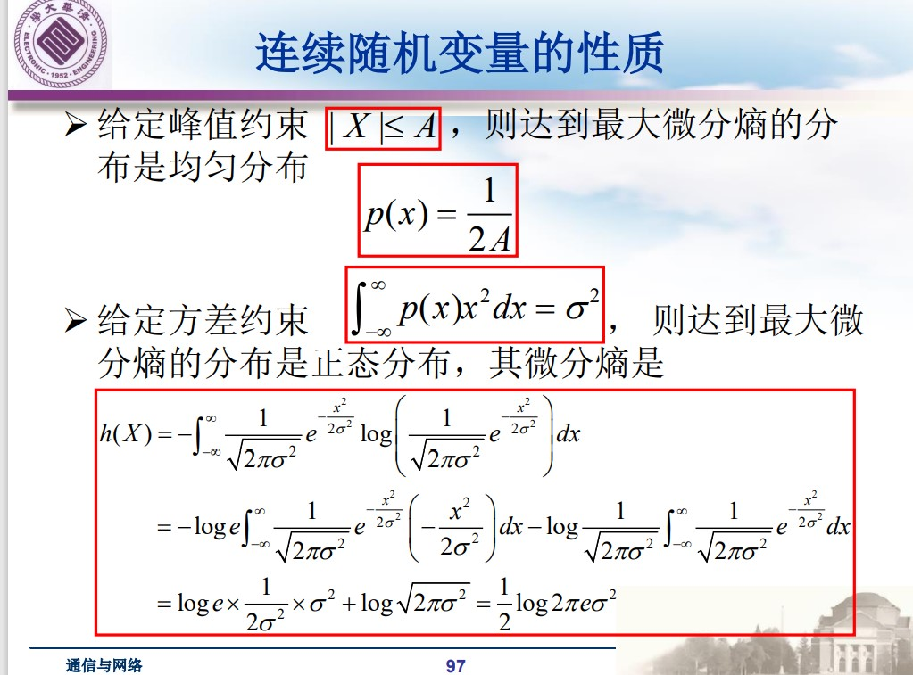

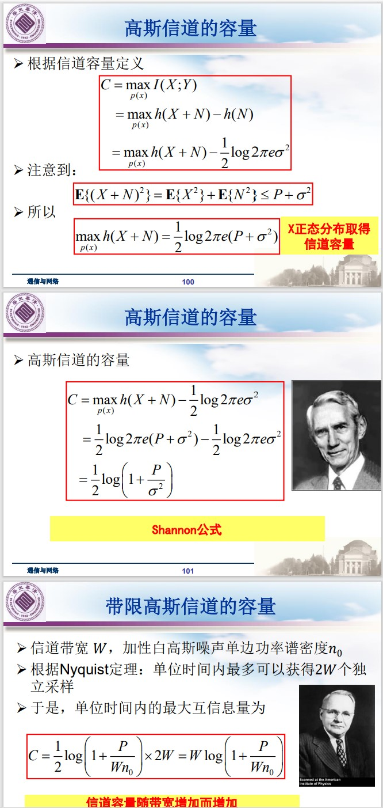

Shannon 公式

$$
C = W\log(1 + \frac{P}{Wn_0})
$$

### 连续性随机变量的熵

$$
H(X) = - \int\limits_{-\infty}^{\infty}p(x)\log p(x) \mathrm dx + \lim_{\Delta \rightarrow 0} \log \frac{1}{\Delta}
$$

我们只关心相对不确定性，定义微分熵

$$
h(X) = -\int\limits_{-\infty}^{\infty}p(x) \log p(x)\mathrm dx
$$

微分熵是对连续型变量相对不确定性的一种描述
- 其定义剔除了连续性或“精准要求”带来的困难，保
留了分布函数形状自身的特征
- 它说明用有限字符集合的字符串描述连续分布的随机
变量，则平均字符长度为无穷大
- 为了用有限长字符串描述信源，需要进行有损压缩，
从而带来失真，即原始信源和压缩结果之间的差异
- 失真测度包括：均方误差，绝对值误差，主观误差等
- 对于图像，视频和语音等连续信源的编码等均属于有
损压缩

### 多元随机变量的熵

联合熵：

$$
h(XY) = -\int\limits_{-\infty}^{\infty}p(x, y) \log p(x, y)\mathrm dx \mathrm{d}y
$$

条件熵：
$$
h(Y|X) = -\int\limits_{-\infty}^{\infty}p(x, y) \log p(y|x)\mathrm dx \mathrm{d}y
$$

互信息：

$$
\begin{align*}
    I(X;Y) &= h(X) + h(Y) - h(XY)\\
    &= h(X) - h(X|Y) \\
    &= h(Y) - h(Y|X)
\end{align*}
$$

## 压缩编码

### 压缩编码的分类

* 无损压缩
    * 输入：数字序列
    * 输出：数字序列
    * 目的：使得平均长度更小
* 有损压缩
    * 输入：模拟信号
    * 输出：数字序列
    * 目的：实现数字传输

信号压缩编码的步骤：

* 抽样
* 量化
* 压缩编码

### 抽样

**连续时间信源的离散化**

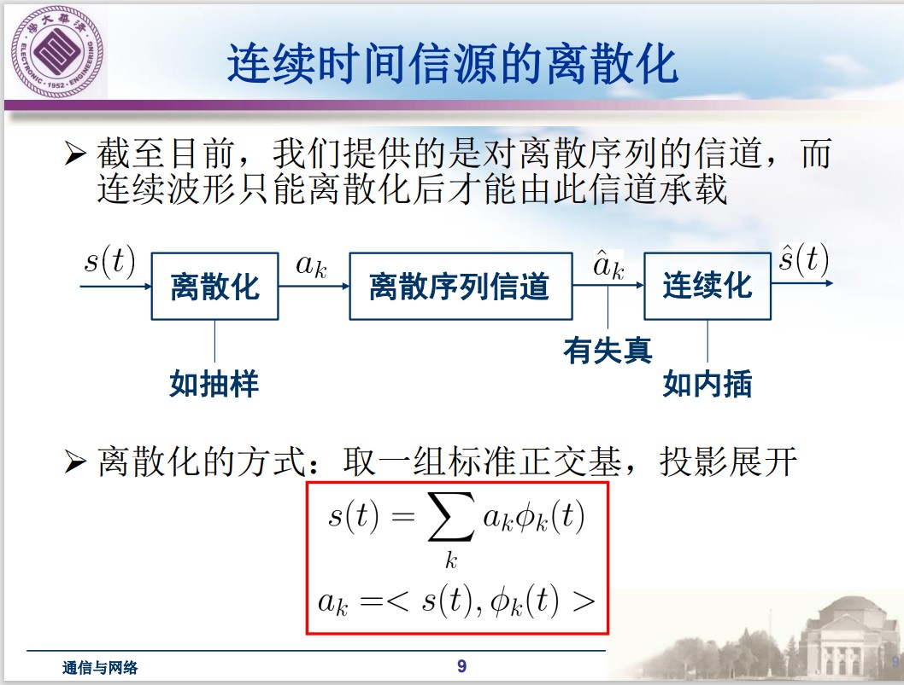

离散化的方式：在标准正交基上投影展开

$$
s(t) = \sum_k a_k\phi_k(t)\\
a_k = <s(t), \phi_k(t)>
$$

若 $s(t)$ 是时限信号（宽度 $T$），可以用傅里叶展开的系数作为离散化结果：$s(t) = \sum\limits_k a_k e^{2\pi jkt/T}$

若 $s(t)$ 是带限信号（带宽 $W$），可以在频域对 $\hat S(f)$ 做傅里叶展开：

$$
\hat S(f) = \sum\limits_k \alpha_k e^{2\pi jkf/(2W)}
$$

变换回时域时，得到 Nyquist 抽样定理：

$$
s(t) =\sum\limits_{k}^{}s(kT) \text{sinc}\left(\left(\frac{t}{T} - k\right)\pi\right), T = \frac{1}{2W}
$$

频域无混叠等价于时域无畸变

对于带通采样，有无混叠条件：

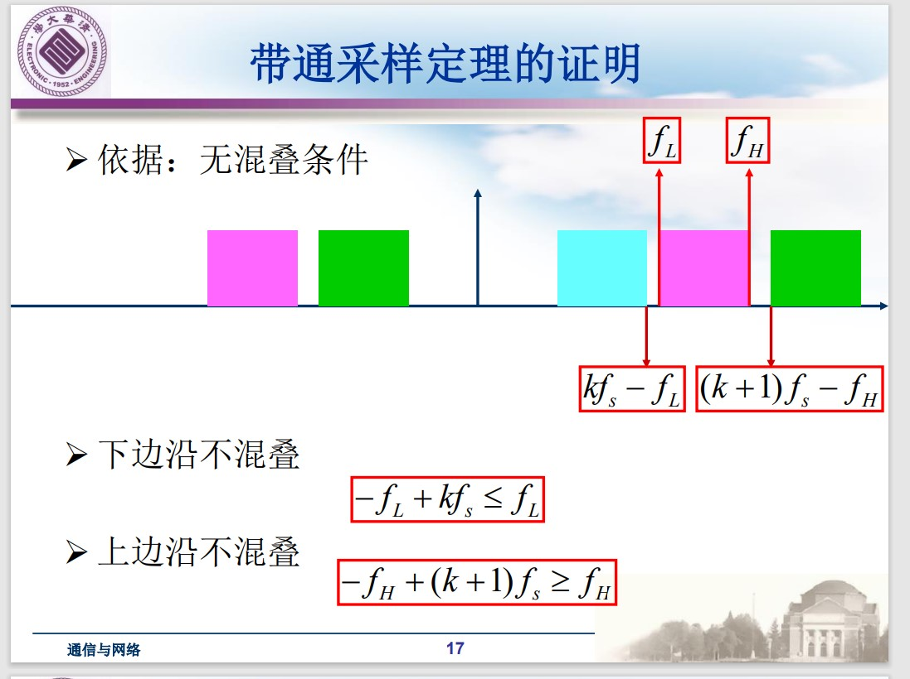

可以推导得出：

$$
f_s = 2B\left(1 + \frac{M}{N}\right)\\
N = \left\lfloor\frac{f_H}{B}\right\rfloor\\
M = \left\lbrace\frac{f_H}{B}\right\rbrace\\
B = f_H - f_L
$$

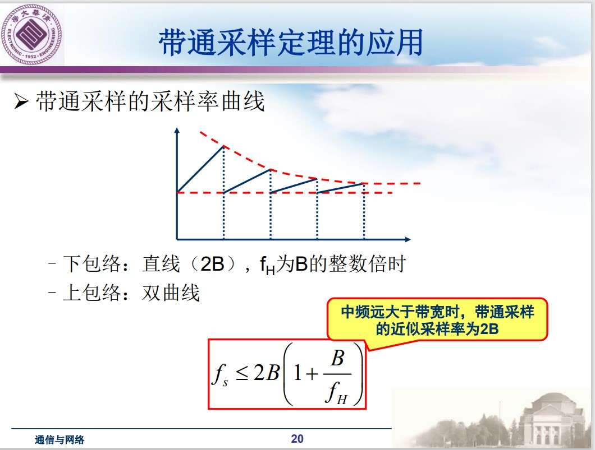

横轴为 $f_H/B$，纵轴为 $f_s$

**量化**

分层电平： $\lbrace x_k \lt x \le x_{k + 1} \rbrace$ 

重建/输出电平：$y_k$代表一个量化区间，用以重构信号时使用的电平值

量化函数： $y = Q(x)$, $y_k = Q\lbrace x_k \lt x \le x_{k + 1} \rbrace$

量化间隔： $\Delta_k = x_{k + 1} - x_{k}$

均匀量化 & 非均匀量化

均匀量化只对有界随机变量存在

### 量化

* 在此只讨论标量的量化
* 量化噪声： $q = x - y = x - Q(x)$ 
* 量化噪声是一个随机变量
* 方差 $\sigma_q^2 = \int_{-\infty}^{\infty}[x - Q(x)]^2p_x(x)\mathrm dx$
* 方差与输入信号分布有关，不存在普适的最佳量化方案

#### 量化噪声的计算

$$
\sigma_q^2 =\sum\limits_{k=1}^{L}\int_{x_k}^{x_{k + 1}}(x - y_k)^2p_x(x)\mathrm dx
$$

从较容易的情况着手
- 只考虑电平区间 $[-V,V]$ 之间的信号，并假设量化间隔很小，亦即分层电平很密
- 在实际情况中，信号的分布函数处处可导，此时每个量化区间内信号的条件分布为均匀分布

量化区间内，近似概率密度 $p_x(x) = \frac{P_k}{\Delta_k}$

密集分层的量化噪声近似

$$
\sigma_{qn}^2 = \sum\limits_{k=1}^{L}\int_{x_k}^{x_{k + 1}}(x - y_k)^2p_x(x)\mathrm dx = \sum\limits_{k=1}^{L}\frac{P_k}{\Delta_k}\int_{x_k}^{x_{k + 1}}(x - y_k)^2\mathrm dx = \frac{1}{12}\sum_{k = 1}^L P_k\Delta_k^2 = \frac{1}{12} \int_{-V}^{V}(\Delta_k)^2p_x(x)\mathrm dx
$$

若 $\Delta_k = \Delta$，

$$
\sigma_{qn}^2 = \frac{1}{12}\sum_k P_k\Delta_k^2 = \frac{\Delta_k^2}{12}
$$

计算量化结果做无损压缩后的比特数：

$$
H(Q(x)) = -\sum_k P_k \log P_k = \underbrace{- \int_{-\infty}^{\infty}p_x(x)\log p_x(x) \mathrm dx }_{h(X)} + \log \frac{1}{\Delta}
$$

由 $\Delta = \sqrt{12\sigma_{qn}^2} = 2\sigma_{qn}\sqrt{3}$，

$$
H(x) = h(x) + \log \frac{1}{2\sigma_{qn}\sqrt{3}}
$$

无损压缩的 bit 数为： $\tilde{R} = h(X) - \frac{1}{2}\log \sigma_{qn}^2 - 1.8$

对于均匀量化：

$$
\Delta_k = \frac{x_{max} - x_{min}}{L} = \frac{2x_{max}}{L}, \forall k
$$

于是

$$
\sigma_{qn}^2 = \frac{\Delta^2}{12} = \frac{x_{max}^2}{3L^2}
$$

这里的 $\sigma_{qn}^2$ 是正常量化噪声，仅仅是计算了信号落在 $[-x_{max}, x_{max}]$ 内的情况

如果信号落在 $[-x_{max}, x_{max}]$ 以外，就就近判断至两端的量化区间，产生过载噪声

$$
\sigma_{qo}^2 = \int_{x_{max}}^{\infty}(x - x_{max})^2p_x(x)\mathrm dx + \int^{-x_{max}}_{-\infty}(x + x_{max})^2p_x(x)\mathrm dx = 2\int_{x_{max}}^{\infty}(x - x_{max})^2p_x(x)\mathrm dx
$$

总噪声等于正常量化噪声加上过载噪声：

$$
\sigma_{qs}^2 = \sigma_{qn}^2 + \sigma_{qo}^2
$$

如果用 $R$ bit 编码：

$$
\Delta_k = \frac{2x_{max}}{L} = \frac{x_{max}}{2^{R - 1}}\\
\sigma_{qn}^2 = \frac{\Delta^2}{12}\int_{-x_{max}}^{x_{max}}p_x(x)\mathrm dx = \frac{x_{max}^2}{3 \times 2^{2R}}\int_{-x_{max}}^{x_{max}}p_x(x)\mathrm dx
$$

定义非过载信号功率：

$$
\sigma_s^2 = \int_{-x_{max}}^{x_{max}}x^2p_x(x)\mathrm dx
$$

当 $\int_{-x_{max}}^{x_{max}}p_x(x)\mathrm dx \rightarrow 1$， $SNR_q \approx \frac{\sigma_s^2}{x_{max}^2/(3 \times 2^{2R})} = 3 \times 2^{2R} \times \zeta^2$，这里定义 $\zeta = \frac{\sigma_s}{x_{max}}$ 为量化范围内信号的饱满程度。

对数单位下：

$$
SNR_q(dB) = 6.02R + 20\log_{10}(\zeta) + 4.77
$$

* 多一个 bit，$SNR_q$ 提升 $6.02dB$
* $\zeta$ 要在合理范围，$\zeta$ 过大时过载会严重劣化性能

#### 最优量化

目标：给定量化区间总数，最小化量化噪声

优化问题：

$$
\min \sum\limits_{k=1}^{L}\int_{x_k}^{x_{k + 1}}(x - y_k)^2 p_x(x)\mathrm dx\\
s.t. x_1\le y_1 \le x_2 \le y_2 \le \dots \le y_L \le x_{L + 1}
$$

分层电平在重建电平的中点：

$$
\frac{\partial \sigma_q^2}{\partial x_k} = 0\\
\Rightarrow x_{k, opt} = \frac{1}{2}(y_{k, opt} + y_{k - 1, opt})
$$

重建电平在量化区间的质心：

$$
\frac{\partial \sigma_q^2}{\partial y_k} = 0\\
\Rightarrow y_{k, opt} = \frac{\int_{x_{k, opt}}^{x_{k+1, opt}}xp(x)\mathrm dx}{\int_{x_{k, opt}}^{x_{k+1, opt}}p(x)\mathrm dx}
$$

对于均匀分布，质心即中点（对于可导的概率分布，当分层很密的时候同样成立）

$$
 y_{k, opt} = \frac{\int_{x_{k, opt}}^{x_{k+1, opt}}xp(x)\mathrm dx}{\int_{x_{k, opt}}^{x_{k+1, opt}}p(x)\mathrm dx} = \frac{1}{2}(x_{k, opt} + x_{k + 1, opt})
$$

结合

$$
x_{k, opt} = \frac{1}{2}(y_{k, opt} + y_{k - 1, opt})
$$

可得均匀分布的最佳量化是区间等分，中点重建

#### 工程用量化

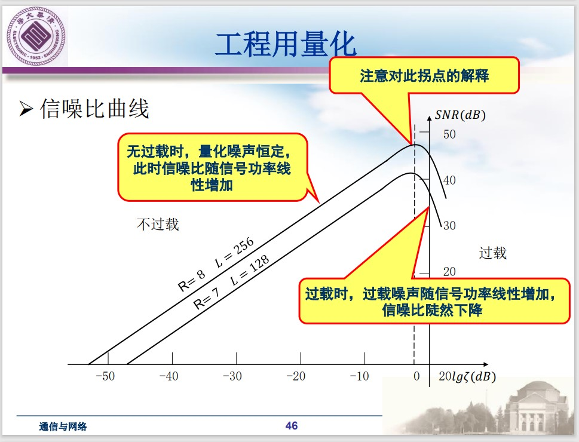

#### 语音信号的量化

$[-V, V]$ 内均匀量化的缺陷：
* 最适合 $[-V, V]$ 之间的有限分布
* 语音信号呈拉普拉斯分布，特点是：
    * 信号功率小
    * 动态范围大（长拖尾）
* 如果采用均匀量化
    * 较大的V：增大[-V，V]内的量化噪声
    * 较小的V：增大过载噪声

解决思路1：非均匀量化

**语音信号的非均匀量化**

均匀量化的问题
- 对具有不同“概率权重”的区间“一视同仁”
- 没有考虑概率密度对于量化噪声的影响

解决方案
- 对于信号经常出现的区域，使用较细的颗粒度进行量化
    - 信号经常落入这个区域，减小该区域的量化噪声损失
- 对于信号不经常出现的区域，使用较粗的颗粒度进行量化
    - 信号不经常落入这个区域，量化噪声稍大不会影响大局

采用取对数后均匀量化的方法：

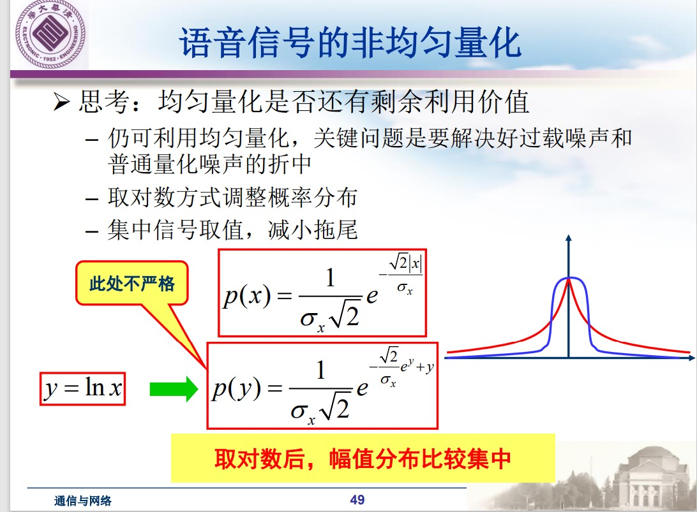

语音信号的瞬时压扩：

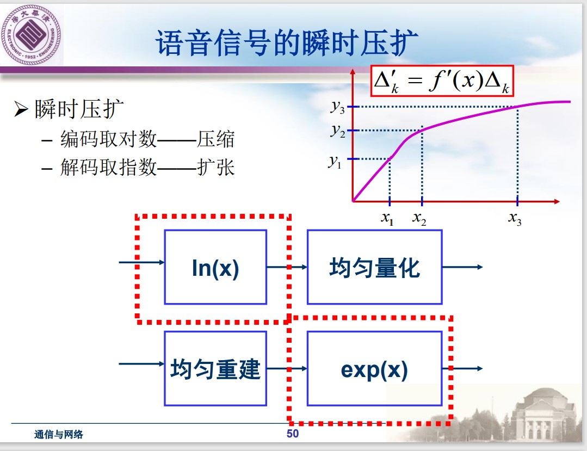

**对数量化**

* 正常量化信噪比与信号的分布无关
* 过载导致的噪声与信号的分布有关！

记 $\Delta_k$为对数化之前的量化区间, $\Delta_k^\prime = \Delta$ 为对数化之后的量化区间

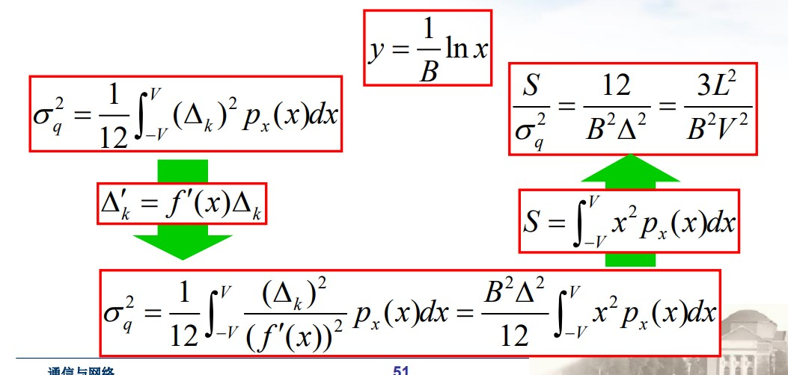

**实用的对数量化**

实际工程中，采用另外两个函数（线性放缩，更容易实现）：

* A律（欧洲提出，我国采用）

$$
f(x) = \begin{cases}
    \frac{Ax}{1 + \ln A}, 0 \le x \le \frac{1}{A}\\
    \frac{1 + \ln Ax}{1 + \ln A}, \frac{1}{A} \le x \le 1\\
\end{cases}
$$

* ITU G.712建议中取A＝87.6
* 小信号时，信噪比增加了24dB

* μ律（美国提出）

$$
f(x) = \frac{\ln (1 + \mu x)}{\ln (1 + \mu)}, 0 \le x \le 1
$$

* ITU G.712建议中取μ＝255
* 小信号时，信噪比增加了33.5dB

**脉冲编码调制(PCM)**

- 语音信号的实际压缩编码方式
- 包括两个主要步骤
- 抽样：$f_s = 8000Hz$
- 量化与编码：使用近似对数压扩，每个抽样量化为8位
- PCM的输出码率为64kbps

**该码率与其推导过程十分重要**

**PCM编码协议**

基本思想
- 用13折线近似A律
- 用15折线近似μ律

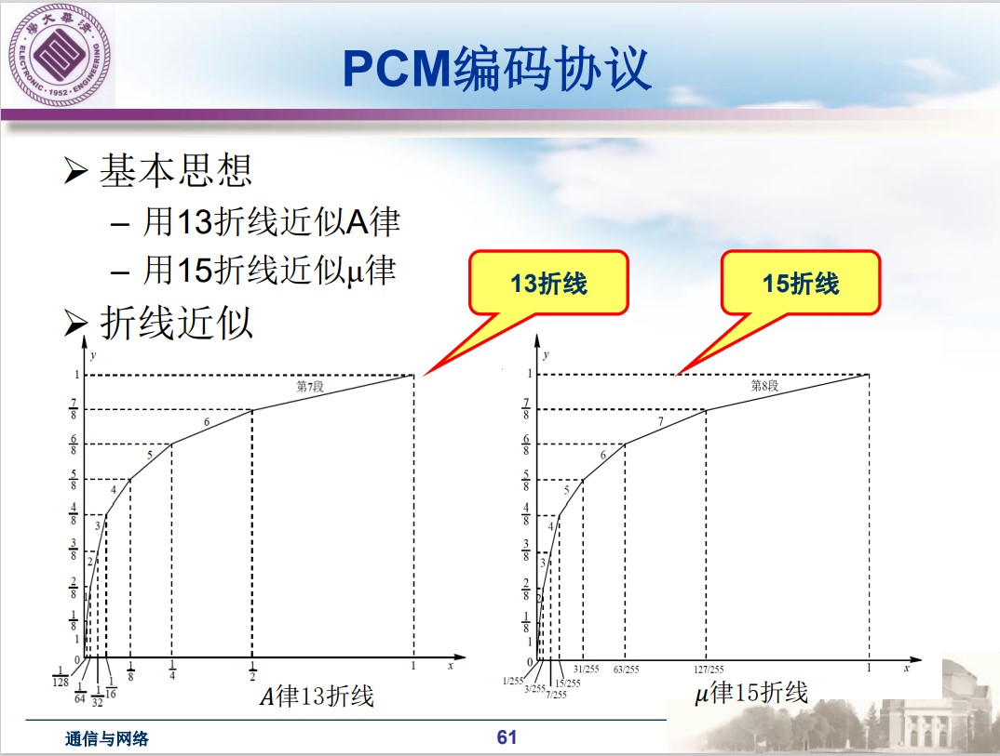

码字结构：

$$
\mathop{M_1}\limits_{极性码} \quad \underbrace{M_2 \quad M_3 \quad M_4}_{段落码}\quad \underbrace{M_5 \quad M_6\quad M_7 \quad M_8}_{电平码} \quad 
$$

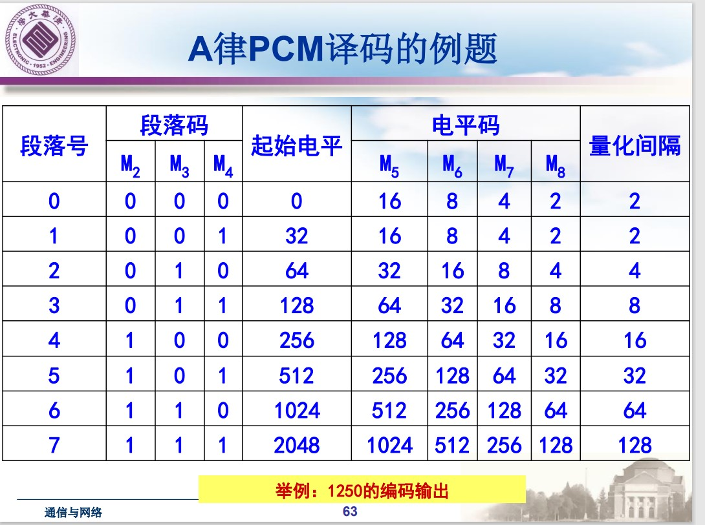

例：

1250的输出：1 110 0011

接收端解码： 1024 + 128 + 64 + 32 = 1248

## 数字基带传输

### 符号映射

**符号集合**

$M = |\mathcal{A}|$ 为符号集合 $\mathcal{A}$ 的符号数量。

**bit 承载量**
每个符号最多可对应 $r = \log_2|\mathcal{A}|$ 个 bit，称为集合的 bit 承载量

数字通信的典型符号：

* ASK
* PAM
* PSK
* QAM

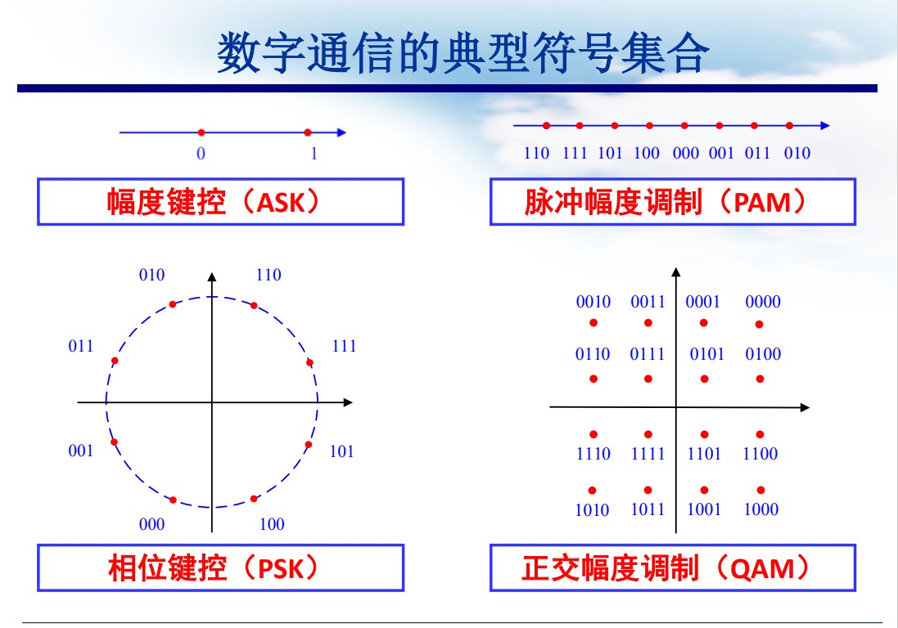

**邻位最小差错映射：Grey 码**

相邻符号对应的 bit 串仅有一位差异

**符号周期（Symbol Period）**

* 传输一个符号所需的平均时间
* $T_s$

通信速率：
* 符号速率：$R_s = \frac{1}{T_s}$
* Bit 速率： $R_b = R_s \log_2 M = \frac{1}{T_s}\log_2 M$

### 数字调制

基带调制：将时间上离散的符号，加载到时间上形成连续的波形

通信信号具有带宽受限特性，因为：

- 自然原因：各类通信线路，如双绞线，同轴电缆，射频功放等均对通过的频率有一定限制
- 人为原因：多用户频谱共享通信，如蜂窝无线系统，需约束每路信号的带宽，以免相互干扰

如何产生带限信号？

产生一个信号 $s(t) =\sum\limits_{k=-\infty}^{\infty}a_kg(t- k T_s)$，$g(t) = \frac{\sin 2\pi Wt}{2\pi Wt}$是个带限信号。

$$
G(f) = \begin{cases}
    1, |f| \le W,\\
    0, |f| \gt W
\end{cases}
$$

让间隔 $T_s$ 的冲击 $a_k\delta(t - kT_s)$ 依次通过冲击响应为 $g(t)$ 的低通滤波器

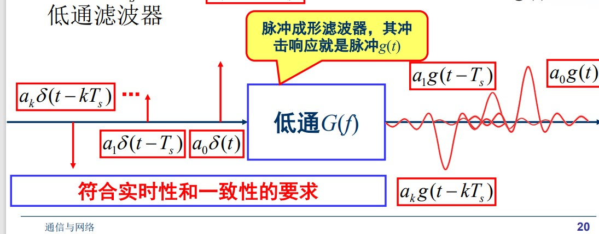

### Nyquist 准则：无ISI条件

**符号间串扰（Inter Symbol Interference, ISI）**

对 $s(t)$ 采样：

$$
s(nT_s) = a_ng(0) + \underbrace{\sum\limits_{k=-\infty, k\ne n}^{\infty}a_kg\big((n - k)T_s\big)}_{\text{ISI}}
$$

怎么让 ISI 为0？

**眼图：观察符号间串扰**

眼图（Eye Pattern）是直观察看数字基带传输性能的有效方法，用一个示波器

$$
垂直输入 \xrightarrow{接} 匹配滤波器的输出\\
水平扫描速度 \xrightarrow{设为} 𝑅_𝑠的整数倍
$$

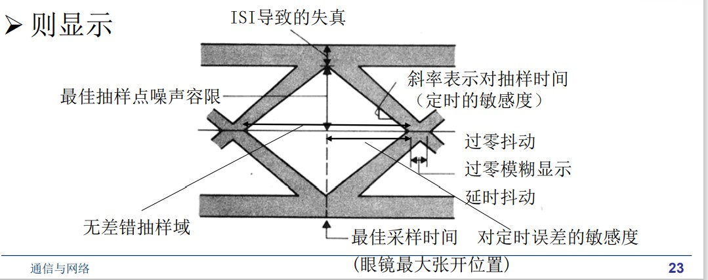

眼皮的厚度表示 ISI 的失真，眼睛的张开程度表示噪声容限。

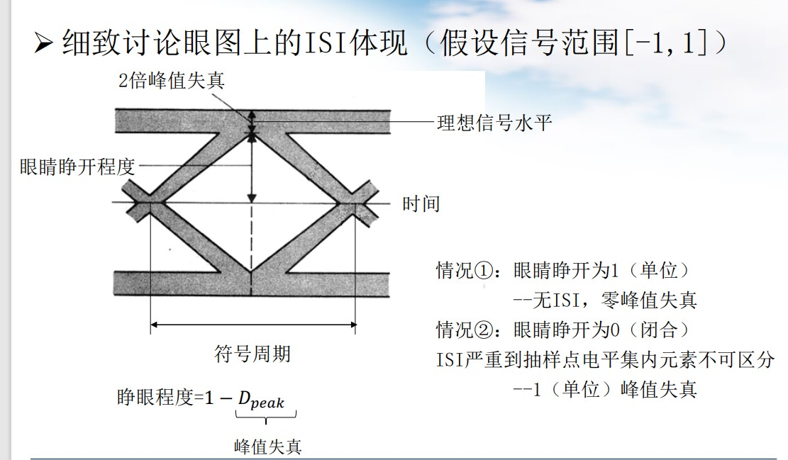

消除 ISI 对带限脉冲的要求

时域特征：

$$
\left.\begin{align*}
    g(0) &= 1\\
    \sum\limits_{k=-\infty, k\ne n}^{\infty}a_kg\big((n - k)T_s\big) &= 0
\end{align*}\right\rbrace \Leftrightarrow \sum\limits_{k=-\infty, k\ne n}^{\infty}a_{n - k}g\big(kT_s\big) = 0\\
\Leftrightarrow g(kT_s) = \begin{cases}
    1, k = 0,\\
    0, k \ne 0
\end{cases} \\
\lrArr g(t)\sum\limits_{n=-\infty}^{\infty}\delta(t + nT_s) = \delta(t)
$$

从频域提取特征：

$$
g(t)\sum\limits_{n=-\infty}^{\infty}\delta(t + nT_s) = \delta(t) \lrArr G(f) *\sum\limits_{n=-\infty}^{\infty}\frac{1}{T_s}\delta(f + \frac{n}{T_s}) = 1\\
\lrArr \sum\limits_{n=-\infty}^{\infty}G\left(f + \frac{n}{T_s}\right) = T_s
$$

**Nyquist 准则**

将带限脉冲的频谱分别平移 $n/T_s$（ $n$ 为任意整数）若其叠加的结果对任意频率恒为定值，则 ISI 为0

### 通信速率与带宽效率

**理解 Nyquist 准则**

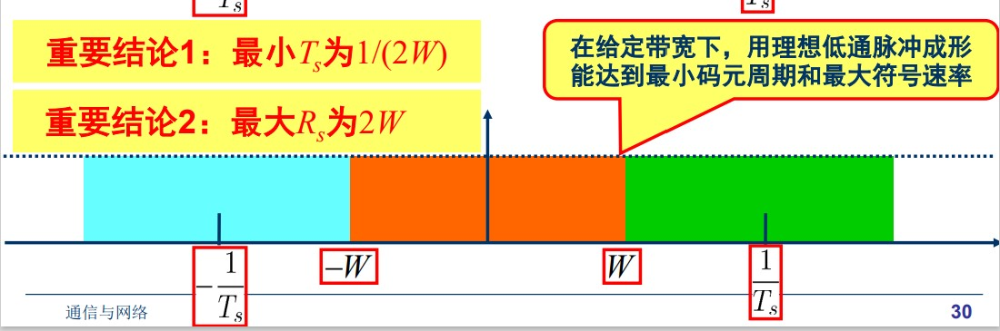

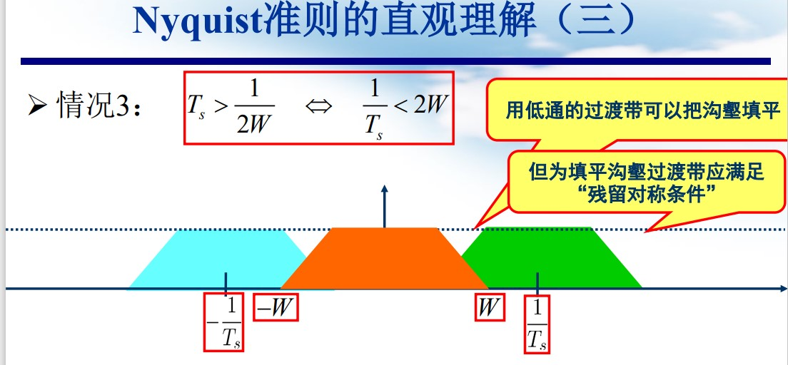

* 最大符号速率受制于带宽 $R_s = \frac{1}{T_s} \le 2W$
* 低通发送滤波器应该满足残留对称条件

**通信速率与带宽效率**

$$
R_s \le 2W\\
R_b = R_s \log_2 M\\
\Rightarrow R_b \le 2W \log_2 M
$$

* 针对给定形式的低通滤波器，可写出$R_s$与$W$之间的线性函数关系

**信号功率与带宽效率**

设单个符号的能量为 $E_s$

则信号功率为单位时间内的能量
$$
P = \frac{E_s}{T_s} = E_sR_s
$$

无冗余编码时，一个比特的能量为$𝐸_𝑏$，则

$$
P = \frac{E_b\log_2 M}{T_s} = E_bR_b
$$

带宽效率的定义：单位带宽承载的速率

$$
\eta = \frac{R_b}{W} \le 2\log_2 M
$$

* 为什么不能无限制扩大符号集合？

过大的符号集合对信噪比有更高的要求，噪声容易干扰符号的分辨

### 升余弦滤波器

**升余弦滤波器**

由于理想滤波器难以实现，所以常用满足残留对称条件的非理想低通生成基带脉冲，最常用的就是升余弦滤波器

Raised Cosine(要记住)

$$
H(f) = \begin{cases}
    T_s, &0 \le |f| \lt \frac{1 - \alpha}{2 T_s}\\
    \frac{T_s}{2}\left\lbrace1 + \cos \left[\frac{\pi T_s}{\alpha}\left(|f| - \frac{1 - \alpha}{2T_s}\right)\right]\right\rbrace, &\frac{1 - \alpha}{2 T_s} \le |f| \le \frac{1 + \alpha}{2 T_s}\\
    0, & |f| \gt \frac{1 + \alpha}{2 T_s}
\end{cases}
$$

$\alpha = 2WT_s - 1 \in [0, 1]$ 称为滚降系数，越小坡越陡，越大坡越缓。

时域冲激响应：

$$
h(t) = \text{Sa}(\pi t/ T_s)\frac{\cos (\alpha\pi t/ T_s)}{1 - 4(\alpha t/T_s)^2}
$$

升余弦滤波器的性质：

常考性质：

$$
W = \frac{\alpha + 1}{2T_s} = \frac{\alpha + 1}{2}R_s \Rightarrow R_s/2 \le W \le R_s\\
R_s = \frac{1}{T_s} = \frac{2}{\alpha + 1} W \Rightarrow W \le R_s \le 2W
$$

带宽效率

$$
\eta_b = \frac{R_s\log_2|\mathcal{S}|}{W} \le 2\log_2|\mathcal S|
$$

升余弦滤波器的带宽效率

$$
\eta_b = \frac{2\log_2|\mathcal{S}|}{\alpha + 1}
$$

PCM 语言信号速率 64kbps：8 bit 采样，8 bit 量化，8*8 = 64.

例题一：传送一路PCM语音信号
- 若带宽限制为40kHz，采用二元码，则可用滚降系数范围
是多少？
- 若采用四元码，最多需要多少带宽？

解：PCM语音信号是64kbps
- 采用二元码，则所需符号速率为 $R_s = R_b = 64kbps$
* 则 $\frac{\alpha + 1}{2}64 \le 40$, $0\le \alpha \le 0.25$

* 采用四元码：$R_s = \frac{R_b}{\log_24} = 32kbps$
* $W \le R_s = 32kHz$

例题二：若传送一路信号$𝑅_𝑏$ = 112kbps，信道带宽𝑊 = 30𝑘bps,
求𝑀和𝛼

$$
\frac{\log_2M}{\alpha} = \frac{R_b}{2W} = \frac{28}{15} \in [1.5, 2]\\
$$

认定 $\log_2M = k$ 为整数，则$k = 2 或 3$。对应可解：

$$
\alpha_1 = \frac{1}{14}, M_1 = 4\\
\alpha_2 = \frac{17}{28}, M_2 = 8
$$

### 通信信号的功率谱计算

功率谱刻画了随机过程的功率在频域上的分布。
* 对于宽平稳过程（自相关只与时差有关），功率谱易于从 $R(\tau)$ 的傅里叶变换得到，即$S(f) = \mathcal{F}[R(\tau)]$
* 但是，通信信号一般不是宽平稳过程，而是周期平稳过程：$R(t_1, t_2) = R(t_1 + kT_s, t_2 + kT_s)$ 

定义 

$$
\overline{R}(\tau) = \frac{1}{T_s} \int_{0}^{T_s}R(t+\tau, t)\mathrm dt
$$

则其功率谱

$$
S(f) = \mathcal{F}[\overline{R}(\tau)]
$$

若输入信号的功率谱 $S_{AI}(f)$，输出为$S_A(f)$，则对于宽平稳和周期平稳信号均有卷积关系：

$$
S_A(f) = S_{AI}(f)|H(f)|^2
$$

证明可以采用样本统计法：假设符号序列的长度为 $2N - 1$.

$$
s_{AI}(t) =\sum\limits_{k=-N}^{N}a_k\delta(t - k T_s)\\
s_{A}(t) =\sum\limits_{k=-N}^{N}a_kh(t - k T_s)\\
\hat s_{AI}(f) =\sum\limits_{k=-N}^{N}\exp(-j2k\pi T_sf)\\
\hat s_{A}(f) = H(f)\sum\limits_{k=-N}^{N}\exp(-j2k\pi T_sf)
$$

功率谱的定义：

$$
S(f) = \lim\limits_{N\rightarrow\infty} \frac{E(|\hat s(f)|^2)}{(2N + 1)T_s}
$$

可以验证 $S_A(f) = S_{AI}(f)|H(f)|^2$

针对样本统计法，可以算出 $E(|\cdot|^2)$的表达式：

$$
S_A(f) = \frac{|H(f)|^2}{T_s}\sum\limits_{n=-\infty}^{\infty}R_a[n] \exp (-j2n\pi T_s f)
$$

这里$R_a[m]$ 是输入符号的自相关。

先考虑无记忆调制，符号之间相互独立：

$$
R_a[n] = E[a_ia_{i+n}] = \begin{cases}
    \sigma_a^2+m_a^2 &n=0\\
    m_a^2 &n\ne 0
\end{cases}
$$

其中，$m_a = E[a_n]$，$\sigma_a^2 = E[a_n^2] - m_a^2$

于是，重写累加部分：

$$
\begin{align*}
    &\sum\limits_{n=-\infty}^{\infty}R_a[n] \exp (-j2n\pi T_s f) \\
    =& \sigma_a^2 + m_a^2\sum\limits_{n=-\infty}^{\infty}\exp\big[-jn(2\pi T_s)f\big]\\
    =& \sigma_a^2 + \frac{1}{T_s}\sum\limits_{n=-\infty}^{\infty}\delta\bigg(f - \frac{n}{T_s}\bigg)
\end{align*}
$$

从而

$$
S_A(f) = \underbrace{\frac{\sigma_a^2}{T_s}|H(f)|^2}_{连续谱} + \underbrace{\frac{m_a^2}{T_s^2}\sum\limits_{n=-\infty}^{\infty}\bigg|H\bigg(\frac{n}{T_s}\bigg)\bigg|^2 \delta\bigg(f - \frac{n}{T_s}\bigg)}_{线谱}
$$

此式应用的两个条件：
* 无记忆
* 不同符号波形一致

线谱：可用于定时恢复。方便恢复时钟分量。

**任意波形调制**

之前将 $a_i$ 映射为 $a_ih(t)$，可以推广：

$$
\forall a_i \ne a_j, s_i(t) \ne s_j(t)
$$

有时候由于信号功率需要保持稳定（恒包络调制），对不同符号采用不同波形，而不是采用变化幅度的信号。

若任意波形二元调制信号 $s(t) =\sum\limits_{k=-\infty}^{\infty}g_k(t)$

$$
g_k(t) = \begin{cases}
    s_1(t - kT_s), w.p.\ p\\
    s_2(t - kT_s), w.p.\ \bar p = 1 - p
\end{cases}
$$

(w. p. = with probability)

分解为直流分量和交流分量：

$$
s(t) = \underbrace{E(s(t))}_{DC,记为v(t)} + \underbrace{s(t) - E(s(t))}_{AC, 记q(t)}
$$

则

$$
v(t) = \sum\limits_{k=-\infty}^{\infty}[ps_1(t - kT_s) + \bar p s_2(t - kT_s)]
$$

这是一个周期为$𝑇_𝑠$的确定性周期信号，功率谱由傅里叶展开计算

$$
S_v(f) =\sum\limits_{n=-\infty}^{\infty}|D_n|^2\delta(f - \frac{n}{T_s})\\
D_n = \frac{1}{T_s}\int_{-T_s/2}^{T_s/2}v(t)e^{-j2\pi t/T_s}\mathrm dt = \frac{1}{T_s}\Big(p\hat s_1\big(\frac{n}{T_s}\big) + \bar p \hat s_2(\frac{n}{T_s}\big)\Big)
$$

$$
S_v(f) = \frac{1}{T_s}\sum\limits_{n=-\infty}^{\infty}\bigg|\Big(p\hat s_1\big(\frac{n}{T_s}\big) + \bar p \hat s_2(\frac{n}{T_s}\big)\Big)\bigg|^2 \delta(f - \frac{n}{T_s})
$$

用样本统计法计算 $S_q(f)$：

$$
\begin{align*}
    S_q(f) =& \lim\limits_{N\rightarrow\infty} \frac{E(|\hat q_N(f)|^2)}{(2N + 1)T_s}\\
    =& \frac{p\bar p}{T_s}|\hat s_1 (f) - \hat s_2(f)|^2
\end{align*}
$$

$$
S(f) = \frac{p\bar p}{T_s}|\hat s_1 (f) - \hat s_2(f)|^2 + \frac{1}{T_s}\sum\limits_{n=-\infty}^{\infty}\bigg|\Big(p\hat s_1\big(\frac{n}{T_s}\big) + \bar p \hat s_2(\frac{n}{T_s}\big)\Big)\bigg|^2 \delta(f - \frac{n}{T_s})
$$

### 基带解调

最佳接收用于在给定发送功率下提高信噪比

最佳判决用于在给定信噪比下降低误码率

#### 基带传输的噪声模型

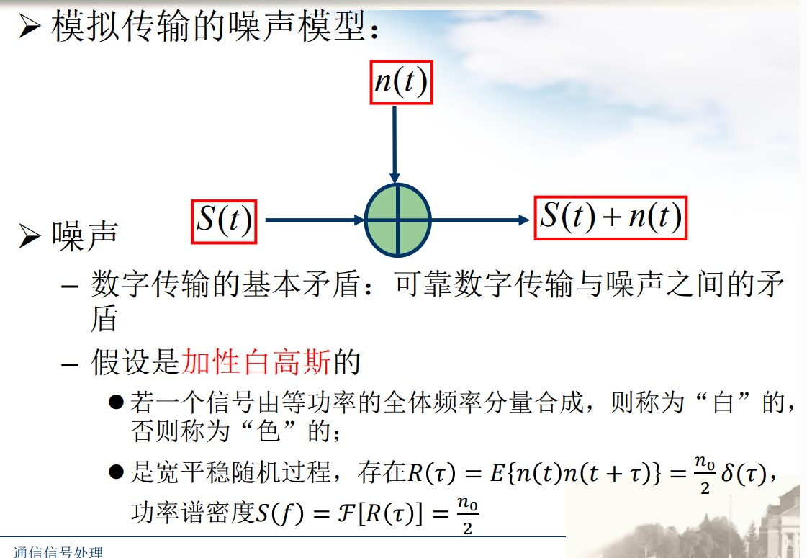

如何选择解调方案？

**方案一：直接抽样**

在信号的峰值位置 $t = kT_s$ 抽样最好。

但噪声方差满足：

$$
\sigma^2 = E \lbrace n^2(t_1) \rbrace = R(0) = \frac{n_0}{2}\delta(0) \rightarrow \infty
$$

（理想的白噪声信号具有无穷大功率）

真实的噪声环境下，接收信号质量随着噪声信号功率的增加而变差。如果信号的峰值处恰好噪声很大，则产生严重失真。

**方案二：能量累积**

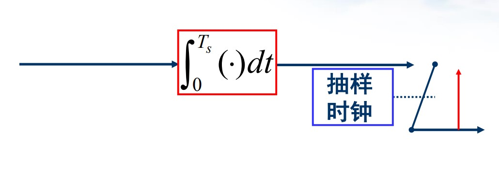

噪声信号仍为高斯随机变量：

$$
n = \int_{0}^{T_s}n(t)\mathrm dt
$$

噪声方差：

$$
\sigma^2 = E\lbrace n^2 \rbrace = \int_{0}^{T_s}\int_{0}^{T_s}\frac{n_0}{2}\delta(t_1 - t_2)\mathrm dt_1\mathrm dt_2 = \frac{n_0T_s}{2}
$$

信噪比：

$$
\frac{S}{N} = \frac{\left (\int_{0}^{T_s}a_i h(t)\mathrm dt \right)^2}{T_sn_0/2}
$$

直接积分不是最好的方案。

**方案三：匹配滤波**

匹配滤波的基本思想就是对接收值进行加权线性累加，从而最大化抽样时刻信号功率与噪声功率的比值。

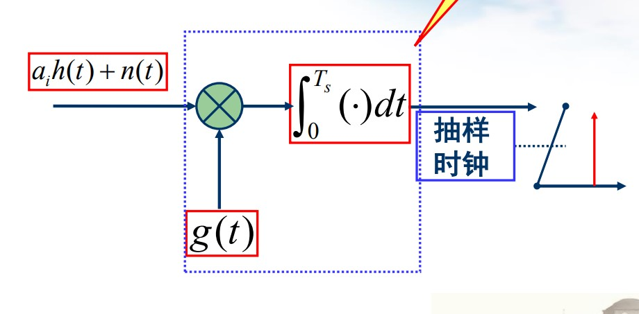

相关器为 $g(t)$。假设信号为实信号。复信号有类似结论。

$$
P_S = \left |\int_{0}^{T_s}a_ih(t)g(t)\mathrm dt  \right|^2\\
P_N = \mathbf E \left [ \left | \int_{0}^{T_s}n(t)g(t)\mathrm dt \right|^2 \right] = \frac{1}{2}n_0 \int_{0}^{T_s}g^2(t)\mathrm dt
$$

利用 Cauchy-Schwartz 不等式：

$$
\frac{\left |\int_{0}^{T_s}a_ih(t)g(t)\mathrm dt  \right|^2}{\frac{1}{2}n_0 \int_{0}^{T_s}g^2(t)\mathrm dt} \le \frac{2}{n_0}\int_{0}^{T_s}a_i^2h^2(t)\mathrm dt
$$

等号成立当且仅当 $g(t) = kh(t)$。

若为复信号，则需要

$$
g(t) = h^*(t)
$$

如何把相关器写成滤波器形式？

（滤波=卷积，相关和卷积就是差一个反褶的关系）

$$
y(t) = [a_ih(t) + n(t)] * h_m(t) = \int_{-\infty}^{\infty}[a_ih(\tau) + n(\tau)]h_m(t - \tau)\mathrm d\tau
$$

考虑因果系统，一般将符号波形的最高点设置为 $t = T_s$：

$$
y(T_s) = \int_{-\infty}^{\infty}[a_ih(\tau) + n(\tau)]h_m(T_s - \tau)\mathrm d\tau
$$

与相关器比较得到匹配滤波器的表达式：

$$
h_m(t) = h(T_s - t)
$$

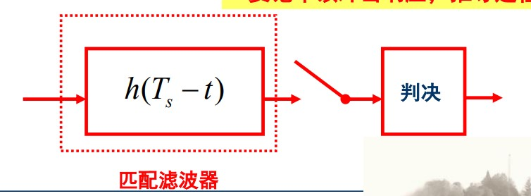

图中的“开关”是抽样。

匹配滤波的频域解释：

$$
P_S = \left | \int_{-\infty}^{\infty}H(f)H_m(f)e^{j2\pi fT_s}\mathrm df \right|^2\\
P_N = \frac{n_0}{2}\int_{-\infty}^{\infty}|H_m(f)|^2\mathrm df\\
\frac{S}{N} = \frac{\left | \int_{-\infty}^{\infty}H(f)H_m(f)e^{j2\pi fT_s}\mathrm df \right|^2}{\frac{n_0}{2}\int_{-\infty}^{\infty}|H_m(f)|^2\mathrm df} = \frac{2}{n_0}\int_{-\infty}^{\infty}|H(f)|^2\mathrm df
$$

Cauchy-Schwartz

$$
H_m(f) = H^*(f)e^{-j2\pi fT_s}
$$

**匹配滤波的增益**

数字传输的优势：数字传输中，基带脉冲h(t)是给定的，在整个码元周期内可以相干累加，而同时让噪声在整个周期内自我抵消

$$
\left (\frac{S}{N}  \right)_{\text{match}} \bigg/ \left (\frac{S}{N}  \right)_{\text{w.o.match}} = \frac{T_s \int_{0}^{T_s}h^2(t)\mathrm dt}{\left ( \int_{0}^{T_s}h(t)\mathrm dt \right)^2} \ge \frac{T_s \int_{0}^{T_s}h^2(t)\mathrm dt}{\int_{0}^{T_s}1\mathrm dt\int_{0}^{T_s}h^2(t)\mathrm dt} = 1
$$

匹配滤波的信噪比

$$
\frac{S}{N} = E \left [ \frac{2}{n_0} \int_{0}^{T_s}a_i^2h^2(t)\mathrm dt \right] = \frac{\int_{0}^{T_s}E[a_i^2]h^2(t)\mathrm dt}{n_0/2} = \frac{E_s}{n_0 / 2}
$$

分子——传送一个符号的能量

分母——噪声谱密度，单位是能量的单位

以上采用的是等效基带模型。采用实际物理波形模型：

$$
S = \frac{E_s}{T_s} = E_sR_s\\
N = Wn_0\\
\frac{S}{N} = \frac{E_s}{n_0}\frac{R_s}{W}\\
$$

两个模型推得的信噪比表达式不同，差异在于等效基带模型使用了匹配滤波器，获得了最优的信噪比：

$$
\frac{R_s}{W} \le 2 \Rightarrow\left (\frac{S}{N}  \right)_{\text{max}} = \frac{E_s}{n_0/2}
$$

从实际物理波形模型来看，上式取等的条件应该是基带脉冲采用的是理想低通（Sa 函数），如果用升余弦滤波

$$
\frac{R_s}{W} = \frac{2}{\alpha + 1} \Rightarrow \left(\frac{S}{N}\right)_{\text{max}} = \frac{E_s}{n_0/2}\frac{2}{\alpha + 1}
$$

但是，在等效基带模型中，我们考虑的是任意脉冲 $h(t)$，并没有要求它的形状，这两个模型在最优信噪比的产生条件上出现了矛盾？

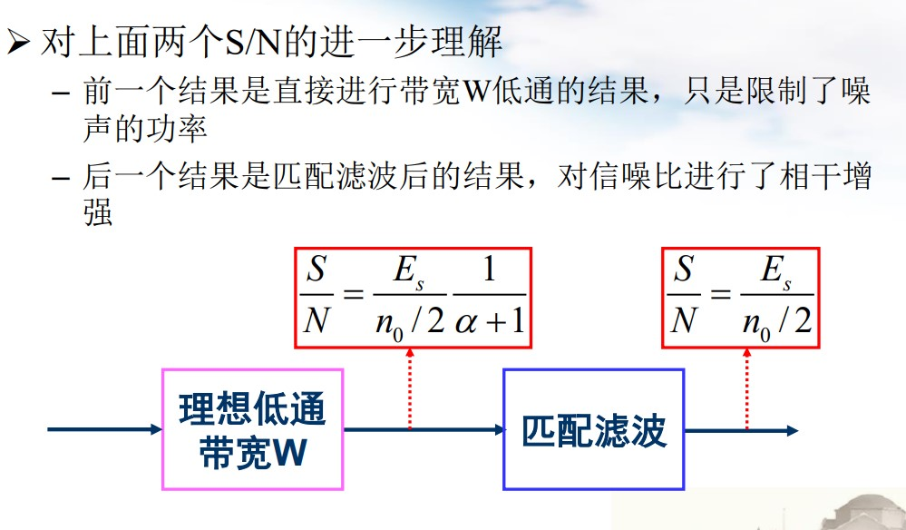

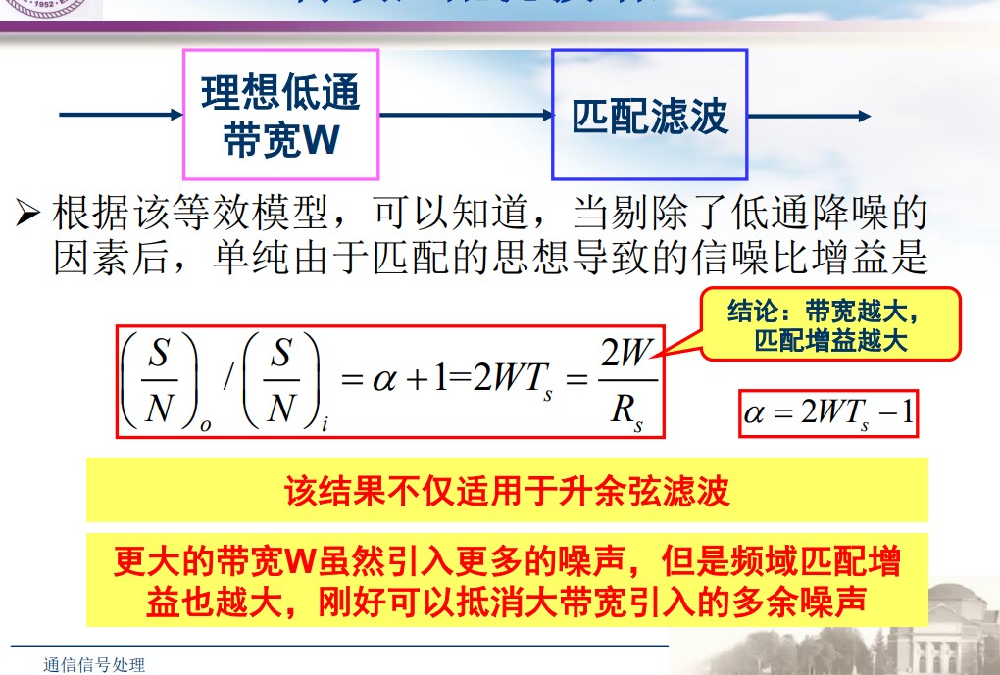