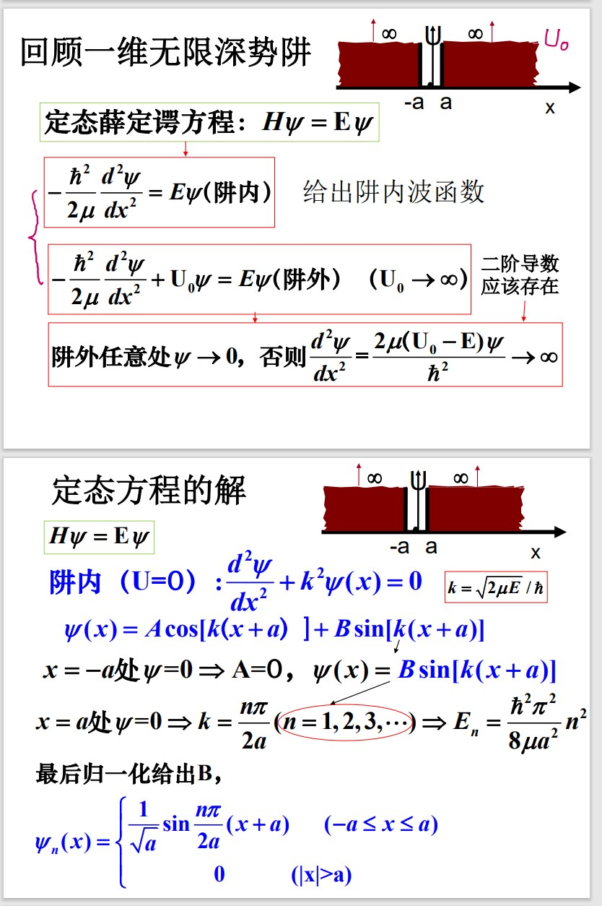
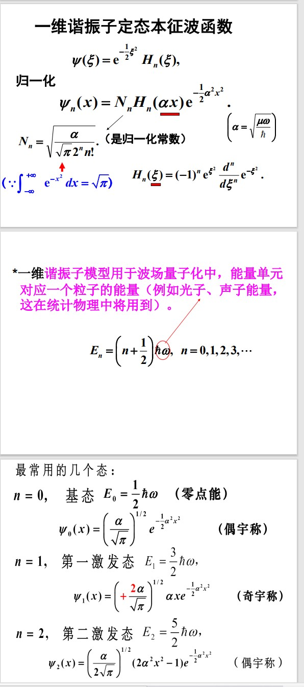
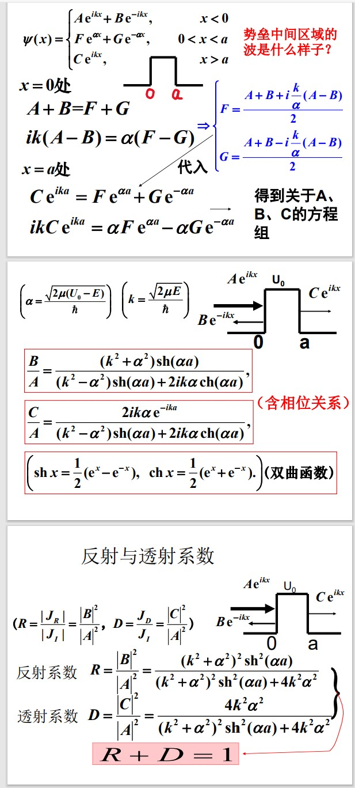
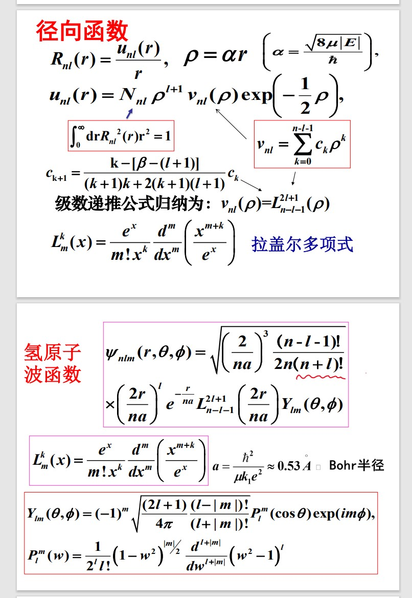
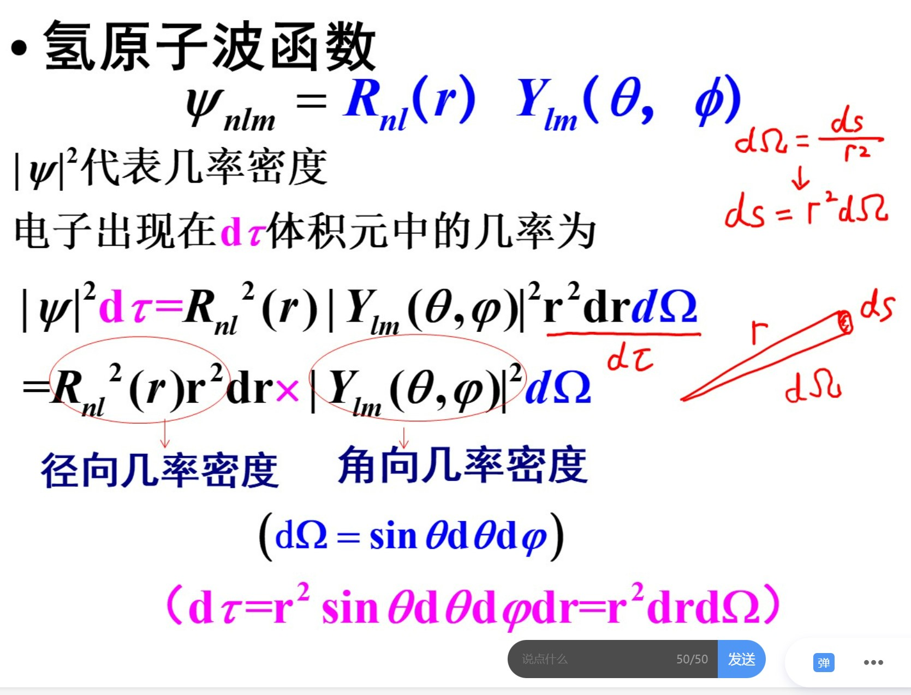
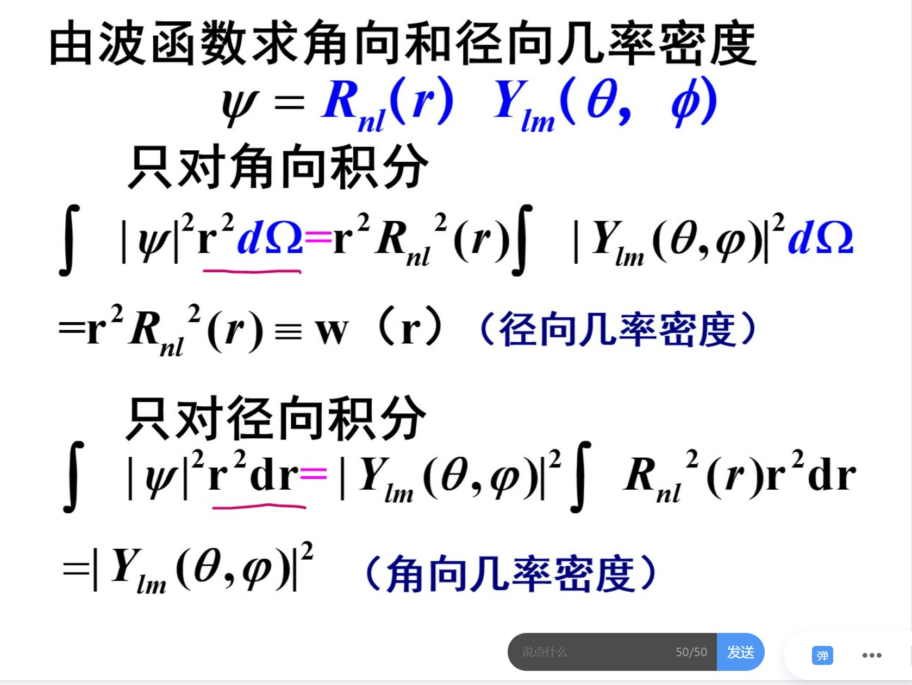
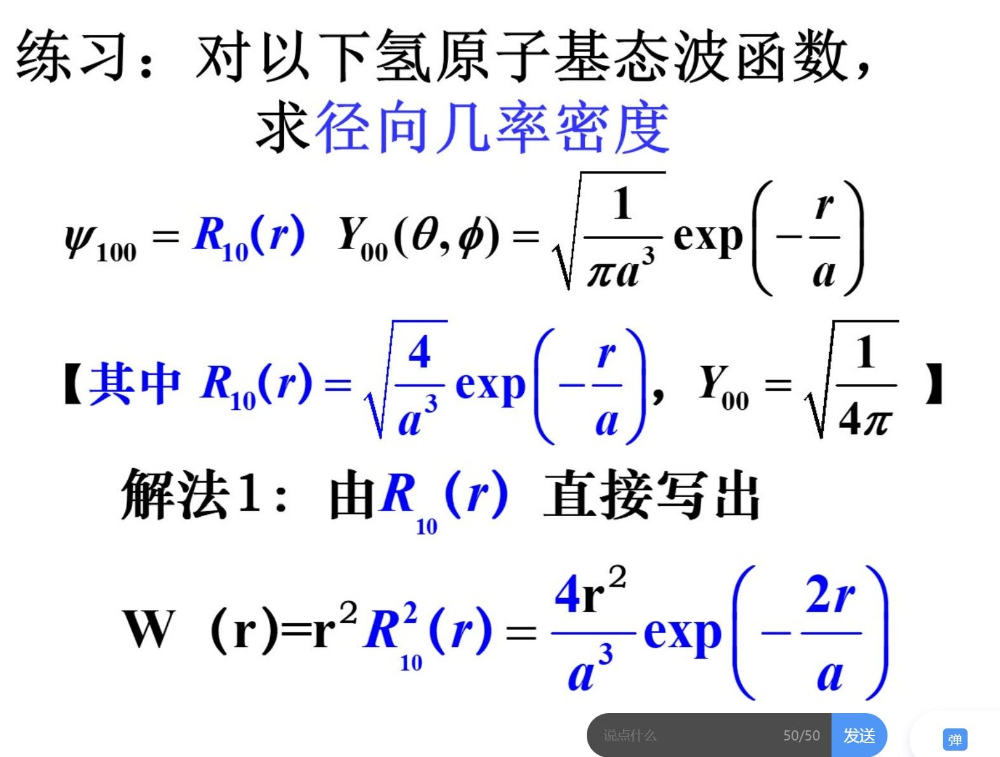
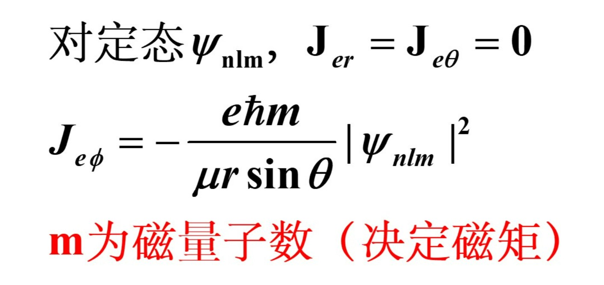

## 量子力学

### 第一章 引言

光的粒子性：
* 黑体辐射
* 光电效应
* 康普顿散射

原子模型：能级和跃迁

电子衍射：例子的波动性

黑体辐射的解释：

#### 普朗克公式

已知

$$
P(\varepsilon_\nu = nh\nu) \propto e^{-\varepsilon_{\nu}/kT}
$$

平均光子数
$$
\overline{n} = \frac{1}{e^{hv/kT} - 1}\\
$$

又知一个光子的能量$h\nu$，模式密度（单位频率间隔的模式数）$8\pi\nu^2/c^3$，故单位体积单位频率间隔之间的能量为

$$
\rho(v) = \frac{8\pi \nu^2}{c^3}\overline{n}h\nu
$$

#### de Broglie的物质波假说和薛定谔方程

$\hbar = h/2\pi$

$$
\vec{k} = \frac{\vec p}{\hbar}, \omega = \frac{E}{\hbar}
$$

注：非相对论粒子的能量$E = p^2/2m$，光子的能量$E=cp$

**自由粒子波函数**

经典波改写：

$$
\Psi(\vec r, t) = Ae^{-i(\omega t - \vec k \cdot \vec r)} = A e^{-i(Et - \vec p \cdot \vec r)/\hbar}
$$

满足$E = p^2/2m$.

试探得到，自由粒子波函数是薛定谔方程的解：

$$
\begin{align*}
\vec p \Psi &= -i \hbar \nabla\Psi\\
\Rightarrow p^2\Psi &= -\hbar^2\nabla^2\Psi\\
\Rightarrow i\hbar\frac{\partial \Psi}{\partial t} &= E\Psi = \frac{p^2\Psi}{2m} = H\Psi\\
(H &= -\frac{\hbar^2}{2m}\nabla^2)
\end{align*}
$$

由于$E$可以被$\vec p$表示，故可以写成$\vec p$的函数：

$$
\Psi_{\vec p}(\vec r, t) = Ae^{-i[E(\vec p) t - \vec p \cdot \vec r]/\hbar}
$$

$\Psi(\vec r, t) = \sum_{\vec p} C_{\vec p}\Psi_{\vec p}(\vec r, t)$满足薛定谔方程。

如果有势能项，薛定谔方程改为：

$$
i\hbar\frac{\partial \Psi}{\partial t}= H\Psi = -\frac{\hbar^2}{2m}\nabla^2\Psi(\vec r, t) + V(\vec r)\Psi(\vec r, t)\\
$$

这里

$$
H = -\frac{\hbar^2}{2m}\nabla^2 + V(\vec r) \equiv \frac{\hat p^2}{2m} + V(\vec r)
$$

引入了动量算符（量子化假设）$\hat p = -i\hbar \nabla$

注：从薛定谔方程的形式可以得知，其解的表达式里$t$前面的系数肯定含$-i$。如果含$i$，是不满足薛定谔方程的。

#### 从经典到量子的过渡

**以一维单粒子为例：**

牛顿力学：

$$
p \equiv m\dot{q}\\
f = ma = m\ddot{q}
$$

保守力：

$$
f = -\frac{\partial V}{\partial q}
$$

定义哈密顿量：

$$
H(q, p) = \frac{p^2}{2m} + V(q)
$$

从而牛顿力学可以用正则方程代替：

$$
\dot p = -\frac{\partial H}{\partial q}, \dot{q} = \frac{\partial H}{\partial p}
$$

推广到体系：

假设一个体系的运动可以用广义坐标$q_i$ $(i=1,2,\dots,n)$ 描述，拉格朗日函数为 $L(q_i, \dot{q}_i, t)$。根据哈密顿原理，体系的运动满足哈密顿正则方程。

哈密顿正则方程可表示为：

$\frac{\partial H}{\partial p_i} = \dot{q}_i, \quad \frac{\partial H}{\partial q_i} = -\dot{p}_i$

其中，$H(p_i, q_i, t)$ 是哈密顿函数，定义为：

$H(p_i, q_i, t) = \sum_{i=1}^{n} p_i\dot{q}_i - L(q_i, \dot{q}_i, t)$

其中，$p_i$ 是广义动量，定义为：

$p_i = \frac{\partial L}{\partial \dot{q}_i}$

哈密顿正则方程描述了体系在广义坐标和广义动量空间中的运动行为，从而完整地描述了体系的运动。

哈密顿函数H是否正确的判据：

如果正则方程与已知的经典力学方程一致，则此哈密顿函数是正确的。

**量子化（单粒子情况）**

$$
i\hbar\frac{\partial \Psi}{\partial t}= H\Psi = \left(-\frac{\hbar^2}{2m}\nabla^2 + V(\vec r)\right)\Psi\\
$$

$|\Psi^2|$给出了粒子在空间中的位置概率。波函数结果数学变换，还能够给出各个力学量的概率分布（例如动量概率密度分布）。

多粒子体系：

对于全同多粒子体系，还需要引入新假设（对波函数施加新限制，后面讲）。

统计物理怎样描述粒子运动？

统计物理中需要引入新假设描述极大量粒子的热运动，这种运动不能由通常的量子力学给出。

混合态：热运动的无规性会造成状态不能用一个确定的波函数描述，这种状态称为混合态（统计物理中体系的状态一般都是混合态）。

纯态：量子力学部分都默认波函数是确定的，称为纯态（它是极特殊的情况）。单个粒子的叠加态依然是纯态。

### 第二章 薛定谔方程和一维运动问题

#### 波函数及其统计解释

**波函数及其统计解释**

Born 对双缝干涉的解释：$|\Psi(\vec r, t)|^2$与概率密度成正比

$\Psi(\vec r, t)$称为概率幅，**完全描写了状态（这种描写具有统计的特征）**，它决定了各可观测的物理量的几率分布。

波函数本身不能被直接观测。

**波函数的归一化**

$|\psi(x, y, z, t)|^2$是相对几率密度。

$|\psi(x, y, z, t)|^2\mathrm{d}x\mathrm{d}y\mathrm{d}z$是t时刻出现在$x, y, z$处$\mathrm{d}x\mathrm{d}y\mathrm{d}z$体积元内的相对几率。

$$
\int_{全空间}|\psi(x, y, z, t)|^2\mathrm{d}x\mathrm{d}y\mathrm{d}z = 1
$$

为了归一化，选择新的波函数$\Psi(x, y, z, t)$

$$
\Psi(x, y, z, t) = C\psi(x, y, z, t)
$$

可得

$$
|C| = \frac{1}{\sqrt{\int_{全空间}|\psi(x, y, z, t)|^2\mathrm{d}x\mathrm{d}y\mathrm{d}z}}
$$

Remark:
* 归一化的波函数仍然有一个位相因子不能确定。**习惯上取C为正实数（相角为0）**。
* 有的波函数不能（有限地）归一。例如平面波$\Psi(x, t) = e^{-i(Et - px)/\hbar}$。$|\Psi(x, t)|^2 = 1$代表了在各处出现的机率相等。

**态的叠加原理（重要）**

若$\Psi_1, \Psi_2$是体系的可能状态，那么

$$
\Psi = c_1\Psi_1 + c_2\Psi_2
$$

也是体系的可能状态。

干涉效应：

<!-- Psi, , mathbf -->

$$
|\Psi|^2 = |c_1\Psi_1|^2 + |c_2\Psi_2|^2 + \underbrace{ c_1^*c_2\Psi_1^*\Psi_2 + c_1c_2^*\Psi_1\Psi_2^*}_{干涉项}
$$

因此，态相加不等于几率相加。

关于相位：
* 绝对常数相位没有意义
* 相对常数相位才有意义

$$
\Psi = c_1\Psi_1 + c_2\Psi_2 = e^{i\phi_1}(|c_1|\Psi_1 + |c_2|e^{\phi_2 - \phi_1}\Psi_2)\\
$$

$|\Psi|^2$依赖于$\phi_2 - \phi_1$

变化的相位是有意义的。(常数相因子可以扔掉)

$$
\Psi(\vec r, t) = |\Psi(\vec r, t)|e^{i\varphi(\vec r, t)}
$$

$\varphi(\vec r, t)$在空间几率密度上无法反映，但是在动量几率分布上可以反映出来。

**态叠加原理的一般性描述**

对于一个指定的量子体系，如果我们找到了它的“完备的基本状态集合”,那么任何状态都可以由这些基本状态叠加而得到。

$$
\Psi = \sum_n c_n \Psi_n
$$

考虑自由粒子平面波的叠加：

$$
\Psi_{\vec p}(\vec r, t) = Ae^{-i(Et - \vec p \cdot \vec r)/\hbar}
$$

自由电子的任何状态都可以写成：

$$
\Psi = \sum_{\vec p} c_{\vec p} \Psi_{\vec p}(\vec r, t)
$$

又由于动量是连续分布的，改为积分：

$$
\Psi = \int_{\infty} c({\vec p}) \Psi_{\vec p}(\vec r, t)\mathrm d^3 \vec p
$$

改写成另一种形式，把时间移到系数中：

$$
\Psi = \int_{\infty} c({\vec p, t}) \Psi_{\vec p}(\vec r)\mathrm d^3 \vec p
$$
其中
$$
c(\vec p,t) = c(\vec p)e^{-iEt/\hbar}\\
\psi_{\vec p}(\vec r) = Ae^{i\vec p \cdot \vec r/\hbar}
$$

基底称为动量本征函数，满足本征方程：$-ih\nabla \psi_{\vec p}(r) = \vec p \psi_{\vec p}(\vec r)$。$|c(\vec p,t)|^2$就是概率密度。

非自由粒子不能做第一种展开，因为含有$V(\vec r)$项。

固定时刻 $t = t_1$, 此刻波函数为$\Psi(\vec r, t_1) = \Psi(\vec r)$

则

$$
\Psi(\vec{r}) = \int\limits_{\infty}^{}c(\vec p)\Psi_{\vec p}(\vec r)\mathrm d^3\vec p
$$

利用傅里叶变换计算$c(\vec{p})$。

首先定义delta函数，其满足

$$
\delta(x - a) = \begin{cases}
    0, &x\ne a\\
    +\infty, &x = a
\end{cases}\\
\int\limits_{\infty}^{}\delta(x - a)\mathrm dx = 1
$$

或者定义为

$$
\int\limits_{\infty}^{}f(x)\delta(x - a)\mathrm dx = f(a)\int\limits_{\infty}^{}\delta(x - a)\mathrm dx  = f(a)
$$

其中$\int_\infty = \int_{-\infty}^{\infty}$

delta 函数性质：

$$
\delta(x) = \frac{1}{2\pi}\int\limits_{\infty}^{0}\exp(ikx)\mathrm dk\\
\delta(\lambda x) = \frac{1}{|\lambda|}\delta(x)\ (\delta \ne 0)
$$

利用delta函数进行傅里叶变换：

$$
\begin{align*}
\Psi(x) &= \int\limits_{\infty}^{}\Psi(x)\delta(x - x^\prime)\mathrm dx^\prime\\
&=\int\limits_{\infty}^{}\Psi(x^\prime)\left(\frac1{2\pi}\int\limits_{\infty}^{}e^{ik(x - x^\prime)}\mathrm dk\right)\mathrm dx^\prime\\
&= \int\limits_{\infty}^{}\left(\int\limits_{\infty}^{}\frac1{2\pi}\Psi(x^\prime)e^{-ikx^\prime}\mathrm dx^\prime\right)e^{ikx}\mathrm dk
\end{align*}
$$

因而

$$
c(k) = \int\limits_{\infty}^{}\frac1{2\pi}\Psi(x)\exp({-ikx})\mathrm dx\\
\Psi(x) = \int\limits_{\infty}^{}c(k)\exp(ikx)\mathrm dk
$$

记$\psi_p = \frac{1}{ \sqrt{2\pi \hbar} }\exp\left(i\frac{p}{\hbar}x\right)$

则

$$
\Psi(x) = \int\limits_{-\infty}^{\infty}c(p)\psi_p(x)\mathrm dp\\
c(p) = \int\limits_{-\infty}^{\infty}\psi_p^*(x)\Psi(x)\mathrm dx
$$

推广到三维：

$$
\Psi(\vec r) = \int\limits_{\infty}^{}c(\vec p)\Psi_{\vec p}(\vec r)\mathrm d^3\vec p\\
\psi_{\vec p} = \frac{1}{\sqrt{2\pi \hbar}^3}\exp\left(i\frac{\vec p}{\hbar} \cdot \vec r\right)\\
c(\vec p) = \int\limits_{-\infty}^{\infty}\psi_{\vec p}^*(\vec r) \Psi(\vec r)\mathrm dx\mathrm dy\mathrm dz
$$

加入时间：

$$
\Psi(\vec r, t) = \int\limits_{\infty}^{}c(\vec p, t)\Psi_{\vec p}(\vec r)\mathrm d^3\vec p\\
\psi_{\vec p} = \frac{1}{\sqrt{2\pi \hbar}^3}\exp\left(i\frac{\vec p}{\hbar} \cdot \vec r\right)\\
c(\vec p, t) = \int\limits_{-\infty}^{\infty}\psi_{\vec p}^*(\vec r) \Psi(\vec r, t)\mathrm dx\mathrm dy\mathrm dz
$$

已知$c(\vec p, t)$可以求出动量概率密度和坐标概率密度。

#### 薛定谔方程

**几率流密度**

几率密度：

$$
w(\vec{r}, t) = |\Psi(\vec{r}, t)|^2
$$

几率密度的时间变化率与某种“流”有关，类比电荷守恒方程：电荷密度的变化率等于电流密度散度的相反数。我们从薛定谔方程推导几率流密度：

$$
\begin{align*}
i\hbar \frac{\partial \Psi}{\partial t} &= -\frac{\hbar^2}{2\mu} \nabla^2\Psi + U\Psi \Rightarrow\\
    \frac{\partial w}{\partial t} &= \Psi^*\frac{\partial \Psi}{\partial t} + \Psi\frac{\partial \Psi^*}{\partial t} \\
    &= \frac{i\hbar}{2\mu}(\Psi^*\nabla^2\Psi - \Psi\nabla^2\Psi^*)\\
    &= \frac{i\hbar}{2\mu} \nabla \cdot (\Psi^*\nabla\Psi - \Psi\nabla\Psi^*)\\
\end{align*}
$$

$$
\frac{\partial w}{\partial t} + \nabla \cdot \vec J = 0
$$

从而可以定义

$$
\vec J = \frac{i\hbar}{2\mu} (\Psi\nabla\Psi^* - \Psi^*\nabla\Psi)
$$

对应的可以推积分形式：

$$
\frac{\mathrm dW_v}{\mathrm dt} = - \oint_S \vec{J} \cdot \mathrm{d} \vec S
$$

$\vec J$便于记忆可写成

$$
\vec J = \text{Re}\left[\Psi^* \mathrm {\hat v} \Psi\right]
$$

其中 $\mathrm{\hat v} = \frac{\vec{p}}{\mu}$ 称为速度算符。

可以计算电流密度

$$
\vec J_e = e\vec J = e\frac{i\hbar}{2\mu} (\Psi\nabla\Psi^* - \Psi^*\nabla\Psi)
$$

可以计算原子内部电子的电流，计算超导体等量子系统的电流。

例：平面波的几率流密度为$\vec J = w \vec v$

全空间总几率守恒：
<!-- oint j -->
$$
\frac{\mathrm d}{\mathrm dt} W = -\oint_\infty \vec J \cdot \mathrm{d}\vec S = -\frac{i\hbar}{2\mu}  \oint(\Psi\nabla\Psi^* - \Psi^*\nabla\Psi) \cdot \mathrm{d}\vec S = 0
$$

这里认为波函数在无穷远处为0.

如果粒子波函数在开始时刻是归一化的，则以后一直有归一化。

**定态**

定态波函数=定态薛定谔方程乘以时间因子

$$
\Psi(\vec r, t) = e^{-\frac{i}{h} Et}\psi(\vec r)
$$

$\psi(\vec r)$满足 $H\psi(\vec r) = E\psi(\vec r)$

**定态薛定谔方程**

$$
H\psi(\vec r) = E\psi(\vec r)
$$

$E$ 称为 $H$ 的本征值，$\psi(\vec r)$ 称为 $H$ 的本征函数。

**含薛定谔方程的一般解**

含时方程：$i\hbar \frac{\partial \Psi}{\partial t} = H\Psi$

定态方程： $H\psi(\vec r) = E\psi(\vec r)$

一般解：$\Psi(\vec r, t) = \sum_n c_n\psi_n(\vec r)e^{-\frac{i}{h}E_n t}$

定态下几率密度，几率流密度，力学几率分布和平均值都不随时间变化。

一维自由粒子定态的基本解：

$$
\psi = e^{i\frac{p}{\hbar}x} = e^{\pm ikx}(p = \pm \hbar k, k = \sqrt{\frac{2\mu E}{\hbar})}
$$

能量给定后，状态并非唯一的（能量的简并），但是动量给定后，状态却是唯一的。

**波函数应当满足以下三个条件**

* 单值性
* 有限性
* 连续性

连续性一般意味着 $\Psi$ 和 $\nabla\Psi$ 都连续，但是在势能无穷大的地方，允许 $\nabla\Psi$ 不连续。

#### 一维无限深势阱

注意，这里的能量本征态不是动量本征态！这里的动量是连续的。因为波函数在0到a的范围内为三角函数，而在范围外为0，并不是周期函数，做傅里叶变换可知动量的图谱是连续的。

#### 一维谐振子

#### 势垒穿透

### 第三章

#### 动量算符和角动量算符

**厄米算符**

$$
\int_{}^{}\psi^*(\hat F \varphi) \cdot \mathrm d\tau = \int_{}^{}(\psi\hat F)^*\varphi \cdot \mathrm d\tau
$$

厄米算符的本征值都是实数。

**一维动量本征函数**

$$
\hat p = -i\hbar \frac{\mathrm d}{\mathrm dx},\\
\hat p \psi_p = p \psi_p,\\
\psi_p = C \exp\big(\frac{ipx}{\hbar}\big)
$$

**三维动量本征函数**

$$
\psi_{\vec p}(\vec r) = \frac{1}{\sqrt{(2\pi\hbar^3)}}\exp\bigg(\frac{i}{\hbar}\vec p \cdot \vec r\bigg)\\
\int_{\infty}^{}\psi_{\vec p}^*(\vec r)\psi_{\vec p}(\vec r)\mathrm d\tau = \delta^3(\vec p - \vec p^\prime)
$$

箱归一化本征函数：

$$
\psi_{p}(-L / 2) =\psi_{p}(L/2)\\
p = \frac{2\pi \hbar}{n}, n=0, \pm1, \pm2, \dots\\
\int_{-L/2}^{L/2}\psi_{p}^*(x)\psi_{p}(x)\mathrm dx = \delta_{pp^\prime}\\
L \rightarrow \infty
$$

**角动量算符**

角动量算符的定义是：

$$
\hat {\vec L} = \hat{\vec r} \times \hat{\vec p} = -i\hbar \vec r \times \nabla\\
\hat{L_x} = 
$$

球坐标形式：

球坐标单位向量用直角坐标表示：

$$
\hat L_z = -i\hbar \frac{\partial }{\partial \varphi}
$$

本征函数：

$$
\psi_{m}(\varphi) = C \exp(im\varphi)
$$

由于单值性 $\psi_m(\varphi + 2\pi) = \psi_m(\varphi)$：

$$
m = 0, \pm1, \pm2, \dots
$$

归一化：$C = \frac{1}{\sqrt{2\pi}}$

结论：

$$
\hat L_z \psi_m = m\hbar \psi_m\\
m = 0, \pm1, \pm2, \dots
\psi_m(\varphi) = \frac{1}{\sqrt{2\pi}} \exp(im\varphi)
$$

由于空间的任意一个方向都可以为z方向，因此角动量的任一分量都可以量子化。

$$
\hat L^2 = -\hbar^2\bigg[\frac{1}{\sin \theta}\frac{\partial }{\partial \theta}\bigg(\sin\theta\frac{\partial }{\partial \theta}\bigg) + \frac{1}{\sin^2\theta}\frac{\partial^2}{\partial \varphi^2}\bigg]
$$

$$
\hat L^2Y = \lambda \hbar^2Y\\
Y(\theta, \varphi) = P(\theta)\exp(im\varphi)
$$

省流：球谐函数

$$
Y_{lm}(\theta, \varphi) = N_{lm}P_l^m(\cos \theta)\exp(im\varphi)
$$

归一化系数

$$
N_{lm} = (-1)^m\sqrt{\frac{(2l + 1)}{4\pi}\frac{(l - |m|)!}{(l + |m|)!}}
$$

勒让德函数：

$$
P(w) = \frac{1}{2^l l!}(1 - w^2)^{|m| / 2}\frac{\mathrm d^{l+|m|}}{\mathrm dw^{l+|m|}}(w^2 - 1)^l
$$

前几个球谐函数：

$$
Y_{00} = \sqrt{\frac{1}{4\pi}}\\
Y_{10} = \sqrt{\frac{3}{4\pi}}\cos \theta\\Y_{1, \pm1} = \mp \sqrt{\frac{3}{8\pi}}\sin \theta \exp(\pm i\varphi)\\
$$

$l = 1$，是 $L^2$ 和 $L_z$ 的共同本征态，但不是 $L_x$ 和 $L_y$ 的本征态,(不确定性原理决定了这三个分量不能同时有本征态)

**球谐函数的性质**

$$
\hat L^2 Y_{lm} = l(l+1)\hbar^2 Y_{lm}\\
\hat L_z Y_{lm} = m\hbar Y_{lm}\\
l = 0, 1, 2, \dots\\
m = l, l - 1, \dots, -l.
$$

正交归一性：

$$
\int Y^*_{l^\prime m^\prime}(\theta, \varphi)Y_{lm}(\theta, \varphi) \mathrm d\Omega = \delta_{l^\prime l}\delta_{m^\prime m}
$$

$$
Y^*_{lm}(\theta, \varphi) = (-1)^m Y_{l, -m}(\theta, \varphi)
$$

#### 中心力场的运动，氢原子

经典：

$$
H = \frac{1}{2}m_N\dot{\vec r_N^2} + \frac{1}{2}m_e\dot{\vec r_e^2} + U(|\vec r_e - \vec r_N|)
$$

采用质心坐标和相对坐标：

$$
\vec R = \frac{m_N\vec r_N + m_e \vec r_e}{m_N + m_e}\\
\vec r = \vec r_e - \vec r_N\\
M = m_N + m_e\\
\mu = \frac{m_Nm_e}{M}
$$

$$
H = \frac{1}{2}M\dot{\vec R^2} + \frac{1}{2}\mu \dot{\vec r^2} + U(r)\\
\rArr H = \frac{\vec p_R^2}{2M} + \frac{\vec p^2}{2\mu} + U(r)
$$

量子化：

$$
H = -\frac{\hbar^2}{2M}\nabla_R^2 - \frac{\hbar}{2\mu}\nabla^2 + U(r)
$$

相对运动的动量意义是什么？

求解氢原子波函数时，将哈密顿量分解为质心的哈密顿算符和相对坐标的哈密顿算符，然后分别求解。相对坐标对应的哈密顿算符求解得到的才是氢原子波函数。因此，**得到的氢原子的能量不包括质心运动的能量。**

省流：氢原子波函数

$$
\psi_{nlm} = R_{nl}(r) Y_{lm}(\theta, \phi)
$$

其中径向函数

$$
R_{nl}(r) = \frac{u_{nl}(r)}{r}, \rho = \alpha r\\
u_{nl}(r) = N_{nl} \rho^{l + 1}(\rho) v_{nl}(\rho) \exp(-\frac{1}{2}\rho)
$$

$$
主量子数\quad n = 1, 2, 3,\dots, \rightarrow E_n = \frac{E_1}{n^2}\\
角量子数\quad l = 0, 1, \dots, n -1, \rightarrow L^2 = l(l + 1)\hbar^2\\
磁量子数\quad m = l, l - 1, \dots, -l, \rightarrow L_z = m\hbar\\
简并度\quad g_n =\sum\limits_{l=0}^{n - 1}(2l + 1) = n^2
$$

定态波函数的宇称性质：

$$
R_nl(r) 偶函数，
$$

电子云有方向性吗？

以 $n = 2$ 为例，$Y_{00}, Y_{10}, Y_{11}, Y_{1, -1}$ 的模平方之和为常数。若氢原子随机等概率激发到 $Y_{00}, Y_{10}, Y_{11}, Y_{1, -1}$ 之一，则无方向性。但如果是相干叠加，则有方向性。

为什么 $m$ 叫做磁量子数？

$$
\vec J_e = (-e) \vec J
$$

#### 本征函数系的一般性质

**正交与归一**

正交性定理

同一个厄密算符 $\hat F$ 的属于不同本征值的本征函数是彼此正交的。

$$
\int_{}^{}\psi_1^*\psi_2\mathrm d\tau = 0
$$

本征函数的正交“归一”性

离散情况：

$$
\int_{}^{}\phi_k^*(\vec r) \cdot \phi_l(\vec r)\mathrm d\tau = \delta_{kl} = \begin{cases}
    0, k\ne l\\
    1, k = l
\end{cases}
$$

连续情况：

$$
\int_{}^{}\phi_{\lambda^\prime}^*(\vec r) \cdot \phi_{\lambda}(\vec r)\mathrm d\tau = \delta(\lambda - \lambda^\prime)
$$

并非真正的归一化，但是依然满足正交性：例如 $\frac{1}{\sqrt{2\pi \hbar}}e^{\frac{i}{\hbar}px}$。

**共同本征函数（重点）**

定义对易括号

$$
[\hat F, \hat G] \equiv \hat F\hat G - \hat G \hat F
$$

若

$$
[\hat F, \hat G] = 0 
$$

则两算符对易。

定理：

$$
[\hat F, \hat G] = 0 \Rightarrow 两个算符有组成完全系的共同本征函数
$$

$$
[\hat {p_z}, \hat {p_x}] = [\hat {p_x}, \hat {p_y}] = [\hat {p_y}, \hat {p_z }] = 0
$$

它们有共同的本征函数。

$$
[\hat {xp}, \hat {px}] = i\hbar
$$

没有共同的本征函数。

如果 $[\hat {F}, \hat {G}] \ne 0$，则不一定没有共同本征态。例如角动量的本征态 $Y_{00}$。

$$
[\hat {L^2}, \hat {L_i}] = 0\\
[\hat {L_x}, \hat {L_y}] = i\hbar \hat L_z
$$

性质：

$$
[A, BC] = [A, B]C + B[A, C]
$$

简并：力学量 $F$ 的一个本征值对应多个线性无关的本征函数。

**力学量完全集（完备算符集）**

为了消除简并，可以选取一组彼此对易的力学量 $F_1, F_2, F_3, \dots$，使得它们的本征值组 $\lambda_1, \lambda_2, \dots$ 对应唯一一个线性无关的共同本征函数 $\psi_{\lambda_1, \lambda_2, \dots}(\vec r)$

称 $F_1, F_2, F_3, \dots$ 为力学量完全集。

$$
F_k \psi_{\lambda_1, \lambda_2, \dots}(\vec r) = \lambda_k \psi_{\lambda_1, \lambda_2, \dots}(\vec r)
$$

实现了正交化：力学量完全集的共同本征函数必然为正交函数系，因为任意两个本征函数，对应的本征值必然不同，由正交性定理得知，两个本征函数必然正交。

**常见的选取方式**

对于三维空间的单粒子，可以选取为：

* $(x, y, z)$
* $(p_x, p_y, p_z)$
* $(H, L^2, L_z)$（对于氢原子适用）

考虑自旋后，还需要增加自旋力学量构成完全集。

#### 力学量的平均值公式

$$
\overline{F(t)} = \int_{}^{}\psi^*(x, t) \hat F \psi(x, t)\mathrm dx
$$

若没有归一化：

$$
\overline F = \frac{\int_{}^{}\psi^*(x, t) \hat F \psi(x, t)\mathrm dx}{\int_{}^{}\psi^*(x, t) \psi(x, t)\mathrm dx}
$$

实际上， 利用本征函数的正交性

$$
\int_{}^{}\psi^*(x, t) \hat F \psi(x, t)\mathrm dx =\sum\limits_{n}^{}\lambda_n |c_n|^2 = \overline{F}
$$

几率幅函数

$$
c_n(t) = \int_{}^{}\phi_n^*(x)\psi(x, t)\mathrm dx
$$

例题：

$$
\psi = Ae^{ikx} + Be^{-ikx}\\
$$

动量值 $\hbar k$ 与 $-\hbar k$ 的概率比值为 $\frac{|A|^2}{|B|^2}$

$$
\bar p = \hbar k  \frac{|A|^2}{|A|^2 + |B|^2} + (-\hbar k ) \frac{|B|^2}{|A|^2 + |B|^2} = \frac{|A|^2 - |B|^2}{|A|^2 + |B|^2}\hbar k
$$

#### 不确定关系

一维谐振子为例：

$$
\psi_(x) = \sqrt{\frac{\alpha}{\sqrt \pi}} e^{-\frac{1}{2}\alpha^2 x^2}\\
c_p = \sqrt{\frac{\beta}{\sqrt \pi}}e^{-\frac{\beta^2p^2}{2}}\\
\frac{1}{\alpha} \cdot \frac{1}{\beta} = \frac{1}{\hbar}\\
\alpha = \sqrt{\frac{\mu \omega}{\hbar}}
$$

不确定关系的数学表达以及证明

如果两个力学量F和G的算符彼此不对易，则它们有不相容性，测量精确度（不确定度）上一般是相互制约的。

$$
\Delta \hat F = \hat F - \overline{ } F\\
\overline{(\Delta \hat F)^2} = \overline{(\hat F - \overline{F})^2} = \overline{\hat F^2} - \overline{F}^2
$$

记 $[\hat F, \hat G] \equiv \hat F\hat G - \hat G\hat F = i\hat C$，则在任意一个状态下

$$
\overline{(\Delta \hat F)^2} \cdot \overline{(\Delta \hat G)^2} \ge \frac{1}{4}\overline{(\Delta \hat C)^2}
$$

这里 $\hat F$ 与 $\hat G$ 都是厄密算符，所以 $\overline{\hat C}$ 为实数

引入

$$
I(\xi) = \int_{}^{}\left | (\xi\Delta \hat F - i\Delta \hat G  )\psi^2\right|^2\mathrm d\tau \ge 0
$$

$$
\begin{align*}
    I(\xi) =& \xi^2\int_{}^{}(\Delta \hat F \psi)^* (\Delta \hat F \psi)\mathrm d\tau - i\xi \int_{}^{}[(\Delta \hat F \psi)^*(\Delta \hat G \psi) - (\Delta \hat G \psi)^*(\Delta \hat F \psi)]\mathrm d\tau + \int_{}^{}(\Delta \hat G\psi)^*(\Delta \hat G\psi)\mathrm d\tau\\
    =& \xi^2 \int_{}^{}\psi^*(\Delta \hat F)^2\psi\mathrm d\tau - i\xi \int_{}^{}\psi^*\Delta\hat F\Delta \hat G\psi - \psi^*\Delta \hat G\Delta \hat F\psi\mathrm d\tau + \int_{}^{}\psi^*(\Delta \hat G)^2 \psi\mathrm d\tau\\
    =& \overline{(\Delta \hat F)^2} \cdot \xi^2 - i\overline{\Delta \hat F\Delta \hat G - \Delta \hat G \Delta \hat F}\cdot \xi + \overline{(\Delta \hat G)^2}\\
    =& \overline{(\Delta \hat F)^2} \cdot \xi^2 - i [\hat {\Delta F}, \hat {\Delta G}]\xi + \overline{(\Delta \hat G)^2}\\
    =& \overline{(\Delta \hat F)^2} \cdot \xi^2 - i [\hat { F}, \hat { G}]\xi + \overline{(\Delta \hat G)^2}\\
    =& \overline{(\Delta \hat F)^2} \cdot \xi^2 - i [\hat {\Delta F}, \hat {\Delta G}]\xi + \overline{(\Delta \hat G)^2}\\
    =& \overline{(\Delta \hat F)^2} \cdot \xi^2 - \overline{\hat C}\xi + \overline{(\Delta \hat G)^2}
\end{align*}
$$

由于此式恒正，判别式大于0：

$$
I(\xi) \ge 0 \Rightarrow \overline{(\Delta \hat C)}^2 - 4\overline{(\Delta \hat F)^2}\cdot \overline{(\Delta \hat G)^2} \ge 0
$$

$$
\overline{(\Delta \hat F)^2} \cdot \overline{(\Delta \hat G)^2} \ge \frac{1}{4}\overline{(\Delta \hat C)^2}
$$

如果要满足取等号条件：

$$
(\xi \Delta \hat F - i \Delta \hat G)\psi = 0
$$

此时的波包称为最小不确定波包

位置动量不确定关系：

$$
\overline{(\Delta \hat x)^2} \overline{(\Delta \hat p_x) ^2} \ge \frac{\hbar^2}{4}
$$

非零的“零点能”是不确定性关系的结果。

$$
\overline E = \frac{1}{2\mu}\overline{(\Delta \hat p_x)^2} + \frac{1}{2}\mu \omega\overline{(\Delta \hat x)^2} \ge \frac{1}{2}\hbar\omega\\
\overline E_{min} = \frac{1}{2}\hbar\omega\\
$$

势垒穿透问题：谈论某一点的动能 T 和总能量 E 没有意义，因为 $\hat x, \hat T, \hat H$ 彼此不对易。

$H, T, U$ 三个物理量之间彼此不对易，不能同时具有确定的值。故 $H = T + U$ 只是一个算符的等式。
* 若为定态，则 $H$ 确定而 $T, U$ 不确定
* 若位置确定，则 $U$ 确定但是 $T$ 和 $E$不确定

求平均值：

$$
\overline H = \overline{ T} + \overline U
$$

$T$ 的本征值为非负实数，所以

$$
\overline{H} \ge \overline{ U}
$$

角动量 $Y_{00}$ 情形下，三个分量都具有确定的取值，三个角动量分量都为 0，还是满足不确定性关系。

#### 守恒量

要求任意态下 $F$ 平均值不变。

平均值的时间演化

$$
\hat H = i\hbar \frac{\partial }{\partial t}
$$

若算符 $\hat F$ 不显含时间，则

$$
\frac{\mathrm d}{\mathrm dt} \overline{F} = \frac{1}{i\hbar} \overline{[\hat {F}, \hat {H}]}
$$

若 $\hat F(t)$ 显含时间，则

$$
\frac{\mathrm d}{\mathrm dt} \overline{F} = \frac{1}{i\hbar} \overline{[\hat {F}, \hat {H}]} + \overline{\frac{\partial }{\partial t}\hat F(t)}
$$

### 第四章

####  狄拉克算符和谐振子升降算符
计算本征值问题

谐振子：

$$
H = \hbar \omega \frac{1}{2} \left ( \frac{p^2}{m\hbar\omega} + \frac{m\omega^2x^2}{\hbar\omega} \right)\\
\alpha \equiv \sqrt{\frac{m\omega}{\hbar}}\\
p^\prime = \frac{1}{\hbar \alpha}p\\
x^\prime = \alpha x\\
[\hat {x^\prime}, \hat {p^\prime}] = i
$$

$$
H = \hbar\omega\frac{1}{2}[(x^\prime - ip^\prime)(x^\prime + ip^\prime) + 1]\\
p^\prime = -i \frac{\mathrm d}{\mathrm dx^\prime}
$$

基态满足

$$
(x^\prime + ip^\prime)\psi_0(x) = 0
$$

通过升算符算出激发态

$$
\psi_n = C_n (x^\prime - ip^\prime)^n\psi_0(x)
$$

换元：

$$
a = \frac{x^\prime + ip^\prime}{\sqrt{2}}\\
a^+ = \frac{x^\prime - ip^\prime}{\sqrt{2}}\\
H = \hbar \omega(a^+a + \frac{1}{2}) = \hbar \omega(\hat N + \frac{1}{2})\\
[a, a^+] = 1
$$

设 $\hat N$ 的本征矢为 $\ket{n}$，称$n$为占有数。可以看出这本征矢也是能量的本征态。

接下来计算 $\hat N$ 的本征矢：

$$
\langle \hat N \rangle = \bra{n}a^+a\ket{n} \ge 0\\
\bra{n}a^+a\ket{n} = n \langle n|n \rangle\\
\Rightarrow n \ge 0
$$

如果存在 $n = 0$ 的态：

$$
\bra{0}a^+a\ket{0} = 0\\
\Rightarrow a\ket{0} = 0
$$

这就是基态满足的微分方程。解出基态的坐标表象：

$$
(\alpha x + \frac{1}{\alpha} \frac{\mathrm d}{\mathrm dx})\psi_0(x) = 0
$$

重点：升降性质

$a\ket{n} = \ket{\phi} = \ket{n - 1}$ 也是本征态。

$$
\hat N \ket{\phi} = (a^+a)\ket{\phi} = (aa^+ - 1)\ket{\phi} = (aa^+ - 1)a\ket{n} = aa^+a\ket{n} - a\ket{n} = a\hat N\ket{n} - a\ket{n} = na\ket{n} - a\ket{n} = (n - 1)\ket{\phi}
$$

归一化：

$$
\ket{\phi} = c\ket{n - 1}\\
1 = \langle n - 1 |n - 1 \rangle = \frac{1}{|c|^2}(an, an) = \frac{1}{|c|^2}\bra{n}a^+a\ket{n} = \frac{n}{|c|^2}\\
取 c = \sqrt{n}\\
a\ket n = \sqrt{n}\ket{n - 1}
$$

升降算符（重点）：

$$
a\ket n = \sqrt{n}\ket{n - 1}\\
a\ket{0} = 0\\
a^+\ket{n} = \sqrt{n + 1}\ket{n + 1}
$$

$n$ 必为整数。

能级：

$$
H = \hbar \omega(a^+a + \frac{1}{2})\\
E_n = \hbar\omega(n + \frac{1}{2})
$$

波函数：

$$
\ket n = \frac{1}{\sqrt{n}}a^+\ket{n - 1} = \frac{1}{\sqrt{n!}}a^{+n}\ket{0}\\
\psi_n(x) = \frac{1}{\sqrt{n!}}\left (\frac{1}{\sqrt{2}}\left (\alpha x - \frac{1}{\alpha}\frac{\mathrm d}{\mathrm dx}  \right)  \right)^n \frac{\sqrt{\alpha}}{\pi^{1/4}}e^{-\alpha^2x^2/2}
$$

相干态：满足 $\hat a \ket \beta = \beta \ket \beta$ 的 $\ket \beta$。

#### 海森堡方程

力学量算符含时，波函数不含时

$$
\bra{\psi(t)} F\ket {\psi(t)} \rightarrow \bra{\psi_H}F_H(t)\ket{\psi_H}
$$

不同图景在物理上等价

$$
\Psi(\vec r, t) = e^{-\frac{i}{\hbar}Ht}\Psi(\vec r, 0)\\
\ket{\psi(t)} = U\ket {\psi(0)}
$$

力学量平均值

$$
\overline{F} = \bra{\psi(t)}F\ket{\psi(t)} = \bra{\psi(0)}U^+FU\ket{\psi(0)} = \bra{\psi_H}F_H(t)\ket{\psi_H}
$$

海森方程

$$
F_H = U^+(t)FU(t), U = e^{-\frac{i}{\hbar}Ht}, U^+ = e^{\frac{i}{\hbar}Ht}\\
\frac{\mathrm d}{\mathrm dt}U = \frac{1}{i\hbar}HU, \frac{\mathrm d}{\mathrm dt}U^+ = -\frac{1}{i\hbar}HU^+, \\
\frac{\mathrm d}{\mathrm dt}F_H = \frac{1}{i\hbar}[F_H, H]\\
\frac{\mathrm d\ket{\psi}_H}{\mathrm dt} = 0
$$

$$
HU = UH
$$

从经典到量子：

$$
\dot q = \frac{1}{i\hbar}[q, H]\\
\dot p = \frac{1}{i\hbar}[p, H]\\
[q, p] = i\hbar
$$

#### 自旋

用标量波函数 $\Psi(\vec r, t)$ 描述是否完整？

经典力学给出了轨道磁矩和磁势能

$$
\vec M_L = -\frac{e}{2m_e}\vec L\\
U = - \vec M \cdot \vec B
$$

磁矩的最小单元(Bohr磁子)

$$
M_B \equiv \frac{e\hbar}{2m_e}
$$

Stern-Gerlach 实验：即使是 $l = 0$ 的 $s$ 态原子也会在磁场中偏转。认为电子除了轨道磁矩，还有自旋磁矩。

自旋磁矩只有两个可能的值：

$$
M_B \equiv \frac{2\hbar}{2m_e}\\
M_z = \pm M_B
$$

Uhlenbeck-Goudsmit假设(1925)：电子有内禀（自旋）角动量，其投影只能取两个值：

$$
S_i = \pm \frac{\hbar }{2}, i = x, y , z
$$

自旋磁矩：

$$
\hat {\vec M_s} = -\frac{e}{m_e}\hat{\vec S}
$$

自旋有纯量子力学的起源。没有经典对应，独立于之前学过的所有力学量。

自旋的分量只有两个可能的测量值，因此可以使用 $2\times 2$ 的矩阵描写。

$S_z$的本征值为 $\pm \frac{\hbar}{2}$，采用 $S_z$ 表象，则 $S_z = \frac{\hbar}{2}\begin{pmatrix}
    1 &0\\
    0 &-1
\end{pmatrix}$

根据角动量的对易关系（假设的）

$$
[S_x, S_y] = i\hbar S_z\\
[S_y, S_z] = i\hbar S_x\\
[S_z, S_x] = i\hbar S_y
$$

可以导出 $S_x$ 和 $S_y$

$$
S_x = \frac{\hbar}{2}\begin{pmatrix}
    0 & 1\\
    1 & 0
\end{pmatrix}\\
S_y = \frac{\hbar}{2}\begin{pmatrix}
    0 & -i\\
    i & 0
\end{pmatrix}\\
S_z = \frac{\hbar}{2}\begin{pmatrix}
    1 & 0\\
    0 & -1
\end{pmatrix}\\
$$

三个分量不对易，最多只有一个分量具有确定的取值

$$
S_x^2 = S_y^2 = S_z^2 = \frac{\hbar^2}{4}\\
S^2 = \frac{3\hbar^2}{4} = s(s + 1)\hbar^2\\
(s = \frac{1}{2})\\
[S^2, S_i] = 0
$$

自旋是内部基本构造，不同于先前学过的力学量，不能写成 $F(\vec r, \vec p)$ 的形式

自旋也不能简单看成绕自身某个轴的旋转（电子被当作“点粒子”，自旋不同于经典物体的旋转，量子自旋没有经典的对应）

带有自旋的电子波函数（自旋 + 空间坐标）

$$
v_+ = \begin{pmatrix}
    1\\0
\end{pmatrix}
v_- = \begin{pmatrix}
    0\\1
\end{pmatrix}

\Psi(\vec r, t) \cdot v_+ + \Psi_2(\vec r, t) \cdot v_-
$$

波函数有两个自旋分量（类比于电磁波有两个偏振分量）

又被称为旋量波函数

$$
\Psi = \begin{pmatrix}
    \Psi_1(\vec r, t)\\
    \Psi_2(\vec r, t)
\end{pmatrix}\\
w(\vec r, t) = \Psi^+\Psi = |\Psi_1|^2 + |\Psi_2|^2\\
\int_{}^{}\Psi^+\Psi\mathrm d\tau = \int_{}^{}(|\Psi_1|^2 + |\Psi_2|^2)\mathrm d\tau = 1
$$

自旋角动量的几率分布

$$
W \left ( \frac{\hbar}{2} \right) = \int_{}^{}|\Psi_1|^2\mathrm d\tau\\
W \left ( -\frac{\hbar}{2} \right) = \int_{}^{}|\Psi_2|^2\mathrm d\tau\\
$$

### 第五章 微扰论

$$
\hat H \psi_n = E_n \psi_n\\
\hat H = \hat H^{(0)} + \hat H^\prime
$$

作逐级展开：

$$
\psi_n = \psi_n^{(0)} + \psi_n^{(1)} + \psi_n^{(2)} + \cdots\\
E_n = E_n^{(0)} + E_n^{(1)} + E_n^{(2)} + \cdots\\
$$

得到零级，一级，二级方程

$$
\hat H^{(0)} \psi_n^{(0)} = E_n^{(0)}\psi_n^{(0)}\\
(\hat H^{(0)} - E_n^{(0)}) \psi_n^{(1)} = -(\hat H^\prime - E_n^{(1)})\psi_n^{(0)}\\
(\hat H^{(0)} - E_n^{(0)}) \psi_n^{(2)} = -(\hat H^\prime - E_n^{(1)})\psi_n^{(1)} + E_n^{(2)}\psi_n^{(0)}\\
$$

结论：能级一级修正

$$
E_n^{(1)} = H^\prime_{nn} = \int_{}^{}\psi_n^{(0)*}\hat{H}^\prime\psi_n^{(0)}\mathrm d\tau
$$

波函数一级修正

$$
\psi_n(x) = \psi_n^{(0)}(x) + \psi_n^{(1)}(x)\\
\psi_n^{(1)}(x) =\sum\limits_{m\ne n}^{}\frac{H_{mn}^\prime}{E_n^{(0)} - E_m^{(0)}}\psi_m^{(0)}(x)
$$

适用条件：

$$
\frac{H_{mn}^\prime}{E_n^{(0)} - E_m^{(0)}} << 1
$$

## 习题课

### 20231028

#### 量子力学基本公理

公理1：希尔伯特空间

公理2：可观测量

公理3：位置与动量（正则量子化）

公理4：薛定谔方程

公理5：全同粒子（略：讲统计时会讲）

概率流密度的公式并不本质。根据薛定谔方程、概率密度公式、连续性方程可以推出。

全空间概率密度$w(t)$不是 $x$ 的函数。

要写盒外波函数为0.

对任意的束缚的能量本征态, 动量的平均值是 0.

$$
[\hat {x}, \hat {H}] = [\hat {x}, \hat {p}^2/2\mu] = \frac{1}{2\mu}(\hat p[\hat {x}, \hat {p}] + [\hat {x}, \hat {p}]\hat p) = \frac{i\hbar}{\mu}\hat p
$$

$$
\int_{-\infty}^{\infty}e^{-\alpha x^2 + \beta x}\mathrm dx = \sqrt{\frac{\pi}{\alpha}}e^{\beta^2/4\alpha}
$$

